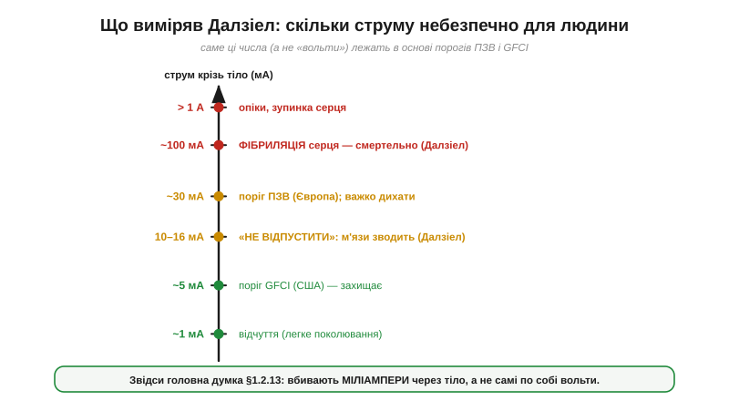
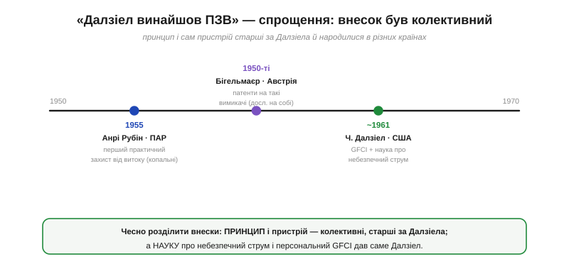

# 📜 Чарльз Далзіел: людина, що виміряла небезпечний струм

> Історична вставка про те, звідки взялися числа [струмової безпеки](topic:physics/current-safety): ~10–16 мА «не відпустити», ~100 мА — фібриляція, поріг ПЗВ 30 мА (чи 5 мА в США). Звідки саме ці значення? Їх **виміряла** конкретна людина — американський інженер Чарльз Далзіел. А заразом розберемо поширений міф, ніби він «винайшов ПЗВ»: правда тут цікавіша й чесніша.

## Питання, на яке ніхто не мав числа

Довго про електрику казали просто: «небезпечно, бо вб'є». Та інженерові цього мало. Щоб **захистити** людину, треба знати точно: за якого струму вже не розтиснеш руку? Що саме вбиває — сила струму, його тривалість, шлях? Без чисел будь-який запобіжник — навмання. А чисел не було: проводити досліди на людях моторошно, а тварини й людина реагують по-різному. Тож межа між «лоскоче» й «убиває» лишалася туманною плямою.

## Далзіел і його холодні числа

Заповнити цю пляму взявся **Чарльз Далзіел** (*Charles F. Dalziel*, 1904–1986), професор електротехніки Каліфорнійського університету в Берклі. Десятиліттями він методично, обережно й етично міряв, що струм робить із тілом. Найвідоміший його результат — **поріг «не відпустити»** (*let-go current*): сила струму, за якої м'язи руки зводить так, що людина вже **не може сама розтиснути** долоню й відпустити провідник. Далзіел установив його експериментально (на добровольцях, яких будь-якої миті можна було безпечно звільнити): близько **16 мА для чоловіків і 10.5 мА для жінок**. Вище цього — пастка: рука сама стискається на дроті.

*Драбина небезпечного струму. ~1 мА — ледь відчутно; ~5 мА — поріг американського GFCI; 10–16 мА — «не відпустити» (м'язи зводить); ~30 мА — поріг європейського ПЗВ; ~100 мА — фібриляція серця, смертельно. Саме ці числа, а не «вольти», задають пороги захисту.*

Він пішов і далі: визначив поріг **відчуття** (близько 1 мА), а головне — **фібриляції шлуночків серця**, від якої й настає смерть. І зробив ключове відкриття: важить не лише сила струму, а й **тривалість** — короткий імпульс серце може пережити, а та сама сила надовго — ні. Тобто небезпека — це струм × час, а не страшна цифра на табличці з вольтами.

Окрема його заслуга — **частотна** залежність. Далзіел показав, що звичний промисловий струм **50–60 Гц** для серця чи не найпідступніший: саме на цих частотах поріг фібриляції найнижчий — гірше, ніж від постійного струму чи високих частот. Це і пояснює, чому [змінний струм](topic:physics/dc-vs-ac) 50 Гц небезпечніший за постійний. А зв'язавши **силу** удару з його **тривалістю** (що довше тіло під струмом, то менший струм уже здатний вбити), він фактично пояснив, чому рятівний пристрій мусить не лише мати низький поріг, а й спрацьовувати **за частки секунди**.

## Чому ці числа врятували незліченні життя

Виміряти небезпеку точно — означало вперше дати інженерам **мішень**. Якщо «не відпустити» починається з ~10 мА, а фібриляція — близько сотні, то рятівний пристрій мусить вимикатися **значно нижче** й **дуже швидко**. Звідси й сучасні пороги: 30 мА в Європі, ще чутливіші ~5 мА для персональних розеток у США. Свою наукову позицію Далзіел виклав 1961 року в доповіді «Згубна дія електричного удару» (*Deleterious Effects of Electric Shock*) у Женеві — і саме там обґрунтував поріг близько 5 мА для персонального захисту, безпечний навіть для дитини. А тоді й сам узявся за прилад: розробив і запатентував **GFCI** (*ground-fault circuit interrupter*) — той самий низькопороговий [захисний пристрій](topic:physics/current-safety/comp-rcd.md), що нині стоїть у кожній «мокрій» розетці Північної Америки.

> 🔧 **Навіщо це.** Кожен раз, коли в даташиті ПЗВ ви бачите «30 мА» чи «5 мА», ви читаєте Далзіелові виміри. Це рідкісний випадок, коли за сухим числом стандарту стоять конкретні досліди конкретної людини. І це нагадування інженерові: **спершу виміряй небезпеку — тоді проектуй захист**, а не навпаки.

## «Винайшов ПЗВ»? Чесніше — ні

А тепер — про міф. Далзіела часто називають «винахідником ПЗВ». Це приємне спрощення, але неточне, і варто розкласти все по поличках, бо так чесніше.

*Принцип і перші практичні пристрої — старші за Далзіела й з різних країн: Рубін (ПАР, 1955, копальні), Бігельмаєр (Австрія, патенти 1950-х). Далзіелів унесок інший і теж величезний: наука про небезпечний для тіла струм і персональний GFCI (США, ~1961).*

Сам **принцип** — порівняти струм «туди» й «назад» і спіймати витік — і перші практичні пристрої захисту від витоку з'явилися **раніше** за Далзіелів GFCI й **не в однієї людини**:

- **Анрі Рубін** (*Henri Rubin*), інженер південноафриканської компанії C.J. Fuchs Electrical Industries, ще **1955 року** створив перший практичний високочутливий пристрій захисту від витоку — спершу на холодному катоді, потім на магнітному підсилювачі (core-balance). Його ставили в золотих копальнях ПАР, де ураження струмом було страшною бідою.
- Австрійський фізик **Готфрід Бігельмаєр** (*Gottfried Biegelmeier*) від 1950-х патентував такі вимикачі — і, до речі, теж проводив досліди над дією струму **на собі**.
- А найперші патенти на диференційний захист від витоку сягають іще початку XX століття.

Тож чесна картина така. **Пристрій і його принцип** — здобуток колективний і старший за Далзіела (Рубін, Бігельмаєр та інші, у різних країнах). А **Далзіелів** внесок — інший, але не менш вагомий: він дав **науку** про те, який струм небезпечний для людського тіла, і на її основі — **низькопороговий персональний GFCI** для США. Одне не применшує іншого; просто це **різні** заслуги різних людей, і зливати їх в одне «винайшов ПЗВ» несправедливо до решти.

## Що лишилося нам

Далзіелові числа пережили його й живуть у кожному стандарті безпеки: саме вони пояснюють, чому вбивають **міліампери через тіло**, а не «вольти»; чому пороги ПЗВ — 30 і 5 мА; чому важить тривалість, а отже, ПЗВ мусить рвати коло за **мілісекунди**. У кожній ванній і на кожному вуличному щитку стоїть пристрій, налаштований на його виміри.

А ще лишився урок ширший за електрику. По-перше: щоб надійно захистити — спершу **точно виміряй небезпеку**; наука передує інженерії безпеки. По-друге: великі рятівні винаходи майже ніколи не належать одній людині чи одній країні — тут зійшлися Берклі, південноафриканські копальні й австрійські патенти. Визнавати **всіх** причетних — теж частина чесної інженерної культури.
