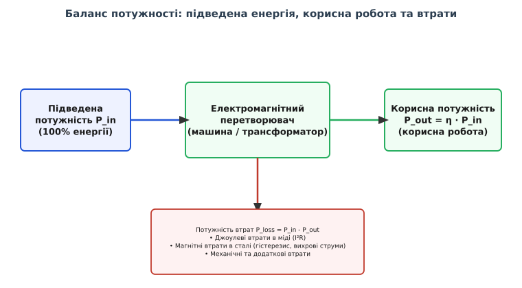
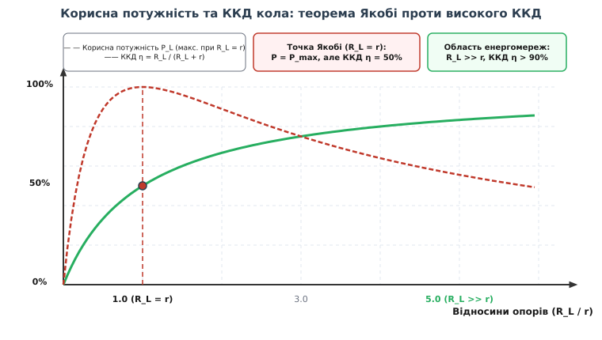
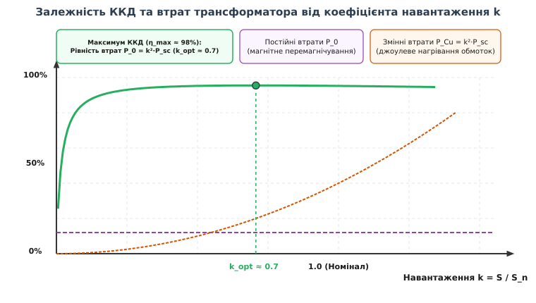

# Коефіцієнт корисної дії

<preknowlist>
- [Закон Ома](topic:physics/closed-circuit) — зв'язок між напругою, струмом і опором у замкненому колі.
- [Закон Джоуля — Ленца](topic:physics/joule-heating) — виділення теплової потужності на активному опорі провідника.
- [Електрична потужність](topic:physics/electric-power) — співвідношення між роботою струму, напругою та струмом за одиницю часу.
- [Закон збереження енергії](topic:physics/charge-conservation) — фундаментальний принцип, за яким енергія перетворюється з одного виду в інший без зміни загальної суми.
</preknowlist>

Вересень 1882 року, Мангеттен, перша у світі комерційна центральна електростанція Томаса Едісона на Перл-стріт. Шість гігантських динамо-машин «Мамочка» (Jumbo) загальною потужністю 500 кВт живлять 10 000 ламп розжарювання через мідні кабелі, зариті під бруківкою. Але вже за кілька сотень метрів від станції напруга падає зі 110 В до 80 В, а масивні мідні шини під землею розігріваються до 60 °C, марно віддаючи понад 40% згенерованої вугіллям енергії на нагрівання ґрунту. Едісон зіткнувся з фундаментальною стіною електротехніки: якщо джерело енергії та лінії передачі розсіюють значну частку потужності всередині себе, лише мала частина первинного палива перетворюється на корисне світло чи механічну роботу. Величина, яка описує цю частку, зветься **коефіцієнтом корисної дії** (ККД).

## 1. Енергетичний баланс та термодинамічні межі

У будь-якому фізичному пристрої чи колі, де відбувається перетворення енергії (електричної на механічну, хімічну на електричну, магнітної на теплову), діє Перший закон термодинаміки — закон збереження енергії. Повна підведена енергія `W_in` (або вхідна потужність `P_in`) завжди строго дорівнює сумі корисної енергії `W_out` (потужності `P_out`), витраченої на виконання цільової роботи, та енергії втрат `W_loss` (потужності втрат `P_loss`):

```
P_in = P_out + P_loss
```

Коефіцієнт корисної дії (позначається грецькою літерою `η` — «ета», від латинського *efficientia*) визначається як відношення корисної потужності до повної підведеної потужності:

```
η = P_out / P_in = P_out / (P_out + P_loss) = 1 - (P_loss / P_in)
```

ККД є безрозмірною величиною й виражається у частках одиниці (від 0 до 1) або у відсотках (від 0% до 100%).


*Баланс потужності електромагнітної системи: вхідна енергія розділяється на корисне навантаження та паразитивні теплові й механічні втрати.*

### Термодинаміка незворотних процесів та генерація ентропії

З Другого закону термодинаміки випливає, що у будь-якому реальному макроскопічному процесі перетворення енергії ККД фундаментально не може сягати 100% (`η < 1`). У нерівноважній термодинаміці (теорема Ларса Онсагера та Іллі Пригожина про мінімум генерації ентропії у стаціонарному стані) будь-який проходження струму через опір, перемагнічування феромагнетика чи вихрове омивання провідника супроводжується позитивною швидкістю генерації ентропії:

```
dS / dt = ∑ (J_i · X_i) > 0
```

де `J_i` — термодинамічні потоки (електричний струм, тепловий потік, потік магнітної індукції), `X_i` — відповідні сопряжені термодинамічні сили (градієнт потенціалу, градієнт температури, напруженість поля). Будь-який електричний струм у провідникові із зіткненнями носіїв заряду чи механічний рух ротора супроводжуються генерацією ентропії та незворотною дисипацією частини впорядкованої енергії в хаотичне теплове коливання атомів.

Якщо пристрій перетворює теплову енергію в електричну чи механічну (наприклад, термоелектрогенератор чи парова турбіна електростанції), його ККД додатково обмежений граничним ККД циклу Карно:

```
η_max = 1 - (T_c / T_h)
```

де `T_h` — абсолютна температура гарячого джерела, `T_c` — температура холодного приймача. Для електромеханічних та електромагнітних пристроїв (трансформаторів, генераторів, двигунів) первинне джерело енергії вже є електричним чи механічним, тому межа Карно на них не поширюється, і їхній ККД може сягати 95–99%, стримуючись лише дисипативними втратами на джоулів нагрів, магнітний гістерезис та тертя.

### Енергетичний та ексергетичний ККД

У сучасній термоекономіці розрізняють два підходи до оцінки ефективності:
- **Першозаконний (енергетичний) ККД (`η_1st`)**: вираховує співвідношення кількостей енергії незалежно від її фізичної якості. За цим показником звичайний електричний конвектор має ККД 100%, бо весь струм перетворюється на тепло.
- **Другозаконний (ексергетичний) ККД (`η_ex`)**: оцінює збереження при придатності енергії виконувати корисну роботу (ексергії `E`). Оскільки електрична енергія є високопотенційною (100% ексергії), а низькотемпературне тепло при 30 °C має ексергетичний потенціал лише близько 5–8%, ексергетичний ККД прямого електронагрівача становить менше 8%. Використання теплового насоса з електроприводом дозволяє підняти коефіцієнт перетворення (COP) до 3.0–4.5, що дає ексергетичний ККД понад 45–50%.

> 🔧 **Навіщо це.** ККД — це головний критерій економічної та технічної доцільності будь-якої енергетичної установки. У масштабах сучасної цивілізації, де понад 60% усієї електроенергії споживається електричними двигунами та силовою електронікою, підвищення середнього ККД обладнання всього на 1% зберігає гігавати потужності електростанцій та мільйони тонн палива.

## 2. Дволикість замкненого кола: Теорема Якобі проти максимального ККД

У теорії електричних кіл існує фундаментальне непорозуміння, з яким зіткнулися ще піонери електротехніки у XIX столітті: плутанина між режимом **максимальної корисної потужності** та режимом **максимального ККД**.

Розглянемо найпростіше коло постійного струму, що складається з джерела ЕРС `E` з внутрішнім опором `r` та навантаження з опором `R_L`. Згідно із [законом Ома для замкненого кола](topic:physics/closed-circuit), струм у колі дорівнює:

```
I = E / (R_L + r)
```

Обчислимо корисну потужність `P_L`, яка виділяється на навантаженні, та повну потужність `P_tot`, що виділяється в усьому колі джерелом:

```
P_L = I² · R_L = E² · R_L / (R_L + r)²

P_tot = I · E = E² / (R_L + r)
```

Звідси ККД джерела струму як функція опору навантаження `R_L` має вигляд:

```
η = P_L / P_tot = R_L / (R_L + r) = 1 / (1 + (r / R_L))
```

Ввівши безрозмірне відношення опорів `x = R_L / r`, отримаємо зручну форму запису:

```
η(x) = x / (1 + x)
```

З цієї формули видно дві протилежні фізичні границі поведінки кола:
1. Коли опір навантаження малий (`R_L << r`, `x → 0`, режим близький до короткого замикання), струм у колі великий, але майже вся енергія виділяється всередині джерела на опорі `r`. ККД прямує до нуля (`η → 0`).
2. Коли опір навантаження прямує до нескінченності (`R_L >> r`, `x → ∞`), ККД прямує до 100% (`η → 1`). Струм у колі стає дуже малим, джерело майже не гріється, і практично уся згенерована енергія дістається навантаженню.

Проте що відбувається з **абсолютною величиною** корисної потужності `P_L`? Математичний аналіз функції `P_L(R_L)` показує, що вона має екстремум (максимум) у точці, де опір навантаження дорівнює внутрішньому опору джерела (`R_L = r`). Цей факт зветься **теоремою Якобі** (або теоремою про максимальну передачу потужності / узгодження навантаження).


*Залежність корисної потужності P_L та ККД η від відношення опорів R_L / r. У точці Якобі (R_L = r) потужність максимальна, але ККД становить лише 50%.*

У точці узгодження `R_L = r` ККД кола становить строго 50%:

```
η = r / (r + r) = 1/2 = 50%
```

Це означає, що при максимальній передачі потужності **рівно половина** згенерованої джерелом енергії марно витрачається на внутрішнє нагрівання самого джерела!

### Комплексне узгодження в колах змінного струму

У колах змінного струму теорема Якобі узагальнюється на комплексні імпеданси `Z_source = r + j·X_source` та `Z_load = R_L + j·X_load`. Умовою максимальної передачі потужності є комплексне сопряження імпедансів:

```
R_L = r   та   X_load = -X_source
```

У колах високої частоти (ВЧ та НЧ лініях передачі) неузгодження імпедансів створює відбиту хвилю з коефіцієнтом відбиття `Γ = (Z_load - Z_0) / (Z_load + Z_0)`, що призводить до виникнення стоячих хвиль (КСВ, *VSWR*) та падіння переданої ефективності.

Цей дуалізм ділить усю електротехніку на дві великі галузі з протилежними цілями:
- **Радіотехніка, телекомунікації та електроніка обробки сигналів**: тут головна мета — передати максимальний за потужністю сигнал від антени чи підсилювача до приймача (де рівень сигналу набагато важливіший за збереження мікроватів енергії). У цих системах навмисно роблять `R_L = r` (узгодження імпедансів), погоджуючись із ККД на рівні 50%.
- **Електроенергетика та силова техніка**: тут головна мета — доставити мегавати енергії з мінімальними втратами. Робота генератора чи енергомережі з ККД 50% означала б миттєве розплавлення генераторів та кабелів. Тому силові мережі завжди працюють у режимі `R_L >> r`, де ККД перевищує 90–98%, хоча струм і абсолютна потужність виявляються набагато меншими за теоретично можливий максимум Якобі.

Детальний математичний доказ теореми Якобі та виведення екстремумів наведено у вставці 🧮 [Математичний аналіз ККД та оптимізація втрат](topic:physics/efficiency/math-maximum-power-vs-efficiency.md).

## 3. Анатомія втрат в електромагнітних пристроях

Щоб підняти ККД реального електротехнічного пристрою (трансформатора, електродвигуна, генератора, індуктора), необхідно детально розібрати всі фізичні канали, якими енергія «витікає» у тепло. В електромагнетизмі ці втрати класифікують за їхньою фізичною природою на омічні, магнітні, діелектричні, випромінювальні та механічні.

### Омічні втрати в провідниках (мідні втрати)

Основою електричних машин є обмотки з міді або алюмінію. При проходженні струму `I` на активному опорі обмотки `R` виділяється джоулева потужність втрат:

```
P_Cu = I² · R
```

У кола змінного струму активний опір провідника `R_ac` виявляється вищим за опір постійному струму `R_dc`. Це зумовлено двома електродинамічними ефектами:
- **Скін-ефект (поверхневий ефект)**: змінне магнітне поле всередині провідника індукує вихрові струми, які витісняють основний струм до зовнішньої поверхні провідника. Глибина проникнення струму (товщина скін-шару `δ`) обернено пропорційна квадратному кореню з частоти `f`:

```
δ = √(2 / (2·π·f · μ · σ))
```

Для міді при частоті 50 Гц товщина скін-шару становить близько 9.3 мм (що мало впливає на тонкі дроти), але при частоті 100 кГц у імпульсних трансформаторах вона падає до 0.21 мм, роблячи товсті провідники непридатними.
- **Ефект близькості**: магнітне поле сусідніх витків обмотки перерозподіляє струм по перерізу дріту, додатково зменшуючи ефективну площу провідника й збільшуючи локальну щільність струму та теплові втрати.

Для зменшення мідних втрат використовують провідники зі збільшеним перерізом, мідь високої чистоти (безкисневу мідь OFC), а на високих частотах — сплетені з багатьох ізольованих жилок дріти (**літцендрат**, від німецького *Litzendraht*).

### Магнітні втрати в осерді (залізні втрати)

У пристроях із феромагнітними магнітопроводами (трансформатори, статори й ротори двигунів) енергія витрачається на взаємодію з магнітним матеріалом. Залізні втрати `P_Fe` складаються з двох головних частин:

1. **Втрати на гістерезис (`P_h`)**: у кожному циклі змінного струму магнітні домени феромагнетика розвертаються вздовж зовнішнього поля. Внаслідок внутрішнього тремтіння й зачеплення доменних стінок за дефекти кристалічної ґратки частина енергії перетворюється на тепло. Потужність втрат гістерезису описується формулою Штейнметца:

```
P_h = k_h · f · B_max^n
```

де `f` — частота перемагнічування, `B_max` — амплітуда магнітної індукції, `k_h` — коефіцієнт матеріалу, `n ≈ 1.6 ... 2.0`.

Для мінімізації гістерезисних втрат застосовують текстуровану електротехнічну сталь з орієнтованим зерном (**GOES**, *Grain-Oriented Electrical Steel*), у якій кристалографічні осі легко намагнічування вишикувані в напрямку магнітного потоку (текстура Госса), що зменшує площу петлі гістерезису.

2. **Втрати на вихрові струми / струми Фуко (`P_e`)**: за [законом електромагнітної індукції Фарадея](topic:physics/electromagnetic-induction), змінний магнітний потік `Φ` індукує вихрові ЕРС у суцільному об'ємі провідного залізного осердя. Ці ЕРС породжують замкнені вихрові струми Фуко, які розігрівають залізо. Потужність втрат вихрових струмів пропорційна квадрату частоти та квадрату товщини матеріалу:

```
P_e = k_e · f² · B_max² · d² / ρ
```

де `d` — товщина пластини осердя, `ρ` — питомий електричний опір матеріалу осердя.

Для пригнічення струмів Фуко осердя електротехнічних машин ніколи не роблять суцільними. Їх збирають (**шихтують**) із тонких (0.23–0.5 мм) пластин електротехнічної кремнієвої сталі, ізольованих одна від одної шаром лаку чи оксиду. Використання тонших пластин (наприклад, 0.23 мм замість 0.5 мм) зменшує втрати Фуко майже у 4 рази.

На високих частотах (від десятків кілогерців) сталь замінюють на **ферити** — керамічні магнітні діелектрики, чий опір `ρ` у мільйони разів вищий за метал, що практично повністю усуває вихрові струми. У сучасних високоефективних трансформаторах застосовують також **аморфні сплави** (аморфну сталь *metglas*) та нанокристалічні сплави (Finemet, Nanoperm), виготовлені надшвидким гартуванням розплаву зі швидкістю 10⁶ К/с. Відсутність кристалічної ґратки в аморфних метал-стрічках зменшує втрати холостого ходу на 70–80% порівняно з найкращою кремнієвою сталлю.

### Порівняльний аналіз характеристик магнітопроводів

Нижче наведено порівняльну характеристику питомих втрат `P_loss` (при 1.5 Тл, 50 Гц) для різних класів магнітних матеріалів:
- Динамо-сталь нетекстурована M330-50A (0.50 мм): `P_loss ≈ 3.3 Вт/кг`.
- Динамо-сталь текстурована GOES M105-27h (0.27 мм): `P_loss ≈ 1.05 Вт/кг`.
- Аморфний сплав Metglas 2605SA1 (0.025 мм): `P_loss ≈ 0.20 Вт/кг`.
- Нанокристалічний сплав Vitroperm 500F: `P_loss ≈ 0.12 Вт/кг`.

### Диелектричні, випромінювальні та механічні втрати

- **Диелектричні втрати (`P_diel`)**: виникають у діелектричній ізоляції високовольтних кабелів та конденсаторів під дією змінного електричного поля через періодичну поляризацію та струми витоку. Вони пропорційні куту діелектричних втрат: `P_diel = 2·π·f · C · V² · tan δ`.
- **Випромінювальні втрати (`P_rad`)**: на високих частотах частина електромагнітної енергії залишає контур у вигляді електромагнітної хвилі, що випромінюється в простір.
- **Механічні та вентиляційні втрати (`P_mech`)**: у підшипниках обертових машин виникає механічне тертя, а ротор зазнає аеродинамічного опору повітря (вентиляційні втрати).

Про те, як науковці та інженери впродовж XIX–XX століть відкривали й математично описували ці види втрат, читайте в вставці 📜 [Історія поняття ККД: від парових машин до високовольтних мереж](topic:physics/efficiency/hist-efficiency-evolution.md).

## 4. Фізика теплового дисипування та термічні межі ізоляції

Усі види енергії втрат `P_loss` (омічні, магнітні, механічні) зрештою перетворюються на тепло всередині об'єму пристрою. Це висуває суворі фізичні вимоги до системи охолодження та температурного режиму.

Перегрів обмоток чи осердя `ΔT` відносно навколишнього середовища визначається потужністю втрат `P_loss` та термічним опором тепловідведення `R_th`:

```
ΔT = T_max - T_ambient = P_loss · R_th
```

Еквівалентна теплова схема аналогічна закону Ома: потужність втрат відповідає струму `P_loss ↔ I`, температура — напрузі `T ↔ V`, а термічний опір `R_th` вимірюється в К/Вт або °C/Вт. Багатоланкові теплові схеми заміщення описують перехідні процеси нагрівання при запусків за допомогою теплоємностей `C_th`.

Якщо ККД пристрою низький, потужність втрат `P_loss` стає великою. Для її відведення доводиться використовувати масивні радіатори, примусове обдування (AF) або масляне й рідинне охолодження (ONAN, OFAF). Якщо ж температура ізоляції перевищує критичний поріг, відбувається термічний пробій та руйнування діелектрика.

Стандарти електротехніки встановлюють суворі термічні класи ізоляції:
- **Клас A**: максимальна робоча температура 105 °C;
- **Клас B**: 130 °C;
- **Клас F**: 155 °C;
- **Клас H**: 180 °C.

За правилом Арреніуса для хімічної деградації полімерів, перевищення допустимої температури ізоляції всього на 10 °C скорочує термін служби електричної машини вдвічі. Тому підвищення ККД пристрою має не лише економічний сенс (економія електроенергії), але й забезпечує кардинальне підвищення надійності та довговічності обладнання за рахунок зниження робочої температури `T_max`.

## 5. Залежність ККД від навантаження: Оптимум силового трансформатора

ККД реального електромагнітного пристрою не є фіксованою константою — він динамічно змінюється залежно від режиму навантаження. Розглянемо це на прикладі силового трансформатора.

Втрати у трансформаторі діляться на дві групи:
- **Постійні втрати (втрати у сталі `P_0`)**: залежать лише від напруги та частоти мережі і залишаються незмінними як при холостому ході, так і при 100% навантаженні.
- **Змінні втрати (втрати у міді `P_Cu`)**: виділяються у дрітах обмоток і квадратично зростають зі збільшенням коефіцієнта навантаження `k = S / S_n`:

```
P_Cu(k) = k² · P_sc
```

де `P_sc` — втрати короткого замикання при номінальному струмі (`k = 1.0`).

Вираз для ККД трансформатора як функції коефіцієнта навантаження `k` має вигляд:

```
η(k) = (k · S_n · cos φ) / (k · S_n · cos φ + P_0 + k² · P_sc)
```


*Характеристика ККД трансформатора: при малому навантаженні домінують постійні втрати в сталі P_0, при великому — квадратичні втрати в міді k²·P_sc. Максимум ККД досягається при їхній рівності.*

Аналіз цієї функції показує:
1. При дуже малому навантаженні (`k → 0`) корисна потужність мала, але трансформатор продовжує споживати постійні втрати холостого ходу `P_0`. ККД прямує до нуля.
2. При перевантаженні (`k > 1.0`) квадратичні втрати в міді `k² · P_sc` починають стрімко зростати, що знову знижує ККД і викликає небезпечний перегрів обмоток.

Максимум ККД (`η_max`) досягається при такому коефіцієнті навантаження `k_opt`, за якого **постійні втрати в сталі дорівнюють змінним втратам у міді**:

```
P_0 = k_opt² · P_sc  ⇒  k_opt = √(P_0 / P_sc)
```

У промислових мережевих трансформаторах співвідношення втрат проектують так, щоб `k_opt` становив близько 0.5–0.7 (50–70% від номінальної потужності). Оскільки розподільчі трансформатори житлових масивів більшу частину доби працюють при середньому навантаженні 30–50%, мінімізація втрат сталі `P_0` дозволяє підвищити так званий **добовий (інтегральний) ККД**:

```
η_day = ∫ P_out(t) dt / (∫ P_out(t) dt + 24·P_0 + ∫ k(t)² · P_sc dt)
```

Це пояснює, чому енергетичні компанії готові платити вищу ціну за трансформатори з аморфними осердями, адже економія на постійних втратах `P_0` за 30 років експлуатації багаторазово перевищує початкову вартість обладнання.

## 6. Змінний струм, реактивна потужність та ККД мережі

У кола змінного струму виділяють три види потужності:
- **Активна потужність `P = V · I · cos φ`** (виражається у ватах, Вт): це потужність, яка виконує корисну роботу або перетворюється на тепло.
- **Реактивна потужність `Q = V · I · sin φ`** (виражається у варах, вар): це потужність, яка безповоротно циркулює між джерелом та індуктивними (обмотки) або ємнісними (кабелі) елементами навантаження для створення періодичних магнітних та електричних полів.
- **Повна потужність `S = V · I = √(P² + Q²)`** (виражається у вольт-амперах, ВА).

Множник `cos φ` називається **коефіцієнтом потужності** (*power factor*). Він показує, яка частка повного струму бере участь у виконанні корисної роботи.

Якщо коефіцієнт потужності навантаження низький (`cos φ < 1`), споживач вимагає для виконання тієї самої активної потужності `P` значно більшого повного струму в лінії:

```
I = P / (V · cos φ)
```

Цей додатковий реактивний струм протікає через усі генератори, трансформатори та лінії електропередачі, викликаючи додаткові джоулеві втрати в дрітах:

```
P_loss = I² · R_line = (P² · R_line) / (V² · cos² φ)
```

Падіння `cos φ` з 1.0 до 0.707 подвоює джоулеві втрати в усій мережі постачання! Сама реактивна потужність `Q` не виконує корисної роботи, але змушує грітися дроти силової мережі, суттєво знижуючи загальний системний ККД.

Крім зсуву фази `cos φ`, у сучасних мережах виникають гармонійні спотворення струму через нелінійні споживачі (випрямлячі, імпульсні блоки живлення, частотні перетворювачі). Вищі гармоніки струму (3-тя, 5-та, 7-ма) створюють додаткові поверхневі втрати в міді та перегрівають нейтральні провідники трифазних мереж. Повний коефіцієнт потужності `PF` враховує обидва чинники:

```
PF = (cos φ) / √(1 + THD_i²)
```

де `THD_i` — коефіцієнт гармонійних спотворень струму. Для роботи з нелінійними гармоніками трансформатори класифікують за **K-фактором** (`K-factor`):

```
K = ∑ (h² · I_h²) / ∑ I_h²
```

де `h` — номер гармоніки, `I_h` — відносний струм гармоніки. Трансформатори з високим K-фактором (K-13, K-20) виготовляють із заниженою індукцією та транспонованими провідниками обмоток, щоб зберегти високий ККД при роботі з нелінійними навантаженнями дата-центрів.

Для боротьби з цими явищами застосовують **компенсацію реактивної потужності**: паралельно індуктивному навантаженню вмикають батареї конденсаторів, синхронні компенсатори або активні фільтри гармонік та коректори коефіцієнтів потужності (PFC). Конденсатор віддає реактивний струм індуктивності безпосередньо на місці, звільняючи від нього зовнішню лінію електропередачі й повертаючи системний ККД до значень понад 95–98%.

## 7. Сучасні інженерні стратегії підвищення ККД

У сучасній електротехніці та енергетиці боротьба за підвищення ККД розгортається на кількох напрямках:

1. **Високовольтна передача (HVDC та ВЛЕС)**: передача енергії при напругах у сотні кіловольт (330–1150 кВ AC та до ±800 кВ DC). Збільшення напруги `V` у `N` разів зменшує струм у `N` разів і джоулеві втрати `I² · R` у `N²` разів, що забезпечує ККД ліній понад 95% на тисячах кілометрів.
2. **Імпульсні перетворювачі живлення (SMPS)**: відмова від аналогових лінійних регуляторів напруги на користь високочастотної ключової комутації. Силовий транзистор працює або у стані «повністю закритий» (`I = 0 ⇒ P_loss = 0`), або «повністю відкритий» (`V_DS ≈ 0 ⇒ P_loss = 0`). Це підняло ККД блоків живлення з 30–50% до 90–96%.
3. **Нові напівпровідникові матеріали з широкою забороненою зоною (WBG)**: заміна кремнієвих транзисторів на нітрид галію (GaN) та карбід кремнію (SiC) дозволила зменшити опір у відкритому стані `R_DS(on)` та динамічні втрати перемикання у десятки разів. Ключі на основі GaN здатні комутувати напругу на частотах понад 1 МГц із ККД перетворювача понад 98.5–99%, одночасно зменшуючи габарити реактивних компонентів (індуктивностей та конденсаторів) у кілька разів.
4. **Розвиток топологій електричних машин**: перехід від традиційних асинхронних двигунів (ККД 85–92%) до синхронних двигунів із постійними неодимовими магнітами (PMSM / BLDC, ККД 95–97%) та синхронних реактивних двигунів (SynRM, ККД 96–97.5%), у яких повністю відсутні джоулеві втрати в роторі (`P_r = 0`).
5. **Високотемпературна надпровідність (ВТНП)**: використання матеріалів (YBCO, BSCCO), які при охолодженні рідким азотом (77 К) мають строго нульовий електричний опір (`R = 0`), що повністю усуває джоулеві втрати `I² · R` у надпровідних кабелях, тороїдальних накопичувачах та обмотках експериментальних генераторів.

Детальні інженерні алгоритми симуляції та оптимізації ККД реалізовано мовами C та C++ у вставці ⚙️ [Обчислення та оптимізація ККД силових систем](topic:physics/efficiency/proj-efficiency-calc.md).

Методики вимірювання ККД, класи ефективності двигунів (IE1–IE5) та сертифікаційні стандарти 80 PLUS зібрано у довіднику 📋 [Стандарти та метрики вимірювання ККД](topic:physics/efficiency/api-efficiency-metrics.md).

## 8. Синтез

Коефіцієнт корисної дії — це фундаментальна міра досконалості будь-якої фізичної та інженерної системи. Він поєднує закон збереження енергії, незворотність термодинамічних процесів, джоулевий нагрів провідників та магнітні властивості речовини у єдину кількісну оцінку. ККД показує, що оптимізація пристроїв — це завжди пошук системного компромісу між робочим режимом, габаритами, вартістю та фізичними межами дисипації енергії.
