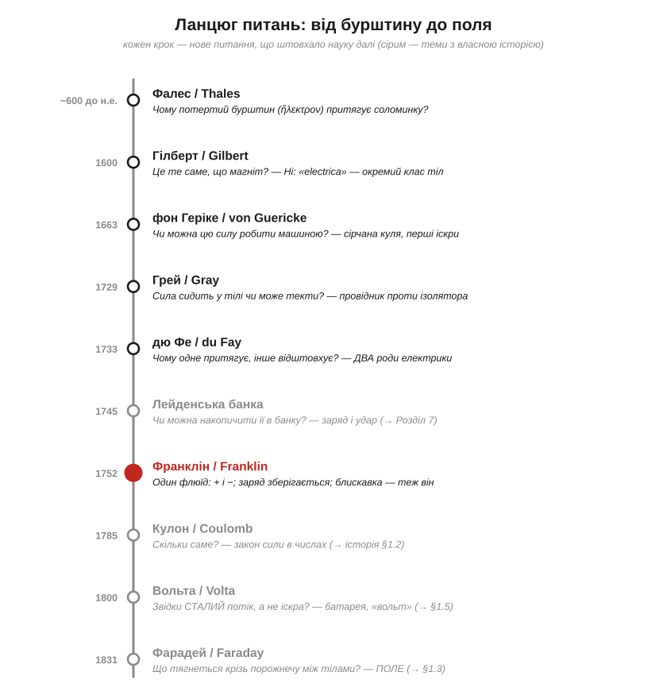
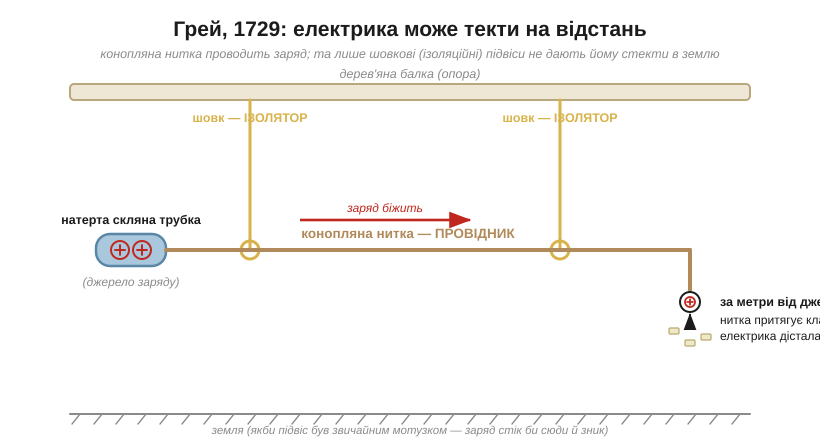
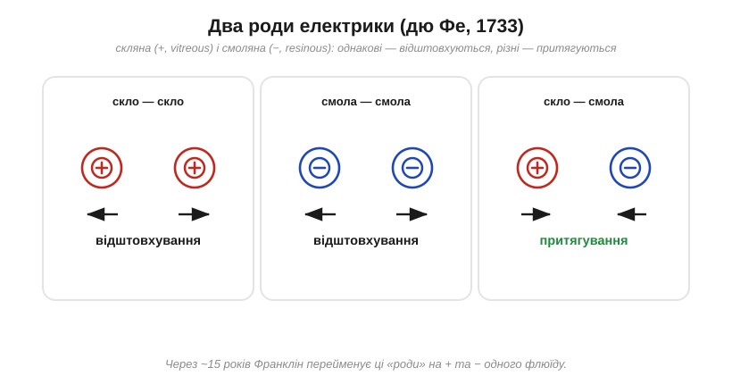
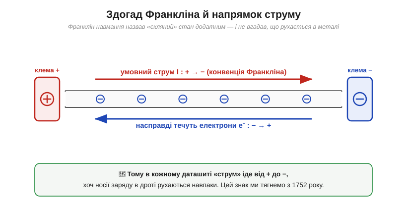

# 📜 Історія електрики — ланцюг питань: від бурштину до поля

Ця історія не перелічує, «хто що відкрив», — вона веде **ланцюгом питань**: що людей бентежило, чому вони не могли заснути, через що сварилися, і як кожна відповідь породжувала наступне питання. Майже кожне слово, яким користується електротехніка — *електрика*, *провідник*, *заряд*, знаки **+** і **−**, навіть напрямок, у якому «тече» струм у будь-якому даташиті, — це закам'янілий слід однієї з цих суперечок.

Уявіть, що ви нічого не знаєте про електрони, атоми чи напругу. У вас є шматок викопної смоли, вовняна ганчірка й допитливість. Саме з цього все й почалося — і знадобилося **двадцять чотири століття**, щоб дійти від «дивно, воно липне» до математичного поняття поля. Пройдімо цей шлях так, як його проходило людство: навпомацки, з хибними здогадами, але крок за кроком.

*Кожен щабель — це не «відкриття», а нове **питання**, на яке попередня відповідь не давала спокою. Сірим позначено постаті, що мають власну окрему історію (Кулон, Вольта, Фарадей, лейденська банка).*

---

## Бурштин, що притягує соломинку: Фалес

Усе почалося з прикраси. **Бурштин** (англ. *amber*, грец. **ἤλεκτρον**, *ēlektron*) — застигла за мільйони років смола хвойних дерев — цінувався не лише за теплий медовий колір. Ще близько **600 року до н. е.** грецький мудрець **Фалес Мілетський** (*Thales of Miletus*) помітив дивне: якщо потерти бурштин об хутро чи тканину, він починає притягувати пушинки, волоски, дрібні соломинки. Камінь без жодного руху раптом «тягнеться» до легких речей — і так само раптово перестає, якщо його не терти.

Питання, яке тут визріло, здавалося б, наївне: **звідки в неживого каменя береться «бажання» притягувати?** Для греків це було сусідом іншої загадки — магнітного залізняку (магнетиту) з міста Магнесія, що тягнув до себе залізо. Обидва явища склали в одну скриньку «прихованих симпатій» матерії й… забули майже на дві тисячі років. Не тому, що ніхто не дивився, — а тому, що це вважали кумедним фокусом, а не дверима у фундаментальний закон природи.

Та один слід лишився назавжди. Грецьке слово *ēlektron* — «бурштин» — через століття дало назву **всьому явищу**: *електрика*. Коли 1891 року шукали ім'я для найдрібнішої порції заряду, її теж назвали на честь бурштину — **електрон**. Тобто частинка, навколо якої крутиться вся наша техніка, носить ім'я прикраси бронзової доби.

> 🔧 **Навіщо це.** Слово, яке ви бачите на кожному приладі, у кожному англомовному даташиті — *electric*, *electronics* — буквально означає «бурштиновий». Це не метафора, а пряма етимологія: фізики не вигадували нового кореня, а взяли назву каменя, що першим показав силу. Тримати це в голові корисно — упізнаватимете спільний корінь у *electrode*, *electrolyte*, *dielectric*.

---

## Електрика проти магніту: Гілберт

Майже два тисячоліття бурштин і магніт лежали в одній скриньці «таємничих притягань». Розплутати їх судилося **Вільяму Гілберту** (*William Gilbert*, 1544–1603) — лікареві королеви Англії Єлизавети I. Гілберт був не теоретиком-фантазером, а раннім **експериментатором**: він не вірив на слово стародавнім авторитетам, а перевіряв усе руками. У трактаті **«De Magnete»** (1600) він уперше системно розділив два явища.

Гілберт випробував десятки речовин і виявив, що «по-бурштиновому» поводиться не лише бурштин: скло, сірка, віск, смола, коштовне каміння — потерті, всі вони притягують пушинки. Для цього класу тіл він і вигадав латинське слово **«electrica»** (від *ēlektron*) — «бурштиноподібні». Так народився сам термін. А щоб ловити цю слабку силу, Гілберт зробив перший вимірювальний прилад — **версорій** (*versorium*): легку металеву стрілку на вістрі, що поверталася до наелектризованого тіла. По суті, це перший **електроскоп**.

Та головне — Гілберт показав, чим електрика **відрізняється** від магнетизму. Магніт тягне лише залізо, тягне завжди, має два полюси, і його не «вимкнути». Наелектризоване ж тіло треба спершу **потерти**, воно притягує майже будь-що, сила швидко згасає, а полюсів-«північ-південь» не має. Висновок: це **різні** сили природи.

Тут криється чудова іронія. Гілберт **роз'єднав** електрику й магнетизм — і це був правильний, потрібний крок, бо їх плутали. Та через 230 років з'ясується, що в глибині вони — **одне**: рухомий заряд народжує магнетизм, рухомий магніт народжує струм. Возз'єднають їх Ерстед, Фарадей і Максвелл — через поняття [електричного поля](book:physics/electric-field). Наука часто мусить спершу акуратно розрізнити, щоб згодом мати право об'єднати.

---

## Машина, що робить електрику: Геріке

Поки електрику добували, монотонно тручи бурштин ганчіркою, далеко вона піти не могла. Прорив дав **Отто фон Геріке** (*Otto von Guericke*, 1602–1686) — бургомістр німецького Магдебурга, той самий, що довів силу вакууму «магдебурзькими півкулями», яких не розтягли дві запряжки коней.

Близько **1663 року** Геріке зліпив кулю з сірки завбільшки з дитячу голову, насадив на вісь і крутив, притискаючи долоню. Куля, що оберталася й терлася об руку, стала **першою електростатичною машиною** — генератором заряду на вимогу. Тепер електрику не доводилося випрошувати дрібними порціями: машина давала її щедро. І тоді проявилося те, чого на кволому бурштині не видно було: куля не лише притягувала пушинки, а й **відштовхувала** їх після дотику, тріщала, сипала **іскрами** в темряві, навіть світилася.

Іскра — це момент, коли питання змінює масштаб. Слабке «липне-не-липне» обернулося на щось **різке, майже речовинне**, що проскакує крізь повітря з тріском. Виникла спокуса уявити електрику як невидимий **флюїд** (рідину), що накопичується й проривається. Ця механічна картинка — «електрична рідина, якої буває забагато чи замало» — на ціле століття стане робочою інтуїцією, а її сліди ми досі носимо у словах *заряд*, *потік*, *витік*.

---

## Електрика, що тече: Грей і провідники

Тепер вирішальний поворот, без якого не було б ані дротів, ані схем. Англійський фарбар-аматор **Стівен Грей** (*Stephen Gray*, 1666–1736), уже літній і небагатий, поставив питання, до якого ніхто не додумався: **наелектризованість лишається там, де її натерли, — чи її можна передати в інше місце?**

Близько **1729 року** Грей з'ясував: можна. Він зарядив скляну трубку, торкнув нею корка на кінці довгої вологої конопляної нитки — і **далекий кінець нитки теж почав притягувати клаптики**. Електрична «чеснота» пробігла вздовж нитки! Та лише за однієї умови. Коли нитку підвішували на звичайних мотузках, ефект зникав; коли ж її тримали **шовкові** петлі — електрика бігла на сотні футів. Грей навмання спробував шовк просто тому, що той тонкий, — і натрапив на фундамент.

*Конопляна нитка **проводить** заряд на велику відстань. Але якби її підвіс був звичайним мотузком, заряд стік би в землю й зник. Лише шовкові (ізоляційні) петлі «тримають» електрику на лінії. Так уперше розділили **провідники** й **ізолятори**.*

Так народилося найпрактичніше розрізнення в усій електротехніці: одні матеріали (метали, волога нитка, тіло) **пропускають** електрику — це **провідники** (*conductors*); інші (шовк, скло, смола, суха деревина) **не пропускають** — це **ізолятори** (*insulators*, або діелектрики). Грей продемонстрував це й ефектно: підвісив на шовкових шнурах хлопчика-сироту, наелектризував його — і з рук та обличчя дитини сипалися іскри, а металеві листочки тяглися до них. «Літаючий хлопчик» став салонною сенсацією, але суть була серйозна: **електрика — це щось, що рухається**, тече крізь одні тіла й застрягає в інших.

> 🔧 **Навіщо це.** Кожен ізольований провід — це Грей у мініатюрі: мідна жила всередині (провідник) у пластиковій оболонці (ізолятор), щоб заряд біг **уздовж**, а не стікав куди завгодно. Поділ «провідник/ізолятор» — перше, що ви несвідомо застосовуєте, беручи дріт у руки. А «стікання в землю» через випадковий провідний шлях — це і є *витік* і *коротке замикання*, головні підозрювані, коли схема поводиться дивно.

---

## Два роди електрики: дю Фе

Геріке вже бачив і притягання, і відштовхування, але закономірності не вловив. Її впіймав французький хімік **Шарль Франсуа дю Фе** (*Charles François de Cisternay du Fay*, 1698–1739), що працював у Королівському саду в Парижі й уважно перечитав Грея.

Близько **1733 року** дю Фе помітив систему. Натерте **скло** заряджається одним способом; натерта **смола** (бурштин, віск) — іншим. І діє чітке правило: два скляні тіла одне одного **відштовхують**; два смоляні — теж **відштовхують**; а от скло й смола **притягуються**. Дю Фе назвав ці два роди **«скляна»** (*vitreous*) і **«смоляна»** (*resinous*) електрика й припустив, що це **два різні флюїди**, кожен відштовхує свій і притягує чужий.

*Правило дю Фе. «Скляна» (тут — червоний **+**) і «смоляна» (синій **−**) — однойменні відштовхуються, різнойменні притягуються. Це пряма колиска знаків **+/−**, хоч самих знаків ще не було.*

Це той самий закон, який ми сьогодні промовляємо як «**однойменні заряди відштовхуються, різнойменні притягуються**» — лише без чисел і без знаків **+/−**. Дю Фе ще не знав, що «дві» електрики — це насправді **надлишок** і **нестача** одного й того самого. Але він дав те, що було конче потрібне: **двознаковість**. Виявилося, що сила буває двох протилежних «смаків», і це вже неможливо описати простим «притягує/не притягує». Сцену для знаків плюс і мінус було наготовлено.

---

## Накопичення заряду: лейденська банка

Машина Геріке давала електрику, але та миттєво розліталася. Чи можна її **запасти**, як воду в глеку? Відповідь прийшла майже одночасно й незалежно з двох місць: від німця **Евальда фон Кляйста** (*Ewald von Kleist*) наприкінці **1745-го** і від **Пітера ван Мушенбрука** (*Pieter van Musschenbroek*) в університеті нідерландського **Лейдена** на початку **1746-го**. На честь міста прилад назвали **лейденською банкою** (*Leyden jar*).

Це була скляна банка з провідним покриттям усередині й зовні; вона вміла накопичити стільки заряду, що розряд звалював із ніг. Мушенбрук, отримавши удар, писав, що не повторив би його й за все королівство Франції. А абат Нолле задля видовища пропустив розряд крізь ланцюг із двохсот ченців, які разом підстрибнули, — наочна «швидкість електрики». Електрика з делікатної цяцьки стала **силою**, яку можна нагромадити й випустити одним ривком.

Чому ж банка тримала заряд — і скільки саме — це вже історія [**конденсатора**](book:electronics/capacitor). Тут важливий сам стрибок думки: електрику **можна запасати**. А отже, питання «скільки її?» з абстрактного стало нагальним.

---

## Один флюїд, знаки + і −: Франклін

Тепер — людина, чий випадковий вибір ми тягнемо за собою щодня, навіть не здогадуючись. Американець **Бенджамін Франклін** (*Benjamin Franklin*, 1706–1790) — друкар, видавець, згодом дипломат — узявся за електрику в зрілому віці й глянув на неї свіжо.

Франклін відкинув «дві рідини» дю Фе. Він припустив, що флюїд **один**, і кожне тіло має його певну «нормальну» кількість. Натирання не створює електрику з нічого — воно лише **переганяє** флюїд з одного тіла на інше. У кого надлишок — той заряджений **«плюс»** (*positive*); у кого нестача — **«мінус»** (*negative*). Притягання різнойменних — це просто прагнення флюїду перетекти звідти, де його забагато, туди, де замало.

З цієї простої картини випливає глибокий закон: якщо флюїд лише переходить, а не народжується й не гине, то **сумарний заряд зберігається**. Скільки **+** з'явилося на склі — стільки **−** лишилося на ганчірці. Це **закон збереження заряду** (*conservation of charge*) — один з найнепорушніших у фізиці; та сама ідея живе в [**законі струмів Кірхгофа**](book:electronics/kcl) (скільки заряду втекло у вузол — стільки й витекло).

А тепер — фатальний дріб'язок. Франклін мав **вгадати**, який зі станів назвати «плюсом». Він обрав: наелектризоване **скло** — це **надлишок**, отже **+**. Вибір був чистою монеткою 50/50: про електрони ніхто й не чув, рухатися могло будь-що в будь-який бік. І Франклін **не вгадав**.

*Франклін назвав «скляний» стан додатним і уявив, що флюїд тече від **+** до **−**. Через 145 років (Дж. Дж. Томсон, 1897) з'ясується: у металі рухаються **електрони**, і вони **від'ємні**. Тому **умовний струм** тече від **+** до **−**, а самі носії — навпаки. Цей знак тягнеться з 1752 року.*

Франклін не обмежився теорією. Улітку **1752-го** він (а в Парижі трохи раніше — Даліб'яр за його ідеєю) показав, що **блискавка — це та сама електрика**, лише велетенська: знаменитий дослід зі змієм у грозу й іскрою з ключа. Звідси — **громовідвід**, чи не перший в історії випадок, коли розуміння електрики дало пряму інженерну користь і **рятувало будівлі**. А ще Франклін подарував нам словник: **заряд** (*charge*), **батарея** (*battery*), **провідник** (*conductor*), плюс і мінус — усе це його терміни.

> 🔧 **Навіщо це.** Ось чому в кожній схемі, кожному даташиті **умовний струм** (*conventional current*) тече від **+** до **−**, хоча електрони в дроті повзуть навпаки. Це не помилка й не змова — це чесний здогад Франкліна, зроблений за півтора століття до відкриття електрона. Перевчати весь світ було пізно, тож домовилися: рахуємо струм так, **ніби** рухається додатний заряд. Запам'ятайте раз — і вас більше ніколи не зіб'є з пантелику, чому «струм іде туди, а електрони сюди». Докладніше про це протиріччя — у статті про [**напрямок струму**](book:physics/current-direction).

---

## Сила в числах: Кулон

Слова «притягуються», «відштовхуються», «сильніше», «слабше» — це ще не фізика. Фізика починається, коли з'являється **число**. Хто перетворив «тягнеться» на формулу — це **Шарль-Огюстен де Кулон** (*Charles-Augustin de Coulomb*, 1736–1806), і зробив він це з винахідливістю, гідною окремої розповіді: зважив невидиму силу на нитці, що скручувалася від найменшого зусилля.

Саме з Кулона починається **кількісна** електрика — закон сили між зарядами, обернений квадрат відстані, і одиниця заряду, названа його іменем (**кулон**, *coulomb*, Кл). Цю історію — про крутильні терези й про те, як узагалі можна «зважити» те, чого не видно, — винесено окремо: [**Кулон і крутильні терези**](book:physics/coulomb-law/hist-coulomb.md).

---

## Сталий потік замість іскри: Вольта

Уся електрика дотепер була **статичною**: накопичив — стрельнув — і по всьому. Лейденська банка розряджалася за мить. А чи можна зробити, щоб флюїд тік **рівно й безперервно**, як вода з джерела? Без цього не було б ані струму в нашому розумінні, ані всієї подальшої електроніки.

Відповідь народилася зі суперечки двох італійців — **Луїджі Гальвані** (*Luigi Galvani*), у якого смикалися жаб'ячі лапки, і **Алессандро Вольти** (*Alessandro Volta*), який доводив, що річ не в «тваринній електриці», а в металах. З цієї полеміки **1800 року** постала **вольтова батарея** (*voltaic pile*) — перше джерело **сталого струму**. На честь Вольти названо [**вольт**](book:physics/volt) (*volt*, В) — одиницю напруги. Цю драму винесено окремо: [**Вольта проти Гальвані**](book:physics/volt/hist-volta.md).

---

## Посередник крізь порожнечу: поле Фарадея

І наостанок — питання, від якого досі трохи паморочиться. Два заряди притягуються **на відстані**, не торкаючись. Між ними — порожнеча. То **що саме** передає силу через цю порожнечу? Невже один заряд «знає» про інший миттєво й нізвідки?

Цю загадку розв'язав **Майкл Фарадей** (*Michael Faraday*, 1791–1867) — колишній учень палітурника, що став одним із найбільших експериментаторів усіх часів. Замість «дії на відстані» він запропонував зухвалу думку: простір **навколо** заряду вже змінений — заповнений невидимими **лініями сили**, готовими штовхнути будь-який інший заряд, що туди потрапить. Так народилося поняття **поля** (*field*) — можливо, найважливіша абстракція в усій фізиці, бо саме полем згодом опишуть і світло, і радіо, і всю електродинаміку. Одиниця ємності — **фарад** (*farad*, Ф) — носить його ім'я.

Поле — серцевина понять [електричного поля](book:physics/electric-field) і [його зв'язку з потенціалом](root:embedded/field-and-potential), а дивовижну історію самого Фарадея — палітурника, що ледь знав математику, але «побачив» поле там, де інші бачили пустку, — винесено окремо: [**Фарадей — палітурник, що вигадав поле**](book:physics/electric-field/hist-faraday.md).

---

## Куди привів цей ланцюг

Озирнімося. За двадцять чотири століття людство пройшло від «дивно, бурштин липне» до **поля** — математичного об'єкта, що живе в кожній точці простору. І майже все, чим користується сучасна електротехніка, — це **закам'янілі сліди** цього шляху:

- слово **електрика** — від грецького «бурштин»;
- поділ на **провідники** й **ізолятори** — від шовкових петель Грея;
- знаки **+** і **−** та сам **умовний напрямок струму** — від монетки, яку підкинув Франклін (і програв);
- **збереження заряду** — його ж закон, що живе й у законі Кірхгофа;
- одиниці **кулон, вольт, фарад** — імена тих, хто вклав у це числа.

Найвпертіший із цих слідів — той самий знак струму. Здогад філадельфійського друкаря, зроблений до відкриття атома, ми досі чесно відтворюємо в кожній схемі. Тримайте це в пам'яті: фізика — не звід вічних істин з неба, а **ланцюг питань**, де навіть зручна помилка може пережити століття, якщо вчасно домовитися.
