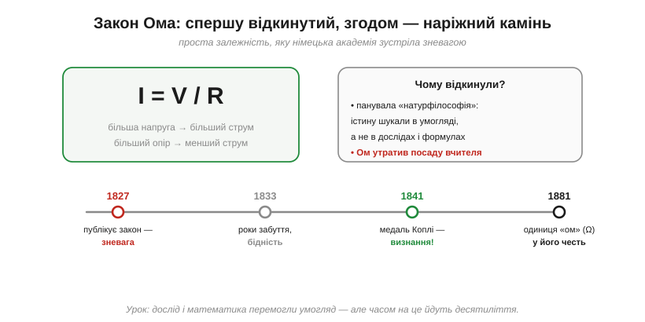
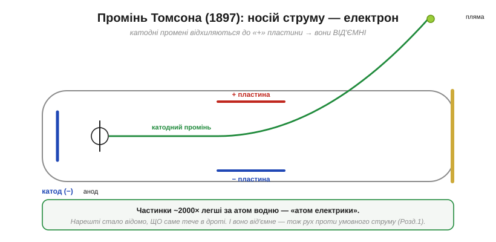
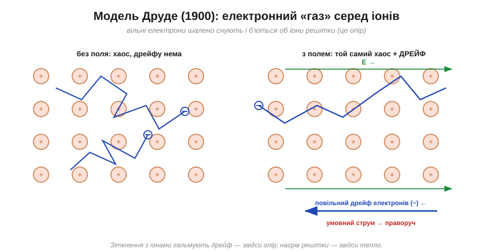

# 📜 Що тече в дроті: від Ома до електрона й моделі Друде

> Історична вставка про природу струму. [Батарея Вольти](book:physics/volt/hist-volta.md) дала людству сталий струм — але цілих сто років лишалися без відповіді два глибокі питання: **за яким законом** тече струм і **що саме** тече в дроті? Це історія про обидві відповіді — і про те, як людину, що знайшла перший закон, спіткав той самий «опір», який вона вивчала.

Маємо джерело й розуміємо напругу як «висоту» потенціалу. З'єднай високий потенціал із низьким провідником — і заряд потече. Та що це за потік? Скільки його буде? І хто, власне, біжить тими дротами? У 1800-х на ці питання ніхто не знав відповіді.

---

## Закон Ома: скільки струму потече

Перший крок зробив скромний шкільний учитель із Кельна — **Георг Сімон Ом** (*Georg Simon Ohm*, 1789–1854). Працюючи із саморобним приладдям (він навіть сам тягнув дроти різної довжини), Ом терпляче міряв, як струм залежить від напруги джерела й від провідника. І знайшов разючу простоту:

```
I = V / R
```

Струм прямо пропорційний напрузі й обернено — опору. Подвоїш напругу — подвоїться струм; візьмеш удвічі «важчий» для струму провідник — струм удвічі впаде. Уся метушня зарядів у дроті вкладалася в одну коротку формулу. 1827 року Ом виклав це у праці «Die galvanische Kette» («Гальванічне коло»).

А щоб дійти такої чистоти результату, Ом мусив здолати підступну технічну проблему: батареї того часу «просідали» й розряджалися просто під час вимірів, спотворюючи криві. Тому за стабільне джерело він узяв **термопару** — спай двох різних металів, нагрітий з одного кінця, що дає хай малу, та незмінну напругу. Лише завдяки цій винахідливості його залежності вийшли настільки рівними, що в них проступив закон.


*I = V/R — можливо, найуживаніша формула всієї електроніки. Та її автора спершу зустріли зневагою: лише через десятиліття, з медаллю Коплі (1841) і одиницею «ом» (1881), прийшло визнання.*

> 🔧 **Навіщо це.** I = V/R — це формула, до якої ви повертатиметеся **щодня**: вона зв'язує три головні величини кола. Усе подальше — дільники, струмообмеження, добір резисторів — стоїть на ній. Те, що така проста річ далася людству так важко, лише підкреслює її глибину.

---

## Чому правильний закон спершу відкинули

Тут історія робить гіркий поворот. Замість визнання Ом дістав **зневагу**. Німецька академічна еліта того часу була в полоні «натурфілософії» — умоглядної, майже поетичної традиції (у дусі Гегеля), яка вважала, що істину про природу осягають **роздумом**, а не вульгарним вимірюванням і сухими формулами. Праця Ома, повна дослідів і рівнянь, видалася їм мало не профанацією; один впливовий критик назвав її «плетивом голих фантазій».

Наслідки були тяжкі: Ом, ображений і невизнаний, **звільнився** з посади й на роки поринув у бідність та забуття. Показово, що першими його оцінили **за кордоном** — у Британії та Франції, де емпіричну, математичну фізику шанували куди більше, ніж тоді вдома. Лише поступово — і насамперед завдяки цьому закордонному визнанню — правда взяла гору. 1841 року Лондонське королівське товариство вшанувало його **медаллю Коплі**; під кінець життя він нарешті здобув професуру. А 1881 року одиницею електричного опору назвали **ом** (*ohm*, Ω) — остаточна, хоч і посмертна, реабілітація.

> 🔧 **Навіщо це.** Це не лише зворушлива історія. Це момент, коли **експеримент і математика** відвоювали собі місце в науці про природу проти чистого умогляду. Кожен інженер сьогодні — спадкоємець саме Омового підходу: не «як має бути за гарною теорією», а «що показує вимір». Памʼятати ціну, якою це далося, корисно.

---

## Що ж насправді тече в дроті

Закон Ома описував **відношення** між струмом, напругою й опором — та не казав ані слова про природу самого струму. Що це за «потік»? Франклінів електричний флюїд? Якась невидима рідина? Десятиліттями струм лишався зручною абстракцією: його міряли, рахували, корилися його законам — але **не знали, з чого він складається**.

Підказки, утім, нагромаджувалися. Досліди Фарадея з електролізу натякали, що заряд переноситься **однаковими порціями**: щоб виділити певну кількість речовини, треба було пропустити строго певну кількість електрики, ніби заряд «відраховувався» поштучно. 1891 року ірландець Джордж Джонстон Стоні навіть дав цій гаданій порції заряду імʼя — **електрон** — задовго до того, як її побачили на власні очі. Бракувало останнього кроку: спіймати сам носій.

Та й це питання здавалося майже безнадійним: як побачити те, що тече всередині суцільного металу? Відповідь, як це часто буває, прийшла збоку — з дослідів не з дротами, а з **порожнечею**.

---

## Носія знайдено: електрон

Кінець XIX століття, Кавендішська лабораторія в Кембриджі (так, названа на честь того самого [відлюдника Кавендіша](book:physics/coulomb-law/hist-coulomb.md)). **Джозеф Джон Томсон** (*J. J. Thomson*, 1856–1940) вивчає **катодні промені** — таємниче світіння в скляних трубках, з яких відкачано повітря, коли до електродів прикладено високу напругу.

Природа цих променів була предметом гарячої суперечки. Багато фізиків, надто в Німеччині, вважали їх **хвилями** в загадковому «ефірі»; британці ж схилялися до думки, що це **частинки**. Томсон узявся розсудити суперечку дослідом — і зробив це блискуче.

Він підносить до променя заряджені пластини — і промінь **відхиляється до додатної**. Отже, він складається з **від'ємних** частинок. Магнітом промінь теж вдається відхилити. А вимірявши, наскільки сильно він гнеться, Томсон обчислює відношення заряду до маси — і отримує приголомшливе: ці частинки приблизно у **дві тисячі разів легші** за найлегший атом (водню).


*Катодний промінь відхиляється до «+» пластини — отже, несе від'ємний заряд. Частинки виявилися ~2000× легшими за атом: це **електрон**, перша відкрита субатомна частинка. Нарешті стало відомо, що саме тече в дроті.*

Так 1897 року народилося поняття **електрона** (*electron*) — найдрібнішої порції від'ємного заряду й першої відкритої «частинки, меншої за атом». Абстрактний «струм» нарешті дістав плоть: це **потік електронів**. (А саме ім'я ще раніше дав бурштин — грецькою ἤλεκτρον.)

Вага цього відкриття була величезна — і не лише для електротехніки. Доти атом вважали **неподільним** (грецьке *atomos* — «нерозрізуваний»), найдрібнішою цеглинкою матерії. Електрон, у тисячі разів легший за атом, довів: атом **має внутрішню будову**, з якої можна щось вийняти. Так Томсонова «корпускула» відчинила двері в субатомний світ і принесла авторові Нобелівську премію (1906). Електрика й глибинна будова матерії несподівано виявилися однією історією. Картину довершили інші: 1909 року Роберт Міллікен точно виміряв заряд одного електрона — той самий [елементарний заряд](book:physics/electric-charge) e ≈ 1.6×10⁻¹⁹ Кл — і носій струму остаточно перестав бути здогадом.

---

## Незручна правда про напрямок

І тут історія підкидає свою фірмову іронію. Електрони — **від'ємні**. А [Франклін](book:physics/electric-charge/hist-electricity.md) за сто років до того вже домовився рахувати струм так, ніби тече **додатний** заряд, від «+» до «−». Виходить, реальні носії в металі біжать **протилежно** до умовного струму.

Перевчати весь світ було пізно — і нікому не потрібно: для розрахунків знак не змінює нічого. Тож домовленість лишили. Саме тому й донині в кожній схемі **умовний струм** іде від плюса до мінуса, а електрони — навпаки. Відкриття Томсона не зламало конвенцію Франкліна, а лише пояснило, **чому** вона «навпаки».

---

## Чому метал проводить — і чому опирається

Лишалося найцікавіше: **чому** одні речовини проводять струм, звідки береться опір і чому провідник гріється. Просту й напрочуд плідну картину дав німецький фізик **Пауль Друде** (*Paul Drude*, 1863–1906) 1900 року.

Друде уявив метал так: важкі **додатні іони** жорстко закріплені у вузлах кристалічної решітки, а між ними, як **газ**, вільно снують відірвані від атомів електрони. Без зовнішнього поля цей «електронний газ» рухається шалено, але **безладно** — електрони летять туди-сюди з тепловими швидкостями, та в середньому нікуди не зміщуються. А варто прикласти поле — і поверх хаосу зʼявляється повільний **дрейф** (*drift*) усіх електронів в один бік.


*Вільні електрони снують серед нерухомих іонів решітки. Без поля — суцільний хаос без зміщення. З полем — той самий хаос, але з повільним загальним **дрейфом**. Електрони раз у раз **стикаються** з іонами — і саме ці зіткнення дають **опір**, а передана решітці енергія — **нагрів**.*

У цій простій картині відразу видно все головне. **Опір** (*resistance*) — це гальмування дрейфу через **зіткнення** електронів з іонами решітки: що частіші зіткнення, то важче струму. **Нагрів** — це енергія, яку електрони при зіткненнях віддають решітці (вона починає сильніше коливатися). А чим більше вільних електронів і чим рідші зіткнення — тим краще речовина проводить. Модель Друде пояснила закон Ома «зсередини» й навіть приблизно вловила звʼязок між електро- й теплопровідністю металів.

> 🔧 **Навіщо це.** Картинка Друде — це той образ, який інженер тримає в голові досі: струм як **дрейф електронного газу**, опір як **зіткнення з решіткою**, нагрів як **енергія цих зіткнень**. Пізніше квантова механіка її уточнить, та для розуміння проводів, резисторів і їхнього [нагрівання](book:physics/resistance) цієї моделі цілком вистачає.

Модель навіть передбачає, **чому опір металу зростає з нагріванням**: гарячіша решітка дужче коливається, електрони частіше на неї натикаються — і дрейф гальмується сильніше, а [провідність](book:physics/conductivity) падає. Звісно, картина не ідеальна: у розрахунках теплоємності металів Друде схибив, і лише квантова механіка (Зоммерфельд) згодом полагодила деталі. Та її серцевина — електрони-газ, що б'ються об решітку, — встояла понад століття.

Сумна паралель з Омом: сам Друде до повного тріумфу своєї ідеї майже не дожив — він трагічно пішов із життя 1906 року, ледь діставши кафедру в Берліні. Як і Ому, найбільше визнання судилося радше його нащадкам, ніж йому самому.

---

## І наостанок — загадка швидкості

Модель Друде підкидає наостанок дивовижу. Той дрейф електронів **неймовірно повільний** — частки міліметра за секунду, повільніше за равлика. То чому ж лампа спалахує **миттєво**, щойно клацнеш вмикачем, якщо електрони ледь повзуть?

Розгадка в тому, що світло запалює не якийсь конкретний електрон, що добіг від вмикача, — а **поле**, яке [поширюється дротом](book:physics/signal-speed) майже зі швидкістю світла й штовхає **всі** електрони одразу, по всій довжині.

---

## Чим це відгукнулося

Зведімо ланцюг. За століття людство пройшло від «струм — це щось тече» до точної картини:

- **Ом** (*ohm*, Ω) і закон I = V/R — наріжний камінь усіх розрахунків кіл; здобутий усупереч зневазі умоглядної науки.
- **Електрон** (Томсон, 1897) — нарешті відомий **носій** струму; від'ємний, а тому біжить проти умовного струму Франкліна.
- **Модель Друде** — робочий образ провідності: дрейф електронного газу, зіткнення з решіткою як **опір**, їхня енергія як **тепло**.

Тепер є все, щоб говорити про струм по-дорослому: відомо, **що** тече (електрони), **за яким законом** (Ом) і **чому опирається** (зіткнення Друде). А в основі всього — проста думка: струм є **потоком заряду**.
