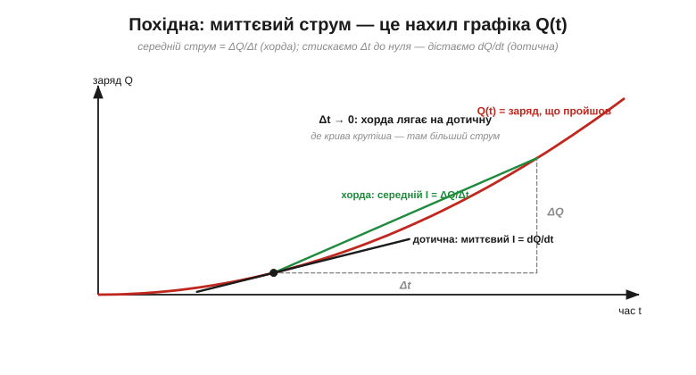

# 🧮 I = dQ/dt: похідна як миттєва швидкість зміни

> Це математична вставка про похідну за темою [струму як потоку заряду](topic:physics/electric-current). Струм означують як заряд за час, I = ΔQ/Δt; а коли струм **змінюється**, беруть миттєве значення — границю ΔQ/Δt за дедалі коротший проміжок, тобто **похідну** dQ/dt. Розкриймо, що це таке. Виявиться, нічого страшного: похідна — це просто **нахил графіка** Q(t).

### Середня швидкість: заряд поділити на час

Найпростіше — порахувати **середній** струм: узяти, скільки заряду ΔQ перетнуло переріз за проміжок Δt, і поділити одне на одне:

```
I_сер = ΔQ / Δt        (кулони за секунду = ампери)
```

Це як «літрів за секунду» для води: скільки витекло, поділити на час. Якщо потік **сталий**, цього досить — середнє й миттєве збігаються.

### Миттєва швидкість: стиснути проміжок до нуля

А якщо струм **міняється** — то наростає, то спадає (звукові, радіосигнали)? Тоді ΔQ/Δt за довгий проміжок дає лише «розмазане» середнє. Щоб дізнатися струм **саме в цю мить**, проміжок Δt роблять дедалі коротшим. Границя цього відношення, коли Δt прямує до нуля, і є **похідна**:

```
I = dQ/dt = границя (ΔQ/Δt) при Δt → 0
```

### Похідна — це нахил графіка Q(t)

Найкраще похідну видно на графіку. Відкладемо заряд Q, що пройшов крізь переріз, проти часу t.


*Заряд Q(t), що пройшов крізь переріз, відкладено проти часу. Середній струм за проміжок — це нахил **хорди** (ΔQ/Δt); миттєвий струм у точці — нахил **дотичної** (dQ/dt). Що крутіша крива, то більший струм; де вона полога — струму нема.*

Середній струм за проміжок — це нахил **хорди** (січної) між двома точками графіка. А коли проміжок стискається до нуля, хорда повертається й лягає на **дотичну** в точці — і її нахил є миттєвий струм dQ/dt. Тому правило просте: **де Q(t) круто росте — там великий струм; де графік пологий — струму майже нема; де Q стала — струму нема зовсім**.

### Обернено: заряд — це площа під струмом

Похідна має дзеркального двійника. Якщо струм — це нахил Q(t), то заряд — це **накопичена** площа під графіком струму I(t):

```
Q = ∫ I dt        (площа під кривою струму)
```

Нахил і площа — дві обернені дії (про [інтеграл](topic:physics/electric-potential/math-work-integral.md) — окрема вставка). Звідси й знайоме: ампер-година — це струм, помножений на час, тобто заряд (1 А·год = 3600 Кл).

**Приклад.** Хай заряд накопичується дедалі швидше: Q(t) = t² (умовно). Тоді струм:

```
I = dQ/dt = 2t        (зростає лінійно з часом)
```

А якби заряд коливався синусоїдою, Q = Q₀·sin(ωt), струм був би косинусоїдою I = Q₀·ω·cos(ωt) — тобто **зсунутий на чверть періоду**. Саме цей зсув похідної визначає поведінку [змінного струму](topic:physics/dc-vs-ac).

### Де це працює

«Похідна = миттєвий темп = нахил» — звʼязка, що повторюється всюди. Тут це струм I = dQ/dt; тим самим записом описують і струм конденсатора (i = C·dv/dt), і напругу котушки — щоразу одна величина є швидкістю зміни іншої. А в коді похідну рахують скінченною різницею: I ≈ (Q_нове − Q_старе) / Δt — мікроконтролер саме так і «бачить» швидкість зміни будь-якого виміру.
