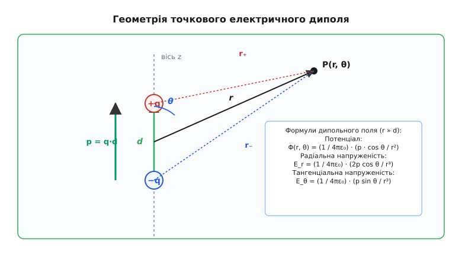
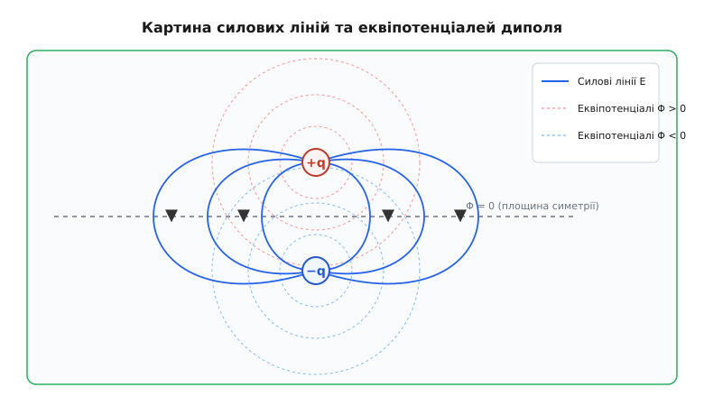
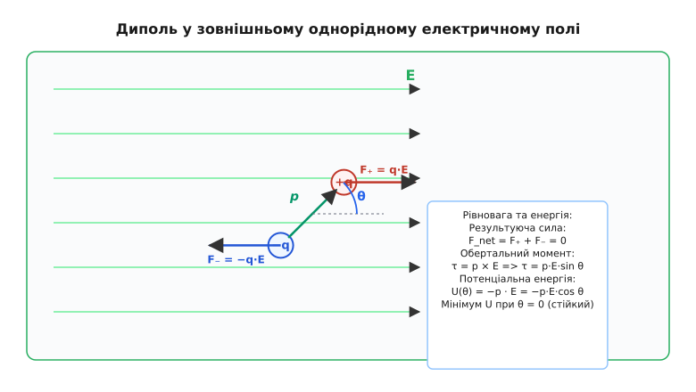
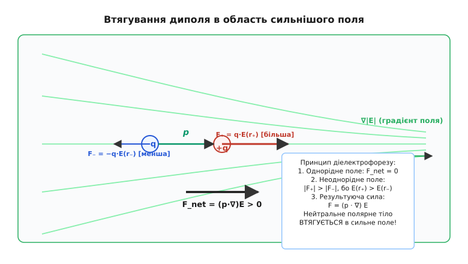

# Електричний диполь

<preknowlist>
- [Закон Кулона](book:physics/electromagnetism/coulomb-law) — сила кулонівської взаємодії між точковими зарядами у вакуумі.
- [Електричне поле](book:physics/electromagnetism/electric-field) — векторний опис силової дії заряду в просторі.
- [Закон збереження заряду](book:physics/electromagnetism/charge-conservation) — незмінність сумарного заряду замкненої системи.
</preknowlist>

Якщо до макроскопічно нейтрального шматочка паперу, дрібної деревної тирси або тонкого струменя води піднести наелектризовану пластмасову паличку чи гребінець, електронейтральне тіло відчує виразне й недвозначне притягання. Сумарний електричний заряд такої краплі води чи паперової смужки дорівнює нулю з точністю до одного електрона. Якби взаємодія між тілами описувалася виключно монопольними кулонівськими силами поодиноких точкових зарядів, макроскопічні нейтральні об'єкти залишалися б повністю байдужими до наявності зовнішнього електричного поля.

Причина цього повсякденного фізичного дива полягає в тому, що додатні та від'ємні заряди всередині атомів, молекул і мікроструктур речовини не збігаються в одній точці простору. Вони зміщені один відносно одного на субнанометрові відстані. Утворюється найпростіша нейтральна конфігурація з просторовим розділенням зарядів — електричний диполь (від грец. *δίς* — двічі, подвійно + *πόλος* — вісь, полюс).

Електричний диполь є фундаментальною цеглиною електродинаміки суцільних середовищ, атомної та молекулярної фізики, радіофізики, хімії та біофізики. Без урахування дипольної будови речовини неможливо пояснити ні високу діелектричну проникність води, ні випромінювання електромагнітних хвиль антенами, ні роботу мікрохвильової печі, ні міжмолекулярне зчеплення в розчинах чи механізми функціонування біологічних мембран.

## 1. Векторний дипольний момент та мікроскопічні витоки

У найпростішій точковій моделі електричний диполь складається з двох точкових зарядів, однакових за величиною `q` і протилежних за знаком (`+q` та `−q`), розташованих у просторі на фіксованій відстані `d` один від одного. Вектор `d` розглядається як плече диполя і за загальноприйнятою домовленістю спрямований від від'ємного заряду `−q` до додатного заряду `+q`.

Головною кількісною характеристикою такої системи є вектор електричного дипольного моменту `p`. Його означують як добуток величини додатного заряду `q` на вектор плеча `d`:

```
p = q · d      [означення дипольного моменту двох точкових зарядів]
```

Одиницею вимірювання дипольного моменту в Міжнародній системі одиниць SI є кулон-метр (`C·m`). Оскільки значення `1 C·m` для атомних систем є велетенським, у фізиці молекул і хімії використовують позасистемну одиницю дебай (`D`), названу на честь фізика Петера Дебая:

```
1 D = 3.33564 · 10⁻³⁰ C·m      [значення 1 дебая у системі SI]
```

Один дебай відповідає дипольному моменту двох елементарних зарядів `e = 1.602 · 10⁻¹⁹ C`, рознесених на відстань близько `0.0208` нанометра (`0.208` ангстрема).


*Геометрія двох точкових зарядів протилежного знака та система координат для розрахунку дипольного поля.*

На мікроскопічному рівні молекули поділяють на два основні класи за їхньою симетрією та розподілом електронної густини:

1. **Неполярні молекули** — системи, у яких за відсутності зовнішнього поля центри ваги додатних ядер і від'ємних електронних хмар точно збігаються у просторі. Прикладами є симетричні молекули водню `H₂`, кисню `O₂`, азоту `N₂`, метану `CH₄`, вуглекислого газу `CO₂` та бензолу `C₆H₆`. Їхній власний постійний дипольний момент дорівнює нулю (`p = 0`). Проте при внесенні у зовнішнє електричне поле електронні хмари зміщуються проти поля, а ядра — за полем, утворюючи **індукований дипольний момент** `p_ind = α · E`, де `α` — коефіцієнт поляризовності молекули.

2. **Полярні молекули** — системи із несиметричним розподілом електронної густини та асиметричною геометричною формою. Завдяки різниці в електронегативності зв'язаних атомів електронна хмара зміщується до більш електронегативного атома, утворюючи постійний дипольний момент. Прикладом є молекула води `H₂O` (кут між зв'язками `O-H` становить `104.5°`), яка має постійний дипольний момент `p = 1.85 D` (`6.17 · 10⁻³⁰ C·m`). Молекула хлороводню `HCl` має момент `1.08 D`, аміаку `NH₃` — `1.47 D`, ацетону `(CH₃)₂CO` — `2.88 D`, а іонні парові молекули солі `NaCl` у газовій фазі володіють велетенським моментом `9.0 D`.

Мікроскопічний механізм поляризації речовини складається з трьох основних внесків:
- **Електронна поляризація** — пружне зміщення електронних оболонок відносно атомних ядер. Вона відбуваються миттєво за часи `10⁻¹⁵` секунди і не залежить від температури.
- **Іонна (коливальна) поляризація** — зміщення різнойменно заряджених іонів у кристаллічній ґратці твердого тіла чи молекулі. Вона формується за часи `10⁻¹³` секунди.
- **Орієнтаційна (дипольна) поляризація** — повертання постійних дипольних моментів полярних молекул вздовж ліній зовнішнього поля. Вона потребує подолання в'язкого тертя середовища (часи релаксації `10⁻¹¹` – `10⁻⁹` секунди) і суттєво зменшується при зростанні температури через хаотичний тепловий рух.

Докладний шлях відкриття дипольної природи молекул та розвитку експериментальних методів вимірювання дипольних моментів висвітлює [Історія концепції диполя](book:physics/electromagnetism/electric-dipole/hist-dipole.md).

Для довільного протяжного розподілу заряду в просторі з об'ємною густиною `ρ(r)` векторний дипольний момент означують через інтеграл по всьому об'єму `V`:

```
p = ∫ r · ρ(r) · dV      [дипольний момент довільного розподілу заряду]
```

Для дискретної системи з `N` точкових зарядів `qᵢ` із радіус-векторами `rᵢ` інтегральне означення переходить у скінченну суму `p = ∑ qᵢ · rᵢ`.

Важливою математичною властивістю дипольного моменту є його **інваріантність відносно вибору початку координат** за умови електронейтральності системи. Якщо сумарний заряд системи дорівнює нулю (`Q = ∑ qᵢ = 0`), вектор `p` зберігає своє значення при будь-якому паралельному зсуві початку відліку.

Доведемо цю фундаментальну властивість. Нехай початок координат змістився на постійний вектор `r₀`. Нові радіус-вектори зарядів дорівнюють `rᵢ' = rᵢ − r₀`. Обчислимо дипольний момент у новій системі координат:

```
p'
= ∑ qᵢ · (rᵢ − r₀)               [зсув початку координат]
= ∑ qᵢ · rᵢ − r₀ · (∑ qᵢ)        [розкриття дужок]
= p − r₀ · Q                     [підстановка сумарного заряду Q]
= p                              [оскільки Q = 0]
```

Якщо ж сумарний заряд системи не дорівнює нулю (`Q ≠ 0`), значення дипольного моменту залежить від точки, відносно якої його обчислюють. Наприклад, для одиночного заряду `+q` дипольний момент дорівнює `q · r`, що повністю диктується вибором початку координат. Тому поняття дипольного моменту як об'єктивної внутрішньої характеристики системи має строгий і однозначний фізичний зміст саме для електронейтральних об'єктів.

## 2. Мультипольний розклад та потенціал диполя

У теоретичній фізиці дипольний момент природно виникає при систематичному математичному розкладі потенціалу довільної скінченної системи зарядів на великих відстанях. Цей метод називають **мультипольним розкладом** (*multipole expansion*).

Розглянемо електростатичний потенціал `Φ(r)`, створений розподілом зарядів `ρ(r')` у точці спостереження `r`, коли відстань до точки спостереження значно перевищує розміри системи зарядів (`r » r'`):

```
Φ(r) = (1 / (4·π·ε₀)) · ∫ (ρ(r') / |r − r'|) · dV'
```

Використовуючи геометричний розклад обратного модуля відстані `1 / |r − r'|` у ряд Тейлора за малою величиною `r' / r « 1`, отримуємо:

```
1 / |r − r'| = (1 / r) + (r · r' / r³) + (1 / (2·r⁵)) · ∑ Q_ij · x_i · x_j + ...
```

Підставляючи цей розклад в інтеграл для потенціалу, розбиваємо його на рядок доданків, кожен з яких відповідає своєму мультипольному моменту:

```
Φ(r)
= (1 / (4·π·ε₀)) · [ (1 / r) · ∫ ρ(r') dV' + (1 / r³) · ∫ (r · r') ρ(r') dV' + ... ]
= (1 / (4·π·ε₀)) · [ Q / r + (p · r) / r³ + (1 / 2) · ∑ Q_ij · r_i · r_j / r⁵ + ... ]
```

Аналіз членів розкладу показує гармонійну ієрархію взаємодій:
1. **Перший член (монопольний)** — `Q / (4·π·ε₀·r)`, де `Q = ∫ ρ(r') dV'` є сумарним зарядом системи. Він спадає як `1 / r`. Для нейтральної системи `Q = 0`, і перший член строго дорівнює нулю.
2. **Другий член (дипольний)** — `(p · r) / (4·π·ε₀·r³) = (p · cos θ) / (4·π·ε₀·r²)`. Це і є потенціал точкового диполя, який є головним домінуючим членом для нейтральних систем на великих відстанях. Він спадає як `1 / r²`.
3. **Третій член (квадрупольний)** — пов'язаний із тензором квадрупольного моменту `Q_ij = ∫ (3 x'_i x'_j − r'² δ_ij) ρ(r') dV'` і спадає ще швидше — як `1 / r³`.

Таким чином, якщо система є електронейтральною (`Q = 0`), її зовнішнє електричне поле на великих відстанях повністю визначається саме векторним дипольним моментом `p`.


*Силові лінії електричного поля (суцільні) та еквіпотенціальні поверхні (пунктирні) точкового диполя.*

Обчислимо потенціал диполя безпосередньо за принципом суперпозиції для двох точкових зарядів `+q` та `−q`. Відстані від зарядів до точки спостереження `P` дорівнюють `r₊` та `r₋`:

```
Φ(r)
= (1 / (4·π·ε₀)) · (q / r₊ − q / r₋)                 [принцип суперпозиції]
= (1 / (4·π·ε₀)) · q · (r₋ − r₊) / (r₊ · r₋)          [зведення до спільного знаменника]
```

У першому наближенні за малим параметром `d / r « 1` геометричні різниці та добутки відстаней дорівнюють:

```
r₋ − r₊ ≈ d · cos θ
r₊ · r₋ ≈ r²
```

Де `θ` — полярний кут між вектором дипольного моменту `p` та радіус-вектором точки спостереження `r`. Підставляючи ці вирази, маємо:

```
Φ(r, θ)
= (1 / (4·π·ε₀)) · (q · d · cos θ / r²)
= (1 / (4·π·ε₀)) · (p · cos θ / r²)                    [скалярна форма потенціалу]
= (1 / (4·π·ε₀)) · (p · r / r³)                        [інваріантна векторна форма]
```

Потенціал диполя має характерну кутову анізотропію:
- На осі диполя зверху (`θ = 0°`, напрямок `+p`) потенціал максимальний і додатний: `Φ = +p / (4·π·ε₀·r²)`.
- На осі диполя знизу (`θ = 180°`, напрямок `−p`) потенціал максимальний за модулем і від'ємний: `Φ = −p / (4·π·ε₀·r²)`.
- У всій екваторіальній площині (`θ = 90°`, перпендикулярно до `p`) потенціал строго дорівнює нулю: `Φ = 0`.

Через ортогональні сферичні гармоніки `Y_lm(θ, φ)` потенціал диполя виражають як пропорційний першій гармоніці `Y_10(θ) = √(3 / (4·π)) · cos θ`:

```
Φ(r, θ) = (1 / (3 · ε₀)) · p · Y_10(θ) / r²            [розклад за сферичними гармоніками]
```

## 3. Напруженість поля диполя та сингулярна дельта-терма

Напруженість електричного поля `E` обчислюють як від'ємний градієнт потенціалу `E = −∇Φ`.

У сферичній системі координат `(r, θ, φ)` оператор градієнта дає дві відмінні від нуля компоненти напруженості — радіальну `E_r` та тангенціальну `E_θ`:

```
E_r
= −∂Φ / ∂r
= −∂ / ∂r [ (p · cos θ) / (4·π·ε₀·r²) ]
= (1 / (4·π·ε₀)) · (2 · p · cos θ / r³)               [радіальна складова поля]

E_θ
= −(1 / r) · ∂Φ / ∂θ
= −(1 / r) · ∂ / ∂θ [ (p · cos θ) / (4·π·ε₀·r²) ]
= (1 / (4·π·ε₀)) · (p · sin θ / r³)                   [тангенціальна складова поля]
```

Азимутальна складова `E_φ` внаслідок осьової симетрії системи строго дорівнює нулю (`E_φ = 0`).

Модуль повного вектора напруженості поля обчислюють за теоремою Піфагора:

```
|E(r, θ)|
= √(E_r² + E_θ²)
= (1 / (4·π·ε₀)) · (p / r³) · √(4·cos²θ + sin²θ)
= (1 / (4·π·ε₀)) · (p / r³) · √(3·cos²θ + 1)           [модуль напруженості поля диполя]
```

Аналіз цього виразу показує важливі фізичні особливості:
- На осі диполя (`θ = 0°` або `θ = 180°`) поле спрямоване паралельно осі і має величину `E_axial = (1 / (4·π·ε₀)) · (2p / r³)`.
- У екваторіальній площині (`θ = 90°`) поле спрямоване антипаралельно вектору `p` і має величину `E_eq = (1 / (4·π·ε₀)) · (p / r³)`.
- Напруженість поля на осі диполя вдвічі більша за напруженість у екваторіальній площині на тій самій відстані (`E_axial = 2 · E_eq`).

Повне інваріантне векторне рівняння для напруженості поля точкового диполя в зовнішності (`r > 0`) записане без прив'язки до конкретної системи координат:

```
E(r) = (1 / (4·π·ε₀)) · (3 · (p · r̂) · r̂ − p) / r³      [інваріантна векторна форма]
```

Де `r̂ = r / r` — одиничний вектор напрямку з центру диполя в точку спостереження.

Поле точкового диполя спадає пропорційно `1 / r³`. Це значно швидше за кулонівське поле поодинокого заряду (`1 / r²`). Фізично це пояснюється тим, що на великих відстанях кулонівські поля двох протилежних зарядів майже повністю компенсують одне одного, і непокритим залишається лише тонкий ефект їхнього просторового рознесення.

Обчислимо об'ємну густину енергії `w` електростатичного поля диполя у зовнішності:

```
w(r, θ)
= (1 / 2) · ε₀ · E²
= (p² / (32 · π² · ε₀ · r⁶)) · (3 · cos²θ + 1)         [густина енергії дипольного поля]
```

Густина енергії спадає дуже стрімко — пропорційно `1 / r⁶`.

Проте векторний вираз для `E(r)` вище є точним лише для точок простору поза диполем (`r > 0`). Якщо проінтегрувати напруженість поля по нескінченно малому об'єму кулі, що охоплює центр точкового диполя `r = 0`, виявляється, що інтеграл не дорівнює нулю.

Для повного опису поля у всьому просторі, включаючи саму точку `r = 0`, до регулярної частини додають сингулярний дельта-функціональний член (контактний член):

```
E(r)
= (1 / (4·π·ε₀)) · (3 · (p · r̂) · r̂ − p) / r³ − (p / (3 · ε₀)) · δ³(r)    [повне поле диполя]
```

Де `δ³(r)` — тривимірна дельта-функція Дірака. Детальний математичний вивід цього сингулярного члена та інтегрування по кулі наведено у вставці [Математичний вивід поля диполя](book:physics/electromagnetism/electric-dipole/math-dipole-field.md).

Сингулярна дельта-терма поля відіграє фундаментальну роль у квантовій механіці та атомній фізиці. Вона описує так звану **контактну фермієвську взаємодію** між магнітними або електричними дипольними моментами ядра та електрона, коли електрон перебуває безпосередньо в центрі ядра (у `s`-станах із `l = 0`). Саме цей член розраховує надтонку структуру спектральних ліній атома водню, зокрема знамениту радіолінію нейтрального водню на хвилі `21 см`.

## 4. Диполь у зовнішньому однорідному електричному полі

Помістимо електричний диполь із моментом `p` у зовнішнє однорідне електричне поле `E`. На додатний заряд `+q` діє кулонівська сила `F₊ = q · E`, спрямована за напрямком поля. На від'ємний заряд `−q` діє сила `F⋴ = −q · E`, спрямована протилежно до поля.

Результуюча сила `F_net`, яка діє на диполь як ціле в однорідному полі, дорівнює нулю:

```
F_net = F₊ + F⋴ = q·E + (−q·E) = 0                     [відсутність поступальної сили]
```

Отже, однорідне електричне поле не прискорює центр мас диполя і не зміщує його поступально.

Проте лінії дії сил `F₊` та `F⋴` не збігаються, якщо диполь розташований під кутом `θ` до вектора поля `E`. Утворюється пара сил з плечем `d · sin θ`, яка створює обертальний момент (момент сили) `τ`:

```
τ = p × E                                              [векторний обертальний момент]
|τ| = p · E · sin θ                                    [модуль обертального моменту]
```

Вектор обертального моменту `τ` спрямований перпендикулярно до площини, у якій лежать вектори `p` та `E`, і прагне повернути диполь так, щоб зорієнтувати його вектор дипольного моменту `p` паралельно до векторних ліній зовнішнього поля `E`.


*Дія пари сил у зовнішньому однорідному полі, що створює обертальний момент і прагне зорієнтувати диполь за полем.*

Повороту диполя у зовнішньому полі відповідає потенціальна енергія `U`. Елементарна робота `dW`, яку виконує зовнішнє поле при повороті диполя на малий кут `dθ`, дорівнює:

```
dW = −τ · dθ = −p · E · sin θ · dθ
```

Інтегруючи цей вираз від положення перпендикулярності (`θ = 90°`, де потенціальну енергію приймають за нульовий рівень відліку), отримуємо вираз для потенціальної енергії диполя у зовнішньому полі:

```
U(θ) = −p · E · cos θ = −p · E                          [потенціальна енергія диполя]
```

З аналізу функції потенціальної енергії `U(θ)` випливають два фундаментальні стани рівноваги:
1. **Стійка рівновага** (`θ = 0°`, `p ⇈ E`): потенціальна енергія мінімальна і дорівнює `U_min = −p · E`. Обертальний момент дорівнює нулю (`τ = 0`). При малому кутовому відхиленні виникає повертальний момент, що прагне повернути диполь у вихідний стан.
2. **Нестійка рівновага** (`θ = 180°`, `p ⇅ E`): потенціальна енергія максимальна і дорівнює `U_max = +p · E`. Обертальний момент також дорівнює нулю, але найменше відхилення спричиняє швидкий перекид диполя у напрямку стійкого стану `θ = 0°`.

Якщо диполь відхилити від стану стійкої рівноваги на малий кут `θ « 1`, то `sin θ ≈ θ`, і повертальний момент дорівнює `τ ≈ −p · E · θ`. Рівняння обертального руху диполя з моментом інерції `I` описує гармонічні коливання:

```
I · (d²θ / dt²) + p · E · θ = 0                        [рівняння малих коливань]
ω₀ = √(p · E / I)                                      [власна циклічна частота коливань]
```

Диполь здійснює гармонічні коливання навколо напрямку зовнішнього поля з частотою `ω₀`. Якщо середовище чинить в'язке тертя (наприклад, у рідкому діелектрику), енергія коливань дисипує, і диполь за характерний час релаксації `τ_D` остаточно фіксується вздовж напрямку поля.

## 5. Диполь у неоднорідному полі та діелектрофорез

Якщо зовнішнє електричне поле є **неоднорідним** (`E = E(r)`), напруженість поля в точці знаходження додатного заряду `E(r₊)` відрізняється від напруженості в точці від'ємного заряду `E(r⋴)`. У результаті кулонівські сили `F₊ = q · E(r₊)` та `F⋴ = −q · E(r⋴)` більше не компенсують одна одну.

Виникає результуюча поступальна сила `F`, яка діє на диполь як ціле:

```
F = F₊ + F⋴ = q · (E(r + d) − E(r))
```

Розкладаючи поле `E(r + d)` у ряд Тейлора за малим векторним зміщенням `d`, у першому наближенні отримуємо:

```
E(r + d) ≈ E(r) + (d · ∇) E
F = q · (d · ∇) E = (p · ∇) E                          [поступальна сила в неоднорідному полі]
```

Сила `F` залежить від градієнта електричного поля `∇E` та орієнтації векторного дипольного моменту `p`.


*Принцип діелектрофорезу: у неоднорідному полі зорієнтований диполь втягується в область з вищою напруженістю поля.*

Виразимо цю сила через градієнт потенціальної енергії `F = −∇U`. Оскільки `U = −p · E`, для диполя із фіксованим за напрямком моментом маємо:

```
F = ∇ (p · E)                                          [сила через градієнт скалярного добутку]
```

Якщо диполь вже зорієнтувався вздовж ліній поля (`p ⇈ E`), скалярний добуток перетворюється на `p · E`, і результуюча сила спрямована у бік зростання модуля напруженості поля:

```
F = p · ∇|E|                                           [втягування зорієнтованого диполя]
```

Саме цей механізм пояснює притягання нейтральних тіл до наелектризованих предметів. Зовнішнє поле наелектризованого гребінця є неоднорідним (оскільки лінії поля згущуються біля його зубців). Під дією поля неполярні чи полярні молекули паперу поляризуються — у них виникає індукований дипольний момент `p_ind = α · E`, зорієнтований за полем (де `α` — електрична поляризовність молекули).

Підставляючи індукований момент `p_ind` у формулу сили, отримуємо:

```
F_ind
= (α · E · ∇) E
= (1 / 2) · α · ∇(E²)                                 [квадратична сила діелектрофорезу]
```

Сила `F_ind` пропорційна градієнту квадрата напруженості поля `∇(E²)`. Це означає, що нейтральне тіло завжди втягується в область сильнішого поля, незалежно від того, додатним чи від'ємним є заряд наелектризованого предмета. 

Явище руху нейтральних частинок у неоднорідному електричному полі під дією індукованого або постійного дипольного моменту називають **діелектрофорезом** (*dielectrophoresis*). Діелектрофорез широко застосовують у сучасних біотехнологіях для сортування та маніпулювання клітинами, мікроорганізмами та макромолекулами ДНК у мікрофлюїдних чипах.

## 6. Взаємодія диполів та поляризація діелектриків

Розглянемо взаємодію двох точкових диполів з моментами `p₁` та `p₂`, рознесених на відстань `r`. Потенціальну енергію їхньої взаємодії `U₁₂` обчислюють як енергію диполя `p₂` у полі `E₁`, створеному диполем `p₁`:

```
U₁₂
= −p₂ · E₁
= (1 / (4·π·ε₀·r³)) · (p₁ · p₂ − 3 · (p₁ · r̂) · (p₂ · r̂))   [енергія взаємодії двох диполів]
```

Енергія диполь-дипольної взаємодії спадає пропорційно `1 / r³`. Вона залежить від взаємної орієнтації диполів у просторі:
- Якщо два диполі розташовані послідовно уздовж однієї лінії (`p₁ ⇈ p₂ ⇈ r̂`), вони **притягуються** з енергією `U₁₂ = −(2 · p₁ · p₂) / (4·π·ε₀·r³)`.
- Якщо два диполі розташовані паралельно один біля одного (`p₁ ⇈ p₂ ⊥ r̂`), вони **відштовхуються** з енергією `U₁₂ = +(p₁ · p₂) / (4·π·ε₀·r³)`.

У макроскопічних діелектриках сумарна дія величезної кількості молекулярних диполів утворює вектор **поляризованості середовища** `P` (дипольний момент одиниці об'єму):

```
P = lim_(ΔV → 0) (1 / ΔV) · ∑ pᵢ                      [вектор поляризованості середовища]
```

У полярних діелектриках (рідка вода, спирт, ацетон) за відсутності зовнішнього поля хаотичний тепловий рух повністю дезорієнтує диполі в усіх напрямках, і сумарна поляризованість дорівнює нулю (`P = 0`). 

При накладанні зовнішнього поля `E` виникає конкуренція між орієнтуючою дією поля та дезорієнтуючим хаотичним тепловим рухом. За допомогою статистичного розподілу Больцмана Петер Дебай вивів формулу для орієнтаційної поляризованості полярного діелектрика в слабких полях через функцію Ланжевена `L(x) = coth(x) − 1/x`, де `x = (p · E) / (k_B · T)`:

```
P = n · p · L(x) ≈ n · p · (x / 3) = (n · p² · E) / (3 · k_B · T)    [орієнтаційна поляризованість]
```

Звідси випливає формула Ланжевена-Дебая для електричної сприйнятливості `χ_e`:

```
χ_e = (n · p²) / (3 · ε₀ · k_B · T)                    [формула Ланжевена-Дебая]
```

Де `n` — концентрація полярних молекул, `k_B` — стала Больцмана, `T` — абсолютна температура. Формула показує, що орієнтаційна поляризованість полярних діелектриків обернено пропорційна температурі `1 / T`. При нагріванні інтенсивний тепловий рух руйнує впорядковану орієнтацію диполів, і діелектрична проникність речовини спадає.

У густих діелектриках на кожен молекулярний диполь діє не лише зовнішнє макроскопічне поле `E`, але й додаткове поле, створене поляризованими сусідніми молекулами. Це так зване **локальне поле Лоренца** `E_loc`:

```
E_loc = E + P / (3 · ε₀)                               [локальне поле Лоренца]
```

Враховуючи локальне поле Лоренца, зв'язок між макроскопічною діелектричною проникністю `ε_r` та мікроскопічною поляризовністю `α` описує класичне **співвідношення Клаузіуса-Моссотті**:

```
(ε_r − 1) / (ε_r + 2) = (n · α) / (3 · ε₀)              [рівняння Клаузіуса-Моссотті]
```

В окремих кристалічних речовинах — **сегнетоелектриках** (титанат барію `BaTiO₃`, сегнетова сіль) — диполь-дипольна взаємодія між сусідніми елементарними осередками виявляється настільки сильною, що виникає **спонтанна поляризованість** навіть за відсутності зовнішнього поля. 

Для практичного обчислення поляризаційних процесів та швидкого розрахунку дипольних полів розробляють спеціалізоване обчислювальне забезпечення. Моделювання динаміки дипольних систем розглянуто у вставці [Моделювання динаміки та полів диполя](book:physics/electromagnetism/electric-dipole/proj-dipole-simulation.md), а відповідний програмний інтерфейс описано у вставці [Інтерфейс розрахунку дипольних взаємодій](book:physics/electromagnetism/electric-dipole/api-dipole-calc.md).

> 🔧 **Навіщо це.**
> Електричний диполь є базовим практичним інструментом сучасної електроніки, радіотехніки та природничих наук:
> 
> 1. **Радіотехніка та антени.** Елементарний випромінювач Герца являє собою осцилюючий електричний диполь. Всі класичні дипольні антени (від напівхвильового диполя до антен мобільного зв'язку 4G/5G та Wi-Fi) випромінюють і приймають електромагнітні хвилі завдяки високочастотним коливанням дипольного моменту електронів у провіднику.
> 
> 2. **Мікрохвильовий нагрів (СВЧ-печі).** Нагрівання їжі в мікрохвильовій печі ґрунтується на орієнтаційній поляризації диполів води `H₂O`. Високочастотне електричне поле генератора (частота 2.45 ГГц) змушує диполі води перевертатися з частотою 4.9 мільярда разів на секунду. В'язке тертя між молекулами перетворює енергію поля безпосередньо в тепло.
> 
> 3. **Біомедична діагностика та діелектрофорез.** У мікрофлюїдних чипах (лабораторіях на чипі) неоднорідні електричні поля застосовують для сортування та маніпулювання клітинами крові, бактеріями й ДНК без механічного контакту. Різні типи клітин мають відмінну діелектричну поляризовність, що дозволяє відокремлювати ракові клітини від здорових у краплі крові.
> 
> 4. **Молекулярна фармакологія та розробка ліків.** Картування розподілу дипольних моментів та електростатичного потенціалу білкових молекул дозволяє обчислювальним алгоритмам точково розраховувати, як саме молекула ліків зв'язується з активним центром ферменту-мішені.
