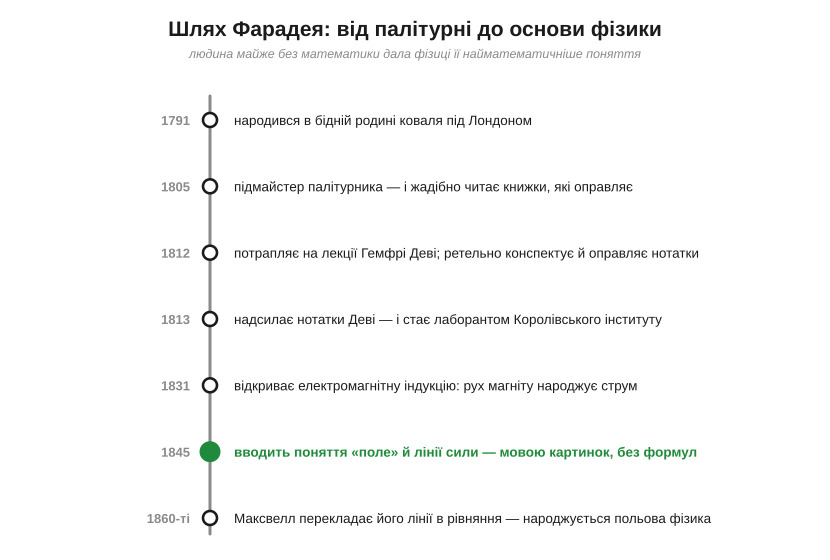
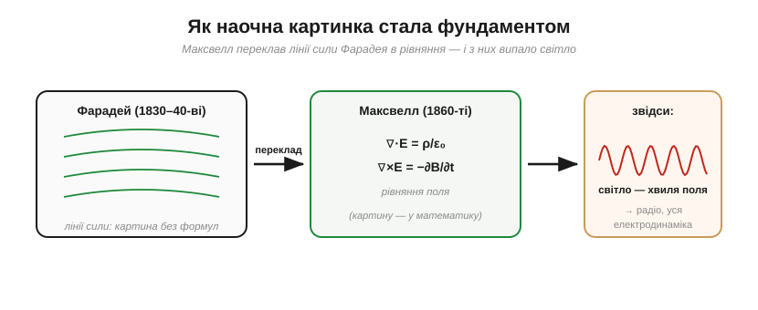

# 📜 Фарадей — людина, що вигадала поле

> Історична вставка до поняття [електричного поля](book:physics/electric-field) — посередника між зарядами. Сьогодні ми кидаємося словом «поле» так буденно, що годі й уявити: колись його довелося **винайти**. І зробив це чи не найнесподіваніший кандидат — самоук-палітурник, який ледь знав алгебру. Як людина майже без математики подарувала фізиці одну з найматематичніших ідей? Бо вона **думала образами**, а не формулами, — і бачила лінії сили там, де інші бачили порожнечу.

[Закон Кулона](book:physics/coulomb-law) дає силу між зарядами, але мовчить, *що* передає її крізь порожнечу, — і саме тут постає поняття поля. А за цим поняттям стоїть постать, варта окремої розповіді, — **Майкл Фарадей** (*Michael Faraday*, 1791–1867).

---

## Від палітурні до науки: шлях Фарадея

На зламі XVIII–XIX століть наука була розвагою джентльменів — людей із достатком, дозвіллям і університетом за плечима. Фарадей не мав нічого з цього. Він народився 1791 року в бідній родині коваля під Лондоном, а з формальної освіти виніс хіба що початки читання й лічби. У чотирнадцять його віддали в підмайстри до **палітурника**.

І тут сталося головне. Хлопець не просто оправляв книжки — він їх **читав**. Особливо його зачепили стаття про електрику в «Британській енциклопедії» та «Бесіди про хімію» Джейн Марсе. Жага знань була така, що Фарадей сам ставив дрібні досліди й вів зошити.

*Маршрут, у який важко повірити: підмайстер палітурника → жадібний читач → лаборант-посудомий → відкривач індукції → винахідник поняття «поле». Кожен крок — на чистій цікавості й завзятті, без жодних привілеїв.*

Один із клієнтів палітурні дав Фарадею квитки на публічні лекції славетного хіміка **Гемфрі Деві** (*Humphry Davy*) у Королівському інституті. Фарадей не лише ретельно законспектував лекції — він **оправив свої нотатки** в гарну книжечку й надіслав її Деві з проханням про будь-яку роботу в науці. Деві був вражений і 1813 року взяв його лаборантом — спершу, по суті, мити посуд і чистити прилади. Згодом, коли Деві питали про його найбільше відкриття, він, кажуть, відповідав: «Майкл Фарадей». І мав рацію.

Утім, ця історія мала й гірку грань. Деві, який відкрив Фарадея, з роками почав ревнувати до слави учня — і, за переказами, навіть виступав проти його обрання до Королівського товариства. Учень переростав учителя, і вчителеві це давалося нелегко. Фарадей же до кінця згадував Деві з вдячністю — у цьому теж був увесь він.

> 🔧 **Навіщо це.** Історія Фарадея — нагадування, що в науці й інженерії **цікавість і наполегливість важать більше за родовід чи диплом**. Найкращі речі часто роблять ті, хто просто не міг не дізнатися, «а як воно влаштоване».

---

## Що в проміжку між тілами: порожнеча чи ні

На той час фізику електрики й магнетизму писали мовою **дії на відстані**. 1820 року Ерстед показав, що струм відхиляє стрілку компаса (електрика породжує магнетизм), і континентальні математики — Ампер, Пуассон — кинулися описувати ці сили формулами на кшталт Кулонової: заряди й полюси притягуються «крізь порожнечу» за певним законом, і край. Відкриття Ерстеда наелектризувало всю Європу — за лічені місяці Ампер звів взаємодію струмів у струнку математичну теорію, і саме вона стала «правильною», модною наукою. На її тлі Фарадеєві думки про якісь невидимі лінії, що пронизують простір, видавалися кроком назад — до донаукової наївності.

Фарадея ця картина не вдовольняла — а позаяк важкої математики він не знав, то й не міг сховатися за формулами. Натомість він поставив на позір наївне, але глибоке питання: **а що насправді відбувається в просторі між тілами?** Невже там абсолютно нічого, і сила якимось дивом стрибає через пустку? Фарадей нутром відчував: простір **не порожній**, у ньому щось є — щось, що й переносить силу від тіла до тіла.

---

## Як побачити невидиме: лінії сили

І ось проста демонстрація, що стала для Фарадея одкровенням. Насипте залізних ошурок біля магніту — і вони вмить шикуються в чіткі **криві лінії**, що тягнуться від полюса до полюса. Для більшості це був цікавий фокус. Для Фарадея — **карта реальності**.

*Ошурки роблять видимими **лінії сили**. Фарадей сприйняв їх буквально — як справжній стан простору довкола магніту. Ту саму ідею ліній, що пронизують простір, він переніс і на заряди — і це рівно лінії [електричного поля](book:physics/electric-field).*

Він назвав ці криві **лініями сили** (*lines of force*), а простір, наскрізь пронизаний ними, — спершу описово, а близько 1845 року й самим словом **поле** (*field*). Це і є та відповідь, що стоїть за поняттям [електричного поля](book:physics/electric-field): заряд (чи магніт) не діє на інше тіло безпосередньо через пустку — він **змінює простір** довкола себе, наповнює його лініями, а вже інше тіло реагує на поле **локально**, там, де воно стоїть. Посередник — поле — нарешті був названий.

Більше того, Фарадей наділяв лінії майже механічними властивостями. Він уявляв, що вони **натягнуті вздовж**, наче пружні гумки (тому різнойменні заряди тягнуться один до одного — лінії «стягують» їх), і водночас **розпирають одна одну впоперек** (тому однойменні розходяться, а пучок ліній прагне роздутися вшир). Ця груба, та напрочуд робоча картина дозволяла йому «відчувати» поле мало не руками — передбачати, куди воно штовхне й де згустіє, — задовго до будь-яких рівнянь. Те, що математики згодом виведуть формулами, Фарадей уже **бачив**.

> 🔧 **Навіщо це.** Кожен раз, коли інженер каже «поле», «силові лінії», «екран від наведень», він мислить категоріями Фарадея. Картинка ліній — не дитяче спрощення, а робочий інструмент: дивлячись на лінії, одразу бачиш, де поле сильне (густо) і куди штовхне заряд (за дотичною).

---

## Чому з нього кепкували — і чому правда була за ним

Академічні математики дивилися на «лінії сили» зверхньо. Справжня наука, вважали вони, — це інтеграли дії на відстані, а Фарадеєві криві — наївне махання руками людини, яка не годна написати жодного рівняння. І формально вони мали рацію: Фарадей **не міг** записати свої лінії математично.

Та сталося парадоксальне: саме **картинка** дала змогу Фарадею **відкрити** те, що проґавили формули. 1831 року, думаючи про лінії сили, він зробив одне з найвагоміших відкриттів усіх часів — **електромагнітну індукцію**: рухаючи магніт крізь котушку, він побачив, що в ній народжується струм. Фарадей уявляв це як провідник, що **«перетинає» лінії сили**, — і саме образ ліній підказав йому, де й коли шукати ефект. (Сам механізм [електромагнітної індукції](book:physics/electromagnetic-induction) — велика окрема тема; тут важливо інше: інтуїтивна картина виявилася не лише гарною, а **передбачливою**.)

Показово, де саме картина перемогла формули: рівняння дії на відстані аж ніяк не натякали, що **рух** магніту має щось дати, — а наочний образ ліній, які провідник «перетинає», прямо вів до досліду. Картина не лише описувала вже відоме — вона **підказувала, де копати**. У цьому й сила доброї інтуїції: вона породжує нові питання, а не лише впорядковує старі відповіді.

На цьому відкритті — індукції — згодом постане вся електрична доба: генератори, трансформатори, двигуни. Усе це виросло з людини, що думала лініями, а не рівняннями.

---

## Як картинка стала фундаментом: Максвелл

Лишалося замкнути коло — поєднати наочність Фарадея з суворою математикою. Це зробив **Джеймс Клерк Максвелл** (*James Clerk Maxwell*). Молодий блискучий математик уважно прочитав «Експериментальні дослідження» Фарадея й здійснив диво перекладу: він **перевів лінії сили на мову рівнянь** — славетні рівняння Максвелла.

*Максвелл переклав наочні лінії Фарадея в точні рівняння поля — і з них несподівано «випало», що світло є **хвилею самого поля**. Найнаочніша ідея обернулася на найфундаментальнішу — а згодом дала радіо й усю електродинаміку.*

Максвелл прямо віддавав належне Фарадею, написавши, що той «своїм внутрішнім зором бачив лінії сили, які пронизують увесь простір, там, де математики бачили лише центри сил, що притягуються на відстані». А далі сталося неймовірне: з рівнянь поля випливало, що **світло — це електромагнітна хвиля**, брижа самого поля, що біжить простором зі швидкістю, яку рівняння передбачали наперед.

Наслідки годі переоцінити. Виявилося, що видиме світло, радіохвилі, рентген — це **те саме** явище, хвилі одного поля, лише різної частоти. Електрика, магнетизм і оптика, які доти вважали окремими науками, злилися в одну. А за кілька десятиліть Герц упіймає ці хвилі в лабораторії, а Марконі пошле їх через океан — народиться радіо. Так «наївна» картинка палітурника не лише вистояла проти «суворої» математики — вона її **породила** й привела до всієї сучасної електродинаміки.

---

## Чому Фарадей лишився взірцем

Варто сказати і про людину. Здобувши славу, Фарадей **відмовився** від лицарського звання й від посади президента Королівського товариства — він волів залишитися простим дослідником на платні. Глибоко релігійний і скромний, він відмовився працювати над бойовими отруйними газами. Він обрав знання й чесність замість багатства й почестей.

Особливо промовистим був його просвітницький бік. Фарадей заснував у Королівському інституті **різдвяні лекції для дітей**, які тривають донині, і вважав, що пояснити науку простими словами та живими дослідами — не нижче за саме відкриття. Його «Хімічна історія свічки», де зі звичайнісінької свічки виростає мало не вся хімія, й досі лишається взірцем того, як треба вчити: спершу — **зрозуміти й показати**, а вже потім — формули.

---

## Не лише поле: інші монументи Фарадея

Поле — найвідоміший, та аж ніяк не єдиний дарунок Фарадея. Ще **1821 року**, за десять років до індукції, він змусив дріт зі струмом **безперервно обертатися** навколо магніту. Це було перше в історії перетворення електрики на тривалий **рух** — прапрадід кожного електромотора, від крихітного вібромотора у смартфоні до приводів дрона.

А його праці з **електролізу** подарували нам цілий словник. Разом із філологом Вільямом Г'юеллом Фарадей увів терміни, які ви щодня бачите в електроніці та хімії: **іон** (*ion*), **електрод** (*electrode*), **анод** (*anode*), **катод** (*cathode*), **електроліт** (*electrolyte*). Напис «cathode» на корпусі діода чи «анод/катод» у даташиті світлодіода — теж його спадщина.

Був він і першокласним хіміком: відкрив **бензен**, навчився **зріджувати гази** під тиском. Рідко в одній людині поєднувалося стільки відкриттів — і з такою скромністю.

> 🔧 **Навіщо це.** Половина слів, якими ви описуєте батарею чи світлодіод — *анод*, *катод*, *електрод*, *іон*, — прийшли від Фарадея, і в англомовних даташитах вони ті самі (*anode/cathode*). А його перший «мотор» 1821 року — це початок усієї електромеханіки.

## Чим це відгукнулося

Слід Фарадея — усюди в електроніці, навіть там, де його не згадують:

- **Фарад** (*farad*, **Ф**) — одиниця ємності — названа його іменем; як і стала Фарадея в електрохімії.
- **[Клітка (екран) Фарадея](book:physics/faraday-cage)** — те, чим захищають електроніку від наведень, — це його ж дослід із «відром із льодом» і та сама «порожнеча всередині», що її колись передбачив Прістлі.
- **Саме поняття [поля](book:physics/electric-field)** — те, чим інженер думає про вплив, наведення, екранування, антени, — це спадок Фарадея.

Озирнімося. Бідний хлопчина, що читав книжки замість того, щоб лише їх оправляти, побачив **реальність там, де інші бачили пустку**, дав їй ім'я — поле — і так заклав фундамент, на якому стоять світло, радіо й уся електроніка. А найбільший урок його історії — для кожного, хто вчиться: **думати образами не соромно**. Найглибші ідеї фізики часто народжуються не з формули, а з яскравої картинки в уяві — а математика приходить пізніше, щоб ту картинку відточити. Тож наступного разу, малюючи силові лінії на берегах зошита чи прикидаючи, куди «потече» наведення на платі, згадайте: ви користуєтесь інструментом, який викував для нас підмайстер палітурника — людина, що просто не могла не дізнатися, як улаштований світ.
