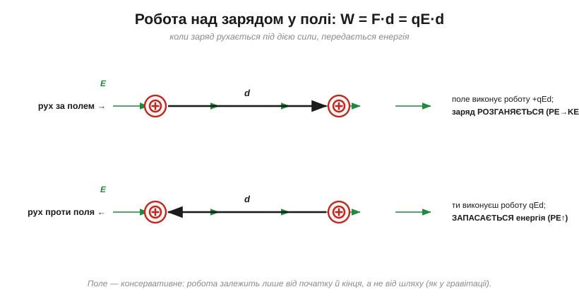
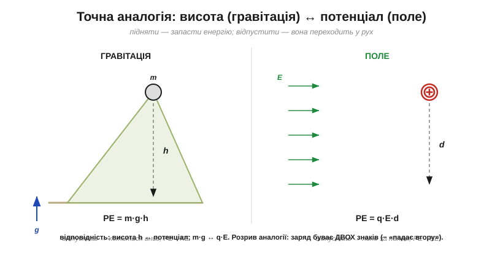
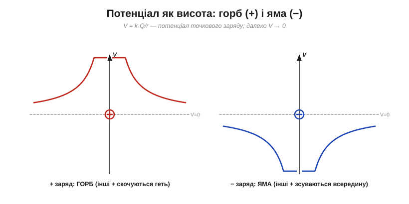
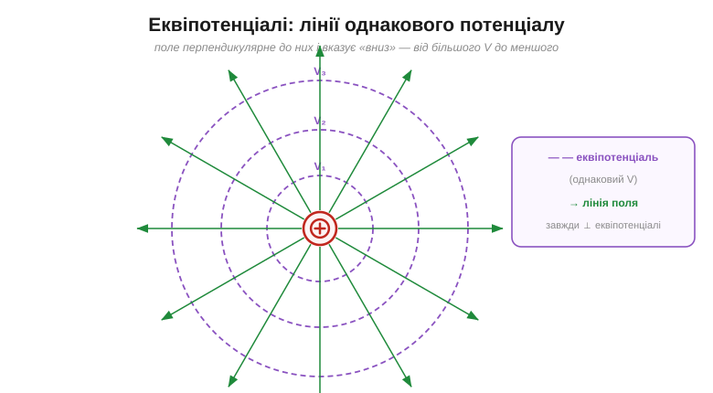
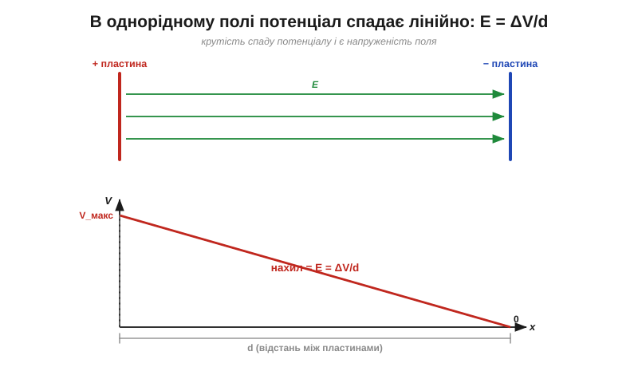

# Робота, потенціальна енергія й потенціал

[Електричне поле](book:physics/electric-field) каже, **з якою силою** воно штовхає заряд у кожній точці (F = qE). Але сила — це ще не вся історія. Щойно заряд під дією цієї сили **рушає**, виконується **робота**, і переноситься **енергія**. А енергія — це, врешті, те, заради чого існує вся електроніка: батарея її **запасає**, коло — **доставляє**, навантаження — **витрачає**. Тож зробімо вирішальний крок: від сили перейдімо до **енергії** — і так природно прийдемо до **потенціалу**.

### Робота: переміщення заряду в полі

З механіки відомо: коли сила *F* тягне тіло вздовж переміщення *d*, вона виконує **роботу** W = F·d (якщо сила вздовж руху). Робота — це і є передана енергія, у джоулях (*joule*, Дж). Для заряду в однорідному полі сила дорівнює qE, тож

```
W = F · d = q · E · d
```


*Якщо заряд рухається **за полем**, роботу виконує саме поле (+qE·d): заряд розганяється, його потенціальна енергія переходить у рух. Якщо ж тягти заряд **проти поля**, роботу виконуєте **ви** — і енергія запасається. Поле консервативне: робота залежить лише від початку й кінця шляху, а не від траєкторії.*

Окремо наголосімо на ключовій рисі цього поля — **консервативності** (*conservative field*). Вона означає, що робота з переміщення заряду між двома точками **однакова, хоч би яким шляхом** ми його вели — прямо, дугою чи зиґзаґом. А це й дає право говорити про **запасену енергію**, що залежить тільки від положення: точнісінько як у гравітації.

### Потенціальна енергія: точна аналогія з висотою

Підняти камінь угору — означає **запасти** в ньому потенціальну енергію (*potential energy*, PE): відпустиш — він упаде, і PE перейде в рух (кінетичну енергію). Із зарядом у полі — те саме. Перемістити додатний заряд **проти** поля — наче підняти його «вгору» електричним пагорбом: запасається PE. Відпустиш — поле «скине» його вниз, розганяючи.


*Зліва камінь масою m на висоті h має PE = m·g·h. Справа заряд q, зміщений на d проти поля E, має PE = q·E·d. Відповідність точна: **висота h ↔ потенціал**, а **m·g ↔ q·E**. Де аналогія ламається: заряд буває двох знаків, тож від'ємний «падає вгору» — проти напрямку поля.*

Ця аналогія — не поетичний образ, а **робочий інструмент**, бо математика обох випадків однакова (обидві сили консервативні). Тому всю інтуїцію про висоту, схили й скочування можна сміливо переносити на заряди — з єдиним застереженням про два знаки.

### Потенціал: енергія на одиницю заряду

Потенціальна енергія qEd залежить і від поля, і від самого заряду q. Щоб дістати характеристику **тільки точки простору** (так само [напруженість поля](book:physics/electric-field) E = F/q очищає силу від заряду), поділімо енергію на заряд. Дістанемо **електричний потенціал** (*electric potential*, V):

```
V = PE / q          (одиниця: Дж/Кл = вольт, V)
```

Потенціал — це **потенціальна енергія, що припала б на кожен кулон** заряду в цій точці. Він відіграє роль «електричної висоти»: показує, наскільки високо в енергетичному ландшафті лежить точка. Одиниця Дж/Кл має власне ім'я — [**вольт**](book:physics/volt) (*volt*, В); 1 вольт = 1 джоуль на кулон.

Для точкового заряду потенціал виходить V = k·Q/r. Він походить не із сили, а з **енергії**: це потенціальна енергія U = k·Q·q/r, поділена на заряд q. (А якби ми поділили на q саму **силу** k·Q·q/r², дістали б не потенціал, а поле E = k·Q/r².) Тому потенціал спадає як 1/r, а поле — як 1/r². Потенціал зручно уявляти ландшафтом:


*Додатний заряд творить **горб** потенціалу (інші додатні заряди «скочуються» з нього геть), від'ємний — **яму** (додатні зсуваються всередину). Далеко від заряду потенціал прямує до нуля. Це наочна «висота» електричного рельєфу.*

Чому ж поле спадає як 1/r², а потенціал — лише як 1/r? Бо потенціал — це **накопичена** робота на всьому шляху від нескінченності до точки. Навіть там, де поле вже слабеньке, воно все одно потроху додає енергію на кожному відрізку шляху, і ці внески підсумовуються. Тому потенціал «згасає» повільніше за поле: поле — це **крутість** рельєфу в точці, а потенціал — сама **висота**, що накопичилася за весь підйом.

> 🧮 Оте «накопичення роботи» змінної сили — це строго **площа під кривою сили**, тобто інтеграл; саме він і пояснює, чому інтегрування 1/r² дає 1/r (потенціал на степінь «повільніший» за поле): [Робота як інтеграл: площа під кривою сили](book:physics/electric-potential/math-work-integral.md).

> 🔧 **Навіщо це.** Потенціал (точніше, його **різниця**) — це і є **напруга**, яку показує мультиметр і яку «дає» батарея. Коли на елементі написано «3.7 В», це означає: кожен кулон заряду, пройшовши через нього, несе 3.7 джоуля енергії. Уся робота з колами — це робота з потенціалом, тож засвоїти його як «електричну висоту» варто міцно.

### Еквіпотенціалі: де поле й потенціал зустрічаються

Якщо потенціал — це висота, то в рельєфі є **лінії однакової висоти** — як ізогіпси на карті. Тут їх звуть **еквіпотенціалями** (*equipotentials*): лінії (а в просторі — поверхні) однакового V. І між ними та полем є строгий геометричний зв'язок.


*Еквіпотенціалі (фіолетові) — лінії однакового потенціалу; навколо точкового заряду це кола. Лінії поля (зелені) **завжди перпендикулярні** до них і вказують у бік **меншого** потенціалу. Поле «дивиться вниз із пагорба» — туди, куди скотився б додатний заряд.*

Цей зв'язок практичний: рухаючись **уздовж** еквіпотенціалі, заряд не змінює енергії (робота нульова — бо немає складової поля вздовж руху); а найшвидше енергія міняється **поперек** них, уздовж поля. Поверхня будь-якого провідника, до речі, — завжди еквіпотенціаль (інакше заряди на ній рухалися б), і тому [лінії поля](book:physics/electric-field) впираються в метал під прямим кутом.

### Різниця потенціалів — і чому нуль обираємо самі

Тут ховається тонкість, що бентежить новачків. Сам по собі потенціал у точці — величина **відносна**: вона залежить від того, де ми домовилися вважати «нуль». Фізичний сенс має лише **різниця потенціалів** між двома точками — її й називають **напругою** (*voltage*) і саме її переносить заряд як енергію.


*Має значення лише різниця ΔV = V_A − V_B (це й є напруга між A і B). Сам «нуль» обираємо довільно — як рівень моря для висоти гір. Зсунь опорний рівень куди завгодно — окремі V_A і V_B зміняться, та їхня **різниця** лишиться незмінною.*

Тому в кожній схемі обирають **опорну точку** — «нуль вольтів», або **землю** (*ground*, GND), — і всі напруги міряють відносно неї. Це не фізичний абсолют, а зручна угода, як домовитися рахувати висоту від рівня моря. Звідси й практика: «напруга у вузлі» завжди мається на увазі **відносно землі**.

І ось чому напруга так тісно сплетена з енергією на практиці. Якщо заряд q «скочується» з вищого потенціалу на нижчий через різницю ΔV, він **віддає** енергію W = q·ΔV — саме її коло й пускає в діло (на світло, тепло, рух). Батарея ж робить зворотне: вона, наче насос, **піднімає** заряд на вищий потенціал, запасаючи енергію, щоб згодом коло «спустило» його вниз із користю. Тож напруга — це буквально «скільки джоулів на кожен кулон» готове віддати джерело.

> 🔧 **Навіщо це.** Ось чому мультиметр має **два** щупи: він міряє не «потенціал тут», а **різницю** між двома точками. І чому в кожній схемі є шина **GND**: це спільний нуль, від якого відлічують усі напруги. Плутанина з тим, «відносно чого» виміряна напруга, — класичне джерело помилок; пам'ятайте, що значення має лише різниця.

### Поле — це крутість потенціалу: E = ΔV/d

З'єднаймо [поле](book:physics/electric-field) й потенціал однією практичною формулою. В однорідному полі (між зарядженими пластинами) потенціал спадає **лінійно** від однієї пластини до іншої. А крутість цього спаду — і є напруженість поля.


*Між пластинами потенціал V падає рівномірно вздовж проміжку; нахил прямої V(x) і є напруженість: E = ΔV/d. Тому одиницю поля Н/Кл часто записують як **В/м** (вольт на метр) — це те саме.*

```
E = ΔV / d        (однорідне поле)
```

Звідси видно важливе: поле залежить не лише від напруги, а від напруги **на одиницю відстані**. Невелика напруга на дуже тонкому проміжку дає **величезне** поле.

**Приклад (енергія від напруги).** Скільки енергії несе заряд q = 2 мкКл, пройшовши різницю потенціалів ΔV = 9 В?

```
W = q · ΔV
W = (2 × 10⁻⁶ Кл) · (9 В)
W = 1.8 × 10⁻⁵ Дж = 18 мкДж
```

**Приклад (яка напруга пробиває 1 мм повітря).** Повітря пробивається, коли поле сягає E ≈ 3×10⁶ В/м. Яка для цього потрібна напруга на проміжку d = 1 мм?

```
ΔV = E · d
ΔV = (3 × 10⁶ В/м) · (1 × 10⁻³ м)
ΔV ≈ 3000 В = 3 кВ
```

Тобто, щоб іскра перескочила 1 мм повітря, потрібно близько 3 кВ — а на проміжку в 10 разів тоншому вистачить уже ~300 В. Ось чому тонка ізоляція й малі зазори такі вразливі: за тієї самої напруги поле в них у рази більше.

> 🔧 **Навіщо це.** Формула E = ΔV/d — щоденний інструмент: за нею прикидають, чи витримає ізоляція задану напругу й який мінімальний зазор лишити між доріжками на платі. У світі мікроелектроніки, де ізолятори завтовшки в нанометри, навіть кілька вольтів створюють поля на межі пробою — звідси сувора межа на допустимі напруги.

### Зручна одиниця енергії: електронвольт

У світі окремих зарядів джоуль — одиниця незручно велика. Тому фізики й електронники користуються **електронвольтом** (*electronvolt*, еВ): це енергія, яку набирає один елементарний заряд, пройшовши різницю потенціалів в 1 вольт.

```
1 еВ = e · (1 В) = 1.602 × 10⁻¹⁹ Дж
```

Уся зручність — у тому, що енергію відразу **читають із напруги**: електрон, прискорений ста вольтами, дістає рівно 100 еВ, і рахувати нічого. В електронвольтах вимірюють ширину забороненої зони напівпровідників, енергію фотонів світла, рівні в атомі — усе, де природніше думати «на один заряд». Це той самий принцип «на одиницю заряду», що й сам потенціал, лише застосований до енергії.

---

Отже, коли заряд рухається в полі, виконується **робота** (W = qE·d), а оскільки поле **консервативне** — можна говорити про запасену **потенціальну енергію**, точно як про висоту в гравітації. Енергія на одиницю заряду — це **потенціал** V (одиниця — вольт, Дж/Кл); фізичний сенс має лише його **різниця** (напруга), яку міряють відносно обраного нуля-землі; а крутість потенціалу і є поле, E = ΔV/d. Вольт ми ввели майже мимохідь — а тим часом це **найголовніша** робоча величина всієї електроніки, і за іменем [вольта](book:physics/volt) стоїть окрема історія.

---
