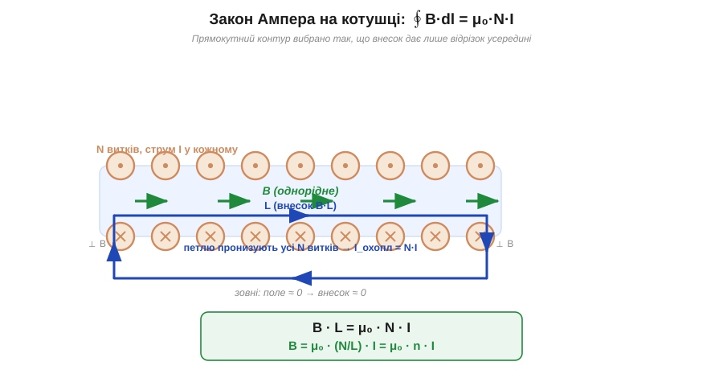
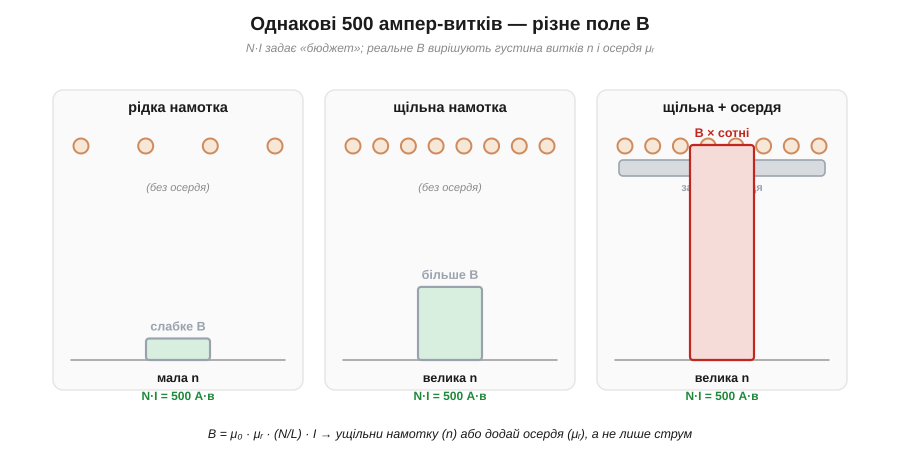

# 🧮 Ампер-витки: оцінити поле котушки із закону Ампера

> Числова вставка до теми [«Електромагніт: котушка, осердя, ампер-витки»](book:physics/electromagnet). Якісно картина проста: пропусти струм крізь котушку — і вона стає магнітом, а залізне осердя робить поле сильнішим. Тут переведемо це в число. Закон Ампера дає коротку формулу, що зв'язує поле всередині котушки з добутком «витки × струм» — і одразу показує, за які важелі тягнути, щоб поле зросло.

### Магніторушійна сила: означення

Почнімо з величини, яка «жене» магнітне поле. Її називають **магніторушійною силою** (*magnetomotive force*, MMF, 𝓕) — за прямою аналогією з ЕРС, що жене струм. Для котушки з N витків, по кожному з яких тече струм I, означення просте:

```
𝓕 = N · I        [ампер-витки, А·в  (англ. ampere-turns, A·t)]
```

Одиниця — **ампер-виток**: 100 витків зі струмом 1 А дають ту саму «силу», що 1 виток зі струмом 100 А, бо в обох випадках N·I = 100. Саме тому в електромагнітах важать не великий струм і не багато витків окремо, а їхній **добуток**: 500 ампер-витків можна зібрати як завгодно — 500 витків × 1 А чи 50 витків × 10 А.

### Інтуїція: кожен виток додає свій внесок

Чому саме добуток? Один [виток зі струмом](book:physics/oersted-experiment) створює навколо себе магнітне поле, і всередині витка лінії поля йдуть в один бік (правило правої руки). Складімо витки в стос — котушку (*solenoid*). Тепер усередині поля кожного витка **додаються** в одному напрямку, а ззовні — частково гасять одне одного. Що більше витків і що більший струм у кожному, то сильніше сумарне поле всередині. Грубо кажучи, поле «не знає», звідки взялися ампер-витки, — воно реагує лише на повну суму N·I, яку охоплює його контур.

Ця думка — не просто аналогія: вона є точним наслідком **закону Ампера**.

### Формальний апарат: закон Ампера

Закон Ампера зв'язує магнітне поле B з охопленим струмом. Формально це **циркуляція** вектора B по замкненому контуру:

```
∮ B · dl = μ₀ · I_охопл
```

Зліва — сума (інтеграл) проєкцій B на напрям обходу вздовж усієї замкненої петлі; справа — повний струм, що пронизує цю петлю, помножений на магнітну сталу μ₀ = 4π × 10⁻⁷ Тл·м/А. Інтеграл лякає лише на вигляд: для котушки правильно вибраний контур обнуляє майже всі його частини.


*Закон Ампера на довгій котушці. Беремо прямокутний контур: відрізок усередині (довжина L, поле B однорідне й уздовж осі) дає внесок B·L; два бічні відрізки перпендикулярні до B — внесок нуль; зовнішній відрізок проходить там, де поле майже нульове. Петлю пронизують N витків зі струмом I, тобто охоплений струм N·I. Звідси B·L = μ₀·N·I.*

Виберемо прямокутний контур уздовж осі довгої котушки, як на рисунку. Поле всередині однорідне й спрямоване вздовж осі, тож на внутрішньому відрізку довжиною L циркуляція дає просто B·L. На двох коротких бічних відрізках B перпендикулярне до руху — внесок нуль. Зовнішній відрізок ведемо далеко, де поле прямує до нуля. Лишається тільки внутрішній відрізок:

```
B · L = μ₀ · N · I
```

Звідси — головна **оцінка поля довгої котушки**:

```
B = μ₀ · (N / L) · I = μ₀ · n · I        n = N/L  [витків на метр]
```

Тут n = N/L — **густина витків** (*turns per metre*). Зверніть увагу: поле залежить не від повного числа витків, а від того, **скільки їх припадає на метр довжини**. Дві котушки з однаковим N·I, але різної довжини дадуть різне поле.

Окремо виділяють **напруженість магнітного поля** (*magnetic field strength*, H), яка прибирає μ₀ і прив'язана прямо до ампер-витків на метр:

```
H = N·I / L = n·I        [А/м],     B = μ₀ · H  (у вакуумі/повітрі)
```

H — це, по суті, «щільність наміру»: скільки ампер-витків ти подаєш на кожен метр магнітного шляху. Вона зручна тим, що від матеріалу не залежить; від матеріалу залежить уже відгук B.

### Осердя: множник μᵣ

Тепер додаймо залізне осердя — те, заради чого електромагніт і роблять. Магнітне середовище підсилює поле в **μᵣ** разів (*relative permeability*, відносна магнітна проникність):

```
B = μ₀ · μᵣ · n · I = μ · H,     μ = μ₀·μᵣ
```

Для повітря μᵣ ≈ 1, а для електротехнічної сталі μᵣ — це **сотні й тисячі**. Ось чому осердя так різко підсилює поле тими самими ампер-витками: ту саму H залізо «перетворює» в багатократно більше B. Тут і ховається підступ: μᵣ не стала — на великих полях залізо [насичується](book:physics/saturation-hysteresis) й множник падає; для **оцінки** беремо приблизне табличне μᵣ й пам'ятаємо, що це стеля.


*Три котушки з однаковими 500 ампер-витками (N·I = 500). Зліва — рідка намотка (мала n) дає слабке B; посередині — щільніша намотка (більша n) піднімає B; справа — та сама щільна котушка із залізним осердям (μᵣ) множить B у сотні разів. Висновок: ампер-витки задають «бюджет», а реальне поле вирішують густина витків n і проникність осердя μᵣ.*

**Приклад (оцінити поле котушки).** Котушка: N = 400 витків, довжина L = 5 см = 0.05 м, струм I = 0.5 А. Спершу без осердя, потім із сталевим (візьмемо μᵣ ≈ 600).

```
ампер-витки:  N·I  = 400 × 0.5            = 200 А·в
густина:      n    = N/L = 400 / 0.05     = 8000 витків/м
напруженість: H    = n·I = 8000 × 0.5     = 4000 А/м

без осердя:   B = μ₀·H
                = (4π×10⁻⁷) × 4000
                ≈ 1.26×10⁻⁶ × 4000
                ≈ 5.0×10⁻³ Тл  = 5.0 мТл

із осердям:   B = μᵣ · 5.0 мТл = 600 × 5.0 мТл
                ≈ 3.0 Тл  (!)
```

Перше число, 5 мТл, реалістичне — приблизно як у непоганого постійного магніту на відстані. Друге, 3 Тл, фізично завелике: справжня сталь задовго до цього **насититься** і далі поле так не зростатиме (звідси й знак «(!)» та обережність із табличним μᵣ). Та оцінка все одно корисна — вона миттєво показує: без осердя поле кволеньке, а осердя — це головний множник. Якщо потрібне більше — найдешевше додати осердя й ущільнити намотку (підняти n), а не гнатися за струмом, що лише гріє провід.

> 🔧 **Навіщо це.** Ця одна формула B ≈ μ₀·μᵣ·(N/L)·I — робочий інструмент розробника електромагнітів: прикинути поле реле чи соленоїда, зрозуміти, чому виробник вказує саме ампер-витки, і вибрати, як їх набрати — більше витків тонкого дроту чи менше товстого під заданий струм.

### Де це працює

Ампер-витки — наскрізна величина всюди, де струм роблять магнітом. В [електромагніті](book:physics/electromagnet) вони задають його тягу; та сама формула B = μ₀·n·I описує поле будь-якої котушки й через нього — її індуктивність. Закон Ампера, з якого все вийшло, — це той самий інструмент, що пов'язує [струм із полем навколо проводу](book:physics/oersted-experiment), лише застосований до цілого стосу витків. А множник μᵣ та його стелю задає [насичення осердя](book:physics/saturation-hysteresis): до певного поля залізо багатократно підсилює H, далі — перестає.
