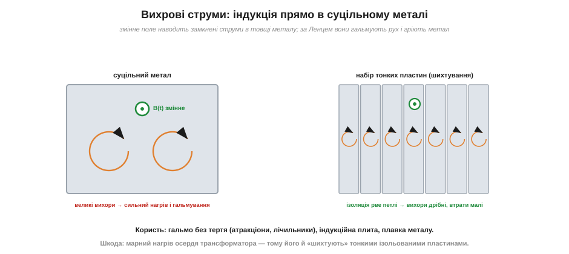

# Електромагнітна індукція: закон Фарадея, правило Ленца, вихрові струми

Є глибока істина: [струм народжує магнітне поле](book:physics/oersted-experiment). Електрика творить магнетизм. Але природа рідко буває однобокою, і протягом 1820-х років фізиків мучило симетричне питання: якщо струм робить поле, то чи не може **поле зробити струм**? Чи можна, маючи магніт, видобути з дроту електрику? Десять років спроб давали нуль — нерухомий магніт, хоч який сильний, не наводив у сусідньому дроті ані найменшого струму. Розгадку знайшов 1831 року Майкл Фарадей, і вона виявилася настільки глибокою, що на ній стоїть уся світова електроенергетика.

### Відкриття Фарадея: важлива зміна, а не саме поле

Ключ, який десять років не давався в руки, був ось у чому: струм наводить не саме поле, а його **зміна**. Нерухомий магніт біля котушки не дає нічого. Але **рухомий** магніт — дає. Фарадей узяв котушку, під'єднав до неї гальванометр (чутливий вимірювач струму) і почав **рухати** крізь неї магніт. Поки магніт рухався — стрілка гальванометра відхилялася, у колі тік струм. Магніт зупинявся — струм миттю зникав, хоч поле магніту нікуди не ділося. Висмикував магніт назад — струм з'являвся знову, але **в інший бік**.


*Рис. Електромагнітна індукція. Магніт вдвигають у котушку — магнітний потік крізь неї росте, і виникає струм (стрілка гальванометра відхиляється). Магніт стоїть — потік сталий, струму немає. Магніт висмикують — потік падає, і струм тече у протилежний бік. Важлива саме швидкість зміни потоку, а не його величина.*

Це й була розгадка десятиліття: значення має **швидкість зміни** магнітного поля крізь котушку, а не саме поле. Явище назвали **електромагнітною індукцією** (*electromagnetic induction*), а наведену напругу — **електрорушійною силою індукції** (ЕРС, *induced emf*).

### Закон Фарадея: ЕРС = швидкість зміни потоку

Щоб записати це кількісно, потрібне поняття **магнітного потоку** (*magnetic flux*, Φ) — міри того, скільки силових ліній поля пронизує контур. Кількісно потік дорівнює добутку поля на площу й на косинус кута між полем і нормаллю до контуру:

```
Φ = B · A · cosθ        (одиниця — вебер, Вб = Тл·м²)
```

Звідси видно три способи **змінити** потік, а отже, навести ЕРС: змінити **поле** B (рухаючи магніт ближче/далі, як у досліді Фарадея), змінити **площу** A контуру (стискаючи чи розтягуючи рамку), або змінити **кут** θ (повертаючи рамку в полі — саме так працює генератор). Усі три способи зводяться до одного: важлива швидкість, з якою Φ міняється в часі. Закон Фарадея каже:

```
ЕРС = −N · (ΔΦ / Δt)
```

де **N** — кількість витків котушки, а **ΔΦ/Δt** — швидкість зміни потоку. Наведена напруга дорівнює швидкості, з якою змінюється потік крізь котушку, помноженій на число витків. Звідси все стає на місця: рухаєш магніт швидше — потік міняється швидше — більша ЕРС; більше витків — більша ЕРС; сильніший магніт — більший потік і знову більша ЕРС. А якщо нічого не міняється (магніт стоїть) — ΔΦ = 0, і ЕРС = 0. Знак «мінус» у формулі — це окремий і важливий персонаж, і він кодує напрям наведеного струму.

Є й приємний зв'язок із [силою Лоренца](book:physics/hall-effect), що робить індукцію зовсім не загадковою. Уявімо найпростіший випадок: прямий провідник завдовжки L ковзає зі швидкістю v по рейках упоперек поля B. Кожен вільний заряд у провіднику рухається разом із ним зі швидкістю v у полі B, тож на нього діє сила Лоренца F = q·v·B, що жене заряди вздовж провідника — буквально як насос. Це й створює напругу на кінцях: ЕРС = B·L·v. Жодної містики — та сама магнітна сила на заряди діє в рухомому дроті. Цей випадок (його звуть **ЕРС руху**, *motional emf*) — найнаочніший спосіб переконатися, що індукція й магнітна сила на заряди — це одне явище, побачене з різних боків. А загальний закон Фарадея охоплює і його, і випадок нерухомого контуру зі змінним полем.

### Правило Ленца: наведений струм завжди протидіє

Що означає той «мінус»? Його зміст сформулював **Емілій Ленц** (*Emil Lenz*) у вигляді чудово простого правила: **наведений струм завжди спрямований так, щоб протидіяти тій зміні, що його породила**. Якщо магніт наближається — наведений струм створює поле, що **відштовхує** магніт (намагається не пустити). Якщо магніт віддаляється — струм створює поле, що **притягує** його назад (намагається втримати). Котушка завжди «опирається» зміні потоку.


*Рис. Правило Ленца. Коли магніт наближається північним полюсом, наведений струм робить ближній бік котушки теж північним — щоб відштовхнути магніт. Коли магніт віддаляється, струм міняє напрям і робить ближній бік південним — щоб притягнути магніт назад. У будь-якому разі котушка протидіє руху.*

Чому природа така «вперта»? Бо інакше порушувався б **закон збереження енергії**. Уявіть, що наведений струм навпаки **підсилював** би рух магніту: тоді магніт розганявся б сам, струм зростав, давав ще більше розгону — і ми б отримали нескінченну енергію з нічого, вічний двигун. Природа цього не дозволяє. Тому наведений струм мусить **гальмувати** причину — і енергію, яку ми дістаємо у вигляді електрики, ми оплачуємо механічною роботою проти цього гальмування. Звідси й «мінус» у законі Фарадея: він кодує цю незламну протидію.

> 🔧 **Навіщо це.** Правило Ленца — це не абстракція, а те, що інженер відчуває руками й бачить на осцилографі. Саме воно пояснює, чому генератор під навантаженням крутити **важче**, ніж на холостому ходу (більший струм — сильніша протидія — більший опір обертанню; це безпосередньо й є перетворенням механічної енергії на електричну). Воно ж стоїть за [самоіндукцією](book:electronics/inductance) котушки, через яку котушка опирається зміні власного струму й дає небезпечні викиди напруги при розриві кола, — звідси захисні діоди на реле. Хто зрозумів Ленца, той розуміє половину поведінки котушок у схемах.

### Генератор: «мотор навпаки»

З'єднаймо дві великі ідеї електромагнетизму. Пропустиш струм крізь рамку в полі — [сила Ампера](book:physics/ampere-force) крутить рамку (мотор). Обернений бік: крутиш рамку в полі — потік крізь неї безперервно міняється, і в ній наводиться струм (генератор). Це **те саме залізо**, лише потік енергії обернений.


*Рис. Двоїстість мотора й генератора. Мотор: подаєш струм — сила Ампера обертає рамку, електрика перетворюється на рух. Генератор: обертаєш рамку — індукція наводить струм, рух перетворюється на електрику. Одна й та сама машина працює в обидва боки — це дві сторони єдиної фізики електромагнетизму.*

Ця двоїстість — одна з найкрасивіших речей у всій електротехніці. Будь-який електромотор, якщо його розкрутити зовнішньою силою, стає генератором; будь-який генератор, якщо подати на нього струм, починає крутитися як мотор. Саме так влаштовано рекуперативне гальмування електромобіля: на ходу мотор перемикають у режим генератора, він гальмує машину (за Ленцем!) і водночас заряджає батарею. А вся світова електроенергетика — це гігантські генератори, де турбіна (парова, водяна, вітрова) крутить обмотки в магнітному полі, перетворюючи механічну енергію на електричну за законом Фарадея.

Звернімо увагу на форму наведеної напруги. Коли рамка рівномірно обертається в полі, кут θ зростає рівномірно, а потік Φ = B·A·cosθ міняється за косинусом. Швидкість зміни косинуса — це синус, тож наведена ЕРС виходить **синусоїдною**. Ось чому напруга в мережі має форму [синуса](book:physics/sine-wave): обертовий генератор за самою своєю будовою дає синусоїдну ЕРС. Так індукція безпосередньо змикається зі змінним струмом.

Є й важливий окремий випадок. Потік крізь котушку може мінятися не лише від зовнішнього магніту, а й від **сусідньої котушки** зі змінним струмом — або навіть від **самої себе**, якщо власний струм котушки росте чи спадає. Перше — це [взаємна індукція](book:electronics/mutual-inductance) (основа трансформатора), друге — [самоіндукція](book:electronics/inductance) (основа поведінки котушки в колі). Обидва — той самий закон Фарадея, лише джерело змінного потоку інше.

> 📜 Як саме Фарадей — палітурник без математичної освіти, що вигадав саме поняття [поля](book:physics/electric-field) — за десять років упертих спроб дійшов до індукції, докладніше в [історії про Фарадея](book:physics/electric-field/hist-faraday.md).

### Вихрові струми: індукція прямо в металі

Наостанок — ефект, що показує силу індукції наочно й має масу застосувань. Досі ми наводили струм у **дроті** (котушці). Але змінне магнітне поле наводить струми в **будь-якому** провіднику, навіть у суцільному шматку металу. Ці замкнені струми, що кружляють у товщі металу, називають **вихровими струмами** (*eddy currents*).


*Рис. Вихрові струми. Змінне поле B(t) наводить у суцільному металі замкнені кругові струми. За правилом Ленца вони протидіють зміні поля — гальмують рух і гріють метал. Якщо ж метал зробити з тонких **ізольованих** пластин (шихтування), петлі для струмів розриваються, вихори дрібнішають, і втрати різко падають.*

Вихрові струми мають два обличчя. **Корисне**: за правилом Ленца вони гальмують рух провідника в полі без жодного механічного тертя — це безконтактне магнітне гальмо (в атракціонах, лічильниках енергії, спідометрах); вони ж розігрівають метал в індукційній плиті й у промисловій плавці. **Шкідливе**: у залізному осерді трансформатора чи дроселя змінне поле наводить вихрові струми, що **марно гріють** осердя й крадуть енергію. Саме щоб побороти цю шкоду, осердя для змінного струму складають не суцільними, а з тонких **ізольованих одна від одної пластин** (шихтують): тонкі пластини розривають великі петлі вихорів, і втрати падають у багато разів. Ось чому, розпилявши трансформатор, ви побачите не монолітне залізо, а стос тонких пластинок.

Дуже наочний дослід із вихровими струмами — кинути сильний магніт у вертикальну **мідну** (немагнітну!) трубу. Здавалося б, мідь магнітом не притягується, тож магніт мав би вільно падати. Натомість він повзе вниз повільно, наче в меду. Розгадка — вихрові струми: падаючи, магніт міняє потік крізь кільця труби попереду й позаду себе, наводить у них струми, а ті за Ленцем гальмують його падіння. Це чистий приклад того, що мідь «реагує» на магніт лише через **зміну** поля (індукцію), а не через [намагнічування](book:physics/ferromagnetism), якого в немагнітної міді й немає.

**Приклад (яку напругу наведе рух магніту).** Котушка з N = 500 витків; за час Δt = 0.1 с магніт, що вдвигають у неї, збільшує потік крізь кожен виток на ΔΦ = 2 × 10⁻⁵ Вб. Яка наведена ЕРС?

```
ЕРС = N · ΔΦ / Δt
ЕРС = 500 · (2×10⁻⁵ Вб) / 0.1 с
ЕРС = 500 · 2×10⁻⁴
ЕРС = 0.1 В = 100 мВ
```

Сто мілівольтів від простого руху магніту рукою — цілком вимірна напруга. А якщо рухати магніт удвічі швидше (Δt = 0.05 с), ЕРС подвоїться до 200 мВ — наочне підтвердження, що значення має саме **швидкість** зміни потоку. Так само працює мікрофон динамічного типу, генератор на велосипеді чи датчик обертів колеса: усюди рух магніту (чи котушки) перетворюється на напругу за цим самим розрахунком.

**Приклад (чому осердя трансформатора роблять із пластин, а не суцільним).** Порівняймо якісно дві конструкції осердя під змінним полем.

```
суцільне залізне осердя:
   великі замкнені петлі для вихрових струмів → малий опір петлі
   → великі вихрові струми → сильний нагрів P = I²·R (марні втрати)

осердя з тонких ізольованих пластин (шихтоване):
   ізоляція рве петлі на багато дрібних → кожна петля вузька, опір великий
   → вихрові струми дрібні → нагрів у рази менший
```

Висновок прямий: шихтування — не примха, а спосіб приборкати вихрові струми, що їх неминуче наводить змінне поле за законом Фарадея. Це наочний доказ головної думки теми: **змінне магнітне поле наводить струм усюди, де є провідник**, — і інженерові доводиться то використовувати цей струм (генератор, гальмо, плита), то навмисно з ним боротися (шихтоване осердя).
