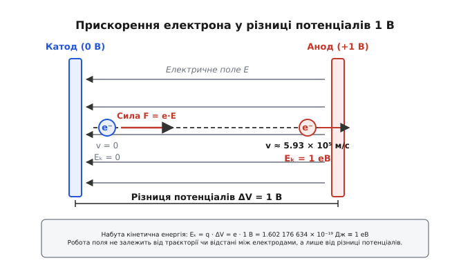
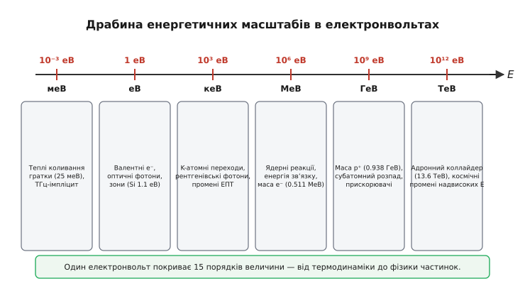
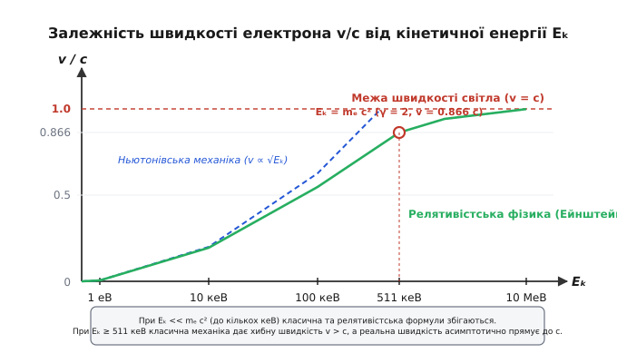

# Електронвольт

<preknowlist>
- [Заряд](book:physics/electric-charge) — носій елементарного заряду й кулонівська взаємодія.
- [Елементарний заряд і квантування](book:physics/elementary-charge) — фундаментальна константа `e ≈ 1.602 × 10⁻¹⁹ C`.
- [Потенціал](book:physics/electric-potential) — робота електричного поля з переміщення одиничного заряду.
- [Вольт](book:physics/volt) — одиниця різниці потенціалів, один джоуль на кулон.
</preknowlist>

Коли фізики досліджують зіткнення електрона з атомом водню у вакуумній камері прискорювача, запис кінетичної енергії частинки в стандартних одиницях Міжнародної системи (SI) вимагає оперування величинами порядку `2.17987 × 10⁻¹⁸ Дж`. Постійна поява громіздких від'ємних степенів `10⁻¹⁸` або `10⁻¹⁹` не лише створює надмірне обчислювальне навантаження при написанні формул, але й приховує безпосередній фізичний зв'язок між параметрами експериментальної установки та внутрішнім станом субатомної частинки. Якщо електрон прискорюється між двома електродами, до яких прикладено різницю потенціалів `13.6 В`, його набута кінетична енергія є прямо пропорційною значенню прикладеної напруги. Використання спеціалізованої одиниці «електронвольт» (позначається `еВ` або `eV`) дозволяє виключити макроскопічні коефіцієнти і вимірювати енергію мікрочастинок прямо в значеннях електричного потенціалу, який цю енергію сформував.

Електронвольт (англійське *electronvolt*, від грецького *ἤλεκτρον* — бурштин, та прізвища італійського фізика й винахідника першого хімічного джерела струму Алессандро Вольта) є позасистемною одиницею вимірювання енергії, що дорівнює кінетичній енергії, яку набуває або втрачає один елементарний електричний заряд при переміщенні між двома точками в електростатичному полі з різницею потенціалів у `1 В`. Завдяки своїй масштабованості та прямому фізичному зв'язку з напругою електронвольт є фундаментальною мовою мікрофізики — від атомної спектроскопії й фізики напівпровідників до ядерної фізики, квантової хромодинаміки та астрофізики високих енергій.

## Електростатичний механізм і математичне означення

Фізична природа електронвольта випливає безпосередньо з фундаментального означення роботи електростатичного поля. Коли заряджена частинка із зарядом `q` переміщується між двома точками в просторі з потенціалами `V₁` та `V₂`, робота `W`, виконана консервативним електричним полем, дорівнює зміні потенціальної енергії з протилежним знаком і повністю переходить у кінетичну енергію частинки `Eₖ` (за відсутності дисипативних сил або випромінювання):

```
W = q · (V₁ - V₂) = q · ΔV      [робота електростатичного поля]
Eₖ = q · ΔV                    [набута кінетична енергія частинки]
```

Якщо зарядом частинки є елементарний заряд `q = e` (заряд електрона або протона), а різниця потенціалів становить `ΔV = 1 В`, то набута кінетична енергія за означенням дорівнює одному електронвольту:

```
1 еВ = e · 1 В
     = (1.602 176 634 × 10⁻¹⁹ Кл) · (1 Дж/Кл)
     = 1.602 176 634 × 10⁻¹⁹ Дж      [точне значення в одиницях SI]
```

Електростатичне поле за своєю природою є потенціальним (безвихровим). Це означає, що криволінійний інтеграл напруженості поля уздовж будь-якого замкненого контуру дорівнює нулю (`oint E · dl = 0`). Як наслідок, робота поля не залежить від геометрії траєкторії, якою рухалася частинка між точками, а також від відстані між електродами чи просторового розподілу напруженості поля між ними. Незалежно від того, пролетів електрон відстань у `1 мм` між плоскими паралельними пластинами конденсатора чи пройшов через складну систему електронних лінз довжиною `10 м`, при підсумковій різниці потенціалів `1 В` його кінетична енергія зросте рівно на `1 еВ`.


*Прискорення електрона між двома паралельними пластинами з різницею потенціалів 1 В. Заряд набуває кінетичної енергії 1 еВ.*

Розглянемо практичну схему прискорення електрона у вакуумному діоді. Електрон, емітований із гарячого катода з нульовою початковою швидкістю, під дією прискорювального поля прямує до позитивно зарядженого анода. При прикладанні між катодом та анодом напруги `U = 250 В` кожен електрон при влучанні в анод передає йому кінетичну енергію `250 еВ`. Ця енергія розсіюється на аноді у формі тепла та рентгенівського випромінювання. Для розрахунку фундаментальних процесів створення цієї одиниці докладніші деталі висвітлює [історія виникнення й стандартизації електронвольта](book:physics/electromagnetism/electron-volt/hist-origin.md).

Метрологічний статус електронвольта зазнав фундаментальної зміни у 2019 році під час реформи Міжнародної системи одиниць SI. До 2019 року чисельне значення електронвольта у джоулях визначалося експериментально через вимірювання фундаментального заряду електрона `e` і мало стандартну невизначеність вимірювання. Із 20 травня 2019 року Міжнародне бюро мір і ваг (BIPM) зафіксувало значення елементарного заряду `e` як точну числову константу:

```
e ≡ 1.602 176 634 × 10⁻¹⁹ Кл   [точна фундаментальна константа]
```

У результаті цього рішення співвідношення між електронвольтом та джоулем стало математично точним рівноденням. Будь-яке вимірювання енергії в електронвольтах тепер зв'язано з джоулем безпосереднім коефіцієнтом перерахунку без експериментальної похибки.

## Драбина енергетичних масштабів: від меВ до ТеВ

У фізичному світі енергетичні явища охоплюють понад п'ятнадцять порядків величини. Застосування стандартних десяткових префіксів SI дозволяє зручно описувати процеси різного фізичного масштабу — від надпровідності та теплових коливань кристалічної ґратки до зіткнень елементарних частинок на найпотужніших прискорювачах Землі.


*Енергетичний спектр від міліелектронвольт у термодинаміці до петаелектронвольт у фізиці космічних променів.*

### Міліелектронвольти (меВ, 10⁻³ еВ)

Масштаб міліелектронвольт відповідає найнижчим енергіям квантових збуджень у конденсованому стані речовини, спіновим переходам та мікрохвильовому випромінюванню:

- **Тепловий рух**: Середня кінетична енергія хаотичного теплового руху молекул моноатомного газу при кімнатній температурі (`T = 298.15 К` або `25 °C`) становить `k_B · T ≈ 25.69 меВ` (де `k_B` — константа Больцмана). Повна середня кінетична енергія трьох ступенів вільностей дорівнює `(3/2) · k_B · T ≈ 38.5 меВ`. При температурі рідкого гелію (`4.2 К`) теплова енергія знижується до `0.36 меВ`.
- **Фонони**: Кванти акустичних та оптичних коливань кристалічної ґратки в твердих тілах мають енергію в діапазоні `1–100 меВ`. Взаємодія електронів із фононами визначає електричний опір металів при кімнатній температурі.
- **Надпровідність**: Енергетична щілина (заборонена зона Куперівських електронних пар) у класичних надпровідниках, таких як свинець чи ніобій, становить від `0.5 меВ` до `4 меВ`. Руйнування надпровідного стану відбувається тоді, коли теплова енергія середовища перевищує ширину цієї щілини.
- **Терагерцове випромінювання**: Фотони з частотою `1 ТГц` мають енергію `E = h · ν ≈ 4.14 меВ`. Реліктове випромінювання Всесвіту з температурою `2.725 К` має максимум спектральної щільності при енергії фотонів `0.67 меВ`.

### Електронвольти (еВ, 1 еВ)

Основна одиниця `1 еВ` є природною мірою атомних процесів, хімічних зв'язків та оптичного випромінювання людського зорового діапазону:

- **Атомна іонізація**: Енергія зв'язку електрона в основному стані атома водню (потенціал іонізації) дорівнює `13.6057 еВ`. Енергія другого потенціалу іонізації гелію `He⁺ → He²⁺` становить `54.4 еВ`. Перші потенціали іонізації лужних металів є найнижчими (цезій — `3.89 еВ`, калій — `4.34 еВ`), що робить їх ефективними фотокатодами.
- **Хімічний зв'язок**: Енергія ковалентного зв'язку між атомами вуглецю `C-C` у молекулах становить близько `3.6 еВ`, ковалентний зв'язок `H-H` у молекулі водню — `4.52 еВ`, а потрійний зв'язок `N≡N` у молекулі азоту — `9.79 еВ`. Енергія водневого зв'язку в воді дорівнює `0.1–0.2 еВ`.
- **Оптичний спектр**: Фотони видимого світла охоплюють діапазон від `1.65 еВ` (червоне світло з довжиною хвилі `750 нм`) до `3.10 еВ` (фіолетове світло з довжиною хвилі `400 нм`). Фотони ультрафіолетового випромінювання мають енергію від `3.1 еВ` до `100 еВ`.
- **Зонна теорія напівпровідників**: Ширина забороненої зони (`E_g`) визначає електричні та оптичні властивості матеріалів. Для германію `E_g = 0.66 еВ`, для кремнію `E_g = 1.12 еВ`, для арсеніду галію `GaAs` `E_g = 1.42 еВ`, а для широконозного напівпровідника нітриду галію `GaN` `E_g = 3.4 еВ`. У кремнієвих сонячних елементах ширина забороненої зони `1.12 еВ` визначає межу Шокли — Квайссера для максимального коефіцієнта корисної дії одноперехідного фотоелемента (близько `33.7%`).
- **Утворення електрон-діркових пар в іонізаційних детекторах**: Для утворення однієї вільної електрон-діркової пари під дією іонізуючого випромінювання в кремнії потрібна середня енергія близько `3.6 еВ` (що втричі перевищує ширину забороненої зони через втрати на генерацію фононів). У германії ця енергія становить `2.96 еВ`.

### Кілоелектронвольти (кеВ, 10³ еВ)

Масштаб кілоелектронвольт пов'язаний із внутрішніми електронними оболонками важких атомів та рентгенівським випромінюванням:

- **Характеристичне рентгенівське випромінювання**: Перехід електрона з L-оболонки на K-оболонку в атомі міді створює фотони лінії `K_α` з енергією `8.04 кеВ`. Для важчого атома молібдену ця енергія становить `17.48 кеВ`, а для вольфраму — `59.3 кеВ`.
- **Гальмівне рентгенівське випромінювання**: У трубах Куліджа електрони прискорюються напругою від `30 кВ` до `150 кВ`. Гранична короткохвильова межа суцільного рентгенівського спектра визначається законом Дюана — Ханта: `λ_min = h·c / (e·V)`. При напрузі `100 кВ` найкоротша довжина хвилі гальмівних фотонів становить `0.0124 нм` (`100 кеВ`).
- **Вакуумні електронні прилади**: У електронно-променевих трубках (ЕПТ) аналогових осцилографів та кінескопів кольорового телебачення електронний промінь прискорюється напругою від `2 кеВ` до `30 кеВ`.
- **Електронна мікроскопія**: У скануючих електронних мікроскопах (SEM) електрони прискорюються напругами від `1 кеВ` до `30 кеВ`, а в просвічувальних електронних мікроскопах (TEM) — від `80 кеВ` до `300 кеВ`, що забезпечує довжину хвилі де Бройля значно меншу за атомарні розміри.
- **Медична діагностика**: Рентгенівські трубки в комп'ютерних томографах та діагностичних апаратах працюють при прискорювальних напругах від `40 кеВ` до `140 кеВ`.

### Мегаелектронвольти (МеВ, 10⁶ еВ)

Мегаелектронвольти є фундаментальним масштабом ядерної фізики та фізики високих енергій:

- **Енергія зв'язку ядра**: Середня енергія зв'язку на один нуклон у стабільних атомних ядрах становить близько `8 МеВ` (із максимумом `8.8 МеВ` у ядра нікелю-62 та заліза-56).
- **Альфа-розпад**: Кінетична енергія альфа-частинок, що вилітають при радіоактивному розпаді урану-238 чи радію-226, лежить у межах `4–9 МеВ`.
- **Маса спокою електрона**: Згідно з формулою Ейнштейна `E = m·c²`, маса спокою електрона відповідає енергії `mₑ·c² ≈ 0.51099895 МеВ`. Аннігіляція електрон-позитронної пари створює два гамма-фотони з енергією `0.511 МеВ` кожен.
- **Ядерний поділ та синтез**: При поділі одного ядра урану-235 під дією теплового нейтрона виділяється близько `200 МеВ` сумарної енергії (з яких `168 МеВ` припадає на кінетичну енергію уламків поділу, `5 МеВ` на кінетичну енергію нейтронів, `7 МеВ` на миттєве гамма-випромінювання і `20 МеВ` на бета-розпад уламків). У реакції термоядерного синтезу дейтерію й тритію `D + T → ⁴He (3.5 МеВ) + n (14.1 МеВ)` сумарний енергетичний вихід становить `17.6 МеВ`.

### Гігаелектронвольти (ГеВ, 10⁹ еВ) та Тераелектронвольти (ТеВ, 10¹² еВ)

Масштаби ГеВ і ТеВ належать до галузі суб'ядерної фізики та елементарних частинок:

- **Маса адронів**: Маса спокою протона становить `m_p·c² = 0.938272 ГеВ`, а маса нейтрона — `m_n·c² = 0.939565 ГеВ`.
- **Фундаментальні бозони**: Маса `W`-бозона дорівнює `80.38 ГеВ`, `Z`-бозона — `91.19 ГеВ`, а бозона Гіггса — `125.25 ГеВ`.
- **Прискорювачі частинок**: Великий адронний коллайдер (LHC) у ЦЕРН прискорює протони до кінетичної енергії `6.8 ТеВ`, забезпечуючи повну енергію зіткнення двох пучків у центрі мас `13.6 ТеВ`.
- **Космічні промені**: Астрофізичні джерела генерують частинки надвисоких енергій. Межа Грайзена — Зацепіна — Кузьміна (ГЗК) для космічних променів становить близько `5 × 10¹十九章 еВ` (50 ЕеВ або екзаелектронвольт). Зареєстрована рекордна частинка «Oh-My-God» мала енергію `3 × 10²⁰ еВ` (`300 ЕеВ`), що дорівнює макроскопічній кінетичній енергії кинутого бейсбольного м'яча (`51 Дж`), сфокусованій у єдиному субатомному протоні.

## Кінетика прискореного електрона: класична модель проти релятивізму

При розрахунку руху зарядженої частинки у прискорювальному полі виникає межа застосовності класичної механіки Ньютона. У нерелятивістському наближенні кінетична енергія зв'язана зі швидкістю квадратним співвідношенням:

```
Eₖ = (1/2) · mₑ · v² = e · U      [класична кінетична енергія]
v = √( 2 · e · U / mₑ )            [класична швидкість електрона]
```

Для електрона з масою `mₑ ≈ 9.1093837 × 10⁻³¹ кг` підставимо різницю потенціалів `U = 1 В`:

```
v = √( 2 · 1.602176634×10⁻¹⁹ Дж / 9.1093837×10⁻³¹ кг )
  ≈ 5.93084 × 10⁵ м/с              [приблизно 0.1978% від швидкості світла c]
```

Оскільки швидкість пропорційна квадратному кореню з напруги, при збільшенні напруги в 100 разів (`U = 100 В`) швидкість електрона зростає в 10 разів і досягає `5.931 × 10⁶ м/с` (близько `1.98% c`).

Проте якщо прискорювальна напруга досягає `100 кВ` (`Eₖ = 100 кеВ`), класична формула дає швидкість `v ≈ 1.87 × 10⁸ м/с` (`62.5% c`), при якій релятивістські ефекти стають помітними. При напрузі `U = 1 МВ` класична механіка передбачає швидкість `v ≈ 5.93 × 10⁸ м/с = 1.98 c`, що суперечить фундаментальній межі швидкості світла у вакуумі.


*Порівняння ньютонівської механіки та релятивістської моделі Ейнштейна при прискоренні електрона.*

Точний розрахунок вимагає застосування релятивістської механіки Ейнштейна. Релятивістський фактор Лоренца `γ` пов'язаний із кінетичною енергією частинки `Eₖ` та її масою спокою `m`:

```
γ = 1 + Eₖ / (m · c²)              [фактор Лоренца]
v = c · √( 1 - 1 / γ² )            [точна релятивістська швидкість]
```

Для електрона з енергією спокою `mₑ · c² ≈ 511 кеВ`:

1. При `Eₖ = 10 кеВ`: `γ = 1 + 10 / 511 ≈ 1.01957`, звідки точна швидкість `v ≈ 0.1949 c` (класична формула давала `0.1978 c`, похибка `1.5%`).
2. При `Eₖ = 511 кеВ` (кінетична енергія дорівнює масі спокою): `γ = 2`, звідки точна швидкість `v = c · √(1 - 1/4) = c · √(3)/2 ≈ 0.8660 c` (класична формула давала б нефізичні `1.414 c`).
3. При `Eₖ = 10 МеВ`: `γ = 1 + 10000 / 511 ≈ 20.57`, звідки швидкість `v ≈ 0.9988 c`.

Математичні деталі переходу до релятивістських змінних містить [релятивістська кінетика, імпульс і природні одиниці](book:physics/electromagnetism/electron-volt/math-relativistic-kinematics.md).

## Природні системи одиниць: маса, імпульс і температура в електронвольтах

У теоретичній фізиці та фізиці високих енергій прийнята природна система одиниць, у якій фундаментальні константи — швидкість світла `c` та зведена стала Планка `ħ` — приймаються рівними одиниці (`c = 1`, `ħ = 1`). У такій системі електронвольт стає єдиною універсальною одиницею вимірювання енергії, маси, імпульсу, температури та оберненої довжини.

### Електронвольт як одиниця маси (еВ/c²)

Зі співвідношення Ейнштейна `E = m·c²` випливає, що маса може бути виражена через енергію:

```
m = E / c²      [маса в одиницях еВ/c²]
```

Оскільки значення `c` є константою, у науковій літературі часто випускають множник `/c²` і вказують масу частинок безпосередньо в електронвольтах:

- **Електрон**: `mₑ = 0.51099895 МеВ/c²` (або просто `0.511 МеВ`).
- **Протон**: `m_p = 0.93827208 ГеВ/c²` (або `938.27 МеВ`).
- **t-кварк (топ-кварк)**: найважча відома фундаментальна частинка `m_t ≈ 172.76 ГеВ/c²`.
- **Нейтрино**: верхня межа маси найлегших фундаментальних ферміонів становить `m_ν < 0.8 еВ/c²`.

### Електронвольт як одиниця імпульсу (еВ/c)

Релятивістський імпульс частинки вимірюється в одиницях `еВ/c`:

```
p = √( E_total² - (m·c²)² ) / c      [імпульс у еВ/c]
```

Для експериментів на коллайдерах вимірювання імпульсу субатомних частинок у `ГеВ/c` є стандартом, оскільки радіус кривизни `R` траєкторії частинки із зарядом `q = e` у магнітному полі з індукцією `B` безпосередньо зв'язаний з імпульсом:

```
p [ГеВ/c] = 0.3 · B [Тл] · R [м]      [імпульс зарядженої частинки у магнітному полі]
```

### Довжина хвилі фотона та кванти світла

Енергія фотона зв'язана з довжиною хвилі `λ` фундаментальною формулою Планка-Ейнштейна:

```
E = h · ν = h · c / λ      [енергія фотона]
```

Використовуючи значення `h·c ≈ 1239.84 еВ·нм`, отримуємо пряме практичне співвідношення:

```
λ [нм] ≈ 1239.84 / E [еВ]      [довжина хвилі фотона через енергію]
```

Для практичного проведення розрахунків створено [обчислювальний модуль конверсії та симуляції кінетики](book:physics/electromagnetism/electron-volt/proj-energy-converter.md).

### Температурний еквівалент Больцмана (еВ/k_B)

У термодинаміці середня енергія теплового руху зв'язана з температурою формулою `E = k_B · T`. Перераховуючи константу Больцмана `k_B = 8.617333262 × 10⁻⁵ еВ/К`, отримуємо еквівалентну температуру для `1 еВ`:

```
1 еВ ↔ 11 604.518 Кельвінів (К)      [температурний еквівалент]
```

У фізиці плазми та астрофізиці температуру гарячого газу або іонізованої плазми традиційно вказують у електронвольтах. Наприклад, температура плазми в центрі Сонця становить `T ≈ 15.7 × 10⁶ К`, що відповідає тепловій енергії `k_B · T ≈ 1.35 кеВ`. У керованому термоядерному синтезі (у реакторах типу Токамак) плазма вважається нагрітою до термоядерних умов при досягненні температури іонів `T_i ≥ 10 кеВ` (понад 116 мільйонів Кельвінів).

## Експериментальні методи спектроскопії в електронвольтах

Електронвольт є не лише теоретичною одиницею, а й безпосередньо вимірюваною величиною в багатьох експериментальних методах фізики та хімії.

### Фотоелектричний ефект та затримуюча напруга

При дослідженні зовнішнього фотоефекту монохроматичне світло з частотою `ν` падає на металеву поверхню (фотокатод) і вибиває електрони. Згідно з рівнянням Ейнштейна для фотоефекту:

```
h · ν = W_out + Eₖ,max      [рівняння фотоефекту]
```

де `W_out` — робота виходу електрона з металу, а `Eₖ,max` — максимальна кінетична енергія вибитих фотоелектронів.

Щоб виміряти `Eₖ,max`, між фотокатодом та анодом прикладають затримуючу напругу `V_stop` протилежної полярності, яка гальмує електрони. При досягненні напруги, при якій фотострум повністю припиняється, найшвидші електрони втрачають усю кінетичну енергію:

```
Eₖ,max = e · V_stop      [кінетична енергія у еВ дорівнює затримуючій напрузі]
```

Вимірявши затримуючу напругу вольтметром (наприклад, `V_stop = 1.8 В`), експериментатор безпосередньо отримує максимальну енергію фотоелектронів `Eₖ,max = 1.8 еВ`. Цей метод дозволив Роберту Міллікену точно підтвердити гіпотезу світлових квантів Ейнштейна та виміряти сталу Планка `h`.

### Електронна спектроскопія (XPS та UPS)

Сучасні аналітичні методи дослідження поверхні матеріалів спираються на аналіз енергетичних спектрів вибитих електронів:

- **Рентгенівська фотоелектронна спектроскопія (XPS / РФЕС)**: Поверхня зразка опромінюється характеристичним рентгенівським випромінюванням (наприклад, `K_α` лінії алюмінію з енергією `1486.6 еВ`). Вибиті з внутрішніх оболонок атома фотоелектрони потрапляють в електростатичний аналізатор. Вимірявши їхню кінетичну енергію `Eₖ`, вираховують енергію зв'язку `E_bind = h·ν - Eₖ - W_analyzer`, що дозволяє ідентифікувати хімічний елемент та його окисний стан.
- **Ультрафіолетова фотоелектронна спектроскопія (UPS / УФЕС)**: Використовує фотони гелієвої лампи (`21.2 еВ`) для дослідження енергетичного спектра валентних електронів та вимірювання роботи виходу металів і напівпровідників.

### Електростатичні енергоаналізатори та мас-спектрометрія

Для вимірювання розподілу частинок за енергіями та масами використовують електростатичні поля спеціальної геометрії:

- **Затримуючий аналізатор (Retarding Potential Analyzer, RPA)**: Частинки пролітають через сітку, до якої прикладено гальмівний потенціал `V`. На детектор потрапляють лише ті частинки, чия енергія перевищує `e·V`. Зміна струму при варіюванні напруги дає інтегральний спектр енергій.
- **Цилиндричний дзеркальний аналізатор (CMA)**: Складається з двох співвісних металевих циліндрів. При прикладанні напруги `V` між циліндрами електричне поле відхиляє електрони. Через вихідну щілину проходять лише електрони з енергією в вузькому інтервалі `E ± ΔE`, пропорційній напрузі `V`.
- **Часопролітний мас-спектрометр (Time-of-Flight Mass Spectrometer, TOF-MS)**: Іони із зарядом `q = z·e` прискорюються напругою `U`, набуваючи кінетичної енергії `Eₖ = z·e·U`. Після прискорення іони входять у беспольовий дрейфовий простір довжиною `d`. Час прольоту до детектора дорівнює `t = d / v = d · √( m / (2·z·e·U) )`. Оскільки час прямо пропорційний `√(m/z)`, вимірювання часу прольоту з високою точністю дозволяє розділяти іони за масовим числом `m/z`.

## Підводні камені та крайові випадки застосування

При використанні електронвольта в фізичних розрахунках слід враховувати кілька важливих обмежень та специфічних умов.

### Багатозарядні іони

Якщо через різницю потенціалів `ΔV` прискорюється не електрон чи протон, а багатозарядний іон із зарядом `q = z · e` (де `z` — валентність або ступінь іонізації), набута кінетична енергія дорівнює:

```
Eₖ = q · ΔV = z · e · ΔV = z · (1 еВ)      [при ΔV = 1 В]
```

Наприклад, альфа-частинка (двічі іонізований атом гелію `He²⁺`, `z = 2`), прискорена напругою `1 В`, набуває кінетичної енергії `2 еВ`. Іон золота `Au³⁵⁺` (`z = 35`), проходячи різницю потенціалів `1 МВ` (`10⁶ В`), набуває кінетичної енергії `35 МеВ`.

У фізиці прискорювачів для важких іонів іноді використовують одиницю «електронвольт на нуклон» (`еВ/нуклон` або `eV/u`), яка отримується діленням повної кінетичної енергії іона на його атомне масове число `A`.

### Плутанина між потенціалом та енергією

У практичній мові фізиків та інженерів часто зустрічається скорочення: «електрон прискорено напругою 5 кіловольт, тому його енергія становить 5 кілоелектронвольт». Важливо розрізняти скалярний потенціал поля `V` (вимірюється у вольтах `В`) та енергію частинки `E` (вимірюється в електронвольтах `еВ`). Вольт описує стан самого електричного поля в даній точці простору незалежно від наявності частинок. Електронвольт описує енергетичний стан конкретної частинки з конкретним зарядом.

### Втрати енергії на випромінювання

Формула `Eₖ = e · ΔV` справедлива лише за умови відсутності дисипативних процесів та випромінювання. При прискоренні зарядженої частинки з високим прискоренням `a` вона випромінює електромагнітні хвилі (гальмівне випромінювання або синхротронне випромінювання у колових прискорювачах). Потужність випромінювання описується формулою Лармора:

```
P_rad = (e² · a²) / (6 · π · ε₀ · c³)      [формула Лармора]
```

Для легких електронів у релятивістських синхротронах втрати на випромінювання за один оберт можуть досягати кількох мегаелектронвольт. У такому випадку реальна набута кінетична енергія електрона дорівнює роботі прискорювального поля мінус енергія випромінених фотонів.

Власна енергія електричного поля та її зв'язок із роботою переміщення зарядів детальніше описані в матеріалі [потенціал](book:physics/electric-potential).

Електронвольт залишається фундаментальним містком між наочними макроскопічними вимірюваннями напруги в електричних колах та квантовою реальною субатомного світу.
