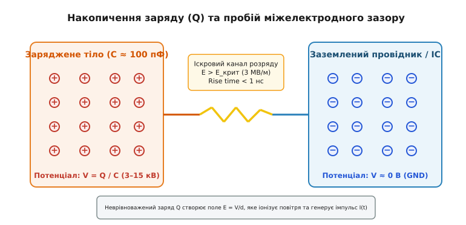
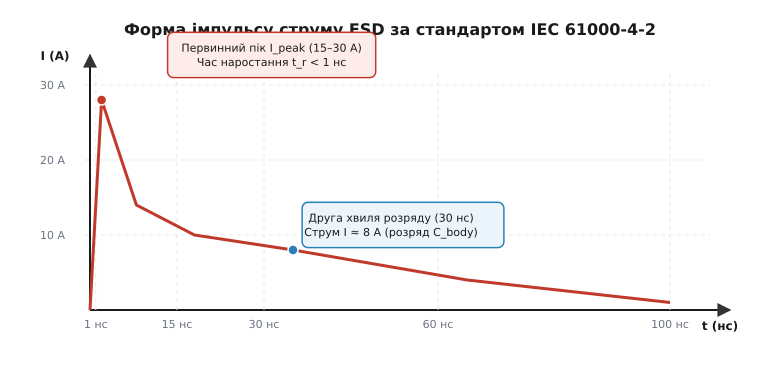
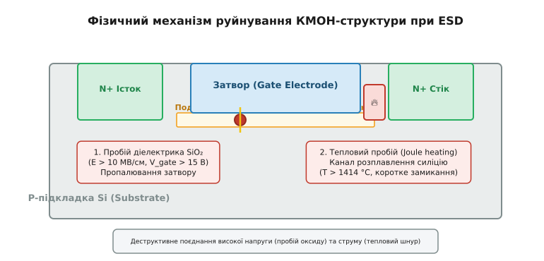
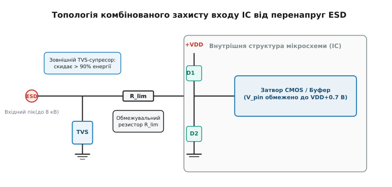

# Електростатичний розряд (ESD)

<preknowlist>
- [Електричний заряд](book:physics/electric-charge) — носії заряду, поверхневе накопичення та зберігання статичної електрики.
- [Закон Кулона](book:physics/coulomb-law) — зв'язок напруженості електричного поля з відстаню та зарядом.
- [Час релаксації заряду](book:physics/charge-relaxation) — стікання носіїв у діелектриках і провідниках за законом тв = ε·ρ.
- [Коронний розряд](book:physics/corona-discharge) — ударна іонізація та лавинний пробій у сильних неоднорідних електричних полях.
- [Джоулеве нагрівання](book:physics/joule-heating) — теплова дисипація енергії при проходженні високої густини струму.
- [Захисне заземлення](book:physics/protective-grounding) — вирівнювання потенціалів та стежка низького опору для скидання струмів.
</preknowlist>

Подзатворний діелектрик сучасного КМОН-транзистора виготовляють із діоксиду силіцію (`SiO₂`) або матеріалів із високою діелектричною проникною (High-k) завтовшки всього в кілька нанометрів — це шар, товщина якого порівнянна з кількома атомарними ґратками кремнію. Такий мікроскопічний ізоляційний бар'єр електрично пробивається й незворотно руйнується вже при напрузі 10–15 вольт. Водночас людина, крокуючи синтетичним килимом у сухий зимовий день, за рахунок тертя взуття здатна накопичити на власному тілі некомпенсований електростатичний заряд, що створює потенціал від 3000 до 15 000 вольт. Коли людина наближає палець до виводу мікросхеми, цей потенціал пробиває повітряний проміжок, генеруючи короткий, практично непомітний для ока іскровий спалах.

Цей процес називають **електростатичним розрядом** (англ. *Electrostatic Discharge*, ESD). Це надшвидкий перехідний перенос заряду між двома тілами з різними електростатичними потенціалами, який виникає при їхньому безпосередньому контакті або при електричному пробої діелектричного зазору між ними. Фізична підступність ESD полягає у колосальному розриві часових та енергетичних масштабів: напруга сягає кіловольт, піковий струм у першу наносекунду досягає десятків ампер, а вся накопичена енергія розряду (мікроджоулі) зосереджується у мікроскопічному об'ємі напівпровідникового кристала розміром у кілька кубічних мікронів. Зрозуміти фізику ESD означає збагнути механізни трибоелектричного накопичення, лавинного пробою газу та деструктивних термодинамічних процесів у напівпровідниках, а також збудувати надійні системи схемного та технологічного захисту.

### 1. Фізична природа та механізми накопичення заряду

Електростатичний заряд не виникає з нічого — він є наслідком просторового розділення позитивних і негативних носіїв заряду. Головним первинним рушієм цього процесу у повсякденному житті та промисловості є електризація тертям або контактом — трибоелектричний ефект (від грецького *tribos* — тертя). 

На атомарному рівні, коли два різні матеріали приводяться в щільний механічний контакт, на їхній межі виникає вирівнювання рівнів Фермі. Електрони з поверхневих станів матеріалу з меншою роботою виходу переходять на поверхню матеріалу з більшою спорідненістю до електрона. На контактній межі формується подвійний електричний шар. При швидкому механічному розділенні поверхонь частина перенесеного заряду залишається «законсервованою» на поверхнях, оскільки носії не встигають повернутися назад через високий електричний опір діелектричних середовищ. Напрямок та інтенсивність переносу заряду визначаються трибоелектричним рядом матеріалів.


*Механізм накопичення електричного заряду на ізольованому тілі та виникнення критичної напруженості поля E у міжелектродному зазорі, що веде до іскрового пробою.*

Окрім трибоелектричного ефекту, заряд на провідних тілах може виникати через індукційне розділення носіїв (електростатична індукція). Якщо заземлене провідне тіло опиняється у зовнішньому електричному полі зарядженого діелектрика, на його ближньому боці наводиться протилежний за знаком заряд. Якщо у цей момент розірвати зв'язок із Землею, тіло залишиться зарядженим навіть після видалення зовнішнього джерела поля.

Накопичена система некомпенсованих носіїв створює на тілі загальний заряд `Q`. Будь-яке фізичне тіло відносно Землі або навколишніх заземлених конструкцій володіє власною електростатичною ємністю `C`. Зв'язок між накопиченим зарядом, ємністю та виниклим електростатичним потенціалом `V` описується базовим співвідношенням електростатики:

```
V = Q / C
```

Для тіла людини стандартна ємність відносно заземленої підлоги становить `C_body ≈ 100–150` пФ. Для невеликого автоматизованого вакуумного маніпулятора на конвеєрі чи корпусу мікросхеми (Charged Device Model) власна ємність значно менша: `C_device ≈ 1–10` пФ. Оскільки потенціал `V` обернено пропорційний ємності, навіть мізерний витік заряду `Q = 10` нКл на маленькому корпусні деталі мікросхеми створює колосальну напругу:

```
V = Q / C
  = 10⁻⁸ Кл / (2 · 10⁻¹² Ф)    [заміщення Q = 10 нКл, C = 2 пФ]
  = 5000 В                      [потенціал корпусу мікросхеми]
```

Чому цей заряд не стікає негайно в довкілля? Швидкість самодовільного стікання заряду з ізольованого об'єму описується часом релаксації Максвелла `τ_rel`, який залежить виключно від діелектричної проникності `ε` та питомої провідності `σ` (або питомого опору `ρ`) середовища:

```
τ_rel = ε₀ · ε_r / σ
      = ε₀ · ε_r · ρ             [зв'язок провідності та опору: σ = 1 / ρ]
```

Для хороших металевих провідників (мідь, алюміній) питомий опір `ρ ≈ 10⁻⁸` Ом·м, тому час релаксації становить `τ_rel ≈ 10⁻¹⁹` с — будь-яка нерівновага носіїв знімається практично миттєво. Проте для високовольтних діелектриків та сухого атмосферного повітря, де `ρ ≈ 10¹³–10¹5` Ом·м, час релаксації сягає десятків годин або діб. Заряд залишається пасткою на поверхні діелектрика чи на ізольованому металевому елементі.

Коли заряджене тіло з потенціалом `V` наближається до заземленого провідника на відстань `d`, між ними формується електричне поле, напруженість якого в наближенні плоског зазору дорівнює:

```
E = V / d
```

При зменшенні відстані `d` до мікронів напруженість поля стрімко зростає. Коли вона перевищує поріг електричного пробою повітря (`E_crit ≈ 3 МВ/м = 30 кВ/см`), нейтральний газ втрачає свої ізоляційні властивості. Розпочинається швидкий перехідний процес, детальна історія відкриття та вивчення якого викладена у вставці [📜 Історія дослідження електростатичних розрядів: від лейденських банок до кризи мікроелектроніки](book:physics/electromagnetism/electrostatic-discharge/hist-esd-discovery.md).

### 2. Динаміка розряду: від ударної іонізації до наносекундного імпульсу

Перехід від нерухомого накопиченого заряду до стрімкого проходження струму розряду розгортається у три послідовні фізичні фази:

1. **Формування електронної лавини (таунсендівський пробій):** поодинокі вільні електрони, утворені у повітряному зазорі під дією природного радіаційного фону чи ультрафіолету, прискорюються сильним полем `E > E_crit`. На довжині вільного пробігу вони набувають кінетичної енергії, достатньої для ударної іонізації нейтральних молекул азоту й кисню. Утворюються вторинні електрони, які прискорюються далі, формуючи експоненціально зростаючу електронну лавину Таунсенда.
2. **Стримерний перехід та схлопування опору:** коли густина об'ємного заряду в головці лавини створює власне електричне поле, порівнянне із зовнішнім полем електродів, лавина переходить у високопровідний плазмовий шнур — стример. Впродовж кількох сотих часток наносекунди опір повітряного проміжку «обвалюється» від гігаомів до часток ома.
3. **Розряд накопиченої енергії:** утворений високопровідний плазмовий канал замикає електричне коло. Накопичена у ємності `C` потенціальна енергія `E_cap = 1/2 · C · V²` розряджається через опір плазмового каналу, опір тіла та паразитну індуктивність з'єднувальних провідників.


*Типова часова залежність струму розряду I(t) за стандартом IEC 61000-4-2: надшвидкий первинний пік тривалістю менше 1 нс та амплітудою до 30 А, за яким слідує друга хвиля розряду ємності тіла.*

Фізичний профіль струму розряду `I(t)` вкрай далекий від гладкого експоненціального згасання звичайного RC-кола. Як видно з часової діаграми, за міжнародним стандартом випробувань IEC 61000-4-2 струм розряду має два чітких етапи:

- **Первинний пік (Initial Spike):** виникає за рахунок швидкого розряду власної паразитної ємності руки або металевого наконечника через вкрай малу індуктивність виводу. Час наростання струму `t_r` становить від 0.7 до 1 наносекунди, а піковий струм `I_peak` при випробувальному потенціалі 8 кВ сягає 30 ампер!
- **Друга хвиля (Main Discharge Wave):** повільніше згасаюча частина, що описує розряд основного об'єму тіла через опір тканин (`R ≈ 330` Ом). Вона триває від 30 до 100 наносекунд із проміжним струмом близько 8–15 А.

Для опису цієї динаміки використовують еквівалентні RLC-моделі розряду. Диференціальне рівняння для струму в послідовному RLC-колі має вигляд:

```
L · (d²I / dt²) + R · (dI / dt) + (1 / C) · I = 0
```

Залежно від співвідношення між опором каналу `R`, індуктивністю `L` та ємністю `C`, розряд може мати аперіодичний (аперіодичне затухання при `R > 2·√(L/C)`) або коливальний характер. 

Мінімальна напруга пробою зазору залежить від добутку тиску газу на відстань між електродами `p · d` за законом Пашена. Для атмосферного повітря мінімум Пашена спостерігається при `p · d ≈ 0.8` Па·м і відповідає напрузі пробою близько 327 В. Це означає, що при вкрай малих мікроскопічних зазорах (менше 5 мікронів) пробій у повітрі не відбувається при напругах нижче 300 В, однак при контактному доторку метал-метал виникає пряма тунельна емісія, де поріг Пашена відсутній.

Окрім прямого струмового впливу, розрядний іскровий канал працює як ефективна широкосмугова випромінювальна антена. Надшвидкий фронт наростання струму `dI/dt > 30` А/нс генерує потужне високочастотне електромагнітне випромінювання у діапазоні від десятків мегагерц до кількох гігагерц. Цей випромінюваний імпульс створює індуктивні та ємнісні наведення у сусідніх провідниках друкованої плати, що спроможні викликати збої у цифровій логіці навіть без прямого електричного контакту з розрядом.

Математичні деталі виведення розрядних рівнянь, розрахунку згасання та розкладу кривої Пашена розібрані у вставці [🧮 Математична модель перехідного процесу ESD: RLC-диференціальні рівняння та імпульсна енергетика](book:physics/electromagnetism/electrostatic-discharge/math-esd-transient-modeling.md).

### 3. Фізика деструктивних руйнувань у напівпровідниках

Коли наносекундний імпульс високої напруги та струму ESD проникає на кристал мікросхеми, він стикається з мікроскопічними елементами, розрахованими на робочі напруги 1.2–3.3 В та струми в міліампери. Руйнування напівпровідникової структури відбувається за двома принципово різними фізичними механізмами.


*Схематичний розріз КМОН-транзистора при розряді ESD: 1 — електричний пробій підзатворного оксиду SiO₂; 2 — локальне теплове розплавлення силіцію у каналі стоку під дією джоулевого нагріву.*

#### Електричний пробій діелектрика (Gate Oxide Breakdown)

Подзатворний оксид `SiO₂` є діелектриком із критичною електричною міцністю `E_dielectric ≈ 10` МВ/см (або 1 В/нм). При товщині оксиду `d_ox = 5` нм критична напруга пробою становить:

```
V_breakdown = E_dielectric · d_ox
            = 10⁷ В/см · (5 · 10⁻⁷ см)    [переведення 5 нм у см]
            = 5 В                          [порогова напруга руйнування]
```

Якщо на затвор КМОН-транзистора потрапляє імпульс ESD, що підвищує потенціал виводу понад 10–15 В, електричне поле в оксиді перевищує критичне. Розпочинається автоелектронна емісія Фаулера-Нордгейма та тунелювання гарячих носіїв у діелектрик. Електрони високої енергії руйнують кремній-кисневі зв'язки `Si-O`, створюючи суцільну ланцюжок вакансій та структурних пасток (теорія перколяції пробою). При досягненні критичної щільності пасток відбувається локальний пробій — у підзатворному оксиді випалюється мікроскопічний наскрізний отвір (перфорація), заповнений провідним кремнієм. Затвор коротшає на канал транзистора, і елемент остаточно виходить із ладу.

#### Тепловий пробій та локальне розплавлення (Thermal Runaway & Joule Melting)

Якщо імпульс ESD приходить на силовий або захисний pn-перехід (наприклад, стік транзистора), виникає зворотний лавинний пробій переходу. Струм у кілька ампер протікає крізь зворотно зміщений p-n перехід при високій спадній напрузі (наприклад, 20 В). У вузькій області збідніння виділяється колосальна локальна потужність:

```
P_instant = I_peak · V_clamp
          = 15 А · 20 В               [піковий струм та напруга обмеження]
          = 300 Вт                    [миттєва потужність у мікрооб'ємі]
```

Оскільки об'єм області пробою вимірюється кубічними мікронами (`V ≈ 10⁻¹²` см³), густина виділення теплової енергії досягає адіабатичної межі. Швидкість введення тепла значно перевищує швидкість теплопровідності силіцію. Локальна температура у мікротоці стрімко перевищує точку плавлення кремнію (`T_melt = 1414` °C).

Утворюється рідкий кремнієвий шнур (Thermal Filament). При розплавленні опір силіцію обвалюється на кілька порядків (рідкий кремній володіє металевою провідністю). Це спричиняє позитивний зворотний зв'язок: через гарячу точку починає протікати ще більша частка струму (вторинний розігрів та шнурування струму), що призводить до повного випалювання каналу та утворення незворотного короткого замикання між стоком та истоком.

> 🔧 **Навіщо це.**
> Розуміння двох фізичних механізмів (електричного та теплового) визначає конструкцію схемного захисту: захисний елемент мусить **одночасно** затискати напругу нижче порогу пробою оксиду `V_breakdown` та поглинати/перенаправляти піковий струм `I_peak`, не допускаючи локального перегріву напівпровідникового кристала.

Окрім катастрофічних відмов, коли пристрій згорає негайно, ESD спричиняє **приховані (латентні) деградації**. Це ситуації, коли імпульс ESD лише частково пошкоджує оксид або створює дислокації у кристалічній ґратці. Мікросхема успішно проходить вихідний заводський контроль, проте під час експлуатації через пошкоджену ділянку розпочинається прискорене зростання струмів витоку, що призводить до раптової відмови пристрою через тижні або місяці роботи.

### 4. Моделі випробувань та стандартизація еквівалентних схем

Для об'єктивної оцінки стійкості мікросхем та електронних систем до електростатичних розрядів у міжнародній практиці розроблено чотири основні стандартизовані моделі розряду. Кожна модель відтворює конкретний фізичний сценарій накопичення та скидання заряду.

| Параметр / Модель | Модель людини (HBM) | Модель зарядженого пристрою (CDM) | Машинна модель (MM) | Системний стандарт IEC 61000-4-2 |
| :--- | :--- | :--- | :--- | :--- |
| **Фізичне джерело** | Розряд із пальця людини | Розряд накопиченого корпусом IC заряду | Контакт із незаземленим роботом | Прямий розряд ESD на готовий пристрій |
| **Еквівалентна ємність (C)** | 100 пФ | 1–10 пФ | 200 пФ | 150 пФ |
| **Еквівалентний опір (R)** | 1500 Ом | 1–10 Ом (лише опір кристала) | 0 Ом (індуктивний розряд) | 330 Ом |
| **Час наростання (t_r)** | 2–10 нс | **< 0.2 нс (200 пс)** | 5–15 нс | **0.7–1.0 нс** |
| **Піковий струм (при 2 кВ)**| 1.33 А | 5–15 А | 3.5 А (коливальний) | 7.5 А (при 2 кВ) / 30 А (при 8 кВ) |
| **Головна загроза** | Тепловий пробій переходів | **Пробій тонких оксидів затворів** | Руйнування металізації та переходів | Системний збій та вихід з ладу входу |

Характерні відмінності моделей визначаються фізикою їхнього застосування:

1. **Human Body Model (HBM):** класична модель (стандарт ANSI/ESDA/JEDEC JS-001). Описує випадок, коли людина торкається виводу компонента. Наявність послідовного резистора 1500 Ом обмежує піковий струм на рівні `I_peak ≈ V / 1500`.
2. **Charged Device Model (CDM):** найбільш критична модель для сучасного автоматизованого виробництва (стандарт ANSI/ESDA/JEDEC JS-002). Мікросхема накопичує заряд під час ковзання по віброживнику або тертя об пластиковий блістер. Коли металевий маніпулятор торкається виводу, заряд стікає з кристала на Землю. Оскільки опір розрядного кола обмежений лише власною індуктивністю ніжки й опором кристала (`R < 1` Ом), розряд відбувається за сотні пікосекунд із піковим струмом понад 10–20 А. CDM є головним винуватцем пробою подзатворного оксиду в новітніх техпроцесах (7 нм, 5 нм, 3 нм).
3. **Machine Model (MM):** застаріла, але жорстка модель (стандарт JEDEC JESD22-A115). Відтворює розряд металевого інструмента без опору. Оскільки `R ≈ 0`, розряд має виражений коливальний згасаючий характер із високими зворотною амплітудою струму.
4. **System-Level IEC 61000-4-2:** стандарт випробувань готових електронних блоків та приладів у зборі. Передбачає розряд безпосередньо на роз'єми (USB, Ethernet, HDMI), кнопки та металеві елементи корпусу. Вимагає рівнів стійкості від 2 кВ (Level 1) до 8 кВ контактного розряду та 15 кВ повітряного розряду (Level 4).

Повний довідник тестових параметрів, ступенів суворості випробувань та часових допусків наведено у вставці [📋 Стандарти та параметри випробувань ESD: HBM, CDM, MM та IEC 61000-4-2](book:physics/electromagnetism/electrostatic-discharge/api-esd-testing-standards.md).

### 5. Схемні методи та компоненти захисту від перенапруг

Щоб захистити чутливу мікросхему від деструктивної дії імпульсу ESD, на вхідних колах електронного пристрою встановлюють спеціальні захисні структури. Головне завдання захисту — перехопити високовольтний імпульс струму та скинути його в заземлювальний провідник, затиснувши напругу на захищеному виводі на безпечному рівні `V_pin < V_breakdown`.


*Дворівнева топологія захисту вхідного кола мікросхеми: зовнішній первинний TVS-супресор скидає основну енергію розряду, обмежувальний резистор R_lim гасить струм, а внутрішні діоди D1-D2 затискають напругу на шини живлення.*

Схемотехніка ESD-захисту будується на поєднанні зовнішніх (Off-Chip) та внутрішніх (On-Chip) елементів:

1. **Первинний зовнішній захист (TVS-діоди та варистори):** розташовується безпосередньо біля вхідного роз'єму пристрою. Захисні супресорні діоди (Transient Voltage Suppressor, TVS) — це спеціально спроектовані p-n переходи з великою площею, що працюють у режимі зворотного лавинного пробою. При перевищенні пробійної напруги `V_BR` TVS-діод миттєво (за час `< 1` нс) відкривається, відводячи десятки ампер струму розряду на Землю.
2. **Послідовне обмеження струму (`R_lim` або феритові намистини):** резистор опором 10–100 Ом, встановлений між зовнішнім TVS-діодом та виводом мікросхеми, створює дільник напруги та обмежує струм, який проходить далі у внутрішні структури кристала.
3. **Внутрішні фіксуючі діоди (Steering Diodes):** вбудовані у кристал мікросхеми діоди `D1` та `D2`. При позитивній перенапрузі діод `D1` відкривається у прямому напрямку й скидає залишковий струм у шину живлення `+VDD`. При негативній перенапрузі діод `D2` скидає струм із шини заземлення `GND`.
4. **Внутрішні Snapback-тригери (GGNMOS):** заземлені затвором N-МОН транзистори (Grounded-Gate N-MOSFET). При досягненні порогової напруги лавинного пробою внутрішній паразитний n-p-n біполярний транзистор підкладки вмикається у режим від'ємного диференціального опору (Snapback), затискаючи напругу на кристалі до мінімального рівня утримання `V_hold ≈ 4–6` В.

Головним компромісом при виборі ESD-захисту для високошвидкісних ліній (USB 3.2, Thunderbolt, PCIe, HDMI) є **паразитна ємність захисного елемента `C_p`**. Ззвичайний TVS-діод володіє власною ємністю від 10 до 100 пФ. Разом з опором лінії ця ємність утворює фільтр низьких частот із частотою зрізу:

```
f_cut = 1 / (2 · π · R_line · C_p)
```

При ємності `C_p = 50` пФ високочастотний цифровий сигнал із частотою кількох гігагерц повністю спотворюється та шунтується на Землю. Тому для швидкісних інтерфейсів застосовують спеціалізовані **ультранизькоємні TVS-діоди** з паразитною ємністю `C_p < 0.1–0.2` пФ.

Вичерпний технічний розбір типів захисних компонентів, їхніх вольт-амперних характеристик та часових параметрів подано у вставці [🔌 Елементна база захисту від ESD: TVS-діоди, варистори, полімерні супресори та внутрішні snapback-структури](book:physics/electromagnetism/electrostatic-discharge/comp-esd-protection.md).

Для практичної розробки та симуляції захисних кіл використовують числове моделювання перехідних процесів. Готовий програмний модуль на мовах C та C++, що виконує чисельне інтегрування RLC-рівнянь розряду та моделює затискання напруги TVS-діодом, наведено у вставці [⚙️ Програмування та чисельне моделювання перехідного імпульсу ESD у захисних колах](book:physics/electromagnetism/electrostatic-discharge/proj-esd-transient-sim.md).

### 6. Виробничий ESD-захист та інженерна гігієна

Захист електронних компонентів на схемотехнічному рівні нездатний повністю вирішити проблему, якщо не контролювати накопичення статичної електрики під час виробництва, транспортування та ремонту обладнання.

Основою технологічного захисту є створення **зони, захищеної від електростатичного розряду** (Electrostatic Protected Area, EPA). Основні фізичні принципи побудови EPA включають:

- **Вирівнювання потенціалів та стежка низького опору:** усі провідні елементи, робочі столи, обладнання та оператори підключаються до єдиного контуру захисного заземлення через обмежувальні резистори опором 1 МОм. Резистор 1 МОм є критично важливим для електробезпеки: він гарантує швидке стікання статичного заряду, але обмежує струм через тіло людини до безпечного рівня (`< 0.25` мА) у випадку випадкового доторку до мережевої напруги 230 В.
- **Іонізація повітря:** для нейтралізації заряду на діелектриках (на яких заряд не стікає через заземлення) застосовують коронні іонізатори. Вони генерують потік позитивних та негативних аероіонів, які притягуються до заряджених поверхонь діелектриків і нейтралізують їхній заряд.
- **Контроль відносної вологості:** при відносній вологості повітря понад 45–50% на поверхні всіх матеріалів формується мікроскопічна адсорбована плівка води. Завдяки розчиненим іонам ця плівка підвищує поверхневу провідність `σ_s`, прискорюючи стікання носіїв заряду й не дозволяючи потенціалу накопичуватися до небезпечних кіловольтних значень.
- **Антистатична та екранувальна упаковка:** транспортування мікросхем здійснюється в струмопровідних блістерах або пакетах «клітка Фарадея» (Metal-In / Metal-Out ESD Bags), які перерозподіляють зовнішнє електричне поле по зовнішньому металізованому шару, захищаючи кристали всередині.

Електростатичний розряд залишається яскравим прикладом того, як фундаментальні закони електростатики, електродинаміки та фізики напівпровідників визначають надійність та межі мініатюризації сучасної обчислювальної техніки.
