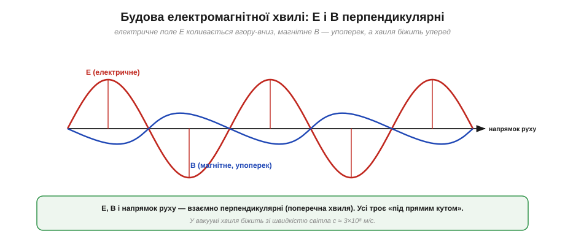
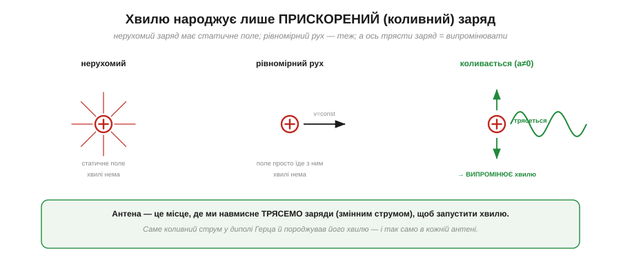
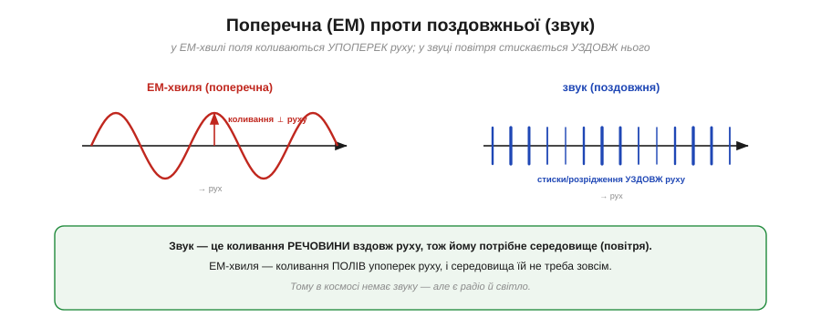
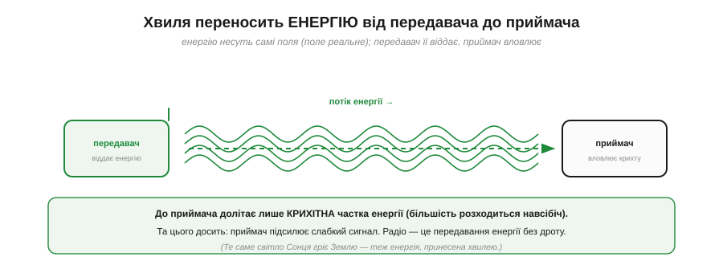

# Електромагнітна хвиля: електрика й магнетизм у русі

Найперше питання — найфундаментальніше: **що таке** електромагнітна хвиля? Відповідь напрочуд елегантна, і вона з'єднує дві речі, які ми досі вивчали окремо. Електричне поле живе навколо заряду; магнітне — навколо струму. Поодинці вони статичні. Але варто змусити їх **змінюватися** — і вони підхоплюють одне одного й починають бігти простором самі собою. Це і є хвиля. Розберімо її по частинах.

### Будова хвилі: E ⊥ B ⊥ напрямок

Електромагнітна хвиля — це **два поля, що коливаються разом**: електричне (E) і магнітне (B). І найважливіша її геометрична риса: усі три напрямки — коливань E, коливань B і самого руху хвилі — взаємно **перпендикулярні**.


*Електричне поле E коливається в одній площині (тут вертикально), магнітне B — у перпендикулярній (упоперек), а сама хвиля біжить уперед — і ці три напрямки взаємно під прямим кутом. Це **поперечна** хвиля, що у вакуумі мчить зі швидкістю світла c ≈ 3×10⁸ м/с.*

Уяви це так: E хитається вгору-вниз, B — вліво-вправо, а вся ця конструкція летить від тебе вперед. Обидва поля коливаються **в такт** (синхронно) і обидва — **поперек** напрямку руху. Ця трійця перпендикулярів важлива: на ній тримається й поняття [поляризації](book:communications/propagation-polarization), і [робота антени](book:communications/antenna). А найголовніше число тут — **швидкість**: у порожнечі ця хвиля завжди мчить рівно зі швидкістю світла.

**Приклад (як швидко долітає радіо).** Порахуймо час польоту хвилі за c ≈ 3×10⁸ м/с:

```
через кімнату (10 м) : 10 / 3×10⁸ ≈ 33 наносекунди
до Місяця (384 000 км): 384×10⁶ / 3×10⁸ ≈ 1.28 секунди
```

На Землі радіосигнал долітає практично **миттєво** (наносекунди) — ось чому [затримка бездротового зв'язку](book:communications/latency-reliability) йде від ретраїв і обробки, а не від самого польоту хвилі. А от до Місяця вже понад секунду — звідси й помітна затримка в космічному зв'язку.

### Народжує хвилю прискорений заряд

Звідки береться хвиля? Її породжує **заряд** — але не будь-який, а саме **прискорений**, тобто такий, що міняє свою швидкість (найчастіше — коливається).


*Нерухомий заряд має лише статичне поле — хвилі немає. Заряд, що рухається рівномірно, тягне поле за собою — хвилі теж немає. А ось коли заряд **трясеться** (прискорюється, коливається), він «струшує» зі свого поля хвилю, що відривається й летить геть.*

Це ключ до всього радіо. Нерухомий заряд оточений сталим [електричним полем](book:physics/electric-field) — і нічого не випромінює. Заряд, що пливе з постійною швидкістю, додає до цього стале магнітне поле, але хвилі однаково немає. І лише **прискорений** заряд — той, що різко змінює швидкість чи коливається туди-сюди — створює **збурення** полів, яке відривається й біжить простором як хвиля. Саме коливний заряд у диполі Генріха Герца й породжував його хвилю.

> 🔧 **Навіщо це.** Ось чому **антена** — це по суті дріт, у якому ми навмисне **трясемо заряди** змінним струмом. Жени по дроту струм, що міняється мільярди разів на секунду, — і заряди в ньому прискорюються туди-сюди, випромінюючи радіохвилю. Це і є передавання: перетворити коливний струм на хвилю. А приймання — навпаки: хвиля, долетівши до приймальної антени, трясе заряди вже в **ній**, наводячи слабкий струм, який ми підсилюємо. Уся радіотехніка — це гра з прискореними зарядами.

### Чому хвиля не згасає: E і B підхоплюють одне одного

Хвиля, що відірвалася від заряду, далі живе **власним життям** — і не потребує більше ні заряду, ні дроту, ні середовища. Чому вона не згасає одразу? Бо E і B **підживлюють одне одного** на ходу.


*Змінне електричне поле творить магнітне трохи попереду; те, змінюючись, творить електричне ще далі; і так далі — поля «крокують» уперед, передаючи естафету. Хвиля сама себе несе зі швидкістю світла, не потребуючи жодного середовища.*

Це той самий механізм, що його описав Джеймс Клерк Максвелл, тільки тепер дивимося на нього як на **рушій руху**. Змінне E наводить B (це [електромагнітна індукція](book:physics/electromagnetic-induction)), а змінне B наводить E (симетрична половина, яку додав Максвелл). Кожне поле, згасаючи в одному місці, **відроджує** інше трохи далі — і так збурення котиться вперед, нескінченно передаючи естафету між двома полями. Енергію несе сама хвиля; жодного «дроту» їй не треба.

### Поперечна, а не поздовжня

Корисно порівняти ЕМ-хвилю з найзнайомішою хвилею — **звуком**, — бо вони влаштовані принципово по-різному.


*ЕМ-хвиля **поперечна**: поля коливаються впоперек напрямку руху. Звук — **поздовжня** хвиля: повітря стискається й розріджується вздовж напрямку руху. Звук — це коливання речовини, тож йому потрібне середовище; ЕМ-хвилі — ні.*

У звуці коливається **речовина** (повітря) — і коливається **вздовж** руху: летять зони стиску й розрідження. Тому без речовини звуку немає: у вакуумі тиша. ЕМ-хвиля інакша: у ній коливаються **поля**, і коливаються **впоперек** руху. А поля можуть існувати й у порожнечі. Звідси й знаменитий факт: **у космосі немає звуку, але є світло й радіо**.

### Без середовища, крізь порожнечу

Зупинімося на цьому окремо, бо саме це історично здавалося найнеймовірнішим: ЕМ-хвиля летить **крізь порожній простір**, без жодного середовища.


*Світло й тепло Сонця долають мільйони кілометрів **порожнього космосу** й гріють Землю. Жодної речовини між ними немає — і хвилі вона не потрібна: поля самі собі «середовище».*

Для радіо це має пряме практичне значення: сигнал летить простором **сам**, і йому не потрібен ні дріт, ні повітря. Повітря, стіни, дощ лише трохи [**послаблюють** хвилю](book:communications/free-space-loss), але не вони її несуть. Це й відрізняє радіо від звуку чи дротового зв'язку: канал — це сам простір, заповнений полями, а не якась матеріальна «труба».

### Несе енергію

Раз хвиля існує сама собою й щось «доставляє», вона має нести **енергію** — і справді несе.


*Передавач віддає енергію в хвилю; та летить простором і приносить **крихітну** її частку до приймача (більшість розходиться навсібіч). Цього досить: приймач підсилює слабкий сигнал. По суті радіо — це передавання енергії без дроту.*

Енергію несуть **самі поля**: [електричне поле](book:physics/electric-field) реальне й містить енергію. Передавальна антена «закачує» енергію в хвилю, хвиля розносить її простором, а приймальна антена вловлює **мізерну** частку (бо хвиля розпливається навсібіч, і до приймача долітають лічені фемтовати). Та цього достатньо: чутливий приймач підсилить навіть такий кволий сигнал. Те саме Сонце гріє Землю енергією, принесеною світловими хвилями через порожнечу, — точнісінько та сама фізика, лише на іншій частоті.

### Антена: керовано трясемо заряди

Зведімо всю фізику теми в одну практичну точку — в **антену**.


*Змінний струм жене заряди вгору-вниз по дроту-антені; прискорені заряди випромінюють хвилю, як диполь Герца. Частота струму дорівнює частоті хвилі. Передавання — це трясти заряди й народжувати хвилю; приймання — навпаки: хвиля трясе заряди в антені.*

Уся фізика розділу сходиться сюди: **трясеш заряди — народжується хвиля; ловиш хвилю — трясуться заряди**. Передавальна антена — це місце, де ми навмисне женемо коливний струм, щоб запустити хвилю в простір. Приймальна — місце, де хвиля, що долетіла, наводить слабкий струм. Частота, з якою трясуться заряди, дорівнює частоті випроміненої хвилі — і саме частота визначає геть усе: і [довжину хвилі](root:embedded/frequency-wavelength), і розмір антени, і дальність.

> 🔧 **Навіщо це.** Тепер «антена» — не магічна паличка, а зрозумілий пристрій: дріт, у якому коливний струм трясе заряди й народжує хвилю. Це пояснює, чому антена має бути **провідником** (щоб заряди вільно бігали) і чому її розмір пов'язаний із частотою (через [резонанс і чверть хвилі](book:communications/resonance-dipole)). А ще це підказує, чому будь-який провідник зі змінним струмом **трохи випромінює** — звідси й паразитні завади від швидких цифрових ліній, і потреба екранувати чутливі вузли.

Отже, електромагнітна хвиля — це два поперечні поля, народжені тремтливим зарядом, що самі себе несуть крізь порожнечу зі швидкістю світла. Ключова її характеристика — **частота**: скільки разів за секунду трясуться заряди. Частота визначає [**довжину** хвилі](root:embedded/frequency-wavelength) — другу її величину, пов'язану з частотою через швидкість світла однією простою формулою.

---
