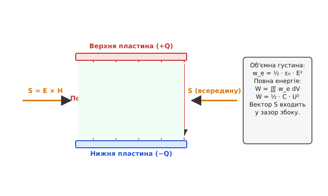
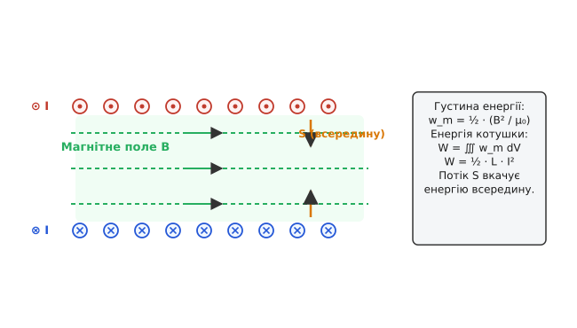
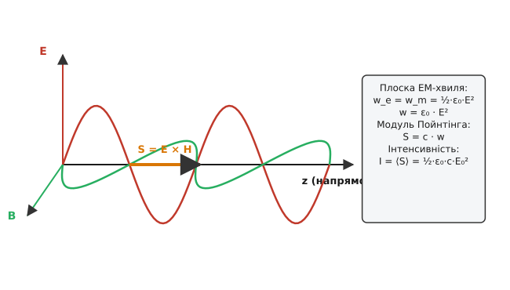
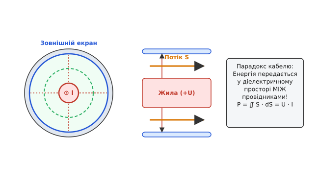

# Густина енергії електромагнітного поля

<preknowlist>
- [Рівняння Максвелла](book:physics/electromagnetism/maxwell-equations) — фундаментальна система диференціальних рівнянь класичної електродинаміки.
- [Векторний аналіз](book:math/vector-calculus) — операції дивергенції, ротора, градієнта та теорема Остроградського — Гаусса.
- [Електростатичне поле](book:physics/electromagnetism/electrostatic-field) — потенціал, напруженість E та робота з переміщення заряду.
- [Магнітна індукція](book:physics/electromagnetism/magnetic-induction) — вектор B, закон Ампера та індуктивність L.
</preknowlist>

Коли два електричні заряди взаємодіють між собою, або коли провідник зі струмом притягує чи відштовхує інший провідник, система виконує механічну роботу. Згідно з фундаментальним законом збереження енергії, ця робота виконується за рахунок зміни потенціальної енергії системи. Проте виникає принципове запитання: де саме фізично зберігається ця енергія впродовж того часу, поки заряди залишаються нерухомими або поки струм тече по провідниках?

У рамках класичної механіки Ньютона та ранньої електростатики потенціальна енергія вважалася чисто математичною функцією взаємного розташування зарядів. Вважалося, що заряди діють один на одного миттєво через порожнечу (концепція дальнодії). У такій картині світу простір між зарядами є абсолютно порожнім і не володіє жодними фізичними властивостями. Однак розвиток електродинаміки у XIX столітті довів непридатність такого підходу. Зміна стану одного заряду викликає зміну поля, яка поширюється у просторі зі скінченною швидкістю — швидкістю світла `c`. Це означає, що віддалений заряд дізнається про переміщення першого заряду лише через певний проміжок часу. Протягом цього інтервалу часу випромінена енергія вже залишила перший заряд, але ще не досягла другого. Отже, єдиним можливим носієм цієї енергії є саме **електромагнітне поле**, заповнене у просторі між ними (детальний аналіз формування цієї ідеї наведено в [історичному нарисі](book:physics/electromagnetism/energy-density-field/hist-field-energy.md)).

Електромагнітне поле є самостійною формою матерії, що володіє об'ємною густиною енергії, імпульсом, моментом імпульсу та масою. У кожній точці простору, де присутні електричне та магнітне поля, локалізована цілком конкретна кількість енергії, яка може переноситися з однієї області простору в іншу та перетворюватися на інші види енергії.

---

## 1. Енергія електростатичного поля

Щоб зрозуміти, як енергія розподіляється у просторі, розглянемо процес створення електричного поля під час заряджання плоскопаралельного конденсатора.

Нехай конденсатор складається з двох пласких металевих пластин площею `S`, розташованих у вакуумі на відстані `d` одна від одної. Початковий заряд пластин дорівнює нулю. Щоб зарядити конденсатор до кінцевого заряду `Q`, необхідно послідовно переносити нескінченно малі порції заряду `dq` з однієї пластини на іншу проти сил утвореного електричного поля.

Робота `dW`, яка витрачається на перенесення порції заряду `dq` при поточній різниці потенціалів `u = q / C` між пластинами, дорівнює:

```
dW = u · dq = (q / C) · dq
```

Повна робота `W`, витрачена зовнішнім джерелом на заряджання конденсатора від `0` до `Q`, обчислюється шляхом інтегрування:

```
W = ∫₀^Q (q / C) dq = ½ · (Q² / C) = ½ · C · U²
```

де `U = Q / C` — кінцева напруженість напруги на конденсаторі, `C` — його електроємність.


*Схема плоскопаралельного конденсатора: електричне поле E локалізоване у зазорі між пластинами, а потік енергії Пойнтінга S входить у зазор збоку під час заряджання.*

Виразимо ємність плаского конденсатора через його геометричні розміри та діелектричну проникність середовища:

```
C = ε₀ · ε · S / d
```

а напругу `U` через напруженість однорідного електричного поля `E` у зазорі між пластинами:

```
U = E · d
```

Підставимо ці вирази у формулу для накопиченої енергії `W`:

```
W = ½ · (ε₀ · ε · S / d) · (E · d)²
= ½ · ε₀ · ε · E² · (S · d)                      [скорочення d та групування об'єму V = S·d]
= ½ · ε₀ · ε · E² · V
```

де `V = S · d` — фізичний об'єм простору між пластинами конденсатора, в якому локалізоване однорідне електричне поле `E`. Поза зазором ідеального конденсатора поле дорівнює нулю.

Оскільки енергія `W` рівномірно розподілена по об'єму `V`, поділивши повну енергію на об'єм, отримаємо **об'ємну густину енергії електростатичного поля** `w_e`:

```
w_e = W / V = ½ · ε₀ · ε · E²
```

Використовуючи вектор електричного зсуву `D = ε₀ · ε · E`, вираз для густини енергії можна записати у симетричній векторній формі:

```
w_e = ½ · E · D
```

Отриманий вираз має фундаментальне значення: він не містить жодних параметрів самого конденсатора (ані площі пластин `S`, ані відстані `d`, ані ємності `C`). Густина енергії визначена виключно локальними характеристиками поля `E` та `D` у даній точці простору.

### 1.1. Загальний перехід для довільного розподілу зарядів

Для довільної системи статичних зарядів із неперервною об'ємною густиною `ρ(r)` та потенціалом `φ(r)` потенціальна енергія може бути обчислена через інтеграл по всьому простору:

```
W_e = ½ · ∭_V ρ · φ dV
```

Використавши перше рівняння Максвелла у диференціальній формі `∇ · D = ρ`, підставимо густину заряду `ρ` у вираз для енергії:

```
W_e = ½ · ∭_V (∇ · D) · φ dV
```

Застосуємо математичну тотожність для дивергенції добутку скаляра на вектор `∇ · (φ · D) = φ · (∇ · D) + D · (∇ φ)`:

```
(∇ · D) · φ = ∇ · (φ · D) − D · (∇ φ)
```

Підставимо це в інтеграл і врахуємо, що за означенням електростатичного потенціалу `E = − ∇ φ`:

```
W_e = ½ · ∭_V ∇ · (φ · D) dV + ½ · ∭_V (D · E) dV
```

За теоремою Остроградського — Гаусса перший об'ємний інтеграл перетворюється у поверхневий інтеграл по віддаленій граничній поверхні `S_inf`:

```
∭_V ∇ · (φ · D) dV = ∬_{S_inf} (φ · D) · dS_inf
```

Якщо поширити область інтегрування на весь нескінченний простір (`R → ∞`), потенціал точкового джерела спадає як `φ ∝ 1/R`, вектор електричного зсуву спадає як `D ∝ 1/R²`, а площа поверхні сфери зростає як `S_inf ∝ R²`. Отже, підінтегральний вираз спадає як `1/R³`, і поверхневий інтеграл на нескінченності **тотожно прямує до нуля**:

```
lim_{R → ∞} ∬_{S_inf} (φ · D) · dS_inf = 0
```

У результаті залишається лише другий доданок, що підтверджує загальну формулу для повної енергії електростатичного поля у всій безмежній області простору:

```
W_e = ½ · ∭_{всі зазори} (E · D) dV
```

Цей строгий математичний результат показує, що формули `W = ½ ∭ ρ φ dV` (енергія зарядів) та `W = ½ ∭ E · D dV` (енергія поля) є математично еквівалентними у стаціонарному випадку. Проте саме польове формулювання через `w_e = ½ E · D` зберігає фізичний зміст у динаміці, коли заряди рухаються і випромінюють хвилі.

### 1.2. Мікроскопічний розподіл енергії у діелектриках

У присутності діелектричного середовища вектор електричного зсуву пов'язаний із напруженістю поля `E` та вектором поляризації `P` співвідношенням `D = ε₀ E + P`. У цьому випадку об'ємна густина енергії розпадається на дві фізично різні складові:

```
w_e = ½ · E · D = ½ · ε₀ · E² + ½ · E · P
```

Перший доданок `½ ε₀ E²` описує енергію вакуумного електричного поля, яке існувало б навіть за відсутності речовини. Другий доданок `½ E · P` описує роботу, витрачену на зміщення зв'язаних електричних зарядів у атомах діелектрика (електронна, іонна та орієнтаційна поляризації).

При деформації електронних оболонок атомів під дією зовнішнього поля виникають мікроскопічні дипольні моменти `p_ind = α · E_local`. Енергія поляризації `½ E · P` є механічною та квантовомеханічною потенціальною енергією зміщених електронів у атомних ядрах. У разі скасування зовнішнього поля ця енергія повертається назад у поле, викликаючи струм поляризації `j_p = ∂P/∂t`.

---

## 2. Енергія магнітного поля

Аналогічний розгляд можна провести для магнітного поля, яке виникає довкола провідників зі струмом або у котушках індуктивності.

Розглянемо котушку індуктивності (соленоїд), підключену до джерела струму. Під час вмикання джерела струм `I` у котушці не зростає миттєво через явище самоіндукції. Зміна магнітного потоку створює вихрове електричне поле індукції, ЕРС якого `E_ind = − L · (dI/dt)` протидіє зростанню струму.

Щоб збільшити струм на величину `dI`, джерело повинно виконати роботу проти ЕРС самоіндукції:

```
dW = − E_ind · I · dt = L · I · (dI / dt) · dt = L · I · dI
```

Повна робота `W`, витрачена на створення постійного струму `I` в індуктивності `L`, дорівнює:

```
W = ∫₀^I L · I dI = ½ · L · I²
```


*Переріз соленоїда: всередині котушки створюється однорідне магнітне поле B, що володіє об'ємною густиною енергії w_m, а радіальний вектор Пойнтінга S вкачує енергію під час наростання струму.*

Для обчислення густини енергії магнітного поля виразимо індуктивність довгого соленоїда довжиною `l`, площею перерізу `S` та кількістю витків `N`:

```
L = μ₀ · μ · N² · S / l
```

а напруженість магнітного поля `H` та індукцію `B` всередині соленоїда через струм `I`:

```
H = N · I / l
B = μ₀ · μ · H = μ₀ · μ · N · I / l
```

Звідси виразимо струм: `I = H · l / N`. Підставимо `L` та `I` у формулу енергії:

```
W = ½ · (μ₀ · μ · N² · S / l) · (H · l / N)²
= ½ · μ₀ · μ · H² · (S · l)                      [скорочення N² та l]
= ½ · μ₀ · μ · H² · V
```

де `V = S · l` — об'єм внутрішньої порожнини соленоїда, заповнений однорідним магнітним полем.

Поділивши повну енергію на об'єм `V`, отримаємо **об'ємну густину енергії магнітного поля** `w_m`:

```
w_m = W / V = ½ · μ₀ · μ · H² = ½ · (B² / (μ₀ · μ))
```

У векторному вигляді через скалярний добуток векторів магнітної індукції `B` та напруженості магнітного поля `H`:

```
w_m = ½ · B · H
```

### 2.1. Перехід до польового інтеграла через векторний потенціал

Для довільного розподілу стаціонарних струмів із густиною `j(r)` магнітна енергія може бути виражена через векторний потенціал `A(r)` (де `B = ∇ × A`):

```
W_m = ½ · ∭_V (j · A) dV
```

Використовуючи закон Ампера `∇ × H = j`, підставимо густину струму `j`:

```
W_m = ½ · ∭_V (∇ × H) · A dV
```

Застосуємо векторну тотожність для дивергенції векторного добутку `∇ · (A × H) = H · (∇ × A) − A · (∇ × H)`:

```
(∇ × H) · A = H · (∇ × A) − ∇ · (A × H) = H · B − ∇ · (A × H)
```

Підставивши цей вираз в інтеграл і перетворивши дивергенцію за теоремою Остроградського — Гаусса у поверхневий інтеграл на нескінченності, переконуємося, що поверхневий інтеграл зникає (`A ∝ 1/R`, `H ∝ 1/R²`, `S_inf ∝ R²`), залишаючи універсальну формулу:

```
W_m = ½ · ∭_{всі зазори} (B · H) dV
```

### 2.2. Енергія намагнічування магнітних середовищ

У магнітних середовищах індукція `B` пов'язана з напруженістю `H` та вектором намагніченості `M` співвідношенням `B = μ₀ (H + M)`. Густина магнітної енергії приймає вигляд:

```
w_m = ½ · B · H = ½ · μ₀ · H² + ½ · μ₀ · H · M
```

Другий доданок `½ μ₀ H · M` є енергією переорієнтації мікроскопічних магнітних моментів атомів (орбітальних та спинових моментів електронів). У феромагнетиках (залізо, нікель, ферити) зв'язок між `B` та `H` є нелінійним і гістерезисним. Під час перемагнічування феромагнетика по замкненій петлі гістерезису частина енергії поля перетворюється на тепло, а питома втрачена енергія за один цикл перемагнічування дорівнює площі петлі гістерезису:

```
w_loss = ∮ H dB
```

---

## 3. Повна густина енергії ЕМ-поля та теорема Пойнтінга

У загальному випадку, коли в просторі одночасно присутні і електричне, і магнітне поля, повна об'ємна густина електромагнітної енергії `w` дорівнює сумі густин електричної та магнітної енергій:

```
w = w_e + w_m = ½ · (E · D + B · H)
```

Для вакууму (`ε = 1`, `μ = 1`):

```
w = ½ · (ε₀ · E² + (1 / μ₀) · B²)
```

Це співвідношення показує, що електрична та магнітна складові поля є рівноправними внесками у сумарну енергетичну щільність простору.

### 3.1. Диференціальний та інтегральний баланс енергії

Оскільки поля можуть змінюватися з часом і рухатися у просторі, виникає питання про закон збереження електромагнітної енергії в локальній формі.

Строгий математичний аналіз виряджується з рівнянь Максвелла (повне виведення наведено у [математичній вставці](book:physics/electromagnetism/energy-density-field/math-poynting-theorem.md)). Застосовуючи векторну тотожність для дивергенції векторного добутку `∇ · (E × H)`, отримуємо **диференціальну форму теореми Пойнтінга**:

```
∂w/∂t + ∇ · S = − j · E
```

де:
- `w = ½ (E · D + B · H)` — об'ємна густина енергії електромагнітного поля (вимірюється в Дж/м³);
- `S = E × H` — **вектор Пойнтінга** (вектор густини потоку енергії), що визначає напрямок та величину енергії, яка протікає через одиничну площадку за одиницю часу (вимірюється в Вт/м²);
- `j · E` — скалярний добуток вектора густини струму `j` на вектор напруженості поля `E`, що описує питому потужність роботи поля над зарядами (дисипація джоулевого тепла або прискорення частинок).

Проінтегрувавши диференціальне рівняння по довільному замкненому об'єму `V` з межею `S_bound` і застосувавши теорему Остроградського — Гаусса, отримаємо **інтегральну форму теореми Пойнтінга**:

```
− dW_field / dt = ∬_{S_bound} S · dS_bound + ∭_V (j · E) dV
```

Цорівняння виражає фундаментальний фізичний баланс: **швидкість зменшення електромагнітної енергії всередині об'єму витрачається на два процеси**:
1. Потік енергії `∬ S · dS_bound`, який випромінюється назовні через поверхню `S_bound`.
2. Механічну або теплову роботу `∭ (j · E) dV`, виконану полем над зарядами всередині об'єму.

---

## 4. Потік енергії у плоскій електромагнітній хвилі

Особливо наочно концепція густини енергії та вектора Пойнтінга проявляється під час аналізу поширення електромагнітних хвиль у вільному просторі (вакуумі).

У плоскій монохроматичній ЕМ-хвилі, яка поширюється уздовж осі `z`, вектори напруженості електричного поля `E` та магнітного поля `B` є взаємно перпендикулярними і вагаються в однаковій фазі.


*Плоска електромагнітна хвиля: вектори E та B перпендикулярні один до одного, а вектор Пойнтінга S = E × H спрямований уздовж осі поширення z.*

Амплітуди полів зв'язані співвідношенням `B = E / c`, де `c = 1 / √(ε₀ · μ₀)` — швидкість світла у вакуумі. Завдяки цьому миттєві густини електричної та магнітної енергій у будь-якій точці хвилі є **тотожно рівними**:

```
w_m = ½ · (1 / μ₀) · B² = ½ · (1 / μ₀) · (E / c)²
= ½ · (1 / μ₀) · E² · (ε₀ · μ₀)                   [підстановка c² = 1/(ε₀·μ₀)]
= ½ · ε₀ · E² = w_e
```

Отже, у плоскій хвилі енергія порівну розподілена між електричною та магнітною складовими. Сумарна миттєва густина енергії дорівнює:

```
w = w_e + w_m = ε₀ · E²
```

Модуль вектора Пойнтінга `S` для плоскої хвилі дорівнює:

```
S = |E × H| = E · H = E · (B / μ₀) = E · (E / (μ₀ · c))
= c · (ε₀ · E²) = c · w
```

Це надзвичайно простий і важливий результат: **модуль потоку енергії ЕМ-хвилі дорівнює добутку густини енергії w на швидкість поширення хвилі c**. Енергія переноситься у просторі зі швидкістю світла подібно до того, як потік рідини в трубі дорівнює добутку її густини на швидкість течії.

Середнє за періодом коливань значення модуля вектора Пойнтінга називається **інтенсивністю хвилі** `I`:

```
I = ⟨S⟩ = ½ · ε₀ · c · E₀²
```

де `E₀` — амплітудне значення напруженості електричного поля хвилі.

### 4.1. Поляризаційні особливості потоку енергії

Для кругової (циркулярної) поляризації, де вектор `E` обертається з постійною амплітудою `E₀`:

```
E_x(t,z) = E₀ · cos(k·z − ω·t)
E_y(t,z) = ± E₀ · sin(k·z − ω·t)
```

Миттєва густина енергії `w = ε₀ E₀²` та миттєвий вектор Пойнтінга `S = ε₀ c E₀² ẑ` є **абсолютно постійними у часі та просторі**! На відміну від лінійно поляризованої хвилі, де потік енергії пульсує із частотою `2ω`, хвиля з круговою поляризацією здійснює гладеньку, безпульсаційну перекачку енергії вздовж променя.

### 4.2. Густина імпульсу поля та тиск світла

Оскільки електромагнітне поле перенось енергію із густиною потоку `S`, згідно з теорією відносності поле володіє також **об'ємною густиною імпульсу** `g`:

```
g = S / c² = (E × H) / c²
```

Коли електромагнітна хвиля падає на поверхню тіла та поглинається або відбивається ним, потік імпульсу передається речовині. Це проявляється як механічний **тиск світла** (тиск випромінювання), експериментально виміряний П. М. Лебедєвим у 1899 році. Для нормального падіння хвилі на поверхню з коефіцієнтом відбиття `R_refl` тиск світла дорівнює:

```
p_light = (1 + R_refl) · ⟨w⟩ = (1 + R_refl) · (I / c)
```

---

## 5. Фізичні парадокси передачі енергії у постійних колах

Найбільш вражаючим наслідком теореми Пойнтінга є те, що вона застосовується не лише до змінних радіохвиль чи світла, а й до звичайних кіл постійного струму.

Розглянемо постійний струм `I`, що тече по довгому циліндричному провіднику радіусом `R` та питомим опором `ρ`. За законом Ома напруженість електричного поля всередині та на поверхні провідника спрямована уздовж його осі: `E = j · ρ`. З іншого боку, струм `I` створює на поверхні провідника колове магнітне поле `H = I / (2 · π · R)`, вектор якого дотичний до бічної поверхні.

Оскільки вектор `E` спрямований вздовж провідника, а вектор `H` — по колу довкола нього, їхній векторний добуток `S = E × H` спрямований **радіально всередину провідника**!

Модуль вектора Пойнтінга на поверхні провідника дорівнює:

```
S = E · H = E · (I / (2 · π · R))
```

Повний потік енергії, що входить у провідник довжиною `l` через його бічну поверхню площею `S_side = 2 · π · R · l`:

```
P_in = ∬ S dS = S · (2 · π · R · l) = E · I · l = (E · l) · I = U · I
```

Отриманий результат вражає: **джоулеве тепло `P = U · I`, яке виділяється у провіднику, надходить не зсередини металу вздовж руху електронів, а вкачується з навколишнього діелектричного простору через його бічні стінки у вигляді потоку Пойнтінга**.


*Переріз та поздовжній розріз коаксіального кабелю: енергія джерела живлення тече у діелектричному зазорі між центральною жилою та екраном вздовж напрямку вектора Пойнтінга S = E × H.*

Ще виразнішим прикладом є передача електроенергії по коаксіальному кабелю:
1. Між центральною жилою під потенціалом `+U` та зовнішнім екраном існує радіальне електричне поле `E`.
2. Струм `I`, який тече по жилі та повертається по екрану, створює у зазорі колове магнітне поле `H`.
3. Вектор Пойнтінга `S = E × H` строго спрямований уздовж кабелю у діелектричному просторі **між** провідниками.

Провідники кабелю самі по собі не несуть енергію — вони лише створюють і напрямляють векторні поля `E` та `H` у діелектрику. Енергія генератора передається до навантаження через простір між провідниками зі швидкістю світла у даному діелектрику.

### 5.1. Поверхневі заряди як джерело напрямного поля

Логічно постає питання: як саме електричне поле `E` дізнається правильний напрямок вздовж кола та кабелю?

Відповідь полягає у тому, що під час підключення джерела живлення на поверхнях провідників виникає мікроскопічний розподіл **поверхневих зарядів** `σ_surf`. Ці заряди виникають на вигинах та межах провідників у перші частки наносекунди (з швидкістю поширення фронту хвилі). Саме поверхневі заряди створюють як внутрішнє поздовжнє поле `E_z`, що рухає електрони проти опору, так і зовнішнє радіальне поле `E_r`, яке формує поздовжній потік Пойнтінга `S = E_r × H_phi` у діелектрику.

### 5.2. Парадокс Фейнмана для статичних полів

Розглянемо точковий електричний заряд `q`, розташований поруч із постійним тороїдальним магнітом або нерухомим магнітним диполем. У цій системі одночасно присутні статичне електричне поле `E` від заряду та статичне магнітне поле `B` від магніту.

У кожній точці простору векторний добуток `S = E × H` є відмінним від нуля. На перший погляд здається виникнення парадоксу: чи означає це, що у статичній системі існує вічний циркулюючий потік енергії?

Видатний американський фізик Річард Фейнман (Richard Feynman) детально розібрав цей парадокс у своїх «Фейнманівських лекціях з фізики». Оскільки поля є стаціонарними (`∂w/∂t = 0`) і відсутні струми провідності (`j = 0`), диференціальна теорема Пойнтінга дає `∇ · S = 0`. Це означає, що лінія вектора Пойнтінга утворюють замкнені вихрові петлі довкола системи. Енергія циркулює по замкнених контурах без накопичення та без випромінювання назовні.

Понад те, така циркуляція енергії володіє статичним **моментом імпульсу поля** `L_field = (1/c²) ∭ [ r × (E × H) ] dV`. Якщо спробувати вимкнути магнітне поле (розрядити заряд), вихрове електричне поле індукції приведе систему в обертальний рух, повністю передавши механічний момент імпульсу речовині. Це безумовно доводить фізичну реальність вектора Пойнтінга навіть у статичних полях.

Для практичного чисельного аналізу динаміки цих процесів за допомогою методу FDTD розроблено готові алгоритми та програми мовами C та C++ (див. [проєктну вставку](book:physics/electromagnetism/energy-density-field/proj-poynting-field-sim.md)).

---

## 6. Густина енергії у середовищах із часовою дисперсією

У реальних речовинах (наприклад, оптичному склі, плазмі або металах) діелектрична проникність залежить від частоти поля `ε = ε(ω)`. Це явище називається **дисперсією**.

У диспергуючих середовищах вираз `w = ½ ε₀ ε E²` стає некоректним, оскільки атоми речовини потребують часу для поляризації, і частина енергії поля передається кінетичній енергії зв'язаних електронів.

Для квазімонохроматичної хвилі з частотою `ω` середня об'ємна густина енергії в прозорому диспергуючому середовищі визначається **формулою Брилюена**:

```
w = ½ · ε₀ · d[ω · ε(ω)]/dω · E² + ½ · μ₀ · d[ω · μ(ω)]/dω · H²
```

Оскільки у зоні нормальної дисперсії похідна `d[ω · ε(ω)]/dω > ε(ω)`, реальна густина енергії у середовищі завжди більша за просту величину `½ ε₀ ε E²`. Ця додаткова енергія є кінетичною енергією осцилюючих електронів середовища, які розгойдуються під дією прохідної хвилі.

### 6.1. Швидкість транспортування енергії

У диспергуючих середовищах фазова швидкість хвилі `v_ph = c / √(ε(ω) · μ(ω))` розходиться з груповою швидкістю `v_gr = dω / dk`, яка задає швидкість руху обвідної хвильового пакета.

Швидкість переносу електромагнітної енергії `v_en` визначається як відношення середньої густини потоку Пойнтінга `⟨S⟩` до середньої об'ємної густини енергії `⟨w⟩`:

```
v_en = ⟨S⟩ / ⟨w⟩
```

У прозорих середовищах без поглинання швидкість переносу енергії точно дорівнює груповій швидкості `v_en = v_gr ≤ c`. Це запевнює повну відповідність електродинаміки суцільних середовищ із вимогами спеціальної теорії відносності: жоден сигнал і жодна порція енергії не можуть поширюватися зі швидкістю, більшою за швидкість світла у вакуумі.
