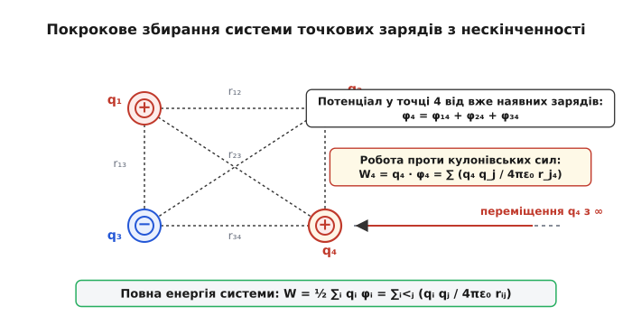
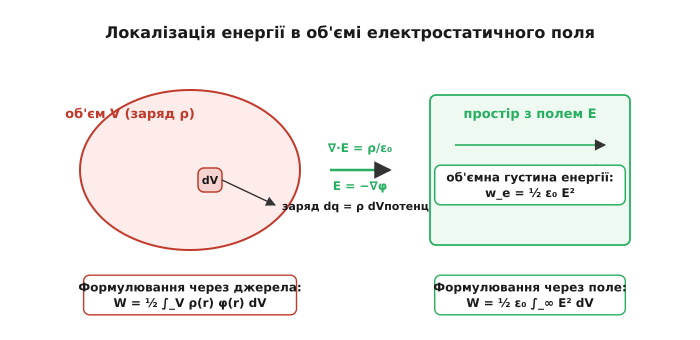
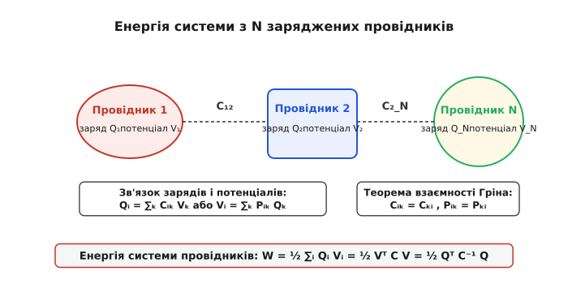
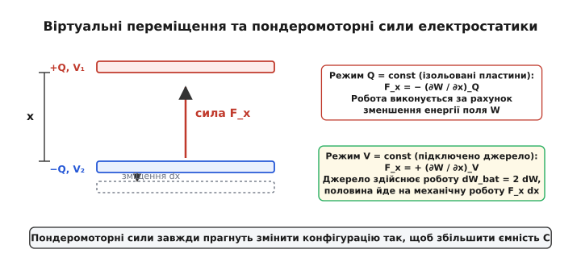

# Енергія системи зарядів

<preknowlist>
- [Закон Кулона](book:physics/coulomb-law) — взаємодія нерухомих точкових зарядів у вакуумі.
- [Потенціал електричного поля](book:physics/electric-potential) — скалярна характеристика потенціальної енергії електростатичного поля.
- [Напруженість електричного поля](book:physics/electric-field) — силова векторна характеристика електричного поля.
- [Закон Гаусса](book:physics/gauss-law) — зв'язок між потоком вектора електричної індукції та замкненим зарядом.
- [Ємність та конденсатори](book:physics/capacitance) — здатність системи провідників накопичувати електричні заряди та енергію.
</preknowlist>

Коли два різнойменні електричні заряди наближаються один до одного під дією кулонівського притягання, система здатна виконати додатну механічну роботу проти зовнішніх сил, наприклад, прискорити матеріальну частку чи стиснути пружину. Навпаки, щоб розвести різнойменні заряди на велику відстань або стиснути в обмеженому об'ємі однойменно заряджені частинки, зовнішнім силам необхідно витратити механічну роботу проти електростатичного відштовхування. За законом збереження енергії ця виконана робота не зникає безвісти: вона накопичується у вигляді **потенціальної енергії системи зарядів**.

Проте у фізиці фундаментальних взаємодій виникає глибоке запитання про фізичний носій та локалізацію цієї енергії. За класичною теорією дальнодії енергія є абстрактною властивістю самої конфігурації заряджених тіл. За релятивістською польовою концепцією Максвелла енергія є матеріально локалізованою у кожному елементі простору, де існує електростатичне поле, з об'ємною густиною, пропорційною квадрату напруженості поля. Розуміння зв'язку між енергією джерел та енергією поля є основою для розрахунку пондеромоторних механічних сил у діелектриках, проектування високовольтних конденсаторних накопичувачів, аналізу стабільності плазми та розв'язання фундаментальної проблеми власної енергії точкових частинок у класичній та квантовій електродинаміці.

---

## 1. Енергія взаємодії системи точкових зарядів: збирання з нескінченності

Щоб визначити потенціальну енергію системи нерухомих точкових зарядів, обчислимо роботу, яку необхідно виконати зовнішнім силам, щоб повільно, квазістатично принести ці заряди з нескінченності (де потенціал поля дорівнює нулю і взаємодія відсутня) у задане просторове розташування.

Уявимо порожній тривимірний простір без зовнішніх електричних полів.

```
       Кроки збирання системи точкових зарядів з нескінченності

  Крок 1: Внесення q₁ (порожній простір) ───►  W₁ = 0
  Крок 2: Внесення q₂ у поле q₁        ───►  W₂ = q₂ · φ₁(r₂)
  Крок 3: Внесення q₃ у поле q₁ та q₂  ───►  W₃ = q₃ · [φ₁₃ + φ₂₃]
  ...
  Загальна сума виконаної роботи       ───►  W = ∑_{i < j} (qᵢ qⱼ) / (4πε₀ rᵢⱼ)
```

1. **Перший крок:** Приносимо з нескінченності перший точковий заряд `q₁` і поміщаємо його в точку з радіус-вектором `r₁`. Оскільки у просторі немає жодних інших зарядів і поля, напруженість дорівнює нулю (`E = 0`), кулонівські сили не діють, і робота зовнішніх сил дорівнює нулю:
   ```
   W₁ = 0
   ```
2. **Другий крок:** Заряд `q₁` вже створює в навколишньому просторі електростатичний потенціал `φ₁(r) = q₁ / (4 · π · ε₀ · |r − r₁|)`. Вносимо з нескінченності другий заряд `q₂` і ставимо його в точку `r₂`. Зовнішні сили при цьому виконують роботу проти кулонівського поля першого заряду:
   ```
   W₂ = q₂ · φ₁(r₂) = (q₁ · q₂) / (4 · π · ε₀ · r₁₂)
   ```
   де `r₁₂ = |r₁ − r₂|` — відстань між першим та другим зарядами.
3. **Третій крок:** Вносимо з нескінченності третій заряд `q₃` у точку `r₃`. У цій точці вже існує суперпозиція потенціалів від двох попередніх зарядів `φ(r₃) = φ₁₃ + φ₂₃`. Робота зовнішніх сил на третьому кроці дорівнює:
   ```
   W₃ = q₃ · [ φ₁(r₃) + φ₂(r₃) ] = (q₁ · q₃) / (4 · π · ε₀ · r₁₃) + (q₂ · q₃) / (4 · π · ε₀ · r₂₃)
   ```

Продовжуючи цей процес для `N` точкових зарядів, повна робота `W`, виконана зовнішніми силами при збиранні всієї системи, визначається як сума робіт на кожному кроці:

```
W = W₁ + W₂ + W₃ + ... + W_N = ∑_(i < j) (q_i · q_j) / (4 · π · ε₀ · r_ij)
```

У цій сумі індекси задовольняють умову `i < j` (або `1 ≤ i < j ≤ N`), що означає, що кожна унікальна пара зарядів `(i, j)` враховується у сумі строго один раз.


*Покрокове збирання системи точкових зарядів з нескінченності: кожен наступний заряд долає кулонівську протидію раніше розміщених зарядів.*

Для надання виразу більш симетричної математичної форми розширимо сумування на всі можливі комбінації індексів `i` та `j` від `1` до `N`, за винятком діагональних елементів `i = j` (оскільки заряд не діє сам на себе у кулонівській точковій моделі). Оскільки `r_ij = r_ji`, кожна пара у подвійній сумі з'явиться двічі:

```
W = ½ ∑_(i=1)^N ∑_(j ≠ i)^N (q_i · q_j) / (4 · π · ε₀ · r_ij)
```

Згадаємо, що потенціал `φ_i`, створюваний у точці розташування `i`-го заряду усіма іншими зарядами системи, дорівнює:

```
φ_i = ∑_(j ≠ i)^N (q_j) / (4 · π · ε₀ · r_ij)
```

Підставляючи цей вираз у суму, отримуємо фундаментальну формулу **потенціальної енергії взаємодії системи точкових зарядів**:

```
W = ½ ∑_(i=1)^N q_i · φ_i
```

Коефіцієнт `½` у цій формулі має глибокий фізичний зміст: він компенсує подвійний підрахунок кожної пари взаємодії при сумуванні по всіх зарядах. Потенціал `φ_i` створюється першим зарядом у точці другого і другим зарядом у точці першого, проте енергія взаємодії належить всій парі як єдиному цілому.

Детальніше про історію розвитку концепції кулонівської енергії та суперечки між прибічниками дальнодії та польового опису можна прочитати в [історичному огляді](book:physics/energy-of-charge-system/hist-electrostatic-energy.md).

### Взаємодія точкових мультиполів: точковий диполь у зовнішньому полі

Якщо система зарядів нейтральна в цілому (`∑ q_i = 0`), але володіє відмінним від нуля **електричним дипольним моментом** `p = ∑ q_i · r_i`, її енергія взаємодії із зовнішнім електростатичним полем з потенціалом `φ_ext(r)` обчислюється шляхом розкладання потенціалу в ряд Тейлора навколо центра системи `r₀ = 0`:

```
φ_ext(r) = φ_ext(0) + r · ∇φ_ext(0) + ... = φ_ext(0) − r · E_ext(0) + ...
```

Підставляючи це розкладання у формулу енергії взаємодії, отримуємо:

```
W_int = ∑ q_i · φ_ext(r_i) ≈ φ_ext(0) · ( ∑ q_i ) − ( ∑ q_i · r_i ) · E_ext(0) = − p · E_ext
```

Потенціальна енергія точкового диполя у зовнішньому полі дорівнює:

```
W_dipole = − p · E_ext · cos θ
```

де `θ` — кут між вектором дипольного моменту `p` та вектором напруженості зовнішнього поля `E_ext`.

Енергія досягає свого абсолютного мінімуму `W_min = − p · E_ext`, коли диполь орієнтований строго паралельно до силових ліній поля (`θ = 0°`). Саме цим пояснюється прагнення полярних молекул діелектрика повертатися вздовж зовнішнього електричного поля під час поляризації.

Для двох диполів з моментами `p₁` та `p₂`, віддалених на вектор `r`, енергія їхньої попарної диполь-дипольної взаємодії спадає з відстані значно швидше, ніж кулонівська енергія точкових зарядів — як `1/r³`:

```
W_dipole_dipole = (1 / (4 · π · ε₀ · r³)) · [ (p₁ · p₂) − 3 (p₁ · n)(p₂ · n) ]
```

де `n = r / r` — одиничний вектор напрямку між диполями.

### Чисельний розрахунок для двох конфігурацій чотирьох зарядів

Для глибшого розуміння знака та величини потенціальної енергії розглянемо чисельний розрахунок системи з чотирьох точкових зарядів, розміщених у вузлах квадрата зі стороною `a = 1` метр у вакуумі. Величина модуля кожного заряду становить `Q = 10` мкКл (`10⁻⁵` Кл). Коефіцієнт Кулона `k = 1 / (4 · π · ε₀) ≈ 8.988e9` Н·м²/Кл².

У квадраті існує 6 унікальних пар взаємодії: 4 сторони довжиною `a = 1.0` м та 2 діагоналі довжиною `d = a · √2 ≈ 1.414` м.

#### Сценарій А: Альтерновані заряди (+Q, +Q у верхніх вузлах, −Q, −Q у нижніх)

Просумуємо енергії усіх шести пар:

```
W_total = W₁₂ + W₃₄ + W₁₃ + W₂₄ + W₁₄ + W₂₃
        = k · Q² / a · [ 1 + 1 − 1 − 1 − (1 / √2) − (1 / √2) ]   [винесення спільного множника k·Q²/a]
        = k · Q² / a · [ 0 − √2 ]                                [скорочення протилежних доданків 1 − 1]
        = − √2 · k · Q² / a                                     [підсумковий геометрічний коефіцієнт]
```

Підставляємо чисельні значення `Q = 1e-5` Кл та `a = 1.0` м:

```
W_total = − 1.41421356 · (8.98755e9) · (1e-5)² / 1.0     [підстановка √2, k, Q та a]
        = − 1.41421356 · (8.98755e9) · (1e-10)           [возведення заряду в квадрат: (1e-5)² = 1e-10]
        = − 1.41421356 · 0.898755                        [перемноження k на Q²: 8.98755e9 · 1e-10 = 0.898755]
        ≈ − 1.271  Дж                                    [остаточне множення на -√2]
```

Від'ємний знак повної енергії (`W = −1.271` Дж) означає, що при збиранні цієї системи з нескінченності кулонівські сили притягання виконали більшу додатну роботу, ніж сили відштовхування, і система виділила 1.271 Джоуля енергії у вигляді механічної роботи або тепла. Система перебуває у зв'язаному стані.

#### Сценарій Б: Чотири однойменні заряди (+Q, +Q, +Q, +Q)

Якщо всі чотири заряди мають однаковий позитивний знак `+Q`, то всі 6 пар взаємодії відштовхуються і мають позитивну енергію:

```
W_total_pos = k · Q² / a · [ 1 + 1 + 1 + 1 + (1 / √2) + (1 / √2) ]
            = k · Q² / a · [ 4 + √2 ] ≈ 5.414 · (0.898755) ≈ + 4.866  Дж
```

Позитивна енергія (`W = +4.866` Дж) означає, що система прагне самочинно розлетітися на нескінченність. Щоб утримувати ці чотири заряди у вершинах квадрата, зовнішні механічні затискачі повинні сприймати сумарне відштовхування силою кулонівського тиску.

---

## 2. Перехід до неперервного розподілу зарядів та польове формулювання

У макроскопічній електродинаміці ми часто маємо справу не з поодинокими точковими зарядами, а з макроскопічно неперервними розподілами зарядів: об'ємною густиною `ρ(r)` (Кл/м³), поверхневою густиною `σ(r)` (Кл/м²) на поверхнях провідників або діелектриків, та лінійною густиною `λ(r)` (Кл/м) уздовж тонких ниток.

Замінюючи суму по дискретних зарядах `∑ q_i ...` на інтеграл по елементарних зарядах `dq = ρ dV`, вираз для потенціальної енергії взаємодії неперервного розподілу зарядів набуває вигляду:

```
W = ½ ∫_V ρ(r) · φ(r) dV + ½ ∮_S σ(r) · φ(r) dS
```

де `V` — об'єм, зайнятий об'ємним зарядом, `S` — поверхні з поверхневим зарядом, а `φ(r)` — повний скалярний потенціал, створюваний усім розподілом зарядів у точці `r`.


*Локалізація енергії в електростатичному полі: еквівалентність між інтегруванням по джерелах заряду та інтегруванням об'ємної густини енергії по всьому простору поля.*

### Покрокове математичне перетворення у польову формулу

Формула `W = ½ ∫ ρ φ dV` виражає енергію через **джерела поля** (заряди `ρ` та потенціали `φ`). Здійснимо математичне перетворення цього виразу, щоб виразити енергію безпосередньо через силове поле — вектор напруженості `E`.

1. **Закону Гаусса:** За диференціальною формою закону Гаусса у вакуумі об'ємна густина заряду пов'язана з дивергенцією вектора електричного зміщення `D = ε₀ E`:
   ```
   ∇ · E = ρ / ε₀   ⇒   ρ = ε₀ · (∇ · E)
   ```
2. **Підстановка густини:** Підставимо вираз для `ρ` в інтеграл енергії:
   ```
   W = ½ · ε₀ ∫_V φ · (∇ · E) dV
   ```
3. **Векторна тотожність:** Скористаємося відомою з векторного аналізу тотожністю для дивергенції добутку скалярної функції `φ` на векторне поле `E`:
   ```
   ∇ · (φ · E) = E · ∇φ + φ · (∇ · E)
   ```
   Звідси підінтегральний добуток дорівнює:
   ```
   φ · (∇ · E) = ∇ · (φ · E) − E · ∇φ
   ```
4. **Зв'язок напруженості та потенціалу:** Згадаємо зв'язок між напруженістю та градієнтом скалярного потенціалу у потенціальному електростатичному полі:
   ```
   E = − ∇φ   ⇒   ∇φ = − E
   ```
   Отже, добуток `− E · ∇φ = − E · (− E) = E²`.
5. **Підстановка у вираз енергії:** Підставляємо перетворення в інтеграл:
   ```
   W = ½ · ε₀ ∫_V ∇ · (φ · E) dV + ½ · ε₀ ∫_V E² dV
   ```
6. **Теорема Остроградського-Гаусса:** За теоремою про дивергенцію перший інтеграл від дивергенції векторного поля `∇ · (φ E)` по об'єму `V` перетворюється на потік вектора `(φ E)` крізь замкнену поверхню `S = ∂V`, що обмежує цей об'єм:
   ```
   ∫_V ∇ · (φ · E) dV = ∮_S φ · E · dS
   ```
7. **Граничний перехід на нескінченності:** Розширимо область інтегрування `V` на все більш широкі області простору, аж до сфери нескінченного радіуса `R → ∞`.
   Для будь-якої скінченної системи зарядів на великих відстанях `R` потенціал спадає як `φ ∝ 1/R`, а напруженість поля — як `E ∝ 1/R²`. Площа сфери зростає як `S_R ∝ R²`.
   Оцінимо поверхневий інтеграл на нескінченно віддаленій сфері:
   ```
   ∮_S_R φ · E · dS ∝ (1 / R) · (1 / R²) · R² = 1 / R  ───►  0   при R → ∞
   ```
   Оскільки поверхневий інтеграл строго прямує до нуля при поширенні інтегрування на весь нескінченний тривимірний простір `ℝ³`, перший доданок повністю зникає!

У результаті отримуємо фундаментальну формулу **польної енергії електростатичного поля**:

```
W = ½ · ε₀ ∫_ℝ³ E² dV
```

Ця формула показує, що електростатична енергія є матеріально локалізованою у просторі. У кожному елементарному об'ємі `dV` простору, де існує електричне поле з напруженістю `E`, зосереджена об'ємна елементарна енергія `dW = w_e dV`, де **об'ємна густина енергії електричного поля** `w_e` дорівнює:

```
w_e = ½ · ε₀ · E²
```

Детальний аналітичний доказ зникання поверхневого інтеграла та мультипольний асимптотичний розклад наведено у [математичному виведенні](book:physics/energy-of-charge-system/math-self-energy-derivation.md).

### Стрибок густини енергії на межі розділу діелектриків

Розглянемо плоску межу розділу двох однорідних діелектриків з проникностями `ε₁` та `ε₂`. За граничними умовами електростатики нормальна компонента індукції є неперервною (`D_1n = D_2n`), а тангенціальна компонента напруженості дорівнює неперервній значенню (`E_1t = E_2t`).

Обчислимо об'ємну густину енергії по обидва боки від межі:

```
w_e1 = ½ · ε₀ · ε₁ · (E_1t² + E_1n²)
w_e2 = ½ · ε₀ · ε₂ · (E_2t² + E_2n²) = ½ · ε₀ · ε₂ · (E_1t² + (ε₁ / ε₂)² · E_1n²)
```

Завдяки нормальній компоненті електричного поля об'ємна густина енергії `w_e` зазнає скачкоподібного виміру на межі двох середовищ. У діелектрику з меншою проникністю `ε` густина енергії поля при нормальному напрямку силових ліній виявляється вищою! Це пояснює виникнення поверхневих пондеромоторних сил, які виштовхують діелектрик із високою `ε` в області з більшою напруженістю поля.

### Дисипація енергії при статичному перерозподілі зарядів

Розглянемо повчальний парадокс збереження енергії при перерозподілі зарядів між провідниками. Уявимо два однакових оболонкових провідники ємністю `C` кожен. Перший провідник заряджений зарядом `Q` і має початкову енергію `W_i = Q² / (2 C)`, а другий провідник незаряджений (`Q = 0`).

З'єднаємо обидва провідники тонким металевим дротом. Після встановлення статичної рівноваги заряд порівну розділиться між провідниками: `Q₁ = Q₂ = Q / 2`.

Обчислимо кінцеву електростатичну енергію поля двох провідників `W_f`:

```
W_f = ½ · ( (Q / 2)² / C ) + ½ · ( (Q / 2)² / C ) = ¼ · (Q² / C) = ½ · W_i
```

Виник парадокс: кінцева потенціальна енергія поля становить строго **половину** початкової енергії (`W_f = ½ W_i`)! Рівно половина початкової енергії поля `ΔW = ½ W_i = Q² / (4 C)` зникла з електростатичного поля.

Куди поділася решта енергії? При замиканні ключа під дією різниці потенціалів по провіднику протікає короткочасний струм розрядки `I(t)`. Незалежно від величини опору дроту `R` (навіть якщо опір прямує до нуля `R → 0`), точно половина початкової енергії поля перетворюється на джоулеве тепло `Q_heat = ∫ I² R dt` у провіднику та випромінюється у вигляді згасаючого сплеску електромагнітних хвиль!

---

## 3. Парадокс власної енергії точкового заряду та межі класичної теорії

Порівняння двох отриманих формул для енергії розкриває глибокий концептуальний парадокс, який розділив класичну фізику XIX та XX століть:

```
Формула джерел (дискретна):   W = ½ ∑_{i ≠ j} (qᵢ qⱼ) / (4πε₀ rᵢⱼ)   (може бути W < 0)
Формула поля (неперервна):   W = ½ ε₀ ∫ E² dV                       (завжди W ≥ 0)
```

Як дискретна формула `W`, яка для протилежних зарядів може набувати від'ємних значень (`W < 0`), може бути математично еквівалентною польовій формулі `½ ε₀ ∫ E² dV`, підінтегральний вираз якої `E² ≥ 0` є строго невід'ємним у кожній точці простору?

Розгадка полягає у різниці між **енергією взаємодії** та **власною енергією** зарядів.

Розглянемо систему з двох точкових зарядів `q₁` та `q₂`. За принципом суперпозиції повне електричне поле у кожній точці простору є сумою полів двох зарядів: `E = E₁ + E₂`.

Підставимо суму полів у польову формулу енергії:

```
W_field = ½ · ε₀ ∫ (E₁ + E₂)² dV
        = ½ · ε₀ ∫ E₁² dV + ½ · ε₀ ∫ E₂² dV + ε₀ ∫ (E₁ · E₂) dV
```

У цьому виразі чітко вирізняються три доданки:
1. `W_self,1 = ½ · ε₀ ∫ E₁² dV` — **власна енергія першого заряду**, тобто енергія поля, яке створює заряд `q₁` у всьому просторі за відсутності інших зарядів.
2. `W_self,2 = ½ · ε₀ ∫ E₂² dV` — **власна енергія другого заряду**.
3. `W_int = ε₀ ∫ (E₁ · E₂) dV` — **перехресна енергія взаємодії** між полями двох зарядів.

Саме перехресний інтеграл `W_int` строго дорівнює парній кулонівській енергії взаємодії:

```
W_int = ε₀ ∫ (E₁ · E₂) dV = (q₁ · q₂) / (4 · π · ε₀ · r₁₂)
```

Для різнойменних зарядів скалярний добуток векторів напруженостей `E₁ · E₂` є переважно від'ємним у просторі між зарядами, тому інтеграл взаємодії `W_int < 0` є від'ємним.

Дискретна формула `W = ½ ∑ q_i φ_i` навмисно **ігнорує власну енергію** зарядів `W_self`, віднімаючи її за визначенням умови `j ≠ i` (заряд не створює потенціалу на самому собі у точковій моделі). Польова формула `W = ½ ε₀ ∫ E² dV`, навпаки, враховує **повну енергію**, включаючи як енергію взаємодії `W_int`, так і власні енергії `W_self` усіх зарядів системи.

### Катастрофа нескінченної власної енергії

Якщо обчислити власну енергію точкового заряду `q` за польовою формулою, уявивши заряд у вигляді малої зарядженої сфери радіуса `r₀`, то напруженість поля зовні сфери дорівнює `E(r) = q / (4 · π · ε₀ · r²)`.

Обчислимо об'ємний інтеграл власної енергії у сферичних координатах від `r₀` до нескінченності:

```
W_self = ½ · ε₀ ∫_r₀^∞ ( q / (4 · π · ε₀ · r²) )² · 4 · π · r² dr = q² / (8 · π · ε₀ · r₀)
```

Якщо ми спробуємо зробити заряд строго точковим, спрямувавши його геометричний радіус до нуля (`r₀ → 0`), то власність енергія поля прямує до плюс нескінченності:

```
lim_(r₀ → 0) W_self = + ∞
```

Це означає, що точковий заряд у класичній електродинаміці володіє **нескінченною власною енергією**. А за співвідношенням Ейнштейна `E = m · c²` точковий електрон мусив би мати нескінченну масу і не міг би бути прискорений жодною скінченною силою!

У класичній фізиці цю проблему намагалися обійти, приписуючи електрону скінченний **класичний радіус електрона** `r_e`:

```
r_e = e² / (4 · π · ε₀ · m_e · c²) ≈ 2.81794 × 10⁻¹⁵ м  (2.82 фм)
```

Спроби введення скінченного радіуса електрона викликали нову проблему: що саме утримує негативно заряджену сферу електрона від розлітання під дією власних кулонівських сил відштовхування? Для цього Анрі Пуанкаре довелося ввести непрозорі неелектричні «тиски Пуанкаре» (pression de Poincaré).

Крім того, у класичній електронній теорії Лоренца-Абрагама виникло так зване парадоксальне «співвідношення 4/3»: електромагнітна маса електрона, обчислена через імпульс поля `p = ∫ (S / c²) dV`, дорівнювала `m_em = (4/3) · (W_self / c²)`, що суперечило релятивістській формулі Ейнштейна `m = W / c²`.

Остаточне математичне розв'язання проблеми нескінченного інтеграла власної енергії було знайдено лише у 1940-х роках у квантовій електродинаміці (КЕД) за допомогою процедури **ренормування (перенормування)** маси та заряду.

---

## 4. Енергія системи заряджених провідників та ємнісна матриця

Особливо важливим практичним застосуванням теорії є обчислення енергії системи з `N` заряджених провідних тіл (наприклад, пластин конденсаторів, жил багатофазних кабелів чи доріжок друкованої плати).

Головна електростатична властивість провідника полягає у тому, що у стаціонарному стані весь його об'єм та поверхня є **еквіпотенціальними**: потенціал у будь-якій точці `i`-го провідника має одне й те саме постійне значення `φ = V_i = const`. Заряди провідника `Q_i` розташовуються виключно на його зовнішній поверхні `S_i`.

Завдяки постійності потенціалу `V_i` поверхневий інтеграл джерел для системи `N` провідників виноситься з-під знака інтегрування:

```
W = ½ ∑_(i=1)^N ∮_S_i σ(r) · V_i dS = ½ ∑_(i=1)^N V_i · ( ∮_S_i σ(r) dS )
```

Оскільки інтеграл від поверхневої густини заряду `∮ σ dS = Q_i` дорівнює повному заряду `i`-го провідника, ми отримуємо точну формулу **енергії системи провідників**:

```
W = ½ ∑_(i=1)^N Q_i · V_i
```


*Енергія системи з N провідних тіл: матричні коефіцієнти взаємної наводки C_ik та квадрична форма повної енергії.*

### Матричний зв'язок та квадратичні форми енергії

За принципом суперпозиції у лінійному середовищі потенціал `V_i` кожного з `N` провідників є лінійною комбінацією зарядів усіх провідників системи:

```
V_i = ∑_(k=1)^N p_ik · Q_k      або у матричній формі:  V = P · Q
```

де `p_ik` — **потенціальні коефіцієнти**, які залежать виключно від геометрії та взаємного розташування провідників.

Навпаки, заряд `Q_i` кожного провідника виражається через потенціали всіх провідників за допомогою оберненої матриці ємностей `C = P⁻¹`:

```
Q_i = ∑_(k=1)^N C_ik · V_k      або у матричній формі:  Q = C · V
```

де `C_ii > 0` — **власні ємнісні коефіцієнти** провідників, а `C_ik ≤ 0` (при `i ≠ k`) — **коефіцієнти взаємної ємності (наводки)**. За теоремою взаємності Гріна матриці є симетричними: `p_ik = p_ki` та `C_ik = C_ki`.

Підставляючи матричні співвідношення у формулу енергії, отримуємо дві фундаментальні **квадратичні форми енергії системи провідників**:

```
Енергія через заряди:     W(Q) = ½ · Qᵀ · P · Q = ½ ∑_(i=1)^N ∑_(k=1)^N p_ik · Q_i · Q_k
Енергія через потенціали: W(V) = ½ · Vᵀ · C · V = ½ ∑_(i=1)^N ∑_(k=1)^N C_ik · V_i · V_k
```

Для одиночного провідника або двох обкладок конденсатора з ємністю `C` квадратична форма згортається у три класичні шкільні формули:

```
W = ½ · Q · V = ½ · C · V² = Q² / (2 · C)
```

### Електростатичне екранування та захист від перехресних наводок

У високочастотній електроніці та прецизійній вимірювальній техніці взаємні ємнісні коефіцієнти `C_ik` між сусідніми доріжками друкованих плат викликають паразитні перехресні наводки (crosstalk). Коли на сигнальній лінії `k` відбувається швидкий перепад напруги `dV_k / dt`, у сусідній лінії `i` виникає імпульсний струм наводки:

```
I_i = C_ik · ( dV_k / dt )
```

Для усунення цієї наводки між доріжками розміщують заземлену провідну лінію або шар екрана (`V_screen = 0`). За теоремою про електростатичне екранування заземлена металева оболонка повністю блокує проникнення ліній напруженості поля: взаємний ємнісний коефіцієнт стає строго нульовим (`C_ik = 0`), а паразитна енергія наводки `W_cross = C_ik V_i V_k` зникає.

Систематизовані матричні формули та властивості коефіцієнтів наводки наведено у [довіднику формул та матрицій ємностей](book:physics/energy-of-charge-system/api-charge-energy-calc.md).

---

## 5. Енергія поля в діелектриках та пондеромоторні сили

Коли простір між зарядами заповнений діелектричним середовищем з відносною діелектричною проникністю `ε_r`, під дією електричного поля відбувається поляризація речовини. Вектор електричного зміщення (індукції) `D` описує сумарний ефект вільних та зв'язаних зарядів:

```
D = ε₀ · E + P = ε₀ · ε_r · E
```

У лінійному ізотропному діелектрику об'ємна густина електростатичної енергії враховує як енергію самого електричного поля, так і роботу, витрачену на пружну поляризацію молекул речовини:

```
w_e = ½ · (E · D) = ½ · ε₀ · ε_r · E²
```

Повна енергія електростатичного поля у діелектричному середовищі дорівнює:

```
W = ½ ∫_V (E · D) dV = ½ · ε₀ ∫_V ε_r(r) · E²(r) dV
```

### Енергія поля у нелінійних та анізотропних середовищах

У сегнетоелектриках (наприклад, титанаті барію `BaTiO₃`) зв'язок між векторами `D` та `E` є нелінійним і залежить від передісторії поляризації (явище гістерезису). При зміні поля від `0` до `E` елементарна зміна густини енергії поля визначається інтегралом `dw = E · dD`.

Повна накопичена енергія при нелінійній поляризації обчислиться інтегруванням уздовж основної кривої поляризації:

```
w_e = ∫₀^D_final E(D) dD
```

Площа петлі гістерезису `∮ E dD` виражає необоротні діелектричні втрати на нагрівання діелектрика за один повний цикл переполяризації.

В анізотропних кристалах (наприклад, у кварці чи шпаті) діелектрична проникність є тензором другого рангу `ε_ij`. Об'ємна густина енергії електростатичного поля виражається тензорною квадратичною формою:

```
w_e = ½ ∑_(i=1)^3 ∑_(j=1)^3 ε₀ · ε_ij · E_i · E_j
```

Вектори напруженості `E` та індукції `D = ε₀ ε · E` у таких кристалах узагалі не є паралельними між собою, що створює обертальні пондеромоторні моменти сил, які повертають анізотропний кристалик у зовнішньому полі.

### Пондеромоторні сили та метод віртуальних переміщень

Механічні сили, що діють на макроскопічні тіла (провідники та діелектрики), розміщені у зануреному електричному полі, називаються **пондеромоторними силами** (від латинського *pondus* — вага, маса та *motor* — той, що рухає).

Для обчислення пондеромоторної сили `F_x`, яка діє на тіло вздовж узагальненої координати `x` (наприклад, сила втягування діелектричної пластини у конденсатор), застосовують **метод віртуальних переміщень**. При цьому результат залежить від того, в яких термодинамічних умовах перебуває система під час уявного зміщення `dx`.


*Пондеромоторна сила при віртуальному зміщенні пластини конденсатора: різниця між ізольованою системою та колом із батареєю.*

1. **Режим 1: Ізольована система (заряди пластин фіксовані, `Q = const`)**
   Пластини конденсатора відключені від джерела живлення, тому заряди на них не можуть змінюватися (`dQ = 0`).
   При віртуальному зміщенні пластини на `dx` механічна робота `dW_mech = F_x · dx` виконується виключно за рахунок зменшення накопиченої потенціальної енергії електричного поля `W`:
   ```
   dW_mech = − dW_field   ⇒   F_x = − ( ∂W / ∂x )_Q
   ```
   Підставляючи формулу енергії через заряд `W = Q² / (2 C(x))`, отримуємо:
   ```
   F_x = − ∂/∂x ( Q² / (2 · C(x)) ) = + ½ · ( Q² / C²(x) ) · ( dC / dx ) = + ½ · V² · ( dC / dx )
   ```
2. **Режим 2: Підключене джерело напруги (потенціали пластин фіксовані, `V = const`)**
   Пластини залишаються підключеними до акумуляторної батареї з постійною напругою `V`.
   При зміщенні `dx` змінюється ємність системи `dC`, що викликає перетікання заряду `dQ = V · dC` від батареї до пластин. Джерело живлення виконує роботу `dW_bat = V · dQ = V² · dC`.
   За законом збереження енергії робота джерела йде як на виконання механічної роботи `F_x · dx`, так і на зміну енергії поля `dW_field`:
   ```
   dW_bat = dW_mech + dW_field
   V² · dC = F_x · dx + ½ · V² · dC   ⇒   F_x · dx = ½ · V² · dC
   ```
   Звідси сила при фіксованій напрузі дорівнює:
   ```
   F_x = + ( ∂W / ∂x )_V = + ½ · V² · ( dC / dx )
   ```

Зверніть увагу на дивовижний факт: незалежно від того, чи була система ізольована (`Q = const`), чи підключена до батареї (`V = const`), математичний вираз для механічної сили є **абсолютно однаковим**:

```
F_x = ½ · V² · ( dC / dx )
```

Знак цієї сили є завжди додатним при `dC/dx > 0`. Це формулює фундаментальне фізичне правило: **електростатичні пондеромоторні сили завжди прагнуть змістити тіла так, щоб збільшити загальну ємність системи `C`**.

### Механічний тиск на межі діелектриків та електрогідродинаміка

Пондеромоторні сили діють не лише на тверді пластини провідників, а й на межу розділу рідких чи газуватих діелектриків. Наприклад, якщо дві вертикальні паралельні обкладки плоского конденсатора частково занурити у рідкий діелектрик (наприклад, трансформаторне масло `ε_r > 1`), то під дією електричного поля рідина піднімається вгору між пластинами проти сил тяжіння на висоту `h`.

Обчислимо пондеромоторну силу втягування рідини за допомогою метода віртуальних переміщень. Ємність конденсатора висотою `L` та шириною `w`, зануреного на висоту `h`, дорівнює сумі ємностей заповненої та повітряної частин:

```
C(h) = (ε₀ · ε_r · w · h) / d + (ε₀ · w · (L − h)) / d = (ε₀ · w / d) · [ (ε_r − 1) · h + L ]
```

Похідна ємності по висоті підйому рідини `h`:

```
dC / dh = (ε₀ · (ε_r − 1) · w) / d
```

Результуюча вертикальна пондеромоторна сила втягування:

```
F_h = ½ · V² · ( dC / dh ) = ½ · ε₀ · (ε_r − 1) · (V / d)² · (w · d) = ½ · ε₀ · (ε_r − 1) · E² · A_horiz
```

де `A_horiz = w · d` — площа горизонтального перерізу рідкого стовпа між пластинами.

Отже, електричне поле створює від'ємний електростатичний тиск на межу рідини:

```
P_electrostatic = ½ · ε₀ · (ε_r − 1) · E²
```

Цей тиск врівноважується гідростатичним тиском стовпа рідини висотою `h` густиною `ρ_liq` під дією прискорення вільного падіння `g`:

```
½ · ε₀ · (ε_r − 1) · E² = ρ_liq · g · h   ⇒   h = ( ε₀ · (ε_r − 1) · E² ) / (2 · ρ_liq · g)
```

Цей ефект підйому рідини в електричному полі є наочною демонстрацією того, що поле володіє матеріальною об'ємною густиною енергії і прагне втягнути середовище з більшою діелектричною проникністю у зони високої напруженості поля.

### Електрострикція та механічні деформації твердих діелектриків

Крім просторового переміщення макроскопічних тіл, накопичення потенціальної енергії електростатичного поля усередині твердого діелектрика викликає його механічне деформування — явище **електрострикції**.

Під дією сильного електричного поля з напруженістю `E` молекули діелектрика поляризуються і витягуються вздовж силових ліній поля. Об'ємна густина енергії `w_e = ½ ε₀ ε_r E²` створює усередині речовини внутрішні механічні напруження, що призводить до відносної деформації стиснення або розтягнення `γ = ΔL / L`, пропорційної квадрату напруженості поля:

```
γ = R_st · E²
```

де `R_st` — коефіцієнт електрострикції матеріалу. На відміну від п'єзоелектричного ефекту, електрострикція спостерігається у всіх без винятку діелектриках (включаючи центросиметричні кристали та аморфне скло) і не змінює знака деформації при зміні напрямку електричного поля на протилежний. Електрострикційні деформації необхідно враховувати при проектуванні високовольтних керамічних конденсаторів та п'єзоактюаторів для уникнення механічного розтріскування діелектричного шару при високих напругах.

Таким чином, розгляд енергії системи зарядів як через джерела (попарні кулонівські потенціали), так і через локалізоване у просторі поле (об'ємну густину `w_e = ½ ε₀ ε_r E²`) дає повну цілісну картину електростатичних явищ. Це дозволяє аналізувати як внутрішньоатомні взаємодії, так і макроскопічні пондеромоторні сили у довільних середовищах.

Програмну реалізацію чисельного моделювання багаточастинкових систем і розрахунку кулонівських сил наведено у [симуляційному проекті](book:physics/energy-of-charge-system/proj-charge-system-sim.md).

---

> 🔧 **Навіщо це.**
>
> Концепція енергії системи зарядів та поля є фундаментальним розрахунковим інструментом у сучасній високотехнологічній інженерії та фізиці:
>
> 1. **Проектування мікроелектромеханічних систем (MEMS):** У сучасних смартфонах, акселерометрах, гіроскопах та мікрозатворах проекторів (DLP) переміщення рухомих мікродзеркал та кремнієвих гребінок здійснюється саме за рахунок пондеромоторних сил електростатичного притягання `F_x = ½ V² (dC/dx)`.
> 2. **Імпульсна енергетика та суперконденсатори:** У проектуванні систем лазерного підпалу термоядерного синтезу, медичних дефібриляторів та рейкотронів розрахунок об'ємної густини енергії `w_e = ½ ε₀ ε_r E²` визначає граничну запасену енергію накопичувальних батарей та дозволяє уникати електричного пробою діелектричних обкладок.
> 3. **Молекулярна динаміка та біофізика:** При комп'ютерному моделюванні згортання білків, розрахунку конформацій ДНК та розробці ліків обчислення попарної кулонівської енергії взаємодії тисяч заряджених амінокислотних залишків дозволяє прогнозувати біологічну активність молекул.
