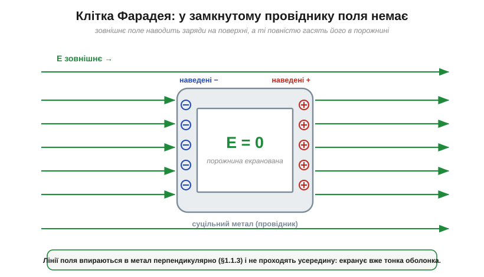
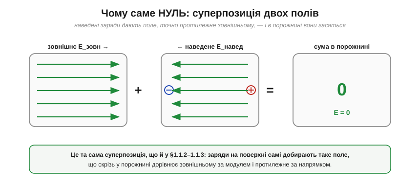
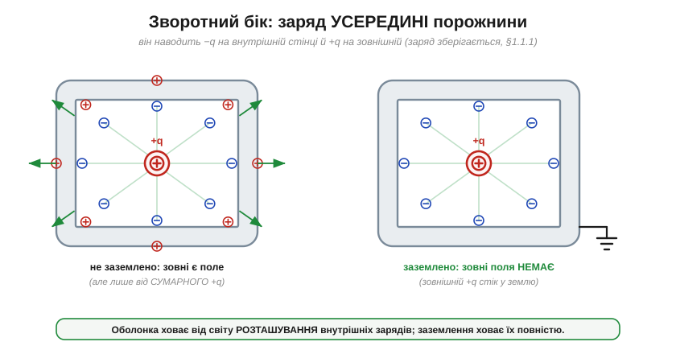
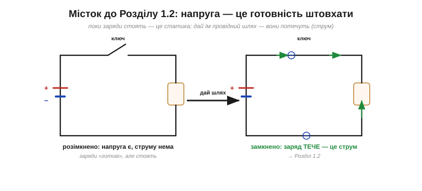

# Клітка Фарадея й екранування

Серед усіх явищ електростатики клітка Фарадея — мабуть, найкорисніше для практичної електроніки. Поставмо пряме інженерне питання: як **захистити** щось від електричного поля? Як зробити куточок простору, куди зовнішні заряди не дотягуються, — щоб тонкий сигнал давача не тонув у наводках, а чутлива мікросхема не ловила кожну іскру довкола? Відповідь напрочуд проста й трохи несподівана: **оточити його провідником**. Усередині замкнутої металевої оболонки — навіть зробленої з самої лиш сітки — електричного поля **немає зовсім**. Це і є **екранування** (*shielding*, *screening*), а саму оболонку звуть **кліткою Фарадея** (*Faraday cage*). І найкрасивіше те, що для розуміння, *чому*, жодного нового закону не знадобиться — досить уже знайомих властивостей заряду й поля.

### Дослід, що й досі вражає

Майкл Фарадей довів це видовищно. 1836 року він збудував велику кімнату-куб завбільшки кілька метрів, оббиту металевою фольгою й дротяною сіткою, поставив її на ізолятори й зарядив до високої напруги — так, що зовні з неї сипалися іскри, а клаптики паперу підлітали від наелектризованих стін. А тоді спокійно зайшов **усередину** з найчутливішими електроскопами, які мав, і шукав хоч натяк на поле. Не знайшов нічого: усередині прилади лишалися мертвими, наче зовні не було жодного заряду.

Ще раніше, простішим дослідом із металевим **цеберком для льоду** (звідси й назва — *ice-pail experiment*, 1843), Фарадей показав другий бік того самого явища: внесений усередину заряд наводить рівно такий самий заряд на зовнішній стінці, проте крізь сам метал його поле не проходить. Обидва досліди впираються в один факт: замкнутий провідник цілком розділяє «всередині» й «зовні». Поясніть цей факт — і ви володієте екрануванням. А пояснити його можна, спираючись лише на поведінку вільних зарядів у провіднику.

### Чому в порожнині поля немає

Почнімо з найголовнішого — зі [вільних зарядів](book:physics/electric-charge) у провіднику. Метал повний електронів, які можуть гуляти по всьому об'єму. Піднесімо до куска металу зовнішнє поле — хай однорідне, спрямоване праворуч.


*Рис. Провідник у зовнішньому полі. Вільні електрони зміщуються, наводячи **−** на одному боці й **+** на іншому; зовнішні лінії поля впираються в метал перпендикулярно і до порожнини не доходять — усередині **E = 0**.*

Поле штовхає вільні електрони (вони від'ємні) **проти** свого напрямку — ліворуч. Електрони зміщуються й накопичуються на лівій поверхні, лишаючи правий бік із нестачею електронів, тобто **додатним**. Так на поверхнях металу самі собою з'являються **наведені заряди** (*induced charges*): мінус там, куди поле зганяє електрони, плюс — звідки воно їх забирає.

Але тут і ховається вся суть. Ці наведені заряди **самі створюють поле** — і всередині металу воно спрямоване назустріч зовнішньому (від плюса праворуч до мінуса ліворуч). Поки всередині лишається хоч якесь сумарне поле, воно й далі штовхає електрони — отже, рівновага ще не настала. Заряди перестануть рухатися лише тоді, коли їхнє власне поле **точно зрівноважить** зовнішнє, і всередині металу настане **E = 0**.


*Рис. Звідки береться нуль. Тільки-но прикладено поле, електрони рушають проти нього (ліворуч); вони рухаються доти, доки наведені заряди не створять рівно протилежне поле — і в металі настане рівновага з E = 0.*

Це не випадковий збіг, а **неминучість**, і міркування варте того, щоб його закарбувати. У провіднику, що дійшов рівноваги (де заряди вже не рухаються), поле всередині **мусить** дорівнювати нулю — інакше воно й далі ганяло б вільні заряди, і рівноваги не було б за означенням. Це той самий висновок, що й [провідник — одна еквіпотенціаль](book:physics/field-and-potential). А якщо E = 0 у самому металі, то заряди на поверхні неодмінно влаштувалися так, щоб скрізь усередині погасити зовнішнє поле. Метал не «зупиняє» поле стіною — він **відповідає** на нього власним, рівно протилежним.

> 🔧 **Навіщо це.** Ось чому глуха металева коробка — найдешевший і найнадійніший спосіб захистити електроніку від зовнішніх електричних наводок. Не треба ні живлення, ні складної схеми: вільні електрони в стінках самі, без жодної команди, миттєво перебудовуються під будь-яке зовнішнє поле й гасять його всередині. Корпус приладу, екран кабелю, бляшаний кожух над чутливим вузлом — усе це працює на одному цьому факті.

### Це просто суперпозиція

Корисно глянути на те саме під іншим кутом — мовою [суперпозиції](book:physics/electric-field). Поле в будь-якій точці порожнини — це сума двох полів: зовнішнього й того, що створюють наведені заряди.


*Рис. Те саме мовою суперпозиції: усередині складаються зовнішнє поле (праворуч) і поле наведених зарядів (ліворуч). Рівні за модулем, протилежні за напрямком — сума нуль у кожній точці порожнини.*

Зовнішнє поле однорідне й дивиться праворуч. Наведені заряди розташувалися так, що їхнє сумарне поле всередині дивиться ліворуч — і рівно настільки ж сильне. Складіть два вектори, однакові за модулем і протилежні за напрямком, — дістанете нуль. У кожній точці порожнини. Ніякої магії: це звичайне додавання полів, тільки тепер зарядів багато, і природа сама розставила їх на поверхні в єдино можливу рівноважну конфігурацію — ту, що гасить поле всюди всередині.

Помітьте, наскільки це сильніше за просту інтуїцію «метал не пропускає». Крізь нерухомий метал поле спокійно проходило б — якби заряди не ворухнулися. Екранує не речовина сама по собі, а **перерозподіл** її вільних зарядів. Саме тому екран мусить бути **провідником**: в ізоляторі заряди не вільні, перебудуватися й погасити поле вони не можуть, тож скляна чи пластикова коробка від поля не захищає.

### Порожнина — одна еквіпотенціаль

З того, що E = 0 у металі, негайно випливає висновок про **порожнину** всередині. Якщо видовбати в куску металу порожнину (не вклавши туди жодного заряду), у ній теж буде E = 0. Чому? Поле скрізь у металі нульове, а порожнина оточена металом з усіх боків; зайти полю в неї немає звідки — будь-яка лінія мусила б початися й скінчитися на стінці, але вздовж [рівноважної поверхні провідника](book:physics/field-and-potential) поля нема. Порожнина «успадковує» нульове поле металу. А якщо E = 0, то й [потенціал у ній **не змінюється**](book:physics/electric-potential): уся порожнина разом зі стінками сидить на **одному** значенні V.


*Рис. Якщо E = 0, то V однаковий у всій порожнині (ліворуч): зовнішнє «розгойдування» на тисячі вольтів усередині стає нулем. Праворуч: екранує сам факт замкнутої оболонки — суцільний брусок і тонка фольга роблять це однаково.*

Звідси два практичні наслідки. Перший: для екранування **байдуже, суцільний провідник чи порожнистий** — зовнішні заряди розташовуються на зовнішній поверхні однаково, а все всередині оболонки однаково захищене. Другий, ще приємніший: **товщина оболонки не має значення**. Екранує не маса металу, а сам факт замкнутої провідної поверхні. Тонесенька суцільна фольга захищає так само, як товста бронзова плита, — бо й тонкому шару вистачає вільних електронів, щоб вишикуватися й погасити поле. Важлива тільки **замкнутість**.

**Приклад (наскільки оболонка «сплощує» поле).** Хай зовні діє однорідне поле E = 10 кВ/м, а наш екран — коробка завглибшки d = 0.2 м. Якби поле проникало всередину, між протилежними стінками порожнини була б різниця потенціалів (за [E = ΔV/d](book:physics/electric-potential)):

```
без екрана:  ΔV = E · d = 10000 В/м × 0.2 м = 2000 В   (2 кВ «розгойдування»)
з екраном:   E = 0  →  ΔV = 0 В
```

Дві кінцівки чутливого вузла, рознесені на 20 см, замість двох кіловольтів наводки бачать **нуль**. Ось масштаб того, що дає звичайна замкнута коробка.

### Чому годиться навіть сітка

Найдивовижніше у Фарадеєвому досліді — що його кімната була не суцільна, а **сітчаста**. І все одно екранувала. Як таке можливо, якщо в сітці повно дірок?


*Рис. Чому екранує навіть сітка. Лінії впираються в прутики; навпроти отворів поле просочується лише на глибину порядку розміру комірки й там згасає. Дрібніша комірка — краще екранування.*

Відповідь — у тому, як поводиться поле біля отвору. Лінії впираються в металеві прутики (там, на них, сідають наведені заряди), і лише навпроти самих отворів поле трохи **просочується** всередину. Та просочується неглибоко: воно «загладжується» й згасає на відстані порядку **розміру комірки**. Якщо комірки дрібні проти розмірів самої клітки, то вже на невеликій глибині від стінки поле практично нульове, а в центрі його немає й поготів. Тому суцільність не обов'язкова — досить частої провідної сітки.

> 🔧 **Навіщо це.** Це пояснює цілий клас рішень. Сітка на дверцятах мікрохвильовки лишає простір прозорим для ока, але втримує те, що треба втримати, — бо її отвори набагато менші за нього. Перфорований металевий корпус приладу провітрюється, але екранує. А обплетення (екран) сигнального кабелю — це та сама клітка Фарадея, тільки скручена в трубку навколо жили. Скрізь діє одне правило: **отвори мають бути дрібними** проти того, від чого захищаєшся.

### Зворотний бік: заряд усередині

Досі ми захищали порожнину від поля **ззовні**. А що, як заряд опиниться **всередині** порожнини? Це і є дослід із цеберком — і відповідь тут тонша.


*Рис. Заряд усередині. Усі лінії від +q кінчаються на внутрішній стінці, наводячи там рівно −q; на зовнішній виступає +q (метал нейтральний). Ліворуч: незаземлена оболонка — зовні є поле від сумарного заряду. Праворуч: заземлена — зовнішній заряд стікає, і зовні не лишається нічого.*

Покладімо в порожнину додатний заряд +q. Його поле тепер є всередині — нікуди ж йому подітися. Лінії цього поля йдуть від +q навсібіч і впираються у внутрішню стінку, наводячи на ній від'ємний заряд. Скільки саме? Рівно −q. Адже всередині металу поле нульове, тож **жодна** лінія від +q не може пройти крізь стінку назовні — усі до одної мусять закінчитися на внутрішній поверхні, а отже, зібрати там сумарний заряд точно −q. А оскільки метал у цілому лишається нейтральним ([збереження заряду](book:physics/electric-charge)), то стільки ж заряду, скільки «забрала» внутрішня стінка, бракує деінде — і на **зовнішній** поверхні виступає +q.

**Приклад (бухгалтерія наведених зарядів).** Внесімо в ізольовану металеву коробку заряд +5 нКл:

```
заряд у порожнині:             +5 нКл
наведено на ВНУТРІШНІЙ стінці:  −5 нКл   (усі лінії від +q кінчаються тут)
наведено на ЗОВНІШНІЙ стінці:   +5 нКл   (бо коробка в цілому нейтральна)
```

Тепер видно, що саме ховає, а що видає оболонка. **Зовні** поле є — його дає +5 нКл на зовнішній поверхні. Але — і це головне — його картина залежить лише від **форми зовнішньої поверхні**, а не від того, де саме всередині лежить заряд і скільки тих зарядів. Совай заряд по порожнині, дроби його на частини — зовнішнє поле не ворухнеться, поки сумарний внутрішній заряд той самий. Оболонка приховує від зовнішнього світу **всю внутрішню кухню**, лишаючи назовні єдине число — повний заряд усередині.

А якщо й це число сховати? Тоді оболонку [**заземлюють**](book:physics/electric-charge). Зайвий +q із зовнішньої поверхні стікає в землю — і зовні не лишається **нічого**: ні поля, ні сліду внутрішнього заряду. Заземлений провідник екранує в **обидва** боки: зовнішнє поле не входить усередину, а внутрішнє не виходить назовні.

### Заземлювати чи ні

Тут варто розвіяти поширену плутанину. Чи **обов'язково** заземлювати екран? Залежить від того, від чого захищаємось.

Щоб уберегти порожнину від **зовнішнього** поля, заземлення **не потрібне**: ми ж бачили — вільні заряди оболонки гасять зовнішнє поле в порожнині самі, хай навіть коробка ні до чого не під'єднана. Незаземлена металева коробка вже екранує те, що всередині.

Проте заземлення дає три важливі речі. По-перше, воно **фіксує потенціал** оболонки (а з нею й порожнини) на нулі — інакше «плаваюча» коробка може набрати власний потенціал від випадкових зарядів. По-друге, воно стікає будь-який наведений на зовнішній поверхні заряд, отже, екранує й у зворотний бік — від внутрішніх джерел назовні. По-третє, на практиці зовнішнє поле рідко буває геть статичним; заземлений екран дає тим зарядам, що ними «гойдає» мінливе зовнішнє поле, шлях стекти, а не накопичуватись. Тому в реальних приладах екран майже завжди **з'єднують із землею** — це з тих звичок, що недорого коштують і багато рятують.

> 🔧 **Навіщо це.** Звідси одне з наскрізних правил монтажу: металевий корпус приладу під'єднують до спільного нуля (землі) схеми. Тоді корпус і екранує внутрішні вузли від зовнішніх полів, і сам не «світить» назовні, і не плаває під випадковим потенціалом, за який неприємно взятися рукою. «Заземли кожух» — одна з найдешевших порад у всій електроніці.

### Де екранування не спрацьовує

Чесно окреслимо й межі — бо клітка Фарадея не всемогутня. По-перше, вона безсила там, де **порушено замкнутість**: широка щілина, довгий проріз, недбалий стик двох половинок корпусу — і крізь них поле затікає, як протяг крізь шпарину. Тому в екрануванні дрібниці на кшталт того, чи добре прилягає кришка, важать незрідка більше за товщину стінок.

По-друге, усе сказане строго стосується **сталих** полів — електростатики. Поля, що **швидко змінюються в часі**, екрануються за тим самим принципом, але з поправками, які залежать від матеріалу й розміру отворів: чим швидші зміни, тим прискіпливіше доводиться ставитися до суцільності екрана й розмірів комірок.

І по-третє — застереження, яке варто почути одразу, щоб не переоцінити захист. Клітка Фарадея екранує **електричне** поле. А ось сталого **магнітного** поля вона майже не тримає: компас усередині металевої коробки спокійно показує на північ. [Магнетизм](book:physics/magnetic-field) — окреме явище з власними правилами, тож «екран від електрики» й «екран від магніту» — різні речі: для магнітного поля потрібен не просто провідник, а спеціальний феромагнітний матеріал, що замикає лінії в собі.

### Клітки Фарадея довкола нас

Варто на мить роззирнутися — і ви впізнаєте це явище всюди.


*Рис. Те саме явище в побуті: кузов авто відводить блискавку по обшивці; сітка дверцят НВЧ-печі втримує хвилі; екран кабелю перехоплює наводки; металізований пакет береже мікросхему від ESD.*

Авто чи літак під час грози — велика клітка Фарадея: блискавка б'є в метал і розтікається по **зовнішній** обшивці, лишаючи людей усередині неушкодженими (рятують саме провідні стінки, а зовсім не гумові шини, як часто думають). Ліфт чи залізобетонна коробка з арматурою глушать сигнал телефона з тієї самої причини. Металевий корпус осцилографа береже його тонку електроніку від наводок цеху. Екран коаксіального кабелю обвиває сигнальну жилу й перехоплює завади на себе. А чутливі мікросхеми возять у **антистатичних екранувальних пакетах** — металізованих торбинках, що є кишеньковою кліткою Фарадея й не пускають до виводів ту саму [статику](book:physics/electric-charge), що псує електроніку. Одне явище — і ціле гроно щоденних рішень.

> 🔌 Як ці екрани роблять і — головне — як їх правильно під'єднати в реальному пристрої (корпус, провідні прокладки, заземлення оплетення кабелю по колу): [Екран навколо нас](comp-everyday-shields.md).

### Від нерухомих зарядів — до потоку

Варто зауважити річ, що ховається за всім сказаним: тут заряди зрештою **стоять на місці**. Навіть наведені заряди клітки, перебігши на свої поверхні, завмирають у рівновазі. Можна сказати, де потенціал вищий, а де нижчий, — але заряд іще нікуди не тече.


*Рис. Різниця потенціалів — це **запасена готовність** штовхати заряд: поки коло розімкнене, напруга є, а струму нема. Дай провідний шлях — і заряд потече. Цей рух заряду і є струм.*

У цьому й уся напруга: вона — як піднята вгору вода чи зведена пружина, **запасена готовність** до руху, що чекає лише дороги. Поки коло розімкнене, напруга є, а струму немає: заряди «хочуть» рушити, та не мають шляху. А з'єднай високий потенціал із низьким провідником — і заряд ринеться вниз. Цей **рух заряду** і є [струм](book:physics/electric-current) — а з нього виростають опір, нагрів і цілі електричні кола.
