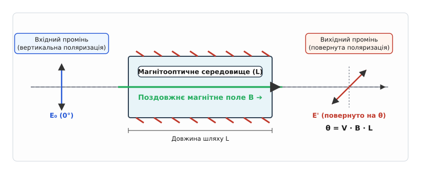
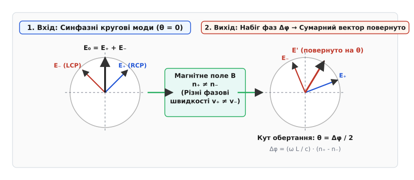
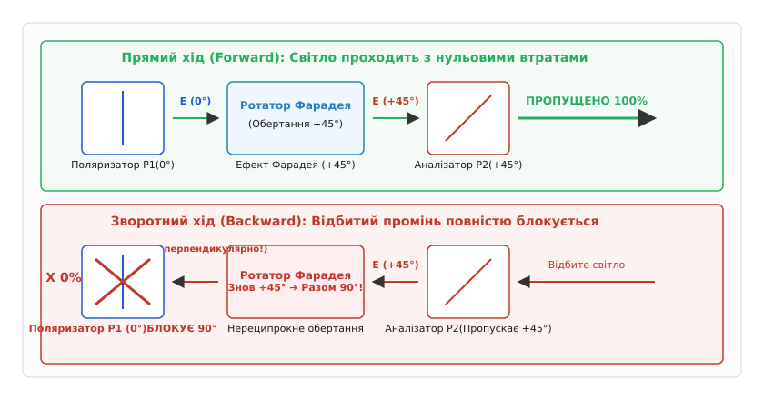

# Фарадеєвське обертання

<preknowlist>
- [Електромагнітна хвиля](book:physics/em-wave) — поперечна хвиля з векторами напруженості електричного й магнітного полів.
- [Магнітне поле](book:physics/magnetic-field) — векторне поле, що діє на рухомі заряди силою Лоренца.
- [Сила Лоренца](book:physics/lorentz-force) — сила, з якою електромагнітне поле діє на рухомий точковий заряд.
</preknowlist>

Коли високопотужний випромінювальний лазер спрямовують на металеву деталь для промислового різання або на оптичну поверхню для обробки, частина світлової енергії неминуче відбивається назад точно вздовж траєкторії вхідного променя. Якщо це відбите випромінювання повертається крізь світловод або об'єктив назад у лазерний резонатор, воно спричиняє руйнівні наслідки: нищить вихідні напівпрозорі дзеркала, викликає хаотичні стрибки частоти генерації, породжує інтенсивний шум та здатне повністю спалити крихкі напівпровідникові лазерні діоди накачки.

Звичайна інженерна спокуса розв'язати цю проблему за допомогою дзеркал, напівпрозорих пластин чи стандартних лінійних поляризаторів виявляється принципово нездійсненною. Причина полягає у симетрії пасивної оптики: будь-яка класична система елементів, яка вільно пропускає світловий промінь уперед, точно так само вільно пропускає його й у зворотному напрямку. Ця властивість називається реципрокністю (обратністю) оптичних шляхів.

Ефективно розірвати це замкнене коло дозволяє **фарадеєвське обертання** (*Faraday rotation*) — явище повороту площини поляризації світла під дією зовнішнього магнітного поля, спрямованого уздовж напрямку поширення променя. Головна таємниця й цінність цього ефекту полягає у його **нереципрокності**: на відміну від природно оптично активних речовин (наприклад, розчину цукру чи кристалів кварцю), магнітооптичне обертання зберігає свій абсолютний напрямок у просторі відносно вектора магнітного поля незалежно від того, у який бік летить світловий промінь — уперед чи назад.


*Схема обертання площини поляризації світла під дією поздовжнього магнітного поля B.*

## Світло як суперпозиція кругових мод та квантовий спін фотонів

Щоб зрозуміти фізичний механізм обертання поляризації, необхідно подивитися на структуру лінійно поляризованого світла не як на просто коливальний відрізок, а як на суперпозицію двох колових компонент. Електричне поле плоскої світлової хвилі, яка летить уздовж осі `z` і коливається вздовж осі `x`, описується вектором `E(z,t) = E₀ · cos(k·z - ω·t)`.

З погляду векторної алгебри, будь-який лінійно поляризований вектор `E₀ · x̂` можна точно подати як суму двох колово поляризованих хвиль (хвиль із круговою поляризацією) однаковою амплітудою, що обертаються у протилежні боки:
- **Правоколово поляризована хвиля (RCP, `E₊`)**: вектор електричного поля обертається за годинниковою стрілкою для спостерігача, який дивиться назустріч променю.
- **Лівоколово поляризована хвиля (LCP, `E₋`)**: вектор електричного поля обертається проти годинникової стрілки з тією самою кутовою частотою `ω`.

З погляду квантової фізики цей розклад має фундаментальний зміст. Фотони — це кванти електромагнітного поля із власним спіновим кутовим моментом, що дорівнює `±ħ` вздовж напрямку поширення. Права колова мода складається з фотонів зі спіновим проекційним числом `+1`, а ліва колова мода — з фотонів зі спіном `-1`. Лінійно поляризована хвиля являє собою квантовий стан із рівноймовірною суперпозицією цих двох спінових станів.


*Розклад лінійної поляризації на дві колово поляризовані моди з різними фазовими швидкостями.*

У звичайному ізотропному середовищі (наприклад, у чистому склі чи воді за відсутності магнітного поля) обидві колові моди поширюються з абсолютно однаковою фазовою швидкістю `v = c / n`. На кожному мікроні шляху один вектор обертається праворуч, а інший — ліворуч на точно такий самий кут. Наслідком є те, що їхня векторна сума у кожен момент часу залишається суворо вертикальною, і початкова площина поляризації не змінюється.

Проте якщо середовище вмістити у магнітне поле, прозорий матеріал набуває властивості **магнітного кругового двозаломлення** (*magnetic circular birefringence*): показник заломлення для правої колової моди `n₊` перестає дорівнювати показникові заломлення для лівої моди `n₋`.

Внаслідок цієї відмінності одна з колових мод починає випереджати іншу за фазою. За час проходження шару речовини товщиною `L` між модами накопичується різниця фазового набігу:

```
Δϕ = ϕ₊ - ϕ₋ = (ω · L / c) · (n₊ - n₋)
```

Коли дві колові моди зі зсунутими фазами додаються на виході з магнітооптичного середовища, їхня математична й фізична сума знову утворює **лінійно поляризовану хвилю**. Проте напрямок плоскої поляризації виявляється повернутим відносно початкового положення на кут `θ`:

```
θ = Δϕ / 2 = (π · L / λ₀) · (n₋ - n₊)
```

де `λ₀` — довжина хвилі світла у вакуумі.

Знак кута обертання показує, яка саме мода поширювалася швидше. Повний строгий математичний вивід перетворення векторів та фазового набігу наведено у вставці 🧮 [Математичний вивід кругового двозаломлення](book:physics/electromagnetism/faraday-rotation/math-dispersion.md).

## Мікроскопічний механізм: сила Лоренца та прецесія електронних орбіт

Звідки виникає ця різниця показників заломлення `n₊` та `n₋` у статичному магнітному полі? Щоб це з'ясувати, необхідно опуститися на рівень взаємодії електромагнітного поля хвилі зі зв'язаними електронами речовини.

Будь-яке прозоре оптичне середовище складається з атомів або іонів, електронні оболонки яких утримуються квазіпружними внутрішньоатомними силами біля положення рівноваги. Коли крізь середовище поширюється світлова хвиля, її змінне електричне поле `E` зміщує електрони з положення рівноваги й розгойдує їх на частоті світла `ω`. Зміщені електрони створюють мікроскопічні дипольні моменти, які перевипромінюють вторинні хвилі. Затримка між первинною хвилею та вторинним випромінюванням диполів і формує уповільнення світла у речовині — тобто макроскопічний показник заломлення `n`.

Якщо до середовища прикласти постійне магнітне поле `B₀`, спрямоване уздовж світлового променя (вздовж осі `z`), на кожен рухомий електрон з боку поля починає додатково діяти [сила Лоренца](book:physics/lorentz-force):

```
F_L = -e · (v × B₀)
```

де `e` — модуль заряду електрона, а `v` — миттєва швидкість його коливального руху під дією електричного поля хвилі.

Розглянемо, як ця додаткова сила змінює рух електрона для двох протилежних колових мод:

1. **Під дією правоколової моди (RCP)** електричне поле повертається за годинниковою стрілкою, примушуючи електрон описувати колове коло в площині `xy`. Вектор швидкості електрона `v` постійно повертається, а сила Лоренца `F_L = -e · (v × B₀)` виявляється спрямованою суворо **до центра** електронної орбіти (для даного напрямку `B₀`). Ця магнітна сила додається до квазіпружної сили атома, штучно роблячи атомний зв'язок «жорсткішим».
2. **Під дією лівоколової моди (LCP)** електрон обертається у протилежний бік (проти годинникової стрілки). Вектор його швидкості `v` спрямований протилежно, тож сила Лоренца `F_L` виявляється спрямованою **від центра** орбіти. Вона протидіє квазіпружній силі атома, штучно роблячи зв'язок «м'якшим».

Оскільки власна резонансна частота коливань електрона `ω₀` визначається жорсткістю зв'язку (`ω₀ = √(k / m_e)`), статичне магнітне поле розщеплює єдину атомну резонансну частоту на дві симетричні компоненти:

```
ω_res_± ≈ ω₀ ± (e · B₀ / (2 · m_e))
```

З погляду класичної механіки це розщеплення відповідає **прецесії Лармора** (*Larmor precession*): орбітальний магнітний момент електрона `μ = -(e / (2·m_e)) · L` прецесує навколо вектора зовнішнього магнітного поля `B₀` з ларморівською частотою `ω_L = e · B₀ / (2 · m_e)`.

Ця прецесія зміщує енергетичні рівні атомних станів (ефект Зеемана). Переходи з випромінюванням або поглинанням фотонів з різною коловою поляризацією відбуваються між зсунутими рівнями (`Δm = +1` для правої моди та `Δm = -1` для лівої).

Через те що резонансна частота атома зміщується в різні боки для правої та лівої колових хвиль, робоча оптична частота світла `ω` опиняється на різній відстані від резонансу для кожної з мод. А оскільки показник заломлення `n(ω)` пропорційний відстанню до резонансної частоти (явище хроматичної дисперсії), середовище починає заломлювати праву й ліву моди по-різному (`n₊ ≠ n₋`).

Різниця показників заломлення `(n₋ - n₊)` виявляється прямо пропорційною величині магнітної індукції `B₀` та похідній показника заломлення за довжиною хвилі `dn/dλ` (формула Беккереля).

Історичні обставини цього видатного відкриття та передісторію експериментів 1845 року висвітлено у вставці 📜 [Історія відкриття магнітооптичного ефекту](book:physics/electromagnetism/faraday-rotation/hist-discovery.md).

## Фундаментальна відмінність: нереципрокність проти природної оптичної активності

Багато прозорих речовин — наприклад, водний розчин цукру, винна кислота або монокристали кварцю — здатні обертати площину поляризації світла взагалі без жодного магнітного поля. Це явище називають **природною оптичною активністю** або **просторовою кіральністю** (*chirality*). На перший погляд, фарадеєвське обертання здається абсолютно ідентичним, проте між ними існує глибока фундаментальна відмінність, яку критично важливо розуміти.

Природна оптична активність зумовлена **асиметрією самої молекулярної структури** — спіральною формою молекул або кристалічної ґратки. Якщо лінійно поляризований промінь проходить крізь кювету з цукровим розчином уперед, його поляризація повертається, наприклад, на кут `+20°` за годинниковою стрілкою для спостерігача, що дивиться назустріч променю.

Якщо на виході з кювети поставити ідеальне плоске дзеркало й спрямувати промінь назад крізь той самий розчин, світло знову рухатиметься крізь ті самі спіральні молекули. Проте оскільки вектор поширення хвилі `k` розвернувся на `180°`, за годинниковою стрілкою відносно нового напрямку поширення обертання знову складе `+20°`. Відносно ж **початкової лабораторної системи координат** це означає обертання на `-20°`. У результаті після подвійного проходу (уперед і назад) сумарний кут обертання дорівнює **нулю** (`+20° - 20° = 0°`). Природна оптична активність є **реципрокною** (*reciprocal*).

```
[Природна кіральність (Розчин цукру)]
Прямий хід:     Вхід (0°) ➔ [Кювета з цукром] ➔ Вихід (+20°)
Зворотний хід:  Відбиття (+20°) ➔ [Кювета з цукром] ➔ Повернення (0°)  [Скасування!]

[Магнітооптика (Ефект Фарадея)]
Прямий хід:     Вхід (0°) ➔ [Кристал у полі B ➔] ➔ Вихід (+20°)
Зворотний хід:  Відбиття (+20°) ➔ [Кристал у полі B ➔] ➔ Повернення (+40°) [Подвоєння!]
```

У магнітооптичному ефекті Фарадея напрямок обертання визначається не внутрішньою симетрією молекул, а **зовнішнім вектором магнітного поля `B₀`**.

Коли промінь летить у напрямку вектора `B₀`, поляризація повертається на кут `+20°` відносно вектора `B₀`. Коли світло відбивається дзеркалом і повертається назад, воно летить проти напрямку поширення хвилі, але **вектор зовнішнього магнітного поля `B₀` у лабораторії залишається спрямованим у той самий бік**!

Тому під час зворотного проходу магнітне поле продовжує повертати вектор поляризації у тому самому абсолютному напрямку в просторі. Після подвійного проходження крізь фарадеєвське середовище кути обертання не скасовуються, а **додаються**:

```
θ_sum = θ_forward + θ_backward = 2 · θ
```

Це явище називають **нереципрокністю** (*non-reciprocity*).

З погляду симетрій фундаментальної фізики, природна оптична активність порушує просторову парність (`P`-симетрію, оскільки дзеркальне відображення змінює праву спіраль молекули на ліву), але зберігає симетрію відносно інверсії часу (`T`-симетрію).

Натомість ефект Фарадея зберігає просторову парність `P` (середовище може бути абсолютно симетричним діелектриком), але **порушує інверсію часу (`T`-симетрію)**. Магнітне поле `B₀` створюється мікроскопічними замкненими струмами; при математичній інверсії часу `t ➔ -t` напрямок усіх струмів і сам вектор `B₀` змінюють знак на протилежний. Саме ця фундаментальна асиметрія відносно часу й забезпечує нереципрокність оптичних пристроїв.

## Закон Верде та класифікація магнітооптичних матеріалів

Кількісно кут фарадеєвського обертання `θ` описується феноменологічним **законом Верде** (*Verdet's law*), розробленим французьким фізиком Емілем Верде у 1854 році:

```
θ = V · B · L
```

де:
- `θ` — кут повороту площини поляризації (в радіанах або кутових мінутах);
- `B` — індукція поздовжнього магнітного поля всередині речовини (у теслах, Тл);
- `L` — довжина шляху, який світло проходить у магнітооптичному середовищі (у метрах, м);
- `V` — **стала Верде** (*Verdet constant*), фундаментальний коефіцієнт пропорційності, який є характеристикою матеріалу для даної довжини хвилі світла та температури.

Стала Верде вимірюється в одиницях `рад / (Т·м)` або `кутових мінут / (Е·см)`. Вона суттєво залежить від довжини хвилі випромінювання `λ` (збільшуючись у короткохвильовому спектрі пропорційно `1/λ²`) та від температури.

За фізичним походженням ефекту та магнітними властивостями всі оптичні речовини поділяють на три основні класи:

### 1. Діамагнітні середовища
До них належать звичайне силікатне скло, важке свинцеве скло (TF-3), плавдений кварц, вода, спирт та більшість органічних рідин. У діамагнетиках обертання зумовлене суто класичною силою Лоренца, яка діє на електрони замкнених електронних оболонок.
- Стала Верде додатна (`V > 0`), мала за величиною (для звичайного скла при `633 нм` `V ≈ +20 рад/(Т·м)`).
- Майже не залежить від температури.

### 2. Парамагнітні середовища
Це оптичні матеріали, збагачені іонами рідкісноземельних елементів із незаповненими f-електронними оболонками (наприклад, `Tb³⁺`, `Dy³⁺`, `Ce³⁺`). Найвідоміший представник — монокристал **тербій-галієвого гранату** (TGG, `Tb₃Ga₅O₁₂`) та тербієве скло.
- Стала Верде від'ємна (`V < 0`) і за модулем у 5–10 разів більша, ніж у діамагнетиків (для TGG при `633 нм` `V ≈ -134 рад/(Т·м)`).
- Обертання сильно залежить від температури (зменшується за законом Кюрі `V ∝ 1/T` при нагріванні), оскільки хаотичний тепловий рух руйнує впорядкування парамагнітних спинів.

### 3. Ферромагнітні та ферримагнітні середовища
До них належать монокристали **ітрій-залізистого гранату** (YIG, `Y₃Fe₅O₁₂`) та епітаксійні плівки ферритів-гранатів.
- У таких матеріалах обертання Фарадея пропорційне не зовнішньому полю `B`, а **внутрішній спонтанній намагніченості кристала `M`**.
- Вони володіють гігантською питомою обертальною здатністю (тисячі градусів на сантиметр товщини), що дозволяє створювати пластинки товщиною в десятки мікрометрів, які насичуються у слабких магнітних полях (`~0.1 Тл`).
- Вони прозорі у інфрачервоному діапазоні (`1.3 – 1.6 мкм`), що робить їх стандартом для волоконно-оптичних ліній зв'язку.

Повний збірник числових констант, таблиці сталої Верде на лазерних довжинах хвиль та технічні специфікації матеріалів наведено у вставці 📋 [Параметри магнітооптичних матеріалів](book:physics/electromagnetism/faraday-rotation/api-magneto-optical-materials.md).

## Оптичний ізолятор: пристрій, що перекриває зворотний шлях

Найважливішим практичним застосуванням нереципрокного обертання Фарадея у лазерній фізиці є **оптичний ізолятор** (*optical isolator*) — пристрій, який пропускає світло в одному напрямку й повністю затримує його у протилежному.


*Нереципрокне проходження світла крізь оптичний ізолятор: прямий хід без втрат та повне блокування відбитого випромінювання.*

Класичний однокаскадний поляризаційно-залежний оптичний ізолятор складається з трьох елементів:
1. **Вхідний лінійний поляризатор ($P_1$)**, налаштований на вертикальну поляризацію (`0°`).
2. **Ротатор Фарадея**, який складається з магнітооптичного кристала (наприклад, TGG) у постійному магнітному полі кільцевого магніта NdFeB. Довжина кристала й поле дібрані так, щоб кут обертання складавав суворо `θ = +45°`.
3. **Вихідний поляризатор-аналізатор ($P_2$)**, ось пропускання якого повернута на `+45°` відносно вхідного поляризатора.

Простежимо детальний шлях світлового променя у двох напрямках:

### Прямий хід (Forward direction):
- Світловий промінь від лазера проходить крізь вхідний поляризатор $P_1$ і набуває вертикальної поляризації (`0°`).
- Проходячи крізь ротатор Фарадея, площина поляризації повертається на `+45°`.
- На виході з ротатора світло має поляризацію `45°`, яка точно збігається з віссю пропускання вихідного аналізатора $P_2$.
- Світло проходить крізь аналізатор $P_2$ із майже **нульовими втратами** (втрати на вставку `Insertion Loss < 0.2 дБ`).

### Зворотний хід (Backward direction):
- Відбите від мішені світло повертається до вихідного поляризатора $P_2$. Крізь нього проходить лише компонент з поляризацією `45°`.
- Повертаючись крізь ротатор Фарадея у зворотному напрямку, світло зазнає обертання ще на `+45°` у **тому самому кутовому напрямку відносно магнітного поля**!
- На виході з ротатора (біля вхідного поляризатора) вектор поляризації світла опиняється під кутом `45° + 45° = 90°` (горизонтальна поляризація).
- Вхідний поляризатор $P_1$, орієнтований під кутом `0°` (вертикально), виявляється **перпендикулярним** до вектора поляризації зворотної хвилі й **повністю поглинає або відхиляє відбитий промінь**!

### Поляризаційно-незалежні ізолятори для оптичного волокна
У волоконно-оптичних лініях зв'язку поляризація світла на виході з довгого волокна є хаотичною та нестабільною (змінюється через вигини та температуру). Тому там застосовують **поляризаційно-незалежні ізолятори** (*polarization-independent isolators*).

У такому пристрої вхідний світловий промінь спочатку розщеплюється двозаломлювальним клином з ісландського шпату або ванадату ітрію (`YVO₄`) на дві просторово рознесені ортогональні моди — звичайний (O) та незвичайний (E) промені.

Далі обидва промені проходять крізь каскад із ротатора Фарадея (обертання `+45°`) та реципрокної півхвильової пластини ($HWP$, обертання `-45°` або `+45°` залежно від напрямку).

У прямому напрямку обертання Фарадея та хвильової пластини взаємно додаються для компенсації кутів, і другий клин `YVO₄` зводить обидва промені назад у серцевину вихідного волокна.

У зворотному напрямку нереципрокний ефект Фарадея призводить до того, що обертання не скасовуються, і другий клин розводить O- та E-промені ще далі в боки, повз вхідне волокно. Рівень згашення зворотного світла у таких волоконних пристроях перевищує `45–55 дБ` незалежно від вхідної поляризації.

Чисельне моделювання оптичного ізолятора методом матриць Джонса та розрахунок його чутливості до температурних деградацій наведено у вставці ⚙️ [Симуляція оптичного ізолятора](book:physics/electromagnetism/faraday-rotation/proj-faraday-rotator.md).

## Магнітооптичний ефект Керра (MOKE) — обертання при відбитті

Окрім проходження світла крізь прозорі середовища (ефект Фарадея), існує споріднений ефект — **магнітооптичний ефект Керра** (*Magneto-Optical Kerr Effect*, MOKE), який спостерігається при **відбитті** лінійно поляризованого світла від поверхні намагніченого металу чи напівпровідника (наприклад, полірованого заліза або епітаксійних феромагнітних плівок).

При відбитті від намагніченого середовища сила Лоренца, що діє на електрони поверхневого шару, викликає появу малої ортогональної компоненти електричного поля. Внаслідок цього відбите світло не лише змінює кут поляризації (повертається на кут Керра `θ_K`), але й набуває невеликої еліптичності `e_K`.

Залежно від орієнтації вектора намагніченості `M` відносно плоскої поверхні та площини падіння світла, розрізняють три конфігурації ефекту Керра:
1. **Полярний ефект Керра (Polar MOKE)**: вектор намагніченості `M` перпендикулярний до поверхні зразка. Дає найбільший кут обертання при нормальному падінні світла.
2. **Меридіональний ефект Керра (Longitudinal MOKE)**: вектор намагніченості `M` паралельний поверхні зразка та лежить у площині падіння світла.
3. **Екваторіальний ефект Керра (Transverse MOKE)**: вектор намагніченості `M` паралельний поверхні, але перпендикулярний до площини падіння. Змінює не кут поляризації, а коефіцієнт відбиття світла `R` для `p`-поляризованої хвилі.

Ефект Керра є основним безконтактним інструментом у фізиці конденсованого стану та спінтроніці. Він дозволяє візуалізувати структуру магнітних доменів у мікроскопах із поляризованим світлом, міряти коерцитивну силу нанорозмірних магнітних плівок та читати інформацію з магнітооптичних носіїв запису.

## Магнітооптичні циркулятори та фотонні інтегральні схеми

Окрім двопортових ізоляторів, на основі нереципрокного обертання Фарадея будують **оптичні циркулятори** (*optical circulators*) — багатопортові нереципрокні оптичні пристрої, які спрямовують світловий сигнал за циклічним маршрутом: із порту 1 у порт 2, із порту 2 у порт 3, із порту 3 у порт 4, але ніколи у зворотному напрямку.

У волоконно-оптичних мережах зв'язку з дуплексним ущільненням (WDM) оптичний циркулятор дозволяє використовувати одне й те саме оптичне волокно для одночасного передавання й приймання світлових сигналів на одній довжині хвилі. Сигнал від передавача з порту 1 входить у магістральне волокно (порт 2), а зустрічний сигнал із магістрального волокна (входить у порт 2) не потрапляє у передавач, а перенаправляється в оптичний приймач (порт 3).

Сучасна фотоніка розвиває напрямок **нанофотонних інтегральних схем** (*photonic integrated circuits*, PIC). Інтеграція магнітооптичних ізоляторів на кремнієвих чипних оптичних хвилеводах є однією з найскладніших задач мікроелектроніки, оскільки кремній володіє кубічною симетрією і не має власних магнітооптичних властивостей.

Для створення наноізоляторів на кремнієві хвилеводи методом прямим вакуумним нанесенням або бондингом інтегрують тонесенькі плівки церитованого ітрій-залізистого гранату (`Ce:YIG`). Нереципрокний зсув фази у таких плівкових хвилеводах дозволяє захищати інтегровані на чипі напівпровідникові мікролазери від зворотних відбиттів безпосередньо у кристалічному чипі.

## Вимірювання струмів у енергомережах та космічна діагностика

Окрім лазерної техніки, нереципрокне обертання Фарадея застосовується у вимірювальних технологіях екстремальних масштабів — від надвисоковольтних ліній електропередач до дослідження магнітних полів Галактики.

### 1. Волоконно-оптичні давачі струму (FOCS)
У сучасній електроенергетиці для вимірювання змінних та постійних струмів гігантської сили (десятки й сотні кілоампер) на високовольтних підстанціях (330–750 кВ) класичні вимірювальні трансформатори струму зі сталевими сердечниками стають надзвичайно громіздкими, важкими й вибухонебезпечними через ризик електропробою масляної ізоляції.

Ідеальною альтернативою слугує **волоконно-оптичний давач струму** (*Fiber-Optic Current Sensor*, FOCS). Навколо високовольтного провідника зі струмом `I` намотують декілька витків звичайного або спеціального оптичного волокна.

Згідно з [законом циркуляції Ампера](book:physics/magnetic-field), контурний інтеграл магнітного поля `B` вздовж замкненого волоконного кільця строго дорівнює струму `I`, що протікає всередині кільця:

```
∮ B · dl = μ₀ · I
```

Світло від світлодіодного джерела проганяють крізь волоконну котушку. Проходячи витки навколо провідника, площина поляризації світла повертається на кут:

```
θ = V · ∮ B · dl = V · μ₀ · N · I
```

де `N` — кількість витків волокна, а `V` — стала Верде скляної жили оптичного волокна.

Оскільки волокно виготовлене з діелектричного кварцового скла, давач не має жодного електричного контакту з високою напругою. Він забезпечує абсолютну гальванічну розв'язку, не насичується при коротких замиканнях і вимірює струми до мільйона ампер із точністю вище `0.1%`.

### 2. Астрофізична діагностика міжзоряної плазми та токамаків
Коли радіовипромінювання від далеких пульсарів або квазарів летить крізь міжзоряне середовище Галактики, воно проходить крізь розріджену магнітоактивну плазму (вільні електрони в галактичному магнітному полі).

Слабке міжзоряне магнітне поле (порядку кількох мікрогаусів) викликає фарадеєвське обертання поляризації космічних радіохвиль. Кут обертання на радіочастотах описується формулою:

```
θ = RM · λ²
```

де `RM` — **міра обертання** (*Rotation Measure*), яка прямо пропорційна інтегралу від добутку концентрації електронів `n_e` на поздовжню компоненту магнітного поля `B_||` уздовж усього променю зору від астрономічного об'єкта до Землі:

```
RM = 0.812 · ∫ n_e · B_|| · dl   [рад / м²]
```

Вимірюючи кут поляризації радіосигналу пульсара на декількох сусідніх довжинах хвиль `λ`, астрономи точно визначають міру обертання `RM`. Це єдиний прямий метод, який дозволяє будувати тривимірні карти магнітних полів спіральних рукавів Галактики.

Аналогічним чином у термоядерних реакторах-токамаках (наприклад, ITER) зондувальний інфрачервоний лазерний промінь пропускають крізь високотемпературну шнурову плазму. Вимірювання фарадеєвського обертання дозволяє безконтактно й миттєво будувати профілі внутрішнього полоїдального магнітного поля та густини плазми у реальному часі.

## Квантові й топологічні грані фарадеєвського обертання

На межі сучасної фізики твердого тіла фарадеєвське обертання виходить за межі класичної електродинаміки суцільних середовищ і демонструє квантування. У двовимірному електронному газі (2DEG) у квантуючому магнітному полі при низьких температурах спостерігається **квантовий фарадеєвський ефект** (*quantum Faraday effect*). Кут обертання стає квантованим у одиницях сталої тонкої структури `α ≈ 1/137`.

У тривимірних **топологічних діелектриках** (наприклад, `Bi₂Se₃`, `Bi₂Te₃`) за наявності поверхневої квантової чарівності ефект Фарадея на терагерцових частотах також квантується точними цілочисловими кроками, що прямо пов'язано з топологічним інваріантом квантового ефекту Холла.

Таким чином, ефект, відкритий Майклом Фарадеєм 1845 року на звичайному свинцевому склі, виявився універсальним принципом нереципрокного взаємодії поля й речовини — від побутового лазерного діода й волоконного інтернету до топологічних квантових матеріалів і великомасштабної будови Всесвіту. Фізична краса цього явища полягає у тому, що єдина мікроскопічна сила — сила Лоренца — визначає і нереципрокне обертання поляризації у лабораторному кристалі, і розповсюдження світлових хвиль крізь галактичні простори.

> 🔧 **Навіщо це.**
> Ефект Фарадея — це головний захисний механізм сучасної лазерної інженерії. Без оптичних ізоляторів Фарадея неможливо побудувати ані потужні волоконні лазери для промислового різання металу, ані оптичні підсилювачі EDFA, які прокачують глобальний інтернет-трафік по дну океанів. У вимірювальній техніці обертання Фарадея дозволяє безпечно міряти гігантські струми в енергомережах без прямого електричного контакту, а в астрофізиці — бачити невидимі магнітні поля міжзоряного космосу.
