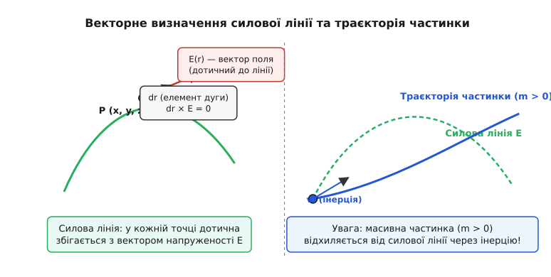
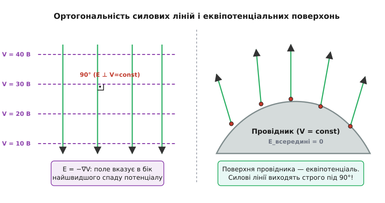
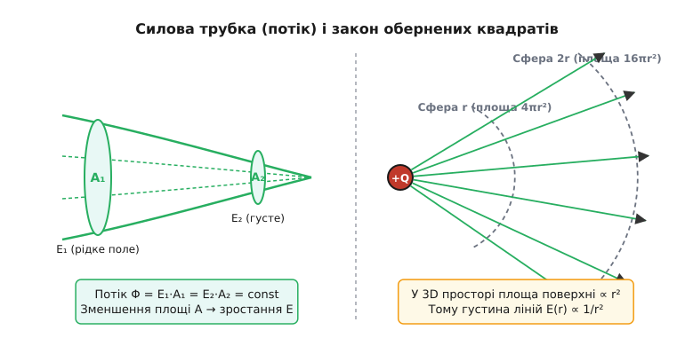
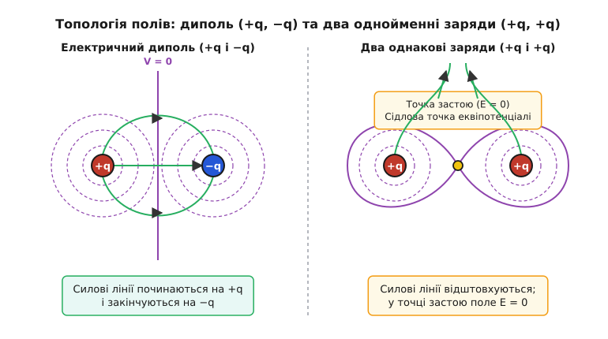
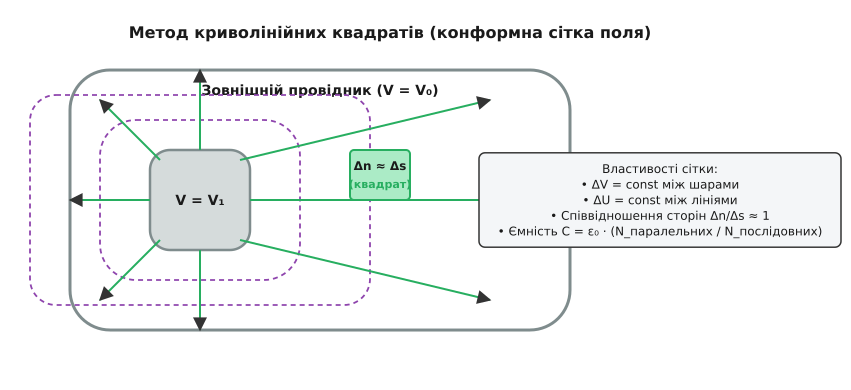
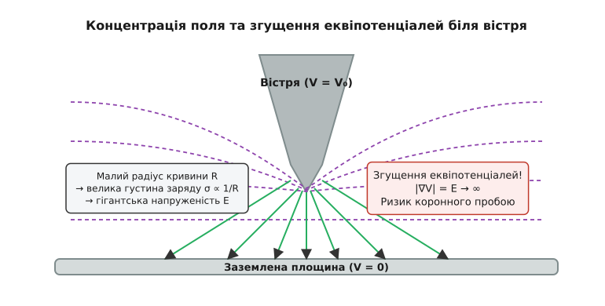

# Геометрія силових ліній і еквіпотенціалей

<preknowlist>
- [Закон Кулона](topic:physics/coulomb-law) — взаємодія точкових електричних зарядів у порожнечі та закон обернених квадратів.
- [Електричне поле](topic:physics/electric-field) — векторний характер напруженості E = F/q та джерельний опис векторного простору.
- [Електричний потенціал](topic:physics/electric-potential) — скалярна енергетична характеристика, V = PE/q та зв'язок з роботою.
- [Консервативне поле](topic:physics/conservative-field) — незалежність роботи від шляху переміщення та потенціальність E = −∇V.
- [Закон Гаусса](topic:physics/gauss-law) — потік вектора напруженості через замкнену поверхню та зв'язок із зарядом.
- [Рівняння Пуассона і Лапласа](topic:physics/poisson-laplace-eq) — диференціальні рівняння для розрахунку розподілу потенціалу.
- [Метод дзеркальних зображень](topic:physics/charge-induction) — метод розрахунку полів біля заземлених провідних поверхонь.
- [Проникність діелектриків](topic:physics/permittivity) — граничні умови для полів на межі двох діелектричних середовищ.
</preknowlist>

При проектуванні високовольтних керамічних ізоляторів для трансформаторних підстанцій на напругу `110` кВ електричний пробій повітря виникає у вузьких зонах, де локальна напруженість електричного поля перевищує межу діелектричної міцності середовища `3` МВ/м. Тривимірний просторовий розподіл силового впливу описується векторною функцією напруженості `E(x, y, z)`, яка містить три скалярні компоненти `(E_x, E_y, E_z)` у кожній точці простору. Аналізувати чисельні масиви з мільйонів векторних значень у кожному вузлі просторової сітки надзвичайно важко для інженерного аналізу. Для розв'язання цієї задачі у фізику було введено просторовий геометричний інструмент — **силові лінії** (векторні лінії напруженості, від латинського *linea* — лляна нитка) та **еквіпотенціальні поверхні** (від грецького *екві* — рівний, та латинського *potentia* — сила, можливість). Разом вони утворюють ортогональну просторову сітку, яка повністю описує силову дію на заряди, накопичену електростатичну енергію та геометрію небезпечних зон діелектричного пробою.

## Векторне рівняння силової лінії та напрямок поля

Силова лінія (лінія напруженості електричного поля) — це неперервна орієнтована крива у просторі, дотична до якої в кожній точці збігається за напрямком із вектором напруженості електричного поля `E`.

З математичної точки зору силова лінія є інтегральною кривою векторного поля `E(r)`. Якщо `dr = (dx, dy, dz)` — орієнтований елемент дуги цієї кривої, то умова колінеарності векторів `dr` та `E` виражається векторним добутком:

```
dr × E = 0
```

У декартових координатах це векторне рівняння розпадається на систему двох незалежних звичайних диференціальних рівнянь першого порядку:

```
dx / E_x(x, y, z) = dy / E_y(x, y, z) = dz / E_z(x, y, z)
```

Ці співвідношення означають, що відношення приростів координат уздовж силової лінії дорівнює відношенню відповідних проєкцій вектора поля. У циліндричних координатах `(r, θ, z)` та сферичних координатах `(r, θ, φ)` диференціальні рівняння силових ліній набувають відповідно виглядів:

```
dr / E_r = (r · dθ) / E_θ = dz / E_z
dr / E_r = (r · dθ) / E_θ = (r · sin(θ) · dφ) / E_φ
```

Для соленоїдальних полів, де дивергенція дорівнює нулю, просторову геометрію силових ліній можна представити як перетин двох родин скалярних поверхонь `α(x, y, z) = C₁` та `β(x, y, z) = C₂`. У цьому випадку векторне поле виражається градієнтним добутком `E = ∇α × ∇β`, а самі силові лінії є лініями перетину цих поверхонь.

Напрямок силової лінії вказують стрілкою: за домовленістю вона збігається з напрямком кулонівської сили `F = q·E`, що діє на пробний **додатний** заряд (`q > 0`).


*Зліва: у кожній точці P вектор напруженості E дотичний до силової лінії (dr × E = 0). Справа: траєкторія масивної частинки (m > 0) з початковою швидкістю v₀ відхиляється від силової лінії через інерцію.*

Важливо усунути поширене непорозуміння щодо зв'язку силових ліній із траєкторіями руху частинок. Силова лінія вказує напрямок **прискорення** `a = (q/m)·E`, яке отримує заряджений об'єкт у цій точці, а не напрямок його швидкості `v`. Якщо заряджена частинка має масу `m > 0` і початкову швидкість `v₀`, спрямовану під кутом до поля, її реальна траєкторія руху **не збігається** з силовою лінією: інерція змушує частинку зноситися вбік від напрямку вектора `E`. 

Рівняння руху частинки у просторі описується другим законом Ньютона:

```
m · (d²r / dt²) = q · E(r)
```

Траєкторія руху `r(t)` повністю збігається з силовою лінією `r(s)` лише у двох виняткових випадках:
1. Частинка стартує зі стану спокою (`v₀ = 0`), а силова лінія є строго прямолінійним відрізком.
2. Рух відбувається у в'язкому середовищі з гігантським тертям (наприклад, рух іонів в електроліті чи щільному газі), де швидкість пропорційна силі (`v = μ·E`, де `μ` — рухливість носіїв), і впливом інерційного доданка `m·a` можна повністю знехтувати.

Історично концепція силових ліній народжувалася не як абстрактна математична формула, а як фізичний образ напружень простору. Детальніше про це викладено в [історії виникнення силових ліній Фарадея та Максвелла](topic:physics/field-line-geometry/hist-faraday-lines.md).

## Еквіпотенціальні поверхні та умова ортогональності

Для опису скалярного потенціального поля вводять геометричне поняття **еквіпотенціальних поверхонь** (на площині — **еквіпотенціальних ліній** чи контурів). Еквіпотенціальна поверхня — це геометричне місце точок, у яких скалярний електричний потенціал `V(x, y, z)` має однаковісіньке постійне значення:

```
V(x, y, z) = C = const
```

Між геометричною структурою еквіпотенціалей та силових ліній існує суворий математичний зв'язок, що випливає з потенційності електростатичного поля (`E = −∇V`).

При переміщенні пробного заряду `q` на елементарний вектор `dr` вздовж еквіпотенціальної поверхні приріст потенціалу дорівнює нулю (`dV = 0`). Елементарна робота `dW` поля над зарядом при такому переміщенні виражається як:

```
dW = q · E · dr = −q · dV = 0
```

Оскільки `q ≠ 0` і у будь-якій регулярній точці поля `|E| ≠ 0`, скалярний добуток векторів дорівнює нулю: `E · dr = 0`. Це означає, що **вектор напруженості електричного поля E у кожній точці є строго перпендикулярним (ортогональним) до еквіпотенціальної поверхні, яка проходить через цю точку**.


*Зліва: силові лінії E перетинають еквіпотенціальні лінії V=const під кутом 90° у напрямку найшвидшого спаду потенціалу. Справа: поверхня металевого провідника є еквіпотенціальною, тому силові лінії виходять з неї строго нормально.*

Геометричний зміст оператора градієнта полягає у тому, що вектор `∇V` вказує напрямок найшвидшого **зростання** скалярної величини `V`, а вектор поля `E = −∇V` вказує напрямок її найшвидшого **спаду**. Силові лінії — це лінії найкрутішого спуску («лінії найбільшого нахилу») на рельєфі потенціалу. Якщо уявити потенціал у вигляді топографічної карти висот, то еквіпотенціалі відіграють роль горизонталей (ізогіпс), а силові лінії — це шляхи, якими стікала б вода під дією тяжіння.

Густина розподілу електростатичної енергії в об'ємі середовища визначається квадратним модулем градієнта потенціалу:

```
w_e = (1 / 2) · ε₀ · ε_r · |E|² = (1 / 2) · ε₀ · ε_r · |∇V|²
```

Там, де еквіпотенціальні поверхні розташовані найближче одна до одної, нормальна похідна `|∂V/∂n|` досягає максимуму, густина енергії `w_e` є найбільшою, і середовище зазнає найбільшого механічного й електричного напруження.

Механічний зміст силових ліній розкривається через **тензор напружень Максвелла**. Уздовж силових ліній діє поздовжній натяг, що дорівнює `P_parallel = (1/2)·ε₀·E²`, який прагне скоротити довжину силової трубки. У перпендикулярному напрямку діє поперечний тиск `P_perp = (1/2)·ε₀·E²`, який розштовхує сусідні силові лінії. Саме ця геометрична картинка механічних напружень пояснює, чому притягуються протилежні заряди (натяг ліній між ними) та відштовхуються однойменні заряди (поперечний тиск між паралельними лініями).

Фундаментальним наслідком ортогональності є поводження полів на межі провідників в електростатиці. Всередині товщі провідника в статичному стані поле відсутнє (`E = 0`), а отже потенціал в усіх внутрішніх точках є однаковим. Поверхня будь-якого провідного тіла утворює єдину еквіпотенціальну поверхню (`V_surf = const`). Звідси випливає непорушне правило електростатики: **силові лінії електричного поля завжди виходять з поверхні провідника або входять у неї строго під прямим кутом (90°)**. Якщо б існувала тангенціальна (дотична) складова поля `E_t ≠ 0`, вільні носії заряду в металі миттєво почали б рухатися вздовж поверхні під дією сили `F_t = q·E_t`, перерозподіляючи поверховий заряд доти, доки тангенціальна складова не знищиться повністю.

## Густина силових ліній, потік і закон обернених квадратів

Силові лінії дають можливість візуалізувати не лише напрямок, а й **модуль** (величину) напруженості поля. Для цього умовляються креслити лінії з певною густиною: кількість ліній, що пронизують одиничну площадку, перпендикулярну до них, вибирають пропорційною величині `|E|`.

Розглянемо сукупність силових ліній, що проходять через замкнений контур. Ця сукупність утворює просторову трубу, яку називають **силовою трубкою** або **трубкою потоку**.


*Зліва: у силовій трубці потік вектора збережується (E₁·A₁ = E₂·A₂), тому звуження трубки означає зростання напруженості. Справа: у 3D просторі площа сфери зростає як 4πr², що викликає спад густини ліній E(r) ∝ 1/r².*

Потік вектора напруженості `Φ` через поперечний переріз силової трубки площею `A` визначається як:

```
Φ = ∫ E · dA
```

У ділянках простору, де відсутні електричні заряди (`ρ = 0`), за [законом Гаусса](topic:physics/gauss-law) дивергенція поля дорівнює нулю (`∇ · E = 0`). За теоремою Остроградського — Гаусса це означає, що силові лінії не можуть виникати або зникати у порожнечі: вони є неперервними. Потік вектора `E` через будь-який поперечний переріз тієї самої силової трубки є постійною величиною (`Φ = const`):

```
E₁ · A₁ = E₂ · A₂  ⇒  E₂ / E₁ = A₁ / A₂
```

Звідси випливає важливий геометричний висновок: **у тих областях простору, де силові лінії зближуються (згущуються), площа трубки A зменшується, а напруженість поля E зростає**. Навпаки, там, де лінії розходяться, поле слабшає.

Якщо в об'ємі присутній об'ємний електричний заряд із густиною `ρ(r) ≠ 0`, потік вектора вздовж силової трубки вже не є постійним. Зміна потоку на елементарному відрізку `ds` силової трубки дорівнює:

```
dΦ / ds = (A / ε₀) · ρ
```

Це рівняння показує геометричний зміст дивергенції `∇ · E`: вона являє собою об'ємну густину джерел або стоків силових ліній.

Цей геометричний підхід надає наочного пояснення закону обернених квадратів для точкового заряду. У тривимірному просторі силові лінії від точкового заряду `Q` рівномірно розходяться в усіх напрямках у формі радіальних променів. Якщо оточити заряд концентричними сферами радіусів `r` та `2r`, то площа поверхні сфери зростає пропорційно квадрату радіуса:

```
A(r) = 4 · π · r²
```

Оскільки загальна кількість силових ліній `N`, що пронизують сферичну поверхню, є постійною (дорівнює `Q / ε₀`), густина ліній (кількість ліній на одиницю площі) обернено пропорційна площі сфери:

```
E(r) = N / A(r) = Q / (4 · π · ε₀ · r²)
```

Таким чином, фундаментальний закон Кулона `E ∝ 1/r²` є безпосереднім наслідком **тривимірності нашого простору** та геометричного збереження силових ліній. Якби наш простір був двовимірним (планарним), площа «сфери» (довжина кола) зростала б як `2πr`, і поле спадало б повільніше — як `1/r`. У `n`-вимірному просторі поверхня гіперсфери зростає як `r^(n−1)`, тому закон спаду поля описувався б формулою `E(r) ∝ 1 / r^(n−1)`.

## Геометрія полів у мультипольних системах та метод зображень

При віддаленні від складної системи зарядів геометрія силових ліній описується мультипольним розкладом потенціалу у ряд за сферичними гармоніками:

1. **Монополь (`1/r²`):** якщо сумарний заряд системи `Q_total ≠ 0`, на великих відстанях силові лінії прямують до радіальних променів, точнісінько як у точкового заряду.
2. **Диполь (`1/r³`):** якщо `Q_total = 0`, але дипольний момент `p = q·d ≠ 0`, поле спадає швидше. Силові лінії виходять із додатного полюса й замикаються на від'ємному у формі витягнутих опетель. Рівняння силових ліній диполя у сферичних координатах має вид `r = C · sin²(θ)`. Еквіпотенціалі утворюють дві системи дотичних сфер з рівнянням `r = C' · cos(θ)`.
3. **Квадруполь (`1/r⁴`):** система чотирьох зарядів утворює розитку із 4 пелюсток силових ліній та 4 нейтральними сідловими лініями.
4. **Октуполь (`1/r⁵`):** просторова конфігурація з 8 пелюстками силових ліній, розділеними складними вузловими поверхнями.

Геометрія еквіпотенціальних поверхонь дає також фізичне обґрунтування **методу дзеркальних зображень**. Розглянемо точковий заряд `+q`, розташований на відстані `d` від нескінченної заземленої металевої площини (`V = 0`). Оскільки площина є еквіпотенціальною поверхнею, картина полів у півпросторі над металом є повністю тотожною картині полів для реального диполя, утвореного зарядом `+q` та його уявним дзеркальним зображенням `−q`, розташованим симетрично під площиною. Усі силові лінії виходять із заряду `+q` та впираються у металеву площину під прямим кутом `90°`, наводячи на ній поверховий заряд:

```
σ(r) = −q · d / (2 · π · (r² + d²)^(3/2))
```

Для заземленої провідної сфери радіуса `R` та заряду `q` на відстані `d` від її центра метод дзеркальних зображень будується за допомогою інверсії у сфері. Уявний заряд-зображення `q' = −q · (R / d)` розміщується всередині сфери на відстані `d' = R² / d` від її центра. Така конфігурація гарантує, що сферична поверхня `r = R` залишається строго еквіпотенціальною з потенціалом `V = 0`.

Для довгого паралельного провідного циліндра радіуса `R`, паралельного зарядженій нитці з погонним зарядом `q_L` на відстані `d`, заряд-зображення `-q_L` розташовується на інверсній відстані `d' = R² / d`. Еквіпотенціальні поверхні системи утворюють родин апполонієвих кіл, перетин яких із паралельними силовими колами формує конформну сітку поля.

## Заломлення силових ліній на межі двох діелектриків

Коли силові лінії переходять із одного діелектричного середовища з проникністю `ε₁` в інше середовище з проникністю `ε₂`, геометрія поля зазнає зламу (заломлення).

З фундаментальних рівнянь електростатики випливають граничні умови для векторів `E` та `D = ε·E`:
- Тангенціальна складова напруженості поля є неперервною: `E_{1t} = E_{2t}`.
- Нормальна складова електричного зсуву за відсутності вільних поверхових зарядів є неперервною: `D_{1n} = D_{2n} ⇒ ε₁ · E_{1n} = ε₂ · E_{2n}`.

Позначимо кути між силовими лініями та нормаллю до межі розділу як `θ₁` та `θ₂`. Оскільки `tan(θ) = E_t / E_n`, розділивши вирази один на одного, отримуємо **закон заломлення силових ліній електричного поля**:

```
tan(θ₁) / tan(θ₂) = ε₁ / ε₂
```

Цей геометричний закон заломлення означає: **при переході силових ліній із середовища з меншою діелектричною проникністю ε₁ у середовище з більшою проникністю ε₂ lines відхиляються від нормалі, згущуючись у більш густому діелектрику**. 

Фізичний механізм цього викривлення полягає у виникненні зв'язаних поляризаційних зарядів на межі розділу середовищ з поверховою густиною:

```
σ_p = P_{1n} − P_{2n} = ε₀ · (ε₁ − ε₂) · E_{1n} / ε₂
```

Ці зв'язані заряди створюють власне додаткове поле, яке заломлює вектори `E`. У граничному випадку, коли одне з середовищ має дуже високу проникність (`ε₂ >> ε₁`, як у металу чи кераміки з високим `ε`), кут `θ₂` прямує до `90°`, тобто всередині високодіелектричного тіла силові лінії йдуть практично паралельно межі, а в біднішому середовищі входять під кутом близько `90°`. Діелектрик із високим значенням `ε` ніби «всмоктує» в себе силові лінії електричного поля, концентруючи потік вектора всередині свого об'єму.

Аналогічний геометричний закон діє й для силових ліній магнітного поля `B` на межі двох магнетиків з відносними магнітними проникностями `μ₁` та `μ₂`:

```
tan(θ₁) / tan(θ₂) = μ₁ / μ₂
```

Оскільки феромагнітні матеріали (сталь, пермалой, ферити) мають велетенську магнітну проникність (`μ₂ >> 1000`), магнітні силові лінії майже під прямим кутом `90°` вхідять у феромагнетик із повітря (`μ₁ ≈ 1`) і рухаються всередині сердечника уздовж його замкненого контуру. Це явище магнітного локалізування є основою розрахунку магнітних кіл трансформаторів, дроселів та екранів магнітного захисту.

## Топологічні правила та особливі точки поля

Геометрична структура ліній електростатичного поля підпорядковується чотирьом твердим топологічним правилам:

1. **Джерела та стоки:** силові лінії починаються на додатних електричних зарядах (або переходять із нескінченності) і закінчуються на від'ємних зарядах (або йдуть на нескінченність).
2. **Заборона замкнених ліній в електростатиці:** лінії стаціонарного електричного поля **ніколи не утворюють замкнених петель**. Якби силова лінія була замкненою, робота поля з переміщення заряду вздовж цієї лінії була б додатною (`W = ∮ q·E·dr > 0`), що суперечило б потенціальності поля (`∮ E·dr = 0`). 
3. **Неперетин ліній:** дві силові лінії однієї й тієї ж системи зарядів **ніколи не перетинаються** в точках, де `|E| ≠ 0`. Якби вони перетиналися, вектор поля в точці перетину мав би два різні напрямки одночасно, що математично неможливо для однозначного векторного поля.
4. **Існування нейтральних точок:** перетин або дотик еквіпотенціальних поверхонь можливий лише в особливих (критичних) точках, де модуль напруженості поля точно дорівнює нулю (`E = 0`). У таких точках напрямок поля не визначений.

Зверніть увагу на принципове порівняння між електростатичним полем `E` та магнітним полем `B`. Для магнітного поля [закон Гаусса для магнетизму](topic:physics/gauss-law) стверджує `∇ · B = 0` (відсутність магнітних монополів). Тому лінії магнітного поля **завжди замкнені** або прямують з нескінченності в нескінченність, не маючи ні джерел, ні стоків. Для загального магнітного поля не існує глобального скалярного потенціалу, а еквіпотенціалі не утворюють замкнених поверхонь.


*Зліва: поля диполя з неперервними лініями від +q до -q та площиною V=0. Справа: система двох однойменних зарядів із нейтральною точкою застою (E = 0) у центрі, де еквіпотенціаль самоперетинається у формі сідла.*

Розглянемо топологічні відмінності на прикладі двох класичних конфігурацій:

- **Електричний диполь (+q та −q):** силові лінії дугами виходять із додатного заряду та входять у від'ємний. Еквіпотенціальні поверхні навколо кожного заряду наближаються до сфер, а в серединній площині утворюють плоскість нульового потенціалу `V = 0`.
- **Два однакові додатні заряди (+q та +q):** силові лінії відштовхуються одна від одної й ідуть на нескінченність. У точній середині між зарядами виникає **особлива точка застою** (нейтральна точка), де вектори полів від обох зарядів повністю компенсуються (`E_net = 0`). Еквіпотенціальна поверхня, що проходить через цю точку, має форму «вісімки» (лемніскати у перерізі) та перетинає саму себе під кутом `90°`.

Аналіз матриці Гессе `H_{ij} = ∂²V / ∂x_i ∂x_j` скалярного потенціалу в нейтральній точці пояснює її математичну природу. Оскільки рівняння Лапласа вимагає `Trace(H) = ∇²V = 0`, сума власних значень матриці Гессе дорівнює нулю. Звідси випливає, що власні значення мають протилежні знаки (`λ₁ = −λ₂`). Це означає, що **будь-яка нейтральна точка у вакуумній електростатиці є строго сідловою точкою**. Потенціальний рельєф уздовж осі між однойменними зарядами має локальний мінімум, а у перпендикулярі — локальний максимум. 

З цієї топологічної властивості сідлових точок безпосередньо випливає **теорема Ірншоу**: стійка рівновага заряду у статичному електростатичному полі у порожнечі є фізично неможливою, оскільки потенціал не може мати локальних абсолютних мінімумів чи максимумів у порожнечі.

## Двовимірні гармонічні поля та криволінійні квадрати

У багатьох практичних інженерних задачах (кабелі, доріжки друкованих плат, електроди поздовжньої форми) поле можна вважати двовимірним (`∂ / ∂z = 0`). У цьому випадку для розрахунку та побудови полів застосовують потужний апарат теорії функцій комплексної змінної.

Двовимірний потенціал `V(x, y)` задовольняє рівняння Лапласа `∇²V = 0`. Разом із дуальною силовою функцією `U(x, y)` вони утворюють аналітичну функцію **комплексного потенціалу** `W(z) = V(x, y) + i·U(x, y)`. Повний математичний вивід та доведення умов Коші — Рімана наведено в [математичній вставці про конформні сітки](topic:physics/field-line-geometry/math-conformal-grid.md).


*Конформна сітка поля між внутрішнім та зовнішнім провідниками. Осередки сітки утворюють криволінійні квадрати зі співвідношенням сторін Δn/Δs ≈ 1.*

Для візуального розрахунку полів використовують **метод криволінійних квадратів**. Якщо вибрати крок квантування потенціалу між сусідніми еквіпотенціалями `ΔV = const` та крок між силовими лініями `ΔU = const` однаковими, то всі осередки сітки, утворені перетином цих ліній під кутом `90°`, будуть криволінійними квадратами із середнім співвідношенням сторін:

```
Δn / Δs ≈ 1
```

Різниця значень силової функції `U₂ − U₁` між двома силовими лініями виражає повний електричний потік на одиницю довжини провідника `Φ'`. Тому кожен силова канал між сусідніми лініями переносить точно однакове значення потоку вектора `D`.

Цей метод дозволяє інженеру оцінити погонну ємність `C'` (у Ф/м) між двома провідниками довільної складної форми шляхом простого підрахунку осередків графічної сітки:

```
C' = ε₀ · ε_r · (N_parallel / N_series)
```

де `N_parallel` — кількість паралельних силових каналів, а `N_series` — кількість послідовних еквіпотенціальних шарів між електродами.

Для слабопровідних середовищ із питомим опором `ρ` той самий метод дає погонний опір витоку ізоляції:

```
R' = ρ · (N_series / N_parallel)
```

## Концентрація поля на вістрях і крайові ефекти

Одним із найважливіших практичних застосувань геометрії силових ліній є аналіз розподілу полів біля поверхонь із різною кривиною.

Розглянемо модельну задачу: дві провідні сфери радіусів `R₁` та `R₂` (`R₁ << R₂`), з'єднані довгим тонким дротом. Оскільки сфери з'єднані провідником, їхні потенціали однакові (`V₁ = V₂ = V₀`).

```
V₁ = k · Q₁ / R₁
V₂ = k · Q₂ / R₂
```

З рівності потенціалів випливає, що заряди на сферах розподіляються пропорційно їхнім радіусам:

```
Q₁ / Q₂ = R₁ / R₂
```

Обчислимо поверхову густину заряду `σ = Q / (4·π·R²)` на кожній сфері:

```
σ₁ / σ₂ = (Q₁ / R₁²) / (Q₂ / R₂²) = (Q₁ / Q₂) · (R₂² / R₁²) = R₂ / R₁
```

Поверхова густина заряду обернено пропорційна радіусу сфери. Оскільки напруженість поля біля поверхні провідника дорівнює `E = σ / ε₀`, напруженість поля виявляється обернено пропорційною радіусу кривини поверхні:

```
E₁ / E₂ = R₂ / R₁
```


*Біля загостреного електрода з малим радіусом кривини R еквіпотенціалі сильно згущуються (великий градієнт |∇V|), а силові лінії зближуються, що створює гігантську напруженість E і локальний пробій.*

Звідси випливає фундаментальний геометричний ефект: **чим менший радіус кривини поверхні провідника (чим гостріше край або вістря), тим вища поверхова густина заряду і тим більша напруженість електричного поля біля нього**.

Електростатичний тиск `P_e` (сила на одиницю площі поверхні провідника), що діє на метал, виражається квадратичною залежністю від поля:

```
P_e = (1 / 2) · ε₀ · E² = σ² / (2 · ε₀)
```

Біля вістря цей тиск сягає високих значень, розтягуючи матеріал та іонізуючи навколишній газ.

На картині силових ліній та еквіпотенціалей це явище проявляється у вигляді різкого **згущення еквіпотенціальних поверхонь** біля вістря. Оскільки відстань `Δn` між сусідніми еквіпотенціалями біля гострого виступу прямує до нуля, градієнт потенціалу `E = ΔV / Δn` зростає до велетенських значень. Силові лінії біля вістря сходяться у пучок високої густини.

Якщо напруженість поля біля вістря перевищує поріг іонізації повітря (`3` МВ/м), виникає [коронний розряд](topic:physics/corona-discharge). Електрони зриваються з молекул газу, повітря починає світитися й проводити струм, виникає «іонний вітер».

Для усунення локального згущення силових ліній на краях високовольтних електродів застосовують спеціально розраховані **електроди Роговського**. Їхній профіль описується еквіпотенціальною лінією системи «площина — напівбесконечна пластина»:

```
x = A · (φ + e^φ · cos(ψ))
y = A · (ψ + e^φ · sin(ψ))
```

При виборі значення `ψ = π/2` напруженість поля вздовж всієї плавної поверхні електрода Роговського залишається строго постійною без жодного локального піку, що запобігає крайовому пробою в конденсаторах та високовольтних вимикачах.

Цей ефект має два боки в інженерії:
- **Корисне застосування:** у громовідводах (блискавковідводах) вістря свідомо роблять гострим, щоб концентрувати поле, іонізувати повітря та провокувати розряд блискавки саме у заземлену голку, а не в будівлю.
- **Шкідливий ефект:** у високовольтній техніці (трансформатори, вимикачі, лінії ЛЕП) будь-які гострі кути та заусенці на металевих деталях призводять до витікання заряду та пробою. Щоб запобігти цьому, краї металевих деталей детально закруглюють, застосовують захисні екранні кільця великого радіуса та електроди Роговського.

## Чисельне моделювання та трасування силових ліній

У сучасній інженерній практиці аналітичний розрахунок полів можливий лише для найпростіших геометрій. Для систем довільної форми застосовують чисельне розв'язання рівнянь Пуассона або Лапласа (метод скінченних елементів, FEM) із подальшим алгоритмічним трасуванням полів.

Трасування силових ліній зводиться до розв'язання задачі Коші для системи диференціальних рівнянь методом Рунге — Кутти 4-го порядку (RK4). Алгоритм починається з випромінювання масиву променів із точок поблизу позитивних зарядів і крокування за напрямком нормованого вектора `E / |E|`. Побудова еквіпотенціалей здійснюється алгоритмами ізоконтурингу (наприклад, *marching squares*).

Повний програмний код реалізації трасера силових ліній мовами Python та C++ із графіками й обробкою винятків наведено у [проєктній вставці про алгоритми трасування](topic:physics/field-line-geometry/proj-field-tracer.md).

> 🔧 **Навіщо це.** Геометрія силових ліній і еквіпотенціалей — це не просто графічний інструмент, а **основа інженерного проектування електростатичного захисту та високовольтної ізоляції**. У друкованих платах (PCB) знання геометричного розподілу полів дозволяє розраховувати перехресні наводки між доріжками, проектувати диференціальні лінії передачі відповідно до інженерних стандартів зазорів (IPC-2221) та правильно розташовувати захисні земляні кільця (*guard rings*). У високовольтних вимикачах із елегазовою ізоляцією (SF6) і трансформаторах профілювання поверхонь за еквіпотенціалями запобігає дуговим пробоям, зберігаючи обладнання вартістю в мільйони доларів.
