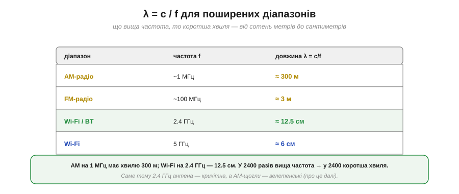
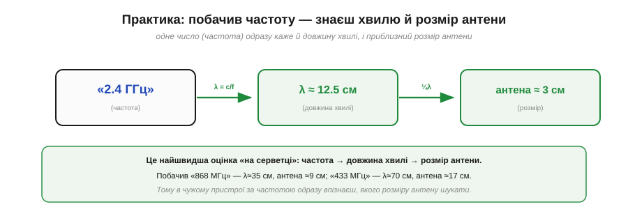

# Частота й довжина хвилі (c = λ·f)

Уся практична робота з радіо крутиться навколо **частоти**: 2.4 ГГц, 5 ГГц, 868 МГц, 433 МГц. Та частота тісно пов'язана з другою величиною — **довжиною хвилі**, — і саме їхня пара визначає геть усе: розмір антени, дальність, проникність крізь стіни. Зв'язує їх одна-єдина проста формула, з якої випливає дивовижно багато наслідків. Розберімо її — і навчімося за однією частотою миттєво «бачити» решту.

### Дві мірки однієї хвилі

Почнімо з того, що частота й довжина хвилі — це **дві мірки** одного й того самого явища, тільки з різних боків. **Частота** (*frequency*, f, у герцах) каже, скільки разів за секунду поле хитається — це погляд **у часі**. **Довжина хвилі** (*wavelength*, λ, у метрах) каже, яку відстань займає одне коливання в просторі — це погляд **у просторі**.


*Рис. Ліворуч — погляд **у часі**: стоїмо в одній точці й рахуємо, скільки коливань пройде за секунду; це частота f (Гц). Праворуч — погляд **у просторі**: «фотографуємо» хвилю й міряємо довжину одного коливання; це довжина хвилі λ (м). Одна хвиля — дві мірки.*

Уяви хвилі на воді. Сидиш на пірсі й рахуєш, скільки гребенів проходить повз за секунду — це **частота**. А якщо глянути на воду згори й поміряти відстань між сусідніми гребенями — це **довжина хвилі**. Те саме з радіо: f — як швидко хитається в часі, λ — який «крок» хвилі у просторі. І ці дві мірки не незалежні — їх пов'язує швидкість.

### Зв'язок: c = λ·f

Логіка проста. За одне коливання хвиля проходить рівно одну довжину λ. Якщо за секунду таких коливань f, то за секунду хвиля долає λ·f метрів — а це і є її **швидкість**. Для електромагнітної хвилі швидкість — це швидкість світла c. Звідси фундаментальна формула:


*Рис. c = λ · f: швидкість світла = довжина хвилі × частота. Оскільки c — **стала** (≈3×10⁸ м/с), частота й довжина хвилі обернено пропорційні: підняв частоту — вкоротив хвилю, і навпаки. Тому, знаючи одне, одразу знаєш інше: λ = c / f.*

```
c = λ · f          (швидкість світла = довжина хвилі × частота)
λ = c / f          (звідси довжина хвилі)
c ≈ 3 × 10⁸ м/с    (стала для вакууму)
```

Найважливіший наслідок — у тому, що **c стала**. Раз добуток λ·f завжди дорівнює одному й тому самому числу, то λ і f **обернено пропорційні**: що вища частота, то коротша хвиля. Це не випадковість, а жорсткий закон, з якого випливає вся подальша практика.

### λ = c/f для поширених діапазонів

Підставмо реальні частоти й відчуймо масштаб.


*Рис. AM-радіо (~1 МГц) → хвиля ≈300 м. FM (~100 МГц) → ≈3 м. Wi-Fi і Bluetooth (2.4 ГГц) → ≈12.5 см. Wi-Fi 5 ГГц → ≈6 см. Що вища частота, то коротша хвиля — від сотень метрів до сантиметрів.*

**Приклад (порахуймо довжини хвиль).** Застосуймо λ = c/f:

```
Wi-Fi 2.4 ГГц : λ = 3×10⁸ / 2.4×10⁹  = 0.125 м = 12.5 см
FM 100 МГц    : λ = 3×10⁸ / 100×10⁶  = 3 м
AM 1 МГц      : λ = 3×10⁸ / 1×10⁶    = 300 м
```

Відчуй контраст: AM-радіо на 1 МГц має хвилю завдовжки з **футбольне поле** (300 м), а Wi-Fi на 2.4 ГГц — лише з **долоню** (12.5 см). Частота вища у 2400 разів — і хвиля рівно у 2400 разів коротша. Саме цей величезний розкид довжин хвиль і пояснює, чому різні діапазони так по-різному поводяться.

### Висока проти низької частоти

Наочно різницю видно, якщо покласти хвилі різної частоти на той самий відрізок простору.


*Рис. На однаковій відстані висока частота вкладає **багато коротких** хвиль, а низька — **мало довгих**. Це пряме відображення оберненої пропорції: більше коливань за секунду означає менший «крок» кожного.*

Це інтуїтивна картинка того самого закону: висока частота — густо посаджені короткі хвильки, низька — рідкі довгі. Запам'ятавши її, легко тримати в голові: «гігагерци — це сантиметри, мегагерци — це метри». А практичне значення цього розкиду найяскравіше видно на **антені**.

### Розмір антени йде за довжиною хвилі

Ось де довжина хвилі стає відчутною на дотик: **розмір антени** прямо пов'язаний із λ. Антену зазвичай роблять часткою довжини хвилі — найчастіше **чверть** хвилі (причина — [резонанс](book:communications/resonance-dipole)).


*Рис. Для 2.4 ГГц (λ≈12.5 см) чвертьхвильова антена — лише ≈3 см: крихітна, влазить у куточок плати. Для AM (λ≈300 м) — це десятки чи сотні метрів: велетенська щогла. Розмір антени йде просто за довжиною хвилі.*

Тепер зрозуміло одне з найпомітніших явищ радіо. Wi-Fi-антена — це маленька доріжка чи чіп на платі (бо чверть від 12.5 см — лише сантиметри). А радіостанція AM-діапазону потребує **щогли на десятки метрів** (бо чверть від 300 м — це 75 метрів). Той самий закон c = λ·f, що дав крихітну Wi-Fi-антену, змушує AM будувати велетенські вежі.

> 🔧 **Навіщо це.** Це пояснює, чому маленькі бездротові пристрої працюють на **високих** частотах (2.4/5 ГГц): тільки там антена достатньо мала, щоб уміститися в гаджет. На низьких частотах антена була б завеликою. І навпаки: якщо бачиш пристрій із довгим «вусом»-антеною, він майже напевно працює на **нижчій** частоті (наприклад, 433 чи 868 МГц), де хвиля довша. Розмір антени — це візуальна підказка про частоту, і навпаки.

### Усе це — один спектр

Зробімо крок назад і побачимо повну картину. Радіохвилі — лише частина величезного **електромагнітного спектра**, де всі хвилі — одне явище, упорядковане за частотою.


*Рис. Електромагнітний спектр від низьких частот до високих: радіо → мікрохвилі → інфрачервоне → видиме світло → ультрафіолет → рентген → гамма. Усе це **та сама** ЕМ-хвиля, лише різної частоти й довжини. Наші Wi-Fi і Bluetooth (2.4–5 ГГц) — у мікрохвильовій ділянці, трохи вище за діапазон мікрохвильової печі.*

Це і є велике [об'єднання Максвелла-Герца](book:physics/em-wave): радіо, тепло від обігрівача, видиме світло, рентген у лікарні — **одне явище**, що різниться лише частотою. Wi-Fi сидить у мікрохвильовій ділянці спектра (звідси й слово «мікрохвилі»), видиме світло — у тисячі разів вище за частотою, рентген — ще вище. Уся інтуїція про світло (відбиття, тіні, проникність) законно переноситься на радіо саме тому, що це сусіди по одному спектру.

### Практика: частота → λ → антена

Зведімо все в найкорисніший практичний навик.


*Рис. Одне число — частота — за двома кроками дає і довжину хвилі (λ = c/f), і приблизний розмір антени (≈¼λ). «2.4 ГГц» → λ≈12.5 см → антена ≈3 см. Швидка оцінка «на серветці».*

> 🔧 **Навіщо це.** Завчи цей ланцюжок: **частота → довжина хвилі → розмір антени**. Побачив у даташиті «868 МГц» — миттєво прикинь: λ = 3×10⁸/868×10⁶ ≈ 35 см, отже антена (чверть хвилі) ≈9 см. «433 МГц» → λ≈70 см → антена ≈17 см. Це не лише задовольняє цікавість: за частотою ти одразу знаєш, **якого розміру** антену шукати в чужому пристрої, чи влізе вона в твій корпус, і чому конкретний модуль має саме такий «вус». Одне число — і вся геометрія радіо стає зрозумілою.

Частоту, довжину хвилі й розмір антени пов'язує одна формула. Та хвиля не лише має довжину — вона ще й **поширюється** в просторі певним чином і має **напрям** коливань. Чому сигнал за рогом слабшає, але не зникає? Чому антени приймача й передавача треба орієнтувати однаково? Це вже питання [поширення й поляризації](book:communications/propagation-polarization).

---
