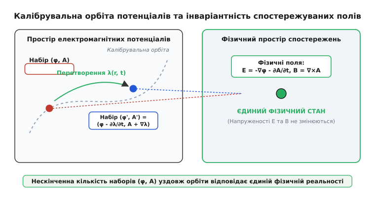
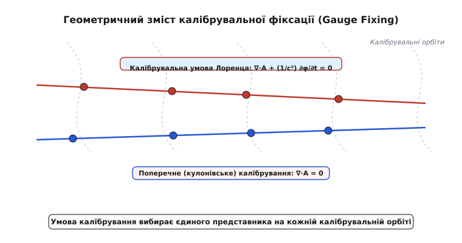
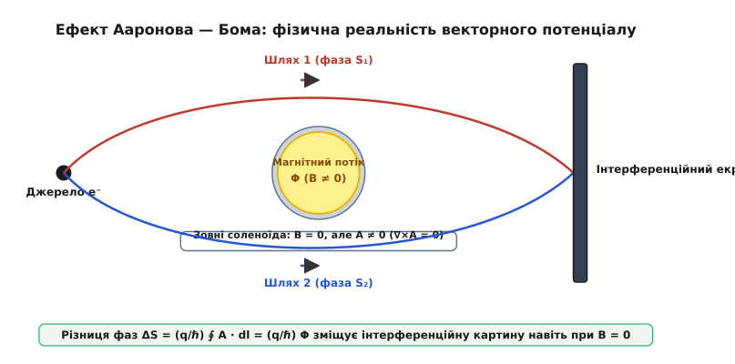
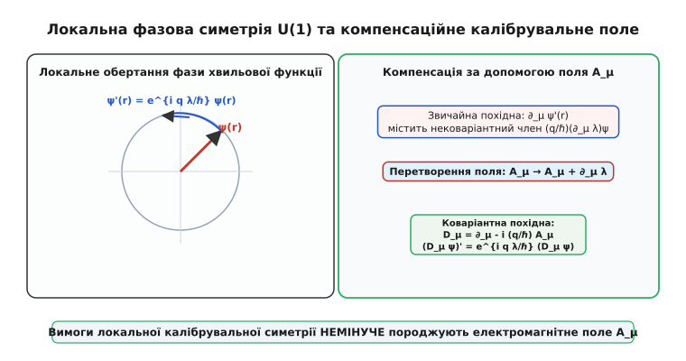

# Калібрувальна симетрія

<preknowlist>
- [Потенціал](book:physics/electric-potential) — скалярне поле φ, що описує потенціальну енергію одиничного заряду.
- [Магнітне поле](book:physics/magnetic-field) — векторний опис індукції B та векторного потенціалу A.
- [Теорема Нетер](book:physics/noether-theorem) — зв'язок між фундаментальними симетріями та законами збереження.
</preknowlist>

Коли електричний заряд рухається у просторі, сила Лоренца, що діє на нього з боку електромагнітного поля, визначається виключно векторними величинами — напруженістю електричного поля `E` та індукцією магнітного поля `B`. Проте спроба записати фундаментальні рівняння руху чи побудувати квантову теорію безпосередньо через `E` та `B` стикається з надзвичайною математичною громіздкістю: поля виявляються зв'язаними між собою складною системою диференціальних рівнянь Максвелла першого порядку. Щоб розчепити ці рівняння й спростити аналіз, у математичний апарат фізики вводять допоміжні об'єкти — скалярний потенціал `φ` та векторний потенціал `A`. Тут виникає дивовижна властивість: існує нескінченна кількість зовсім різних наборів потенціалів `(φ, A)`, які описують абсолютно тотожний стан електричних і магнітних полів у кожній точці простору й часу. Ця фундаментальна вибіркова нечутливість фізичної реальності до зміни математичного опису потенціалів називається калібрувальною симетрією (gauge symmetry).

Калібрувальна симетрія — це не просто зручний математичний трюк для спрощення розв'язання рівнянь. У сучасній теоретичній фізиці вона стала провідним конструктивним принципом побудови всіх фундаментальних взаємодій: від класичної електродинаміки до квантової хромодинаміки, фізики елементарних частинок та теорії струн. Вимога того, щоб закони природи залишалися незмінними при локальних змінах внутрішнього стану частинки, неминуче диктує існування нових фізичних полів, які компенсують ці зміни та переносять взаємодію між тілами.

## 1. Загадка потенціалів: від вимірювання напруги до відносності нуля

Історично концепція потенціалу виникла в небесній механіці й гравітації у працях Жозефа-Луї Лагранжа, П'єра-Симона Лапласа та Сімеона Дені Пуассона як засобу обчислення гравітаційної сили через скалярну функцію. В електростатиці скалярний потенціал `φ` визначили як потенціальну енергію одиничного позитивного заряду. Проте найпростіший експериментальний факт полягає в тому, що жоден фізичний прилад не здатен виміряти абсолютне значення скалярного потенціалу в одній точці.

Будь-який вольтметр завжди приєднують двома щупами між двома різними точками простору, і він вимірює виключно різницю потенціалів — електричну напругу `U = φ₁ - φ₂`. Якщо до потенціалів усіх точок замкненого електричного кола одночасно додати довільне постійне число `C` (наприклад, подати на весь вимірювальний стенд потенціал у сто тисяч вольт відносно Землі), різниця потенціалів `(φ₁ + C) - (φ₂ + C) = φ₁ - φ₂` залишиться абсолютно незмінною. Струм у колі не зміниться ані на мікроампер, і жоден внутрішній процес у приладі не відчує такого масштабного зсуву.

В електростатиці ця свобода виражається у математичній тотожності: градієнт скалярного поля визначений однозначно, тоді як саме скалярне поле визначене з точністю до довільної сталої. Оскільки напруженість електростатичного поля визначається як `E = -∇φ`, додавання постійної `C` не змінює силового поля:

```
E' = -∇(φ + C) = -∇φ - ∇C = -∇φ = E   [інваріантність статичного поля]
```

Базовий нульовий рівень потенціалу на безмежності можна обрати рівним нулю, п'яти або мільйону вольт — сила Кулона між зарядами буде абсолютно однаковою.

Проте у динамічному випадку, коли магнітне поле змінюється з часом, зв'язок полів і потенціалів ускладнюється. Згідно із законом електромагнітної індукції Фарадея, вихрове електричне поле вже не є чисто потенціальним (`∇ × E ≠ 0`), тому напруженість `E` більше не дорівнює простому градієнту скалярного потенціалу. Для повного опису доводять додаткове векторне поле `A`, яке називається векторним потенціалом. Згідно із законом відсутності магнітних монополів (`∇ · B = 0`), магнітна індукція подається як ротор векторного потенціалу:

```
B = ∇ × A                 [означення векторного потенціалу]
```

Завдяки векторному тотожнеству `∇ · (∇ × A) = 0`, це рівняння гарантує відсутність магнітних зарядів для будь-якого векторного поля `A`. Підставляючи `B = ∇ × A` у закон Фарадея `∇ × E + ∂B/∂t = 0`, отримуємо:

```
∇ × (E + ∂A/∂t) = 0       [безвихровий характер комбінованого поля]
```

Оскільки ротор комбінованого поля `E + ∂A/∂t` дорівнює нулю, за теоремою Гельмгольца його можна подати як градієнт скалярного потенціалу `-∇φ`. Звідси випливає повне вираження електричного поля через обоє потенціалів:

```
E = -∇φ - ∂A/∂t           [загальне вираження електричного поля]
```

Зміна векторного потенціалу з часом `∂A/∂t` прямо впливає на електричне поле `E`. На перший погляд здається, що тепер потенціали `φ` та `A` жорстко зафіксовані й більше не мають жодної свободи вибору. Проте це не так: свобода вибору не зникла, а лише трансформувалася у глибший, узгоджений зв'язок між скалярною та векторною частинами.


*_Нескінченна кількість наборів потенціалів відповідає єдиній фізичній реальності полів E та B._*

## 2. Механізм калібрувального перетворення в класичній електродинаміці

Згідно з фундаментальною теоремою Гельмгольца про розклад векторних полів, будь-яке гладке векторне поле `A` можна розкласти на поздовжню (безвихрову) та поперечну (соленоїдальну) компоненти: `A = A_long + A_trans`, де `∇ × A_long = 0` та `∇ · A_trans = 0`.

Оскільки ротор поздовжньої компоненти дорівнює нулю (`∇ × A_long = 0`), її завжди можна записати як градієнт деякого скалярного поля: `A_long = ∇λ`. Це означає, що індукція магнітного поля `B = ∇ × A = ∇ × A_trans` повністю визначається лише поперечною компонентою векторного потенціалу. Поздовжня ж компонента `∇λ` взагалі не робить жодного внеску у магнітне поле!

Звідси виникає механізм калібрувального перетворення. Припустимо, що ми вирішили змінити векторний потенціал `A`, додавши до нього градієнт довільної скалярної функції `λ(r, t)`, яка залежить від просторових координат `r` та часу `t`:

```
A' = A + ∇λ               [перетворення векторного потенціалу]
```

Як це вплине на магнітне поле `B'`? Обчислимо ротор нового векторного потенціалу:

```
B' = ∇ × A'
= ∇ × (A + ∇λ)
= ∇ × A + ∇ × (∇λ)        [лінійність оператора ротора]
= B + 0 = B               [властивість: ∇ × ∇λ = 0]
```

Магнітне поле взагалі не відчуло додавання градієнта `∇λ`, оскільки ротор від будь-якого градієнта скаляра тотожно дорівнює нулю. Це означає, що ми можемо додавати до векторного потенціалу довільні градієнтні поля, і індукція магнітного поля `B` залишатиметься незмінною.

Тепер розстроїмо електричне поле `E'`. Якщо ми змінили `A`, то часова похідна `∂A'/∂t = ∂A/∂t + ∇(∂λ/∂t)` утворила новий градієнтний додаток `∇(∂λ/∂t)`. Щоб електричне поле `E'` також залишилося незмінним, скалярний потенціал `φ` повинен змінитись таким чином, щоб точно скомпенсувати цей додаток:

```
φ' = φ - ∂λ/∂t            [перетворення скалярного потенціалу]
```

Перевіримо напруженість електричного поля після одночасної заміни наборів `(φ, A) → (φ', A')`:

```
E' = -∇φ' - ∂A'/∂t
= -∇(φ - ∂λ/∂t) - ∂(A + ∇λ)/∂t   [підстановка перетворених потенціалів]
= -∇φ + ∇(∂λ/∂t) - ∂A/∂t - ∇(∂λ/∂t)  [розкриття дужок і перестановка похідних]
= -∇φ - ∂A/∂t = E         [скорочення градієнтних членів ∇(∂λ/∂t)]
```

Градієнтні члени `∇(∂λ/∂t)` скорочуються вільним чином. Це означає, що для довільної тричі диференційовної скалярної функції `λ(r, t)` парне перетворення потенціалів:

```
A' = A + ∇λ               [калібрувальне перетворення векторного потенціалу]
φ' = φ - ∂λ/∂t            [калібрувальне перетворення скалярного потенціалу]
```

залишає фізично спостережувані поля `E` та `B` повністю інваріантними.

У геометричних термінах сукупність усіх можливих наборів потенціалів `(φ, A)`, що отримуються один з одного за допомогою різних калібрувальних функцій `λ(r, t)`, утворює так звану калібрувальну орбіту (gauge orbit). Простір усіх математично можливих потенціалів можна розбити на непокроювані орбіти. Усі точки, що лежать на одній калібрувальній орбіті, описують один і той самий фізичний стан навколишнього середовища. Фізична реальність відповідає не окремій точці в просторі потенціалів, а цілій орбіті в цілому.

Детальніше про те, як ця ідея зародилася з масштабних теорій відносності та як Ейнштейн вказав на першу помилкову інтерпретацію Вайля, описано вставка [📜 Історія калібрувальної симетрії](book:physics/gauge-symmetry/hist-weyl-gauge.md).

## 3. Геометрія калібрувальної фіксації: Лоренц проти Кулона

Наявність нескінченної кількості математичних наборів потенціалів для опису того самого поля створює серйозну практичну проблему під час розв'язання диференціальних рівнянь. Звичайні рівняння Максвелла, записані безпосередньо через `φ` та `A`, виявляються недовизначеними: існує нескінченно багато розв'язків для одних і тих самих початкових та граничних умов.

Для того щоб розв'язати рівняння чисельно чи аналітично, необхідно штучно обмежити свободу вибору потенціалів, вибравши один-єдиний представник на кожній калібрувальній орбіті. Ця процедура називається калібрувальною фіксацією (gauge fixing).

З геометричної точки зору калібрувальна фіксація означає проведення допоміжної гіперповерхні в просторі потенціалів, яка перетинає кожну калібрувальну орбіту рівно в одній точці.


*_Умови Лоренца та Кулона вибирають єдиного представника на кожній калібрувальній орбіті._*

У теоретичній та прикладній фізиці застосовують п'ять основних режимів фіксації калібрування:

### 1. Поперечне калібрування Кулона (Coulomb Gauge)

У кулонівському калібруванні на векторний потенціал накладається умова соленоїдальності:

```
∇ · A = 0                 [умова кулонівського калібрування]
```

За цієї умови рівняння для скалярного потенціалу `φ` повністю відокремлюється і спрощується до статичного рівняння Пуассона:

```
∇² φ = -ρ / ε₀            [статичне рівняння Пуассона]
```

Перевага кулонівського калібрування полягає у простоті розв'язання для `φ`: скалярний потенціал миттєво обчислюється через розподіл зарядів у всьому просторі за допомогою відомого інтеграла Кулона:

```
φ(r, t) = (1 / 4π ε₀) ∫ [ρ(r', t) / |r - r'|] d³r'
```

Проте це створює уявний парадокс: якщо змінити заряд у деякій точці простору, скалярний потенціал `φ` миттєво зміниться у всьому Всесвіті, навіть на відстані мільйонів світлових років. Чи порушує це Спеціальну теорію відносності та принципи причинності?

Ні, не порушує. Річ у тім, що скалярний потенціал `φ` у кулонівському калібруванні не є фізичним сигналом. При зміні заряду одночасно змінюється струм `J`, який генерує часову похідну векторного потенціалу `-∂A/∂t`. Ця похідна утворює додаток, який точно компенсує миттєву зміну `-∇φ` у кожній віддаленій точці простору. Реальне фізичне електричне поле `E = -∇φ - ∂A/∂t` поширюється зі суворо обмеженою швидкістю світла `c`.

### 2. Релятивістське калібрування Лоренца (Lorentz Gauge)

Для збереження явної лоренц-інваріантності у 4-вимірній формі застосовують калібрувальне правило Лоренца, яке пов'язує просторові й часові похідні обох потенціалів у чотиривимірну дивергенцію `∂_μ A^μ = 0`:

```
∇ · A + (1/c²) ∂φ/∂t = 0  [калібрувальна умова Лоренца]
```

За цієї умови системні рівняння Максвелла повністю розчеплюються, і кожен із потенціалів задовольняє власне неоднорідне хвильове рівняння із запізнювальними джерелами:

```
(1/c²) ∂²φ/∂t² - ∇²φ = ρ / ε₀     [хвильове рівняння скалярного потенціалу]
(1/c²) ∂²A/∂t² - ∇²A = μ₀ J      [хвильове рівняння векторного потенціалу]
```

У калібруванні Лоренца і скалярний, і векторний потенціали поширюються у просторі у формі хвиль зі швидкістю світла `c` у вигляді запізнювальних потенціалів Ліенара — Віхерта. Це робить калібрування Лоренца незамінним інструментом при розрахунку випромінювання антен, релятивістських частинок та розсіяння електромагнітних хвиль.

### 3. Часове / Вайлівське калібрування (Temporal Gauge)

У часовому калібруванні скалярний потенціал примусово покладається рівним нулю: `φ = 0`. Тоді електричне поле визначається виключно часовою похідною векторного потенціалу: `E = -∂A/∂t`. Це калібрування є надзвичайно зручним у канонічному гамільтоновому формалізмі та у ґратчастих калібрувальних теоріях (Lattice Gauge Theory) на суперкомп'ютерах.

### 4. Аксіальне калібрування (Axial Gauge)

В аксіальному калібруванні одна з компонент векторного потенціалу покладається рівною нулю (наприклад, `A_z = 0`). Це знімає поздовжні ступені вільності вздовж обраного напрямку й широко застосовується при аналізі поширення плоских хвиль у прямокутних хвилеводах та в теорії струн.

### 5. Калібрування випромінювання (Radiation Gauge)

У порожньому просторі без вільних зарядів (`ρ = 0`) та струмів (`J = 0`) можна одночасно накласти дві умови: `φ = 0` та `∇ · A = 0`. У цьому калібруванні векторний потенціал описує виключно 2 фізичні поляризаційні моди вільних фотонів.

## 4. Ефект Ааронова — Бома та фізична реальність векторного потенціалу

Протягом тривалого часу у класичній фізиці панувала думка, що потенціали `φ` та `A` є лише чисто математичними зручностями, позбавленими самостійної фізичної реальності. Адже в класичній механіці сила Лоренца `F = q(E + v × B)` залежить виключно від полів `E` та `B`, а не від потенціалів. Вважалося, що виміряти потенціал безпосередньо неможливо.

Проте у 1959 році фізики Якір Ааронов (Yakir Aharonov) та Девід Бом (David Bohm) запропонували мисленнєвий експеримент (згодом блискуче підтверджений на практиці), який кардинально змінив розуміння фізичного статусу потенціалів.

Уявімо нескінченно довгий ідеальний соленоїд, усередині якого протікає струм і створено постійне магнітне поле `B`. Завдяки ідеальному екрануванню та геометрії соленоїда, магнітне поле зовні соленоїда суворо дорівнює нулю (`B = 0`). Однак векторний потенціал `A` зовні соленоїда НЕ дорівнює нулю: його циркуляція по замкненому контуру `C`, що охоплює соленоїд, дорівнює повному магнітному потоку `Φ` всередині соленоїда:

```
∮ A · dl = ∫ (∇ × A) · dS = ∫ B · dS = Φ  [циркуляція векторного потенціалу]
```


*_Зсув фази квантової хвилі в області без магнітного поля підтверджує фізичний зміст векторного потенціалу._*

Якщо запустити когерентний пучок електронів, розповсюджуючи його двома шляхами обабіч екранованого соленоїда, то в області руху електронів магнітна індукція дорівнює нулю (`B = 0`), і жодна класична сила Лоренца на електрони не діє. Втім, у квантовій механіці фаза хвильової функції частинки `ψ(r) = |ψ| e^{i S / ℏ}` змінюється під дією векторного потенціалу:

```
S = (q / ℏ) ∫ A · dl     [набіг фази квантового стану в полі A]
```

Різниця набігу фаз між двома шляхами `ΔS` визначається повною циркуляцією векторного потенціалу по замкненому контуру навколо соленоїда:

```
ΔS = (q / ℏ) ∮ A · dl = (q / ℏ) Φ  [фазовий зсув Ааронова — Бома]
```

Коли пучки знову зводяться разом на інтерференційному екрані, спостерігається чітке зміщення інтерференційних смуг при зміні магнітного потоку `Φ` всередині соленоїда — хоча самі електрони рухалися виключно в області, де `B = 0`!

У 1986 році японський фізик Акіра Тономура (Akira Tonomura) проведено вирішальний експеримент з використанням тороїдального мікромагніта, покритого шаром надпровідника для абсолютного екранування витоку магнітного поля. Експеримент Тономури повністю підтвердив існування фазового зсуву Ааронова — Бома з прецизійною точністю.

З топологічної точки зору простір зовні соленоїда є неоднозв'язаним (простір із «діркою»). Потенціал `A` зовні соленоїда локально виглядає як градієнт скаляра `A = ∇λ`, проте сама калібрувальна функція `λ` є багатозначною кутовою змінною. Ефект Ааронова — Бома довів: у квантовій фізиці саме векторний потенціал `A` виступає первинною фізичною величиною. Напруженість поля `B` є лише похідною характеристикою локальної кривини, тоді як замкнена циркуляція потенціалу `∮ A · dl` містить фізично спостережувану інваріантну інформацію про квантову фазу.

## 5. Від фазової симетрії U(1) до існування електромагнетизму

Найглибшим одкровенням сучасної фізики стало те, що існування самого електромагнітного поля є неминучим наслідком фундаментальної вимоги локальної фазової симетрії квантового світу.

У квантовій механіці стан частинки описується комплексною хвильовою функцією `ψ(r, t) = |ψ| e^{i θ(r, t)}`. Фізично спостережувана густина ймовірності виявлення частинки дорівнює квадрату модуля хвильової функції `P = |ψ|²`. Згідно з теоремою Нетер, якщо повернути фазу хвильової функції у всіх точках Всесвіту на один і той самий постійний кут `α` (глобальна фазова симетрія U(1)):

```
ψ → ψ' = e^{i α} ψ        [глобальне перетворення фази]
```

то квадрат модуля не зміниться: `|ψ'|² = |e^{i α}|² |ψ|² = |ψ|²`. Зберігання глобальної симетрії U(1) диктує закон збереження електричного заряду.

Проте принцип локальності вимагає, щоб ми могли незалежно вибирати точку відліку фази в кожній окремій точці простору й часу: `α = (q / ℏ) λ(r, t)`.

Якщо ми виконаємо таке локальне фазове перетворення:

```
ψ(r, t) → ψ'(r, t) = e^{i (q / ℏ) λ(r, t)} ψ(r, t)  [локальне перетворення U(1)]
```

то звичайна похідна `∂_μ ψ` втрачає початковий закон трансформації, оскільки при диференціюванні виникає новий небажаний додаток — градієнт фазової функції `∇λ`:

```
∇ ψ' = ∇ (e^{i (q / ℏ) λ} ψ) = e^{i (q / ℏ) λ} (∇ ψ + i (q / ℏ) (∇λ) ψ)
```

Звичайна похідна порушує інваріантність квантових рівнянь руху (таких як рівняння Шредінгера чи Дірака). Щоб відновити симетрію законів фізики відносно локального вибору фази, ми ЗМУШЕНІ замінити звичайну похідну на так звану коваріантну похідну `D_μ`:

```
D_μ = ∂_μ - i (q / ℏ) A_μ  [коваріантна похідна]
```


*_Вимога локальної фазової інваріантності неминуче породжує компенсаційне електромагнітне поле._*

Для того щоб коваріантна похідна `D_μ ψ` трансформувалася так само чисто, як і сама хвильова функція (`(D_μ ψ)' = e^{i (q / ℏ) λ} (D_μ ψ)`), введено компенсаційне векторне поле `A_μ`, яке при фазовому зсуві хвильової функції має перетворюватися за законом:

```
A'_μ = A_μ + ∂_μ λ        [калібрувальне перетворення поля]
```

Це дивовижний висновок: **електромагнітне поле A_μ не потрібно вигадувати чи додавати штучно — воно автоматично породжується вимогою локальної фазової симетрії U(1)**. Векторний потенціал слугує тими «містками», які пов'язують між собою фази квантового стану у сусідніх точках простору.

У мові сучасної диференціальної геометрії просторово-часовий континуум разом із внутрішніми ступенями вільності частинок утворює так зване головне шарбування (principal fiber bundle) з групою структури U(1). Потенціал `A_μ` є 1-формою зв'язаності (connection) на цьому розшаруванні, а тензор електромагнітного поля `F_{μν}` виступає 2-формою кривини (curvature). Комутатор двох коваріантних похідних прямо виражає тензор поля:

```
[D_μ, D_ν] ψ = -i (q / ℏ) F_{μν} ψ  [комутатор коваріантних похідних]
```

Повний математичний вивід тензорів полів, рівнянь Даламбера й комутаторів коваріантних похідних наведено у вставці [🧮 Математичний апарат калібрувальних перетворень](book:physics/gauge-symmetry/math-gauge-derivation.md).

## 6. Дробово-диференціальні форми та геометрична топологія розшарувань

Сучасна мова математичної фізики описує калібрувальну симетрію за допомогою апарату диференціальних форм на чотиривимірному просторово-часовому многовиді `M⁴`.

У цьому формалізмі 4-потенціал `A_μ` подається у вигляді диференціальної 1-форми:

```
A = A_μ dx^μ = (φ/c) dt - A_x dx - A_y dy - A_z dz   [1-форма потенціалу]
```

Тензор електромагнітного поля `F` отримується як зовнішній диференціал `d` від 1-форми `A`, утворюючи антисиметричну 2-форму кривини:

```
F = d A = (1/2) F_{μν} dx^μ ∧ dx^ν   [2-форма електромагнітного поля]
```

Калібрувальне перетворення виражається додаванням зовнішнього диференціала від скалярної 0-форми `λ`: `A' = A + dλ`. Тоді калібрувальна інваріантність 2-форми поля `F'` стає прямим наслідком фундаментальної тотожності нільпотентності оператора зовнішнього диференціювання `d² = 0`:

```
F' = d A' = d (A + dλ) = d A + d(dλ) = d A + d²λ = d A + 0 = F
```

Ця формулювання робить калібрувальну інваріантність чисто топологічною властивістю. Однорідна пара рівнянь Максвелла (`∇ · B = 0` та `∇ × E + ∂B/∂t = 0`) зводиться до тотожності Тотожності Біанкі: `d F = d(d A) = d² A = 0`.

Крім того, де Рамівські когомології простору дозволяють класифікувати топологічні інваріанти. Наприклад, перший клас Черна (first Chern class) задається інтегралом від 2-форми по двовимірній замкненій поверхні `S²`:

```
c₁ = (1 / 2π) ∫_S² F = (q_m / ℏ) ∈ Z   [топологічне квантування Черна]
```

Це показує, що квантування магнітного монополя та фаз є прямо пов'язаним із топологією головного `U(1)`-розшарування.

Паралельне перенесення комплексної фази хвильової функції вздовж довільної кривої `γ` у просторі-часі описується фазовим множником Вайнберґра — Фока — Лондона (оператор Вілсона):

```
W(γ) = exp( i (q / ℏ) ∫_γ A_μ dx^μ )    [петля Вілсона]
```

Для замкненого контуру `C` оператор Вілсона `W(C) = exp( i (q / ℏ) ∮_C A )` є повністю калібрувально-інваріантною величиною і слугує основним об'єктом аналізу у неабелевих калібрувальних теоріях взаємодії кварків та ґлюонів (квантовій хромодинаміці на ґратках).

## 7. Спонтанне порушення калібрувальної симетрії та масивні фотони в надпровідниках

Дивовижне явище спонтанного порушення калібрувальної симетрії виникає у макроскопічній фізиці надпровідності (теорія Гінзбурга — Ландау). У надпровідному стані куперівські пари електронів конденсуються у єдиний макроскопічний квантовий стан, що описується скалярним параметром порядку `Ψ(r) = |Ψ| e^{i θ(r)}`.

У нормальному стані металу енергія системи є мінімальною при `|Ψ| = 0`. Проте нижче критичної температури `T_c` потенціал Гінзбурга — Ландау набуває форми «донця пляшки» (або «мексиканського капелюха»):

```
V(Ψ) = α |Ψ|² + (β / 2) |Ψ|⁴    [потенціал Гінзбурга — Ландау]
```

де `α < 0`. Мінімум енергії досягається при ненульовому модулі `|Ψ|₀ = √(-α / β)`. Проте фаза `θ` цього макроскопічного квантового стану обирається випадковим чином. Вибір конкретного значення фази вакуумом спонтанно порушує локальну калібрувальну симетрію U(1).

Внаслідок цього коваріантний градієнт квантового конденсату створює ефективну масу електромагнітного поля всередині надпровідника. Рівняння руху для векторного потенціалу в надпровіднику набуває вигляду рівняння Прока для масивного векторного поля:

```
∇² B = (1 / λ_L²) B       [рівняння Лондонів для магнітного поля]
```

де `λ_L = √(m / (μ₀ n_s q²))` — лондонівська глубина проникнення магнітного поля. Розв'язок цього рівняння показує, що зовнішнє магнітне поле експоненційно затухає вглиб надпровідника на відстані кількох десятків нанометрів:

```
B(z) = B₀ e^{-z / λ_L}     [ефект Мейснера — Оксенфельда]
```

Це і є знаменитий ефект Мейснера — Оксенфельда: надпровідник виштовхує магнітне поле зі свого об'єму. Фотони всередині надпровідника набувають ефективної маси `m_γ = ℏ / (c λ_L)` за рахунок того, що векторний потенціал `A` «з'їдає» фазову голдстоунівську моду надпровідного конденсату.

Цей макроскопічний ефект надпровідності став точним аналогом релятивістського механізму Андерсона — Хіґґса — Браута — Енглера у фізиці високих енергій, де векторні `W⁺, W⁻, Z⁰`-бозони слабкої взаємодії набувають великої маси за рахунок вакуумного конденсату поля Хіґґса.

> 🔧 **Навіщо це.**
> Розуміння калібрувальної симетрії є критичним для інженерів і розробників чисельних симуляторів полів (FDTD, FEM):
> 1. **Стабільність чисельних сіткових розв'язувачів.** Без введення умови калібрувальної фіксації (наприклад, `∇ · A = 0` чи `∂_μ A^μ = 0`) матриці скінченно-елементних розв'язувачів полів стають виродженими, що викликає катастрофічний збій чисельних методів через нефіксовані нульові моди.
> 2. **Проектування високочастотних радіочастотних систем і прискорювачів.** Розрахунок власні мод хвилеводів та резонаторів спирається на розчеплені хвильові рівняння в калібруванні Лоренца.
> 3. **Моделювання надпровідності та квантових обчислень.** У надпровідниках (рівняння Гінзбурга — Ландау) квантова фазова симетрія U(1) спонтанно порушується, що призводить до виштовхування магнітного поля (ефект Мейснера) та квантування магнітного потоку в кубітах.

## 8. Калібрувальна симетрія у чисельних обчисленнях та Стандартній моделі

У практичному програмуванні алгоритмів моделювання електромагнетизму фіксація калібрування є обов'язковою умовою побудови коректних різницевих схем. Якщо розв'язувати потенціальні рівняння на тривимірній сітці без фіксації калібрування, чисельні похибки заокруглення накопичуються уздовж калібрувальної орбіти, призводячи до появи штучного дрейфу потенціалів та вибухового зростання неузгодженостей.

Практичний алгоритм чисельного розв'язання сіткових потенціалів із перевіркою калібрувальної інваріантності мовами C та C++ подано у вставці [⚙️ Чисельне розв'язування потенціалів](book:physics/gauge-symmetry/proj-gauge-solver.md).

Крім того, повна специфікація матричних контрактів тензора `F^{μν}`, порівняння параметрів усіх п'яти основних типів калібрувальних умов та граничних обмежень зведені у довіднику [📋 Інтерфейс та контракт полів](book:physics/gauge-symmetry/api-gauge-tensors.md).

У другій половині двадцятого століття принцип калібрувальної симетрії узагальнили з простої фазової групи U(1) на складніші неабелеві групи матричних обертань SU(2) та SU(3) (теорії Янга — Міллса). У неабелевих теоріях калібрувальні бозони самі несуть калібрувальний заряд і взаємодіють між собою. Сьогодні вся Стандартна модель елементарних частинок — це калібрувальна теорія з групою симетрії `SU(3) × SU(2) × U(1)`, де фотони, `W⁺, W⁻, Z⁰`-бозони та 8 глюонів є калібрувальними векторними бозонами, що виникли з вимоги локальної калібрувальної симетрії нашого Всесвіту.
