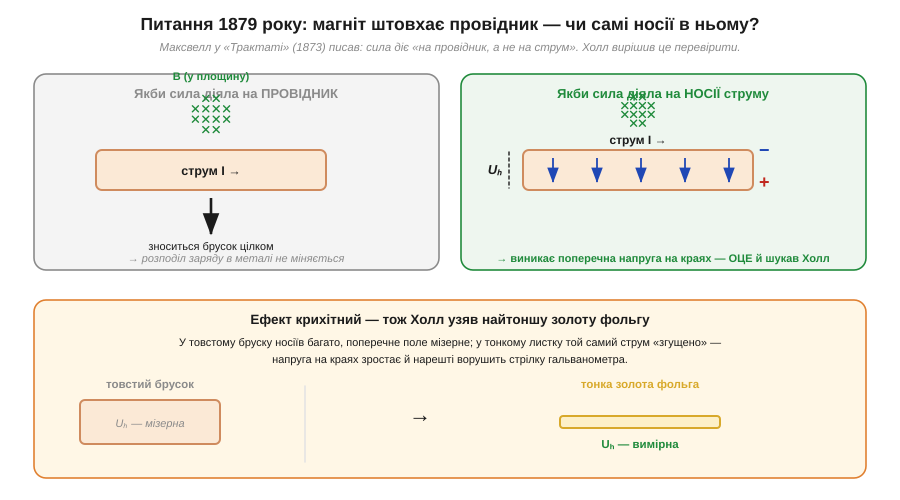
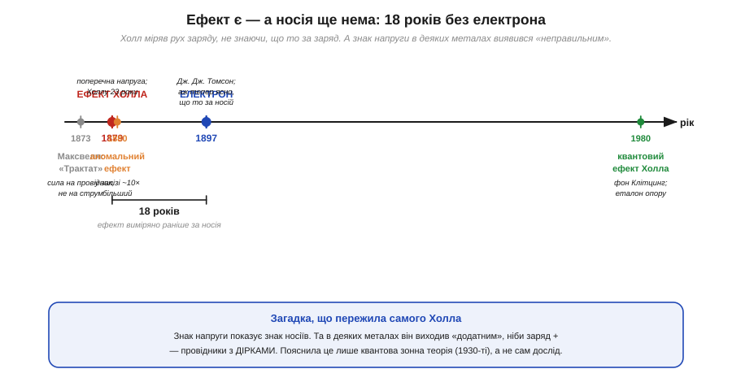

# 📜 Едвін Холл: ефект, відкритий за 18 років до електрона

> Історія [ефекту Холла](topic:physics/hall-effect): магнітне поле відхиляє носії заряду вбік і притискає їх до однієї грані провідника, аж поки на краях не набіжить **поперечна напруга**. Сьогодні на цьому ефекті стоїть ціле сімейство давачів. Та коли двадцятитрирічний аспірант **Едвін Холл** уперше зловив цю напругу гальванометром, не існувало ще ні поняття «носій заряду», ні самого **електрона** — його відкриють лише через **вісімнадцять років**. Холл міряв рух заряду, не знаючи, що то за заряд. І знак тієї напруги задав фізиці загадку, яка пережила і самого Холла, і його вчителя.

---

## Суперечка з небіжчиком: на що діє магнітна сила

Історія ефекту Холла починається не з лабораторії, а з **книжки** — і з гарного, упертого запитання. 1878 року в Університеті Джонса Гопкінса (*Johns Hopkins University*) у Балтиморі молодий аспірант **Едвін Герберт Холл** (*Edwin Herbert Hall*, 1855–1938) читав на курсі **«Трактат про електрику й магнетизм»** Джеймса Клерка Максвелла (*James Clerk Maxwell*) — головну фізичну книгу тієї доби. І наткнувся на фразу, що його збентежила.

Максвелл, описуючи, як магніт відхиляє провідник зі струмом, додавав застереження: *«Слід ретельно пам'ятати, що механічна сила, яка штовхає провідник… діє не на електричний струм, а на провідник, що його несе»*. Іншими словами — на думку Максвелла, магнітне поле штовхає **сам дріт як ціле**, а не той потік заряду, що тече всередині. Для Холла це звучало непереконливо. Адже якщо прибрати струм, поле на дріт не діє ніяк; виходить, штовхає поле саме рух заряду — то чому ж сила мала б оминати носіїв і чіплятися до металу?

*Дві можливості, які Холл вирішив розрізнити дослідом. Ліворуч — версія Максвелла: сила зносить **увесь брусок**, а розподіл заряду в металі не міняється. Праворуч — версія Холла: сила тисне на **носії струму**, згрібає їх до однієї грані, і на краях провідника набігає поперечна напруга Uₕ. Унизу — головна хитрість: ефект крихітний, тож замість товстого бруска Холл узяв найтоншу **золоту фольгу**, де той самий струм «згущено» і напруга на краях стає вимірною.*

Холл пішов із цим питанням до свого наукового керівника — а керівником був **Генрі Роуланд** (*Henry Augustus Rowland*), уже тоді один із найповажніших фізиків Америки. Роуланд відповів, що **й сам сумнівається** у правоті Максвелла й колись навіть нашвидку поставив дослід, та без успіху. Це був дозвіл і благословення водночас: вчитель не лише не відмахнувся, а підтвердив, що питання живе. Прикметно, що сам Холл згодом чесно описав цю розмову — ідея перевірити Максвелла висіла в повітрі кафедри, а Роуланд був тим, хто скерував молодшого колегу й дав йому свободу шукати. Це типова для науки **колективна** зав'язка: вчитель ставить питання й сумнів, учень доводить дослід до кінця.

> 🔧 **Навіщо це.** Запам'ятайте логіку Холла — вона досі працює в кожному давачі Холла. Якщо магнітне поле тисне на **носії**, то воно зміщує їх упоперек струму, і це зміщення видно як **напругу на бічних гранях**. Тобто магнітне поле можна перетворити на **електричний сигнал**, нічого не торкаючись і не розриваючи кола. Уся безконтактна магнітна сенсорика (давачі положення, безколекторні мотори, що «знають» кут ротора, безконтактні вимикачі) виросла з цього єдиного припущення.

---

## Чому знадобилася золота фольга

Поставити дослід було легко на словах і важко на ділі. Холл пропустив струм уздовж тонкої пластини, підвів магнітне поле перпендикулярно до неї, а до **бічних** країв пластини під'єднав чутливий гальванометр — шукати ту саму поперечну напругу. Проблема в тому, що для металів і доступних тоді магнітів ця напруга **мізерна**: у звичайному металевому бруску носіїв так багато, що поперечне поле, яке встигає набігти, ховається в шумах і не ворушить стрілку. Перша спроба з суцільним металевим провідником, як і колись у Роуланда, нічого не дала.

Розв'язання було радше інженерним, ніж теоретичним: Холл замінив товстий провідник на **найтоншу золоту фольгу** (*gold leaf*) — таку, якою золотять рами й книжкові обрізи. Сенс простий. Той самий струм, протиснутий крізь дуже тонкий і вузький провідник, «згущується»; це різко піднімає поперечну напругу на краях — якраз настільки, щоб гальванометр нарешті її показав. Восени 1879-го, після місяців налаштувань, Холл побачив це на власні очі: щойно вмикали магніт — стрілка **відхилялася й залишалася** відхиленою, поки поле трималося. Магнітне поле справді **переставляло заряд** усередині провідника. Максвелл, як делікатно напишуть згодом, тут помилявся.

Дата прикметна. Холл опублікував результат у статті **«Про нову дію магніту на електричні струми»** (*On a New Action of the Magnet on Electric Currents*) **1879 року** — того самого року, коли Максвелл помер, у віці лише 48 років. Авторові ефекту було **23 роки**, і він іще навіть не мав докторського ступеня — захистився в Гопкінсі вже наступного, 1880-го, а сам ефект став прямим наслідком його дисертаційної роботи.

---

## Тур-де-форс без головного героя: електрона ще нема

Тепер найдивовижніше — і саме воно робить історію Холла справжнім науковим подвигом. Варто усвідомити, **чого тоді не знали**. Не існувало поняття «носій заряду». Не існувало **електрона**: його відкриє **Джозеф Джон Томсон** (*J. J. Thomson*) лише **1897 року**, через вісімнадцять років після Холлового досліду. Ніхто не знав, що тече в металі, скільки тих частинок, який у них заряд і чи це взагалі частинки. Холл побачив і виміряв **наслідок** руху заряду в магнітному полі, не маючи ані найменшого уявлення про сам **носій** цього заряду. Це все одно що точно зважити вітер, не знаючи, що повітря складається з молекул.

*Хронологія, що пояснює, чому ефект Холла — це «тур-де-форс». Максвелл (1873) стверджує, що сила діє на провідник; Холл (1879) дослідом це спростовує; за рік знаходить аномально великий ефект у залізі; і лише 1897-го Томсон відкриває **електрон** — аж тепер стає ясно, що ж саме рухалося в золотій фользі. Дужка показує ті **18 років**, на які вимір випередив відкриття носія. А внизу — загадка знаку, яку зняв не дослід, а квантова теорія через півстоліття.*

Те, що результат вистояв і виявився правильним без жодної «правильної» картини носіїв, — найкраще свідчення, що Холл міряв чесно й акуратно. Гарна експериментальна фізика буває **попереду** теорії: спершу надійно фіксуємо явище, а вже потім, коли з'являється апарат, розуміємо його глибину. Саме так станеться і з самим знаком Холлової напруги.

---

## Знак, що виходив «не туди»: перша підказка про дірки

Холлова напруга має чудову властивість: її **знак** залежить від того, заряд **якого знаку** рухається в провіднику. Поле відхиляє носії вбік — і якщо носії від'ємні, на одній грані збереться надлишок мінуса, а якщо додатні, та сама грань стане плюсовою. Тобто за полярністю поперечної напруги можна, у принципі, **дізнатися знак носіїв заряду**. Це робить ефект Холла унікальним інструментом: він зазирає всередину провідності так, як більше ніщо.

І тут на фізиків чекав неприємний сюрприз. Для більшості металів знак виходив «правильний» — носії від'ємні, як і має бути, коли струм несуть електрони (їх відкриють пізніше, але картину це підтвердить). Та в **деяких** металів — класичні приклади цинк, кадмій, згодом берилій — знак Холлової напруги виходив **протилежний**, такий, ніби струм у них несуть **додатні** заряди. Це здавалося абсурдом: звідки в шматку металу додатні носії, якщо рухаються там ті самі електрони?

Загадку не міг зняти ані сам Холл, ані фізика XIX століття. Розв'язання прийшло аж у **1930-ті**, з **квантовою зонною теорією** твердого тіла: у певних матеріалах колективний рух електронів у майже заповненій енергетичній зоні **поводиться** так, наче струм несуть фіктивні додатні частинки — **дірки** (*holes*). Дірка — це не реальна частинка, а зручний опис «порожнього місця» серед електронів, що рухається проти них; але в магнітному полі вона дає рівно такий знак Холлової напруги, як справжній додатний заряд. Виходить, ефект Холла ще наприкінці XIX століття **тицьнув пальцем** у явище, яке зрозуміли лише через півстоліття. Дослід випередив не лише електрон — він випередив і саму квантову механіку, що пояснила його результати.

> 🔧 **Навіщо це.** Знак Холлової напруги — не історичний курйоз, а робочий інструмент. У напівпровідниках (а саме з них зроблено всі сучасні давачі Холла й самі мікросхеми) тип провідності буває **електронний** (n) або **дірковий** (p). Вимірявши полярність Холлової напруги, інженер просто й однозначно визначає, який це тип і скільки в матеріалі носіїв. Тому ефект Холла — стандартний лабораторний метод **характеризації напівпровідників**: він каже не лише «скільки носіїв», а й «якого вони знаку». Те, що колись було загадкою цинку, сьогодні — рядок у звіті про вимір пластини.

---

## Аномальний ефект Холла: залізо, що дивувало вдесятеро

Не встигши осмислити перший результат, Холл одразу зробив другий. Він повторив дослід, але замість золота й інших звичайних провідників узяв **феромагнітне залізо** — і виявив, що поперечний ефект там **приблизно вдесятеро сильніший**, ніж очікувано для звичайного провідника в такому полі. Цей надмірний, «зайвий» відгук назвали **аномальним ефектом Холла** (*anomalous Hall effect*).

Чому залізо так вибивається? Підказку дає сама природа цього металу: залізо — [феромагнетик](topic:physics/ferromagnetism), у ньому є власна **намагніченість** доменів (та, що лишається й після [насичення та гістерезису](topic:physics/saturation-hysteresis)), а не лише та, що наводить зовнішнє поле. Класична картина «поле відхиляє носіїв» цього надлишку не пояснює; повне пояснення знову-таки квантове й тонке (воно пов'язане зі спіном носіїв і будовою зон), і доводять його фізики й донині. Для нас зараз важлива сама закономірність, яку Холл уловив експериментально: у магнітних матеріалах ефект Холла «вмикає» додатковий механізм, прив'язаний до намагніченості речовини, а не лише до зовнішнього поля. Холл, не маючи ні поняття про спін, ні про електрон, голим виміром намацав **ще одне** глибоке явище фізики твердого тіла.

---

## Від золотої фольги до квантового еталона опору

Здавалося б, акуратний, але вузький дослід 1879 року. Насправді ж лінія, що почалася золотою фольгою в балтиморській лабораторії, тягнеться через усе XX століття аж у наші прилади.

Спершу — **давачі**. Коли в середині XX століття навчилися робити чисті напівпровідники, виявилося, що в них ефект Холла на **порядки** сильніший, ніж у металів (бо носіїв менше, а кожен «розганяється» дужче). На цьому виросло ціле сімейство **давачів Холла** (*Hall sensors*): крихітні пластинки, що віддають напругу, пропорційну магнітному полю. Вони міряють положення без контакту, рахують оберти, «бачать» магніт ротора в безколекторному моторі й працюють безконтактними вимикачами. Кожен такий давач — прямий нащадок Холлової золотої фольги.

А далі — найвища точка. 1980 року німецький фізик **Клаус фон Клітцинг** (*Klaus von Klitzing*) охолодив напівпровідникову структуру майже до абсолютного нуля, увімкнув сильне магнітне поле — і виявив, що Холлів опір змінюється не плавно, а **сходинками**, кожна з яких лягає на математично точне значення, виражене лише через дві фундаментальні сталі (заряд електрона e й сталу Планка h). Це **квантовий ефект Холла** (*quantum Hall effect*); за нього фон Клітцинг отримав Нобелівську премію 1985 року. Практичний наслідок — приголомшливий: цими сходинками тепер **визначають еталон електричного опору**. Точність вимірів завжди стоїть на незмінних еталонах — як свого часу [нормальний елемент Едварда Вестона](topic:electronics/multimeter/hist-weston.md) задав, скільки ж насправді у вольті вольтів. Так от, сучасний еталон ома стоїть на квантовому ефекті Холла — на тому самому явищі, яке двадцятитрирічний Холл уперше зловив гальванометром у золотій фользі.

---

## Хто був Едвін Холл

Сам Холл прожив життя радше тихого університетського вченого, ніж зірки. Народився **1855 року** в містечку Горем, штат Мен (*Gorham, Maine*), у США; навчався в Боудін-коледжі, кілька років учителював у школах, а тоді вступив до молодого тоді Університету Джонса Гопкінса — першого в Америці, збудованого за німецьким зразком навколо **досліджень**, а не лише викладання. Саме там, під орудою Роуланда, він і зробив відкриття, що зробило його ім'я загальновідомим іще в аспірантурі.

Решту кар'єри Холл провів у **Гарварді**: професор фізики з 1895 року, згодом — у престижному Рамфордовому кріслі. Він багато займався **термоелектрикою** й написав чимало підручників і лабораторних посібників — тобто був ще й сумлінним педагогом, що передавав ремесло точного експерименту наступним поколінням. Помер у Кембриджі (штат Массачусетс) **1938 року**.

Його шлях — повчальний для будь-кого, хто вчиться: велике відкриття зробив не маститий професор, а **аспірант**, який не побоявся засумніватися в найповажнішій книзі своєї доби й мав керівника, що цей сумнів підтримав. І зробив це не геніальним осяянням, а **впертим, акуратним виміром** — тонша фольга, чутливіший гальванометр, місяці налаштувань. Найкраща фізика часто саме така.

---

## Що з цього виросло

Едвін Холл, перевіряючи одну фразу Максвелла, відкрив, що магнітне поле **зміщує носії заряду впоперек струму** й створює вимірну [поперечну напругу](topic:physics/hall-effect). З цього виросло три великі лінії:

- **Безконтактна сенсорика.** Поле перетворюється на напругу, нічого не торкаючись, — звідси давачі Холла (положення, оберти, струм без розриву кола).
- **Вікно в провідність.** Знак Холлової напруги показує **знак носіїв** (електрони чи дірки) і їхню кількість — звідси стандартний метод характеризації напівпровідників, на яких стоїть уся сучасна електроніка.
- **Точність вимірів.** Квантовий ефект Холла дав сучасний **еталон опору** — нащадок того самого досліду, продовження тієї самої [лінії еталонів](topic:electronics/multimeter/hist-weston.md), що почалася з нормального елемента Вестона.

Головна думка лишається з нами: Холл **виміряв рух заряду за вісімнадцять років до того, як дізналися, що то за заряд** — і ще й намацав знаком напруги дірки, яких теорія не вміла пояснити ще півстоліття. Тож, тримаючи в руках будь-який давач Холла, згадайте балтиморську золоту фольгу 1879 року: добрий дослід буває настільки попереду свого часу, що його повну глибину доводиться доганяти кільком поколінням фізиків.
