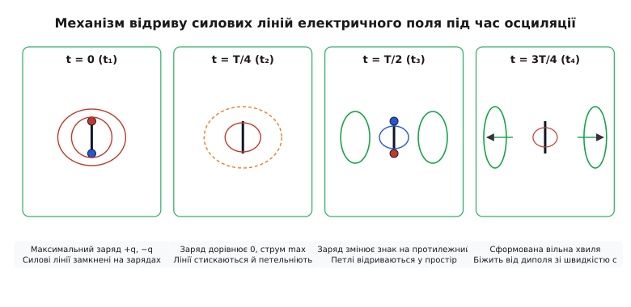
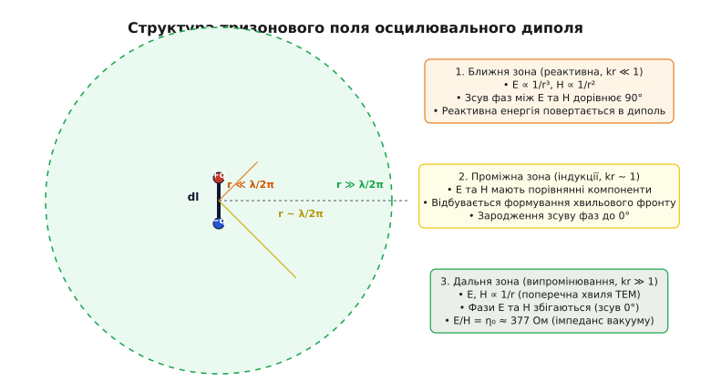
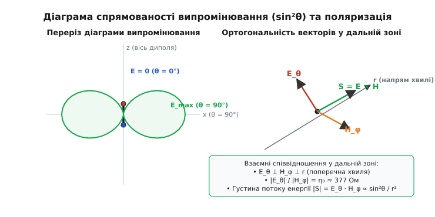
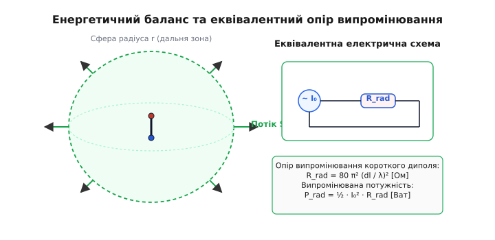

# Осцилювальний диполь Герца

<preknowlist>
- [Рівняння Максвелла](book:physics/maxwell-equations) — фундаментальні закони взаємозв'язку електричних і магнітних полів у просторі та середовищі.
- [Електромагнітна хвиля](book:physics/em-wave) — концепція самопідтримного поширення полів у просторі без дротів.
- [Струм зміщення](book:physics/displacement-current) — генерація магнітного поля зміною електричного поля в часі.
- [Векторний потенціал](book:physics/vector-potential) — математичний інструмент розрахунку магнітного поля через розподіл струмів.
</preknowlist>

Коли електричний заряд лежить нерухомо на лабораторному столі, створене ним електричне поле простягається до нескінченності, але лишається жорстко прикутим до свого джерела: зсув заряду на один міліметр лише деформує навколишню картину, не випускаючи у простір жодного кванта автономної енергії. Якщо ж той самий заряд прискорити всередині крихітного шматка провідника завдовжки в частки міліметра й змусити його коливатися назад-вперед мільйони разів на секунду, станеться диво: силові лінії електричного поля перетягнуться, відірвуться від металу й переворяться на автономні замкнені петлі, що полетять у порожнечу зі швидкістю 300 000 кілометрів на секунду. Цей нескінченно малий відрізок провідника зі змінним струмом — **осцилювальний диполь Герца** — є найменшою «цеглинкою» випромінювання у Всесвіті. Без розуміння його фізики неможливо пояснити ні роботу кіловатної телевежі, ні випромінювання атома у далекій галактиці, ні те, чому денне небо має блакитний колір.

---

## 1. Анатомія модельної системи: точковий «атом» електродинаміки

Щоб збагнути механіку випромінювання, фізики використовують ідеалізовану абстракцію — елементарний диполь Герца (від грец. *δίς* — двічі, *πόλος* — полюс; *осциляція* від лат. *oscillatio* — розгойдування). Це прямий провідник нехтовно малої довжини `dl`, що значно менша за довжину випромінюваної електромагнітної хвилі `λ` (`dl ≪ λ`). На протилежних кінцях цього провідника розташовані дві мікроскопічні накопичувальні ємності (сфери), між якими перетікає електричний заряд `q(t)`.

Оскільки довжина `dl` є нескінченно малою, струм `I(t)` у будь-якій точці вздовж цього провідника можна вважати строго однаковим за амплітудою й фазою. Зміна заряду на сферах і струм у провіднику підпорядковуються гармонічному закону з коловою частотою `ω`:

```
q(t) = −q₀ · cos(ω · t)
I(t) = dq/dt = q₀ · ω · sin(ω · t) = I₀ · sin(ω · t)
```

де `I₀ = q₀ · ω` — амплітудне значення струму.

Система має змінний електричний дипольний момент `p(t)`, орієнтований уздовж осі провідника:

```
p(t) = q(t) · dl = p₀ · cos(ω · t)
```

де `p₀ = q₀ · dl` — амплітуда дипольного моменту.

```
+q(t)  (верхня сфера)
  │
  │  ↑ I(t) = I₀·sin(ω·t)  (струм уздовж елемента dl ≪ λ)
  │
−q(t)  (нижня сфера)
```

У класичній електростатиці поле статичного диполя відоме: воно падає з відстанню за законом `1/r³` і є повністю потенціальним (напруженість визначається градієнтом скалярного потенціалу `E = −∇Φ`). У стаціонарній магнітостатиці постійний струм створює магнітне поле, яке згасає за законом Біо-Савара-Лапласа `1/r²`. Але як тільки заряд почне прискорюватися, рівняння Максвелла зв'язують змінне електричне поле зі змінним магнітним полями в єдиний динамічний вузол, і в просторі народжується третя складова поля — **хвильова**, що падає зі значно меншою швидкістю `1/r`.

Ця ідеалізована система відіграє в електродинаміці та антенознавстві таку ж фундаментальну роль, як точкова маса у класичній механіці чи точковий заряд у законі Кулона. Будь-яка реальна антена складного профілю — від простих [антен](book:communications/antenna) у Wi-Fi роутерах до велетенських фазованих решіток радіолокаторів — може бути подана як сума (інтеграл) послідовно розставлених елементарних диполів Герца з відповідним розподілом амплітуд і фаз струму.

---

## 2. Фізичні потенціали та запізнення електромагнітної взаємодії

Для повного опису полів осцилювального диполя електродинаміка використовує апарат запізнілих потенціалів. У кулонівській електростатиці передбачається, що зміна положення заряду миттєво змінює потенціал у будь-якій точці Всесвіту. Однак теорія Максвелла стверджує: електромагнітна взаємодія поширюється зі скінченною швидкістю `c ≈ 3e8 м/с`.

Значення скалярного потенціалу `Φ` та векторного потенціалу `A` у точці спостереження на відстані `r` визначаються станом джерела не у поточний момент часу `t`, а у запізнілий момент часу `t' = t − r/c`:

```
A(r, t) = (μ₀ / (4π · r)) · I(t − r/c) · dl
```

Зв'язок між векторним і скалярним потенціалами задається умовою калібрування Лоренца:

```
div(A) + (1 / c²) · ∂Φ/∂t = 0
```

Завдяки цьому запізненню просторові похідні потенціалів породжують не лише кулонівське поле зарядів та індукційне поле струмів, а й принципово новий тип поля — **випромінювальне поле прискореного заряду**. Якщо заряд рухається прямолінійно зі змінною швидкістю, прискорення `a = d²x/dt²` призводить до появи в електричному й магнітному полям доданків, які пропорційні прискоренню й згасають пропорційно першому степеню відстані `1/r`.

Фізично це означає, що прискорення заряду спричиняє «зсувний сплеск» у лінії напруженості поля. Цей сплеск не може зникнути безслідно чи повернутися назад до заряду: він відривається й поширюється у просторі у формі сферичної електромагнітної хвилі.

---

## 3. Механізм відриву силових ліній: як народжується вільна хвиля

Головна таємниця випромінювання полягає у запитанні: **як поле перетворюється з "прикутого" до провідника на "вільне", здатне існувати самостійно?**

У випадку стаціонарного або повільно змінюваного поля силові лінії електричного поля починаються на позитивному заряді `+q` й закінчуються на негативному заряді `−q`. Коли заряди коливаються повільно, поле успеває повністю перебудуватися на кожному кроці, і силові лінії слухняно деформуються разом із зарядами, повертаючи всю запасену енергію назад у контур.

Але коли частота коливань `ω` стає високою, вмикається ефект запізнення сигналів. Електромагнітне збурення поширюється у просторі зі скінченною швидкістю світла `c`. Силові лінії на віддалі від диполя «дізнаються» про зміну заряду на сферах із запізненням на час `Δt = r/c`.


*Фазовий цикл відриву силових ліній: при обнуленні заряду в центрі диполя силові лінії утворюють точки самоперетину (перетяжки), розриваються й замикаються в автономні випромінювані петлі.*

Розглянемо послідовні фази цього процесу протягом одного періоду коливань `T`:

1. **Фаза `t = 0` (Максимальний заряд):** Сфери заряжені до максимуму `+q₀` та `−q₀`, струм дорівнює нулю. Силові лінії електричного поля дугами виходять із верхньої сфери й входять у нижню. Поле у близькій околиці нагадує звичайне статичне дипольне поле.
2. **Фаза `t = T/4` (Заряд дорівнює нулю, струм максимальний):** Заряди нейтралізували один одного, протікаючи крізь провідник. Однак віддалені ділянки силових ліній, випромінені у фазі `t = 0`, за рахунок інерції (запізнення) ще продовжують рухатися назовні! Водночас біля самого провідника поле вже прагне обнулитися. В результаті силові лінії біля осі диполя стискаються й утворюють вузьку «перетяжку» (точку самоперетину).
3. **Фаза `t = T/2` (Переполяризація зарядів):** Заряди на сферах змінюють знак на протилежний: верхня сфера стає `−q`, а нижня `+q`. У центрі диполя виникають нові силові лінії протилежного напрямку. Вони «виштовхують» стару конфігурацію. В точці перетяжки лінії перетинаються, розриваються й замикаються самі на себе, утворюючи замкнену замкнуту петлю електричного поля!
4. **Фаза `t = 3T/4` (Формування вільної хвилі):** Відрізана петля електричного поля більше не торкається провідника й не має на собі електричних зарядів. За [рівнянням Максвелла](book:physics/maxwell-equations), змінне електричне поле цієї замкненої петлі породжує вихрове магнітне поле `H`, а те, у свою чергу, породжує нове електричне поле `E`. Утворився самопідтримний електромагнітний тороїдальний вихор, який відривається й назавжди біжить у відкритий простір.

Цей елегантний геометричний механізм відриву вперше математично розрахував Генріх Герц у 1888 році ([історія теорії диполя](book:physics/electromagnetism/hertz-dipole/hist-hertz-dipole-theory.md)).

---

## 4. Анатомія полів довкола диполя: три зони простору

Структура полів, що оточують осцилювальний диполь Герца, виявляється неоднорідною. Вона змінюється залежно від відстані `r` до джерела. Строгий математичний вивід показує, що напруженості електричного `E` та магнітного `H` полів складаються з доданків, які пропорційні `1/r³`, `1/r²` та `1/r`.

Ключовим параметром, який розділяє простір на фізично відмінні області, є безрозмірний добуток хвильового числа `k = 2π / λ` на відстань `r`. Характерна межа виникає при `k · r = 1`, тобто на відстані:

```
r_boundary = λ / (2π) ≈ 0.159 · λ
```


*Три фізичні зони простору довкола диполя: реактивна ближня зона, проміжна зона індукції та дальня хвильова зона.*

За цією критерією простір навколо диполя розділяють на три зони:

### 1. Ближня зона (реактивна зона, `r ≪ λ / (2π)`, `k·r ≪ 1`)

У цій області, розташованій ближче ніж `0.16 λ` від осцилятора, у виразах полів домінують доданки `1/r³` для електричного поля та `1/r²` для магнітного поля:

```
E_r ≈ (2 · p₀ · cos(θ) / (4π · ε₀ · r³)) · cos(ω · t − k·r)
E_θ ≈ (p₀ · sin(θ) / (4π · ε₀ · r³)) · cos(ω · t − k·r)
H_φ ≈ (I₀ · dl · sin(θ) / (4π · r²)) · sin(ω · t − k·r)
```

Зверніть увагу на фазове співвідношення: складові електричного поля `E` змінюються пропорційно `cos(...)`, тоді як магнітне поле `H_φ` змінюється пропорційно `sin(...)`. **Зсув фаз між електричним і магнітним полями в ближній зоні становить чітко 90° (`π/2`)!**

Це має колосальний фізичний зміст: так само, як у конденсаторі чи котушці індуктивності, коливання електричного й магнітного полів зсунуті на чверть періоду. Протягом однієї чверті періоду енергія накачується з диполя у навколишній простір, а протягом наступної чверті — повністю повертається назад у диполь. **Середній потік енергії на нескінченність у ближній зоні дорівнює нулю.** Енергія реактивного поля «дихає» навколо антени, утворюючи так зване накопичувальне (реактивне) поле.

Густина енергії у ближній зоні визначається виразом:

```
u_reactive = (1/2) · ε₀ · E² + (1/2) · μ₀ · H²
```

Оскільки електричне поле розраховується з доданків `1/r³`, реактивна густина енергії стрімко падає з відстанню за законом `1/r⁶`.

> 🔧 **Навіщо це.** Якщо піднести металевий предмет чи руку в ближню зону антени (`r < λ / (2π)`), ви заберете частину реактивної енергії, зміните ємність й індуктивність диполя та різко розстроїте резонансну частоту передавача. Саме на цьому фізичному принципі працюють безконтактні NFC-мітки (13.56 МГц, де `λ ≈ 22 м`, тож зчитувач завжди працює виключно у ближній реактивній зоні) та ємнісні датчики наближення.

### 2. Проміжна зона (зона індукції, `r ~ λ / (2π)`, `k·r ~ 1`)

На відстанях порядку `0.16 λ` доданки `1/r³`, `1/r²` та `1/r` стають порівнянними за величиною. Відбувається складна трансформація: зсув фаз між `E` та `H` починає плавно зменшуватися від `90°` до `0°`, реактивна енергія поступово перетворюється на випромінювану, і з хаосу індукційних полів остаточно викристалізовується хвильовий фронт.

У проміжній зоні напруженості полів не можна обчислювати за спрощеними асимптотиками — необхідно застосовувати точні вирази, що містять усі три доданки.

### 3. Дальня зона (хвильова зона / зона випромінювання, `r ≫ λ / (2π)`, `k·r ≫ 1`)

На великих відстанях від диполя доданки `1/r³` та `1/r²` згасають надзвичайно швидко й стають нехтовно малими. У просторі виживають лише доданки, що спадають повільно — за законом `1/r`:

```
E_r ≈ 0
E_θ ≈ −(k² · I₀ · dl / (4π · ε₀ · ω · r)) · sin(θ) · cos(ω · t − k·r)
H_φ ≈ −(k · I₀ · dl / (4π · r)) · sin(θ) · cos(ω · t − k·r)
```

Подивіться на ці вирази — у них зашифровано головні властивості електромагнітної хвилі у вільному просторі:

1. **Поперечний характер (TEM-хвиля):** Радіальна компонента `E_r` прямує до нуля. Вектори `E_θ`, `H_φ` та напрямок поширення хвилі `r` утворюють праву трійку взаємно перпендикулярних векторів (`E ⊥ H ⊥ r`).
2. **Сінфазність полів:** Обидва поля `E_θ` та `H_φ` коливаються в **однаковій фазі** `cos(ω · t − k·r)`. Зсув фаз між ними дорівнює **`0°`**. Електричне й магнітне поля досягають своїх максимумів і нулів одночасно.
3. **Хвильовий імпеданс середовища:** Відношення амплітуд електричного й магнітного полів у дальній зоні є строго постійною величиною, що не залежить від відстані `r` чи частоти, і визначається лише параметрами середовища:

```
E_θ / H_φ = √(μ₀ / ε₀) = η₀ ≈ 376.73 Ом
```

Величина `η₀ ≈ 377 Ом` зветься **хвильовим імпедансом (опором) вакууму**. Вона показує, що кожному 377 Вольтам на метр електричного поля у вільній хвилі відповідає строго 1 Ампер на метр магнітного поля.

Повний математичний розклад усіх компонент полів наведено у додатку [математичний вивід полів диполя](book:physics/electromagnetism/hertz-dipole/math-hertz-dipole-fields.md).

---

## 5. Енергетичний аналіз ближнього поля: реактивна потужність і комплексний вектор Пойнтінга

Для більш глибокого аналізу обміну енергією між диполем і середовищем використовують **комплексний вектор Пойнтінга** `S_c = (1/2) · E × H*`, де `H*` — комплексно-спряжений вектор магнітного поля.

У загальному випадку комплексний вектор Пойнтінга розкладається на дійсну й уявну частини:

```
S_c = P_active + j · Q_reactive
```

Дійсна частина `P_active` описує **активну потужність**, яка безповоротно випромінюється у дальню зону. Вона повністю визначається випромінювальними компонентами `1/r` і дає позитивний радіальний потік енергії при інтегруванні по замкненій сфері.

Уявна частина `Q_reactive` описує **реактивну потужність**, яка циркулює у ближній зоні. Вона виникає внаслідок взаємодії кулонівського електричного поля `1/r³` та індукційного магнітного поля `1/r²`. Реактивна енергія локалізована в безпосередній близькості від диполя, а її густина спадає як `1/r⁵` та `1/r⁶`.

Загальний запас реактивної енергії у ближній зоні диполя `W_near` визначається інтегралом по об'єму сфери радіуса `r_boundary = λ / (2π)`:

```
W_near = ∫_V [ (1/4) · ε₀ · |E_near|² + (1/4) · μ₀ · |H_near|² ] dV
```

Оскільки для елементарного диполя `dl ≪ λ`, амплітуда реактивного електричного поля в тисячі разів перевищує амплітуду випромінюваного поля. Це означає, що точковий диполь Герца оточений величезною «хмарою» накопиченої електростатичної енергії, яка не випромінюється, але створює високий реактивний опір (ємнісну реактивність) на клемах випромінювача.

---

## 6. Діаграма спрямованості: чому диполь не випромінює вздовж своєї осі

Напруженість полів у дальній зоні містить множник `sin(θ)`, де `θ` — кут між віссю диполя (віссю `z`) та напрямком на точку спостереження.

Оскільки густина потоку енергії пропорційна квадрату напруженості поля (`S ∝ E² ∝ sin²(θ)`), розподіл випромінюваної потужності у просторі є принципово неегалітарним (неізотропним).


*Просторова діаграма спрямованості диполя Герца має форму тороїда (бублика) без центрального отвору. Максимум випромінювання припадає на екваторіальну площину (θ = 90°), а вздовж осі випромінювання відсутнє (θ = 0°).*

Просторовий графік випромінювання являє собою **тороїд обертання** («бублик»), у центрі якого лежить диполь:

1. **Максимум випромінювання (`θ = 90°`, екваторіальна площина):** `sin(90°) = 1`. Перпендикулярно до осі диполя хвиля випромінюється з максимальною інтенсивністю.
2. **Нуль випромінювання (`θ = 0°` та `θ = 180°`, вісь диполя):** `sin(0°) = 0`. Вздовж своєї власної осі диполь Герца **не випромінює взагалі нічого!**

### Фізична інтуїція нуля вздовж осі

Чому випромінювання вздовж осі дорівнює нулю? Згадаємо, що електромагнітна хвиля є строго **поперечною**. Електричне поле хвилі створюється прискореним рухом зарядів і орієнтоване паралельно до напрямку цього прискорення. Якщо ми дивимося на диполь згори (уздовж осі `z`), заряд здійснює коливання прямо «на нас» і «від нас». У цьому напрямку немає поперечної складової руху! Заряд прискорюється вздовж променя зору, а оскільки поперечного прискорення немає, поперечна хвиля народитися не може.

### Спрямованість (Directivity) та поляризація

Оскільки диполь випромінює енергію не рівномірно у всі боки, а фокусує її в напрямку екватора, він має коефіцієнт спрямованості `D` відносно гіпотетичного ізотропного випромінювача:

```
D = 1.5  (або 1.76 dBi)
```

Поляризація випромінюваної хвилі є **лінійною**. Вектор електричного поля `E` коливається в меридіональній площині, що проходить через вісь диполя й точку спостереження.

---

## 7. Потік Пойнтінга, Larmor-формула та опір випромінювання

Енергія, яку хвиля переносить крізь одиничну площадку в одиницю часу, описується вектором Пойнтінга `S = E × H` (названим на честь Джон Генрі Пойнтінга; від грец. *вектор* — той, що несе).

У дальній зоні вектор Пойнтінга спрямований строго радіально від диполя назовні. Його середня за період густина становить:

```
⟨S_r⟩ = (η₀ · k² · I₀² · dl² / (32π² · r²)) · sin²(θ)  [Вт/м²]
```

Придивимося до цієї формули: густина енергії спадає пропорційно `1/r²`. Це прямий наслідок закону збереження енергії: площа сфери радіуса `r` зростає як `r²`, тому загальний потік енергії через сферу будь-якого радіуса лишається постійним!


*Інтегрування потоку Пойнтінга по закритій сфері визначає повну випромінювану потужність, яка еквівалентна виділенню тепла на опорі випромінювання R_rad.*

Проінтегрувавши `⟨S_r⟩` по всій поверхні сфери радіуса `r`, отримуємо повну потужність `P_rad`, яку диполь безповоротно випромінює у простір:

```
P_rad = (η₀ · k² · I₀² · dl²) / (12π) = (2/3) · (q₀² · a₀² / (4π · ε₀ · c³))
```

Цей результат є релятивістсько-класичною **формулою Лармора** для потужності випромінювання заряду `q`, що рухається з прискоренням `a₀`.

### Поняття про опір випромінювання (Radiation Resistance)

З точки зору генератора, під'єднаного до антени, випромінювання енергії у простір виглядає як звичайна втрата потужності. Антена «споживає» струм і віддає енергію назовні. Щоб описати цей процес мовою електричних кіл, уводять поняття **опору випромінювання `R_rad`** — еквівалентного активного опору, на якому протікаючий струм `I_rms` виділяв би таку саму потужність у вигляді тепла:

```
P_rad = (1/2) · I₀² · R_rad
```

Прирівнюючи випромінену потужність до цієї формули, отримуємо знамениту формулу опору випромінювання диполя Герца:

```
R_rad = 80 · π² · (dl / λ)² ≈ 789.6 · (dl / λ)²  [Ом]
```

Оскільки для диполя Герца `dl ≪ λ`, опір випромінювання виявляється **мізерно малим**. Наприклад, якщо довжина диполя `dl` становить `0.01 λ` (1 соту довжини хвилі), його опір випромінювання дорівнює:

```
R_rad = 80 · π² · (0.01)² ≈ 0.079 Ом  (всього 79 міліом!)
```

Такий мізерний опір випромінювання означає, що підводити енергію до дуже коротких антен вкрай важко: більша частина потужності джерела буде марно витрачатися на омічний нагрів самих дротів та кіл узгодження.

Чисельні алгоритми розрахунку цих компонент полів наведено у проєкті [чисельне моделювання полів диполя](book:physics/electromagnetism/hertz-dipole/proj-dipole-field-simulation.md), а повну зведену таблицю інженерних формул та параметрів — у [інженерний калькулятор диполя](book:physics/electromagnetism/hertz-dipole/api-dipole-antenna-calc.md).

---

## 8. Вплив земляної поверхні: метод дзеркальних зображень

У реальних умовах диполь Герца рідко випромінює у безмежному вакуумі — найчастіше він розміщений на висоті `h` над Землею або провідною поверхнею.

Для розрахунку полів у присутній ідеально провідної площини `z = 0` застосовують **метод дзеркальних зображень**. Гранична умова вимагає, щоб дотична складова електричного поля на поверхні провідника дорівнювала нулю (`E_tan = 0`).

1. **Вертикальний диполь Герца (орієнтований перпендикулярно до землі):**
   Дзеркальне зображення має **такий самий напрямок струму**. Вектори полів реального й дзеркального диполів складаються синфазно в екваторіальній площині. Внаслідок цього випромінювана потужність у верхньо півсферу подвоюється, а опір випромінювання змінюється залежно від висоти `h`:
   ```
   R_rad(h) = 80 · π² · (dl / λ)² · [ 1 + 3 · (sin(2kh) − 2kh · cos(2kh)) / (2kh)³ ]
   ```
   При наближенні диполя до землі (`h → 0`) опір випромінювання вертикального диполя подвоюється і становить `R_rad ≈ 160 · π² · (dl / λ)²`.

2. **Горизонтальний диполь Герца (паралельний землі):**
   Дзеркальне зображення має **протилежний напрямок струму**. При наближенні до поверхні землі (`h → 0`) поля реального й дзеркального диполів повністю нейтралізують одне одного у дальній зоні, а опір випромінювання прямує до нуля. Саме тому горизонтальні короткі антени не можуть ефективно працювати у безпосередній близькості від металевих поверхонь.

---

## 9. Мультипольний розклад: диполь як домінуючий член випромінювання

У загальній теорії випромінювання полів довільно розподіленої системи струмів `J(r, t)` випромінюване поле розкладають у математичний ряд за мультиполями: електричний диполь, магнітний диполь, електричний квадруполь і далі.

Інтенсивність випромінювання кожного наступного мультиполя визначається відношенням розміру системи `a` до довжини хвилі `λ` (або відношенням швидкості руху зарядів `v` до швидкості світла `c`):

- **Електричний диполь (E1):** `P_E1 ∝ (v / c)²` — основний і найсильніший канал випромінювання.
- **Магнітний диполь (M1) та Електричний квадруполь (E2):** `P_M1, E2 ∝ (v / c)⁴` — ослаблені у `(v/c)²` разів порівняно з диполем.

Якщо електричний дипольний момент системи не дорівнює нулю (`p₀ ≠ 0`), саме диполь Герца повністю визначає випромінену енергію, а внесок вищих мультиполів є нехтовно малим. Лише у випадках строгої симетрії, коли дипольний момент обраховується в нуль (наприклад, у квантових переходах із нульовим зміною кутового моменту), фізики розглядають квадрупольне або магнітно-дипольне випромінювання.

---

## 10. Від фундаментальної фізики до реального світу

Виведена Герцем модель елементарного осцилятора виявилася набагато ширшою за рамки простого лабораторного досліду. Вона пояснює величезну кількість явищ у фізиці та техніці:

### 1. Чому небо блакитне: Релеївське розсіяння світла

Коли сонячне світло проходить крізь атмосферу Землі, воно розхитує електронні хмари молекул азоту й кисню. Кожна молекула перетворюється на мікроскопічний випромінювальний диполь Герца.

Оскільки потужність випромінювання диполя пропорційна четвертому степеню частоти (`P_rad ∝ ω⁴ ∝ 1/λ⁴`), молекули розсіюють короткі сині хвилі (`λ ≈ 400 нм`) майже в **16 разів інтенсивніше**, ніж довгі червоні хвилі (`λ ≈ 700 нм`). У результаті розсіяне синє світло заповнює все небо, а під час заходу сонця промені долають товщий шар атмосфери, втрачають усе синє світло й доходять до наших очей червоними.

```
P_scattered ∝ ω⁴ ∝ (1 / λ⁴)
(Синє світло 400 нм розсіюється в (700/400)⁴ ≈ 9.4...16 разів сильніше за червоне!)
```

### 2. Границя Чу-Гаррінгтона та мініатюризація антен

Прагнучи зробити антену смартфона чи модуля Wi-Fi якомога меншою, інженери впираються у фундаментальну фізичну стіну — **границю Чу-Гаррінгтона** (*Chu-Harrington limit*). Вона випливає безпосередньо з аналізу полів диполя Герца: якщо зменшувати розмір антени `a` порівняно з довжиною хвилі (`k·a < 1`), об'єм реактивної ближньої зони запасає величезну енергію порівняно з випромінюваною.

Добротність антени `Q` починає рости як зворотний куб розміру (`Q ∝ 1/(k·a)³`), що призводить до катастрофічного звуження смуги пропускання та падіння ККД. Фізику неможливо одурити: мала антена завжди поводиться як елементарний диполь Герца з низьким `R_rad` і високою реактивністю.

### 4. Гальмівне випромінювання (Bremsstrahlung) у плазмі та астрофізиці

При нерелятивістському розсіянні вільних електронів на позитивних іонах плазми кулонівське відштовхування та притягання змушує електрони рухатися з високим прискоренням `a(t)`. Кожне таке зіткнення супроводжується формуванням миттєвого диполя Герца, який випромінює кванти світла.

Оскільки прискорення прямо пропорційне заряду іона `Z·e` та обернено пропорційне масі електрона `m_e`, випромінена потужність гальмівного випромінювання описується інтегруванням формули Лармора по всіх траєкторіях зіткнень:

```
P_brems ∝ (Z² · e⁶ / (m_e² · c³)) · n_e · n_i · √T_e
```

Цей дипольний механізм визначає радіаційне охолодження високовакуумної термоядерної плазми у токамаках та формує рентгенівське випромінювання міжгалактичного газу у скупченнях галактик.

### 5. Сила радіаційного тертя Абрагама-Лоренца

Під час випромінювання диполем енергії у простір на сам випромінювальний заряд діє зворотна сила гальмування — **сила радіаційного тертя** (*radiation reaction force*), виведена Максом Абрагамом та Хендріком Лоренцом:

```
F_rad = (μ₀ · q² / (6π · c)) · (d²v / dt²)
```

Ця сила пропорційна першій похідній від прискорення (третій похідній від координати). Вона описує самодію заряду через власний випромінений електромагнітний імпульс і забезпечує збереження повної енергії системи при перетворенні кінетичної енергії осциляції у випромінену електромагнітну хвилю.


---

## 11. Квантовий контекст: від класичного диполя до випромінювання атома

У квантовій механіці концепція диполя Герца зберігає своє значення у вигляді квантового дипольного переходу. Коли електрон в атомі переходить із вищого енергетичного рівня `E₂` на нижчий `E₁`, квантовомеханічна густина заряду зміщується й осцилює з квантовою частотою `ω = (E₂ − E₁) / ℏ`.

Матричний елемент оператора дипольного моменту `p₁₂ = ⟨1| e·r |2⟩` грає роль амплітуди класичного дипольного моменту `p₀`. Коефіцієнт Ейнштейна `A₂₁` для ймовірності спонтанного випромінювання фотона прямо виводиться з класичної формули потужності диполя Герца:

```
A₂₁ = (ω³ · |p₁₂|²) / (3π · ε₀ · ℏ · c³)
```

Цей класично-квантовий паралелізм є яскравим доказом нерозривної єдності фізики: той самий закон випромінювання, виведений Герцем для іскрового осцилятора у Карлсруе, керує випромінюванням фотонів атомами водню в далеких зоряних туманностях.

---

## 12. Підсумок: міст між зарядом і хвилею

Осцилювальний диполь Герца — це концептуальний міст класичної фізики, який з'єднує локалізований заряд з автономною електромагнітною хвилею.

Головні уроки диполя Герца можна звести до кількох фундаментальних принципів:

- **Випромінює лише прискорений заряд:** Постійний струм чи нерухомий заряд утримують поле біля себе; лише прискорення `a = dq²/dt²` створює хвильову складову `1/r`.
- **Три зони простору:** На відстанях `r < λ/(2π)` панує реактивне поле із зсувом фаз 90°; на відстанях `r > λ/(2π)` формується вільна поперечна хвиля TEM із зсувом фаз 0° та хвильовим імпедансом `η₀ ≈ 377 Ом`.
- **Тороїдальна спрямованість:** Диполь випромінює максимум енергії перпендикулярно до своєї осі (`θ = 90°`) і взагалі не випромінює вздовж осі прискорення (`θ = 0°`).
- **Залежність від частоти `ω⁴`:** Ефективність випромінювання стрімко росте зі збільшенням частоти, що пояснює блакитний колір неба й визначає розміри сучасних антен.

Диполь Герца досі залишається найпершим інструментом мислення для кожного, хто прагне зрозуміти, як інформація та енергія долають простір без єдиного дроту.
