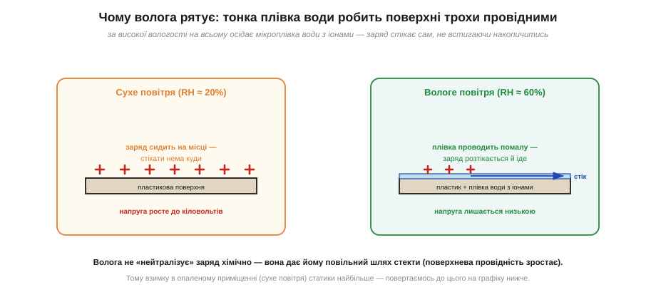
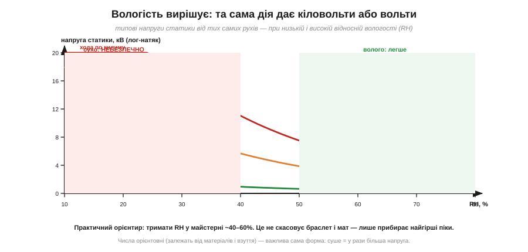
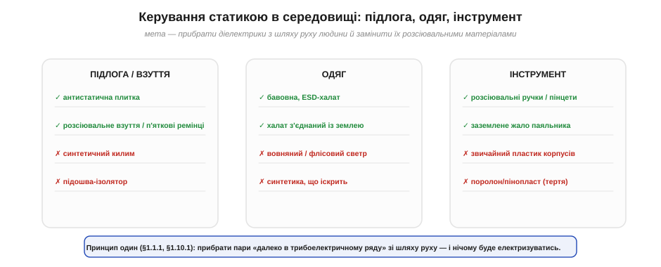

# Вологість і матеріали: керування статикою в середовищі

Почнімо з одного спостереження, знайомого кожному: **взимку статики більше**. Тріщить одяг, б'є дверна ручка, прилипає до руки пил — а влітку того майже немає. Чому? І як цим скористатися, щоб захистити робоче місце не лише браслетом і пакетами, а й самим **середовищем** — повітрям, підлогою, одягом, інструментом? Це найдешевший і найширший рівень захисту: він діє на все приміщення одразу й не залежить від того, чи згадав хтось надіти браслет.

### Чому волога рятує: тонка плівка води стікає заряд

Те, що волога допомагає стікати заряду, відоме на дотик. Розберемо механізм точно — і відразу розвіємо хибну думку, ніби вода якось «нейтралізує» заряд хімічно. Нічого подібного: вода дає заряду **повільний шлях стекти**.


*На сухій поверхні (RH ≈ 20%) заряд сидить точково — стікати нема куди, напруга росте до кіловольтів. За високої вологості (RH ≈ 60%) на всьому осідає мікроскопічна плівка води з розчиненими іонами; вона робить навіть ізолятор трохи провідним по поверхні, і заряд розтікається й стікає, не встигаючи накопичитись.*

Суть — у **поверхневій провідності**. На будь-якій поверхні за нормальної вологості осідає невидима плівка води в кілька молекулярних шарів. Чиста вода — поганий провідник, але реальна плівка містить розчинені іони (з повітря, з самого матеріалу), а отже, помалу **проводить** — це та сама [іонна провідність](book:physics/ionic-conduction), що й у розчинах. Цього досить, щоб заряд, який сів на ізолятор, не застрягав точково, а **розтікався** по плівці й повільно стікав геть. Ізолятор лишається ізолятором у товщі, але його **поверхня** стає трохи провідною — і цього достатньо, щоб статика не накопичувалась до небезпечних значень.

Коли повітря сухе, плівки немає — і рятівний шлях зникає. Заряд сидить, де народився, годинами, а напруга на тілі й на пластику росте безперешкодно. Ось чому опалене зимове приміщення (тепле повітря тримає мало вологи, відносна вологість падає до 15–25%) — це рай для статики, а вологе літо — навпаки.

### Чому саме взимку: відносна проти абсолютної вологості

Тут ховається тонкість, без якої «взимку гірше» лишається загадкою. Адже взимку повітря на вулиці вологе (туман, сніг) — то чому в кімнаті стає **сухо**? Розгадка — у різниці між **абсолютною** й **відносною** вологістю. Абсолютна — це скільки грамів води реально є в кубометрі повітря. Відносна (RH, *relative humidity*) — це яку **частку** від максимально можливого за цієї температури ця вода становить. А максимум сильно залежить від температури: тепле повітря здатне втримати **набагато більше** води, ніж холодне.

Тепер прослідкуймо шлях зимового повітря. Надворі −5 °C, повітря вологе — скажімо, 80% RH, але цих 80% від маленького «холодного» максимуму — це зовсім трохи грамів води. Це холодне повітря заходить у приміщення й **нагрівається** до +22 °C. Води в ньому скільки було, стільки й лишилось (абсолютна вологість не змінилась) — але «місткість» теплого повітря тепер у рази більша, тож та сама вода становить уже якісь жалюгідні 15–20% RH. Повітря стало **відносно сухим**, просто нагрівшись. А оскільки стікання заряду залежить саме від плівки води на поверхнях, тобто від **відносної** вологості, — узимку в опалених кімнатах статика буяє. Влітку ж тепле повітря приносить багато води й при кімнатній температурі, RH висока — і статика сама собою менша.

Звідси й чесне пояснення, чому **опалення сушить**: воно не «спалює воду», а лише піднімає температуру, через що та сама кількість води стає малою часткою від нового, більшого максимуму. І тому ж зволожувач узимку — не примха: він додає в повітря саме ту воду, якої бракує, щоб підняти відносну вологість назад до безпечних значень. Розуміючи «нагрів сам по собі знижує RH», легко передбачити найгірші для статики дні: морозні, з увімкненим на повну опаленням.

**Приклад (як нагрів обвалює відносну вологість).** Грубо: «місткість» повітря для води приблизно подвоюється на кожні ~10 °C. Холодне вуличне повітря має, скажімо, RH = 70% при −5 °C і заходить у кімнату, де нагрівається до +25 °C (це +30 °C, тобто три подвоєння місткості — у ~8 разів більше).

```
води в повітрі не додалось (абсолютна вологість та сама)
місткість зросла у ≈ 2³ = 8 разів
RH у кімнаті ≈ 70% / 8 ≈ 9%
```

Дев'ять відсотків — глибоко в «червоній» зоні статики, хоч надворі повітря було вологе. Жодної води не зникло — її лише «розбавив» нагрів. Ось чому в морозний день у теплій кімнаті статика найзліша, і саме тоді зволожувач найпотрібніший: він повертає ту воду, якої бракує, щоб підняти RH назад до ~40–60%.

### Скільки важить вологість: та сама дія — кіловольти або вольти

Наскільки сильний цей ефект? Дуже. Та сама дія за різної вологості дає напруги, що відрізняються **в десятки разів**.


*Типова напруга статики від тих самих рухів круто спадає з ростом відносної вологості (RH). Хода по килиму при RH ≈ 15% дає десятки кіловольтів, а при RH ≈ 60% — лише одиниці. Практичний орієнтир для майстерні: тримати RH у межах ~40–60%. Числа орієнтовні (залежать від матеріалів і взуття), але форма залежності стійка: суше = у рази більша напруга.*

Графік підсумовує цю тему кількісно. При сухому повітрі (ліва, червона зона) навіть антистатична підлога не гарантує спокою, а хода по килиму злітає в небезпечні десятки кіловольтів. При вологому (права, зелена зона) ті самі дії дають у рази менше. Звідси — найдешевший засіб профілактики: **зволоження повітря**. Підтримувати в майстерні відносну вологість близько 40–60% — і найгірші піки статики зникають самі, ще до браслета й мата.

Важливе застереження, щоб не виникло хибної безпеки: вологість **не скасовує** решту дисципліни. Вона прибирає піки, але не гарантує, що заряду не буде зовсім — особливо локально, на свіжовідірваній плівці. Тому вологість — це **додатковий** рубіж, а не заміна [браслету й заземленому місцю](book:electronics/antistatic-workplace) і [пакуванню деталей](book:electronics/esd-packaging). Захист завжди багатошаровий.

**Приклад (як вологість міняє напругу від ходи).** Хай при RH = 20% хода по килиму дає 15 кВ, а емпірично кожні +20% вологості зменшують напругу приблизно в 4 рази. Що буде при RH = 60%?

```
від 20% до 60% — це два кроки по +20%  →  поділ на 4 двічі
V(60%) ≈ 15 кВ / 4 / 4
V(60%) ≈ 15 кВ / 16
V(60%) ≈ 0.9 кВ
```

Майже кіловольт замість п'ятнадцяти — у понад **п'ятнадцять разів** менше, від самої лише вологості. Менше кіловольта — це вже нижче порога відчуття, та й для багатьох компонентів значно безпечніше. Зволожувач повітря іноді рятує плату дієвіше, ніж дорогий браслет.

> 🔧 **Навіщо це.** Контроль вологості — найдешевший спосіб «опустити» весь рівень статики в приміщенні. Узимку зволожувач у майстерні — не комфорт, а інструмент захисту електроніки. Але є й зворотний бік: задерти вологість «про запас» до 80%+ не можна — це загрожує конденсатом і корозією. Тому й цілять у вікно ~40–60%: статика вже стікає, а вологи ще не настільки багато, щоб шкодити.

### Керування статикою через матеріали середовища

Другий важіль середовища — **матеріали**, з якими стикається людина, рухаючись приміщенням. Логіка пряма й виростає з [трибоелектричної природи статики](book:physics/triboelectricity): прибрати зі шляху руху ті пари матеріалів, що стоять **далеко** в трибоелектричному ряду й сильно електризуються, замінивши їх **розсіювальними**.


*Три фронти середовища. **Підлога/взуття:** антистатична плитка й розсіювальне взуття (з п'ятковими ремінцями) — так, синтетичний килим і підошва-ізолятор — ні. **Одяг:** бавовна й заземлений ESD-халат — так, вовняний/флісовий светр і синтетика — ні. **Інструмент:** розсіювальні ручки й заземлене жало паяльника — так, звичайний пластик і поролон — ні.*

Розгляньмо три фронти. **Підлога й взуття** — головний генератор «ходячої» статики, де [тертя підошви об покриття](book:physics/triboelectricity) щокроку напомповує тіло зарядом: антистатична (розсіювальна) підлога й спеціальне взуття або п'яткові ремінці перетворюють кожен крок зі джерела заряду на шлях його стікання в землю. Звичайний синтетичний килим і підошва-ізолятор роблять протилежне. **Одяг** — друга поверхня, що постійно треться: бавовна (ближче до середини ряду) і заземлений ESD-халат безпечні, а вовняний чи флісовий светр і синтетика, що іскрять, — небезпечні (тому в чистих зонах халат ще й з'єднують із землею). **Інструмент** — те, що в руках біля самого виробу: розсіювальні ручки пінцетів і викруток, заземлене жало паяльника — добре; звичайний пластиковий корпус інструмента й, особливо, поролон/пінопласт (що шалено електризуються від тертя) — погано.

Зверни увагу на логіку **взуття з п'ятковим ремінцем** (heel strap) — вона гарно показує, як середовище доповнює браслет. Браслет прив'язує тебе до столу шнуром, тож ходити в ньому незручно. А коли треба рухатись приміщенням (узяти деталь, підійти до приладу), тіло знову набирає заряд від ходи. П'ятковий ремінець розв'язує це: він з'єднує тіло через підошву з **розсіювальною підлогою**, тож заряд стікає на кожному кроці, поки людина просто ходить. Виходить «мобільне заземлення»: браслет — поки сидиш за столом, підлога+ремінець — поки рухаєшся. Разом вони не лишають тілу шансу накопичити кіловольти ні в спокої, ні в русі.

Корисно бачити, що тут діє **той самий принцип повільного стоку**, що й [мегаомний резистор у браслеті](book:electronics/antistatic-workplace). Розсіювальна підлога й взуття мають **не нульовий**, а помірно великий опір до землі — рівно з тих самих двох причин: заряд має стікати швидко, але не настільки, щоб підлога стала небезпечною при контакті з мережевою напругою. Тому «антистатична підлога» — це не металевий лист (він був би і слизьким, і небезпечним), а матеріал із розрахованою провідністю, що відіграє роль розподіленого мегаомного резистора під ногами. Так само й розсіювальний одяг: він не металізований, а лише достатньо провідний, щоб заряд на ньому не застрягав.

Підсумовуючи логіку матеріалів, зведімо її до одного питання, яке варто ставити до кожної речі в майстерні: **«куди з неї дінеться заряд?»** Якщо відповідь «нікуди — застрягне» (ізолятор: звичайний пластик, синтетика, пінопласт), річ небезпечна біля електроніки. Якщо «стече помалу в землю» (розсіювальний матеріал, з'єднаний зі спільною землею), річ безпечна. Усе різноманіття антистатичних мір — підлога, взуття, халати, мати, ручки інструменту, тара — це різні відповіді на це саме питання. І саме тому середовище, побудоване за цим принципом, працює надійніше за будь-який окремий гаджет: воно прибирає **ізолятори зі шляху заряду** скрізь, а не лише там, де людина згадала про статику.

> 🔧 **Навіщо це.** Середовище — це захист, що працює **сам**, без щоденних рішень людини. Браслет можна забути надіти; антистатична підлога стікає заряд із кожного, хто по ній іде, незалежно від того, згадав він про статику чи ні. Тому в серйозній майстерні дбають не лише про стіл, а про всю «екосистему»: клімат (вологість), підлогу, одяг, інструмент. Кожен шар окремо неідеальний, але разом вони закривають ту саму [сліпу зону відчуттів](book:physics/body-charge), у якій людина безпорадна. І ще: усі ці заходи здешевлюють головне — вони зменшують **залежність від людської дисципліни**, а отже, від людських помилок.

Отже, два важелі середовища працюють в одному напрямку. Волога створює **поверхневу плівку**, що стікає заряд, тож суше повітря дає в рази більшу статику; ключ — у відмінності відносної й абсолютної вологості (нагрів сам по собі обвалює RH, тому взимку найгірше), а орієнтир для майстерні — RH ~40–60%. Правильні **матеріали** підлоги, одягу й інструменту прибирають генератори заряду зі шляху руху людини, відповідаючи на одне питання — «куди з речі дінеться заряд». Це найширший рівень захисту, бо діє на все приміщення відразу й не залежить від уваги конкретної людини, а отже, найменше потерпає від людських помилок.
