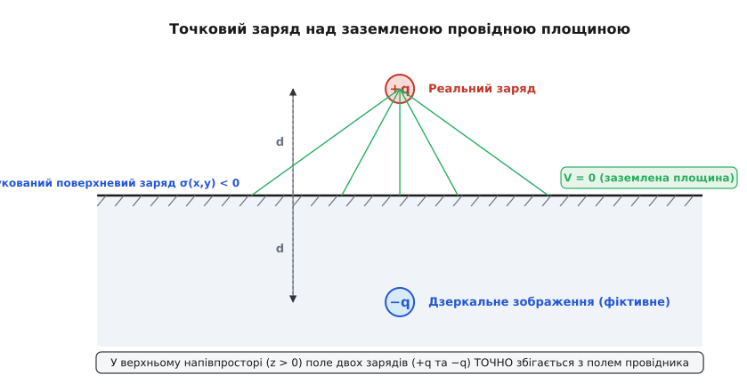
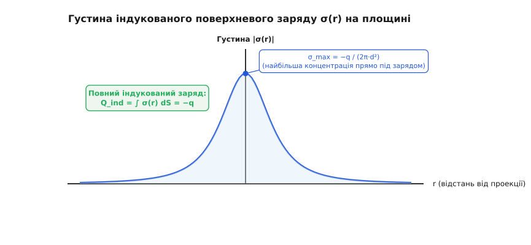
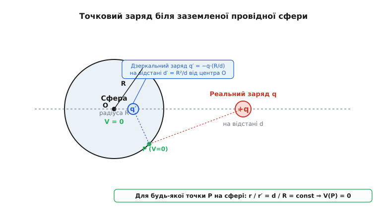
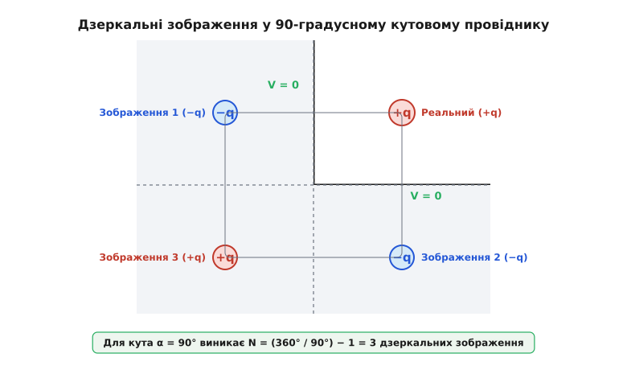
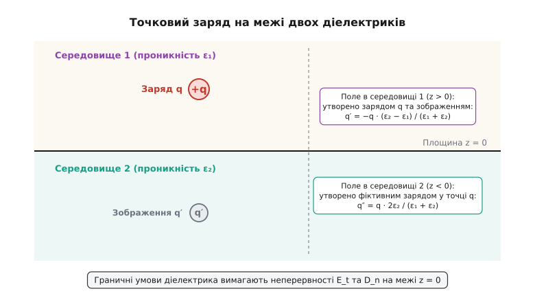

# Метод дзеркальних зображень в електродинаміці

<preknowlist>
- [Закон Кулона](book:physics/electromagnetism/coulomb-law) — сила взаємодії точкових зарядів та залежність від квадрата відстані.
- [Електричний потенціал](book:physics/electromagnetism/electric-potential) — зв'язок напруженості та потенціалу, еквіпотенціальні поверхні та граничні умови на провідниках.
- [Електричне поле](book:physics/electromagnetism/electric-field) — вектор напруженості, лінії поля та принцип суперпозиції.
</preknowlist>

Коли точковий електричний заряд наближається до металевої поверхні, вільні електрони провідника під дією кулонівського поля негайно починають перерозподілятися. На поверхні виникає індукований поверхневий заряд, розподілений зі складною, нерівномірною густиною. Розрахунок підсумкового електричного поля через пряме інтегрування за всіма цими зміщеними мікроскопічними зарядами вимагає розв'язання важкого інтегрального рівняння, оскільки сам розподіл поверхневого заряду наперед невідомий. Метод дзеркальних зображень (від латинського *imago* — образ, відбиток) пропонує елегантне й строге вирішення цієї проблеми: замість обчислення невідомих поверхневих зарядів реального провідника ми подумки прибираємо сам провідник, а його фізичний вплив на зовнішній простір замінюємо одним або кількома точковими «дзеркальними» зарядами, розташованими у фіктивних точках за межами області дослідження.

### Крайова задача електростатики та ідея фіктивного заряду

Усі задачі електростатики за участю провідних тіл належать до класу так званих граничних або крайових задач математичної фізики. Всередині діелектричного або порожнього середовища електричний потенціал `V` описується рівнянням Пуассона (`∇²V = -ρ / ε₀`), де `ρ` — густина вільних зарядів у розглядуваній точці, а `ε₀` — електрична стала. У тих областях простору, де вільні заряди відсутні, рівняння Пуассона спрощується до диференціального рівняння Лапласа в частинних похідних:

```
∇²V = (∂²V / ∂x²) + (∂²V / ∂y²) + (∂²V / ∂z²) = 0
```

На поверхні металевого провідника потенціал вимагається дорівнювати строго сталій величині (`V = V₀`), а у випадку заземленого провідника — нулю (`V = 0`). Це випливає з самих фізичних властивостей провідника у стаціонарному стані: якби між двома точками поверхні існувала різниця потенціалів, у металі виникли б потужні тангенціальні електричні сили, які спричинили б миттєвий поверхневий струм до повного вирівнювання потенціалу. Час цієї електронної релаксації у гарних провідниках (як-от мідь чи срібло) надзвичайно малий і становить порядок `τ ≈ 10⁻¹⁹` секунди. Гранична умова, за якої потенціал фіксується на всій замкненій межі області, у математичній фізиці називається **крайовою умовою Діріхле** (*Dirichlet boundary condition*).

Головне математичне обґрунтування методу дзеркальних зображень спирається на фундаментальну **теорему єдиності розв'язку рівняння Пуассона** (Dirichlet uniqueness theorem). Згідно з цією теоремою, якщо всередині деякого об'єму задано розташування всіх вільних зарядів, а на замкненій границі цього об'єму строго зафіксовано значення потенціалу `V`, то розв'язок рівняння Пуассона або Лапласа `V(x, y, z)` усередині даного об'єму існує і є **єдиним**.

Фізичний зміст теореми єдиності в контексті нашого методу полягає у наступному: математичному рівнянню та фізичному полю в області дослідження абсолютно байдуже, **яке саме фізичне джерело** створює задані граничні умови на межі. Це може бути реальний тонкий шар індукованих електронів, що розлився по поверхні металевого листа, або це може бути комбінація фіктивних точкових зарядів, розташованих поза нашою робочою областю. Якщо ви змогли підібрати таку фіктивну конфігурацію зарядів усередині геометричного об'єму провідника, яка розрахована за законом Кулона і забезпечує на поверхні той самий потенціал `V = 0`, то розраховане поле у всій зовнішній області буде **абсолютно тотожним** полю справжнього провідника.

> 📜 **Хто першим здогадався замінити провідник фіктивними зарядами?** Метод створив у 1845 році видатний шотландський фізик Вільям Томсон (майбутній лорд Кельвін), який помітив вражаючу геометричну аналогію між оптичним відбиттям світла у дзеркалі та еквіпотенціальними поверхнями кулонівських полів. Докладніше про історію відкриття та листування Томсона з Жозефом Ліувіллем читайте у вставці: [Лорд Кельвін і народження методу дзеркальних зображень](book:physics/electromagnetism/image-theory/hist-kelvin.md).

Метод дзеркальних зображень — це не наближена евристика чи зручна ілюстрація, а **строгий точний метод**, який працює за дотримання трьох обов'язкових правил:
1. Усі дзеркальні заряди повинні розташовуватися **виключно поза** тією областю простору, де ми шукаємо електричне поле (тобто усередині об'єму, який у реальній задачі займає провідник чи інше середовище). Якщо дзеркальний заряд потрапить у робочу область, він створить там хибну сингулярність (неіснуючий у задачі точковий заряд).
2. Сумарний потенціал від реальних та дзеркальних зарядів на поверхні провідника має точно відповідати заданій граничній умові (`V = V₀`).
3. Загальний заряд дзеркальної системи має узгоджуватися з повним індукованим зарядом або фіксованим потенціалом провідного тіла.

---

### Точковий заряд над заземленою провідною площиною

Розглянемо найвідомішу й найважливішу конфігурацію: позитивний точковий заряд `+q` знаходиться на відстані `d` від нескінченної заземленої провідної площини. Розташуємо систему координат так, щоб площина провідника збігалася з площиною `z = 0`, а заряд `+q` знаходився на осі `z` у точці з координатами `(0, 0, d)`. Ми шукаємо електричне поле лише у верхньому напівпросторі `z > 0`.

Границя `z = 0` є заземленим провідником, тому гранична умова має вигляд `V(x, y, 0) = 0`.


*У верхньому напівпросторі (z > 0) силові лінії реального заряду +q та дзеркального заряду −q перпендикулярні до площини z = 0. Усі лінії закінчуються на поверхні провідника, забезпечуючи рівність потенціалу нулю.*

Щоб задовольнити цю граничну умову, приберемо провідну площину і розмістимо у нижньому напівпросторі `z < 0` (у точці з координатами `(0, 0, -d)`) фіктивний дзеркальний заряд `-q`.

Перевіримо потенціал у довільній точці `P(x, y, z)` верхнього напівпростору `z > 0`. За принципом суперпозиції потенціал є сумою потенціалів від реального та дзеркального зарядів:

```
V(x, y, z) = [q / (4·π·ε₀·r₁)] − [q / (4·π·ε₀·r₂)]

r₁ = √[x² + y² + (z − d)²]      [відстань від реального заряду +q]
r₂ = √[x² + y² + (z + d)²]      [відстань від дзеркального заряду −q]
```

Підставимо у цю формулу точку, що лежить прямо на площині `z = 0`:

```
r₁|_(z=0) = √[x² + y² + (−d)²] = √[x² + y² + d²]
r₂|_(z=0) = √[x² + y² + d²]

V(x, y, 0) = [q / (4·π·ε₀·√[x² + y² + d²])] − [q / (4·π·ε₀·√[x² + y² + d²])] = 0
```

Умова `V(x, y, 0) = 0` виконується для абсолютно всіх точок `(x, y)` на площині! Згідно з теоремою єдиності, отримана формула для `V(x, y, z)` описує **істинне електричне поле** у верхньому напівпросторі `z > 0`.

Важливо наголосити: у нижньому напівпросторі `z < 0` у реальній задачі знаходиться металевий провідник, де поле строго дорівнює нулю (`E = 0`, `V = 0`). Формула з дзеркальним зарядом справедлива **тільки для `z > 0`**. Спроба застосувати її для `z < 0` була б грубою помилкою, оскільки дзеркальний заряд знаходиться саме там і створював би хибну сингулярність у фізичному провіднику.

Знайдемо також компоненти вектора напруженості електричного поля `E⃗ = -∇V` у верхньому напівпросторі. Для цього продиференціюємо потенціал `V(x, y, z)` по координатах `x`, `y` та `z`:

```
E_x = (q · x / 4·π·ε₀) · [ 1/r₁³ − 1/r₂³ ]
E_y = (q · y / 4·π·ε₀) · [ 1/r₁³ − 1/r₂³ ]
E_z = (q / 4·π·ε₀) · [ (z − d)/r₁³ − (z + d)/r₂³ ]
```

Зверніть увагу: прямо на металевій площині `z = 0` маємо `r₁ = r₂`, тож тангенціальні компоненти напруженості перетворюються на нуль: `E_x(z=0) = 0`, `E_y(z=0) = 0`. Лишається тільки нормальна компонента `E_z`, що повністю узгоджується з фізичним інваріантом: силові лінії електричного поля завжди впірнають у провідник під строго прямим кутом `90°`.

---

### Густина індукованого заряду та сила притягання

Знаючи нормальну компоненту електричного поля біля поверхні провідника, ми можемо розрахувати точний розподіл індукованого поверхневого заряду на металевій площині.

З граничних умов електростатики на межі «метал–вакуум» відомо, що нормальна компонента напруженості пов'язана з поверхневою густиною заряду `σ` класичним співвідношенням:

```
E_z|_(z=0) = σ / ε₀  ⇒  σ(x, y) = ε₀ · E_z|_(z=0) = −ε₀ · (∂V / ∂z)|_(z=0)
```

Підставимо `z = 0` у вираз для `E_z`:

```
E_z|_(z=0) = (q / 4·π·ε₀) · [ −d/(x² + y² + d²)^(3/2) − d/(x² + y² + d²)^(3/2) ]
           = −(2·q·d) / [4·π·ε₀ · (x² + y² + d²)^(3/2)]
           = −(q·d) / [2·π·ε₀ · (r² + d²)^(3/2)]
```

де `r = √(x² + y²)` — радіальна відстань по площині від проекції заряду (від точки `(0, 0, 0)`).

Таким чином, густина індукованого заряду становить:

```
σ(r) = −(q · d) / [2·π · (r² + d²)^(3/2)]
```


*Густина індукованого заряду досягає максимального за модулем значення σ_max = −q / (2πd²) прямо під зарядом (при r = 0) і плавно спадає при віддаленні. Повний інтеграл по всій площині строго дорівнює −q.*

Знак мінус показує, що індукований поверхневий заряд завжди має знак, протилежний до знаку реального заряду `+q`. Найбільша концентрація електронів виникає прямо під зарядом при `r = 0`, де густина досягає пікового значення `σ_max = -q / (2·π·d²)`. Зі збільшенням відстані `r` густина спадає як `1 / r³`.

Знайдемо сумарний індукований заряд `Q_ind`, проінтегрувавши густину `σ(r)` по всій нескінченній площині у циліндричних координатах:

```
Q_ind = ∫₀^∞ σ(r) · 2·π·r dr
      = −q·d · ∫₀^∞ [r / (r² + d²)^(3/2)] dr
      = −q·d · [ −1 / √(r² + d²) ]|_0^∞
      = −q·d · [ 0 − (−1/d) ] = −q
```

Сумарний індукований заряд на площині **точно дорівнює за модулем і протилежний за знаком** реальному заряду! Це фундаментальний фізичний результат: абсолютно всі силові лінії, що виходять із позитивного заряду `+q`, упершись у заземлену провідну площину, закінчуються на її індукованих від'ємних зарядах.

**Дипольний момент індукованого заряду.** Якщо розглядати систему здалеку (при `r ≫ d`), сукупність реального заряду `+q` та індукованого поверхневого заряду `-q` на площині поводиться як електричний диполь із дипольним моментом `p = 2·q·d`, спрямованим перпендикулярно до площини. Це пояснює, чому випромінювання та поля від зарядів над провідником на великих відстанях спадають не за законом точкового заряду `1/r²`, а набагато швидше — за дипольним законом `1/r³`.

**Сила взаємодії.** Оскільки поле у верхньому напівпросторі абсолютно ідентичне полю від пари зарядів `+q` та `-q`, сила механічного притягання, з якою провідна площина діє на заряд `+q`, дорівнює кулонівській силі між реальним та дзеркальним зарядами, розділеними відстаню `2·d`:

```
F = (1 / 4·π·ε₀) · [q · |−q| / (2·d)²] = q² / (16·π·ε₀·d²)
```

Зверніть увагу на двійку у знаменнику: відстань між реальним і дзеркальним зарядами дорівнює `2d`, тому квадрат відстані дає `4d²`, а коефіцієнт `1/(4·π·ε₀)` перетворюється на `1/(16·π·ε₀)`. Сила притягання до провідної площини спадає з відстанню як **обернений квадрат відстані від площини** (`F ∝ 1/d²`).

> 🔧 **Навіщо це в електронній інженерії.** Кожна струмопровідна доріжка на друкованій платі (PCB), розташована над суцільним шаром заземлення (Ground Plane), утворює так звану мікросмужкову лінію (microstrip line). Електричне поле сигнального провідника замикається на шар заземлення точно за законами дзеркальних зображень. Саме цей індукований шар протилежного заряду визначає погонну ємність лінії, її хвильовий опір `Z₀` та коефіцієнт послаблення перехресних завад (crosstalk).

---

### Пастка 1/2: енергія поля та робота переміщення

При розрахунку енергетичних співвідношень у системі «заряд + провідник» часто припускаються критичної помилки, прирівнюючи потенціальну енергію заряду над площиною до енергії двох вільних точкових зарядів `+q` та `-q`.

Обчислимо роботу `W`, яку необхідно виконати зовнішнім силам, щоб повільно перемістити заряд `+q` з нескінченності у точку на відстані `d` від заземленої площини:

```
W = ∫_∞^d (−F) dz = ∫_∞^d [−q² / (16·π·ε₀·z²)] dz = q² / (16·π·ε₀·d)
```

Порівняємо цей результат із потенціальною енергією взаємодії `U_two` двох реальних фіксованих точкових зарядів `+q` та `-q` на відстані `2·d`:

```
U_two = −q² / (4·π·ε₀ · (2·d)) = −q² / (8·π·ε₀·d)
```

Зверніть увагу: робота `W` у випадку провідної площини дорівнює **половині** енергії системи двох вільних зарядів:

```
W = (1 / 2) · |U_two|
```

Чому виникає цей коефіцієнт `1/2`?
1. **Геометрична причина:** Електричне поле існує **тільки в одному напівпросторі** (`z > 0`). У нижньому напівпросторі (`z < 0`) поле всередині провідника дорівнює нулю (`E = 0`). Оскільки об'ємна густина енергії електричного поля дорівнює `w = (1/2)·ε₀·E²`, інтеграл по всьому простору для провідника дає вдвічі менше значення, ніж для двох зарядів у вакуумі без провідника:

```
U_field = ∫_(z>0) (1/2)·ε₀·E² dV = (1/2) · ∫_(весь простір) (1/2)·ε₀·E² dV
```

2. **Динамічна причина:** Коли ми рухаємо реальний заряд `+q` до площини, фіктивний дзеркальний заряд `-q` також рухається йому назустріч у фіктивному просторі. Насправді ж у цей час реальні електрони в металі здійснюють роботу, перерозподіляючись по поверхні провідника, що супроводжується виділенням тепла або зміною енергії джерела заземлення.

**Обчислений приклад.** Заряд `q = 2 мкКл` розміщено на відстані `d = 5 см` (0.05 м) від заземленої металевої пластини у вакуумі. Знайдемо силу притягання та роботу, необхідну для віддалення заряду на нескінченність.

```
q = 2 × 10⁻⁶ Кл
d = 0.05 м
ε₀ ≈ 8.854 × 10⁻¹² Кл²/(Н·м²)
k = 1 / (4·π·ε₀) ≈ 8.99 × 10⁹ Н·м²/Кл²

F = k · q² / (4 · d²)
F = (8.99 × 10⁹) · (2 × 10⁻⁶)² / (4 · (0.05)²)
F = (8.99 × 10⁹) · (4 × 10⁻¹²) / (0.01)
F ≈ 3.596 Н

W = k · q² / (4 · d) = F · d = 3.596 · 0.05 ≈ 0.1798 Дж
```

Сила притягання становить приблизно **3.6 ньютона** — це відчутна сила, еквівалентна вазі вантажу масою 360 грамів!

---

### Точковий заряд біля заземленої провідної сфери

Метод дзеркальних зображень працює не лише для площин, а й для сферичних провідних поверхонь. Розглянемо заземлену металеву сферу радіуса `R` з центром у початку координат `O`. Зовні сфери на відстані `d` від її центра (`d > R`) знаходиться точковий заряд `+q`.

Ми шукаємо поле зовні сфери (`r ≥ R`), де гранична умова вимагає, щоб потенціал на поверхні сфери дорівнював нулю: `V(r = R) = 0`.


*Дзеркальний заряд q′ знаходиться всередині сфери у точці сферичного інверсного відображення d′ = R²/d. Для будь-якої точки P на поверхні сфери відношення відстаней до реального та дзеркального зарядів залишається сталою величиною r/r′ = d/R.*

Приберемо сферу і спробуємо знайти таке розташування та величину дзеркального заряду `q'`, щоб потенціал на радіусі `R` дорівнював нулю. З міркувань симетрії дзеркальний заряд повинен лежати на лінії, що з'єднує центр сфери `O` та заряд `q`, усередині сфери на відстані `d'` від центра `O`.

Виберемо довільну точку `P` на поверхні сфери. Відстань від точки `P` до реального заряду позначимо `r₁`, а до дзеркального — `r₂`. Потенціал у точці `P` дорівнює:

```
V(P) = (1 / 4·π·ε₀) · [ (q / r₁) + (q' / r₂) ] = 0
```

Щоб потенціал `V(P)` дорівнював нулю у **всіх** точках поверхні сфери, необхідно, щоб співвідношення відстаней `r₁ / r₂` було постійним для будь-якої точки на сфері. З геометричної теореми про подібність трикутників випливає, що це можливо тоді і тільки тоді, коли точка розташування дзеркального заряду є **сферичною інверсією** точки розташування реального заряду:

```
d' = R² / d              [відстань дзеркального заряду від центра сфери]
q' = −q · (R / d)        [величина дзеркального заряду]
```

Оскільки `d > R`, то `d' < R` — дзеркальний заряд завжди знаходиться **всередині** сфери, тобто поза областю розрахунку поля (`r > R`), що строго задовольняє вимогам теореми єдиності!

Зверніть увагу: за модулем дзеркальний заряд `|q'|` завжди менший за реальний заряд `q`, оскільки `R / d < 1`. Коли заряд `q` віддаляється на нескінченність (`d → ∞`), дзеркальний заряд прямує до центра сфери (`d' → 0`), а його величина прямує до нуля (`q' → 0`). Навпаки, коли заряд наближається до самої поверхні сфери (`d → R`), дзеркальний заряд зміщується до внутрішньої поверхні (`d' → R`), а його величина наближається до `-q`, що в границі дає задачу про заземлену площину.

**Повний індукований заряд сфери.** Якщо проінтегрувати густину індукованого поверхневого заряду по всій поверхні заземленої сфери, сумарний індукований заряд виявиться точно рівним величині дзеркального заряду:

```
Q_ind = q' = −q · (R / d)
```

> 🧮 **Бажаєте побачити строге виведення теореми єдиності та детальний геометричний доказ сферичної інверсії?** Зверніться до нашої математичної вставки: [Строге математичне обґрунтування: теорема єдиності та сферична інверсія](book:physics/electromagnetism/image-theory/math-uniqueness.md).

---

### Ізольована та заряджена сфера: додавання другого зображення

А що робити, якщо сфера **не заземлена**, а є ізольованим провідником, який має власний заданий заряд `Q` (або є незарядженим, `Q = 0`)?

Коли сфера ізольована, її потенціал `V_s` на поверхні більше не дорівнює нулю, але залишається постійним по всій поверхні. Крім того, її сумарний заряд має бути строго рівним `Q`.

Для вирішення цієї задачі застосовують метод повторного зображення:
1. Спочатку вводимо перший дзеркальний заряд `q' = -q·(R/d)` у точці `d' = R²/d`, щоб зробити поверхню сфери еквіпотенціальною з потенціалом `V = 0`. Цей заряд індукує на сфері заряд `q'`.
2. Оскільки ізольована сфера повинна мати загальний заряд `Q`, нам бракує заряду `Q - q' = Q + q·(R/d)`.
3. Щоб додати цей заряд і **не порушити еквіпотенціальність** поверхні сфери, ми поміщаємо **другий дзеркальний заряд** `q''` строго у **центр сфери** `O` (`r = 0`):

```
q'' = Q − q' = Q + q · (R / d)
```

Оскільки точковий заряд, поміщений у центр сфери, створює на її поверхні радіусу `R` строго однаковий (сферично симетричний) потенціал `V₂ = q'' / (4·π·ε₀·R)`, поверхня сфери залишається еквіпотенціальною, а її підсумковий потенціал стає рівним:

```
V_s = q'' / (4·π·ε₀·R) = [Q + q·(R/d)] / (4·π·ε₀·R)
```

Таким чином, поле зовні незарядженої ізольованої сфери (`Q = 0`) описується **двома** дзеркальними зарядами всередині сфери:
* `q' = -q·(R/d)` у точці `d' = R²/d`;
* `q'' = +q·(R/d)` у точці `r = 0` (у центрі).

**Сила взаємодії з незарядженою сферою.** Сумарна сила, що діє на заряд `q` з боку незарядженої ізольованої сфери, дорівнює векторній сумі сил притягання до `q'` та відштовхування від `q''`:

```
F = (q / 4·π·ε₀) · [ (q' / (d − d')²) + (q'' / d²) ]
```

Підставивши вирази для `q'` та `d'`, після алгебраїчних перетворень отримуємо:

```
F = −[q² / (4·π·ε₀·R²)] · [ (R/d)³ / (1 − (R/d)²)² ]
```

Знак мінус означає, що **незаряджене провідне тіло завжди притягує до себе будь-який точковий заряд**! На великих відстанях (`d ≫ R`) ця сила спадає пропорційно `1/d⁵` (поведінка наведеного диполя), а при наближенні заряду до самої поверхні сфери (`d → R`) сила зростає лавиноподібно як `1/(d - R)²`, перетворюючись на силу притягання до площини.

---

### Перетинні провідні площини: кутові відбивачі

Якщо заряд розміщено між двома провідними площинами, що перетинаються під кутом `α`, одного дзеркального зображення стає недостатньо. Зображення реального заряду в першій площині створює ненульовий потенціал на другій площині, тому його доводиться знову відбивати відносно другої площини, і навпаки.


*Для кута 90° між заземленими стінками виникає система з 3 дзеркальних зарядів. Сумарне поле у робочому квадранті дорівнює суперпозиції полів одного реального та трьох фіктивних зарядів.*

Скінченна кількість дзеркальних зображень утворюється лише тоді, коли кут перетину `α` є цілим дільником 180 градусів (або `π` радіан):

```
α = π / n = 180° / n      (де n = 1, 2, 3, ...)
```

У цьому випадку загальна кількість дзеркальних зображень `N` дорівнює:

```
N = (360° / α) − 1 = 2·n − 1
```

Розглянемо випадок прямого кута `α = 90°` (`n = 2`). Кількість зображень `N = (360/90) - 1 = 3`.

Якщо реальний заряд `+q` розміщено у першому квадранті в точці з координатами `(x₀, y₀)` над двома заземленими півплощинами `x = 0` (`y ≥ 0`) та `y = 0` (`x ≥ 0`), то системи з трьох дзеркальних зарядів мають такі параметри:
1. Заряд `-q` у точці `(-x₀, y₀)` — дзеркальне відбиття реального заряду від стінки `x = 0`.
2. Заряд `-q` у точці `(x₀, -y₀)` — дзеркальне відбиття реального заряду від стінки `y = 0`.
3. Заряд `+q` у точці `(-x₀, -y₀)` — повторне відбиття дзеркальних зарядів, яке компенсує їхній взаємний вплив у кутку.

Усі чотири заряди (1 реальний та 3 дзеркальних) розташовані у вершинах прямокутника зі сторонами `2·x₀` та `2·y₀`. Потенціал у першому квадранті `x > 0, y > 0` описується сумою чотирьох кулонівських доданків:

```
V(x,y,z) = (q / 4·π·ε₀) · [ 1/r₁ − 1/r₂ − 1/r₃ + 1/r₄ ]

r₁ = √[(x − x₀)² + (y − y₀)² + z²]      [від реального заряду +q]
r₂ = √[(x + x₀)² + (y − y₀)² + z²]      [від дзеркального заряду −q]
r₃ = √[(x − x₀)² + (y + y₀)² + z²]      [від дзеркального заряду −q]
r₄ = √[(x + x₀)² + (y + y₀)² + z²]      [від дзеркального заряду +q]
```

Легко переконатися, що при `x = 0` маємо `r₁ = r₂` та `r₃ = r₄`, тому `V(0, y, z) = 0`. Аналогічно при `y = 0` маємо `r₁ = r₃` та `r₂ = r₄`, тому `V(x, 0, z) = 0`.

Якщо кут `α` не ділить `180°` націло (наприклад, `α = 70°`), послідовні відбиття не «замикаються» у коло, створюючи нескінченний ряд зображень, або дзеркальні заряди потрапляють у робочу область, що робить класичний метод дзеркальних зображень незастосовним.

---

### Межа двох діелектриків: заломлення силових ліній

Метод дзеркальних зображень можна узагальнити й на задачі з діелектричними середовищами. Розглянемо дві нескінченні напівнескінченні діелектричні області, що межують по площині `z = 0`. Верхнє середовище 1 має відносну діелектричну проникність `ε₁`, а нижнє середовище 2 — проникність `ε₂`.

Точковий заряд `q` розміщено у середовищі 1 на відстані `d` над межею розподілу (у точці `(0, 0, d)`).


*На межі двох діелектриків силові лінії заломлюються. Для розрахунку поля у середовищі 1 використовують реальний заряд q та дзеркальне зображення q′, а для поля у середовищі 2 — один еквівалентний заряд q″.*

На відміну від металевого провідника, діелектрик не повністю екранує поле. На межі `z = 0` мають виконуватися класичні граничні умови електродинаміки діелектриків:
1. Неперервність тангенціальних компонент напруженості: `E_t1 = E_t2`.
2. Неперервність нормальних компонент вектора електричного зсуву: `D_n1 = D_n2` `⇒` `ε₁ · E_z1 = ε₂ · E_z2`.

Щоб задовольнити ці граничні умови, висувають витончену гіпотезу:
* **Поле у середовищі 1 (`z > 0`)** створюється початковим зарядом `q` у точці `(0, 0, d)` та дзеркальним зарядом `q'` у точці `(0, 0, -d)` (у середовищі 2).
* **Поле у середовищі 2 (`z < 0`)** створюється одним фіктивним точковим зарядом `q''`, який розміщено у точці початкового заряду `(0, 0, d)` (у середовищі 1), але за відсутності межі розділу (все середовище заповнене діелектриком `ε₂`).

Підставивши ці вирази у граничні умови на площині `z = 0`, отримуємо систему алгебраїчних рівнянь для невідомих зарядів `q'` та `q''`:

```
q − q' = q''                           [з неперервності тангенціального поля E_t]
ε₁ · (q + q') = ε₂ · q''               [з неперервності нормального зсуву D_n]
```

Розв'язавши цю систему, маємо:

```
q' = −q · [ (ε₂ − ε₁) / (ε₁ + ε₂) ]    [величина дзеркального заряду для середовища 1]
q'' = q · [ (2·ε₁) / (ε₁ + ε₂) ]       [величина еквівалентного заряду для середовища 2]
```

Проаналізуємо граничні випадки цієї формули:
* **Середовище 2 є ідеальним провідником (`ε₂ → ∞`):**
  Отримуємо `q' = -q` та `q'' = 0`. Це повністю збігається з нашою базовою задачею для заземленого металу!
* **Середовища однакові (`ε₁ = ε₂`):**
  Отримуємо `q' = 0` та `q'' = q`. Дзеркальне зображення зникає, а поле залишається звичайним кулонівським полем у однорідному середовищі.
* **`ε₂ > ε₁` (заряд у повітрі біля води або скла):**
  Дзеркальний заряд `q'` має знак, протилежний до `q`. Реальний заряд притягується до діелектрика!
* **`ε₂ < ε₁` (заряд у склі біля межі з повітрям):**
  Дзеркальний заряд `q'` має однаковий знак із `q`. Заряд відштовхується від межі з менш щільним діелектриком!

Фізична причина притягання чи відштовхування полягає у поляризації зв'язаних зарядів діелектрика. На межі діелектриків виникає шар поляризаційного поверхневого заряду `σ_b = P_n1 - P_n2`, сумарний вплив якого строго еквівалентний дзеркальному заряду `q'`.

---

### Практичні застосування в сучасній фізиці та інженерії

Метод дзеркальних зображень — це не лише підручникова класика XIX століття. Він залишається потужним розрахунковим інструментом у найсучасніших галузях високочастотної інженерії, нанотехнологій та фізики твердого тіла.

#### 1. Монопольні антени та радіозв'язок
У радіотехніці чвертьхвильова вертикальна монопольна антена (whip antenna) встановлюється безпосередньо над металевим корпусом автомобіля або заземленою провідною площиною. Згідно з методом дзеркальних зображень, провідна земля створює симетричне дзеркальне зображення антени під площиною. У результаті комбінація реального монополя довжиною `L = λ/4` та його дзеркального зображення випромінює в верхній напівпростір **абсолютно так само, як симетричний півхвильовий диполь** довжиною `2L = λ/2` у вільному просторі. Це дає змогу зменшити габарити антенних систем удвічі, зберігши діаграму спрямованості та узгодження імпедансу.

#### 2. Захисні троси високовольтних ліній електропередачі (ЛЕП)
При проектуванні ЛЕП над фазними проводами високої напруги натягують заземлені грозозахисні троси. За допомогою методу дзеркальних зображень інженери-енергетики розраховують ємнісну матрицю грозозахисних тросів відносно землі та фазних провідників. Дзеркальні зображення фазних проводів у заземленій землі дозволяють строго розрахувати захисний кут екранування від прямих ударів блискавки та запобігти аварійним вимкненням мережі.

```
+-----------------------------------------------------------------------+
|  📊 Порівняльна таблиця конфігурацій дзеркальних зображень            |
+------------------------------------+----------------------------------+
| Геометрія провідника / межі        | Параметри дзеркальних зарядів    |
+------------------------------------+----------------------------------+
| Нескінченна заземлена площина      | q' = −q,   d' = −d               |
| Заземлена сфера радіуса R          | q' = −q·(R/d),   d' = R²/d       |
| Ізольована незаряджена сфера       | q' = −q·(R/d) при d'=R²/d        |
|                                    | q'' = +q·(R/d) при d''=0         |
| Кутовий відбивач 90°               | 3 заряди: −q(-x,y), −q(x,-y),    |
|                                    |           +q(-x,-y)              |
| Площина діелектриків (ε₁ | ε₂)     | q' = −q·[(ε₂−ε₁)/(ε₁+ε₂)]        |
+------------------------------------+----------------------------------+
```

#### 3. Захист від електростатичних розрядів (ESD) та мікроелектроніка
При розробці напівпровідникових інтегральних схем та друкованих плат високоінтегровані лінії передачі розміщують поблизу шин живлення та заземлення. Розрахунок критичної напруженості електричного поля біля гострих країв провідників методом дзеркальних зображень дозволяє завчасно виявити зони високої концентрації заряду та запобігти локальному діелектричному пробою ізоляції.

#### 4. Скануюча тунельна мікроскопія (STM) та автоелектронна емісія
Коли електрон вилітає з поверхні металу у вакуум, він залишає на поверхні провідника індукований додатний заряд. За методом дзеркальних зображень електрон зазнає дії притягальної сили з боку свого власного дзеркального зображення `F = e² / (16·π·ε₀·z²)`. Потенціал цієї сили створює так званий **потенціальний бар'єр дзеркального зображення** (image-potential barrier), який визначає роботу виходу електрона з металу та формує квантові дзеркальні стани (image states) поблизу поверхні монокристалів.

> ⚙️ **Хочете змоделювати поле складних систем зарядів комп'ютерним кодом?** Перегляньте готову реалізацію чисельного солвера мовами C та C++ у нашому практичному проєкті: [Чисельне моделювання електростатичних полів методом дзеркальних зображень](book:physics/electromagnetism/image-theory/proj-image-sim.md).

> 📋 **Потрібна готова архітектура програмного модуля для інтеграції у власні фізичні моделі?** Читайте повну технічну специфікацію інтерфейсів: [Специфікація API бібліотеки обчислення полів дзеркальними зарядами](book:physics/electromagnetism/image-theory/api-image-solver.md).
