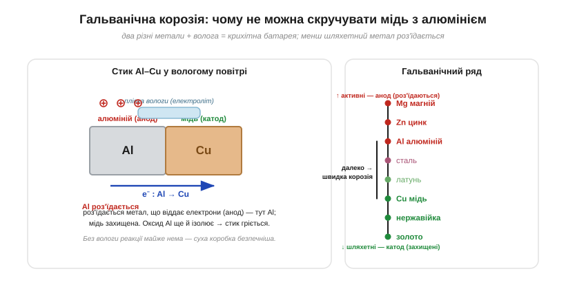

# 🔌 Гальванічна корозія: чому не можна скручувати мідь з алюмінієм

> В [електроліті](book:physics/ionic-conduction) струм несуть **іони**, і струм там **працює хімічно**. Один із наслідків цього — підступна **гальванічна корозія**, через яку просте з'єднання двох різних металів може тихо зруйнуватися й навіть спричинити пожежу. Розберімо, чому й як цьому зарадити.

### Що це таке

Якщо два **різні** метали стикаються (чи просто з'єднані дротом) у присутності **електроліту** — а ним стає навіть тонка плівка вологи з повітря, тим паче солона, — вони утворюють крихітну **гальванічну пару**, тобто маленьку батарею. Назва — від [Луїджі Гальвані](book:physics/volt). У цій мимовільній батареї один метал стає **анодом** і **роз'їдається** (його атоми йдуть у розчин іонами), а другий — **катодом** і лишається цілим.

*Ліворуч: вологий стик Al–Cu — це батарейка. Алюміній (менш шляхетний) віддає електрони міді й роз'їдається; мідь захищена. Праворуч: гальванічний ряд — що далі два метали один від одного, то швидша корозія активнішого.*

### Хто роз'їдається: гальванічний ряд

Хто з пари стане анодом, підказує **гальванічний ряд** — метали, вишикувані від **активних** (легко віддають електрони) до **шляхетних**. Роз'їдається завжди **активніший** (менш шляхетний) метал, а шляхетніший лишається неушкодженим. Алюміній активніший за мідь, тож у парі Al–Cu гине саме **алюміній**. І що далі метали один від одного в ряду, то швидша корозія.

### Чому стик Al–Cu — біда

З'єднати мідний і алюмінієвий дроти «скруткою» — класична помилка, що наробила лиха (через неї горіли будинки з алюмінієвою проводкою). І винна не лише гальванічна корозія — тут збігається **кілька бід одразу**:

- **гальванічна корозія** у вологому стику роз'їдає алюміній, руйнуючи контакт;
- алюміній миттєво вкривається **оксидом** Al₂O₃ — а той чудовий **ізолятор**, тож опір стику росте;
- алюміній **«пливе»** під тиском (повзучість) і має більше **теплове розширення** за мідь — від нагрівань-охолоджень скрутка поступово слабшає.

Усе разом дає те саме: **опір стику росте → він гріється → ще дужче окислюється → гріється ще більше**. Поганий контакт під струмом — пряма дорога до іскор і пожежі.

### Як уникнути

- **Не з'єднувати різнорідні метали** просто так у вологому місці. Для Al–Cu є **спеціальні з'єднувачі** (клеми класу Al/Cu), що ізолюють метали в лудженому корпусі й часто йдуть з **антиокисною пастою**.
- Тримати стик **сухим** (герметична коробка): без електроліту гальванічної реакції майже немає.
- Брати метали, **близькі** в ряду, або однакові; додавати **ізолювальні** шайби між різними металами.
- На вулиці й біля моря (солоне повітря — найгірший електроліт) це особливо критично: антени, кріплення, роз'єми.

### Корисний зворотний бік: жертовний анод

Те саме явище вміють **обертати на користь**. Якщо навмисно приєднати до сталевої конструкції шматок **активнішого** металу — цинку чи магнію, — то роз'їдатиметься саме він, **жертовний анод**, а сталь лишиться цілою (катодний захист). Так бережуть корпуси кораблів, бойлери, підземні труби. А **оцинкована** сталь — це той самий трюк: цинкове покриття жертвує собою, захищаючи залізо під ним.
