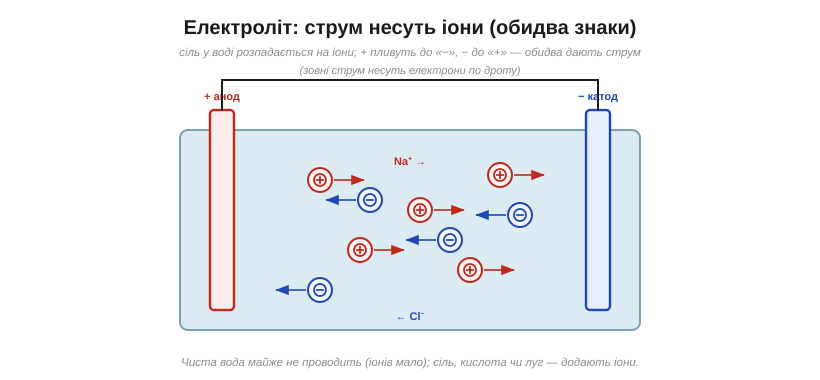
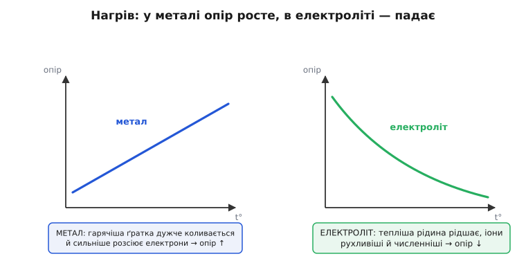
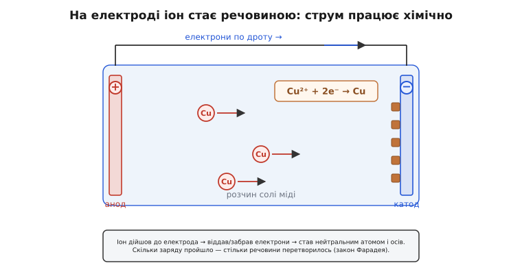
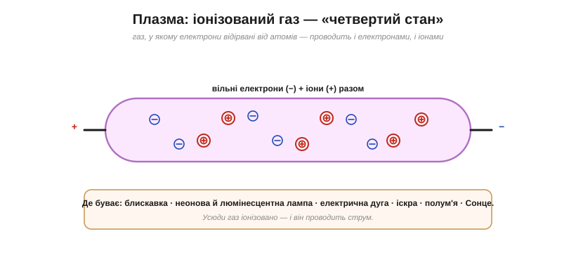

# Іонна провідність: струм, який несуть іони

<preknowlist>
- [Струм](topic:physics/electric-current) — струм як темп перенесення заряду, кулони за секунду крізь переріз.
- [Заряд](topic:physics/electric-charge) — два знаки заряду, однойменні відштовхуються, різнойменні притягуються.
- [Електричне поле](topic:physics/electric-field) — поле діє на заряд силою й тим жене носії струму.
- [Напруга](topic:physics/voltage) — різниця потенціалів як причина, що штовхає заряд крізь коло.
</preknowlist>

Налийте у склянку дистильованої води, опустіть два дроти під напругою — і майже нічого не станеться: струму немає. Киньте туди дрібку солі — і той самий дослід оживає, струм тече. А ще струм спокійно біжить крізь полум'я, крізь канал блискавки й навіть крізь вологу шкіру вашої руки. У жодному з цих випадків немає металу з його морем вільних електронів. То **хто ж там переносить заряд**?

Відповідь коротка — **іони**. Але за нею стоїть ціла окрема механіка провідності, багато в чому протилежна металевій: носіїв тут два знаки, вони важкі й повільні, вони пливуть крізь речовину, а не крізь застиглу ґратку, і — найдивніше — струм у них **змінює саму речовину**. Розберімо це до дна.

## Носієм заряду може бути не лише електрон

За [означенням струм — це рух заряду](topic:physics/electric-current), і більше нічого: скільки кулонів проходить крізь переріз за секунду. У формулюванні немає слова «електрон». Тож носієм може бути **будь-яка заряджена частинка, здатна рухатися**, — а таких у природі кілька сортів.


*У **металі** заряд несуть вільні електрони (−). В **електроліті** — **іони** обох знаків. У **плазмі** — і вільні електрони, і додатні іони. У **напівпровіднику** — електрони й «дірки». Скрізь це той самий струм (кулони за секунду), різняться лише «вантажники» заряду.*

Об'єднавча думка проста й важлива: **струм — це рух заряду, хоч би що його несло**. Усі базові закони — струм як темп перенесення, збереження заряду, потреба замкненої петлі, [напруга](topic:physics/voltage) як причина — працюють однаково для електронів, іонів і дірок. Змінюється тільки, **хто саме** возить заряд і **як** він при цьому поводиться. Випадок [напівпровідника](topic:physics/semiconductor), де носії — електрони й дірки, — окрема тема; тут ідеться про **іонну** провідність, а вона панує у трьох середовищах: у розчинах, в іонізованому газі й у живому тілі. Почнемо з головного — з розчинів.

## Звідки в розчині беруться іони

Найпоширеніший «неметалевий» провідник — **електроліт** (від грец. ἤλεκτρον «бурштин, електрика» + λυτός «розкладений»): розчин, у якому розчинена речовина розпалася на **іони** (від грец. ἰόν «те, що йде» — бо іон таки «йде» до електрода) — заряджені атоми чи групи атомів. Але чому вона розпадається? Тут легко відмахнутися словами «сіль розчиняється» — а це якраз ключ до всієї іонної провідності, тож зупинімося.

Кухонна сіль NaCl — це **іонний кристал**: у ньому вже немає нейтральних молекул, а є ґратка з іонів Na⁺ і Cl⁻, які тримає купи їхнє взаємне [електростатичне притягання](topic:physics/coulomb-law). Тобто заряджені частинки в солі є **завжди** — вони лише міцно скуті в кристалі й не можуть рухатися. Щоб пішов струм, їх треба **звільнити**, а звільняє їх — вода.

Молекула води **полярна**: атом кисню відтягує на себе спільні електрони, тож на ньому осідає невеликий мінус, а на двох атомах водню — невеликий плюс. Виходить крихітний диполь. Така вода діє на іонний кристал двома шляхами відразу. По-перше, вона різко послаблює притягання між іонами: у воді [сила між зарядами](topic:physics/coulomb-law) слабшає приблизно у 80 разів проти вакууму (у цьому й суть [діелектричної проникності](topic:physics/permittivity) води). По-друге, полярні молекули води обліплюють кожен іон із потрібного боку — мінусом кисню до Na⁺, плюсом водню до Cl⁻ — і буквально витягують його з ґратки, огортаючи «шубою» (гідратна оболонка). Результат: кристал розходиться на **вільні, оточені водою іони**, які тепер можуть плавати й нести струм.

Найважливіше в цій картині: іони з'являються **від самого розчинення**, задовго до будь-якого струму. Струм їх не створює — він лише **рухає** вже готові іони. Ця думка сьогодні здається очевидною, а колись за неї ледь не завалили докторський захист.

> 📜 Як дійшли думки, що в спокійній склянці солоної води вже плавають заряджені іони — і чому з цієї ідеї спершу глузували, а потім дали за неї Нобеля: вставка [Арреніус та іони](topic:physics/ionic-conduction/hist-arrhenius.md).

Не всяка речовина розпадається однаково повно. **Сильні електроліти** (та сама NaCl, соляна кислота HCl, луги) у воді дисоціюють (від лат. dissociatio «роз'єднання») майже **повністю** — кожна «формульна одиниця» дає свої іони. **Слабкі електроліти** (наприклад, оцтова кислота) розпадаються лише **частково**: у розчині водночас плавають і цілі молекули, і невелика частка іонів, і між ними тримається рівновага. Ту частку молекул, що розпалася, називають **ступенем дисоціації**. Він одразу пояснює, чому оцет проводить струм гірше за соляну кислоту тієї самої концентрації: вільних носіїв у ньому просто менше. Цей місток — «сила» кислоти є часткою розпалих молекул — і був одним із перших тріумфів іонної теорії.

## Іони в полі: два знаки, що додаються

Тепер прикладемо напругу. У розчині виникає [електричне поле](topic:physics/electric-field), і воно діє на кожен іон силою (додатний штовхає вперед, від'ємний — назад). Іони починають дрейфувати — але **в різні боки**.


*Розчинена сіль розпалася на іони. Під дією поля **додатні** іони (Na⁺) пливуть до від'ємного електрода, **від'ємні** (Cl⁻) — до додатного. Рухаються в **різні** боки, але дають струм **в один** бік. Зовні, по дроту, заряд несуть уже електрони.*

Додатні іони йдуть до від'ємного електрода — їх звуть **катіонами** (грец. κατά «вниз») і йдуть вони до **катода**; від'ємні йдуть до додатного електрода — **аніони** (грец. ἀνά «вгору»), до **анода**. Тут спливає перша особливість, якої в металі немає взагалі: струм несуть **обидва** знаки заряду **водночас**, рухаючись назустріч один одному. І це не заважає, а навпаки — [їхні внески в струм додаються](topic:physics/current-direction). Причина проста: мінус, що пливе ліворуч, переносить крізь переріз рівно стільки ж заряду вправо, як плюс, що пливе праворуч. Обидва потоки — це заряд, який рухається в один бік струму, тож вони підсумовуються.

Зверніть увагу й на замкненість кола. Усередині розчину заряд везуть іони, а в металевих дротах зовні — електрони. На межі «електрод–розчин» естафета передається: там електрони або віддаються іонам, або забираються від них. Саме на цій межі й криється друга, найглибша відмінність іонного струму — але спершу розберімося, **скільки** струму дають іони й **чому так мало**.

## Скільки й як швидко: рухливість і провідність

Іон у рідині не розганяється вільно, як електрон у вакуумі. Щойно поле його штовхнуло, він одразу вдаряється об молекули води й гальмується; далі знову штовхок, знову удар. У підсумку встановлюється **стала швидкість дрейфу**, пропорційна полю:

```
v = μ · E
```

Тут `E` — поле, а `μ` — **рухливість** іона: наскільки жваво він відгукується на поле. І от рухливість іонів **мізерна** проти електронної в металі. Причин дві, і обидві фізичні. По-перше, іон — це **цілий атом** (а часто ще й із гідратною шубою), у десятки тисяч разів важчий за електрон. По-друге, він продирається **крізь рідину**, безперервно розштовхуючи її молекули, тоді як електрон у металі майже вільно ковзає крізь ґратку. Порядок величин промовистий: рухливість іона у воді — близько 5·10⁻⁸ м²/(В·с), а електрона в міді — близько 4·10⁻³, тобто у сто тисяч разів більша.

Тепер зберемо з цього **провідність**. Струм тим більший, чим більше в одиниці об'єму носіїв, чим більший заряд кожного і чим вони рухливіші. Для розчину, де є кілька сортів іонів, внески всіх сортів додаються:

```
σ = Σ  nᵢ · qᵢ · μᵢ
```

де `nᵢ` — скільки іонів даного сорту в об'ємі, `qᵢ` — заряд одного, `μᵢ` — його рухливість. Для простої солі, що дала однакову кількість `n` однозарядних катіонів і аніонів, це згортається у прозоре

```
σ = n · e · (μ₊ + μ₋)
```

і в ньому видно все одразу. **Обидва** знаки іонів дають внесок (сума двох рухливостей — знову те саме «внески додаються»). Провідність **прямо** залежить від концентрації іонів `n`: більше розчиненої солі — більше носіїв — більший струм (тому дистильована вода майже не проводить, а солона проводить добре). І та сама формула пояснює, чому електроліт як провідник настільки слабший за метал: у нього і носіїв на одиницю об'єму менше, і рухливість їхня крихітна. Морська вода має провідність близько 5 См/м, а мідь — близько 6·10⁷ См/м: розрив у десять мільйонів разів.

Є й тонший факт, що остаточно переконав фізиків у реальності окремих іонів: у сильно розведеному розчині кожен сорт іона додає до провідності **свою власну, сталу частку**, майже не зважаючи на те, з яким партнером він прийшов (закон незалежного руху іонів Кольрауша). Саме тому провідності можна складати «поіонно», як у формулі вище, і саме тому іон поводиться як самостійна частинка, а не як уламок конкретної молекули.

**Скільки іонів у воді? Оцінимо струм витоку.** Нехай між двома доріжками плати завширшки й завглибшки по 1 мм, на відстані 1 мм, опинилася плівка не надто чистої води з провідністю σ = 0.01 См/м, і на доріжках 5 В.

```
геометрія:  довжина L = 1 mm = 0.001 m,  переріз A = 1 mm² = 1e-6 m²
опір:       R = L / (σ · A) = 0.001 / (0.01 · 1e-6) = 100000 Ω = 100 kΩ
струм:      I = U / R = 5 / 100000 = 5e-5 A = 50 мкА
```

Висновок: краплина брудної води — це вже резистор на сотню кілоом, що тихо тягне десятки мікроампер там, де нічого текти не мало. Для логічного входу чи високоомного давача цього досить, щоб схема «збожеволіла».

> 🔧 **Навіщо це.** На цій самій провідності побудовані **кондуктометри** — прилади, що міряють чистоту води за її провідністю: більше розчинених солей — більший струм. Так стежать за водою в котлах, акваріумах, фармацевтиці. І та сама фізика — джерело біди: **електроніка й вода не дружать** саме через іони. Чиста вода ще півбіди, але будь-яка реальна (з потом, брудом, сіллю) — непоганий провідник, що замикає доріжки й роз'їдає контакти. Звідси давачі вологості й дощу — і звідси ж вимога тримати плати сухими.

## Температура: усе навпаки до металів

Є простий дослід, який одразу викриває, хто несе струм. Нагрійте провідник і подивіться, що станеться з його опором.


*У металі з нагрівом опір **росте**: гарячіша ґратка дужче коливається й сильніше розсіює електрони. В електроліті опір **падає**: тепліша рідина рідшає, іони стають рухливішими, а слабкі електроліти ще й дисоціюють повніше.*

У металі носії — електрони — уже всі на місці, і нагрів їм тільки заважає: гарячіша ґратка дужче тремтить, частіше збиває електрони з курсу, рухливість падає, [опір росте](topic:physics/conductivity). В електроліті все дзеркально. Тепліша вода стає **менш в'язкою**, тож іонам легше крізь неї протискатися — рухливість зростає; а для слабких електролітів вищий нагрів ще й **збільшує ступінь дисоціації**, додаючи носіїв. Обидва ефекти тягнуть в один бік: провідність росте, опір падає, десь на кілька відсотків на кожен градус.

Ця **протилежність знаків** — не дрібниця, а справжній відбиток пальців механізму. У металі нагрів псує рух наявних носіїв; в електроліті — полегшує рух і навіть додає носіїв. Тому, лише вимірявши, як опір реагує на нагрів, можна сказати, чим саме тече струм — електронами чи іонами.

## Струм, що змінює речовину

А тепер — найглибша відмінність іонної провідності, та сама, що ховалася на межі «електрод–розчин». У металі струм просто тече, нічого не перетворюючи: електрони входять з одного кінця дроту й виходять з іншого, самі атоми на місці. В електроліті інакше. Коли іон **дійшов до електрода**, він там віддає або забирає електрони й **перестає бути іоном** — стає нейтральним атомом.


*Іон міді Cu²⁺ доходить до катода, забирає два електрони й осідає нейтральним атомом металу. Скільки заряду пройшло — стільки речовини перетворилося. Метал так не вміє: у ньому струм тече, не чіпаючи атомів.*

Тобто в електроліті струм **працює хімічно**: на електродах осідає метал, виділяється газ, іде реакція. І тут з'являється сувора кількісна залежність, яку помітив ще Фарадей: **скільки заряду пройшло — стільки речовини перетвориться**. Логіка прозора. Щоб перетворити один іон на атом, треба передати йому чітко визначену порцію заряду — рівно стільки електронів, скільки в нього не вистачало (для Cu²⁺ це два, для Na⁺ один). Порахувати всю осаджену речовину — означає порахувати всі передані електрони, тобто **весь заряд**.

Щоб осадити один моль однозарядних іонів, треба пропустити один моль електронів, а це — **стала Фарадея** F ≈ 96485 кулонів. Звідси маса `m`, що виділилася при заряді `Q` для іона з валентністю `z` (числом електронів на один іон) і молярною масою `M`:

```
m = (Q / F) · (M / z)
```

**Скільки міді осяде за годину при струмі 2 А?** Мідь осідає за реакцією Cu²⁺ + 2e⁻ → Cu, тобто `z = 2`, а `M = 63.5` г/моль.

```
заряд:      Q = I · t = 2 A · 3600 s = 7200 Кл
електрони:  Q / F = 7200 / 96485 = 0.0746 моль e⁻
атоми Cu:   0.0746 / 2 = 0.0373 моль Cu
маса:       m = 0.0373 · 63.5 = 2.37 г
```

Висновок: рівно 2.37 грама, ні міліграмом більше, — і це число залежить лише від заряду, який ми пропустили. На цьому точному зв'язку «заряд ↔ речовина» стоїть уся гальваніка й [електроліз](topic:physics/electrolysis): золочення й хромування, добування алюмінію та хлору, очищення міді, анодування. Той самий зв'язок пояснює, чому **акумулятори з часом спрацьовуються**: їхні електроди в буквальному сенсі хімічно перетворюються струмом, і після багатьох циклів речовина вже не та.

І та сама здатність струму «їсти» метал у розчині обертається бідою там, де її не чекають. Досить двом різним металам стикнутися у вологому місці — і вони самі собою стають маленькою батареєю, у якій активніший метал повільно роз'їдається.

> 🔌 Чому не можна просто скручувати мідний дріт з алюмінієвим (і як через це горіли будинки): вставка [Гальванічна корозія](topic:physics/ionic-conduction/comp-galvanic-corrosion.md).

## Плазма: провідний газ

Досі носіїв заряду звільняла вода. Але іони можна добути й з газу — і тоді провідником стає саме повітря. Звичайний газ — чудовий ізолятор: у ньому атоми нейтральні, вільних зарядів немає, тож повітря струму не проводить. Та якщо газ **іонізувати** — відірвати від його атомів електрони, — він перетворюється на **плазму** (грец. πλάσμα «щось виліплене»): суміш вільних електронів і додатних іонів, що чудово проводить струм. Плазму звуть **четвертим станом речовини**.


*У плазмі електрони відірвані від атомів, тож рухливі і вони, і додатні іони — газ проводить струм. Плазма всюди: блискавка, неонова й люмінесцентна лампа, електрична дуга, іскра, полум'я і вся речовина зір.*

Тут провідність — «мішана»: заряд везуть і додатні іони, і вільні електрони, причому легкі електрони роблять більшу частину роботи. Але без іонів плазми не буває: адже щоб вивільнити електрони, треба відірвати їх від атомів, а те, що лишається, — це якраз додатні **іони**. Тож іонізація — обов'язкова умова, щоб газ узагалі почав проводити.

Як газ стає плазмою? Треба дати атомам енергію, більшу за ту, що тримає їхні зовнішні електрони. Це роблять двома шляхами: або сильним [полем](topic:physics/electric-field) (пробій), або високим **теплом**. Сильне поле пояснює **іскру** й [**блискавку**](topic:physics/lightning): поле раптово зриває електрони з молекул повітря, роблячи його провідним на мить, — і крізь щойно народжений плазмовий канал б'є струм. Тепло пояснює **полум'я** й **зорі**: там атоми іонізує сам жар.

І плазма **світиться** — з тієї самої причини, що робить її провідною. Коли відірваний електрон знову зустрічає іон і возз'єднується з ним (рекомбінує), надлишок енергії вилітає як **фотон** світла; колір залежить від газу — неон дає характерне червоне, інші гази свої барви. Тому кожна неонова вивіска — по суті, приручена крихітна блискавка, а люмінесцентна лампа — це керований розряд в іонізованому газі. На Землі плазма здається екзотикою, та у Всесвіті це **найпоширеніший** стан речовини: зорі цілком із неї.

## Тіло людини: ми — солоний провідник

Лишився третій, найважливіший для життя випадок. Усередині людське тіло — це, по суті, **солона вода**: кров, лімфа, міжклітинна рідина повні іонів натрію, калію, кальцію, хлору. А отже, тіло **проводить струм**, і проводить його **іонно** — точнісінько як електроліт зі склянки.


*Усередині тіло — добрий іонний провідник (солоні рідини). Головний бар'єр для струму — **шкіра**: суха має опір порядку сотень кілоом, а волога (піт, вода) — лише близько кілоома. Тому мокрі руки роблять ураження струмом значно небезпечнішим.*

Головний захист тут — **шкіра**. Суха, вона має чималий опір (сотні кілоом) і добре стримує струм; але варто їй намокнути — від поту, води, — опір падає в сотні разів, до якогось кілоома. Щойно ж шкіра подолана (поранення, голка, глибока волога), **внутрішній** опір тіла зовсім невеликий — лише кілька сотень ом, бо всередині ми той самий солоний розчин. Тому вся оборона тримається саме на сухій цілій шкірі.

Наскільки це вирішальне, видно з простого підрахунку за законом Ома. Візьмімо побутові 230 В.

```
суха шкіра:    I = U / R = 230 / 100000 = 0.0023 A = 2.3 мА   (відчутно, але зазвичай не смертельно)
мокра шкіра:   I = U / R = 230 / 1000   = 0.23 A   = 230 мА   (уже смертельно небезпечно)
```

Різниця не в напрузі — напруга та сама, — а в тому, скільки струму пропустить тіло. І важливий не тільки розмір струму, а й що він робить. Струм близько міліампера лише відчутний; десяток міліампер уже змушує м'язи звестися так, що жертва **не може відпустити** провід; а близько сотні міліампер, пройшовши крізь груди, здатні збити серце з ритму (фібриляція) — і це найчастіша причина смерті від струму. До того ж побутовий **змінний** струм 50 Гц у цьому підступніший за постійний. Тому питання «скільки вольтів» саме по собі неповне: що станеться, вирішують **струм**, його **шлях** крізь тіло, **тривалість** і [те, змінний він чи постійний](topic:physics/dc-vs-ac). Конкретні пороги небезпеки — окрема важлива тема: [чому шкідливий саме струм і які значення небезпечні](topic:physics/current-safety).

> 🔧 **Навіщо це.** Головне правило безпеки випливає просто з фізики: **небезпечний струм крізь тіло, а тіло проводить іонами й тим краще, чим воно вологіше**. Звідси — не працювати з електрикою мокрими руками й у вологих приміщеннях, ставити пристрої захисного вимкнення (ПЗВ), а виміри під напругою робити «однією рукою», щоб шлях струму не пройшов через груди. Розуміння, що ми самі — електроліт, буквально рятує життя.

## Одна провідність — три світи

Спільна нитка всіх трьох випадків — не просто «заряд рухається». Іонна провідність — це те місце, де фізика струму зустрічається з хімією й з життям. Бо іон, на відміну від електрона в металі, не абстрактний носій: він **щось важить, кудись доходить і на щось перетворюється**. Той самий струм, що осаджує мідь у гальванічній ванні за законом Фарадея, живить кожну батарею у вашій кишені, гризе стик двох металів під дощем — і біжить іонними потоками крізь кожен ваш нерв і кожен удар серця. Розпізнати, що всі ці явища — одна й та сама іонна провідність, означає побачити, як тонка межа між «залізом» і «живим» тримається на русі однакових заряджених частинок.
