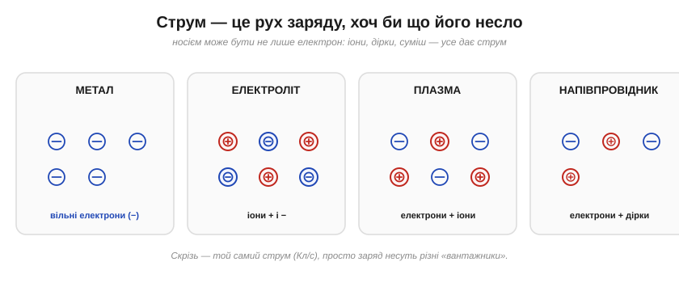

# Не лише метали: іони, електроліти, плазма, тіло людини

Розмова про струм у металах — це розмова про дрейф вільних електронів. Та за означенням [струм — це **рух заряду**](book:physics/electric-current), і нічого більше. А заряд можуть нести не лише електрони. Якщо розширити картину, видно, що струм буває там, де метала й близько немає, — у солоній воді, у полум'ї блискавки, навіть у нашому власному тілі.

### Зоопарк носіїв заряду

Носієм струму може бути будь-яка заряджена частинка, що здатна рухатися. Звідси кілька різних «способів проводити».

*Рис. У **металі** струм несуть вільні електрони (−). В **електроліті** — **іони** обох знаків. У **плазмі** — і вільні електрони, і іони. У **напівпровіднику** — електрони й «дірки». Скрізь це той самий струм (кулони за секунду), просто «вантажники» заряду різні.*

Об'єднавча думка проста й важлива: **струм — це рух заряду, хоч би що його несло**. Усі базові закони (струм як темп, збереження заряду, потреба петлі, напруга як причина) працюють однаково для електронів, іонів і дірок. Змінюється лише, **хто саме** возить заряд. Випадок напівпровідників — носії-електрони й дірки — стоїть окремо ([провідники й діелектрики](book:physics/conductors-insulators)); тут зосередимося на трьох інших.

### Іони: струм у розчинах

Найпоширеніший «неметалевий» провідник — **електроліт** (*electrolyte*): розчин, у якому розчинена речовина розпалася на **іони** (*ions*) — заряджені атоми чи групи атомів. Кухонна сіль NaCl у воді розходиться на іони Na⁺ і Cl⁻; кислоти, луги, солі — так само.

*Рис. Розчинена сіль розпадається на іони. Під дією поля **додатні** іони (Na⁺) пливуть до від'ємного електрода, **від'ємні** (Cl⁻) — до додатного. Рухаються вони в **різні** боки, але обидва дають струм **в один** бік (бо − ліворуч ≡ + праворуч). Зовні, по дроту, струм несуть уже електрони.*

Тут одразу видно дві особливості. По-перше, струм несуть **обидва** знаки заряду водночас, рухаючись назустріч, — і [їхні внески **додаються**](book:physics/current-direction). По-друге, **чистота** розчину вирішує все: дистильована вода майже не проводить (вільних іонів у ній мало), а варто кинути дрібку солі чи кислоти — і провідність злітає. Саме іонна провідність працює всередині кожної **батареї** (іони переносять заряд крізь електроліт, поки електрони біжать зовнішнім колом), у **гальваніці** й **електролізі** — те, над чим колись працювали Вольта й Фарадей.

Дві важливі відмінності від металів варто відзначити. Перша: іони — це цілі атоми, у тисячі разів важчі за електрон, тож дрейфують вони куди **повільніше**, і провідність електролітів зазвичай помітно гірша за металеву. Друга, принципова: проходячи крізь електроліт, струм **змінює речовину** на електродах — там осідає метал, виділяється газ, іде хімічна реакція. У металі струм просто тече, нічого не перетворюючи; в електроліті він **працює хімічно** — на цьому й стоять гальваніка, електроліз і самі акумулятори (тому вони з часом «спрацьовуються»).

> 📜 Як узагалі дійшли думки, що в розчині плавають заряджені іони (і чому з цієї ідеї спершу сміялися), — у вставці [Арреніус та іони](hist-arrhenius.md).

> 🔧 **Навіщо це.** Звідси проста, але рятівна обачність: **електроніка й вода не дружать** саме через іони. Чиста вода ще півбіди, але будь-яка реальна (з потом, брудом, сіллю) — непоганий провідник, що замикає доріжки й роз'їдає контакти. На цій же провідності працюють **кондуктометри** — прилади, що міряють чистоту води за її провідністю (більше розчинених солей — більший струм). А ще — давачі вологості й дощу.

> 🔌 А коли в тій воді стикаються **два різні метали** (як мідь і алюміній), електроліт перетворює стик на крихітну батарею — і менш шляхетний метал роз'їдається. Чому через це не можна просто скручувати мідь з алюмінієм: [Гальванічна корозія](comp-galvanic-corrosion.md).

### Плазма: провідний газ

Гази зазвичай — чудові ізолятори (повітря не проводить). Та якщо газ **іонізувати** — відірвати від його атомів електрони — він стає **плазмою** (*plasma*): сумішшю вільних електронів і додатних іонів, що чудово проводить струм. Плазму звуть **четвертим станом речовини**.

*Рис. У плазмі електрони відірвані від атомів, тож рухливі і вони, і додатні іони — газ проводить струм. Плазма — навколо нас частіше, ніж здається: блискавка, неонова й люмінесцентна лампа, електрична дуга, іскра, полум'я, і вся речовина Сонця та зір.*

Плазма пояснює багато знайомого. **Іскра** й **блискавка** — це раптова іонізація повітря [сильним полем](book:physics/electric-field) (пробій), яка робить його провідним на мить. **Неонова** й **люмінесцентна** лампи світяться завдяки розряду в іонізованому газі. **Електрична дуга** зварювання — стійка плазма між електродами. І хоч на Землі плазма здається екзотикою, у Всесвіті це **найпоширеніший** стан речовини: зорі цілком із неї.

Як газ стає плазмою? Треба відірвати електрони від атомів, а на це потрібна енергія: або сильне **поле** (пробій), або високе **тепло** (полум'я, зорі). Тому плазма й **світиться**: коли відірваний електрон знову возз'єднується з іоном (рекомбінує), надлишок енергії випромінюється як **фотон** світла. Колір залежить від газу: неон дає характерне червоне світіння, інші гази — свої барви. Тож кожна неонова вивіска — це, по суті, маленька приручена блискавка.

### Тіло людини: ми — солоний провідник

І найважливіший для безпеки випадок. Людське тіло всередині — це, по суті, **солона вода**: кров, лімфа, міжклітинна рідина повні іонів. А отже, тіло **проводить струм** — іонно.

*Рис. Усередині тіло — добрий іонний провідник (солоні рідини). Головний бар'єр для струму — **шкіра**: суха має опір порядку сотень кілоом, але волога (піт, вода) — лише близько кілоома. Тому струм, що пройшов крізь тіло, небезпечний, а мокрі руки роблять його значно небезпечнішим.*

Це не абстракція, а питання життя. Зовнішній бар'єр — **шкіра**: суха, вона має чималий опір (сотні кілоом) і трохи захищає; але варто їй намокнути (піт, вода) — опір падає в сотні разів (до ~кілоома), і той самий дотик пропускає куди більший, уже небезпечний струм. Саме тому електрику особливо небезпечно чіпати **мокрими руками** чи у ванній.

Варто додати ще два факти. Коли шкіра подолана (поранення, вологість, голка), **внутрішній** опір тіла невеликий — лише кілька сотень ом, тож головним захистом є саме суха шкіра. А ще небезпека залежить від **виду** струму: побутовий змінний струм 50 Гц особливо підступний — він здатний збити серце з ритму (фібриляція) навіть за порівняно невеликих значень. Тому питання «скільки вольтів» — неповне: що саме станеться, вирішують **струм**, його **шлях** крізь тіло й **тривалість**. [Чому шкідливий саме струм і які значення небезпечні](book:physics/current-safety) — окрема важлива тема.

> 🔧 **Навіщо це.** Запам'ятайте з цього головне правило безпеки: **небезпечний струм через тіло, а тіло проводить іонами й тим краще, чим воно вологіше**. Звідси — не працювати з електрикою мокрими руками, у вологих приміщеннях ставити пристрої захисного вимкнення, а виміри під напругою робити «однією рукою», щоб струм не пішов через груди. Розуміння, що ми самі — електроліт, рятує життя.

---

Головне: струм — це **рух заряду, незалежно від носія**. Окрім електронів у металах, заряд несуть **іони** в електролітах (обидва знаки, назустріч, обидва додають струм; чистота розчину вирішує провідність), **електрони й іони** в **плазмі** (іскра, блискавка, неон, зорі) та **іони** в тканинах живого тіла — через що ми й вразливі до струму. Хоч би **що** й **в чому** текло, це той самий струм — кулони за секунду.

---
