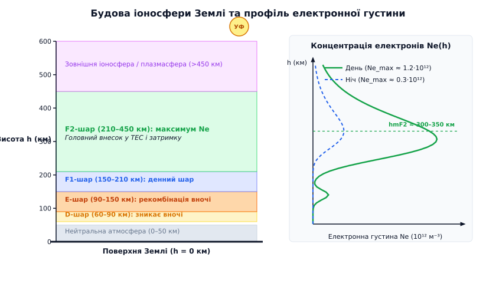
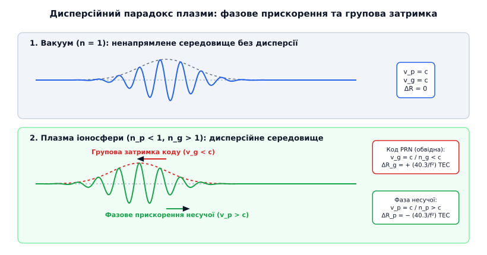
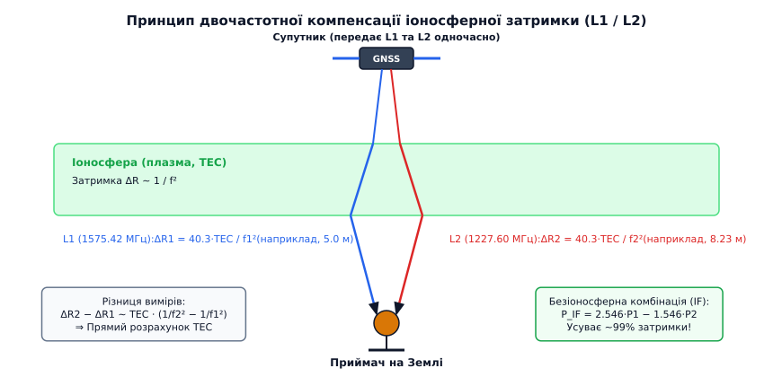
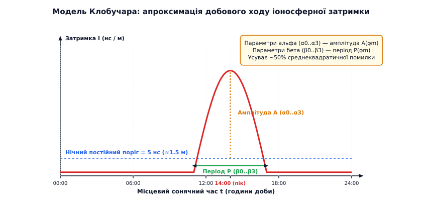
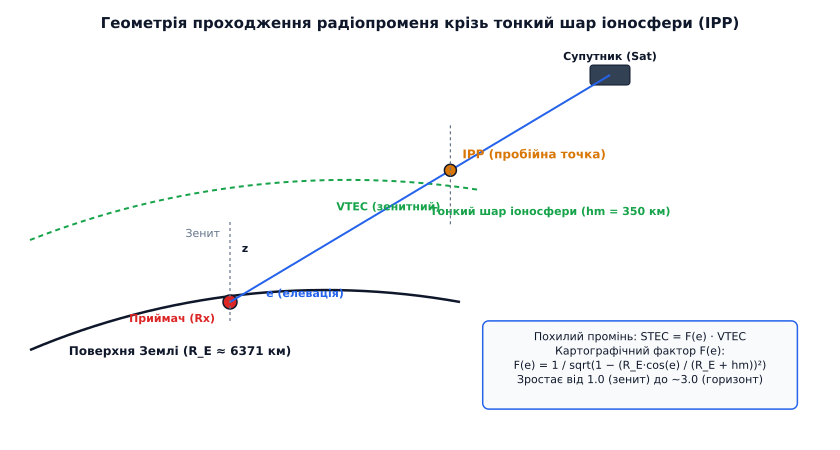

# Іоносферна затримка радіосигналу

<preknowlist>
- [Електромагнітна хвиля](book:physics/em-wave) — поширення коливань електричного й магнітного полів у просторі зі швидкістю світла.
- [Групова затримка](book:physics/group-delay) — різниця між фазовою та груповою швидкістю сигнального пакета в дисперсійному середовищі.
- [Електричний заряд](book:physics/electric-charge) — джерело електромагнітного поля та вільних носіїв у плазмі.
</preknowlist>

Навігаційний супутник на орбіті висотою 20 000 кілометрів випромінює радіоімпульс. Якби увесь цей шлях пролягав крізь ідеальний вакуум, сигнал дістався б наземного приймача за 67.3 мілісекунди, дозволяючи обчислити відстань із точністю до міліметра. Проте останні 900 кілометрів промінь проходить крізь шар частково іонізованої атмосферної плазми. Вільні електрони під дією електромагнітної хвилі починають коливатися, сповільнюючи обвідну сигнального пакета на 50–100 наносекунд. Для систем супутникової навігації (GPS, Galileo, GLONASS, BeiDou), де кожна наносекунда затримки еквівалентна 30 сантиметрам відстані, це розходження перетворюється на помилку визначення координат від 15 до 30 метрів.

У цій статті ми розберемо фізичні першопричини плазмової дисперсії, з'ясуємо, чому фазова швидкість супутникового сигналу перевищує швидкість світла у вакуумі, за якими законами обчислюється повний електронний вміст (TEC), а також як сучасні двочастотні приймачі та емпіричні математичні моделі повністю компенсують цю затримку.

### 1. Народження плазмового щита: утворення іоносфери

Земна атмосфера на висотах від 60 до 1000 кілометрів піддається безперервному бомбардуванню жорстким сонячним випромінюванням — ультрафіолетовими квантами високої енергії (екстремальний ультрафіолет, EUV, з довжинами хвиль 10–100 нм, зокрема яскравою спектральною лінією гелію He II 30.4 нм) та м'яким рентгенівським випромінюванням (0.1–10 нм). Енергія фотона в цьому спектральному діапазоні перевищує потенціал іонізації основних атмосферних газів (12.1 еВ для молекулярного кисню `O₂`, 13.6 еВ для атомарного кисню `O`, 15.6 еВ для молекулярного азоту `N₂`). Зіткнення такого фотона з нейтральним атомом чи молекулою вибиває з її зв'язаної оболонки вільний електрон, перетворюючи молекулу на позитивний іон.


*Вертикальна структура атмосфери Землі та профіль електронної густини Ne(h). Добова іонізація Сонцем формує шари D, E, F1 та F2. Максимум концентрації електронів спостерігається у F2-шарі на висоті 300–350 км, досягаючи 1.2×10¹² електронів на кубічний метр удень.*

Процес фотоіонізації врівноважується зворотним хімічним процесом — рекомбінацією, при якій вільний електрон захоплюється позитивним іоном із випромінюванням фотона, а також дисоціативною рекомбінацією при зіткненні електрона з молекулярним іоном (наприклад, `NO⁺ + e⁻ → N + O`). Стаціонарний баланс між швидкістю фотоіонізації `q(h)` та швидкістю рекомбінації `L(h)` визначає просторовий розподіл об'ємної концентрації вільних електронів `N_e` (вимірюється в електронах на кубічний метр, `e⁻/м³`).

Оскільки барометрична густина повітря з висотою спадає за експоненційним законом `ρ(h) = ρ₀ · e^(-h/H)`, а інтенсивність сонячного потоку поглинається у міру занурення в атмосферу, швидкість іонізації описується класичним профілем Чепмена (Chapman production function). Швидкість фотоіонізації на висоті `h` для зенитного кута Сонця `χ` виражається як:

```
q(h, χ) = q_max · exp(1 - z - exp(-z) · sec(χ))
```

де `z = (h - h_max) / H` — нормована висота відносно максимуму шару, а `H` — висота однорідної атмосфери. Це приводить до формування чітко вираженого максимуму електронної густини у верхній атмосфері.

За фізичними властивостями та висотним розподілом іоносфера розділяється на декілька основних шарів:
- **D-шар (60–90 км):** найнижчий шар іоносфери. Характеризується порівняно високим тиском нейтрального газу. Тут відбуваються часті зіткнення електронів з молекулами (частота зіткнень `ν_e ≈ 10⁶ Гц`), що викликає сильне згасання (поглинання) низькочастотних радіохвиль. У нічний час, коли фотоіонізація зупиняється, швидка дисоціативна рекомбінація призводить до повного зникнення D-шару протягом кількох хвилин після заходу Сонця.
- **E-шар (90–150 км):** шар із високим вмістом молекулярних іонів `NO⁺` та `O₂⁺`. Максимум електронної густини становить близько `N_e ≈ 10¹¹ м⁻³` удень. Уночі електронна густина зменшується на два порядки, але не падає до нуля через збереження реліктової іонізації та розсіяного сонячного випромінювання. В E-шарі також інколи виникає явище спорадичного шару `Es` (Sporadic E) — вузьких металевих прошарків іонізації завтовшки 1–2 км від згоряння мікрометеорів.
- **F-шар (150–600 км):** головний резервуар іоносферної плазми, у якому переважають легкі іони атомарного кисню `O⁺`. Удень під дією прямого сонячного світла F-шар розщеплюється на два підшари: **F1** (150–210 км) та **F2** (210–450 км). Підшар **F2** містить абсолютний максимум електронної густини всієї атмосфери Землі (`N_max ≈ 1.0–2.0 × 10¹² м⁻³` на висотах 300–350 км). Оскільки на цих висотах тиск нейтрального газу надзвичайно низький, частота зіткнень електронів є мізерною, а час життя вільних електронів сягає багатьох годин. Тому F2-шар зберігається протягом усього нічного періоду й створює понад 80% сумарної іоносферної затримки радіосигналів.
- **Зовнішня іоносфера та плазмасфера (понад 450 км):** область, у якій склад плазми поступово змінюється від атомарного кисню `O⁺` до легких іонів водню `H⁺` (протонів) та гелію `He⁺`. Концентрація електронів повільно спадає за плавною експонентою до значень `10⁹–10¹⁰ м⁻³` на висотах супутникових орбіт (20 000 км).

Важливо зауважити, що іоносфера піддається значним часовим коливанням:
- **11-річний цикл сонячної активності:** під час сонячного максимуму потік екстремального ультрафіолету F10.7 зростає в кілька разів, збільшуючи електронну густину й затримку радіохвиль у 3–5 разів порівняно з сонячним мінімумом.
- **Сезонна (зимова) аномалія:** незважаючи на меншу тривалість дня, взимку у помірних широтах денна концентрація електронів у F2-шарі вища, ніж улітку, через збільшення відношення атомарного кисню до молекулярного азоту `O / N₂` внаслідок глобальної атмосферної циркуляції.
- **Екваторіальна іоносферна аномалія (EIA):** у вздовж геомагнітного екватора електричне поле у поєднанні з геомагнітним полем створює вертикальний дрейф плазми вгору (фонтан-ефект), після чого плазма під дією сили тяжіння розтікається уздовж магнітних ліній на північ та південь, утворюючи два симетричних горби електронної концентрації на широтах `±15°` від екватора.
- **Геомагнітні шторми:** викиди корональної маси Сонця (CME) викликають збурення геомагнітного поля Землі, що спричиняє іоносферні бурі з різким хаотичним зміщенням електронної густини.

Детальніше про те, як спостереження за добовими варіаціями геомагнетизму та перші досліди з трансатлантичного радіозв'язку привели до відкриття іонізованого шару, описано в [історії відкриття іоносфери](book:physics/ionospheric-delay/hist-ionosphere-discovery.md).

### 2. Механізм взаємодії радіохвилі з плазмою

На відміну від нейтрального газу тропосфери, де показник заломлення визначається дипольною поляризацією зв'язаних електронних оболонок нейтральних молекул, іоносфера є **холодною беззіткненою плазмою**. Вільний електрон у плазмі позбавлений квазіпружного зв'язку з атомом і має можливість вільно зміщуватися під дією зовнішнього змінного електричного поля радіохвилі.

Коли крізь плазму проходить плоскополяризована електромагнітна хвиля з коловою частотою `ω = 2π f`, її змінне електричне поле `E(t) = E₀ · e^(i ω t)` діє на кожен вільний електрон із силою Кулона `F = -e · E`. Рівняння руху електрона маси `m_e` без урахування зіткнень має вигляд:

```
m_e · (d²x / dt²) = -e · E₀ · e^(i ω t)
```

Двічі інтегруючи це рівняння за часом, отримуємо зміщення електрона `x(t)` від початкового положення рівноваги:

```
x(t) = (e / (m_e · ω²)) · E₀ · e^(i ω t)
```

Зміщений електрон утворює разом із навколишнім іонним фоном елементарний електричний диполь із моментом `p = -e · x(t)`. При об'ємній концентрації електронів `N_e` макроскопічний вектор поляризації плазми `P` дорівнює:

```
P = N_e · p = - (N_e · e² / (m_e · ω²)) · E
```

Зверніть увагу на від'ємний знак перед вектором поляризації: наведена поляризація плазми виявляється протилежною за напрямком до електричного поля хвилі. Зсув векторів поляризації та електричного поля на 180 градусів (протифаза) виникає через те, що прискорення вільного електрона визначається його інерцією під дією гармонічної сили.

Електричний зсув `D` у плазмі описується співвідношенням:

```
D = ε₀ · E + P
  = ε₀ · E - (N_e · e² / (m_e · ω²)) · E       [підстановка поляризації P]
  = ε₀ · (1 - ω_p² / ω²) · E                   [визначення плазмової частоти ω_p]
```

де `ω_p` — **власна плазмова (лєнґмюрівська) частота** коливань електронного газу:

```
ω_p = √(N_e · e² / (ε₀ · m_e))
```

Ввівши чисельні значення фізичних констант (заряд електрона `e ≈ 1.602 × 10⁻¹⁹ Кл`, маса електрона `m_e ≈ 9.109 × 10⁻³¹ кг`, електрична стала `ε₀ ≈ 8.854 × 10⁻¹² Ф/м`), отримуємо формулу для плазмової частоти у герцах `f_p = ω_p / (2π)`:

```
f_p ≈ 8.98 · √(N_e)  [Гц]
```

Для піку шару F2 при концентрації `N_e = 1.2 × 10¹² м⁻³` плазмова частота становить `f_p ≈ 9.8 МГц`. 

Фізичний зміст плазмової частоти полягає в наступному:
- Якщо частота радіохвилі нижча за плазмову (`f < f_p`, наприклад, короткі хвилі діапазону 3–8 МГц), відносна діелектрична проникність плазми стає від'ємною `ε_r < 0`. Хвиля не може поширюватися вглиб середовища й повністю віддзеркалюється назад до Землі.
- Якщо частота хвилі значно перевищує плазмову (`f >> f_p`, як для сигналів супутникових систем навігації GPS, Galileo, GLONASS `f ≈ 1.2–1.6 ГГц`), плазма є повністю прозорою. Проте діелектрична проникність середовища лишається трохи меншою за одиницю, викликаючи дисперсійне спотворення хвильового пакета.

### 3. Дисперсійний парадокс: фазове прискорення проти групової затримки

Оскільки діелектрична проникність плазми `ε(f) = 1 - f_p² / f²` для супутникових частот менша за одиницю, фазовий показник заломлення `n_p(f)` стає **меншим за одиницю**:

```
n_p(f) = √(1 - f_p² / f²) ≈ 1 - (40.3 · N_e) / f² < 1
```

Це викликає унікальне фізичне явище: **фазова швидкість** поширення гребенів несучої хвилі `v_p = c / n_p > c` перевищує швидкість світла у вакуумі!


*Парадокс плазмової дисперсії. У вакуумі фазова швидкість несучої v_p та групова швидкість пакета v_g однакові й дорівнюють c. У плазмі іоносфери фазові гребені зміщуються вперед (v_p > c), а огинаюча псевдовипадкового коду PRN затримується (v_g < c).*

Це розходження не порушує принципів теорії відносності, бо фаза монохроматичної хвилі є нескінченною синусоїдою й не здатна передавати інформацію чи енергію. Будь-яка навігаційна інформація — дальномірні мітки часу, імпульси, модульований псевдовипадковий код (PRN) — передається групою хвиль (хвильовим пакетом) і поширюється з **груповою швидкістю** `v_g`.

Зв'язок між фазовим `n_p` та груповим `n_g` показниками заломлення визначається формулою Релея:

```
n_g(f) = n_p(f) + f · (dn_p / df)
```

Обчисливши похідну `dn_p / df = (80.6 · N_e) / f³`, отримуємо для групового показника заломлення плазми:

```
n_g(f) = (1 - (40.3 · N_e) / f²) + f · ((80.6 · N_e) / f³)
       = 1 + (40.3 · N_e) / f² > 1
```

Отже, **груповий показник заломлення плазми більший за одиницю** (`n_g > 1`). Звідси випливає головний дисперсійний парадокс іоносфери:
- **Огинаюча коду (PRN-код):** поширюється зі швидкістю `v_g = c / n_g < c` і **зазнає групової затримки** (сигнал приходить пізніше, виміряна кодова відстань виявляється більшою за реальну).
- **Фаза несучої хвилі:** поширюється зі швидкістю `v_p = c / n_p > c` і **зазнає фазового прискорення** (фазовий шлях коротшає, виміряна фазова відстань виявляється меншою за реальну).

Абсолютні значення кодової затримки `ΔR_g` та фазового прискорення `ΔR_p` (виражені у метрах відстані) точно дорівнюють одне одному, але мають протилежні знаки:

```
ΔR_g = + (40.3 / f²) · STEC
ΔR_p = - (40.3 / f²) · STEC
```

Це явище створює так зване **розходження коду й фази (code-phase divergence)**. У навігаційних приймачах під час згладжування кодових вимірів за допомогою фази несучої (фільтр Хетча) від'ємний знак фазового прискорення вимагає спеціального додавання поправки з належним знаком, інакше фільтр буде зносити рішення у протилежний бік.

Строгий алгебраїчний розклад та виведення цих рівнянь наведено у [математичному виведенні плазмової дисперсії та двочастотного компенсатора](book:physics/ionospheric-delay/math-dispersion-derivation.md).

### 4. Повний електронний вміст (TEC) та чисельні масштаби затримки

Загальна кількість вільних електронів у циліндрі перетином 1 м², що простягається від передавача супутника до антени наземного приймача, називається **похилим повним електронним вмістом** (Slant Total Electron Content, STEC):

```
STEC = ∫₀ˢ N_e(s) ds  [електронів / м²]
```

Для зручності розрахунків у супутниковій навігації використовують спеціальну одиницю вимірювання **TECU** (Total Electron Content Unit):

```
1 TECU = 10¹⁶ електронів / м²
```

Обчислимо коефіцієнт пропорційності між електронним вмістом STEC та кодовою затримкою в метрах для основної частоти системи GPS L1 (`f1 = 1575.42 МГц`):

```
40.3 / (1575.42 × 10⁶)² = 40.3 / (2.48195 × 10¹⁸)
                       ≈ 1.624 × 10⁻¹⁷ м / (електрон/м²)
                       = 0.1624 м / TECU
```

Отже, **кожен 1 TECU електронного вмісту додає 16.24 сантиметра затримки** до кодових вимірів на частоті L1!

Для базової частоти системи GPS L2 (`f2 = 1227.60 МГц`) коефіцієнт становить:

```
40.3 / (1227.60 × 10⁶)² ≈ 0.2673 м / TECU
```

Для третьої цивільної частоти L5 (`f5 = 1176.45 МГц`):

```
40.3 / (1176.45 × 10⁶)² ≈ 0.2912 м / TECU
```

Для порівняння різних частот супутникових систем:
- **GPS L1 (1575.42 МГц):** `0.1624 м / TECU`
- **GPS L2 (1227.60 МГц):** `0.2673 м / TECU`
- **GPS L5 / Galileo E5a (1176.45 МГц):** `0.2912 м / TECU`
- **Galileo E6 (1278.75 МГц):** `0.2464 м / TECU`
- **GLONASS L1 (1602.00 МГц):** `0.1570 м / TECU`
- **BeiDou B1I (1561.098 МГц):** `0.1654 м / TECU`

Залежно від рівня сонячної активності, географічної широти, сезону та часу доби значення зенитного електронного вмісту (VTEC) коливається у дуже широких межах:
- **Спокійна ніч при мінімумі сонячної активності:** `5–10 TECU` (затримка L1 становить `0.8–1.6 м`).
- **Сонячний полудень у помірних широтах (Україна):** `25–45 TECU` (затримка L1 становить `4.0–7.3 м`).
- **Сонячний максимум у екваторіальних широтах (екваторіальна аномалія):** `100–150 TECU` (затримка L1 сягає `16–24 м`).
- **Похилі промені низької елевації (супутник біля горизонту, елевація ~10°):** геометричний шлях крізь шар іоносфери подовжується у 3 рази, викликаючи затримку на L1 до **50–70 метрів**!

### 5. Принцип двочастотного скасування іоносферної помилки

Головна фізична риса іоносферної затримки — її **дисперсійність** (залежність від частоти за законом `1/f²`). Це принципово відрізняє іоносферу від тропосфери, де затримка є заломленням у нейтральному газі й від частоти радіохвиль не залежить.


*Принцип двочастотної компенсації. Супутник випромінює два сигнали L1 та L2. Оскільки затримка зворотна квадрату частоти, сигнал L2 затримується сильніше ніж L1. Вимірюючи різницю між P1 та P2, приймач обчислює точний TEC і формує безіоносферну комбінацію P_IF.*

Якщо супутник випромінює сигнали одночасно на двох частотах `f_1` та `f_2`, псевдодальності `P_1` та `P_2`, виміряні двочастотним приймачем, дорівнюють:

```
P_1 = ρ + (40.3 / f_1²) · STEC + e_1
P_2 = ρ + (40.3 / f_2²) · STEC + e_2
```

Ми отримуємо систему двох лінійних рівнянь із двома невідомими — справжньою геометричною відстанню `ρ` та електронним вмістом `STEC`. Алгебраїчно виключаючи `STEC`, отримуємо формулу **безіоносферної комбінації псевдодальностей (Ionosphere-Free, IF):**

```
P_IF = (f_1² · P_1 - f_2² · P_2) / (f_1² - f_2²)
```

Для пари частот GPS L1 (1575.42 МГц) та L2 (1227.60 МГц) розраховані коефіцієнти дорівнюють:

```
P_IF = 2.546 · P_1 - 1.546 · P_2
```

Формування цієї комбінації в реальному часі **усуває понад 99% первинної іоносферної затримки** першого порядку без використання будь-яких зовнішніх прогнозів чи моделей!

Проте за фізичну компенсацію системної затримки доводиться платити вимірювальним шумом. Оскільки коефіцієнти комбінації (`2.546` та `-1.546`) за модулем більші за одиницю, дисперсія підсумкового кодового шуму збільшується:

```
σ_IF = √((2.546)² + (-1.546)²) · σ_P ≈ 2.98 · σ_P
```

Отже, двочастотне скасування іоносферної затримки піднімає рівень випадкового кодового шуму приймача майже в 3 рази. У високоточних геодезичних приймачах це компенсується використанням фазових вимірювань несучої, де власний шум вимірювача становить частки міліметра.

### 6. Одночастотні емпіричні моделі (Klobuchar та NeQuick-G)

Побутові пристрої — смартфони, автомобільні навігатори, недорогі трекери — зазвичай є одночастотними приймачами (працюють лише на L1/E1). Вони не можуть виміряти різницю затримок `P_1 - P_2`, тому змушені обчислювати поправку за допомогою емпіричних математичних моделей.


*Апроксимація добового ходу іоносферної затримки за моделлю Клобучара. У нічний час використовується постійний поріг 5 нс (1.5 м), у денний — косинусоїдний пік із максимумом о 14:00 місцевого сонячного часу. Амплітуда A та період P задаються поліномами геомагнітної широти.*

#### Модель Klobuchar (GPS)
Модель Клобучара була розроблена у 1970-х роках для супутникової системи GPS. Вона передає у складі broadcast-навігаційного кадру 8 коефіцієнтів: 4 коефіцієнти амплітуди `α₀..α₃` та 4 коефіцієнти періоду `β₀..β₃`.

Алгоритм базується на таких спрощеннях:
- Іоносфера замінюється тонкою оболонкою на висоті `h_m = 350 км`.
- У нічний час іоносферна затримка вважається постійною й дорівнює **5 наносекундам (1.5 м)**.
- У денний час хід затримки апроксимується додатним зрізом косинусоїди з піком о **14:00 місцевого сонячного часу**.
- Амплітуда та період косинусоїди розраховуються як функції геомагнітної широти точки перетину променя з іоносферою (IPP).

Модель Клобучара вимагає мінімуму обчислювальних ресурсів і усуває в середньому близько **50% среднеквадратичної помилки** іоносферної затримки.


*Геометрія похилого променя. Точка перетину променя з тонкою іоносферною оболонкою на висоті hm = 350 км називається Ionospheric Pierce Point (IPP). Картографічний фактор F(e) перераховує вертикальний вміст VTEC у похилий STEC залежно від кута елевації супутника e.*

Для перерахунку вертикального електронного вмісту (VTEC) у похилий (STEC) використовують геометричну картографічну функцію `F(e)`:

```
F(e) = 1 / √(1 - (R_E · cos(e) / (R_E + h_m))²)
```

де `R_E ≈ 6371 км` — радіус Землі, `h_m = 350 км` — висота іоносферного шару, `e` — кут елевації супутника над горизонтом.

#### Модель NeQuick-G (Galileo)
Європейська система Galileo використовує значно точнішу тривимірну тригонометричну модель **NeQuick-G**. Супутники Galileo транслюють лише 3 параметри ефективного сонячного потоку (`a_z0, a_z1, a_z2`). Приймач за цими параметрами інтегрує електронну густину вздовж усього тривимірного променя з урахуванням профілів Chapman. Модель NeQuick-G компенсує **70–80% іоносферної затримки**.

Практичну реалізацію алгоритму Клобучара з перерахунком координат IPP та фази Сонця мовами C та C++ наведено в [практичному розрахунку за моделями Клобучара та двочастотної комбінації](book:physics/ionospheric-delay/proj-klobuchar-calc.md), а специфікації бітових структур навігаційних повідомлень та форматів IONEX — у [інтерфейсах й структурах даних GNSS-поправок](book:physics/ionospheric-delay/api-gnss-iono-corrections.md).

### 7. Ефекти вищих порядків, анізотропія та сцинтиляції

Компенсація за законом `1/f²` закриває 99% іоносферного ефекту, але для високоточних задач (навігація авіації, RTK-геодезія, вимірювання рівня океанів супутниковими альтиметрами) стають помітними ефекти вищих порядків.

#### 1. Ефект другого порядку (магнітоактивність та обертання Фарадея)
Наявність геомагнітного поля Землі `B` робить іоносферну плазму **анізотропним середовищем**. Відповідно до рівняння Епплтона — Хартрі, показник заломлення залежить від орієнтації вектора електричного поля хвилі відносно геомагнітного поля. Хвиля розщеплюється на дві циркулярно поляризовані компоненти — звичайну (ordinary) та незвичайну (extraordinary).

Це викликає **обертання Фарадея** (поворот площини поляризації радіохвилі) та додатковий зсув затримки другого порядку, пропорційний `1/f³`:

```
ΔR_2nd = (e / (2π · m_e · f³)) · ∫₀ˢ N_e(s) · B(s) · cos(θ) ds
```

На частоті L1 затримка другого порядку додає від **1 до 4 сантиметрів** під час магнітних бур.

#### 2. Ефект третього порядку
Враховує вищі члени розкладу Тейлора та викривлення (траєкторне заломлення) радіопроменя. Він пропорційний `1/f⁴` і додає **до 2–5 міліметрів** затримки.

#### 3. Іоносферні сцинтиляції (Scintillations)
Під час сонячних спалахів та геомагнітних штормів у плазмі іоносфери виникають турбулентні неоднорідності — «плазмові бульбашки» та локальні згущення електронів розміром від сотень метрів до кілометрів.

Коли радіопромінь проходить крізь таку турбулентну лінзу, на приймачі спостерігаються швидкі й хаотичні коливання амплітуди та фази сигналу — **амплітудні й фазові сцинтиляції**. Глибина згасання амплітуди може сягати 20–30 дБ, викликаючи повний зрив стеження за фазою в петлях автопідстройки частоти (ФАПЧ) приймача, що призводить до так званих **зривів циклу (cycle slips)** та втрати супутникового зв'язку.

> 🔧 **Навіщо це.**
> Розуміння фізики іоносферної затримки — це фундаментальний крок для створення будь-яких високоточних радіотехнічних систем. У супутниковій навігації без компенсації іоносфери неможливо досягти точнішого за 10 метрів позиціонування.
> - **Диференційні системи SBAS (WAAS/EGNOS):** транслюють сіткові карти VTEC (Ionospheric Grid Maps) для забезпечення точних заходів літаків на посадку за категоріями ICAO (Category I, II, III).
> - **Режим RTK (Real-Time Kinematic):** використовує базові станції на відстанях до 10–20 км, де іоносферна затримка на обидвох кінцях бази майже однакова й повністю взаємознищується при формуванні подвійних різниць фазових вимірювань. Для довгих баз (понад 30 км) використовуються мережеві системи RTK (VRS — Virtual Reference Station, MAC — Master Auxiliary Concept), де іоносферні поправки моделюються геостатистичними методами Крігінга.
> - **Режим PPP (Precise Point Positioning):** використовує двочастотні комбінації L1/L2/L5 та точні супутникові годинники й ефемериди IGS для досягнення сантиметрової точності в будь-якій точці планети без місцевих базових станцій.
> - **Далекоастрономія та далекий космічний зв'язок (DSN):** зондування міжпланетних апаратів біля Марса чи Юпітера вимагає врахування сонячного вітру та сонячної корони, які виявляють аналогічні плазмові затримки, розраховані за тими самими законами Епплтона.

Іоносферна затримка радіосигналу — це яскравий приклад того, як фундаментальні закони плазмової фізики та електродинаміки Максвелла безпосередньо визначають межі можливостей сучасних космічних технологій. Поєднуючи теоретичне виведення плазмової дисперсії, подвійні частоти випромінювання та адаптивні математичні моделі, людство навчилося «бачити» прозору атмосферну плазму й компенсувати її вплив із міліметровою точністю.
