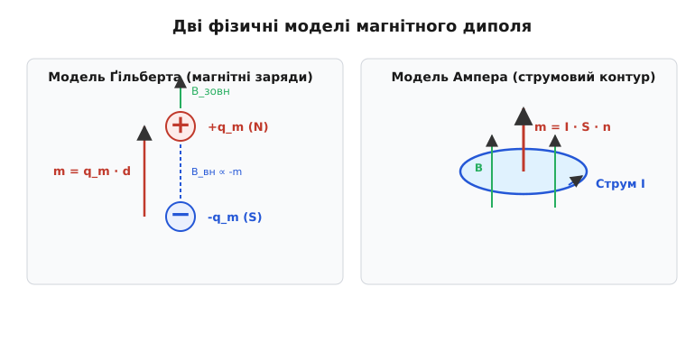
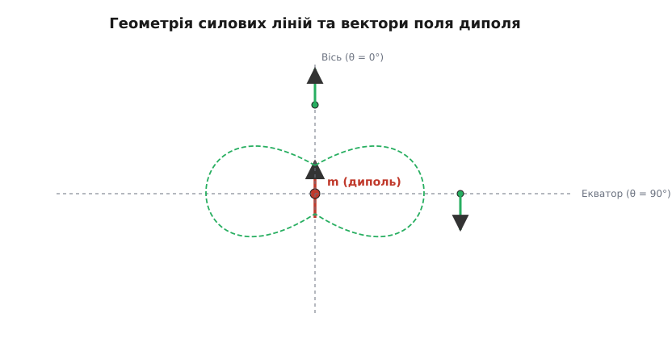
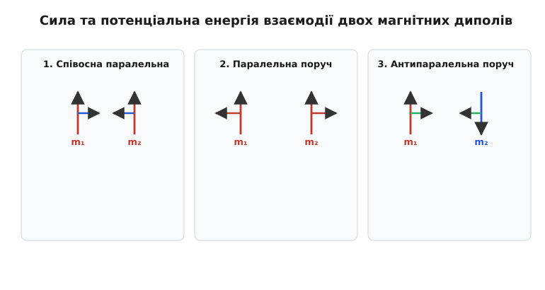
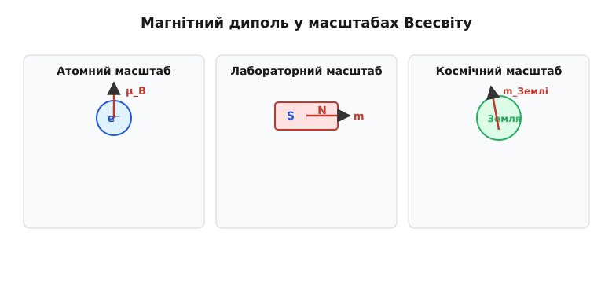

# Магнітний диполь: фундаментальне джерело магнітного поля

<preknowlist>
- [Магнітне поле](topic:physics/magnetic-field) — поняття про вектор індукції B, силові лінії та відсутність ізольованих магнітних зарядів.
- [Закон Біо–Савара](topic:physics/biot-savart-law) — зв'язок між електричним струмом та магнітним полем, яке він збуджує у просторі.
- [Магнітний момент](topic:physics/magnetic-moment) — векторна характеристика замкненого струмового контуру та його повертання у зовнішньому полі.
- [Закон Кулона](topic:physics/coulomb-law) — електростатична аналогія між електричним та магнітним диполем.
- [Сила Лоренца](topic:physics/lorentz-force) — мікроскопічний механізм дії магнітного поля на рухомі носії заряду.
</preknowlist>

Якщо розрізати навпіл постійний штабовий магніт із чітко вираженими північним та південним полюсами, очікування отримати два відокремлені «магнітні заряди» зазнає неминучого краху. Замість ізольованого північного чи південного полюса у руках опиняються два менші повноцінні магніти, кожен із яких володіє власним північним та південним полюсом. Якщо продовжити це подрібнення далі — дійти до окремих кристалічних комірок, атомів і навіть фундаментальних електронів — результат залишиться незмінним. У природі не існує ізольованих точкових магнітних зарядів або монополів (`∇ · B = 0`). Це означає, що найпростішим, фундаментальним та неподільним елементарним джерелом магнітного поля є не точковий заряд, а **магнітний диполь** (від грецького *ді* — двічі та *полос* — вісь, полюс).

В електростатиці точковий електричний заряд є первинною цеглиною, а електричний диполь виникає лише як комбінація двох окремих протилежних зарядів `+q` та `-q`. В електродинаміці навпаки: відсутність точкових магнітних монополів робить саме магнітний диполь головним та найпростішим джерелом магнітного поля. Усі випромінювальні радіоантени, постійні магніти, планетні магнітосфери й квантові спіни електронів на великих відстанях створюють поле, яке з високою точністю описується універсальною геометричною структурою поля магнітного диполя.

---

### Дві конкуруючі картини: модель Ампера проти моделі Ґільберта

Зіставлення магнітних і електричних явищ історично витворило два абсолютно різні уявлення про те, як внутрішньо влаштований магнітний диполь.

Перша картина — **модель Ґільберта** (або модель магнітних зарядів). У цій моделі диполь уявляють як пару двох фіктивних точкових магнітних зарядів `+q_m` (північний полюс N) та `-q_m` (південний полюс S), рознесених на малий вектор відстані `d`. Магнітний дипольний момент системи у цій модельній теорії дорівнює:

```
m = q_m · d
```

Друга картина — **модель Ампера** (модель струмового контуру). У ній магнітний диполь є крихітною замкненою планарною рамкою площею `S`, по якій протікає замкнений електричний струм `I`. Напрямок вектора нормалі `n` визначається правилом правої руки відносно напрямку течії струму:

```
m = I · S · n
```


*Модель Ґільберта бере за основу фіктивні магнітні заряди, тоді як реальна модель Ампера спирається на замкнений струмовий контур. На великих відстанях поля обох моделей ідентичні, але всередині джерела поле Ампера є неперервним.*

Зовні джерела — на відстанях `r`, що значно перевищують розміри самого диполя (`r >> d` або `r >> √S`) — обидві моделі створюють абсолютно тотожний розподіл магнітного поля у просторі. Проте між ними існує фундаментальна фізична відмінність у поведінці поля всередині самого диполя:
- У моделі Ґільберта лінії магнітного поля починаються на полюсі `+q_m` і закінчуються на `-q_m`. Всередині диполя вектор індукції спрямований проти вектора дипольного моменту `m` (поле є потенціальним, `∇ × B = 0`, але `∇ · B ≠ 0` в точках зарядів).
- У моделі Ампера лінії магнітного поля є неперервними замкненими петлями без початку та кінця. Вони пронизують струмову рамку наскрізь, і всередині контуру вектор поля `B` спрямований уздовж вектора магнітного моменту `m` (поле є strictly соленоїдальним, `∇ · B = 0` всюди у просторі).

Макроскопічна намагніченість речовини `M` (магнітний момент одиниці об'єму, `M = d m / dV`) у сучасному описі суцільних середовищ описується за допомогою зв'язаних струмів намагнічування. Зв'язаний об'ємний струм має густину `j_m = ∇ × M`, а поверхневий струм — густину `i_m = M × n`. Це остаточно інтегрує магнітні властивості речовини в систему рівнянь Максвелла без залучення фіктивних магнітних зарядів.

Зазначимо, що макроскопічні рівняння Максвелла у магнітних середовищах вводять два векторні поля: магнітну індукцію `B` та напруженість магнітного поля `H`. Вони пов'язані співвідношенням `B = μ₀ (H + M)`. У той час як вектор `B` є соленоїдальним (`∇ · B = 0`) і описує справжнє сумарне мікроскопічне магнітне поле, вектор `H` задовольняє рівняння `∇ · H = - ∇ · M = ρ_m`, де `ρ_m` виступає як ефективна густина зв'язаних магнітних зарядів. Тим самим математичний апарат моделі Ґільберта виявляється зручним формальним інструментом для розрахунку векторного поля `H` та розв'язання задач магнітостатики за допомогою скалярного магнітного потенціалу `ψ_m` (`H = - ∇ ψ_m`), хоча фізичними джерелами полів завжди залишаються електричні струми.

Квантова механіка й спектроскопічні вимірювання надтонкої структури атомних рівнів остаточно довели, що саме модель струмового контуру Ампера відповідає дійсному фізичному влаштуванню природи. Усі макроскопічні та мікроскопічні диполі виникають унаслідок руху електричних зарядів чи наявності у них власного квантового спіну. Детальніше про багатовікове змагання цих наукових гіпотез та експерименти Фермі можна прочитати в [історичному екскурс про гіпотези Ампера й Ґільберта](topic:physics/magnetic-dipole/hist-ampere-gilbert.md).

---

### Магнітний векторний потенціал та мультипольний розклад

Для розрахунку магнітного поля, створеного довільною локалізованою системою стаціонарних струмів з густиною `j(r')`, найзручніше використати магнітний векторний потенціал `A(r)`. У кулонівській калібрувальні симетрії (`∇ · A = 0`) векторний потенціал у точці спостереження `r` визначається інтегралом:

```
A(r) = (μ₀ / 4π) · ∫ [ j(r') / |r - r'| ] d³r'
```

де `μ₀ = 4π × 10⁻⁷` Гн/м — магнітна стала, а інтегрування виконується по об'єму джерел `V'`.

У дальній зоні, де відстань від джерела до точки спостереження `r = |r|` значно перевищує розміри області джерел `r'`, скалярний дріб `1 / |r - r'|` розкладають у ряд Тейлора за малим параметром `(r' / r)`:

```
1 / |r - r'| = (1 / r) + (r · r') / r³ + (3 (r · r')² - r² r'²) / (2 r⁵) + ...
```

Підставляючи цей розклад в інтеграл для `A(r)`, отримуємо мультипольний розклад векторного потенціалу:

1. **Монопольний доданок (`l = 0`):**
   ```
   A_mono(r) = (μ₀ / 4π r) · ∫ j(r') d³r'
   ```
   Завдяки стаціонарності струмів та рівнянню неперервності `∇' · j = 0` інтеграл від густини струму по всьому об'єму замкненої системи строго дорівнює нулю (`∫ j d³r' = 0`). Це є математичним відображенням відсутності магнітних монополів.

2. **Дипольний доданок (`l = 1`):**
   Другий член є найнижчим ненульовим доданком розкладу:
   ```
   A_dip(r) = (μ₀ / 4π r³) · ∫ j(r') (r · r') d³r'
   ```
   Розкладаючи добуток `j_i x_k'` на симетричну та антисиметричну частини та враховуючи, що симетрична частина інтегрується в нуль через стаціонарність, інтеграл зводиться до векторного добутку:
   ```
   A_dip(r) = (μ₀ / 4π r³) · [ -1/2 r × ∫ (r' × j(r')) d³r' ]
   ```

Визначаючи **вектор магнітного дипольного моменту** `m` для довільного об'ємного розподілу струмів як:

```
m = 1/2 · ∫ (r' × j(r')) d³r'
```

отримуємо універсальну формулу дипольного векторного потенціалу у дальній зоні:

```
A(r)
= (μ₀ / 4π) · (m × r) / r³
= (μ₀ / 4π r²) · (m × r̂)              [де r̂ = r / r — одиничний радіус-вектор]
```

Ця формула показує, що векторний потенціал `A(r)` у будь-якій точці перпендикулярний як до вектора магнітного моменту `m`, так і до радіус-вектора `r`. Силові лінії векторного потенціалу утворюють концентричні кола навколо осі диполя.

---

### Магнітне поле диполя у довільній точці простору

Оскільки вектор індукції магнітного поля пов'язаний із векторним потенціалом ротором `B = ∇ × A`, розкриття ротора від виразу `A = (μ₀ / 4π) (m × r) / r³` у точках поза джерелом (`r ≠ 0`) вимагає диференціювання добутку скалярної функції `1/r³` на векторне поле `m × r`:

```
∇ × [ (m × r) / r³ ]
= (1 / r³) ∇ × (m × r) + [ ∇ (1 / r³) ] × (m × r)
```

Обчислюючи окремо кожен доданок за допомогою векторної тотожності `BAC-CAB` та знаходячи градієнт `∇ (1/r³) = - 3 r / r⁵`, отримуємо:

```
(1 / r³) (2 m) + [ -3 r / r⁵ ] × (m × r)
= (2 m / r³) - (3 / r⁵) [ m (r · r) - r (m · r) ]
= (3 (m · r̂) r̂ - m) / r³
```

Підстановка цього результату дає фундаментальну формулу для індукції магнітного поля диполя у зовнішньому просторі:

```
B(r) = (μ₀ / 4π r³) · [ 3 (m · r̂) r̂ - m ]   [для всіх точок r ≠ 0]
```

Цей вираз є фундаментальним законом для поля точкового магнітного диполя. Він показує, що індукція магнітного поля спадає з відстанню як `1 / r³` — значно швидше, ніж поле поодинокого точкового електричного заряду (`1 / r²`).


*Силові лінії магнітного диполя утворюють симетричні замкнені петлі. Вектор індукції на осі диполя вдвічі більший за модуль поля на екваторі на такій самій відстані.*

Щоб наочно уявити просторову геометрію поля, виберемо систему координат із початком у точці диполя та віссю `z`, спрямованою вздовж вектора `m`. У сферичних координатах `(r, θ, φ)` компоненти вектора індукції `B` виражаються формулами:

```
B_r = (μ₀ m / 2π r³) · cos θ           [радіальна компонента]
B_θ = (μ₀ m / 4π r³) · sin θ           [кутова меридіональна компонента]
B_φ = 0                                [азимутальна компонента відсутня]
```

Модуль вектора магнітної індукції залежить від відстані `r` та полярного кута `θ`:

```
|B(r, θ)| = (μ₀ m / 4π r³) · √(1 + 3 cos² θ)
```

Проаналізуємо дві характерні ортогональні геометрії поля:

1. **Точки на осі диполя (`θ = 0°` або `θ = 180°`):**
   Тут `cos θ = ±1`, а `sin θ = 0`. Поле є чисто радіальним, спрямованим паралельно до вектора моменту `m`:
   ```
   B_осі = (μ₀ / 2π) · (m / r³)
   ```

2. **Точки у площині екватора (`θ = 90°`):**
   Тут `cos θ = 0`, а `sin θ = 1`. Поле є меридіональним, спрямованим строго антипаралельно до вектора моменту `m`:
   ```
   B_екв = - (μ₀ / 4π) · (m / r³)
   ```

Порівняння цих двох точок показує важливу універсальну властивість дипольного поля: на однаковій відстані `r` індукція магнітного поля на осі диполя є **вдвічі більшою** за індукцію поля на екваторі (`B_осі / B_екв = 2`).

У декартовій системі координат `(x, y, z)` при орієнтації диполя вздовж осі `z` (`m = m ẑ`) компоненти вектора магнітної індукції набувають вигляду:

```
B_x = (3 μ₀ m / 4π r⁵) · x z
B_y = (3 μ₀ m / 4π r⁵) · y z
B_z = (μ₀ m / 4π r⁵) · (2 z² - x² - y²)
```

де `r = √(x² + y² + z²)`. З цих формул чітко видно осьову симетрію поля відносно повороту навколо осі `z`.

Рівняння силових ліній у сферичних координатах отримується з диференціального співвідношення `dr / B_r = r dθ / B_θ`. Підставляючи сферичні компоненти поля, маємо:

```
dr / [ (μ₀ m / 2π r³) cos θ ] = r dθ / [ (μ₀ m / 4π r³) sin θ ]
=> dr / r = 2 cos θ / sin θ dθ = 2 d(sin θ) / sin θ
```

Після інтегрування це дає явну формулу силових ліній:

```
r(θ) = R₀ · sin² θ
```

де `R₀` — екваторіальний радіус силової лінії (максимальна відстань від диполя при `θ = 90°`).

Повний кроковий розклад векторного потенціалу, диференціювання та інтегрування силових ліній наведено у [математичному виводі поля та точкового члена](topic:physics/magnetic-dipole/math-dipole-derivation.md).

---

### Внутрішнє поле та точковий контактний член Фермі

Формула `B(r) = (μ₀ / 4π r³) [3(m · r̂)r̂ - m]` описує поле диполя у будь-якій точці зовнішнього простору, крім самого центру `r = 0`. Але що відбувається, якщо спостерігач чи інша частинка опиняється безпосередньо у точці розташування диполя?

Для точкового диполя Ампера інтегрування поля по об'єму кулі радіуса `R -> 0`, що містить джерело струму, дає ненульовий інтегральний внесок `⟨B⟩ = (2μ₀ / 3) m`. Загальний строгий вираз для магнітної індукції точкового диполя, придатний для абсолютно всіх точок простору, включаючи точкову сингулярність у початку координат, має вигляд:

```
B_повне(r) = (μ₀ / 4π r³) · [ 3 (m · r̂) r̂ - m ] + (2μ₀ / 3) · m · δ³(r)
```

де `δ³(r)` — тривимірна дельта-функція Дірака. 

Додаток `(2μ₀ / 3) · m · δ³(r)` називається **контактним членом Фермі**. Він описує ефективне магнітне поле безпосередньо всередині струмового контуру. У класичній макроскопічній електродинаміці цей член виявляється непомітним, оскільки ймовірність потрапити макроскопічним вимірювальним датчиком точно в точкову сингулярність дорівнює нулю. Проте у квантовій фізиці цей доданок має вирішальне значення!

В атомі водню s-електрон має квантову хвильову функцію, яка досягає максимальної густини імовірності саме в точці розташування протона-ядра (`r = 0`). Завдяки дельта-члену Фермі спіновий магнітний диполь електрона взаємодіє зі спіновим магнітним диполем ядра безпосередньо у точці `r = 0`. Ця взаємодія спричиняє **надтонке розщеплення** основного стану водню. Зміна орієнтації спіну електрона відносно спіну ядра призводить до випромінювання або поглинання радіохвилі довжиною **21 см** (частота 1420.4057 МГц). Ця 21-сантиметрова лінія є найважливішим джерелом інформації у радіоастрономії, за допомогою якого астрономи картографують розподіл міжзоряного водню у нашій та інших галактиках.

---

### Сили, моменти та енергія диполя у зовнішньому полі

Коли магнітний диполь із моментом `m` вміщують у зовнішнє магнітне поле `B(r)`, на нього діють механічні сили та повертаючі моменти, а сама система володіє потенціальною енергією.

1. **Потенціальна енергія орієнтації `U`:**
   Робота, необхідна для повороту диполя у магнітному полі, визначає його потенціальну енергію:
   ```
   U = - m · B = - |m| |B| cos θ
   ```
   Енергія є мінімальною (`U_min = - m B`), коли вектор магнітного моменту `m` спрямований паралельно до поля `B` (`θ = 0°`). Це відповідає стану стійкої рівноваги. Енергія є максимальною (`U_max = + m B`), коли диполь спрямований протилежно до поля (`θ = 180°`), що відповідає нестійкій рівновазі.

2. **Обертальний момент `τ`:**
   У однорідному магнітному полі результуюча сила, що діє на диполь, дорівнює нулю, але виникає повертаючий парний момент сил:
   ```
   τ = m × B
   ```
   Модуль повертаючого моменту дорівнює `|τ| = m B sin θ`. Цей момент прагне розвернути диполь так, щоб сумістити вектор `m` із напрямком зовнішнього поля `B`. Саме ця дія змушує стрілку компаса орієнтуватися уздовж магнітних силових ліній Землі.

3. **Сила у неоднорідному полі `F`:**
   Якщо зовнішнє магнітне поле є неоднорідним (`∇B ≠ 0`), на диполь діє результуюча поступальна сила:
   ```
   F = ∇ (m · B)
   ```
   Для стаціонарного поля відсутність вихрів (`∇ × B = 0`) дає змогу переписати силу у формі `F = (m · ∇) B`. Якщо диполь орієнтований уздовж поля (`m ∥ B`), сила спрямована в бік зростання модуля поля (`F = m ∇B`). Це означає, що орієнтований диполь завжди **втягується** у область сильнішого магнітного поля. На цьому явищі базується дія магнітних сепараторів, утримування плазми у стелараторах та магнітна левітація діамагнетиків.

4. **Прецесія Лармора та ефект Ейнштейна — де Хааса:**
   Якщо магнітний диполь володіє власним кутовим моментом імпульсу `L` (як електрон із квантовим спіном чи обертовий феромагнітний ротор), пов'язаним із магнітним моментом через гіромагнітне відношення `m = γ L`, діючий обертальний момент `τ = m × B` не розвертає вектор `m` напряму до поля. Натомість виникає гіроскопічний ефект — **прецесія Лармора**:
   ```
   dL / dt = τ => dm / dt = γ (m × B)
   ```
   Вектор магнітного моменту обертається по конусу навколо вектора індукції `B` зі сталою кутовою частотою Лармора `ω_L = γ B`. Для спіну вільного електрона у полі `1 Тл` частота Лармора становить близько `28.02 ГГц`, а для протона — `42.57 МГц`. Цей ефект лежить в основі спектроскопії електронного парамагнітного резонансу (ЕПР) та ядерного магнітного резонансу (ЯМР). Прямим механічним підтвердженням зв'язку між спіновим кутовим моментом та магнітним дипольним моментом є **ефект Ейнштейна — де Хааса** (1915 рік): при намагнічуванні висячого феромагнітного циліндра змінюється орієнтація атомних диполів, що змушує весь макроскопічний циліндр повертатися навколо своєї осі для збереження повного моменту імпульсу. Метод електронного парамагнітного резонансу (ЕПР) застосовують для аналізу вільних радикалів, радіаційних центрів забарвлення у кристалах та активних центрів ферментів у біофізиці та хімії.

---

### Взаємодія двох магнітних диполів

Коли у просторі знаходяться два магнітні диполі з моментами `m₁` та `m₂`, рознесені на вектор `r = r₂ - r₁`, кожен із них перебуває у магнітному полі іншого.

Потенціальна енергія взаємодії двох диполів `U₁₂` дорівнює:

```
U₁₂ = - m₂ · B₁(r)
```

Підставляючи вираз для поля `B₁`, отримуємо симетричну формулу енергії взаємодії:

```
U₁₂ = (μ₀ / 4π r³) · [ m₁ · m₂ - 3 (m₁ · r̂) (m₂ · r̂) ]
```

З цієї формули видно, що енергія взаємодії залежить не лише від відстані між диполями (`1 / r³`), а й від їхньої взаємної орієнтації у просторі.


*Характер взаємодії (притягання чи відштовхування) та енергія системи повністю визначаються кутовою орієнтацією дипольних векторів.*

Проаналізуємо три характерні взаємні орієнтації двох одинакових диполів (`|m₁| = |m₂| = m`):

1. **Співосна паралельна орієнтація (`m₁ ∥ m₂ ∥ r`):**
   Диполі розташовані один за одним уздовж однієї лінії й спрямовані в один бік.
   ```
   U = - (μ₀ m² / 2π r³)
   ```
   Енергія є мінімальною (від'ємною). Між диполями виникає **сила притягання**, яка намагається наблизити їх один до одного:
   ```
   F = - ∇ U = - (3 μ₀ m² / 2π r⁴) r̂       [сила спадає як 1/r⁴]
   ```

2. **Паралельна орієнтація збоку (`m₁ ∥ m₂ ⊥ r`):**
   Диполі розташовані поруч на паралельних осях і спрямовані в один бік.
   ```
   U = + (μ₀ m² / 4π r³)
   ```
   Енергія є додатною. Між диполями виникає **сила відштовхування**:
   ```
   F = + (3 μ₀ m² / 4π r⁴) r̂
   ```

3. **Антипаралельна орієнтація збоку (`m₁ ⇈ m₂ ⊥ r`, але протилежно):**
   Диполі розташовані поруч, але спрямовані в протилежні боки.
   ```
   U = - (μ₀ m² / 4π r³)
   ```
   Енергія є від'ємною, стан є стійким, а сила є **притягальною**.

Загальний вираз для сили взаємодії `F₂`, що діє на другий диполь у полі першого, отримується градієнтом `F₂ = - ∇ U₁₂`:

```
F₂ = (3 μ₀ / 4π r⁴) · [ (m₁ · r̂) m₂ + (m₂ · r̂) m₁ + (m₁ · m₂ - 5 (m₁ · r̂) (m₂ · r̂)) r̂ ]
```

Згідно з третім законом Ньютона, сила діюча на перший диполь строго дорівнює `F₁ = - F₂`. Сила взаємодії диполів спадає як `1 / r⁴` — значно швидше за кулонівську силу взаємодії точкових зарядів (`1 / r²`).

У неоднорідному зовнішньому полі `B` на диполь із моментом `m` діє втягуюча сила `F = ∇ (m · B)`. Якщо незамагнічений залізний предмет наближають до джерела поля, зовні поле індукує у ньому магнітний дипольний момент `m`, спрямований уздовж силових ліній. Оскільки градієнт поля `∇ B` спрямований у бік джерела, індукований диполь завжди притягується до полюса магніту незалежно від того, який полюс наближають.

Крім поступальної сили `F`, на кожен із диполів діє **обертальний момент** `τ = m₂ × B₁`, який прагне розвернути диполі у стан із найнижчою потенціальною енергією. Саме тому дрібні ошурки заліза у класичному шкільному досліді орієнтуються уздовж силових ліній магніту: кожен ошурок стає індукованим диполем, розвертається під дією моменту `τ` та притягується до сусідніх ошурків за рахунок сили `F`.

Практичні обчислення полів, сил та моментів для двох диполів у тривимірному просторі реалізовано у [програмній симуляції взаємодії диполів](topic:physics/magnetic-dipole/proj-dipole-field-sim.md).

---

### Макроскопічна намагніченість та розмагнічувальне поле

У суцільних середовищах сукупність величезної кількості атомних диполів описується макроскопічним вектором **намагніченості** `M`, який визначається як суммарний магнітний момент одиниці об'єму:

```
M = lim_{ΔV -> 0} (1 / ΔV) · ∑ m_i
```

Вектор намагніченості вимірюється в амперах на метр (`А/м`). У неферомагнітних середовищах (парамагнетиках та діамагнетиках) намагніченість лінійно залежить від зовнішнього магнітного поля: `M = χ_m H`, де `χ_m` — безрозмірна магнітна сприйнятливість середовища.

Використання вектора намагніченості дає змогу еквівалентно замінити зв'язані атомні диполі макроскопічними струмами намагнічування. Згідно з теоремами векторного аналізу, намагнічене тіло створює у просторі таке саме магнітне поле, як і система з двох струмів:
- **Об'ємний зв'язаний струм** із густиною `j_b = ∇ × M` усередині тіла.
- **Поверхневий зв'язаний струм** із густиною `K_b = M × n` на границі тіла, де `n` — зовнішня нормаль.

Для скінченного магнітного зразка (наприклад, суцільного залізного циліндра чи кулі), вміщеного у зовнішнє поле `H_ext`, скапчування зв'язаних магнітних зарядів на його поверхні створює внутрішнє **розмагнічувальне поле** `H_d`, спрямоване протилежно до намагніченості `M`:

```
H_d = - N · M
```

де `N` — безрозмірний розмагнічувальний фактор, який залежить від геометрії тіла. Для тонкого плоского диска при намагнічуванні перпендикулярно до площини `N = 1`; для ідеальної кулі `N = 1/3`; для нескінченно довгого тонкого циліндра при намагнічуванні уздовж осі `N = 0`. 

При аналізі мікроскопічного поля, яке діє на окремий ізольований атомний диполь усередині суцільного магнітного середовища, узагальнений підхід Лоренца виключає власне поле самого диполя шляхом уявного вирізання сферичної порожнини. Мікроскопічне **локальне поле Лоренца** `B_loc`, яке діє на дане атомне джерело, дорівнює:

```
B_loc = B + (μ₀ / 3) · M
```

Врахування розмагнічувального фактора та локального поля Лоренца є критично важливим при проектуванні сердечників трансформаторів, магнітних давачів та прецизійних вимірювальних систем.

---

### Енергія магнітного поля диполя та власна енергія джерела

Об'ємна густина енергії магнітного поля у вакуумі виражається формулою `w_m = B² / (2 μ₀)`. Для обчислення повної енергії поля `W_m`, збереженої в усьому просторі навколо точкового магнітного диполя, необхідно обчислити об'ємний інтеграл:

```
W_m = ∫ w_m d³V = (1 / 2 μ₀) ∫_V B²(r) d³V
```

Підставляючи квадрат модуля дипольної індукції `|B(r, θ)|² = (μ₀ m / 4π r³)² (1 + 3 cos² θ)` і виконуючи інтегрування у сферичних координатах поза кулею малого радіуса `R`:

```
W_m(r > R)
= (μ₀ m² / 32 π²) · ∫_R^∞ (1 / r⁶) r² dr · ∫_0^π (1 + 3 cos² θ) 2π sin θ dθ
= (μ₀ m² / 32 π²) · [ 1 / (3 R³) ] · [ 4π · 2 ]
= (μ₀ m²) / (12 π R³)
```

Цей вираз показує, що при наближенні радіуса кулі до нуля (`R -> 0`) енергія поля диполя прямує до нескінченності за законом `1 / R³`. Це виявляє точкову сингулярність класичної електродинаміки. У реальній квантовій фізиці ця сингулярність усувається тим, що реальні частинки (електрони чи протони) не є просто класичними точковими кульками: вони володіють квантово-механічною неозначеністю координати та квантовими поляризаційними ефектами вакууму на відстанях порядку комптонівської довжини хвилі.

---

### Випромінювання змінного магнітного диполя у дальній зоні

Якщо магнітний дипольний момент змінюється з часом за гармонічним законом `m(t) = m₀ cos(ω t)`, така система перестає бути чисто стаціонарною і стає джерелом **електромагнітного випромінювання**.

Запізнювальний векторний потенціал у дальній хвильовій зоні (`r >> λ`, де `λ = c / ω` — довжина хвилі) визначається похідною від магнітного моменту по запізнювальному часу `t' = t - r/c`:

```
A_rad(r, t) = (μ₀ / 4π c r) · [ ṁ(t - r/c) × r̂ ]
```

Поля випромінювання (вихрове електричне `E_rad` та запізнювальне магнітне `B_rad`) у дальній зоні є взаємно перпендикулярними й поперечними відносно напрямку поширення хвилі `r̂`:

```
B_rad = - (μ₀ / 4π c² r) · [ m̈(t - r/c) × r̂ ] × r̂
E_rad = c · (B_rad × r̂)
```

Амплітуда поля випромінювання спадає з відстанню як `1 / r` (значно повільніше за статичне дипольне поле `1 / r³`). Повний потік енергії, що випромінюється змінним магнітним диполем за одиницю часу (середня потужність випромінювання), визначається формулою Лармора для магнітного диполя:

```
P_rad = (μ₀ m₀² ω⁴) / (6 π c³)
```

Залежність потужності випромінювання від частоти у четвертому степені (`P ∝ ω⁴`) пояснює, чому низькочастотні зміни магнітного поля практично не створюють випромінювання, тоді як високочастотні дипольні коливання у радіоантенах та астрофізичних пульсарах стають потужними джерелами електромагнітних хвиль.

---

### Термодинаміка та статистична фізика дипольних систем

У статистичній фізиці ансамбль з `N` орієнтованих магнітних диполів при скінченній температурі `T` перебуває під хаотичною дією теплових флуктуацій. У зовнішньому однорідному магнітному полі `B` потенціальна енергія кожного диполя `U = - m B cos θ` змагається з тепловим рухом `k_B T`.

Розподіл Больцмана визначає ймовірність того, що магнітний диполь утворив кут `θ` з напрямком поля:

```
dP(θ) = C · exp(m B cos θ / (k_B T)) · sin θ dθ
```

Усереднення вектора магнітного моменту по статистичному ансамблю дає макроскопічну намагніченість парамагнетика, яка описується **функцією Ланжевена** `L(x)`:

```
M = N_v m · L(x) = N_v m · [ coth(x) - 1/x ]
```

де `x = m B / (k_B T)`, а `N_v` — об'ємна концентрація диполів.

У слабких магнітних полях або при високих температурах (`x << 1`) розклад функції Ланжевена Тейлором `L(x) ≈ x / 3` виводить класичний **закон Кюрі** для магнітної сприйнятливості:

```
χ_m = μ₀ M / B = (μ₀ N_v m²) / (3 k_B T) = C / T
```

де `C = μ₀ N_v m² / (3 k_B)` — стала Кюрі. Закон Кюрі показує, що магнітна сприйнятливість парамагнітного середовища обернено пропорційна абсолютній температурі. У квантовій теорії класична функція Ланжевена узагальнюється на випадок дискретних проєкцій спіну через **функцію Бріллюена** `B_J(x)`.

---

### Магнітний диполь від квантового спіну до макросвіту й космосу

Магнітний диполь є надивовижу універсальною концепцією, яка працює на масштабах, що різняться на 50 порядків величини.


*Дипольна структура магнітного поля проявляється на всіх рівнях материї: від фундаментального спіну електрона до магнітосфер планет і пульсарів.*

- **Атомний та субмікроскопічний масштаб:**
  Електрон має власний магнітний дипольний момент, пов'язаний зі спіном: `m_e ≈ 9.28474 × 10⁻²⁴ А·м²`. Ця величина близька до природної атомної одиниці магнетизму — **магнетона Бора** `μ_B = e ℏ / (2 m_e)`. Внаслідок квантово-електродинамічних ефектів поляризації вакууму спіновий g-фактор електрона злегка відрізняється від 2: `g_e ≈ 2.002319`. Нуклони (протони та нейтрони) також мають власний магнітний момент, виражуваний у ядерних магнетонах `μ_N = e ℏ / (2 m_p)` (`μ_N ≈ 5.05078 × 10⁻²⁷ А·м²`). Протон має момент `m_p ≈ 2.7928 μ_N`, а нейтрон — від'ємний момент `m_n ≈ -1.9130 μ_N`, що доводить наявність у нього внутрішньої кваркової структури. Ядерний магнітний дипольний момент є основою методу **ядерного магнітного резонансу (ЯМР)** та медичної томографії (МРТ).

- **Макроскопічний лабораторний масштаб:**
  У постійному магніті (наприклад, неодимовому магніті NdFeB) сумарний магнітний дипольний момент утворюється завдяки узгодженій орієнтації спінових диполів мільярдів атомів усередині феромагнітних доменів. Магніт об'ємом у кілька кубічних сантиметрів може мати дипольний момент `m ~ 1 - 10 А·м²`. У лабораторних соленоїдах та котушках момент регулюється струмом і числом витків (`m = N I S`).

- **Планетарний та астрофізичний масштаб:**
  Геомагнітне поле Землі на відстанях понад 2–3 радіуси планети з високою точністю описується полем магнітного диполя з моментом `m_Землі ≈ 7.94 × 10²² А·м²`. Вісь цього диполя нахилена під кутом близько 11.5° до географічної осі обертання Землі та зазнає повільної вікової прецесії та періодичних інверсій (переполюсовок). Саме дипольна структура геомагнітного поля створює магнітосферу та пастки для заряджених частинок сонячного вітру (радіаційні пояси Ван Аллена). У нейтронних зірок (пульсарів та магнетарів) магнітні дипольні моменти сягають `10²⁶ - 10²⁸ А·м²`, а їхнє швидке обертання викликає колосальне дипольне випромінювання електромагнітних хвиль із потужністю `P = (μ₀ m² ω⁴ sin² α) / (6 π c³)`.

Числові значення параметрів для різних дипольних систем та системи переведення одиниць вимірювання наведено у [довіднику величин та характеристик диполів](topic:physics/magnetic-dipole/api-magnetic-dipole-calc.md).

---

> 🔧 **Навіщо це.**
> 
> Уявлення про магнітний диполь є наріжним каменем сучасних технологій:
> 1. **Медична діагностика (МРТ):** Магнітно-резонансна томографія базується на прецесії ядерних магнітних диполів атома водню у сильному зовнішньому полі.
> 2. **Навігаційні системи:** Давачі магнітного поля (трикомпонентні магнітометри) вимірюють вектор дипольного поля Землі для орієнтації безпілотників, смартфонів та космічних апаратів.
> 3. **Магнітні матеріали та пам'ять:** Технологія магнітної оперативної пам'яті (MRAM) та жорсткі диски використовують перемикання орієнтації мікроскопічних магнітних диполів у тонкоплівкових елементах.
> 4. **Магнітний захист та екранування:** Розрахунок спадання поля за законом `1 / r³` дає змогу проектувати безпечні зони для чутливої електронної апаратури поблизу трансформаторів та силових кабелів.
