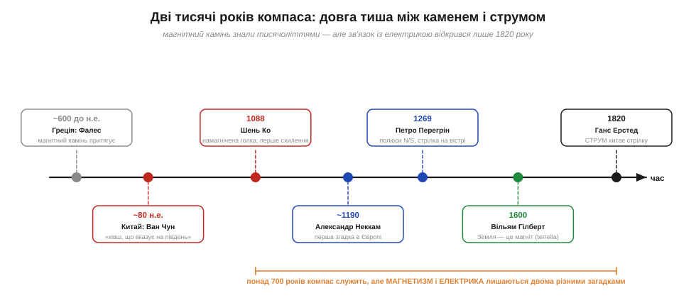
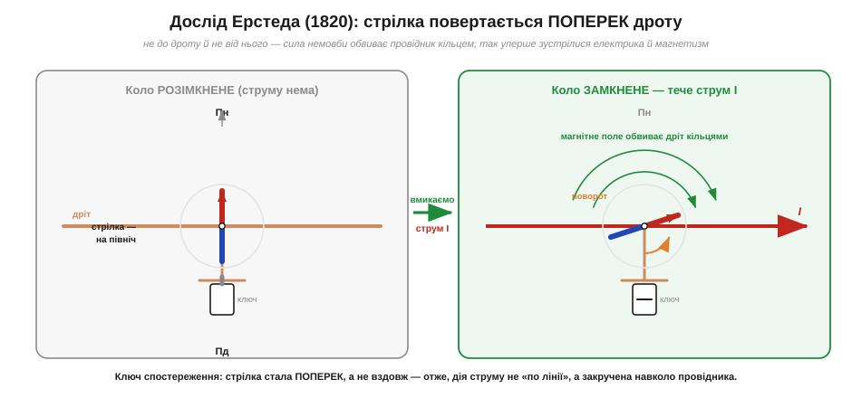

# 📜 Від магнітного каменю до Ерстеда: дві тисячі років компаса і день, коли стрілка смикнулась

Найдавніший з відомих людству «давачів поля» — магнітна стрілка, що сама знаходить північ. За цим звичним приладом — приголомшливо довга історія: магнітний камінь дивував людей **тисячоліттями**, компас вів кораблі **майже вісім століть**, а ось зв'язок магнетизму з електрикою впав фізикам до рук лише 1820 року — за життя людей, які вже користувалися батареєю Вольти. Ця історія — про те, чому розгадка чекала так довго, і про данського професора, у якого стрілка смикнулась перед очима в студентів.

---

## Камінь, що притягує залізо

Почнемо з самого каменя. Десь у землях Малої Азії — за переказом, поблизу області **Магнесія** (*Magnesia*) — люди ще в давнину знаходили чорнуваті брили, які самі собою притягували залізо. Грецька назва області й дала ім'я **магнітові** (*magnet*); та сама Магнесія, до речі, лишила слід і в назвах магнію та марганцю. Найдавніший зафіксований подив перед цим каменем приписують **Фалесові з Мілета** (*Thales*, ~600 до н. е.): він, кажуть, вважав, що магніт має «душу», бо рухає залізо. Це, звісно, напівлегенда — від Фалеса не лишилося власних текстів, ми знаємо про нього з переказів пізніших авторів, тож статус деталей тут хисткий **(перевірити)**. Але сам факт промовистий: камінь, що діє **на відстані, крізь порожнечу**, без дотику й видимої причини, бентежив найкращі уми ще на світанку науки.

Цей камінь має й окрему англійську назву, варту запам'ятати: **lodestone**. Її корінь — давнє *lode*, «шлях, провід» (споріднене з *to lead*, вести): дослівно «провідний камінь», «камінь, що вказує дорогу». У самій назві вже захована головна його роль — не притягувати залізо, а **вказувати напрям**. Фізично це різновид мінералу **магнетиту** (*magnetite*, Fe₃O₄), якого вдарила блискавка чи інакше намагнітила природа. Чому одні шматки заліза магнітні, а інші ні, чому камінь не «розряджається» від часу — на ці питання відповідає [феромагнетизм і магнітні домени](topic:physics/ferromagnetism); тут нам важлива інша загадка — **напрям**.

## Південна стрілка Китаю

Те, що магнітний камінь не просто притягує, а ще й **сам повертається** в певний бік, першими надійно описали в Китаї. Уже в I столітті нашої ери філософ **Ван Чун** (*Wang Chong*, ~80 н. е.) у трактаті «Лунхен» згадує **«ківш, що вказує на південь»**: вирізану з магнітного каменю ложку, яка, крутнувшись на гладкій бронзовій дошці, спинялася держаком на південь. Спершу це був не навігаційний прилад, а інструмент **геомантії** (*feng shui*) — мистецтва правильно орієнтувати будівлі й могили. Дуже по-людському: дивовижну властивість природи спершу вживають для ворожіння й обрядів, і лише згодом — для діла.

Великий крок зробив у XI столітті вчений-енциклопедист **Шень Ко** (*Shen Kuo*, 1031–1095). У його «Нотатках зі струмка снів» (*Dream Pool Essays*, 1088) уперше чітко описано **намагнічену сталеву голку**: її намагнічували, потерши об магнітний камінь, а тоді підвішували на шовковинці або клали на воду — і вона ставала вздовж лінії північ-південь. Голка зручніша за важкий «ківш» і чутливіша. Та Шень Ко зробив навіть більше: він першим у світі **помітив, що стрілка вказує не точно на південь**, а трохи вбік. Сьогодні ми звемо це **магнітним схиленням** (*declination*) — кут між напрямом на справжній (географічний) полюс і на магнітний. Минуть століття, перш ніж стане зрозуміло, чому так; але сам факт, що компас «трохи бреше», уважний спостерігач зафіксував уже у XI столітті. (Чому стрілка не показує точно на північ, з'ясовує [магнітне поле Землі](topic:physics/earth-magnetic-field).)

Звідти стрілка швидко перейшла на кораблі. Трактат **Чжу Юя** (*Zhu Yu*) «Застільні бесіди в Пінчжоу» (1111–1117) уже згадує компас як звичну річ у мореплавців південних морів — провадити судно тоді, коли небо затягнуте і не видно ні сонця, ні зорі. Морякам нарешті дісталося те, чого їм бракувало завжди: надійний напрям у будь-яку погоду.

*Дві тисячі років компаса. Магнітний камінь і його властивість вказувати напрям знали з давнини; навігаційний компас служив від XI–XII століть. Та між цим і відкриттям зв'язку електрики з магнетизмом (Ерстед, 1820) лежить розрив у понад сімсот років, упродовж яких магнетизм і електрику вважали двома окремими загадками.*

## Компас приходить у Європу

Минуло ще століття — і та сама стрілка зринає на іншому кінці світу. У європейських писемних джерелах вона з'являється наприкінці XII століття. Перша певна згадка належить англійському ченцеві **Александру Неккаму** (*Alexander Neckam*, ~1190): у трактаті «Про природу речей» він описує, як моряки в похмуру погоду орієнтуються за намагніченою голкою. Чи прийшло це знання зі Сходу торговельними шляхами, чи Європа дійшла до нього самотужки — питання й досі відкрите **(перевірити)**; найімовірніше, ідея мандрувала через посередників, а деінде її й перевідкривали наново. Як це часто буває з винаходами, чіткого «першого автора» в компаса немає — він проступав у різних краях.

Тут варто розвіяти один живучий міф. У багатьох старих книжках можна прочитати, що компас винайшов якийсь **Флавіо Джоя** (*Flavio Gioia*) з Амальфі близько 1300 року. Це **майже напевно легенда**: такої постаті в надійних документах не знайдено, а сам компас, як ми бачили, описаний і в Китаї, і в Європі задовго до того. Схоже, переказ виник із непорозуміння в пізніших текстах і прижився, бо людям подобаються прості історії «один геній — один винахід». Насправді ж компас — плід багатьох рук і кількох культур; приписувати його одному місту чи одній людині несправедливо й неправдиво.

А ось хто справді зробив у середньовічній Європі важливий крок — це французький учений **Петро Перегрін** (*Petrus Peregrinus de Maricourt*, він же П'єр де Марикур). Улітку 1269 року, будучи військовим інженером при облозі міста на півдні Італії, він написав **«Лист про магніт»** (*Epistola de magnete*) — перший дослідний трактат про магнетизм у Європі, який дійшов до нас. Перегрін перший **дав полюсам назви**: він катав сферичний магнітний камінь, стежив, куди лягає на ньому стрілка, побачив, що лінії збігаються у двох точках, і назвав їх **полюсами** — за аналогією з полюсами небесної сфери. Він описав, що однойменні полюси відштовхуються, різнойменні притягуються, що магніт не можна розділити на «окремий північ» і «окремий південь» (зламаєш — і кожен уламок знову матиме два полюси), і навіть змайстрував компас із **стрілкою на вістрі** — прообраз сухого компаса. Це був на диво сучасний за духом текст: не міркування про «душу каменя», а **досліди й висновки з них**. На жаль, на століття з гаком він лишився майже непоміченим.

## Гілберт: Земля — це великий магніт

Без читачів той тверезий метод Перегріна нічого не змінив, і аж до 1600 року магнетизм лишався клубком напівмагічних уявлень: вірили, що компас притягує Полярна зоря, що часник псує магніт, що десь на півночі стоїть велетенська магнітна гора. Розрубав цей вузол англієць **Вільям Гілберт** (*William Gilbert*, 1544–1603), придворний лікар королеви Єлизавети I, у книзі **«Про магніт»** (*De Magnete*, 1600) — одній із перших по-справжньому експериментальних праць у фізиці.

Головна Гілбертова думка була зухвало проста й водночас грандіозна: **сама Земля — це величезний магніт**. Щоб довести це, він виточив із магнітного каменю кульку — назвав її **«терела»** (*terrella*, «земелька») — і поводив над її поверхнею крихітну стрілку. Стрілка на терелі поводилася точнісінько як компас на земній кулі: ставала вздовж «меридіанів», нахилялася долі біля «полюсів». Звідси Гілберт зробив висновок, від якого віяло новизною: компас вказує на північ **не тому, що його щось притягує згори** (не зоря й не гора), а тому, що він лежить **усередині магнітного поля самої планети**. Причина — не в небі, а під ногами.

Гілберт дав і нам, інженерам, дещо безцінне — **слово**. Досліджуючи, чим натертий бурштин (*ēlectron* по-грецьки) відрізняється від магніту, він увів термін **«електричний»** (*electricus* — «бурштиноподібний», тобто такий, що притягує, як натертий бурштин). Звідси пішли і «електрика», і «електрон», і вся наша галузь. Тобто рівно та сама книга, що розплутала магнетизм, охрестила й **електрику** — хоч сам Гілберт вважав їх двома **різними** силами. І в цьому була глибока іронія, яку розплутають аж за двісті з гаком років.

## Дві сусідні науки, що вперто не сходилися

Тут і криється головна загадка нашої історії. Поставмо її руба: **чому зв'язок електрики й магнетизму не знаходили так довго?**

Адже обидві сили дражливо схожі. І магніт, і натертий бурштин притягують та відштовхують **на відстані, без дотику**. І там, і там є **два протилежні начала**: північ і південь у магніту, «скляна» й «смоляна» електрика (плюс і мінус) у зарядів. Однойменне відштовхується, різнойменне притягується — теж однаково. За такої схожості природно було б запідозрити, що перед нами **одна сила у двох подобах**. Дехто так і підозрював.

І все ж усі спроби спіймати зв'язок провалювалися — бо до них бракувало головного інструмента: **стійкого струму**. Уся електрика до кінця XVIII століття була **статичною**: натерті палички, лейденські банки, короткі тріскучі іскри. Іскра — це спалах, мить; вона не встигає нічим помітно поворухнути. Пробували бити розрядом по голках, сподіваючись намагнітити їх, — і діставали безладні, суперечливі результати. Магнетизм мовчав, бо його «вмикач» — це **рух заряду в часі**, тривалий струм, а саме його ще не вміли робити.

Усе змінила одна річ — **Вольтів стовп** (1800), перша батарея, яку [Алессандро Вольта](topic:physics/volt) зібрав у суперечці з Гальвані. Уперше з'явилося джерело, що давало **рівний струм** скільки завгодно довго. Це був ключ, якого бракувало двадцять століть. Та навіть із ним розгадка прийшла не одразу: знадобилося ще двадцять років і людина, яка **не вірила**, що електрика й магнетизм чужі одне одному.

## Ерстед: людина, що шукала єдність

Цією людиною став данський професор **Ганс Крістіан Ерстед** (*Hans Christian Ørsted*, 1777–1851) — син аптекаря з острова Лангеланн, фізик і хімік, людина широкої філософської освіти. Щоб зрозуміти його відкриття, треба зрозуміти його **переконання**. Ерстед виховувався на німецькій натурфілософії, на ідеях Канта й Шеллінга про **глибоку єдність сил природи**: він щиро вірив, що всі явища — тепло, світло, електрика, магнетизм — це різні прояви однієї спільної сили. Для багатьох сучасників це звучало як романтична метафізика; але саме ця віра штовхала Ерстеда **навмисно шукати** місток між електрикою й магнетизмом тоді, коли інші вважали пошук безнадійним.

Він і сам потім про це писав. У статті 1830 року Ерстед згадував, що думка про спільне походження магнітних і електричних дій випливала в нього «з філософського принципу, що **всі явища породжені однією первісною силою**». Тобто це був не випадковий здогад, а програма: він знав, **що** шукає, і шукав це роками — щонайменше від 1818-го, а коріння переконання сягало ще раніше.

## День, коли стрілка смикнулась

Розв'язка настала навесні 1820 року. Готуючись до лекції (за різними переказами — 21 квітня), Ерстед мав на столі гальванічну батарею, дріт і компас. Коли він пустив дротом струм, **стрілка компаса поряд ворухнулася**. Уперше у відкритому, повторюваному досліді електрика подіяла на магніт.

І тут ми підходимо до знаменитого спірного моменту, який варто розповісти **чесно, у двох версіях** — бо саме він став улюбленою байкою підручників.

**Версія перша, популярна:** мовляв, Ерстед натрапив на ефект геть **випадково**, просто посеред лекції, ненароком поклавши дріт уздовж стрілки, — щасливий випадок, осяяння на рівному місці. Ця версія гарна, драматична — і саме тому так розійшлася.

**Версія друга, та, що ближча до правди:** ніякої «випадковості» в широкому сенсі не було. Ерстед **полював** на цей зв'язок роками, спираючись на свою філософію єдності сил, і прийшов на лекцію з батареєю та компасом **напоготові**. Випадковим міг бути хіба точний **момент**, коли ефект нарешті проступив на очах у слухачів, — але не сам пошук. Сам Ерстед наполягав, що дослід був осмисленим, а не примхою долі; цю позицію поділяє й більшість істориків науки. Точні обставини тієї лекції — наскільки все було зрежисовано наперед — досі обговорюють, тож деталі варто лишати зі статусом **(перевірити)**. Але загальний висновок твердий: відкриття належить людині, яка **знала, чого шукає**, а легенда про «щасливий випадок» стосується хіба що моменту, а не самої заслуги.

Чому ж тоді ефект помітили аж 1820-го, хоча Вольтів стовп був уже двадцять років? Бо мало мати струм — треба було ще й **очікувати** магнітної дії й покласти стрілку так, щоб її побачити. Цікаво, що був і **передвісник**: італієць **Джан Доменіко Романьйозі** (*Gian Domenico Romagnosi*) ще 1802 року описав щось схоже — відхилення стрілки біля гальванічного кола. Але його повідомлення вийшло в провінційній газеті, лишилося майже непоміченим і не запустило жодного ланцюга досліджень. Це теж типова риса історії науки: відкриття «спрацьовує» не тоді, коли його вперше зробили, а тоді, коли наукова спільнота **готова його підхопити**.

*Дослід Ерстеда. Поки струму нема, стрілка лежить вздовж меридіана (на північ). Щойно дротом тече струм, вона повертається так, що стає майже **поперек** дроту, — не до нього й не від нього. Сила немовби обвиває провідник кільцем. Саме ця «обертова», поперечна дія була геть несхожа на все відоме й підказувала: відкрилося щось принципово нове.*

## Чому ця стрілка перевернула фізику

Найдивовижніше було **не те, що стрілка ворухнулася, а те, як саме**. Усі відомі доти сили — тяжіння Ньютона, [електрична сила Кулона](topic:physics/coulomb-law) — діяли **вздовж прямої**, що з'єднує тіла: притягували чи відштовхували «по лінії». А Ерстедова стрілка не потяглася до дроту й не відскочила від нього. Вона стала **поперек**, ніби сила закручувалася навколо провідника кільцем. Такої «обертової» дії природа доти не показувала, і саме ця дивина кричала: тут щось зовсім нове.

Згодом ця кільцева будова поля вилилась у **правило правої руки** ([дослід Ерстеда з боку фізики](topic:physics/oersted-experiment)): обхопи дріт правою рукою, великий палець — за струмом, і зігнуті пальці покажуть, куди дивляться лінії поля. Але важить тут не мнемоніка, а сам факт: **струм створює магнетизм**, і поле це — не «по лінії», а **закручене** навколо струму. Те, чого марно шукали двадцять століть, нарешті стало очевидним — варто було пустити рівний струм і покласти поряд стрілку.

Ерстед стисло описав дослід у чотиристорінковій латинській брошурі **«Experimenta circa effectum conflictus electrici in acum magneticam»** («Досліди щодо дії електричного конфлікту на магнітну стрілку», 21 липня 1820 року) — і новина блискавкою рознеслася Європою. Лічені тижні — і дослід уже повторювали в усіх столицях.

## Іскра, з якої розгорілася ціла наука

Те, що сталося далі, заслуговує окремої розповіді. Восени 1820 року, коли звістку про Ерстедів дослід привезли до Парижа, за неї вхопився **Андре-Марі Ампер** (*André-Marie Ampère*) і за кілька місяців вибудував цілу нову науку — [електродинаміку](topic:physics/electric-current): показав, що й самі струми діють один на одного, вивів закон цієї сили, здогадався, що будь-який магніт — це теж приховані струми. Тоді ж **Біо** із **Саваром** знайшли закон поля навколо провідника. Усе це — колективний вибух осені 1820-го. Нам тут важливо втримати головну думку: **Ерстед відчинив двері**, а далі крізь них ринули інші.

І ще одна історична справедливість. Розповідаючи цю історію, легко звести її до «данець смикнув стрілку — француз усе пояснив». Але правда складніша й чесніша: компас — спадок Китаю, середньовічної Європи й багатьох безіменних рук; ідею єдності сил готували німецькі філософи; струм дав італієць Вольта; натяк на ефект був ще в Романьйозі; а сам Ерстед спирався на всю цю товщу. Великі відкриття рідко робить хтось один — і це теж урок, який варто винести разом із фізикою.

## Що з цього лишилося в розетці й на платі

Може здатися, що все це — стара історія про моряків і ченців. Та насправді з тієї смикнутої стрілки виросла **половина нашої техніки**. «Струм створює магнетизм» — це фізична основа [електромагніта](topic:physics/electromagnet), **реле** й **соленоїда**, що клацають у будь-якій автоматиці; це принцип **електромотора**, що крутить геть усе — від вентилятора до коліс і гвинтів; це серце **гучномовця** й **навушника**, де струм у котушці рухає мембрану; це основа давачів, якими апарат «чує» магнітне поле. А прадавній компас не лише не зник — він живе у вашому смартфоні як **магнітометр** (електронний компас), що так само шукає північ, тільки тепер на кристалі.

Винесемо звідси головне. Магнетизм — не екзотика й не магія: це **друге велике поле** фізики, поруч із [електричним полем](topic:physics/electric-field), і воно нерозривно зчеплене з електрикою. Дві загадки, що тисячоліттями жили нарізно — камінь, який вказує північ, та іскра з натертого бурштину, — виявилися **двома мовами про одне**: як магнітне поле виглядає, звідки береться в речовині й у струмі та як приборкати його в осерді котушки.
