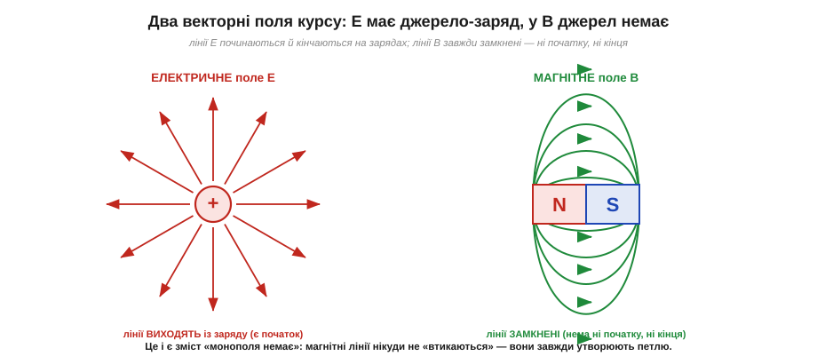
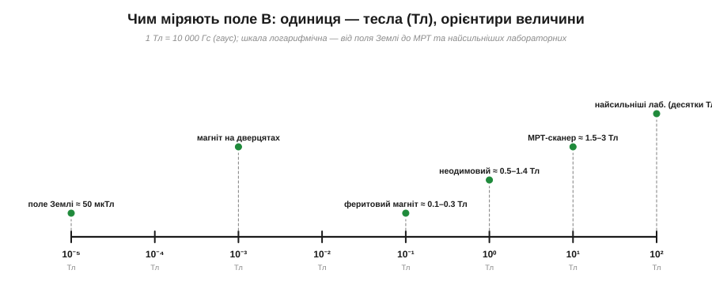

# Магніти й поле B: полюси, силові лінії, чому немає монополів

Магніт — чи не перший «науковий» предмет, з яким стикається кожна дитина: дві залізячки то чіпляються одна за одну, то вперто розштовхуються, наче між ними напнута невидима пружина. У цьому буденному фокусі захована глибока фізика, і саме з неї варто почати, перш ніж пов'язувати магнетизм зі струмом. Бо магнітне поле — це велике векторне поле, рідний брат [електричного поля E](topic:physics/electric-field), і водночас поле з однією разючою відмінністю, якої в електрики немає.

Магнетизм бентежив людство тисячоліттями саме тому, що дія йде **крізь порожнечу й крізь перешкоди**. Магніт тягне залізну скріпку через аркуш паперу, через скло, навіть через долоню — і ніщо в проміжку, здається, не змінюється. Стародавні вважали це чи не чаклунством; ще Фалес у VI столітті до н. е. дивувався, чому камінь із Магнесії притягує залізо. Ключ до цієї загадки — поняття [поля](topic:physics/electric-field), яким Фарадей розв'язав таку саму проблему для електрики. Магніт не тягне залізо «безпосередньо через ніщо»; він заповнює простір навколо себе невидимим **магнітним полем**, і вже це поле, дійшовши до заліза, на нього діє. Папір чи скло полю не заважають — вони для магнетизму прозорі. Тож наша перша задача — навчитися описувати це поле: його напрям, силу й форму.

### Полюси: два роди, як і в зарядів — але нероздільні

Найперше спостереження: у магніту є **два кінці**, що поводяться по-різному. Один притягує певний бік стрілки компаса, другий той самий бік відштовхує. Ці кінці назвали **полюсами** (*poles*): **північний** (*north*, **N**) і **південний** (*south*, **S**) — за тим, куди показував відповідний кінець вільно підвішеного магніту (до географічної півночі чи півдня [Землі](topic:physics/earth-magnetic-field), де ця плутанина назв і ховається). І діє правило, до болю схоже на правило [зарядів](topic:physics/electric-charge):

```
однойменні полюси (N і N,  S і S)  →  відштовхуються
різнойменні полюси (N і S)         →  притягуються
```


*Між полюсами діє сила: піднесеш N до S — магніти тягнуться один до одного; N до N — розштовхуються. Та сама двійка знаків, що й у [зарядів](topic:physics/electric-charge), але з принциповою відмінністю в самій природі цих полюсів.*

Спокуса очевидна: оголосити N «магнітним плюсом», S — «магнітним мінусом» і будувати магнетизм за зразком електрики. Природа на цю спокусу відповідає категоричним «ні», і саме це «ні» — найцікавіше в усій темі.

### Поле B: невидимий посередник

Як і заряди, магніти діють **на відстані**, не торкаючись. Між зарядами цю дію переносило електричне поле; між магнітами її переносить **магнітне поле** (*magnetic field*), яке позначають літерою **B**. У кожній точці простору навколо магніту поле B має певний **напрям** і певну **величину** — тобто це **векторна** величина, точно як E. Магніт не «знає» наперед, де лежить інший магніт; він просто створює навколо себе поле B, а вже це поле діє на все магнітне, що в нього потрапляє.

Щоб зробити невидиме видимим, користуються тим самим прийомом, що й для електричного поля, — малюють **силові лінії** (*field lines*). Лінія в кожній точці спрямована вздовж поля B, а її густина показує силу поля: де лінії гущі — поле сильніше. Картину магнітного поля можна навіть побачити наживо, насипавши на аркуш над магнітом залізних ошурок: кожна крихітна ошурка повертається вздовж поля й вишиковується в характерні дуги.


*Поле штабового магніту. Зовні лінії виходять з північного полюса N і входять у південний S; біля полюсів вони згущуються — там поле найсильніше. Маленька магнітна стрілка в будь-якій точці встановлюється вздовж лінії — це і є напрям B.*

За домовленістю **зовні** магніту лінії спрямовані **від N до S**. Стрілка компаса, кинута в це поле, повертається так, що її власний північний кінець дивиться вздовж лінії — тобто вказує туди, куди тече поле. Це дає практичне означення напряму B: **куди показує північний кінець вільної магнітної стрілки, туди й напрямлене поле**.

Силові лінії — не просто гарна картинка, у них зашито кілька строгих правил, спільних з лініями електричного поля. По-перше, **лінії ніколи не перетинаються**: якби дві лінії зійшлися в одній точці, поле там мало б одразу два напрями, а це безглуздя — у кожній точці B спрямоване кудись одне. По-друге, **густина ліній пропорційна силі поля**: там, де вони збігаються тісно (біля полюсів), поле сильне, а де розходяться широко — слабке. По-третє, поле в будь-якій точці — це **сума** (за правилом [додавання векторів](topic:physics/coulomb-law)) полів від усіх магнітів навколо: піднесіть до одного магніту другий, і їхні лінії перебудуються, утворивши спільну картину — десь підсилившись, десь погасившись. Цей принцип **суперпозиції** працює для B так само, як для E, і саме він пояснює, чому два магніти створюють складні візерунки з ошурок, а не просту суму двох окремих картин.

Варто одразу попередити про межу аналогії з ошурками. Залізні ошурки чудово показують **форму** ліній і їхній напрям, але не їхню «кількість»: лінії — це наш спосіб малювати неперервне поле, а не реальні нитки, яких можна нарахувати рівно стільки-то. Поле існує в **кожній** точці простору неперервно; лінії ми проводимо так густо чи рідко, як зручно, аби лиш їхня густина чесно відображала силу. Тримаючи це в голові, ми уникаємо наївної думки, ніби між двома сусідніми лініями поля «немає».

> 🔧 **Навіщо це.** Картина силових ліній — не лише краса з підручника. Коли поряд із чутливою схемою лежить динамік, мотор чи навіть звичайний неодимовий магніт, його поле тягнеться на сантиметри довкола саме такими дугами. Розуміючи форму поля, інженер знає, де покласти давач, щоб той ловив сигнал, а де — навпаки, де поле наведе заваду чи зрушить показ електронного компаса. Уся боротьба з магнітними [наводками](topic:physics/inductive-coupling) починається з уміння «бачити» ці лінії.

### Чому немає монополя: розріж магніт — отримаєш два магніти

А тепер — головна відмінність магнетизму від електрики. Заряди можна **розділити**: потерши скло об шовк, ми лишаємо надлишок «плюса» тут, а «мінуса» там; існує окремий протон, окремий електрон, окремий заряджений предмет. Здавалося б, із полюсами має бути так само: візьми магніт і розріж його посередині — і отримаєш окремий «шматок N» та окремий «шматок S», магнітні аналоги двох зарядів.

Спробуйте — і вийде зовсім інше. Розрізаний магніт дає **два менші магніти**, у кожного знову повний комплект: і N, і S. Розріжте кожен ще раз — знову чотири повноцінні диполі. І так аж до окремого атома: ніде не з'являється «голий» північний полюс без південного.


*Хоч скільки ділити магніт, кожен уламок лишається повним диполем — парою N–S. Окремого «магнітного заряду» (магнітного монополя) досі не спостерігав ніхто, попри прицільні пошуки. Полюс — це не частинка, а кінець диполя.*

Окремий магнітний полюс назвали б **магнітним монополем** (*magnetic monopole*) — магнітним аналогом точкового заряду. Його шукали й шукають: деякі теорії навіть передбачають, що десь у Всесвіті він може існувати. Але в усій доступній нам фізиці — й у всій електроніці без винятку — **монополя немає**. Магнетизм завжди приходить **диполями**: парою нероздільних полюсів.

Це не дрібна технічна деталь, а глибока асиметрія між електрикою й магнетизмом, що пронизує весь магнетизм. В електриці є окремий заряд — джерело поля E, з якого лінії «б'ють фонтаном». У магнетизмі джерела немає: найдрібніша цеглинка магнетизму — це вже **диполь**, пара полюсів. Тому хоч би де виникло магнітне поле — від штабового магніту до котушки зі струмом, — воно завжди матиме структуру диполя з двома кінцями, ніколи — структуру одинокого «магнітного заряду».

Звідки ж тоді полюс, якщо його не можна виокремити? Відповідь — у природі самого магнетизму: магнетизм речовини народжується з **рухомих зарядів усередині атомів**, а рух заряду по замкненому контуру неминуче дає поле з двома кінцями. Полюс — це не «річ», а **кінець петлі**. Це видно буквально на [витку зі струмом](topic:physics/oersted-experiment): він має північний і південний бік саме тому, що це **замкнена петля**, а не точка. Розрізавши магніт, ми не розриваємо петель — ми лише робимо менші петлі, у кожної знову два кінці. Звідси й випливає, чому монополя бути не може: він був би «половиною петлі», а петля половин не має.

Цікаво й те, як **сила** між магнітами спадає з відстанню. Між двома точковими зарядами сила слабшає за [законом оберненого квадрата](topic:physics/coulomb-law) (1/r²). Між двома магнітами-диполями вона спадає **набагато крутіше** — приблизно як 1/r⁴ на великій відстані, бо здалеку північний і південний полюси кожного магніту майже гасять дію один одного. Ось чому магніт, що міцно вчепився впритул, легко відірвати, відсунувши лише на сантиметр: сила падає стрімко. Це теж прямий наслідок дипольної (а не монопольної) природи магнетизму.

### Лінії E мають початок і кінець, лінії B — ні

Цю відмінність найясніше видно, якщо поставити поруч картину поля точкового заряду й картину поля магніту.


*Зліва — електричне поле E: лінії **виходять** із додатного заряду (або входять у від'ємний), тобто мають початок і кінець на зарядах-джерелах. Справа — магнітне поле B: лінії **замкнені**, у них немає ні початку, ні кінця; усередині магніту вони продовжуються від S до N і змикаються в петлю.*

Ось точне формулювання того, що означає «монополя немає»: **силові лінії магнітного поля завжди замкнені**. Електрична лінія може початися на заряді й там-таки скінчитися — бо є джерело, з якого поле «витікає». Магнітна лінія не має куди «втикатися»: немає джерела, з якого поле виходило б назовсім. Тому всередині магніту лінія не обривається на полюсі, а проходить його наскрізь і замикається сама на себе. Це настільки фундаментально, що згодом стане одним із чотирьох рівнянь Максвелла (для нас поки досить образу замкнених петель).

Із замкненості ліній випливає й корисний практичний наслідок: магнітне поле не можна «екранувати» так само, як електричне. [Клітка Фарадея](topic:physics/faraday-cage) надійно прибирає поле E всередині металевого корпусу, бо заряди в металі перерозподіляються й гасять зовнішнє поле. Для поля B такого простого трюку немає — його лінії однаково мусять кудись замкнутися. Магнітний екран працює інакше: він не нищить поле, а **перенаправляє** його лінії в товщу [матеріалу з високою проникністю](topic:physics/saturation-hysteresis).

### Аналогія E і B: де вона працює, а де ламається

Оскільки B — векторне поле, варто чесно звести, чим воно схоже на [електричне E](topic:physics/electric-field) і де аналогія перестає діяти, — це вбереже від типових помилок. **Спільне** в них чимало: обидва — векторні поля, що в кожній точці мають напрям і величину; обидва зображають силовими лініями, де густина означає силу; обидва підкоряються принципу суперпозиції (поля джерел складаються); обидва діють на відстані через посередника-поле, а не «безпосередньо». Тому багато інтуїції про електричне поле переноситься на магнетизм майже без змін.

А ось де аналогія **ламається** — і це найважливіше. По-перше, джерела. У поля E джерело — **заряд**, окремий і виокремлюваний; у поля B окремого «магнітного заряду» немає, джерело завжди дипольне (а врешті — це [струм](topic:physics/oersted-experiment)). По-друге, форма ліній: лінії E можуть **починатися й кінчатися** (на зарядах), лінії B **завжди замкнені**. По-третє, на що діє поле: електричне поле штовхає **будь-який** заряд, навіть нерухомий, причому **вздовж** лінії поля; магнітне поле діє лише на **рухомий** заряд, і то [**поперек** його руху](topic:physics/ampere-force). Через цю поперечність магнітна сила поводиться зовсім інакше за електричну — вона скривлює траєкторії, а не розганяє вздовж них. Тримаючи в голові і спільне, і відмінне, ми користуємось аналогією там, де вона допомагає, і не потрапляємо в пастку там, де магнетизм поводиться по-своєму.

### Поле — це стан простору, а не «промені» магніту

Наостанок — концептуальна засторога, успадкована від [Фарадеєвого погляду на поле](topic:physics/electric-field). Легко уявляти, ніби магніт «випускає» щось на кшталт променів, що ловлять залізо. Це хибний образ. Поле B існує в **кожній** точці простору навколо магніту як **стан цього простору** — незалежно від того, чи є там залізо, чи його ловити. Піднесене залізо лише **виявляє** поле, що вже там було, реагуючи на нього; саме поле магніт створює й тоді, коли довкола порожнеча. Цей погляд — поле як самостійна фізична реальність, а не як дія магніту «навпростець» — і був великим внеском Фарадея, що згодом дозволив описати поширення електромагнітних хвиль. Для нас він практичний: думаючи про поле як про карту простору, ми можемо в кожній точці спитати «куди і наскільки сильно тут спрямоване B?» — і саме так читається будь-яка картина силових ліній.

### Скільки магнетизму: одиниця тесла

Лишилось дати полю B число. Одиниця магнітного поля — **тесла** (*tesla*, **Тл** / **T**), названа на честь Ніколи Тесли. Тесла — велика одиниця, тож у практиці часто бачимо й давнішу одиницю **гаус** (*gauss*, **Гс**): 1 Тл = 10 000 Гс. Щоб відчути масштаб, корисно одразу прив'язати числа до знайомих речей.


*Орієнтири поля B (логарифмічна шкала). Магнітне поле Землі біля поверхні — лише близько 50 мкТл; магнітик на дверцятах холодильника — кілька мілітесла; добрий феритовий магніт — десяті частки тесла; неодимовий — до 1.4 Тл біля поверхні; томограф (МРТ) — 1.5–3 Тл; найсильніші лабораторні електромагніти — десятки тесла.*

Звідси відразу видно, чому компас такий вередливий: [поле Землі](topic:physics/earth-magnetic-field) **дуже слабке** (десятки мікротесла), і будь-який магнітик чи провід зі струмом поряд легко його перебиває. Головне ж засвоїти: **B — це векторне поле, у якого є напрям, величина (в теслах) і силові лінії, що завжди замкнені**.

**Приклад (скільки разів поле неодимового магніту сильніше за поле Землі).** Прикинемо відношення, користуючись орієнтирами зі шкали вище.

```
B(неодим, біля поверхні) ≈ 0.5 Тл
B(Земля, біля поверхні)  ≈ 50 мкТл = 50 × 10⁻⁶ Тл = 0.00005 Тл

відношення = 0.5 / 0.00005 = 10 000 разів
```

Біля самої поверхні маленький неодимовий магніт створює поле в **десять тисяч разів** сильніше за земне. Ось чому, піднісши такий магніт до компаса, ви миттєво «забиваєте» поле Землі й стрілка слухається лише магніта. Втім, поле магніту швидко спадає з відстанню, тож за метр від нього компас знову відчуває переважно Землю.

> 🔧 **Навіщо це.** Тримати в голові, що поле Землі — це десятки мікротесла, надзвичайно практично. Електронний компас (магнітометр) у дроні чи телефоні міряє саме ці крихітні десятки мкТл — і тому його доводиться **калібрувати** й тримати подалі від динаміків, моторів та сталевих деталей корпусу: їхнє поле, навіть слабеньке на дотик, для такого давача — ціла буря, що повністю спотворює напрям на північ.

---
