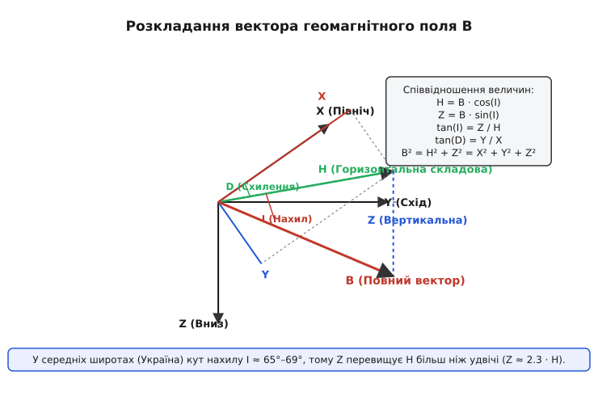
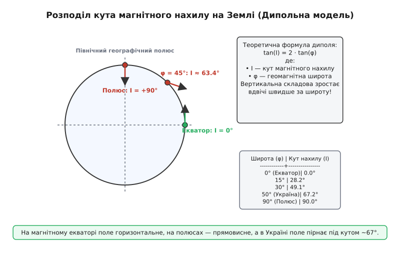

# 🧮 Математика геомагнітного вектора та дипольної моделі

Ця математична вставка містить аналітичний вивід прямокутної та сферичної геометричних компонент вектора геомагнітного поля `B`, строгий математичний вивід дипольної формули залежності кута нахилу від широти `tan(I) = 2 · tan(φ)`, а також розрахунок механічної рівноваги й методу подвійного вимірювання в інклінаторах.

### 1. Декартова та сферична геометрія геомагнітного вектора

У довільній точці на поверхні Землі вектор магнітної індукції `B` описується трьома декартовими компонентами в локальній горизонтальній системі координат **NED** (*North-East-Down* — Північ-Схід-Вниз):
* `X` — північна складова (ортогонально уздовж географічного меридіана на північ);
* `Y` — східна складова (ортогонально уздовж географічної паралелі на схід);
* `Z` — вертикальна складова (спрямована прямовисно вниз до центра Землі).


*Тривимірне розкладання вектора геомагнітного поля B на горизонтальну складову H, вертикальну Z та компоненти X і Y.*

Модуль горизонтальної складової `H` визначено через прямокутні компоненти `X` та `Y` на площині горизонтального лімба:

```
H = √(X² + Y²)
```

Повний модуль індукції геомагнітного поля `B` (у геофізичній літературі зазначається також як `F` — *Total Intensity*) дорівнює просторовій діагоналі прямокутного паралелепіпеда компонент:

```
B = √(H² + Z²) = √(X² + Y² + Z²)
```

Орієнтацію вектора `B` у тривимірному просторі задають два кутові параметри:
1. **Магнітне схилення `D`** (*Declination*) — кут у горизонтальній площині між напрямом на географічний північний полюс (`X`) і векторним напрямом горизонтальної складової (`H`):

```
D = arctan2(Y, X)      [радіани або градуси]
```

2. **Магнітний нахил `I`** (*Inclination*) — кут у вертикальній площині між горизонтальною площиною та вектором повного поля `B`:

```
tan(I) = Z / H         ⇒   I = arctan(Z / H)
```

Або через вираження через повну індукцію `B`:

```
sin(I) = Z / B         ⇒   I = arcsin(Z / B)
cos(I) = H / B         ⇒   H = B · cos(I)
```

Звідси отримуємо прямі й зворотні перетворення між прямокутними декартовими `(X, Y, Z)` та сферичними `(B, I, D)` координатами геомагнітного поля:

```
X = B · cos(I) · cos(D) = H · cos(D)
Y = B · cos(I) · sin(D) = H · sin(D)
Z = B · sin(I)
```

Матриця повороту `R[NED_to_Field]`, яка переводить одиничний вектор горизонталі `[1, 0, 0]ᵀ` у справжній тривимірний напрям геомагнітного поля `B`:

```
R = R_z(D) · R_y(I) = | cos(D)·cos(I)   -sin(D)   cos(D)·sin(I) |
                      | sin(D)·cos(I)    cos(D)   sin(D)·sin(I) |
                      |   -sin(I)          0         cos(I)     |
```

У деяких галузях робототехніки та авіації використовують альтернативну систему координат **ENU** (*East-North-Up* — Схід-Північ-Вгору). Перехід від NED до ENU виконується лінійним перетворенням `[E, N, U]ᵀ = [Y, X, -Z]ᵀ`, при якому вертикальна складова змінює знак (`U = -Z = -B · sin I`).

---

### 2. Строгий математичний вивід дипольної формули нахилу

Приймемо класичне геофізичне наближення: Земля — сферичне тіло радіуса `R`, у центрі якого розташований точковий магнітний диполь із магнітним моментом `m`, спрямованим уздовж осі обертання (від півдня до півночі).

У сферичній системі координат `(r, θ, φ)` оператор градієнта для скалярного потенціалу `V` виражається трьома компонентами:

```
∇V = e_r · (∂V / ∂r) + e_θ · (1/r) · (∂V / ∂θ) + e_φ · (1 / (r·sin θ)) · (∂V / ∂φ)
```

Оскільки азимутальна симетрія диполя означає `∂V / ∂φ = 0`, азимутальна складова індукції поля `B[φ] = 0`.

Магнітний скалярний потенціал `V` диполя на відстані `r` від центра у точці з коширотою `θ` (де `θ = 90° - φ`, а `φ` — геомагнітна широта) описується виразом:

```
V(r, θ) = (μ₀ · m · cos θ) / (4π · r²)
```

Складові вектора магнітної індукції `B = -∇V` у сферичній системі координат обчислюються як градієнт скалярного потенціалу зі знаком мінус:

1. **Радіальна складова `B[r]`** (спрямована від центра Землі вгору вздовж радіуса):

```
B[r] = - ∂V / ∂r
     = - ∂/∂r [ (μ₀ · m · cos θ) / (4π · r²) ]
     = - (μ₀ · m · cos θ) / (4π) · (-2 / r³)
     = (2 · μ₀ · m · cos θ) / (4π · r³)
```

Оскільки вертикальна декартова складова `Z` у системі координат NED спрямована **вниз** до центра Землі, маємо `Z = -B[r]`:

```
Z = (2 · μ₀ · m · sin φ) / (4π · r³)     [використано тригонометричну тотожність cos(90° - φ) = sin φ]
```

2. **Меридіональна складова `B[θ]`** (спрямована вздовж поверхні Землі від північного полюса до південного):

```
B[θ] = - (1 / r) · ∂V / ∂θ
     = - (1 / r) · ∂/∂θ [ (μ₀ · m · cos θ) / (4π · r²) ]
     = - (1 / r) · (μ₀ · m / (4π · r²)) · (-sin θ)
     = (μ₀ · m · sin θ) / (4π · r³)
```

Ця меридіональна складова збігається з горизонтальною індукцією поля `H = B[θ]`:

```
H = (μ₀ · m · cos φ) / (4π · r³)         [використано тригонометричну тотожність sin(90° - φ) = cos φ]
```

3. **Співвідношення складових та підсумкова формула:**
Обчислимо відношення вертикальної складової `Z` до горизонтальної `H`:

```
tan(I) = Z / H
       = [ (2 · μ₀ · m · sin φ) / (4π · r³) ] / [ (μ₀ · m · cos φ) / (4π · r³) ]
       = (2 · sin φ) / cos φ
       = 2 · tan(φ)
```

Ми отримали фундаментальну **формулу геомагнітного нахилу диполя**:

```
tan(I) = 2 · tan(φ)
```


*Зміна кута нахилу I залежно від геомагнітної широти φ згідно з дипольною формулою tan(I) = 2·tan(φ).*

**Аналітичний аналіз отриманої залежності:**
* На магнітному екваторі (`φ = 0°`): `tan(I) = 2 · 0 = 0` ⇒ `I = 0°` (поле повністю паралельне поверхні).
* На магнітному полюсі (`φ = 90°`): `tan(I) → ∞` ⇒ `I = 90°` (поле прямовисне).
* На широті Києва (`φ ≈ 50.5°`):
  `tan(φ) = tan(50.5°) ≈ 1.213`
  `tan(I) = 2 · 1.213 = 2.426`
  `I = arctan(2.426) ≈ 67.6°`

Полна магнітна індукція дипольного поля `B` на поверхні Землі радіуса `R` залежить від широти як:

```
B(φ) = √(H² + Z²) = (μ₀ · m / (4π · R³)) · √(cos² φ + 4 · sin² φ) = B_eq · √(1 + 3 · sin² φ)
```

де `B_eq` — індукція поля на екваторі. Отже, поле на полюсах у `√4 = 2` рази сильніше за поле на екваторі.

Аналіз похибок показує, як невизначеність вимірювання кута нахилу `σ_I` поширюється на обчислення вертикальної складової `Z`:

```
σ_Z = | dZ / dI | · σ_I = B · cos(I) · σ_I = H · σ_I
```

У високих широтах (де `H` зменшується), відносна похибка визначення горизонтальної складової стрімко зростає.

---

### 3. Динамічна рівновага інклінатора та компенсація гравітаційного дисбалансу

Розглянемо намагнічену сталеву голку з моментом інерції `J` та власним магнітним моментом `m[n]`, яка може вільно обертатися навколо горизонтальної осі в площині магнітного меридіана.

Динамічне рівняння руху голки з урахуванням магнітного моменту, гравітаційного дисбалансу та в'язкого тертя повітря `γ`:

```
J · (d²α / dt²) + γ · (dα / dt) + m[n] · B · sin(α - I) = m[g] · g · d · cos(α + β)
```

де `α` — кут відхилення голки від горизонталі, `m[g]` — маса голки, `g` — прискорення вільного падіння, `d` — зсув центра мас від осі обертання, `β` — кут геометричної несиметрії.

Частота власних малих коливань голки навколо положення рівноваги `I` обчислюється як:

```
ω₀ = √( (m[n] · B) / J )
```

У стаціонарному стані рівноваги (`d²α/dt² = 0`, `dα/dt = 0`) отримуємо рівняння статики:

```
m[n] · B · sin(I - α) = m[g] · g · d · cos(α + β)
```

Оскільки гравітаційний зсув `(m[g] · g · d)` дає систематичну похибку вимірювання кута `I`, у класицій геодезії використовують **метод чотирьох вимірювань Гаусса–Нормана**:
1. Вимірюють кут відхилення `α₁` у прямому положенні інклінатора.
2. Повертають інклінатор на 180° навколо вертикальної осі й вимірюють кут `α₂` (це скасовує похибку несиметрії вертикального лімба та ексцентриситет осі).
3. Переполюсовують голку за допомогою сильних постійних магнітів (змінюють напрям магнітного моменту `m[n]` на 180°) і повторюють вимірювання (`α₃` та `α₄`).

При переполюсовці магнітний момент змінює знак, а гравітаційний момент залишається незмінним. Додавання рівнянь у чотирьох положеннях повністю усуває вплив гравітаційного дисбалансу:

```
I = (α₁ + α₂ + α₃ + α₄) / 4
```

Цей метод дозволяє досягти точності вимірювання кута нахилу до **1 кутової мінути** на механічних приладах.
