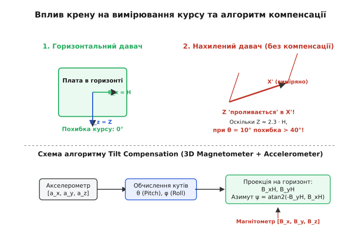

### Чому звичайний магнітометр помиляється при нахилі

3-осьовий електронний магнітометр (наприклад, QMC5883L, HMC5883L або LSM303D) вимірює три прямокутні складові вектора магнітного поля `B = [B_x, B_y, B_z]` у власній зв'язаній системі координат корпусу мікросхеми.

Якщо пристрій розташований ідеально горизонтально відносно землі (кут тангажу `θ = 0` та кут крену `ϕ = 0`), вимірювальні осі `B_x` та `B_y` знаходяться строго в площині горизонту, а магнітний азимут (курс відносно магнітної півночі) обчислюється за простою двовимірною тригонометричною формулою:

```
ψ = arctan2(-B_y, B_x)
```

Проте в реальних умовах експлуатації (на мобільному роботі, БПЛА чи в руках користувача) плата пристрою майже завжди нахилена. В середніх широтах (зокрема в Україні) вертикальна складова `Z` геомагнітного поля перевищує горизонтальну `H` більш ніж удвічі (`Z ≈ 2.36 · H`). 

Коли пристрій нахиляється хоча б на 10 градусів, величезне вертикальне поле `Z` проєкціюється у виміряні осі `B_x` та `B_y`. Без математичної компенсації крену це «проливання» спричиняє похибку курсу від 30° до 60°, роблячи компас повністю непридатним для автономного утримання траєкторії.


*Принцип проливання вертикальної складової Z у горизонтальні осі при крені та загальна схема компенсації.*

При високих кутах крену (понад 20°) або у високих геомагнітних широтах (де нахил `I > 75°`), нескомпенсований 2D-компас дає похибку азимута, що наближається до 90°, через що система автоматичного керування польотом починає повертати апарат у протилежний бік від заданої мети.

---

### Калібрування завад твердого та м'якого заліза (Hard-Iron & Soft-Iron)

Перш ніж передавати сирі дані магнітометра `[B_raw.x, B_raw.y, B_raw.z]` до алгоритму компенсації нахилу, їх необхідно очистити від власних магнітних завад пристрою. Усі завади поділяють на два класи:

1. **Тверде залізо (*Hard-Iron*)** — власне магнітне поле від намагнічених металевих деталей плати, сталевих гвинтів або постійних магнітів динамів. Це поле створює сталий вектор зсуву `V_hard_iron = [V_x, V_y, V_z]`, який зсуває центр сфер вимірювань від початку координат `(0,0,0)`.
2. **М'яке залізо (*Soft-Iron*)** — спотворення ліній геомагнітного поля феромагнітною масою поблизу давача (феритові дроселі, сталеві екрани). Воно деформує сферичний розподіл вимірювань у тривісний еліпсоїд.

Загальне рівняння компенсації виражається матричним перетворенням:

```
B_calibrated = S_soft_iron · (B_raw - V_hard_iron)
```

де `V_hard_iron` — вектор зсуву 3x1, а `S_soft_iron` — симетрична матриця масштабу й повороту 3x3. Отриманий вектор `B_calibrated` є чистою індукцією геомагнітного поля в системі координат давача.

---

### Об'єднання даних у комплементарному фільтрі IMU/AHRS

У динамічних умовах польоту БПЛА чи руху робота акселерометр вимірює не лише прискорення вільного падіння `g`, а й кінематичне прискорення пристрою (лінійне прискорення від моторів та центробіжне прискорення при поворотах):

```
a_measured = g + a_kinematic + a_centrifugal
```

Під час інтенсивних маневрів вектор `a_measured` відхиляється від напрямку вертикалі `g`, через що обчислені кути тангажу `θ` та крену `ϕ` отримують динамічну похибку.

Щоб усунути цей ефект, в автопілотах (наприклад, PX4 або ArduPilot) використовують **комплексний фільтр IMU/AHRS** (Extended Kalman Filter — EKF):
* Поточну кутову швидкість `[ω_x, ω_y, ω_z]` інтегрують від 3-осьового гіроскопа на високій частоті (400–1000 Гц) для відстеження швидких кутових переміщень;
* Акселерометр використовують для повільного корегування дрейфу гіроскопа на низьких частотах (10–50 Гц), коли модуль прискорення близький до `1g`;
* Магнітометр дає абсолютну прив'язку азимута після компенсації нахилу скомплексованими кутами `θ` та `ϕ`.

---

### Математичний алгоритм компенсації нахилу

Алгоритм відновлення справжнього азимута та кута магнітного нахилу складається з чотирьох послідовних математичних кроків:

#### Крок 1. Обчислення кутів тангажу (Pitch, θ) та крену (Roll, ϕ)
За допомогою 3-осьового акселерометра вимірюють вектор прискорення `a = [a_x, a_y, a_z]`. У статичному стані вектор `a` дорівнює прискоренню вільного падіння `g`. Після нормалізації вектора кути нахилу обчислюють як:

```
ϕ (Roll)  = arctan2(a_y, a_z)
θ (Pitch) = arctan2(-a_x, √(a_y² + a_z²))
```

#### Крок 2. Проєкція магнітного поля на горизонтальну площину
Використовуючи обчислені кути `θ` та `ϕ`, повертають вектор виміряного магнітного поля `[B_x, B_y, B_z]` назад у горизонтальну площину `[B_xH, B_yH]`:

```
B_xH = B_x · cos(θ) + B_y · sin(ϕ) · sin(θ) + B_z · cos(ϕ) · sin(θ)
B_yH = B_y · cos(ϕ) - B_z · sin(ϕ)
```

#### Крок 3. Обчислення скомпенсованого азимута (Heading, ψ)
Магнітний курс `ψ` відносно магнітної півночі:

```
ψ_mag = arctan2(-B_yH, B_xH)
```

Для отримання справжнього (географічного) азимута додають місцеве магнітне схилення `D`:

```
ψ_true = ψ_mag + D
```

#### Крок 4. Обчислення кута магнітного нахилу (Inclination, I)
Відновлюють вертикальну складову `B_zH` та обчислюють кут магнітного нахилу `I`:

```
B_zH = -B_x · sin(θ) + B_y · sin(ϕ) · cos(θ) + B_z · cos(ϕ) · cos(θ)
B_total = √(B_x² + B_y² + B_z²)
I = arcsin(B_zH / B_total)
```

---

### Практична реалізація коду

Нижче наведено робочий алгоритм обчислення азимута та кута нахилу мовами C та C++.

:::tabs
```c
/* c */
#include <math.h>
#include <stdbool.h>

#ifndef M_PI
#define M_PI 3.14159265358979323846f
#endif

typedef struct {
    float x;
    float y;
    float z;
} vector3f_t;

typedef struct {
    float heading_deg;     /* Справжній азимут (0..360°) */
    float inclination_deg; /* Кут магнітного нахилу (-90..+90°) */
    float pitch_deg;       /* Тангаж пристрою (-90..+90°) */
    float roll_deg;        /* Крен пристрою (-180..+180°) */
    float total_field_uT;  /* Повний модуль магнітного поля */
    bool  is_valid;        /* Прапорець коректності даних */
} orientation_result_t;

/**
 * @brief Обчислення скомпенсованого курсу та кута нахилу.
 * @param accel Дані акселерометра [м/с²] або [g]
 * @param mag Дані магнітометра [мкТл] або [Гаус]
 * @param declination_rad Месцеве магнітне схилення в радіанах
 */
orientation_result_t calculate_tilt_compensated_heading(
    const vector3f_t accel,
    const vector3f_t mag,
    float declination_rad
) {
    orientation_result_t res = {0};

    /* Перевірка на нульовий модуль прискорення */
    float accel_norm_sq = accel.x * accel.x + accel.y * accel.y + accel.z * accel.z;
    if (accel_norm_sq < 1e-4f) {
        res.is_valid = false;
        return res;
    }

    /* 1. Обчислення кутів тангажу та крену */
    float roll  = atan2f(accel.y, accel.z);
    float pitch = atan2f(-accel.x, sqrtf(accel.y * accel.y + accel.z * accel.z));

    float cos_roll  = cosf(roll);
    float sin_roll  = sinf(roll);
    float cos_pitch = cosf(pitch);
    float sin_pitch = sinf(pitch);

    /* 2. Проєкція магнітометра на горизонтальну площину */
    float b_xh = mag.x * cos_pitch + mag.y * sin_roll * sin_pitch + mag.z * cos_roll * sin_pitch;
    float b_yh = mag.y * cos_roll - mag.z * sin_roll;
    float b_zh = -mag.x * sin_pitch + mag.y * sin_roll * cos_pitch + mag.z * cos_roll * cos_pitch;

    /* 3. Магнітний курс (азимут) */
    float heading_rad = atan2f(-b_yh, b_xh) + declination_rad;

    /* Нормалізація в діапазон [0, 2π) */
    while (heading_rad < 0.0f) heading_rad += 2.0f * M_PI;
    while (heading_rad >= 2.0f * M_PI) heading_rad -= 2.0f * M_PI;

    /* 4. Повний модуль поля та кут нахилу */
    float b_total = sqrtf(mag.x * mag.x + mag.y * mag.y + mag.z * mag.z);
    float inclination_rad = 0.0f;
    if (b_total > 1e-4f) {
        inclination_rad = asinf(b_zh / b_total);
    }

    /* Запис результатів у градусах */
    res.heading_deg     = heading_rad * (180.0f / M_PI);
    res.inclination_deg = inclination_rad * (180.0f / M_PI);
    res.pitch_deg       = pitch * (180.0f / M_PI);
    res.roll_deg        = roll * (180.0f / M_PI);
    res.total_field_uT  = b_total;
    res.is_valid        = true;

    return res;
}
```
```cpp
/* cpp */
#include <cmath>
#include <numbers>
#include <optional>
#include <span>

namespace navigation {

struct Vector3f {
    float x{0.0f};
    float y{0.0f};
    float z{0.0f};

    [[nodiscard]] constexpr float length_sq() const noexcept {
        return x * x + y * y + z * z;
    }

    [[nodiscard]] float length() const noexcept {
        return std::sqrt(length_sq());
    }
};

struct Orientation {
    float heading_deg{0.0f};     // Справжній азимут (0..360°)
    float inclination_deg{0.0f}; // Кут нахилу (-90..+90°)
    float pitch_deg{0.0f};       // Тангаж (-90..+90°)
    float roll_deg{0.0f};        // Крен (-180..+180°)
    float total_field_uT{0.0f};  // Модуль поля
};

class TiltCompensatedCompass {
public:
    explicit TiltCompensatedCompass(float declination_deg = 0.0f) noexcept
        : declination_rad_{declination_deg * std::numbers::pi_v<float> / 180.0f} {}

    [[nodiscard]] std::optional<Orientation> compute(
        const Vector3f& accel,
        const Vector3f& mag
    ) const noexcept {
        if (accel.length_sq() < 1e-4f) {
            return std::nullopt;
        }

        // 1. Оцінка кутів орієнтації
        const float roll  = std::atan2(accel.y, accel.z);
        const float pitch = std::atan2(-accel.x, std::hypot(accel.y, accel.z));

        const float cos_roll  = std::cos(roll);
        const float sin_roll  = std::sin(roll);
        const float cos_pitch = std::cos(pitch);
        const float sin_pitch = std::sin(pitch);

        // 2. Трансформація вектора магнітного поля в горизонт
        const float b_xh = mag.x * cos_pitch + mag.y * sin_roll * sin_pitch + mag.z * cos_roll * sin_pitch;
        const float b_yh = mag.y * cos_roll - mag.z * sin_roll;
        const float b_zh = -mag.x * sin_pitch + mag.y * sin_roll * cos_pitch + mag.z * cos_roll * cos_pitch;

        // 3. Обчислення курсу з урахуванням схилення
        float heading_rad = std::atan2(-b_yh, b_xh) + declination_rad_;
        constexpr float two_pi = 2.0f * std::numbers::pi_v<float>;
        
        while (heading_rad < 0.0f)   heading_rad += two_pi;
        while (heading_rad >= two_pi) heading_rad -= two_pi;

        // 4. Повний модуль та кут нахилу
        const float b_total = mag.length();
        float inclination_rad = 0.0f;
        if (b_total > 1e-4f) {
            inclination_rad = std::asin(std::clamp(b_zh / b_total, -1.0f, 1.0f));
        }

        constexpr float rad_to_deg = 180.0f / std::numbers::pi_v<float>;
        return Orientation{
            .heading_deg     = heading_rad * rad_to_deg,
            .inclination_deg = inclination_rad * rad_to_deg,
            .pitch_deg       = pitch * rad_to_deg,
            .roll_deg        = roll * rad_to_deg,
            .total_field_uT  = b_total
        };
    }

    void set_declination(float declination_deg) noexcept {
        declination_rad_ = declination_deg * std::numbers::pi_v<float> / 180.0f;
    }

private:
    float declination_rad_{0.0f};
};

} // namespace navigation
```
:::

---

### Типові інженерні пастки

1. **Ігнорування калібрування твердої й м'якої завади (*Hard-Iron / Soft-Iron*):** Магнітометр вимірює не лише поле Землі, а й власні магніти деталей плати. Перед викликом алгоритму сирі вимірювання `[B_raw.x, B_raw.y, B_raw.z]` **обов'язково** мають бути очищені векторною компенсацією `B_calib = S · (B_raw - V_bias)`.
2. **Динамічне прискорення руху:** При прискорені чи віражі автопілота акселерометр вимірює не тільки вектор `g`, а й центробіжне прискорення `a_centrifugal`. У таких умовах кути `θ` та `ϕ` слід брати з комплементарного фільтра чи фільтра Калмана (AHRS/IMU), який об'єднує акселерометр із гіроскопом.
3. **Неузгодженість осей давачів:** Якщо акселерометр і магнітометр розміщені на платі під різними кутами (наприклад, осі `X` розвернуті на 90° один від одного), перед обчисленням необхідно привести вимірювання до єдиного залізобетонного координатного фрейму плати.
