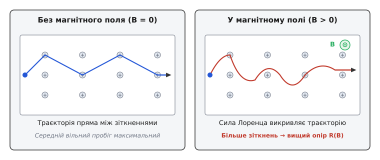
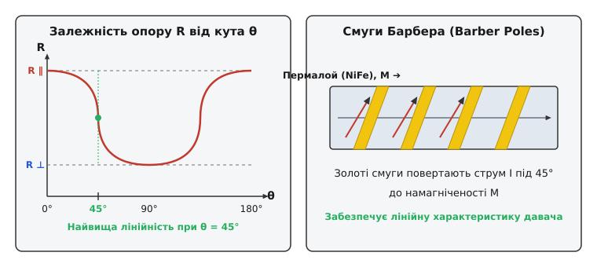
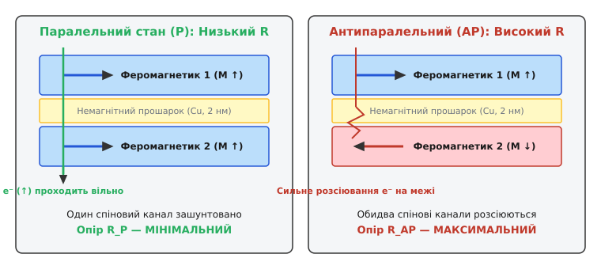
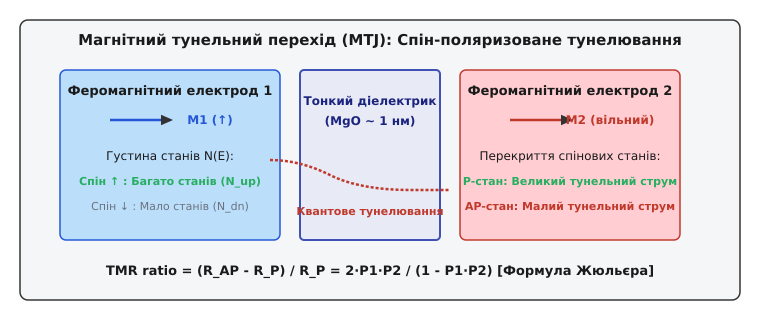

# Магнітоопір: зміна електричного опору під дією магнітного поля

<preknowlist>
- [Закон Ома](book:physics/ohm-law) — зв'язок між струмом, напругою та опором провідника.
- [Сила Лоренца](book:physics/lorentz-force) — магнітна сила, що діє на рухомі носії заряду.
- [Ефект Холла](book:physics/hall-effect) — поперечне відхилення носіїв та виникнення електричного поля Холла.
- [Феромагнетизм та доменна структура](book:physics/ferromagnetism-domains) — внутрішня намагніченість та спінова орієнтація доменів.
</preknowlist>

Коли крізь металевий дріт або напівпровідникову пластину тече електричний струм, носії заряду — електрони — рухаються вздовж провідника під дією поздовжнього електричного поля, постійно зазнаючи зіткнень із кристалічною ґраткою, фононами та домішками. Якщо помістити цей провідник у зовнішнє магнітне поле, траєкторії електронів викривляються, ймовірність і частота розсіювання змінюються, а опір матеріалу відхиляється від свого початкового значення за відсутності поля. Це явище називають **магнітоопором** (*magnetoresistance*, MR). Воно розв'язує фундаментальну задачу надчутливого безконтактного вимірювання слабких магнітних полів та зчитування мікроскопічних магнітних комірок. До застосування магнітоопору класичні провідники мали незмінний опір у слабких полях, індукційні котушки вимагали постійного руху поля (`dB/dt ≠ 0`) й втрачали чутливість при мініатюризації, а датчики Холла не забезпечували необхідної локальної роздільної здатності й чутливості на нанометровому масштабі через обмеження за відношенням сигнал/шум. Магнітоопір дозволив напряму конвертувати найменші зміни магнітного поля або орієнтації намагніченості у вимірювану зміну електричного опору.

Кількісно магнітоопір характеризується безрозмірним коефіцієнтом відносної зміни опору `ΔR / R0`:

```
ΔR / R0 = (R(B) - R0) / R0
```

де `R(B)` — опір провідника у магнітному полі з індукцією `B`, а `R0 = R(0)` — опір у нульовому полі. Залежно від внутрішньої структури матеріалу, геометричного масштабу та квантових ефектів значення `ΔR / R0` може становити від мікроскопічних часток відсотка в звичайних металах до десятків і сотень відсотків у наноструктурованих магнітних сендвічах та перовськітах. Це уможливило створення терабайтних зчитувальних головок жорстких дисків, енергонезалежної пам'яті MRAM та надчутливих нанотеслометричних сенсорів.

---

### Звичайний магнітоопір: траєкторії носіїв та поверхня Фермі

У найпростішому суцільному провіднику магнітне поле діє на рухомий електрон із [силою Лоренца](book:physics/lorentz-force) `F = q · (v × B)`. Оскільки ця сила спрямована перпендикулярно як до швидкості електрона `v`, так і до вектора магнітної індукції `B`, вона не змінює модуль швидкості й не виконує роботи над зарядом, але безперервно повертає вектор швидкості вбік.

За відсутності магнітного поля електрон дрейфує вздовж провідника по ламаній траєкторії: між двома послідовними зіткненнями з атомами ґратки він рухається по прямій лінії на середню відстань, що називається **середнім вільним пробігом** `λ`. 

Коли ж прикладено зовнішнє магнітне поле, перпендикулярне до струму, сила Лоренца закручує рух електронів по дугах кола радіуса `r_c = (m* · v) / (q · B)` (циклотронний радіус). У результаті електрон долає більшу довжину траєкторії, щоб просунутися на таку саму відстань вздовж напрямку струму. Ймовірність зіткнення з атомами ґратки на одиницю поздовжнього переміщення зростає, що виражається у збільшенні електричного опору матеріалу. Це явище називається **звичайним магнітоопором** (*Ordinary Magnetoresistance*, OMR).


*Зліва: за відсутності магнітного поля (B = 0) траєкторія електронів між зіткненнями є прямолінійною, а середній вільний пробіг максимальний. Справа: у магнітному полі (B > 0) сила Лоренца викривляє траєкторії носіїв у дуги, збільшуючи частоту зіткнень із ґраткою та викликаючи зростання опору R(B).*

#### Парадокс Холла в ізотропному металі

Проте детальний математичний аналіз у рамках класичної моделі вільних електронів Друде — Зоммерфельда виявляє дивовижний парадокс. Коли сила Лоренца зсуває електрони до бічної межі провідника, на краях зразка накопичуються заряди, створюючи поперечне електричне [поле Холла](book:physics/hall-effect) `E_H`. 

У чистому ізотропному металі з єдиною зоною провідності та однаковим часом релаксації `τ` для всіх електронів електрична сила Холла `F_H = q · E_H` **точнісінько компенсує** магнітну силу Лоренца `F_B = q · (v × B)` для кожного носія заряду! 

У результаті сумарна поперечна сила дорівнює нулю, електрони знову рухаються вздовж провідника по строгих прямих лініях, і звичайний магнітоопір ідеально ізотропного однозонового металу виявляється **строго нульовим**.

#### Чому OMR існує в реальних металах

Чому ж звичайний магнітоопір усе-таки спостерігається в реальних металах та напівпровідниках? Відповідь криється в складній квантовій структурі реальних матеріалів:

1. **Багатозонна провідність:** у більшості металів (наприклад, у міді, сріблі, алюмінії чи бісмуті) струм несуть декілька груп носіїв (електрони й «дірки») з різними ефективними масами `m*` та рухливостями `μ`. Поле Холла створює єдине компенсаційне поле для середнього струму, але воно не може одночасно зрівноважити силу Лоренца для швидкохідних і повільних носіїв окремо.
2. **Анізотропія поверхні Фермі:** енергетична поверхня Фермі в реальних кристалах відхиляється від сферичної форми, через що швидкість електронів та їхній час релаксації залежать від напрямку руху в кристалічній ґратці. На наявність замкнених та відкритих електронних орбіт у сильній магнітній фазі впливає топологія поверхні Фермі.

#### Геометричний магнітоопір та диск Корбіно

Існує спосіб штучно виключити утворення поля Холла й продемонструвати звичайний магнітоопір у повній силі. Для цього виготовляють провідник у формі плоского кільця — **диска Корбіно** (*Corbino disk*). Один електрод підключають до центру диска, а другий — до зовнішньої колової межі. 

Оскільки в такій геометрії немає бічних меж, на яких могли б накопичуватися заряди, поле Холла фізично не може виникнути (`E_H = 0`). При прикладанні перпендикулярного магнітного поля сила Лоренца закручує електрони у логарифмічні спіралі. Шлях електронів від центрального до зовнішнього електрода видовжується, викликаючи гігантський **геометричний магнітоопір**:

```
ρ_eff(B) = ρ0 · (1 + (μ · B)²)
```

У напівпровідниках з високою рухливістю (наприклад, `InSb`) геометрія Корбіно дозволяє отримати зростання опору у сотні разів без використання феромагнетиків.

У слабких магнітних полях (`μ · B << 1`) звичайний магнітоопір зростає квадратично від індукції `ΔR / R0 ∝ B²`, а в сильній фазі підпорядковується універсальному масштабному закону Колера.

> 🧮 **Математична вставка:** [Математичні моделі магнітоопору: Колер, Мотт та Жюльєр](book:physics/electromagnetism/magnetoresistance/math-models.md) — строгий вивід тензора провідності, доказ парадоксу Холла для ізотропної зони та математика масштабного правила Колера.

---

### Анізотропний магнітоопір (AMR) у феромагнетиках

У феромагнітних металах (залізо, нікель, кобальт та їхні сплави) виникає зовсім інший механізм, відкритий Вільямом Томсоном у 1857 році, — **анізотропний магнітоопір** (*Anisotropic Magnetoresistance*, AMR). На відміну від звичайного OMR, який залежить від зовнішнього поля `B`, ефект AMR визначається напрямком **внутрішньої намагніченості** `M` відносно вектора електричного струму `I`.

Фізична причина AMR полягає у **спін-орбітальній взаємодії**. Електрон, рухаючись у кристалі, відчуває ефективне магнітне поле від релятивістського руху атомних ядер. Це поле пов'язує орієнтацію орбітальної хмари s- та d-електронів із напрямком спінового магнітного моменту домену. 

Коли вектор намагніченості `M` паралельний напрямку струму `I` (`θ = 0°`), електронні орбіталі витягуються перпендикулярно до руху електронів. Переріз розсіювання електронів провідності на d-орбіталях стає максимальним, що призводить до найвищого опору `R_parallel`. 

Коли ж вектор намагніченості перпендикулярний до струму (`θ = 90°`), переріз розсіювання мінімальний, а опір знижується до значення `R_perp`.


*Зліва: залежність опору AMR-елемента від кута θ між струмом I та намагніченістю M підпорядковується закону cos²(θ). Найвища чутливість і лінійність досягаються при куті 45°. Справа: похилі золоті смуги Барбера повертають лінії струму під кутом 45° до осі пермалою, забезпечуючи лінійну характеристику вимірювання.*

Залежність опору від кута `θ` описується співвідношенням:

```
R(θ) = R_perp + (R_parallel - R_perp) · cos²(θ)
```

Максимальна відносна зміна опору для класичного пермалою (`Ni80Fe20`) при кімнатній температурі становить від 2% до 4%.

#### Спін-орбітальний механізм розсіювання

У перехідних 3d-металах провідність здійснюється переважно рухливими 4s-електронами, а розсіювання відбувається при переході s-електронів у 3d-зону з високою густиною станів. Спін-орбітальна взаємодія `H_so = λ · (L · S)` змішує електронні стани зі спіном «вгору» та «вниз».

Коли вектор намагніченості розвертається під дією зовнішнього поля, кутовий розподіл d-хмари деформується. Оскільки імовірність розсіювання пропорційна перекриттю хвильових функцій s- та d-електронів, електричний опір виявляється прямо прив'язаним до кута `θ`.

#### Лінеаризація за допомогою смуг Барбера

Як видно з графіку `R(θ)`, поблизу `θ = 0°` та `θ = 90°` функція `cos²(θ)` має нульову похідну `dR / dθ = 0`, що робить сенсор нечутливим до малих змін поля й викликає квадратичні спотворення. Щоб змусити AMR-давач працювати лінійно, застосовують витончене геометро-фізичне рішення — **смуги Барбера** (*Barber poles*). 

На поверхню тонкої смужки пермалою під кутом `45°` напилюють високопровідні золоті або мідні смуги. Оскільки опір золота у 100 разів нижчий за опір пермалою, струм рухається між золотими провідниками по найкоротшому шляху — під кутом `45°` до осі намагніченості. При `θ = 45°` функція `cos²(45°) = 0.5` має крутий прямолінійний відрізок, і вихідний опір змінюється строго пропорційно до зовнішнього магнітного поля `B_ext`.

> 📜 **Історична вставка:** [Від ефекту Кельвіна до спінтроніки: історія магнітоопору](book:physics/electromagnetism/magnetoresistance/hist-discovery.md) — детальний шлях відкриттів від перших дослідів лорда Кельвіна 1857 року до Нобелівської премії 2007 року.

---

### Гігантський магнітоопір (GMR): спіновий вентиль та міжшарова взаємодія

Справжній квантово-механічний переворот у фізиці твердого тіла відбувся 1988 року, коли Альбер Ферт та Петер Ґрюнберґ незалежно відкрили **гігантський магнітоопір** (*Giant Magnetoresistance*, GMR). 

Ефект спостерігається в штучно вирощених багатошарових гетероструктурах, де феромагнітні шари (наприклад, залізо Fe або кобальт Co) товщиною 1–3 нм розділені немагнітним металевим прошарком (наприклад, міддю Cu або хромом Cr) товщиною близько 1.5–2 нм.

Фізична природа GMR базується на **спін-залежному розсіюванні електронів** та моделі двох струмів Мотта. Всі електрони провідності мають квантове число спіну: «вгору» (`↑`) або «вниз» (`↓`).


*Ліворуч: у паралельному стані (P) електрони зі спіном «вгору» проходять крізь обидва феромагнітні шари без розсіювання, утворюючи низькоопорний зашунтований канал (R_P). Праворуч: в антипаралельному стані (AP) електрони обох спінових орієнтацій зазнають сильного розсіювання хоча б в одному з шарів, викликаючи високий опір (R_AP).*

Розглянемо дві основні конфігурації **спінового вентиля** (*Spin Valve*):

1. **Паралельний стан (Parallel, P):** намагніченості обох феромагнітних шарів спрямовані в один бік (`↑ ↑`). Електрони зі спіном «вгору» вільно проходять крізь перший і другий шари, майже не зазнаючи розсіювання, оскільки їхній спін збігається з внутрішньою намагніченістю матеріалу. Цей спіновий канал створює «коротке замикання» (шунт) із низьким опором `R_P`.
2. **Антипаралельний стан (Antiparallel, AP):** намагніченість першого шару спрямована «вгору» (`↑`), а другого — «вниз» (`↓`). Електрони зі спіном «вгору» легко проходять перший шар, але сильно розсіюються у другому. Електрони зі спіном «вниз», навпаки, розсіюються у першому шарі. У результаті **обидва спінові канали зазнають сильного опірного розсіювання**, і загальний опір гетероструктури стрімко зростає до значення `R_AP`.

Відносний коефіцієнт GMR виражається формулою:

```
GMR = (R_AP - R_P) / R_P
```

При кімнатній температурі GMR у спінових вентилях становить від 10% до 30%, а при гелієвих температурах сягає понад 50–80%, що на порядок перевищує ефект AMR.

#### Конструктивні варіанти GMR-гетероструктур

Існує три основні архітектурні типи GMR-матеріалів:
- **Багатошарові плівки (Multilayers):** чергування десятків шарів `[Fe/Cr]_N` або `[Co/Cu]_N`. За відсутності поля міжшаровий зв'язок орієнтує шари антипаралельно. Для розвороту в паралельний стан потрібні сильні поля (до 0.5–1 Тесла).
- **Спінові вентилі (Spin Valves):** складаються з двох ФМ-шарів, розділених Cu. Один шар «зафіксовано» (*pinned layer*) за рахунок контакту з антиферомагнетиком (наприклад, `IrMn` чи `FeMn`), а другий шар є «вільним» (*free layer*). Вільний шар розвертається вкрай слабкими полями (мікротесли).
- **Гранульовані сплави (Granular alloys):** дрібні нанокраплі кобальту, вкраплені у немагнітну матрицю міді чи срібла `Co_x Cu_1-x`. За відсутності поля суперпарамагнітні моменти крапель орієнтовані хаотично, а зовнішнє поле орієнтує їх паралельно, зменшуючи опір.

#### Роль міжшарового обмінного зв'язку РККЙ

Для функціонування класичних багатошарових плівок важливо, щоб за відсутності поля шари заліза самочинно орієнтувалися антипаралельно. Це забезпечується міжшаровим обмінним зв'язком типу **РККЙ** (Рудермана — Кіттеля — Касуї — Йосіди). 

Взаємодія між магнітними шарами через звичайний немагнітний прошарок (Cu або Cr) осцилює за знаком залежно від товщини прошарку з періодом порядку 1–2 нм. Точно добираючи товщину немагнітного шару (наприклад, 1.8 нм для Cr), інженери забезпечують антипаралельну вихідну орієнтацію намагніченості.

---

### Тунельний магнітоопір (TMR): квантове тунелювання спінів

Наступним кроком у мініатюризації наноелектроніки став **тунельний магнітоопір** (*Tunnel Magnetoresistance*, TMR). У структурі магнітного тунельного переходу (MTJ — *Magnetic Tunnel Junction*) металевий немагнітний прошарок замінено надтонким **діелектричним бар'єром** (оксид алюмінію `Al2O3` або оксид магнію `MgO`) товщиною всього 1–2 нм (близько 5–10 атомних шарів).

У такій структурі класичний струм провідності неможливий — електрони долають діелектрик виключно завдяки **квантово-механічному тунелюванню**.


*Схема магнітного тунельного переходу (MTJ). Електрони тунелюють крізь тонкий діелектричний бар'єр MgO зі збереженням спіну. Ймовірність тунелювання пропорційна добутку густини станів N(E) вихідного та приймального електродів. TMR сягає 100–600% при кімнатній температурі.*

Ймовірність тунелювання електрона зі збереженням спіну пропорційна добутку густини квантових станів `N1(E_F)` у першому електроді на густину вільних станів `N2(E_F)` у другому електроді на рівні Фермі.

Мішель Жюльєр у 1975 році вивів вираз для TMR через спінову поляризацію електродів `P1` та `P2`:

```
TMR = (R_AP - R_P) / R_P = (2 · P1 · P2) / (1 - P1 · P2)
```

де спінова поляризація Фермі-рівня `P = (N_up - N_dn) / (N_up + N_dn)`.

Застосування монокристалічного бар'єру оксиду магнію (`MgO`) у 2004 році забезпечило когерентне тунелювання симетричних електронних станів (Δ1-блокування), піднявши кімнатний TMR до **200%–600%**. Це дозволило створити надщільну оперативну магніторезистивну пам'ять (**MRAM**), яка поєднує швидкість DRAM із повною енергонезалежністю.

#### Фізика спінового перенесення імпульсу (STT-MRAM)

В сучасних комірках пам'яті STT-MRAM (*Spin-Transfer Torque MRAM*) тунельний перехід використовують не лише для зчитування, а й для **запису даних**. 

Коли крізь MTJ пропускають високу густину струму (`j > 10⁶ А/см²`), спін-поляризований потік електронів передає свій спіновий кутовий момент вільному магнітному шару. Цей спіновий обертальний момент перевертає намагніченість вільного шару без використання зовнішніх магнітних полів, дозволяючи перемикати стан комірки `0 ↔ 1` за частки наносекунди.

---

### Колосальний магнітоопір та топологічні напівметали

У складних оксидних сполуках зі структурою перовськіту (наприклад, у манганітах `La_1-x Sr_x Mn O3`) спостерігається **колосальний магнітоопір** (*Colossal Magnetoresistance*, CMR). Під дією магнітного поля в кілька тесла опір цих матеріалів може падати не на відсотки, а в **тисячі разів** (понад 100 000%).

Фізичний механізм CMR пов'язаний із фазовим переходом «ізолятор — метал», спричиненим механізмом подвійного електронного обміну між іонами `Mn³⁺` та `Mn⁴⁺` і сильною електрон-фононною взаємодією (полярони Яна — Теллера).

#### Ненасичуваний квантовий магнітоопір у напівметалах Вейля та Дірака

В останні роки виявлено новий клас матеріалів — **топологічні напівметали Вейля та Дірака** (наприклад, `Cd3As2`, `WTe2`, `Bi2Se3`). У цих матеріалах електронна енергетична зона має лінійний спектр конуса Дірака. 

У зовнішніх магнітних полях такі речовини демонструють гігантський **ненасичуваний магнітоопір**, який лінійно зростає зі збільшенням поля аж до 60 Тесла без найменших ознак насичення (`ΔR / R0 > 100 000%`). Це пояснюється квантуванням Ландау та розсіюванням носіїв в унікальних топологічно захищених електронних станах.

---

### Своєрідні інженерні застосування

Натисніть на посилання нижче, щоб ознайомитися з прикладними методами побудови сенсорних систем на магнітоопорі:

> 🔌 **Компонентна вставка:** [Давачі магнітного поля на магнітоопорі: від містка Уітстона до компенсованого струму](book:physics/electromagnetism/magnetoresistance/comp-sensor.md) — схемотехніка містків Уітстона, конструкція контурів Set/Reset та порівняльна таблиця сенсорів.

> ⚙️ **Проєктна вставка:** [Алгоритм зчитування та тривимірного калібрування магнітоопорного давача](book:physics/electromagnetism/magnetoresistance/proj-amr-reader.md) — робочий код мовами C та C++ для компенсації завад hard-iron / soft-iron та розрахунку азимуту.

---

> 🔧 **Навіщо це.** Магнітоопір — це технологічний фундаментальний міст між магнетизмом та електронною обробкою даних. Без GMR та TMR було б неможливим створення сучасних накопичувачів жорстких дисків високої ємності, високоточних електронних компасів у смартфонах та автопілотах, безконтактних давачів струму у силовій електроніці, а також енергонезалежної пам'яті MRAM для космічних та бортових обчислювачів.

---

### Порівняльний аналіз фізичних ефектів магнітоопору

| Тип ефекту | Фізичний механізм | Матеріали | Порядок величини ΔR/R0 | Робоча температура |
| :--- | :--- | :--- | :--- | :--- |
| **OMR (Звичайний)** | Сила Лоренца, викривлення траєкторій, поверхня Фермі | Bi, Cu, InSb, GaAs | 0.1% – 10% (до 100% у Bi) | 4 K – 300 K |
| **AMR (Анізотропний)** | Спін-орбітальна взаємодія, s-d розсіювання | Permalloy (Ni80Fe20), Fe, Co | 2% – 4% | 300 K |
| **GMR (Гігантський)** | Спін-залежне розсіювання у багатошарових плівках | Fe/Cr, Co/Cu, Спіновий вентиль | 10% – 50% | 4 K – 300 K |
| **TMR (Тунельний)** | Квантове тунелювання спінів крізь діелектрик | CoFeB / MgO / CoFeB | 100% – 600% | 300 K |
| **CMR (Колосальний)** | Подвійний обмін, фазовий перехід, полярони | Manganites (La-Sr-Mn-O) | 1000% – 100 000% | < 250 K |
| **EMR (Надзвичайний)** | Геометрична перекомпутація струму у гібридах | Semiconductor + Metal disk | 100% – 100 000% | 300 K |

---

### Практичний розрахунок сигналів AMR-давача

**Умова розрахунку:** Промисловий 3-осьовий AMR-давач збуджується мостовою напругою `V_supply = 3.3 В`. Максимальна відносна зміна опору пермалою при `θ = 45°` становить `ΔR / R0 = 2.0%`. Давач вміщено в горизонтальне магнітне поле Землі індукцією `B_ext = 40 мкТл`. Чутливість мосту становить `S_sens = 12.5 мВ / (В · мТл)`. Обчислимо диференціальну напругу на виході мосту `V_out` та розрізненність при використанні 16-бітного АЦП з опорною напругою `V_ref = 3.3 В`.

```
1. Визначення амплітуди вихідного сигналу мосту V_out:
   V_out = V_supply · S_sens · B_ext
         = 3.3 В · (12.5 мВ / (В · мТл)) · 0.040 мТл
         = 3.3 · 0.500 мВ
         = 1.65 мВ

2. Розрахунок ціни молодшого розряду (LSB) 16-бітного АЦП:
   LSB_voltage = V_ref / (2¹⁶ - 1)
               = 3.3 В / 65535
               ≈ 50.36 мкВ

3. Обчислення значення коду АЦП для поля 40 мкТл:
   ADC_code = V_out / LSB_voltage
            = 1.65 мВ / 0.05036 мВ
            ≈ 32.76  (близько 33 відліків АЦП)

4. Магнітна роздільна здатність одного відліку АЦП:
   B_resolution = B_ext / ADC_code
                = 40 мкТл / 32.76
                ≈ 1.22 мкТл / LSB
```

**Висновок:** Для надійного зчитування слабких геомагнітних полів мікровольтний вихідний сигнал магніторезистивного мосту (1.65 мВ) вимагає застосування вбудованого малошумного підсилювача (PGA) з коефіцієнтом підсилення `K = 64` або `K = 128` перед підключенням до АЦП.
