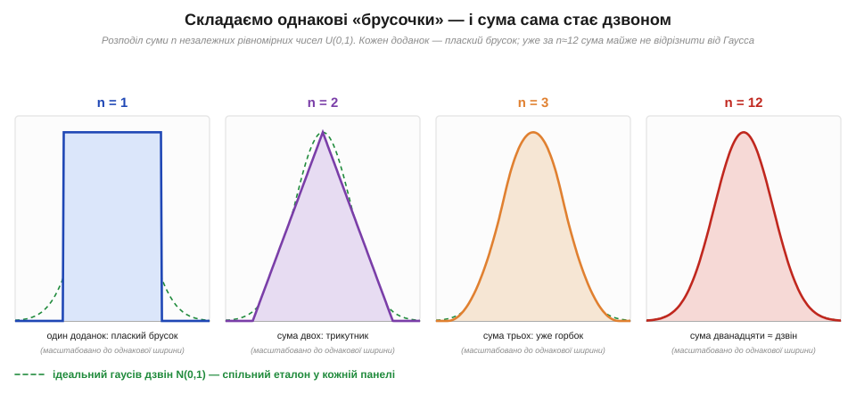
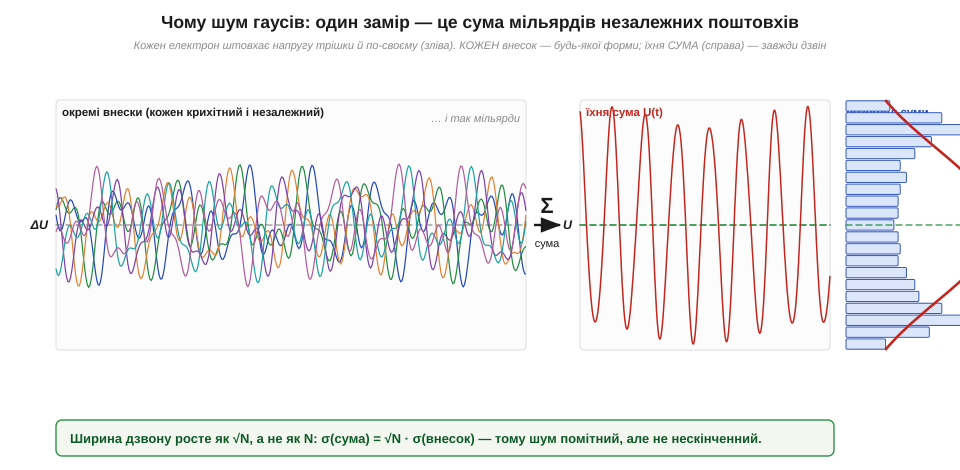

# 🧮 Центральна гранична теорема: чому шум гаусів

> [Шум і завада](book:physics/noise-interference) бувають із внутрішніх джерел і зовнішніх наводок, а [сусідня вставка про випадкову величину](math-random-variables.md) описує сам **гаусів дзвін** — його середнє μ, відхилення σ і правило 68/95/99.7 %. Лишається питання: а **чому**, власне, шум має саме цю форму? Чому не трикутник, не плаский брусок, не щось геть кострубате? Відповідь — одна з найкрасивіших теорем теорії ймовірностей. Її варто розуміти, бо вона пояснює, чому дзвін Гаусса виринає **скрізь** — у тепловому шумі резистора, у похибці АЦП, у розкиданні номіналів на конвеєрі — навіть коли причини зовсім різні.

### Означення: сума багатьох дрібниць прямує до Гаусса

**Центральна гранична теорема** (*central limit theorem*, CLT) каже коротко: якщо скласти багато **незалежних** випадкових величин, кожна з яких робить **малий** внесок, то розподіл їхньої суми наближається до **гаусового** — і то незалежно від того, як розподілений кожен окремий доданок.

Сформулюємо точніше. Нехай X₁, X₂, …, X_N — незалежні випадкові величини з однаковим розподілом, у кожної скінченне середнє m і скінченна дисперсія s². Тоді їхня сума S = X₁ + X₂ + … + X_N при великому N поводиться так:

```
середнє суми:        μ = N · m
дисперсія суми:      σ² = N · s²
відхилення суми:     σ = √N · s
форма розподілу S  →  гаусова N(μ, σ²),  коли N → ∞
```

Ключове й контрінтуїтивне тут — слова «**незалежно від форми кожного доданка**». Доданки можуть бути плоскими брусками, можуть бути двома піками, можуть бути будь-чим кривим — а сума однаково збігається до дзвону. Форма окремої цеглини стирається; лишається тільки те, що цеглин **багато** і вони **незалежні**.

### Інтуїція: чому форма стирається

Найкраще це побачити, а не довести. Візьмемо найпростіший можливий доданок — рівномірне число (*uniform*) між 0 і 1: «плаский брусок», де будь-яке значення однаково ймовірне. Жодного дзвону тут і близько немає. А тепер почнемо складати такі бруски між собою.


*Рис. Один рівномірний доданок (n = 1) — плаский брусок. Сума двох (n = 2) — уже трикутник. Сума трьох (n = 3) — горбок із заокругленими боками. Сума дванадцяти (n = 12) практично лягає на ідеальний гаусів дзвін (зелений пунктир — той самий еталон у кожній панелі). Жодного «дзвоноподібного» інгредієнта ми не додавали — форма народилася сама з додавання.*

Чому так? Подивімося на суму двох брусків. Щоб вона дорівнювала 0 (обидва числа малі) чи 2 (обидва великі), потрібен **збіг**: обидві доданки мають влучити в край діапазону. А щоб сума дорівнювала 1 — є **багато** способів: 0.2 + 0.8, 0.5 + 0.5, 0.9 + 0.1 тощо. Середина просто має більше комбінацій, ніж краї, — звідси трикутник: пік посередині, спад до країв. Додамо третій брусок — способів влучити в середину стає ще більше відносно країв, кути згладжуються. Що більше доданків, то різкіше центр випереджає краї за числом комбінацій і то ближче обрис до дзвону. Гаусова крива — це просто форма, до якої прямує підрахунок комбінацій, коли доданків багато.

> 🔧 **Навіщо це.** Саме тому в [сусідній алгоритмічній вставці](proj-noise-generator.md) гаусів шум можна згрубша зробити так: скласти 12 викликів `rand()` і відняти 6. Дванадцять — це вже «достатньо багато», щоб сума виглядала майже як дзвін; віднімання 6 лише зсуває середнє в нуль. Рецепт грубий (хвости обрізані на ±6), але він — буквально CLT, застосована руками.

### Звідки гаусів шум у залізі

Тепер головне — **чому шум приладу гаусів**. [Тепловий шум](book:physics/thermal-noise) народжується з хаотичного руху електронів: у провіднику електрони безперервно [стикаються з вузлами ґратки](book:physics/resistance-origin), розлітаючись у випадкові боки. Напруга, яку ми міряємо на резисторі в кожну мить, — це **сумарний** ефект мільярдів таких незалежних мікроподій. Один електрон штовхнув потенціал на нікчемну дещицю в один бік, інший — в інший, третій — ще кудись; кожен поштовх крихітний, їх неосяжно багато, і вони майже не пов'язані між собою. Точно ситуація CLT: сума величезного числа малих незалежних внесків.


*Рис. Фізична картина теплового шуму. Зліва — окремі внески: кожен електрон штовхає напругу трішки й по-своєму, і таких внесків мільярди. Справа — їхня сума U(t) у часі та її розподіл збоку: завжди дзвін, хоч би якої форми був окремий поштовх. Унизу — ключове співвідношення: ширина дзвону росте як √N, а не як N.*

Ось чому форма теплового шуму універсальна: не тому, що електрони «домовилися» бути гаусовими, а тому, що **будь-яка** сума мільярдів незалежних дрібниць виходить гаусовою. Та сама логіка пояснює гаусів розкид у геть інших місцях: похибка квантування АЦП (сума багатьох дрібних неточностей), розкид опору резисторів на конвеєрі (сума багатьох випадкових відхилень матеріалу й геометрії), навіть дробовий шум при великому числі носіїв. Усюди, де результат — це купа незалежних доданків, чекай на дзвін.

### √N, а не N: чому шум не нескінченний

У формулах вище ховається друге важливе твердження, і його варто проговорити окремо. Середнє суми росте **прямо** з числом доданків (μ = N·m), а от ширина дзвону — **відхилення** — росте лише як **корінь**:

```
σ(суми) = √N · s
```

Це причина, чому шум узагалі терпимий. Якби розкид суми ріс пропорційно N, то з мільярдами електронів напруга на резисторі стрибала б на кілометри. Але внески частково гасять один одного — один штовхнув угору, інший униз, — і компенсуються тим повніше, чим їх більше. Тому розкид росте повільно: подвоїти ширину шуму означає не подвоїти, а **вчетверо** збільшити число доданків.

Той самий корінь працює і в інший бік. Коли ми [**усереднюємо** N зашумлених замірів](book:electronics/noise-hunting), розкид середнього падає як s/√N — бо середнє теж є сумою незалежних доданків, поділеною на N. CLT і закон √N — дві сторони однієї монети: складати незалежне вигідно, бо випадкове росте лише як корінь.

### Де ламається — і чому це теж корисно

Теорема має дві умови, і кожна з них пояснює реальний шум, коли її **порушено**.

Перша — **незалежність**: доданки мають бути не пов'язані між собою. Коли носії корельовані й внески «тягнуть» один одного, сума вже не зобов'язана бути гаусовою. Саме тому [шум **1/f** (фліккер-шум)](book:physics/shot-flicker-noise) — *не* гаусів за цим механізмом: у ньому повільні процеси пам'ятають своє минуле, доданки скорельовані в часі, і проста CLT не діє. Якщо на екрані шум «пливе» й має пам'ять — перша підозра саме на порушену незалежність.

Друга — **скінченна дисперсія**: кожен внесок має бути малим, без рідкісних гігантських викидів. Коли в суміш потрапляє один рідкісний, але величезний доданок — поодинокий потужний імпульс наводки, — він сам визначає результат, і дзвін не складається. Тому [імпульсні завади](book:electronics/noise-hunting) (різкі поодинокі викиди) виглядають на гістограмі не акуратним дзвоном, а дзвоном із рідкими далекими «пострілами» в хвостах. Звідси простий діагностичний хід: гаусів розподіл шуму вказує на теплове, «дифузне» джерело; рідкісні викиди в хвостах — на одне сильне зовнішнє джерело, яке треба ловити окремо.

### Навіщо це на практиці

CLT — це місток від абстрактного [гаусового дзвону](math-random-variables.md) до конкретного **заліза**. Вона пояснює, чому [тепловий шум](book:physics/thermal-noise) гаусів і чому його можна характеризувати єдиним числом σ. Вона ж стоїть за [грубим генератором шуму «склади 12 і відніми 6»](proj-noise-generator.md) і за законом усереднення σ/√N. А вміння спитати «а доданки тут точно незалежні й малі?» одразу підказує, коли дзвону **не** буде, — на шумі 1/f та на імпульсних завадах. Один принцип — багато незалежних дрібниць дають дзвін — і півкартини шуму стає зрозумілою.
