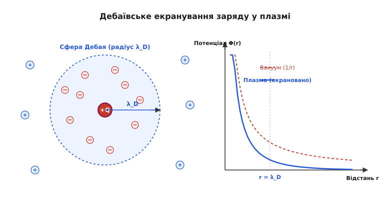
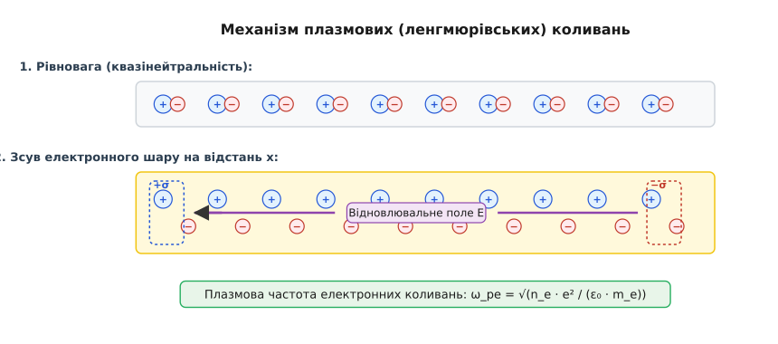
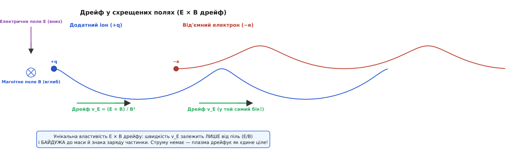
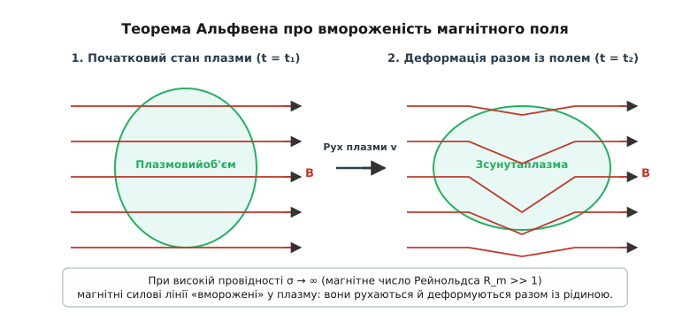

# Плазма

<preknowlist>
- [Закон Кулона](book:physics/electromagnetism/coulomb-law) — взаємодія зарядів та її далекодійний характер.
- [Сила Лоренца](book:physics/electromagnetism/lorentz-force) — рух заряджених частинок у схрещених електричному та магнітному полях.
- [Рівняння Максвелла](book:physics/electromagnetism/maxwell-equations) — зв'язок між зарядами, струмами та електромагнітними полями.
</preknowlist>

Якщо нагріти нейтральний газ до кількох тисяч кельвінів або прикласти до нього високовольтне електричне поле, теплові зіткнення та електронний удар вибивають електрони з атомних оболонок. Виникає суміш із вільних електронів, позитивних іонів і нейтральних атомів. Звичайне нейтральне повітря за кімнатної температури є ізолятором із довжиною вільного пробігу молекул близько 60 нанометрів, де частинки взаємодіють виключно через короткодійні пружні зіткнення, подібні до більярдних куль. Проте як тільки частка іонізації перевищує хоча б соті частки відсотка, середовище кардинально змінює свій фізичний характер. За замість локальних зіткнень парами кожна заряжена частинка починає одночасно відчувати кулонівські сили від мільйонів віддалених сусідів. Занурений у таке середовище заряджений електрод викликає не просто кулонівське спадання поля `1/r` на метровій відстані, а миттєве екранування заряду у шарі товщиною в частки міліметра. Зміщений електронний шар починає самочинно коливатися з частотами у гігагерцовому діапазоні, відбиваючи радіохвилі, а магнітне поле виявляється «вмороженим» у провідне середовище й рухається разом із ним.

### Від нейтрального газу до четвертого стану речовини

У нейтральному газі за нормальних умов атоми чи молекули взаємодіють між собою через ван-дер-ваальсові сили, які спадають із відстанню надзвичайно стрімко — як `1/r⁶` або `1/r¹²`. Це означає, що молекула газу летить абсолютно прямолінійно й «не знає» про існування інших молекул аж до моменту безпосереднього зіткнення. Динаміка нейтрального газу повністю визначається парними короткодійними контактами.

В іонізованому газі ситуація докорінно змінюється. Електрони й іони взаємодіють за кулонівським законом, сила якого спадає як `1/r²`. Оскільки кулонівський потенціал спадає повільно, радіус дії електростатичних сил виявляється набагато більшим за середню відстань між частинками. Кожен електрон і кожен іон перебуває у сфері дії електростатичного поля тисяч і мільйонів сусідніх зарядів.

Замість послідовності незалежних парних зіткнень виникає **колективна поведінка** (*collective behavior*): середовище реагує на зовнішній вплив узгодженим рухом величезних масивів зарядів. Саме ця колективність під дією довгосяжних кулонівських сил і відрізняє плазму від звичайного газу, виділяючи її в окремий, четвертий стан речовини.

📜 [Історія виникнення поняття плазми](book:physics/electromagnetism/plasma-physics/hist-langmuir.md) показує, як у 1928 році Ірвінг Ленгмюр уперше застосував цей термін для опису іонізованого газу у газорозрядних трубках, провівши паралель із біологічною плазмою крові, що переносує в собі клітинні елементи.

Не кожна суміш заряджених частинок є плазмою. Щоб іонізований газ набув властивостей плазми, він повинен задовольняти трьом строгим фізичним критеріям: квазінейтральності на макроскопічних масштабах, дебаївському екрануванню та переважанню колективних коливань над зіткненнями з нейтралами.

### Три фундаментальні критерії плазми

Перша вимога до плазми — це **квазінейтральність** (*quasineutrality*). У будь-якому макроскопічному об'ємі плазми сумарна кількість від'ємного заряду електронів практично точно дорівнює сумарному додатному заряду іонів:

```
n_e ≈ Z · n_i
```

де `n_e` — концентрація електронів, `n_i` — концентрація іонів із зарядом `Z·e`. Якщо у плазмі виникає флуктуація заряду, величезні кулонівські сили негайно виникають для відновлення рівноваги. Відхилення від нейтральності можливі лише на дуже малих просторових масштабах.

Межею, що розділяє мікроскопічне порушення нейтральності та макроскопічну квазінейтральність, є **дебаївський радіус екранування** (*Debye length*, `λ_D`). 

Помістимо в плазму додатний пробний заряд `+Q`. Рухливі легкі електрони миттєво притягуються до нього, а важкі іони відштовхуються. Навколо заряду утворюється сферична електронна хмара (сфера Дебая), надлишковий від'ємний заряд якої точно нейтралізує заряд `+Q` для зовнішнього спостерігача.


*Зліва: пробний заряд +Q оточується екранувальною сферою Дебая радіуса λ_D із надлишком електронів. Справа: потенціал у вакуумі спадає як 1/r (пунктир), тоді як у плазмі поле екранується за експоненціальним законом exp(-r/λ_D)/r (суцільна синя лінія).*

У той час як у вакуумі потенціал точкового заряду спадає за законом Кулона `Φ(r) = Q / (4 π ε₀ r)`, у плазмі потенціал згасає за дебаївським законом:

```
Φ(r) = (Q / (4 π ε₀ r)) · exp(- r / λ_D)
```

Радіус екранування Дебая визначається балансом між кулонівським притяганням зарядів та їхнім розкидаючим тепловим рухом:

```
λ_D = √( (ε₀ · k_B · T_e) / (n_e · e²) )
```

де `ε₀` — електрична стала, `k_B` — стала Больцмана, `T_e` — температура електронів, `n_e` — електронна концентрація, `e` — елементарний заряд.

Строге математичне виведення цього розкладу наведено у вставці 🧮 [Виведення екранування Дебая](book:physics/electromagnetism/plasma-physics/math-debye-shielding.md).

Звідси формулюється **перший критерій плазми**: характерний розмір плазмової системи `L` мусить бути значно більшим за радіус Дебая:

```
L >> λ_D
```

Якщо розмір судини `L < λ_D`, електрони просто вилетять на стінки до того, як встигне сформуватися екранувальна хмара, і система поводитиметься як звичайний пучок заряджених частинок у вакуумі.

**Другий критерій плазми** вимагає, щоб усередині сфери Дебая перебувала велика кількість частинок. Число частинок у дебаївській сфері називається **плазмовим параметром** (*plasma parameter*, `N_D`):

```
N_D = n_e · (4/3) · π · λ_D³ >> 1
```

Якщо `N_D >> 1`, середня кінетична енергія хаотичного теплового руху частинок перевищує потенціальну енергію взаємодії двох сусідніх зарядів. Така плазма називається **ідеальною** або **слабкозв'язаною**. Саме велике значення `N_D` гарантує, що статистика й екранування працюють колективно, а не розпадаються на ізольовані зіткнення пар частинок.

**Третій критерій плазми** стосується частоти зіткнень з нейтральними атомами. Щоб електромагнітні динамічні процеси визначали поведінку системи, електронна плазмова частота `ω_pe` повинна значно перевищувати частоту зіткнень електронів із нейтральними частинками `ν_en`:

```
ω_pe >> ν_en    (або  ω_pe · τ_n >> 1)
```

Якщо нейтральний газ надто густий, електрони втрачають імпульс у зіткненнях із молекулами раніше, ніж встигнуть здійснити бодай одне плазмове коливання. Тоді система поводиться як звичайний нейтральний газ із помірною іонізацією, а не як плазма.

### Приелектродні дебаївські шари та плазмовий потенціал

Коли плазма контактує з твердою поверхнею (стінкою вакуумної камери або вимірювальним електродом), виникає важливий пристінковий ефект. Оскільки хаотична теплова швидкість електронів `v_te = √(k_B T_e / m_e)` перевищує швидкість іонів `v_ti` у десятки й сотні разів через різницю мас, електрони спочатку вилітають на стінку значно швидше за іони.

У результаті стінка заряджається від'ємно відносно об'єму плазми, набуваючи **плаваючого потенціалу** (*floating potential*, `V_f`):

```
V_f = - (k_B · T_e / (2 · e)) · ln( m_i / (2 · π · m_e) )
```

Цей від'ємний потенціал стінки починає відштовхувати наступні електрони й прискорювати іони, поки потоки зарядів на стінку не зрівняються. Між нейтральною плазмою та стінкою утворюється вузька область порушеної квазінейтральності з надлишком позитивних іонів — **приелектродний дебаївський шар** (*plasma sheath*), товщина якого зазвичай становить `5–10 λ_D`.

Для того щоб іони могли стабільно входити в приелектродний шар і компенсувати втрати, вони повинні мати швидкість, не меншу за іонно-звукову швидкість у плазмі. Ця умова називається **критерієм Бома для приелектродного шару** (*Bohm sheath criterion*):

```
v_i ≥ c_s = √( (k_B · T_e) / m_i )
```

Щоб розігнати іони до іонно-звукової швидкості `c_s`, безпосередньо перед дебаївським шаром утворюється ширша область зі слабким електричним полем — **преднашар** (*presheath*), потенціальне падіння у якому дорівнює `ΔV ≈ k_B T_e / (2 e)`.

### Кулонівський логарифм та опір Шпітцера

У звичайних твердих металах електричний опір зростає з підвищенням температури через підсилення коливань кристалічної ґратки (фононів). У повністю іонізованій плазмі спостерігається прямо протилежний ефект: **чим гарячіша плазма, тим краще вона проводити струм**.

Мікроскопічною причиною цього є специфіка кулонівського розсіювання. Оскільки кулонівська сила спадає як `1/r²`, переріз зіткнення електрона з іоном зі зміною напрямку руху на великий кут є малим. Основний внесок у гальмування електронів дають численні далекі зіткнення з малими кутами відхилення, сукупна дія яких описується **кулонівським логарифмом** `ln Λ`:

```
ln Λ = ln( λ_D / b_0 )
```

де `b_0 = e² / (4 π ε₀ k_B T_e)` — прицільний параметр зіткнення на 90°. 

Остаточна формула для питомого електричного опору повністю іонізованої плазми була отримана Лайманом Шпітцером у 1953 році (**опір Шпітцера**, *Spitzer resistivity*):

```
η_Spitzer = (π · e² · √m_e · Z · ln Λ) / ( 4 · (2 π ε₀)² · (k_B · T_e)^(3/2) )
```

Головний висновок із формули Шпітцера: **питомий опір плазми спадає обернено пропорційно температурі в ступені 3/2** (`η ∝ T_e⁻³/²`).

За температур електронів понад `10 кЕв` (понад 100 мільйонів кельвінів) питомий опір дейтерієво-тритієвої плазми стає меншим за питомий опір чистої міді за кімнатної температури! Саме тому омічний нагрів плазми струмом у токамаках стає неефективним при високих температурах, що вимагає застосування додаткових методів нагріву — високочастотними хвилями та інжекцією швидких нейтральних атомів.

### Плазмові коливання й плазмова частота Ленгмюра

Що станеться, якщо у квазінейтральній плазмі зсунути плоский шар електронів відносно нерухомих іонів на малу відстань `x`?

На межах зсунутого шару виникнуть нескомпенсовані поверхневі заряди з густиною `σ = e · n_e · x`. Згідно з теоремою Гаусса, ці заряди створюють однорідне відновлювальне електричне поле `E`:

```
E = (e · n_e / ε₀) · x
```

На кожен зсунутий електрон діє повертальна сила `F = - e · E`. Другий закон Ньютона для маси електрона `m_e` набуває вигляду:

```
m_e · (d²x / dt²) = - (n_e · e² / ε₀) · x
m_e · (d²x / dt²) + (n_e · e² / ε₀) · x = 0
```


*Верхній блок: рівноважна плазма, де іони й електрони перемішані квазінейтрально. Нижній блок: зсув електронної хмари створює нескомпенсовані заряди +σ та −σ, які генерують електричне поле E, що повертає електрони назад і викликає коливання з частотою ω_pe.*

Це диференціальне рівняння гармонічного осцилятора без загасання. Власна частота цих електростатичних коливань називається **електронною плазмовою частотою** або **частотою Ленгмюра** (`ω_pe`):

```
ω_pe = √( (n_e · e²) / (ε₀ · m_e) )
```

Зверніть увагу: плазмова частота залежить **виключно від електронної концентрації** `n_e` та фундаментальних констант (`e`, `m_e`, `ε₀`). Маса іонів у формулу не входить, оскільки через величезну різницю мас (`m_i / m_e > 1836`) іони за час електронного коливання залишаються практично нерухомими.

Якщо врахувати тепловий рух електронів, плазмові коливання починають поширюватися у просторі у вигляді поздовжніх електростатичних хвиль (хвилі Ленгмюра). Їхній дисперсійний співвідношення описується **формулою Бома — Гросса**:

```
ω² = ω_pe² + 3 · k² · v_te²
```

де `k` — хвильове число, `v_te = √(k_B T_e / m_e)` — теплова швидкість електронів.

**Приклад (обчислення плазмової частоти іоносфери).** У верхній іоносфері Землі (шар F) концентрація електронів становить `n_e ≈ 10¹² м⁻³`. Обчислимо частоту плазмових коливань:

```
ω_pe = √( (10¹² · (1.602·10⁻¹十九章)²) / (8.854·10⁻¹² · 9.109·10⁻³¹) )
ω_pe ≈ √( (2.566·10⁻²⁶) / (8.065·10⁻⁴²) )
ω_pe ≈ √( 3.182·10¹⁵ ) ≈ 5.64·10⁷ рад/с

f_pe = ω_pe / (2 π) ≈ 9.0·10⁶ Гц = 9 МГц
```

Цей результат пояснює фундаментальне явище **поширення та відбивання радіохвиль в іоносфері**. 

Якщо через плазму проходить зовнішня електромагнітна хвиля з частотою `ω`, електрони плазми починають коливатися у полі хвилі. 
- Якщо частота хвилі `ω < ω_pe`, електрони встигають повністю зміститися й згенерувати протиполе, яке повністю екранує хвилю. Електромагнітна хвиля не може проникнути вглиб плазми й повністю відбивається від неї (як від металевого дзеркала). Саме тому короткі радіохвилі (до 10–15 МГц) відбиваються від іоносфери Землі й огинають земну кулю, забезпечуючи далекий радіозв'язок.
- Якщо частота хвилі `ω > ω_pe`, електрони через власну інерцію не встигають реагувати на високочастотні коливання поля. Хвиля проходить крізь плазму без перешкод. З цієї причини супутниковий зв'язок та GPS працюють на частотах у діапазоні гігагерців (`1.5–5 ГГц`), які вільно пробивають іоносферу наскрізь.

### Спектр хвильових мод у намагніченій плазмі

При накладанні зовнішнього магнітного поля `B` плазма з ізотропного середовища перетворюється на анізотропне оптично активне середовище зі складним спектром власних хвильових мод:

1. **Звичайна хвиля (O-хвиля, *Ordinary wave*):** Вектор електричного поля хвилі паралельний зовнішньому магнітному полю (`E_wave ∥ B_0`). Магнітне поле не впливає на рух електронів, і коефіцієнт заломлення збігається з ненамагніченою плазмою: `n² = 1 - ω_pe² / ω²`.
2. **Незвичайна хвиля (X-хвиля, *Extraordinary wave*):** Вектор електричного поля перпендикулярний до `B_0`. На електрон діють одночасно електричне поле хвилі та сила Лоренца від `B_0`, що призводить до резонансу на гібридній верхній частоті `ω_UH = √(ω_pe² + ω_ce²)`.
3. **Свистячі атмосферики (Whistlers):** Низькочастотні електромагнітні хвилі (`ω << ω_ce`), що поширюються вздовж магнітних силових ліній магнітосфери Землі. Вони породжуються розрядами блискавок і мають дисперсію `v_phase ∝ √ω`, через що високочастотні компоненти прибувають раніше за низькочастотні, створюючи характерний свистячий звук у радіоприймачах.
4. **Іонно-звукові хвилі (*Ion acoustic waves*):** Поздовжні низькочастотні тискні коливання іонів, де роль відновлювального тиску відіграє електронна температура, а інертність забезпечують маси іонів. Швидкість поширення дорівнює `c_s = √(k_B T_e / m_i)`.

### Заряджений газ у магнітному полі: Ларморівський рух і дрейфи

Коли плазма вміщена у зовнішнє магнітне поле `B`, сила Лоренца `F = q · (v × B)` змушує заряджені частинки обертатися по колових орбітах навколо силових ліній поля.

Рівновага відцентрової сили й сили Лоренца `m · v_⊥² / r_L = |q| · v_⊥ · B` визначає **ларморівський радіус** (*Larmor radius*, `r_L`) та **циклотронну частоту** (*cyclotron frequency*, `ω_c`):

```
r_L = (m · v_⊥) / (|q| · B)

ω_c = (|q| · B) / m
```

Оскільки маса іона `m_i` у тисячі разів більша за масу електрона `m_e`, за однаковою температурою ларморівський радіус іона `r_Li` у десятки разів більший за електронний `r_Le`. Заряджені частинки немов «накручуються» на магнітні силові лінії, вільно рухаючись уздовж поля і будучи заблокованими у поперечному напрямку.

Проте якщо на магнітне поле накладається додаткове електричне поле `E`, сила ваги чи неоднорідність самого поля, частинки починають повільно зсуватися впоперек магнітних ліній — виникає **дрейф** (*drift*).

Найважливішим є **дрейф у схрещених електричному та магнітному полях** (`E × B` дрейф). 


*При підводі вертикального поля E та магнітного поля B вглиб картинки, додатний іон та від'ємний електрон описують циклоїдальні траєкторії. На ділянці прискорення полем E швидкість частинки зростає (і радіус кривини r_L збільшується), а на ділянці гальмування — спадає. У результаті ІОН І ЕЛЕКТРОН ДРЕЙФУЮТЬ В ОДИН І ТОЙ САМИЙ БІК праворуч з однаковою швидкістю v_E.*

Вектор швидкості `E × B` дрейфу описується формулою:

```
v_E = (E × B) / B²
```

У скалярному вигляді для перпендикулярних полів швидкість дрейфу дорівнює просто:

```
v_E = E / B
```

Цей результат має дивовижну фізичну властивість: **швидкість `E × B` дрейфу не залежить ні від маси `m`, ні від величини чи знака заряду частинки `q`**. 

Іони й електрони у схрещених полях рухаються в **один і той самий бік** з абсолютно однаковою швидкістю. Оскільки від'ємні й додатні заряди переносяться разом, `E × B` дрейф **не створює електричного струму** — плазма переміщується як єдине суцільне нейтральне середовище.

Якщо ж магнітне поле є неоднорідним (`∇B ≠ 0`) або має вигнуті силові лінії з радіусом кривини `R`, виникають **градієнтний** та **кривизний дрейфи**:

```
v_∇B = (m · v_⊥² / (2 · q · B³)) · (B × ∇B)      [градієнтний дрейф]

v_R = (m · v_∥² / (q · B² · R²)) · (R × B)        [кривизний дрейф]
```

Зверніть увагу: у формулах градієнтного та кривизного дрейфів знак заряду `q` стоїть у знаменнику. Це означає, що іони й електрони дрейфують у **протилежні боки**. У магнітних пастках для термоядерного синтезу це призводить до просторового розділення зарядів, виникнення внутрішніх електричних піль і розриву утримання плазми.

⚙️ [Моделювання руху заряду в схрещених полях](book:physics/electromagnetism/plasma-physics/proj-plasma-sim.md) показує чисельну реалізацію інтегрування траєкторій частинок за допомогою симплектичного алгоритму Бориса на C та C++.

### Магнітна гідродинаміка й теорема про вмороженість поля

На макроскопічних масштабах, коли характерні часи процесів значно більші за циклотронний період, а розміри більші за ларморівський радіус, плазму моделюють як суцільну електропровідну рідину. Цей підхід називається **магнітною гідродинамікою** (МГД, *magnetohydrodynamics*, MHD).

Динаміка МГД-середовища описується поєднанням рівнянь Нав'є — Стокса для суцільного середовища та рівнянь Максвелла для електромагнітного поля. Ключовим рівнянням МГД є **рівняння переносу магнітного поля**:

```
∂B / ∂t = ∇ × (v × B) + (1 / (μ₀ · σ)) · ∇² B
```

де `v` — швидкість руху елемента плазми, `σ` — електрична провідність плазми, `μ₀` — магнітна стала.

Співвідношення між двома членами у правій частині визначається безрозмірним **магнітним числом Рейнольдса** (*magnetic Reynolds number*, `R_m`):

```
R_m = μ₀ · σ · v · L
```

де `L` — характерний масштаб системи.

1. **Дифузійний режим (`R_m << 1`):** Якщо провідність мала або масштаби малі, провідний член `∇ × (v × B)` є мізерним. Магнітне поле вільно дифундує крізь плазму із часом розсіювання `τ_diff = μ₀ · σ · L²`, як у звичайній слабопровідній рідині.
2. **Ідеальний режим (`R_m >> 1`):** Для високотемпературної плазми провідність `σ → ∞` (або для астрофізичних об'єктів з величезними розмірами `L`). Другий член зникає, і рівняння переходить у:

```
∂B / ∂t = ∇ × (v × B)
```

Це рівняння виражає **теорему Альфвена про вмороженість магнітного поля** (*Alfvén's frozen-in theorem*), сформульовану шведським фізиком Ханнесом Альфвеном у 1942 році (Нобелівська премія з фізики 1970 року).


*При високопровідній плазмі (R_m >> 1) силові лінії магнітного поля B не можуть прослизати крізь речовину. При зміщенні плазмового об'єму силові лінії згинаються й деформуються разом із рідиною.*

Математично вмороженість означає, що магнітний потік через будь-який замкнений контур, що рухається разом із плазмою, залишається строго constant: `dΨ_m / dt = 0`.

Вмороженість працює в обидва боки:
- Якщо плазма рухається (наприклад, сонячний вітер), вона тягне й деформує магнітні силові лінії за собою.
- Якщо вигинаються магнітні силові лінії, вони діють на плазму з силою **магнітного натягу** `(B · ∇) B / μ₀` та **магнітного тиску** `∇(B² / (2 μ₀))`, змушуючи плазму рухатися разом із полем.

Натяг магнітних силових ліній подібний до натягу натягнутих струн. Якщо шарпнути таку вморожену лінію, по ній побіжить поперечна хвиля — **альфвенівська хвиля** (*Alfvén wave*), що поширюється зі швидкістю Альфвена `v_A`:

```
v_A = B / √(μ₀ · ρ_m)
```

де `ρ_m` — масова густина плазми. Альфвенівські хвилі є фундаментальним механізмом переносу енергії у сонячній короні, магнітосфері Землі та міжзоряному середовищі.

### Магнітне перез'єднання: вибуховий розрив вмороженості

Хоча теорема Альфвена чудово працює у гладких об'ємах плазми, у вузьких струмових шарах (*current sheets*), де протилежно спрямовані магнітні силові лінії зближуються впритул, градієнти поля стають гігантськими (`∇² B → ∞`). У цих тонких зонах магнітне число Рейнольдса локально падає, і вмороженість вибухово порушується.

Це явище називається **магнітним перез'єднанням** (*magnetic reconnection*). Протилежно спрямовані силові лінії розриваються й з'єднуються у новій топологічній конфігурації. Накопичена магнітна енергія `B² / (2 μ₀)` миттєво перетворюється на кінетичну енергію швидких плазмових струменів та прискорених електронів. Саме магнітне перез'єднання є першопричиною сонячних спалахів, корональних викидів маси та геомагнітних суббур у магнітосфері Землі.

### Термоядерний синтез і нестійкості утримання

Найважливішим прикладним завданням фізики плазми є створення керованого термоядерного синтезу — відтворення процесів, що живлять Сонце, в земних умовах. Для проходження реакції синтезу дейтерію й тритію `D + T → ⁴He + n + 17.6 МеВ` необхідно розігріти плазму до температур понад `100 мільйонів кельвінів` (`~10–15 кЕв`).

За таких температур жоден матеріальний контейнер не здатний утримати плазму — стінки миттєво випаруються, а плазма охолоне. Для ізоляції використовують **магнітне утримання** (*magnetic confinement*) та **інерціальне утримання** (*inertial confinement*).

Щоб реакція синтезу виділяла більше енергії, ніж витрачається на нагрів, плазма повинна задовольняти **критерію Лоусона** (*Lawson criterion*):

```
n_e · τ_E · T ≥ 3 · 10²¹ кеВ · с / м³
```

де `n_e` — густина плазми, `τ_E` — час утримання енергії, `T` — температура.

Головними типами магнітних пасток є:
1. **Токамак** (*Tokamak*) — тороїдальна камера з аксіальним магнітним полем, де тороїдальне поле створюється зовнішніми котушками, а полоїдальне — потужним струмом, що протікає по самій плазмі.
2. **Стелларатор** (*Stellarator*) — тороїдальна система зі складними викрученими трьохвимірними котушками, які створюють усе необхідне обертальне перетворення поля без необхідності пропускання великого внутрішнього струму по плазмі.
3. **Z-пінч** (*Z-pinch*) — циліндричний шнур плазми, що стискається власним магнітним полем прохідного вздовж нього струму.

При інерціальному синтезі (наприклад, на установці NIF у США) мікроскопічна мішень із дейтерієм і тритієм рівномірно опромінюється надпотужними лазерними імпульсами. Зівальна абляція зовнішньої оболонки стискає заморожену DT-паливо в 10 000 разів до густин вищих за свинець, де термоядерне горіння проходить за частки наносекунди під дією власної інерції стиснутої речовини.

Головним ворогом утримання є **МГД-нестійкості** (*MHD instabilities*). Гаряча плазма під тиском намагається вирватися з магнітного поля, подібно до стисненого газу у стиснутому гумовому балоні:
- **Перетяжечна нестійкість (нестійкість перетяжки, m=0):** випадкове звуження плазмового шнура збільшує місцеве магнітне поле `B ∝ 1/r`, яке стискає це місце ще сильніше, перерізаючи шнур.
- **Гвинтова нестійкість (m=1, kink instability):** випадковий вигин плазмового шнура згущує силові лінії на внутрішньому боці вигину, створюючи магнітний тиск, що виштовхує вигин назовні.
- **Желобкова нестійкість (нестійкість Райлея — Тейлора):** виникає на опуклій межі розподілу між важкою плазмою та легким магнітним полем.

Приборкання цих нестійкостей за допомогою складного профілювання магнітних полів, обертання та зворотних зв'язків є головною метою міжнародного експериментального термоядерного реактора **ITER** у Франції.

> 🔧 **Навіщо це.** Фізика плазми є критичною не лише для термоядерної енергетики майбутнього, а й для сучасної напівпровідникової індустрії та космонавтики.
> 
> 1. **Плазмове травлення мікросхем (RIE / ICP):** Усі сучасні процесори з топологічними розмірами елементів від кількох нанометрів виготовляються за допомогою плазмохімічного реактивного іонного травлення (*Reactive Ion Etching*). Низькотемпературна високочастотна плазма фтор- чи хлорвмісних газів створює анізотропний шар Дебая біля кремнієвої пластини, спрямовуючи іони суворо перпендикулярно до поверхні для витравлювання доріжок шириною у лічені атоми.
> 2. **Іонні та плазмові двигуни (двигуни Холла):** Космічні апарати та супутники (наприклад, Starlink) використовують плазмові холівські двигуни для утримання орбіти. Вхідний ксенон іонізується, а електрони, заблоковані у радіальному магнітному полі `E × B`, створюють поздовжнє електричне поле, яке розганяє іони ксенону до швидкостей 30–50 км/с, забезпечуючи питомий імпульс у разів вищий за найраціональніші хімічні ракети.
> 3. **Прогнозування космічної погоди:** Магнітні бурі й полярне сяйво викликані взаємодією сонячного вітру (плазмового потоку від Сонця) з магнітосферою Землі через МГД-перез'єднання магнітних ліній.

Узагальнюючи, плазма — це не просто «гарячий газ», а самоорганізований четвертий стан речовини, динаміка якого визначається кулонівською колективністю, екрануванням Дебая, плазмовими коливаннями Ленгмюра та вмороженістю магнітного поля. Від розгадки механізмів її утримання залежить перехід людства до практично необмеженої термоядерної енергетики.
