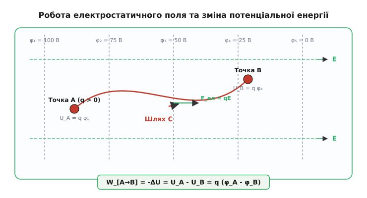
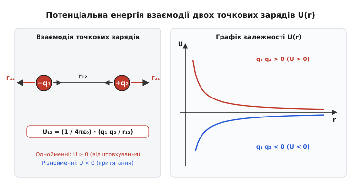
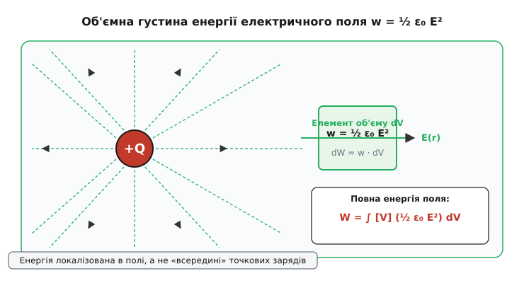
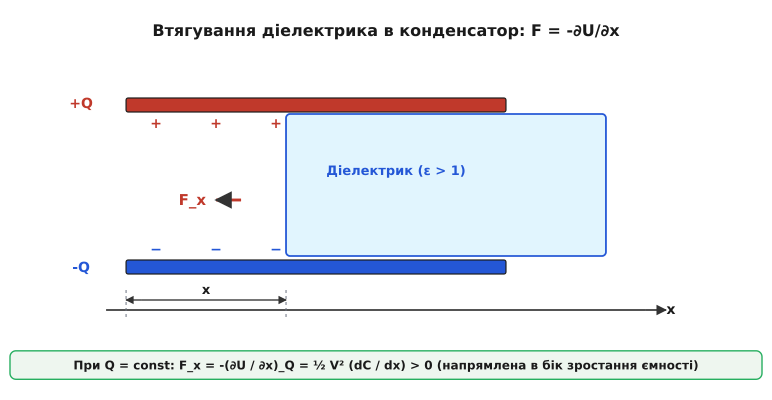

# Потенціальна енергія в електричному полі

<preknowlist>
- [Закон Кулона](topic:physics/coulomb-law) — кулонівська сила взаємодії між точковими зарядами.
- [Потенціальне поле й циркуляція](topic:physics/conservative-field) — незалежність роботи від шляху та поняття скалярного потенціалу.
- [Потенціал](topic:physics/electric-potential) — скалярна характеристика силового поля та робота переміщення одиничного заряду.
- [Закон збереження енергії](topic:physics/energy-conservation) — фундаментальний принцип збереження та взаємоперетворення енергії.
</preknowlist>

Для переміщення точкового заряду `q = +1` мкКл у протилежному напрямку до векторних ліній однорідного електричного поля напруженістю `E = 100` кВ/м на відстань `d = 0.5` м зовнішні сили мусять виконати роботу `W = q E d = 0.05` Дж. Уся ця робота не зникає безвісти й не розсіюється на теплові флуктуації, а повністю акумулюється в системі «заряд — поле» як потенціальна енергія `U`. Якщо відпустити заряд без початкової швидкості, накопичений енергетичний запас повністю перетвориться на кінетичну енергію, розгонивши частку масою `m = 1` мг до швидкості `10` м/с. На відміну від механіки макроскопічних тіл, де потенціальна енергія сприймається як характеристика піднятого вантажу, в електростатиці постає принципове питання: де саме зберігається ця енергія — безпосередньо у точковому заряді чи в навколишньому просторі, пронизаному силовим полем?

## 1. Фізична природа електростатичної потенціальної енергії

Електростатична сила `F = q E`, яка діє на електричний заряд `q` з боку невихорового силового поля `E`, належить до класу консервативних (потенціальних) сил. З математичної точки зору консервативність означає, що ротор напруженості електростатичного поля тотожно дорівнює нулю `∇ × E = 0`, а циркуляція вектора напруженості по будь-якому замкненому контуру `L` дорівнює нулю `∮ [L] E · dr = 0`.

Внаслідок цього елементарна робота `dW = F · dr`, яка виконується силами поля при переміщенні заряду на вектор елементарного зсуву `dr`, повністю визначається початковим і кінцевим положеннями частки у просторі та зовсім не залежить від геометричної форми шляху. Вектор кулонівської сили пов'язаний з градієнтом потенціальної енергії співвідношенням `F = -∇U = -q ∇φ`, що гарантує направленість сили в бік найшвидшого зменшення потенціальної енергії.

Якщо заряд переміщується з початкової точки `A` у кінцеву точку `B` під дією векторного електростатичного поля, робота поля `W_[A->B]` дорівнює зменшенню (убутку) потенціальної енергії системи:

```
W_[A->B] = ∫ [A->B] F · dr = U_A - U_B = -ΔU
```

Зовнішні ж сили, які долають протидію електричного поля і переміщують заряд без зміни його кінетичної енергії (тобто квазістатично, з нульовим прискоренням у кожній точці траєкторії), виконують роботу `W_зовн`, що дорівнює точним приростом потенціальної енергії:

```
W_зовн = -W_[A->B] = U_B - U_A = ΔU
```


*Переміщення пробного заряду між двома точками електростатичного поля: робота поля залежить лише від різниці потенціалів і дорівнює зменшенню потенціальної енергії U.*

Геометрично простір електростатичного поля можна розбити на **еквіпотенціальні поверхні** — поверхні, у всіх точках яких скалярний потенціал має одинакове значення `φ(r) = const`. Оскільки при переміщенні заряду уздовж еквіпотенціальної поверхні робота поля дорівнює нулю `dW = q E · dr = 0`, вектор напруженості поля `E` у кожній точці простору строго перпендикулярний до еквіпотенціальної поверхні `E ⊥ dS_екві`.

У багатоелектродних електростатичних системах (наприклад, електростатичних лінзах електронних мікроскопів або квадрупольних мас-спектрометрах) топологія еквіпотенціальних поверхонь визначає фокусування та фокусувальні сили, що діють на пучки заряджених часток. Перехід частки крізь систему потенціальних бар'єрів дозволяє керувати траєкторією без використання енергоємних магнітних полів.

При переході межі двох діелектричних середовищ із різними проникностями `ε₁` та `ε₂` векторні лінії електричного поля заломлюються. З граничних умов Максвелла для тангенціальних компонент напруженості `E_1t = E_2t` та нормальних компонент електричного зсуву `D_1n = D_2n` випливає перерозподіл густини потенціальної енергії: середовище з вищою діелектричною проникністю концентрує в собі більшу густину енергії поля.

### Вибір нульового рівня потенціальної енергії

Оскільки безпосередній фізичний зміст має лише різниця потенціальних енергій `ΔU` між двома станами системи, конкретне числове значення потенціальної енергії у заданій точці визначають відносно довільно обраного нормувального рівня, у якому `U` приймають рівним нулю:

1. **Для скінченних систем точкових зарядів або локалізованих розподілів:** Нульовий рівень потенціальної енергії стандартно обирають на нескінченно великій відстані від усіх джерел `U(∞) = 0`. У цьому випадку потенціальна енергія точкового заряду в точці з радіус-вектором `r` дорівнює роботі, яку виконують сили поля при переміщенні цього заряду з точки `r` на нескінченність:

```
U(r) = W_[r -> ∞] = q ∫ [r -> ∞] E · dr
```

2. **Для однорідного поля між паралельними пластинами або в схемах із заземленням:** За нульовий рівень зручно прийняти потенціальну енергію на негативно зарядженій (або заземленій) пластині `z = 0`. Тоді на висоті `z` над цією пластиною потенціальна енергія позитивного заряду `q` дорівнює:

```
U(z) = q E z
```

Формула `U(z) = q E z` демонструє повну математичну ізоморфність електростатичного поля у плоскому конденсаторі й однорідного гравітаційного поля Землі біля її поверхні `U_грав(z) = m g z`. В обох випадках сила постійна за величиною й напрямком, а потенціальна енергія зростає лінійно з віддаленням від відлікової площини.

Проте між електростатикою та гравітацією існує фундаментальна фізична відмінність:
- Електричні заряди бувають двох знаків (додатні й від'ємні), що обумовлює як притягання, так і відштовхування.
- Маса завжди додатна, а гравітація — виключно сила притягання.
- Електричне поле можна повністю екранувати провідним щитом (клитка Фарадея), тоді як гравітаційне поле екрануванню не піддається.

### Зв'язок потенціальної енергії зі скалярним потенціалом

Оскільки електростатична сила пропорційна величині пробного заряду `F = q E`, потенціальна енергія `U` також прямо пропорційна величині цього заряду `q`. Скалярна величина, що визначається як відношення потенціальної енергії пробного заряду до його величини, називається **скалярним електростатичним потенціалом** `φ` (від латинського *potentia* — можливість, прихована сила):

```
φ(r) = U(r) / q
```

Відповідно, потенціальна енергія заряду `q`, внесеного в точку з потенціалом `φ`, визначається як:

```
U = q φ
```

Вектор напруженості електричного поля виражається через градієнт скалярного потенціалу зі знаком мінус: `E = -∇φ = -(i ∂φ/∂x + j ∂φ/∂y + k ∂φ/∂z)`.

Знаковий аналіз формули `U = q φ` розкриває фундаментальну динаміку електростатики:
- Позитивний заряд `q > 0` має найменшу потенціальну енергію в точках із найнижчим потенціалом `φ`. Тому сили поля завжди штовхають позитивні заряди в бік зменшення потенціалу (від високого `φ` до низького `φ`).
- Негативний заряд `q < 0` через від'ємний знак має найменшу потенціальну енергію у точках із **найвищим** потенціалом `φ`. Сили поля прискорюють негативні заряди у напрямку зростання потенціалу.
- Будь-яка вільна заряжена частка в ізольованій системі завжди рухається так, щоб її потенціальна енергія `U` зменшувалася, перетворюючись на кінетичну енергію руху.

Цей принцип пояснює роботу всіх прискорювачів заряджених часток, електронно-променевих трубок та електронних мікроскопів: електрон (`q = -e`), проходячи прискорювальну різницю потенціалів `ΔV = 10` кВ, зменшує свою потенціальну енергію на `ΔU = -e ΔV = -10` кеВ, набуваючи кінетичної енергії `10` кеВ і швидкості близько `59 300` км/с.

## 2. Енергія взаємодії системи точкових зарядів та диполів

Розглянемо систему, що складається з двох точкових зарядів `q₁` та `q₂`, віддалених один від одного на відстань `r₁₂`.

При відсутності інших джерел заряд `q₁` створює у точці розташування заряду `q₂` кулонівський потенціал `φ₁(r₂) = q₁ / (4π ε₀ r₁₂)`. Навпаки, заряд `q₂` створює у точці розташування `q₁` потенціал `φ₂(r₁) = q₂ / (4π ε₀ r₁₂)`.

Потенціальна енергія взаємодії цієї пари зарядів дорівнює роботі, яку необхідно виконати зовнішнім силам, щоб зблизити ці заряди з нескінченності до відстані `r₁₂`:

```
U₁₂ = (1 / (4π ε₀)) · (q₁ q₂ / r₁₂)
```


*Потенціальна енергія взаємодії двох точкових зарядів U(r): для однойменних зарядів U > 0 (відштовхування), для різнойменних U < 0 (зв'язаний стан).*

Аналіз знака енергії взаємодії `U₁₂`:
1. **Однойменні заряди (`q₁ q₂ > 0`):** Потенціальна енергія `U₁₂ > 0` є додатною. Для зближення однойменних зарядів зовнішні сили мусять долати кулонівське відштовхування, виконуючи додатну роботу. Система прагне самочинно розлетітися на нескінченність, вивільняючи накопичену енергію `U₁₂` у формі кінетичної енергії.
2. **Різнойменні заряди (`q₁ q₂ < 0`):** Потенціальна енергія `U₁₂ < 0` є від'ємною. При зближенні різнойменних зарядів кулонівське притягання саме виконує додатну роботу. Стан двох протилежних зарядів на скінченній відстані є **зв'язаним станом** (*bound state*): щоб розірвати їх і розвести на нескінченність, зовнішнім силам потрібно затратити додатну енергію `W = |U₁₂|`.

Ця від'ємна потенціальна енергія є фізичною основою енергії іонізації атомів: щоб відірвати електрон від ядра атома водню з відстані Бора `r_B ≈ 0.0529` нм, зовнішні сили мусять виконати роботу `W = |U| = e² / (4π ε₀ r_B) ≈ 27.2` еВ (що відповідає подвійній енергії зв'язку 13.6 еВ з урахуванням кінетичної енергії електрона на орбіті).

### Узагальнення на систему з N точкових зарядів та рідкі середовища

Якщо система складається з `N` точкових зарядів, її повна потенціальна енергія взаємодії `U` дорівнює алгебраїчній сумі енергій взаємодії всіх можливих неповторюваних пар зарядів:

```
U = ∑ [1 ≤ i < j ≤ N] U_ij = (1 / (4π ε₀)) ∑ [1 ≤ i < j ≤ N] (q_i q_j / r_ij)
```

Математично зручніше виразити цю суму через подвійне підсумовування по всіх индексах від `1` до `N`. Оскільки при цьому кожна пара `(i, j)` враховується двічі (як `U_ij` та `U_ji`), перед сумою виникає коефіцієнт `1/2`:

```
U = (1/2) ∑ [i=1->N] ∑ [j ≠ i] (1 / (4π ε₀)) (q_i q_j / r_ij)
```

Винести заряд `q_i` за знак внутрішнього підсумовування:

```
U = (1/2) ∑ [i=1->N] q_i ( ∑ [j ≠ i] (q_j / (4π ε₀ r_ij)) )
```

Внутрішня сума є не що інше, як повний скалярний потенціал `φ_i`, створений **усіма іншими зарядами системи** у точці розміщення `i`-го заряду:

```
φ_i = ∑ [j ≠ i] (q_j / (4π ε₀ r_ij))
```

Отже, фундаментальна формула для потенціальної енергії взаємодії системи `N` точкових зарядів набуває компактного вигляду:

```
U = (1/2) ∑ [i=1->N] q_i φ_i
```

Для твердих іонних кристалів (наприклад, ґратки хлориду натрію NaCl чи флюориту CaF₂) обчислення потенціальної енергії взаємодії всіх іонів ґратки на моль речовини вимагає підсумовування кулонівських сил по тривимірній нескінченній ґратці. Ця сума зводиться до виразу через **сталу Маделунга** `M`:

```
U_Маделунг = -M · (N_A e² / (4π ε₀ r₀))
```

де `r₀` — найкоротша відстань між сусідніми протилежними іонами у кристалі, а `N_A` — число Авогадро. Для ґратки NaCl сталість Маделунга становить `M ≈ 1.74756`. Від'ємний знак енергії Маделунга показує, що іонний кристал перебуває у глибокій потенціальній ямі, що забезпечує високу механічну міцність та високу температуру плавлення іонних кристалів. У одновимірній нескінченній ланцюжку чергованих іонів `+e` та `-e` з відстанню `r₀` сталість Маделунга обчислюється аналітично через знакопочережний ряд для логарифма: `M = 2 (1 - 1/2 + 1/3 - 1/4 + ...) = 2 ln 2 ≈ 1.38629`.

У розчинах електролітів і плазмі кулонівська потенціальна енергія між іонами екранується вільними носіями заряду протилежного знаку. Відповідно до теорії Дебая — Хюккеля, кулонівський потенціал спадає значно швидше — за закономірністю екранованого потенціалу Юкави `φ(r) = (q / 4π ε₀ r) exp(-r / λ_D)`, де `λ_D = √(ε ε₀ k_B T / (2 n₀ e²))` — дебаївський радіус екранування. Екранування знижує потенціальну енергію між іонами, що відіграє ключову роль у електрохімії та колоїдній хімії.

У плазмі біля твердої межі (стінки розрядної камери або зонда Ленгмюра) виникає дебаївський шар (*Debye sheath*). Швидші електрони першими залишають об'єм плазми, заряджаючи стінку негативно й створюючи пристінне падіння потенціалу `V_sheath ≈ (k_B T_e / (2 e)) ln(m_i / (2π m_e))`. Потенціальна енергія цього шару прискорює іони до стінки, що є основним механізмом плазмового травлення у мікроелектроніці.

Для детального математичного аналізу та крокового виведення коефіціента `1/2` перегляньте математичну вставку [Виведення густини енергії електричного поля та механічних сил](topic:physics/potential-energy-electric/math-field-energy-derivation.md). У ній наведено строгі докази перетворення дискретних сум на об'ємні інтеграли та обчислення електростатичних сил.

### Потенціальна енергія електричного диполя в зовнішньому полі

Окремим важливим випадком взаємодії є електричний диполь — система з двох дипломатично пов'язаних однакових за модулем і протилежних за знаком зарядів `+q` та `-q`, віддалених на малий вектор плеча `l`. Дипольний момент визначається як `p = q l`.

Якщо диполь розміщено у зовнішньому полі `E`, його потенціальна енергія складається з енергій обох зарядів `U = (+q) φ(r_+) + (-q) φ(r_-)`. Розкладаючи різницю потенціалів у ряд Тейлора `φ(r_+) - φ(r_-) ≈ l · ∇φ = -l · E`, отримуємо компактну формулу потенціальної енергії диполя:

```
U = -p · E = -p E cos θ
```

де `θ` — кут між вектором дипольного моменту `p` та вектором напруженості поля `E`:
- При `θ = 0` (диполь орієнтований уздовж поля) потенціальна енергія є мінімальною `U_мін = -p E`. Це стан стійкої рівноваги.
- При `θ = π` (диполь орієнтований проти поля) потенціальна енергія є максимальною `U_макс = +p E`. Це стан нестійкої рівноваги.
- У неоднорідному полі на диполь діє сила `F = (p · ∇) E`, яка завжди втягує диполь у область сильнішого поля.

Міжмолекулярні взаємодії у рідинах і газах (сили Кеезома між полярними молекулами, сили Дебая між полярною та індукованою молекулою та дисперсійні сили Лондона) визначаються саме мінімізацією потенціальної енергії дипольних взаємодій `U_диполь-диполь ∝ -1/r⁶`.

В біологічних мембранах клітин міжклітинний потенціал спокою `V_мемб ≈ -70` мВ діє на ліпідному бішарі товщиною всього `d ≈ 7` нм. Це створює велетенську напруженість електричного поля `E = V_мемб / d ≈ 10⁷` В/м (10 МВ/м), акумулюючи густину потенціальної енергії `w = (1/2) ε ε₀ E² ≈ 1.3` кДж/м³. Потенціалокеровані іонні канали (`Na⁺`, `K⁺`) зазнають конформаційних перебудов під дією електростатичного обертального моменту `τ = q l E`, що забезпечує проведення нервових імпульсів у живих організмах.

### Покроковий обчислювальний приклад розрахунку енергії квадруполя

Розглянемо систему з чотирьох точкових зарядів, розташованих у вершинах квадрата зі стороною `a = 1` см у площині XY: `q₁ = +1` нКл у точці `(0,0)`, `q₂ = -1` нКл у точці `(a,0)`, `q₃ = +1` нКл у точці `(a,a)` та `q₄ = -1` нКл у точці `(0,a)`.

Повна потенціальна енергія складається з 6 парних взаємодій: 4 сторони квадрата завдовжки `a` та 2 діагоналі завдовжки `a √2`:

```
U_квадруполь = (1 / (4π ε₀)) · [ (q₁ q₂ / a) + (q₂ q₃ / a) + (q₃ q₄ / a) + (q₄ q₁ / a) + (q₁ q₃ / (a √2)) + (q₂ q₄ / (a √2)) ]
             = K_coulomb · [ (-q² / a) + (-q² / a) + (-q² / a) + (-q² / a) + (+q² / (a √2)) + (+q² / (a √2)) ]
             = (q² / (4π ε₀ a)) · [ -4 + (2 / √2) ]
             = (q² / (4π ε₀ a)) · [ -4 + √2 ]
```

Підставимо числові значення (`q = 10⁻⁹` Кл, `a = 0.01` м, `K_coulomb = 8.98755 × 10⁹` Н·м²/Кл²):

```
U_квадруполь = (8.98755 × 10⁹) · (10⁻¹⁸ / 0.01) · (-4 + 1.41421356)
             = (8.98755 × 10⁻⁷) · (-2.5857864)
             ≈ -2.32399 × 10⁻⁶ Дж = -2.324 мкДж
```

Отримане від'ємне значення `U ≈ -2.324` мкДж показує, що дана конфігурація квадруполя є енергетично вигідним зв'язаним станом: притягання протилежних зарядів уздовж сторін квадрата переважає відштовхування однойменних зарядів уздовж його діагоналей.

## 3. Локалізація енергії: від суми зарядів до густини енергії поля

Формула `U = (1/2) ∑ q_i φ_i` виражає потенціальну енергію через параметри джерел — самі заряди `q_i` та потенціали `φ_i`. У рамках ньютонівської концепції дальнодії це витлумачувалося так: енергія належить зарядам і зберігається безпосередньо «усередині» матеріальних часток.

Проте при переході від точкових зарядів до макроскопічних неперервних розподілів заряду з об'ємною густиною `ρ(r)` сума перетворюється на інтеграл:

```
U = (1/2) ∫ [V] ρ(r) φ(r) dV
```

Використовуючи рівняння Пуассона `ρ = ε₀ ∇·E = -ε₀ ∇² φ` та інтегруючи за частинами по всьому нескінченному простору `V_∞`, Джеймс Клерк Максвелл довів фундаментальну математичну тотожність:

```
U = (1/2) ∫ [V_∞] ρ φ dV = ∫ [V_∞] ( (1/2) ε₀ E² ) dV
```


*Локалізація енергії в просторі: об'ємний елемент dV містить енергію dW = w dV, де w = ½ ε₀ E² є додатно визначеною густиною енергії поля.*

Це тотожне математичне перетворення повністю змінює фізичну картину світлового та електромагнітного світу:

1. Підінтегральна величина визначається як **об'ємна густина енергії електричного поля** `w`:

```
w = (1/2) ε₀ E²
```

2. У діелектричному середовищі з відносною проникністю `ε` та вектором електричного зсуву `D = ε ε₀ E` густина енергії дорівнює:

```
w = (1/2) D · E = (1/2) ε ε₀ E²
```

3. **Локалізація в просторі:** Енергія електростатичної взаємодії не прикута до зарядів. Вона розподілена суцільним чином по всьому простору, де існує електричне поле `E`. У кожному малому елементі об'єму `dV` укладено елементарну потенціальну енергію `dW = w dV = (1/2) ε₀ E² dV`.

Польова концепція локалізації енергії виявилася єдиною здатною пояснити існування електромагнітних хвиль: коли заряди прискорюються, відірване від них електромагнітне поле поширюється у просторі зі скінченною швидкістю світла `c`, несучи із собою потенціальну та кінетичну енергію поля, описану вектором Пойнтінга `S = E × H`.

Грозові хмари є масштабно наочним прикладом акумуляції потенціальної енергії електричного поля. Розділення зарядів висхідними потоками повітря створює між хмарою й Землею однорідне поле напруженістю `E ≈ 300` кВ/м у масштабному об'ємі `Vol ≈ 10¹¹` м³. Накопичена потенціальна енергія електричного поля `U = w · Vol = (1/2) ε₀ E² Vol` сягає гігаджоульних значень `~10⁹` Дж. Під час розряду блискавки ця акумульована в полі енергія за частки мікросекунди перетворюється на тепло, світло та ударну акустичну хвилю.

Детальний історичний екскурс про те, як наукова спільнота XIX століття переходила від концепції дальнодії Кулона й Пуассона до польової теорії Фарадея та Максвелла, викладено у вставці [Історія концепції потенціальної енергії та поля](topic:physics/potential-energy-electric/hist-potential-concept.md).

### Власна енергія проти енергії взаємодії

Зауважимо важливу математичну відмінність між формулою дискретної суми `U = (1/2) ∑ q_i φ_i` та польовим інтегралом `U = (ε₀ / 2) ∫ E² dV`:

- Дискретна сума `(1/2) ∑ q_i φ_i` враховує лише **енергію взаємодії** між різними зарядами і не включає енергію створення самих точкових зарядів. Вона може бути як додатною, так і від'ємною (для притягальних систем).
- Польовий інтеграл `(ε₀ / 2) ∫ E² dV` підінтегрально містить квадрат векторної напруженості `E² ≥ 0`. Тому він завжди строго додатний `U_поле ≥ 0` і включає як енергію взаємодії, так і **власну енергію** (*self-energy*) кожного заряду, витрачену на його «збирання» з нескінченно малих елементів.

Якщо поле утворюється суперпозицією полів двох зарядів `E = E₁ + E₂`, то густина енергії розкладається на три доданки:

```
w = (1/2) ε₀ (E₁ + E²)² = (1/2) ε₀ E₁² + (1/2) ε₀ E₂² + ε₀ (E₁ · E₂)
```

Перші два доданки `(1/2) ε₀ E₁²` та `(1/2) ε₀ E₂²` являють собою незмінні власні енергії окремих зарядів. Третій перехресний доданок `w_взаєм = ε₀ (E₁ · E₂)` визначає перерозподіл енергії поля в просторі при їхньому зближенні, що точно відповідає кулонівській енергії взаємодії `U₁₂`.

## 4. Енергія зарядженого провідника та конденсатора

У провіднику, що перебуває в стані електростатичної рівноваги, увесь електричний заряд `Q` зосереджений на його зовнішній поверхні `S`, а внутрішнє поле тотожно дорівнює нулю `E_внутр = 0`. Потенціал провідника у всіх його внутрішніх та поверхневих точках має одинакове значення `φ = const`.

Застосуємо загальну формулу потенціальної енергії для поверхневого розподілу заряду з густиною `σ`:

```
U = (1/2) ∫ [S] σ φ dS = (1/2) φ ∫ [S] σ dS = (1/2) Q φ
```

Оскільки електроємність поодинокого провідника визначається як `C = Q / φ`, потенціальну енергію зарядженого провідника можна подати у трьох еквівалентних формах:

```
U = (1/2) Q φ = (1/2) C φ² = Q² / (2 C)
```

На поверхні зарядженого провідника електричне поле створює електростатичний тиск `P`, спрямований назовні, який намагається розірвати провідник під дією взаємного відштовхування поверхневих зарядів:

```
P = (1/2) ε₀ E_поверх² = σ² / (2 ε₀)
```

У системах із багатьма провідними тілами потенціальну енергію взаємодії виражають через матрицю коефіцієнтів ємності `C_ij`: `U = (1/2) ∑ [i,j] C_ij V_i V_j`, де `V_i` — потенціали окремих провідників.

### Потенціальна енергія накопичена в конденсаторі

Конденсатор складається з двох провідних обкладок із зарядами `+Q` та `-Q` і різницею потенціалів (напругою) `V = φ₁ - φ₂`.

Сумарна потенціальна енергія двох обкладок дорівнює:

```
U = (1/2) [ (+Q) φ₁ + (-Q) φ₂ ] = (1/2) Q (φ₁ - φ₂) = (1/2) Q V
```

Використовуючи співвідношення між зарядом, ємністю та напругою `Q = C V`, отримуємо три стандартні вирази для потенціальної енергії конденсатора:

```
U = (1/2) C V² = Q² / (2 C) = (1/2) Q V
```

Обчислимо енергію плоского конденсатора з площею пластин `A` та відстанню між ними `d`, заповненого діелектриком з проникністю `ε`. Його ємність дорівнює `C = ε ε₀ A / d`.

Підставимо `C` у формулу енергії та виразимо напругу через напруженість однорідного поля `V = E d`:

```
U = (1/2) C V² = (1/2) (ε ε₀ A / d) (E d)² = (1/2) ε ε₀ E² (A d) = w · Vol
```

де `Vol = A d` — об'єм простору між пластинами конденсатора. Цей результат є наочним підтвердженням того, що потенціальна енергія конденсатора насправді акумульована в об'ємі електричного поля між його пластинами з об'ємною густиною `w = (1/2) ε ε₀ E²`.

Для коаксіального кабелю довжиною `L` із радіусами обкладок `R_внутр` та `R_зовн` потенціальна енергія на одиницю довжини дорівнює `u = Q² / (4π ε ε₀ L ln(R_зовн / R_внутр))`, що визначає хвильовий опір накопичення енергії у високочастотній лінії передачі.

### Обчислення механічних сил за допомогою градієнта енергії

Використання потенціальної енергії є найпростішим і найпотужнішим методом обчислення механічних сил, що діють на провідники та діелектрики у силовому полі, без складного інтегрування поверхневих кулонівських напружень.


*Електростатична сила втягування діелектрика в конденсатор: сила завжди напрямлена в бік збільшення ємності (dC/dx > 0).*

При обчисленні узагальненої сили `F_x` за просторовою координатою `x` важливо чітко розрізняти режим роботи системи:

1. **Режим постійного заряду (`Q = const`, відключена батарея):**
   Система є ізольованою. Механічна робота виконується виключно за рахунок убутку потенціальної енергії поля `F_x dx = -dU`:

```
F_x = -(∂U / ∂x)_Q = -(∂ / ∂x) [ Q² / (2 C(x)) ] = (1/2) (Q² / C²(x)) (dC / dx) = (1/2) V² (dC / dx)
```

2. **Режим постійної напруги (`V = const`, підключене джерело живлення):**
   При зміні координати `dx` джерело напруги здійснює перетікання заряду `dQ = V dC` і виконує роботу `dW_бат = V dQ = V² dC`. Частина цієї роботи йде на збільшення енергії поля в конденсаторі `dU = (1/2) V² dC`, а друга половина витрачається на виконання механічної роботи `F_x dx`:

```
F_x = +(∂U / ∂x)_V = +(∂ / ∂x) [ (1/2) C(x) V² ] = (1/2) V² (dC / dx)
```

Обидва режими дають абсолютно однакову фізичну силу `F_x = (1/2) V² (dC / dx)`. Наприклад, на діелектричну пластину, всунуту в конденсатор на глибину `x`, діє електростатична сила втягування, яка намагається повністю втягнути діелектрик всередину поля, оскільки це збільшує загальну ємність системи `C(x)`.

У мікроелектромеханічних системах (MEMS) при перевищенні кричущої напруги стійкості (*pull-in voltage*) `V_pull-in = √(8 k d₀³ / (27 ε₀ A))` електростатична сила втягування перемагає механічну силу пружності пружини `k`, викликаючи швидке схлопування рухомого електрода.

Зауважте розробникам та інженерам: для практичного розрахунку потенціальної енергії та сил у складноконфігурованих системах точкових зарядів скористайтеся чисельним модулем і кодом, поданим у практичній вставці [Обчислення потенціальної енергії системи точкових зарядів](topic:physics/potential-energy-electric/proj-charge-system-energy.md).

> 🔧 **Навіщо це.**
> Концепція потенціальної енергії електричного поля та її градієнта є основою сучасних мікроелектромеханічних систем (MEMS):
> - **Електростатичні актуатори та мікродвигуни:** Сила `F = (1/2) V² (dC/dx)` використовується в гребінчастих приводах (*comb drives*) для точності зсуву дзеркал у проекторах і оптичних комутаторах на нанометровому рівні.
> - **Сенсори та акселерометри:** Зсув інерційної маси під дією прискорення змінює ємність `C(x)`, що вимірюється за зміною потенціальної енергії та заряду.
> - **Суперконденсатори та енергозбереження:** Обчислення густини енергії `w = (1/2) ε ε₀ E²` дозволяє оптимізувати нанопористі вуглецеві електроди для акумуляції високої енергії при збереженні високої швидкості розряду.

## 5. Граничні випадки, розбіжності та фізичні межі

Класична теорія електростатичної потенціальної енергії містить кілька фундаментальних меж застосовності та математичних пасток, які важливо враховувати:

### Сингулярність власної енергії точкового заряду

Якщо застосувати формулу густини енергії `w = (1/2) ε₀ E²` до сферично симетричного кулонівського поля точкового заряду `e` (`E = e / (4π ε₀ r²)`), то інтеграл енергії поля у кулі радіуса `R` прямує до нескінченності при `R → 0`:

```
U_self = (ε₀ / 2) ∫ [0 -> ∞] (e / (4π ε₀ r²))² · 4π r² dr = (e² / (8π ε₀)) ∫ [0 -> ∞] (1 / r²) dr → ∞
```

Ця сингулярність означає, що у рамках суто класичної електродинаміки суцільного середовища ідеал точкового заряду з `r = 0` є фізично неможливим, оскільки вимагав би нескінченно великої енергії для свого створення.

Для вирішення цієї проблеми у класичній фізиці вводять поняття **класичного радіуса електрона** `r_e`, припускаючи, що вся маса спокою електрона `m_e c²` має електромагнітне походження:

```
r_e = e² / (4π ε₀ m_e c²) ≈ 2.8179 × 10⁻¹⁵ м
```

На відстанях, менших за `r_e`, класична електродинаміка втрачає чинність, і вступають у дію ефекти квантової електродинаміки (поляризація вакууму та народження віртуальних електрон-позитронних пар, що логарифмічно згладжують розбіжність).

### Межа пробою діелектрика та сегнетоелектричний гістерезис

Максимальна потенціальна енергія, яку можна акумулювати в одиниці об'єму електричного поля `w_max = (1/2) ε ε₀ E_проб²`, жорстко обмежена **електричною міцністю діелектрика** `E_проб`. Для сухого повітря при нормальному тиску `E_проб ≈ 3 × 10⁶` В/м, що дає граничну об'ємну густину енергії:

```
w_max(повітря) = (1/2) · 8.854 × 10⁻¹² · (3 × 10⁶)² ≈ 39.8 Дж/м³
```

У високовольтних керамічних діелектриках із `ε ≈ 1000` та `E_проб ≈ 10⁷` В/м густина акумульованої енергії сягає десятків мегаджоулів на кубічний метр `w_max ≈ 44` МДж/м³, що робить їх конкуруючими з хімічними джерелами живлення в імпульсній енергетиці.

У сегнетоелектриках (наприклад, титанаті барію `BaTiO₃`) залежність поляризації від напруженості є нелінійною та має характер гістерезису. Двохмінімумний потенціальний рельєф феноменологічної теорії Ландау `U(P) = α P² + β P⁴ - E P` виражає спонтанну поляризацію кристала. Обчислення потенціальної енергії переполяризації вимагає криволінійного інтегрування `w = ∫ E · dD`, а площа петлі гістерезису визначає питомі теплові втрати енергії за один цикл змінного поля в п'єзоактуаторах.

### Квантова ємність та теплові флуктуації в наноелектроніці

У нановимірних структурах (графенових транзисторах, квантових точках та одноелектронних транзисторах) крім класичної геометричної ємності `C_геом = ε ε₀ A / d` постає ефект **квантової ємності** `C_квант = e² (dN / dE_F)`, обумовлений скінченною густиною електронних станів `dN/dE_F` на рівні Фермі.

Повна потенціальна енергія наносистеми вимагає врахування обох ємностей, включених послідовно: `1 / C_сумарна = 1 / C_геом + 1 / C_квант`. У моношарі графену мала квантова ємність обмежує максимальний накопичений заряд і змінює потенціальний рельєф наноприладу.

У сонячних елементах на квантових точках (*quantum dot solar cells*) електростатичний потенціал локалізації часток у квантовій ямі формує проміжні енергетичні зони (*intermediate band*), що дозволяє поглинати фотони з енергією, меншою за ширину забороненої зони напівпровідника, підвищуючи граничну ефективність фотовольтаїки вище межі Шокли — Квіссера.

При мініатюризації ємностей до часток фемтофарада `C ~ 10⁻¹⁵` Ф потенціальна енергія накопиченого заряду `U = (1/2) C V²` стає порівнянною з енергією теплових флуктуацій `(1/2) k_B T` при кімнатній температурі. Це викликає тепловий шум Джонсона — Найквіста та явища кулонівської блокування (*Coulomb blockade*) в квантових точках, коли для проходження єдиного електрона крізь бар'єр вимагається зовнішня енергія, більша за заряджальну енергію `E_c = e² / (2 C)`.
