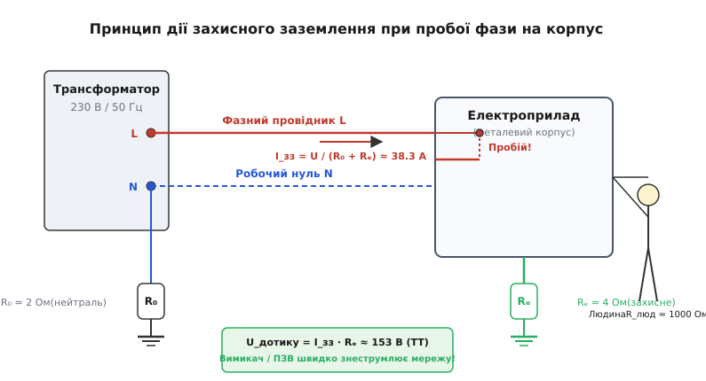
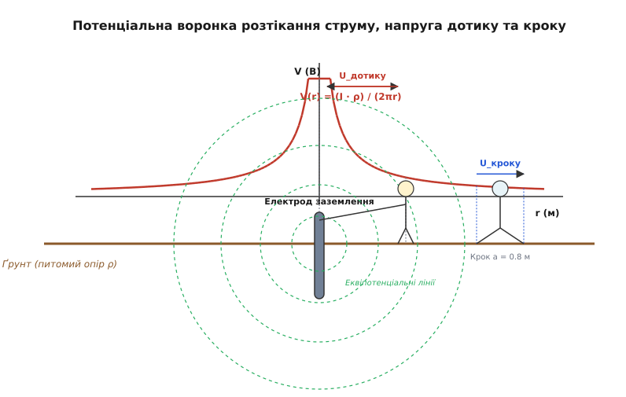
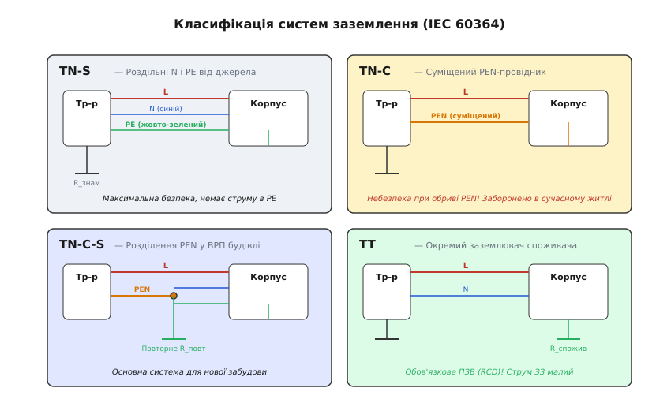
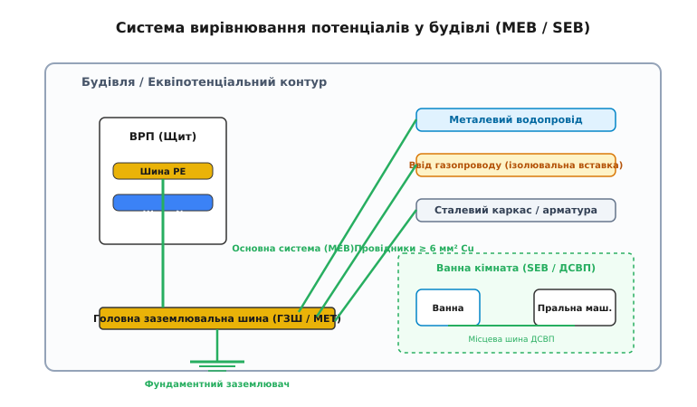

# Захисне заземлення

<preknowlist>
- [Струм і безпека: чому небезпечний саме струм](topic:physics/current-safety) — дія струму на організм, опір тіла людини, поріг фібриляції серця.
- [Електричний потенціал](topic:physics/electric-potential) — розподіл потенціалу в просторі та провідному середовищі.
- [Мережі змінного струму](topic:physics/ac-power-grid) — трифазна система, нейтраль, фазні та лінійні напруги.
- [Закон Ома для замкненого кола](topic:physics/closed-circuit) — розрахунок струмів у колах із розподіленими опорами.
</preknowlist>

Пральна машина у вологій ванній кімнаті або металообробний верстат у заводському цеху підключені до мережі змінного струму напругою 230 В. Унаслідок багаторічної вібрації, термічного старіння або механічного перетирання фазний дріт усередині приладу торкається металевого корпусу. Ізоляція зруйнована, і потенціал корпусу миттєво стрибає від нуля до 230 В відносно землі. Якщо прилад незаземлений, людина, стоячи на вологій плитці й торкаючись металевої оболонки, стає єдиним містком для струму: через її тіло з опором близько 1000 Ом у землю потече струм `I = 230 / 1000 = 230 мА`. Це вдвічі перевищує поріг фібриляції серця й неминуче призводить до загибелі за частки секунди. Захисне заземлення — це примусове створення паралельного електричного кола з малим опором, яке перерозподіляє струм витоку, знижує напругу дотику до безпечного значення та провокує негайне знеструмлення аварійної ділянки захисною автоматикою.

### Фізичний механізм перерозподілу струму та захисного вимкнення

Щоб зрозуміти, як працює захисне заземлення (від прасл. *zemľa* — земля, ґрунт), розглянемо електротехнічну схему замикання фази на корпус. Коли металевий корпус електроприладу з'єднано з Землею за допомогою спеціального захисного провідника `PE` (від англ. *Protective Earth*) та заземлювального електрода з опором `R_e`, виникає розгалужене електричне коло з двома паралельними гілками стікання струму:

1. Перша гілка — захисний заземлювач із малим опором `R_e` (зазвичай від 2 до 4 Ом).
2. Друга гілка — тіло людини з опором `R_люд` (близько 1000 Ом за помірної вологості).


*Принцип розподілу струмів при пробої фази на корпус заземленого приладу. Паралельне з'єднання малого опору заземлення R_e та великого опору людини R_люд спрямовує 99.6% струму в заземлювач, зменшуючи струм крізь тіло та створюючи струм короткого замикання для спрацьовування захисного вимикача.*

За правилом дільника струму для паралельних віток, струм ділиться обернено пропорційно опорам цих віток. Якщо людина торкається корпусу заземленого приладу, струм крізь її тіло `I_люд` визначається співвідношенням:

```
I_люд = I_заг · (R_e / (R_e + R_люд))
```

При `R_e = 4 Ом` та `R_люд = 1000 Ом` частка струму, що проходить крізь людину, становить лише `4 / (4 + 1000) = 4 / 1004 ≈ 0.00398` (тобто менше ніж 0.4% від загального аварійного струму). Понад 99.6% струму спрямовується безпосередньо в заземлювальний провідник.

Аналіз електричного опору людського тіла за стандартом IEC 60479-1 показує, що комплексний імпеданс тіла `Z_люд(ω)` складається з двох елементів: внутрішнього опору тканин (органів, м'язів, крові) `R_внутр ≈ 500 Ом`, який є чистим активним опором, та опору рогового шару шкіри, який моделюється паралельною паразитною ємністю `C_шкіри ≈ 10...50 нФ` і опором `R_шкіри ≈ 10...100 кОм`. На промисловій частоті 50 Гц ємнісний опір шкіри `X_C = 1 / (2·π·f·C)` становить десятки кілоом, та при підвищенні напруги понад 50 В відбувається електричний мікропробій рогового шару. Опір шкіри різко падає, і визначальним стає внутрішній опір `R_внутр ≈ 500...1000 Ом`. Саме тому за високої напруги опір людини не становить сотні кілоом, як у сухому стані при напрузі 12 В, а опускається до монолітного порога 1000 Ом.

Крім того, за дослідженнями Готліба Бігельмайєра (Gottfried Biegelmeier), ймовірність фібриляції серця залежить від накопиченої електричної енергії за час проходження струму `t`. Поріг фібриляції визначається інтегралом Джоуля `I² · t`. Звідси випливає фундаментальна вимога: при короткому замиканні недостатньо просто зменшити струм, необхідно **мінімізувати час впливу `t`**.

Захисне заземлення виконує цю другу, ще важливішу фізичну функцію: воно перетворює невизначений витік струму на **однофазне коротке замикання** з високою величиною струму `I_зз`. Оскільки опір кола «фаза — корпус — PE-провідник — заземлювач — нейтраль джерела» є малим, струм замикання злітає до десятків або сотень амперів. Цей потужний струмовий імпульс змушує спрацювати автоматичний вимикач (автомат) або плавкий запобіжник у розподільчому щитку, який повністю відключає фазну напругу за нормований час, що не перевищує `0.4 секунди`.

> 📜 Про те, як інженерна думка пройшла шлях від перших телеграфних заземлень XIX століття до створення сучасних п'ятипровідних мереж із пристроями диференційного захисту, читайте в вставці [Історія та еволюція захисного заземлення](topic:physics/protective-grounding/hist-grounding-evolution.md).

---

### Фізика Землі як провідного середовища та півсферичний заземлювач

Чому масив ґрунту, який складається з піску, глини та мінералів із високим питомим опором `ρ ≈ 10...500 Ом·м` (що в мільярди разів гірше за мідь), здатний забезпечити опір заземлювального пристрою в одиниці ом? Відповідь криється в геометрії тривимірного розтікання струму в суцільному провідному півпросторі.

Уявімо ідеалізований заземлювач у формі металевої півсфери радіуса `r_0`, вкопаної врівень із поверхнею землі. Коли аварійний струм `I` подається на цей електрод, він розтікається в ґрунт в усі боки однаково. Струм проходить крізь концентричні півсферичні шари ґрунту зростаючого радіуса `r`.

Густина струму `j(r)` на відстані `r` від центра електрода дорівнює струму `I`, поділеному на площу півсфери `S(r) = 2·π·r²`:

```
j(r) = I / (2·π·r²)     [густина струму на радіусі r]
```

Оскільки площа півсфери `S(r)` зростає пропорційно квадрату радіуса `r²`, густина струму з віддаленням від електрода катастрофічно падає. За диференціальною формою закону Ома, напруженість електричного поля `E(r)` у ґрунті дорівнює:

```
E(r) = ρ · j(r)
     = (I · ρ) / (2·π·r²)     [напруженість електричного поля]
```

Щоб знайти повний електричний опір ґрунту `R_g`, інтегруємо опір елементарних півсферичних шарів товщиною `dr` від поверхні електрода `r = r_0` до нескінченності `r → ∞`:

```
R_g = ∫[r_0 до ∞] (ρ / (2·π·r²)) dr
    = (ρ / (2·π)) · [-1 / r][від r_0 до ∞]
    = ρ / (2·π·r_0)     [опір півсферичного заземлювача]
```

Ця формула розкриває головний фізичний секрет заземлення: **основний опір заземлювального пристрою зосереджений у безпосередній близькості від електрода**.

```
Відстань від електрода r:    r_0     2·r_0    5·r_0    10·r_0    100·r_0
Частка загального опору %:    0%      50%      80%      90%       99%
```

На відстані вже `10·r_0` (для півсфери радіусом 20 см це лише 2 метри) струм розподіляється по настільки велетенському перерізу ґрунту, що опір решти нескінченного масиву Землі становить менше 10% від загального. Тому Земля виступає еквіпотенціальним резервуаром із нульовим потенціалом не тому, що вона є суперпровідником, а завдяки її нескінченній тривимірній місткості.

У реальних умовах ґрунт рідко буває однорідним по глибині. Зазвичай аналізують двошарову модель ґрунту: верхній шар товщиною `h` із питомим опором `ρ_1` (який піддається промерзанню взимку та висиханню влітку) та нижній шар із питомим опором `ρ_2`. Фізичну поведінку розтікання струму у двошаровому ґрунті описують за допомогою **коефіцієнта неоднорідності (відображення)** `K`:

```
K = (ρ_2 - ρ_1) / (ρ_2 + ρ_1)
```

Якщо нижній шар є більш провідним (`ρ_2 < ρ_1`, наприклад, глина під шаром піску), коефіцієнт `K < 0`, і лінії струму «заломлюються», прагнучи зануритися глибше в глинистий шар. У цьому разі застосування довгих вертикальних заземлювачів (довжиною 6–15 м), що пробивають верхній сухий шар піску, дає змогу знизити опір заземлення в 5–10 разів порівняно з горизонтальними смугами. Якщо ж навпаки, нижній шар є скельним (`ρ_2 >> ρ_1`), струм екранується нижньою межею, і вертикальні стрижні стають неефективними — тоді контур будують із розгалуженої горизонтальної сітки.

> 🧮 Детальний математичний вивід рівняння Лапласа `∇²V = 0`, розрахунок вертикальних стрижнів за методом Двайта та алгоритми обчислення групових заземлювачів з урахуванням екранування наведено у вставці [Математична теорія розтікання струму та опору заземлення](topic:physics/protective-grounding/math-ground-resistance.md).

---

### Потенціальна воронка: напруга дотику та напруга кроку

Стікання аварійного струму через заземлювач у ґрунт змінює електричний потенціал поверхні землі довкола нього. Графік розподілу потенціалу `V(r)` на поверхні ґрунту утворює так звану **потенціальну воронку розтікання** (або потенціальне криваве плато).

Потенціал точки на поверхні землі на відстані `r` від заземлювача обчислюється як:

```
V(r) = (I · ρ) / (2·π·r)
```

Безпосередньо на металевому електроді потенціал досягає максимуму `V_0 = V(r_0)`. У міру віддалення від електрода потенціал спадає за гіперболічним законом `1/r` і на відстані понад 20 метрів стає практично рівним нулю. Розподіл потенціалів створює дві специфічні загрози для людини: **напругу дотику** та **напругу кроку**.


*Потенціальна воронка розтікання струму у ґрунті. Крива V(r) показує спад потенціалу поверхні землі від максимального значення V_0 на заземлювачі до нуля на відстані понад 20 м. Показано механізм виникнення напруги дотику U_дотику та напруги кроку U_кроку.*

#### 1. Напруга дотику (Touch Voltage, U_t)
Напруга дотику — це різниця потенціалів між металевим корпусом обладнання, що опинився під аварійним потенціалом `V_0`, та точкою поверхні землі, на якій стоять ноги людини `V(x)`:

```
U_t = V_0 - V(x)
    = V_0 · (1 - r_0 / x)
```

Якщо людина стоїть близько до заземлювача (`x → r_0`), потенціал її ніг майже дорівнює потенціалу рук, і напруга дотику `U_t` є мінімальною. Якщо ж людина стоїть на відстані `x ≥ 20 м` (де потенціал землі `V(x) ≈ 0`) і торкається довгого провідника, підключеного до аварійного заземлювача, вона потрапляє під **повну напругу заземлювального пристрою** `U_t = V_0`.

Щоб вирівняти потенціальну воронку на відкритих розподільчих пристроях (ОРУ) підстанцій над високою напругою (110 кВ і вище), розгортають складні **заземлювальні сітки** (англ. *grounding grid*). Вузли сітки прокладаються з кроком 2–5 метрів під усією територією підстанції. Завдяки цьому потенціал поверхні землі всередині осередку сітки майже дорівнює потенціалу металевих конструкцій, усуваючи круті перепади потенціалу і зводячи напругу дотику та кроку до безпечних десятків вольтів навіть при стіканні струмів короткого замикання в десятки кілоамперів.

#### 2. Напруга кроку (Step Voltage, U_s)
Напруга кроку виникає тоді, коли людина іде по землі в зоні розтікання аварійного струму. Оскільки її ноги торкаються двох точок землі з різними радіусами `x` та `x + a` (де `a ≈ 0.8 м` — довжина кроку), між ногами виникає різниця потенціалів:

```
U_s = V(x) - V(x + a)
    = ((I · ρ) / (2·π)) · (a / (x · (x + a)))
```

Напруга кроку є найнебезпечнішою безпосередньо біля місця падіння дроту високої напруги на землю або біля заземлювача. Хоча струм іде за шляхом «нога — нога» (не зачіпаючи безпосередньо серце), викликане струмом судомне скорочення м'язів ніг призводить до падіння людини на землю. У момент падіння відстань між точками контакту зростає від 0.8 м до росту людини (1.7–1.8 м), а шлях струму змінюється на смертельний — «руки — ноги».

> 🔧 **Правило виходу з зони замикання:** При виявленні обірваного дроту високої напруги, що лежить на землі, заборонено бігти або робити широкі кроки. Виходити із зони розтікання (радіусом не менше 8–10 метрів) слід «гусячим кроком» — пересуваючи ноги по землі так, щоб п'ята однієї ноги постійно торкалася носка іншої, мінімізуючи відстань `a → 0`.

---

### Класифікація систем заземлення (IEC 60364)

Залежно від способу заземлення нейтралі джерела живлення (трансформатора) та методів з'єднання відкритих провідних частин споживачів, міжнародний стандарт IEC 60364 та Правила улаштування електроустановок (ПУЕ) поділяють мережі на п'ять основних систем: **TN-S**, **TN-C**, **TN-C-S**, **TT** та **IT**.

Буквене маркування розшифровується так:
- **Перша літера** — стан нейтралі джерела живлення відносно землі: `T` (лат. *Terra* — земля) — глухозаземлена нейтраль; `I` (лат. *Isolatus* — ізольований) — ізольована нейтраль.
- **Друга літера** — стан відкритих провідних частин (корпусів) споживача: `T` — корпуси заземлені на місцевий заземлювач; `N` (лат. *Neutralis* — нейтральний) — корпуси з'єднані з заземленою нейтраллю джерела.
- **Наступні літери** — конфігурація захисного (PE) та робочого нульового (N) провідників: `S` (англ. *Separated*) — провідники N та PE розділені; `C` (англ. *Combined*) — функції N та PE суміщені в одному провіднику PEN.


*Конфігурація провідників та шляхи струмів замикання у чотирьох основних системах заземлення: TN-S, TN-C, TN-C-S та TT. Показано підключення трансформатора, розподіл N, PE та PEN провідників і прив'язку до корпусів обладнання.*

#### 1. Система TN-S (найбезпечніша п'ятипровідна)
У системі TN-S нейтраль трансформатора глухо заземлена, а захисний провідник `PE` та робочий нуль `N` розділені на всьому шляху — від підстанції до останньої розетки.
- **Переваги:** У провіднику PE у нормальному режимі струм відсутній. Обрив робочого нуля N не виносить потенціал на корпуси приладів. Відсутні високочастотні завади.
- **Недоліки:** Найвища вартість будівництва через необхідність прокладання п'ятижильних кабелів замість чотирижильних.

#### 2. Система TN-C (застаріла та небезпечна)
У системі TN-C захисний та робочий нуль суміщені в єдиному провіднику `PEN` на всій протяжності мережі. Корпуси приладів з'єднуються з провідником PEN (занулення).
- **Головна смертельна загроза:** При відгоранні або обриві провідника PEN на магістралі робочий струм усіх увімкнених однофазних приладів (чайників, холодильників) через їхній внутрішній опір виносить **повну фазну напругу 230 В** на металеві корпуси всього зануленого обладнання в будівлі.
- **Статус:** Використання системи TN-C у новому будівництві та при реконструкції житлових споруд суворо заборонено!

#### 3. Система TN-C-S (сучасний компромісний стандарт)
У цій системі від підстанції до вхідно-розподільчого пристрою (ВРП) будівлі тягнеться суміщений провідник `PEN`. У ВРП будівлі провідник PEN повторно заземлюється через місцевий контур заземлення та розділяється на два окремих провідники: захисний `PE` та робочий `N`.
- **Правило розділення:** Після точки розділення у ВРП об'єднувати провідники PE та N далі за схемою **категорично заборонено**.

#### 4. Система TT (окремий заземлювач споживача)
У системі TT нейтраль джерела глухо заземлена, але корпуси приладів споживача з'єднані з **власним автономним заземлювачем** `R_e`, який не має металевого зв'язку з нейтраллю трансформатора.
- **Особливість фізики замикання:** При пробої фази на корпус струм аварійного замикання іде через землю: `I_зз = U_0 / (R_0 + R_e)`. При `R_e = 15 Ом` та `R_0 = 2 Ом` струм замикання становить лише `I_зз = 230 / 17 ≈ 13.5 А`.
- **Наслідок:** Звичайний автомат C16 при струмі 13.5 А **не вимкнеться ніколи**! Тому в системі TT застосування пристрою захисного відключення (ПЗВ) є **абсолютно обов'язковим**.

#### 5. Система IT (ізольована нейтраль)
Нейтраль джерела повністю ізольована від землі або заземлена через високий імпеданс (понад 1000 Ом). Корпуси заземлені на місцевий заземлювач.
- **Фізична перевага:** Перше однофазне замикання на корпус не створює великого струму (стікає лише мізерний ємнісний струм витоку) і не призводить до знеструмлення мережі. Це критично важливо для операційних блоків лікарень та вугільних шахт.

Розглядаючи розподільчі мережі середньої напруги (6–35 кВ), застосовують специфічний різновид заземлення нейтралі — **компенсовану нейтраль** (з дугогасильним реактором Петерсена, англ. *Petersen coil*). Реактор з індуктивністю `L_p` підключається між нейтраллю трансформатора та землею. При однофазному замиканні фази на землю індуктивний струм реактора `I_L = U_0 / (ω·L_p)` компенсує ємнісний струм витоку кабельної мережі `I_C = 3·U_0·ω·C_0`. Завдяки повній компенсації струм у місці пробою падає майже до нуля, електрична дуга в місці пошкодження самогасне, і мережа продовжує працювати без аварійного вимкнення споживачів.

> 📋 Детальні довідникові таблиці порівняння систем, кольори маркування провідників згідно з IEC 60446 та норми часу автоматичного вимкнення дивіться у вставці [Довідник систем заземлення, норм та методик вимірювання](topic:physics/protective-grounding/api-grounding-standards.md).

---

### Механіка короткого замикання та петля «фаза-нуль»

У системах заземлення типу TN головним механізмом забезпечення безпеки є **автоматичне вимкнення живлення** (англ. *Automatic Disconnection of Supply, ADS*). Щоб автомат у розподільчому щитку вимкнувся за частки секунди, аварійний струм повинен перевищити струм спрацювання його електромагнітного розчіплювача.

Для цього розраховують або вимірюють опір **петлі «фаза-нуль»** (позначується як `Z_s` або `R_петлі`).

```
[Трансформатор] === L ===> [Фазовий дріт] ===> [Пробій на корпус]
      ||                                              ||
[Заземлення R0] <=== PE <=== [Захисний дріт] <========╝
```

Повний імпеданс петлі замикання `Z_s` складається з послідовного ланцюга опорів:

```
Z_s = R_трафо + R_фаз_пров + R_PE_пров + X_петлі
```

де `R_трафо` — опір обмотки фази трансформатора, `R_фаз_пров` — активний опір фазного провідника від щита до точки пробою, `R_PE_пров` — активний опір захисного провідника PE, `X_петлі` — індуктивний опір петлі.

Важливим фактором, який часто опускають у спрощених розрахунках, є температурне зростання опору провідників при аварійному нагріванні. При короткому замиканні струм у сотні амперів розігріває мідну жилу від робочої температури `20 °C` до граничної температури ізоляції `70...160 °C`. Згідно з температурним коефіцієнтом міді `α = 0.00393 1/°C`, опір провідника `R_θ` зростає за формулою:

```
R_θ = R_20 · [1 + α · (θ - 20)]
```

При нагріванні жил до 80 °C опір петлі зростає на 23.5%, що знижує реальний струм короткого замикання `I_зз`. Тому інженери вводять коефіцієнт запасу 1.2–1.5 при перевірці вимикачів. Крім того, опір обмотки трансформатора `R_трафо` залежить від схеми з'єднання його обмоток: для трансформаторів типу «зірка — зигзаг» (Zy) або «трикутник — зірка» (Dy11) опір нулевої послідовності `Z_0` у 3–5 разів менший, ніж у застарілих трансформаторів «зірка — зірка з нулем» (Yyn0). Це забезпечує значно вищі струми короткого замикання й надійне спрацьовування автоматів.

Струм однофазного короткого замикання `I_зз` визначається за законом Ома:

```
I_зз = U_0 / Z_s
```

**Приклад перевірки безпеки:** Автоматичний вимикач має номінальний струм `I_n = 16 А` та характеристику відключення типу `C`. Електромагнітний розчіплювач типу `C` миттєво спрацьовує при струмі `I_ia = 10 · I_n = 160 А`.

Якщо виміряний опір петлі «фаза-нуль» у найвіддаленішій розетці становить `Z_s = 0.8 Ом`:

```
I_зз = 230 В / 0.8 Ом = 287.5 А
```

Оскільки `I_зз = 287.5 А > 160 А`, автомат миттєво (за час близько 0.02 секунди) знеструмить лінію. Умова безпеки виконана. Якщо ж лінія занадто довга або переріз дротів малий (наприклад, `Z_s = 2.0 Ом`), струм замикання становитиме лише `I_зз = 230 / 2.0 = 115 А`. Автомат типу C16 не спрацює миттєво, а вимикатиметься тепловою пластиною протягом десятків секунд. Увесь цей час корпус приладу перебуватиме під небезпечною напругою!

> ⚙️ Практичну програму симуляції струмів короткого замикання, розрахунку напруги дотику та перевірки умов спрацьовування захисних автоматів мовами C та C++ наведено у вставці [Симуляція струмів однофазного замикання та напруги дотику](topic:physics/protective-grounding/proj-ground-fault-sim.md).

---

### Система вирівнювання потенціалів: чому відсутність різниці потенціалів рятує життя

Більшість людей вважає, що ураження струмом відбувається через сам факт контакту з точкою під високим потенціалом. Фізика електрики стверджує протилежне: **струм виникає лише за наявності різниці потенціалів (напруги)** між двома точками, яких людина торкається одночасно.

Пташка, що сидить на голій фазній лінії напругою 110 000 В, не зазнає ураження, тому що обидві її лапки перебувають на одному й тому самому потенціалі 110 кВ. Різниця потенціалів між лапками дорівнює нулю, отже, струм крізь пташку не тече.

На цьому фундаментальному принципі базується побудова **системи вирівнювання потенціалів** (англ. *Equipotential Bonding*) у сучасних будівлях.


*Структурна схема основної (MEB) та додаткової (SEB) систем вирівнювання потенціалів у будівлі. З'єднання металевих труб, каркаса будівлі та заземлювальної шини ГЗШ утворює єдине еквіпотенціальне середовище.*

Система вирівнювання потенціалів поділяється на два рівні:

1. **Основна система вирівнювання потенціалів (MEB / ОСП):**
   На вводі в будівлю встановлюється Головна заземлювальна шина (ГЗШ або MET). До неї за допомогою товстих мідних провідників (перерізом не менше 6 мм²) примусово приєднуються всі сторонні провідні частини будівлі:
   - Металеві труби водопроводу, каналізації та опалення.
   - Металеві вводи газопроводу (після ізолювальної фланцевої вставки).
   - Сталевий каркас будівлі, арматура фундаменту та металеві вентиляційні короби.
   - Захисний провідник `PE` від вхідного електрощита.

2. **Додаткова система вирівнювання потенціалів (SEB / ДСВП):**
   У приміщеннях з підвищеною небезпекою (ванні кімнати, душові, басейни) створюється місцева шина ДСВП. До неї з'єднуються всі металеві предмети, яких людина може торкнутися одночасно: металева ванна, змішувач, труби холодної та гарячої води, сушарка для рушників, відкриті металеві корпуси пральної машини та бойлера, а також захисні PE-контакти розеток.

Ефективним елементом сучасного будівництва є **фундаментний заземлювач** (нім. *Fundamenterder*). Сталеві смуги або кругляк укладаються безпосередньо в бетонну подушку фундаменту будівлі по всьому периметру. Оскільки бетон володіє постійною вологістю та питомим опором `ρ_бетону ≈ 50...90 Ом·м`, а площа контакту фундаменту з землею становить сотні квадратних метрів, фундаментний заземлювач забезпечує стабільний опір `R_фунд ≈ 0.5...1 Ом` незалежно від пори року й сезонного промерзання ґрунту.

**Фізичний результат:** Якщо внаслідок аварії на водопровідній трубі або на корпусі пральної машини з'явиться аварійний потенціал 150 В, завдяки системі вирівнювання потенціалів цей самий потенціал 150 В миттєво виникне на змішувачі, підлозі, ванні та трубах. Коли людина, стоячи у ванні, торкнеться пральної машини, різниця потенціалів між її руками й ногами дорівнюватиме:

```
U = V_руки - V_ніг = 150 В - 150 В = 0 В
```

Струм крізь тіло не потече взагалі. Людину захищає не ізоляція, а створення суцільного еквіпотенціального середовища (за аналогією з кліткою Фарадея).

---

### Конструкція заземлювачів, матеріали та частотні особливості

Заземлювальний пристрій складається з заземлювача (металевих провідників, що перебувають у безпосередньому контакті з ґрунтом) та заземлювальних провідників (що з'єднують заземлювач із шиною ГЗШ).

Заземлювачі поділяють на два класи:
- **Природні заземлювачі:** Залізобетонні фундаменти будівель (природне фундаментне заземлення), сталеві обсадні труби свердловин, підземні сталеві трубопроводи (за винятком газопроводів та магістралей горючих рідин).
- **Штучні заземлювачі:** Спеціально прокладені сталеві або мідні електроди. Найпоширенішою є конфігурація з декількох вертикальних стрижнів (довжиною 3–6 м), об'єднаних горизонтальною сталевою смугою у спільний замкнений контур.

```
   Сталева смуга 40x4 мм (горизонтальний заземлювач)
  ===================================================
     |                    |                    |
     | Стрижень 3м        | Стрижень 3м        | Стрижень 3м
     |                    |                    |
```

#### Матеріали та корозійна стійкість
Оскільки ґрунт є вологим електролітом, заземлювачі піддаються інтенсивній електрохімічній корозії.
- **Чорна сталь:** Мінімальний переріз кутника або смуги має бути не менше 100 мм² (товщина стінки не менше 4 мм), оскільки середня швидкість корозії сталі в ґрунті становить 0.1–0.2 мм на рік. Термін служби — 10–15 років.
- **Оцинкована сталь:** Шар цинку товщиною не менше 70 мкм уповільнює корозію. Термін служби — 20–25 років.
- **Міднена сталь (Copper-bonded steel):** Сталевий сердечник із високочистим електролітичним мідним покриттям товщиною 250 мкм. Поєднує механічну міцність сталі (можна забивати перфоратором на глибину до 15 м) та корозійну стійкість міді. Термін служби — понад 40–50 років.

#### Імпульсний опір заземлення при розряді блискавки
Розглядаючи опір заземлення, слід розрізняти **низькочастотний опір** (на частоті 50 Гц) та **імпульсний опір** (при грозових розрядах).

Струм блискавки являє собою надшвидкий імпульс із тривалістю фронту від 1 до 10 мікросекунд та амплітудою від 20 000 до 100 000 амперів. Для таких високочастотних складових спектра довгий протяжний заземлювач виявляє значний **індуктивний опір** `X_L = ω · L`.

Індуктивність довгої сталевої смуги становить близько `1.5...2.0 мкГн/м`. При швидкості наростання струму `dI/dt = 10¹⁰ А/с` спад напруги на індуктивності провідника довжиною 20 метрів обчислюється як:

```
U_L = L_індуктивна · (dI / dt)     [закон індукції: напруга самоіндукції на провіднику]
    = (35 · 10⁻⁶ Гн) · (10¹⁰ А/с)  [підстановка індуктивності смуги 20 м та швидкості струму]
    = 350 000 В = 350 кВ           [обчислений імпульсний спад напруги на індуктивності]
```

Через це віддалені ділянки довгого контуру заземлення під час удару блискавки просто «не встигають» вступити у роботу: хвиля напруги відбивається, і локальний потенціал у точці вводу блискавковідводу злітає до сотень кіловольт. При обчисленні імпульсного опору `Z_імп` вводять імпульсний коефіцієнт `α_імп`:

```
Z_імп = α_імп · R_g
```

Для протяжних заземлювачів `α_імп > 1.0` через індуктивний опір, але при дуже великих струмах блискавки у ґрунті безпосередньо біля електрода виникає іскрове перекриття та мікропробій порового простору ґрунту (явище іскроутворення), що локально збільшує еквівалентний радіус електрода і знижує опір. Тому для блискавкозахисту використовують не довгі поодинокі провідники, а зосереджені променеві заземлювачі (широкі лапи) або замкнені контури з короткими зв'язками.

При влаштуванні ПЗИП (пристроїв захисту від імпульсних перенапруг, англ. *Surge Protective Devices, SPD*) довжина зв'язувального PE-провідника від ПЗИП до шини заземлення повинна бути менше 0.5 метра. Якщо провідник довший, падіння напруги `L · (dI/dt)` на його індуктивності додається до залишкової напруги варистора і пробиває захищувану електроніку.

---

### Підсумковий синтез: багаторівнева система захисту

Захисне заземлення — це не просто металевий стрижень, забитий у землю біля будинку, а цілісна фізико-інженерна система, що об'єднує декілька послідовних ешелонів захисту:

1. **Перший ешелон (фізичне обмеження струму):** Малий опір заземлення `R_e` та система вирівнювання потенціалів (MEB/SEB) знижують напругу дотику `U_t` на корпусах обладнання до безпечного значення і утримують її на час аварії.
2. **Другий ешелон (активне знеструмлення через коротке замикання):** Малий опір петлі «фаза-нуль» `Z_s` забезпечує виникнення великого струму короткого замикання `I_зз`, який вимикає автоматичний вимикач за час `< 0.4 секунди`.
3. **Третій ешелон (високочутливий дифзахист):** Пристрій захисного відключення (ПЗВ) реагує на мікроскопічний витік струму (від 10 до 30 мА) у провідник PE чи крізь тіло людини та вимикає мережу за час `< 0.04 секунди`, гарантовано запобігаючи зупинці серця.

Лише спільна робота всіх трьох елементів — якісно змонтованого контуру заземлення, правильно обчисленого автоматичного вимикача та диференційного реле — перетворює потенційно смертоносну енергію електричної мережі на безпечного й надійного помічника людини.
