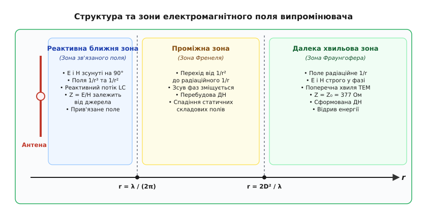
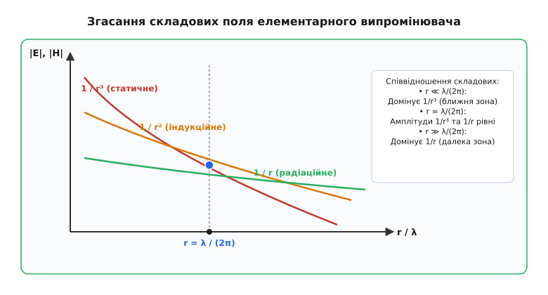
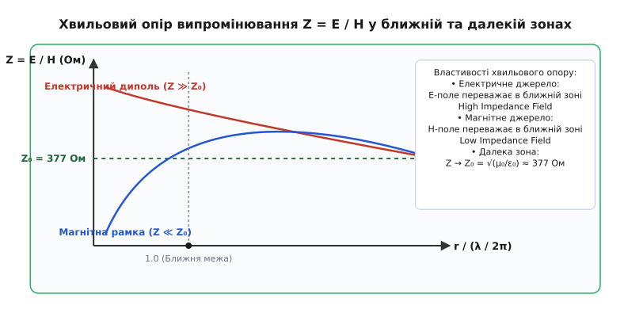
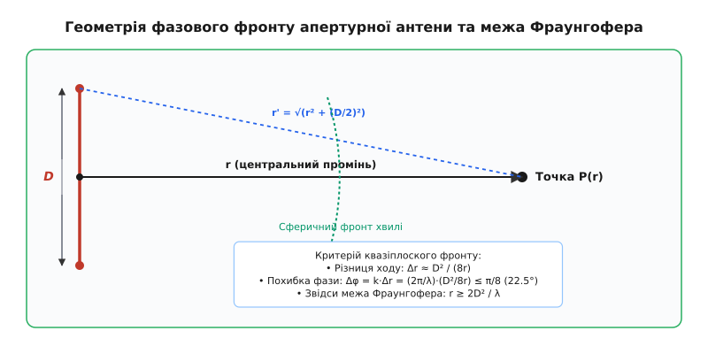

# Ближня і далека зони випромінювання

<preknowlist>
- [Рівняння Максвелла](book:physics/maxwell-equations) — базові рівняння зв'язку полів та струмів у просторі.
- [Вектор Пойнтінга](book:physics/poynting-vector) — вектор густини потоку електромагнітної енергії.
- [Електричний диполь і його поле](book:physics/dipole-field) — структура квазістатичного поля системи двох протилежних зарядів.
- [Електромагнітний спектр](book:physics/em-spectrum) — зв'язок між частотою, довжиною хвилі та швидкістю світла.
</preknowlist>

Коли інженер підносить руку до випромінювальної антени короткохвильового передавача на відстань кількох сантиметрів, вихідний каскад підсилювача потужності миттєво змінює режим роботи: зростає споживання струму від джерела живлення, збивається настройка резонансного контуру, а генератор відчуває додаткове реактивне навантаження. Проте якщо ця сама людина стане на відстані п'ятдесяти метрів від тієї ж антени, вона може перехоплювати чи блокувати частину випроміненого сигналу, але сам передавач не відчує жодної зміни у своєму внутрішньому резонансному колі.

Цей простий експеримент демонструє фундаментальний фізичний поділ електромагнітного поля довкола будь-якого випромінювального джерела на дві якісно різні області: **ближню зону** (де енергія локалізована в просторі й реактивно пов'язана із випромінювачем, як у звичайному відкритому резонаторі) та **далеку зону** (де енергія остаточно відривається від джерела й поширюється у вигляді автономної електромагнітної хвилі). Між ними лежить **проміжна зона**, у якій відбувається формування хвильового фронту та перебудова напрямленості випромінювання.


*Загальна структура трьох зон електромагнітного поля випромінювального джерела, їхні фазові співвідношення та характер хвильового опору.*

---

## 1. Анатомія поля випромінювального джерела: від трьох доданків до двох фізичних світів

Щоб зрозуміти, чому простір навколо антени розпадається на окремі фізичні зони, необхідно розглянути структуру полів, які створюються змінним струмом та змінними електричними зарядами. У класичній електродинаміці Максвелла зв'язок між джерелами (зарядами й струмами) та створюваними ними полями описується системою диференціальних рівнянь у часовій та просторовій областях:

```
rot H = J + ε₀ · (∂E / ∂t)                                            [закон Максвелла-Ампера зі струмом зміщення]
rot E = - μ₀ · (∂H / ∂t)                                           [закон електромагнітної індукції Фарадея]
```

Змінний струм у провіднику антени викликає появу вихрового магнітного поля, яке в свою чергу створює вихрове електричне поле через струм зміщення `J_d = ε₀ (∂E/∂t)`. Поширюючись у просторі зі скінченною швидкістю світла `c`, ці вихрові поля взаємно підтримують одне одне. Розв'язок хвильового рівняння для векторного потенціалу `A(r, t)` через запізнені потенціали має вигляд об'ємного інтеграла по об'єму випромінювача:

```
A(r, t) = (μ₀ / (4π)) · ∫ [ J(r', t - |r - r'|/c) / |r - r'| ] dV'      [об'ємний інтеграл запізнілого потенціалу]
```

Для точкового або короткого гармонічного електричного диполя довжиною `L` з амплітудою струму `I₀` та коловою частотою `ω` розклад виразу для потенціалів за степенями відстані `1/r` показує, що напруженість електричного `E` та магнітного `H` полів у довільній точці простору на відстані `r` складається з трьох фундаментальних доданків із різною просторовою залежністю від відстані.

### Фізичне походження складових поля

У сферичній системі координат `(r, θ, φ)` для гармонічного диполя з моментом `p(t) = p₀ · e⁻ⁱʷᵗ` електричне поле містить три доданки, які мають різну швидкість згасання при віддаленні від джерела:

```
E(r, t) = E_статичне + E_індукційне + E_радіаційне
        ~ A / r³ + B / r² + C / r
```

Кожен із цих трьох доданків має власне фізичне походження й описує окремий механізм електромагнітної взаємодії:

1. **Статичний (кулонівський) член (`1/r³`):** Виникає безпосередньо через розділення позитивних та негативних електричних зарядів `q(t)` на кінцях випромінювача. Це квазістатичне поле, тотожне полю звичайного статичного диполя. Воно повністю визначається миттєвим значенням заряду `q(t)` і локалізоване біля джерела. Збільшення відстані `r` у два рази зменшує амплітуду статичного поля у 8 разів (`2³ = 8`).
2. **Індукційний член Біо–Савара (`1/r²`):** Викликаний рухом зарядів — тобто змінним електричним струмом `I(t) = dq/dt`, що протікає крізь провідник випромінювача. Відповідно до закону Біо–Савара–Лапласа та закону електромагнітної індукції Фарадея, цей доданок описує локальне магнітне поле струму та викликане ним електричне поле вихрової індукції. Збільшення відстані у два рази зменшує індукційне поле у 4 рази (`2² = 4`).
3. **Радіаційний член Максвелла (`1/r`):** Виникає внаслідок скінченної швидкості поширення електромагнітної взаємодії (швидкості світла `c`). Внаслідок ефекту запізнювання потенціалів (`t' = t - r/c`), друга похідна від моменту за часом `d²p/dt²` (тобто прискорений рух зарядів чи похідна від струму `dI/dt`) генерує електромагнітну хвилю, у якій електричне й магнічне поля взаємно підтримують одне одного через струм зміщення Максвелла. Збільшення відстані у два рази зменшує радіаційне поле лише у 2 рази.


*Залежність амплітуди статичного (1/r³), індукційного (1/r²) та радіаційного (1/r) полів від нормалізованої відстані r/λ. Точка перетину відповідає межі ближньої зони.*

### Математична межа співвідношення полів

Через різну швидкість згасання доданків зі збільшенням відстані `r` у просторі неминуче виникає точна математична межа, де радіаційний член зрівнюється за амплітудою з кулонівським та індукційним. Для точкового або електрично малого випромінювача (розмір якого `D` значно менший за довжину хвилі `λ`, тобто `D ≪ λ`) ця межа визначається рівністю амплітуд статичного (`1/r³`) та радіаційного (`k²/r`) доданків.

Вираз для амплітуд електричного поля диполя дає пропорційність:

```
|E_статичне| ~ p₀ / (4π ε₀ r³)
|E_радіаційне| ~ (p₀ k²) / (4π ε₀ r)
```

Рівність амплітуд `1/r³ = (k² / r)` (де `k = 2π / λ` — хвильове число у середовищі) виконується на фундаментальній відстані:

```
r_межа = 1 / k = λ / (2π) ≈ 0.159 · λ
```

Цю відстань `r = λ / (2π)` називають **радіанною довжиною хвилі** або **границею реактивного поля**. На цій відстані радіальне електричне поле `E_r` зрівнюється за модулем із поперечним випроміненим полем `E_θ`.

Детальний історичний процес виявлення цієї межі під час знаменитих дослідів 1887–1888 років описано в історичній вставці [Досліди Генріха Герца](book:physics/radiation-zones/hist-hertz-zones.md).

---

## 2. Реактивна ближня зона: квазістатичні поля та просторовий коливальний контур

Область простору, розташована у безпосередній близькості до джерела (`r ≪ λ / (2π)`), називається **реактивною ближньою зоною** (або зоною зв'язаного поля). 

Головна фізична особливість реактивної зони полягає у фазовому зсуві між векторами напруженості електричного `E` та магнітного `H` полів. Строгий математичний розрахунок полів (див. детальне виведення у математичній вставці [Математичне виведення полів диполя](book:physics/radiation-zones/math-near-far-fields.md)) показує, що у ближній зоні вектори `E` та `H` зсунуті за фазою на `90°` (`π/2` радіан) відносно один одного в часі.

### Фізика реактивного потоку енергії

Коли два гармонічні поля зсунуті за фазою на `90°`, миттєвий вектор Пойнтінга `S(t) = E(t) × H(t)` коливається з подвоєною частотою джерела, періодично змінюючи свій напрямок: пів періоду енергія тече від антени у зовнішній простір, а наступні пів періоду — повністю повертається із простору назад в антену. 

Якщо виразити миттєве електричне поле як `E(t) = E₀ · cos(ωt)`, а магнітне поле як `H(t) = H₀ · sin(ωt)`, миттєвий вектор Пойнтінга дорівнює:

```
S(t) = E₀ · H₀ · cos(ωt) · sin(ωt) = (1/2) · E₀ · H₀ · sin(2ωt)
```

Звідси видно, що середнє за періодом значення дійсної частини вектора Пойнтінга дорівнює нулю:

```
Re ⟨S_ближня⟩ = (1/T) · ∫₀ᵀ S(t) dt = 0
```

Це означає, що у реактивній ближній зоні **не відбувається незворотного випромінювання енергії у простір**. Натомість простір навколо антени поводиться як ззвичайний відкритий коливальний контур (`LC`-резонатор):
* У момент максимуму напруги на антені енергія накопичується у часовому електричному полі `E` (як у конденсаторі). Густина енергії дорівнює `w_e = (1/2) · ε₀ · |E|²`.
* У момент максимуму струму в антені енергія переходить у магнітне поле `H` (як у котушці індуктивності). Густина енергії дорівнює `w_m = (1/2) · μ₀ · |H|²`.

Повні об'ємні інтеграли накопиченої реактивної енергії у просторі дорівнюють:

```
W_e = (1/4) · ε₀ · ∫ |E|² dV                                          [загальна електрична енергія реактивного поля]
W_m = (1/4) · μ₀ · ∫ |H|² dV                                          [загальна магнітна енергія реактивного поля]
```

Будь-яке тіло з діелектричною або магнітною проникністю, внесене у реактивну ближню зону, змінює еквівалентну ємність чи індуктивність цього «просторового контуру». Саме тому людина або металевий предмет, наближаючись до випромінювача, безпосередньо розстроює генератор.

### Добротність антени, метод колпака Вілера та межа Чу-Харрінгтона

Велика накопичена реактивна енергія у ближній зоні електрично малих антен прямо визначає їхню добротність `Q`. Чим менший фізичний розмір антени `a` порівняно з довжиною хвилі `λ` (`k·a < 1`), тим більша частка енергії залишається локалізованою у ближній зоні, не переходячи у випромінювання.

Фундаментальна межа Чу-Харрінгтона визначає мінімально можливу добротність `Q_min` для будь-якої антени, що вписується у сферу радіуса `a`:

```
Q_min = 1 / (k·a)³ + 1 / (k·a)
```

Для експериментального вимірювання ККД випромінювання малих антен використовують метод **колпака Вілера** (Wheeler Cap Method): антену накривають суцільним металевим провідним колпаком радіусом `r_cap ≈ λ/(2π)`. Колпак замкає реактивну ближню зону, усуваючи радіаційні втрати і залишаючи тільки опір втрат у самому матеріалі антени.

Оскільки смуга частот узгодження антени обернено пропорційна добротності (`BW ~ 1/Q`), спроба зменшити розміри антени при збереженні робочої частоти неминуче призводить до стрімкого звуження смуги пропускання та падіння ККД випромінювання.


*Зміна хвильового опору випромінювання Z = E/H для електричного диполя та магнітної рамки у реактивній зоні з подальшим виходом на асимптоту 377 Ом у далекій зоні.*

### Хвильовий опір у ближній зоні

У далекій зоні відношення `E / H` є константою середовища, проте у ближній зоні значення **хвильового опору випромінювання** `Z = E / H` повністю визначається фізичною природою самого джерела:

1. **Електричний випромінювач (диполь, відкритий штир):** На кінцях антени створюються високі потенціали при відносно малих струмах. У ближній зоні домінує електричне поле `E ~ 1/r³`. Хвильовий опір стає дуже великим: `Z = E / H ≫ Z₀` (досягаючи десятків кілоом). Таке поле називається **високоімпедансним (E-field)**.
2. **Магнітний випромінювач (рамка, виток зі струмом):** У контурі протікають великі струми при малих напругах. Домінує магнітне поле `H ~ 1/r³` або `1/r²`. Хвильовий опір падає до часток ома: `Z = E / H ≪ Z₀`. Таке поле називається **низькоімпедансним (H-field)**.

> 🔧 **Навіщо це в інженерній практиці.**
> Поділ полів на високоімпедансні `E` та низькоімпедансні `H` у ближній зоні є критичним для діагностики електромагнітної сумісності (ЕМС) та розробки екранів. Екранування `E`-поля ближньої зони легко здійснюється тонким шаром міді чи алюмінію за рахунок високого коефіцієнта відбиття. Натомість екранування `H`-поля низького імпедансу вимагає застосування матеріалів із високою магнітною проникністю (пермалой, мю-метал) або товстих високопровідних щитів, де працює вихрове поглинання. Для локального пошуку завад на друкованих платах застосовують спеціалізовані інструменти, детально описані в інженерній вставці [Ближньопольові зонди ЕМС](book:physics/radiation-zones/comp-emc-near-field-probes.md).

Крім того, реактивна ближня зона є робочим середовищем для систем бездротової передачі енергії малої дальності (стандарт `Qi` в смартфонах на частотах `110–205 кГц` та AirFuel на частоті `6.78 МГц`) та систем радіочастотної ідентифікації `NFC` (`13.56 МГц`). Вони працюють за принципом резонансного магнітно-індукційного зв'язку (`k·r ≪ 1`), де передавач не витрачає енергію на випромінювання у простір доти, доки у його реактивну зону не буде внесено приймальну котушку.

---

## 3. Проміжна зона (зона Френеля): становлення хвильового фронту

При збільшенні відстані від джерела у діапазоні від `r ≈ λ / (2π)` до межі далекої зони випромінювання настає інтервал, який називають **проміжною зоною** (або радіаційною ближньою зоною, а для апертурних антен — **зоною Френеля**).

У проміжній зоні амплітуди індукційних доданків (`1/r²`) та радіаційних доданків (`1/r`) стають порівнянними за величиною. Це призводить до складних фізичних трансформацій поля:

1. **Зміна фазового зсуву:** Кут між векторами `E` та `H` поступово зменшується від `90°` (характерних для реактивного поля) до `0°` (характерних для вільної хвилі). З'являється постійна дійсна складова вектора Пойнтінга, тобто енергія починає незворотно випромінюватися в зовнішній простір, але реактивна складова все ще залишається помітною.
2. **Перебудова діаграми напрямленості:** У проміжній зоні кутовий розподіл випромінювання залежить від відстані `r`. Просторова форма пелюсток випромінювання ще не сформована остаточно: максимуми та мінімуми напруженості поля зміщуються при віддаленні від антени. Для параболічних антен у зоні Френеля спостерігаються характерні френелівські осциляції напруженості поля уздовж осі випромінювання.
3. **Вплив геометричних розмірів джерела та зони Френеля для траси:** Якщо антена має значні власні розміри `D`, у проміжній зоні хвилі, випромінені різними ділянками її поверхні (наприклад, краями та центром параболічного дзеркала чи решітки), приходять у точку спостереження з суттєвою різницею фаз. На трасах наземного радіозв'язку для відсутності згасання сигналу вимагається збереження чистоти першої зони Френеля (Clearance Ratio ≥ 60%).

Математично поле у зоні Френеля описується наближеним інтегралом дифракції Френеля, де квадратична фазова похибка враховує кривину хвильового фронту:

```
E(x, y, z) = (eⁱᵏᶻ / (i·λ·z)) · ∬ E(x', y', 0) · eⁱᵏ⁽⁽ˣ⁻ˣ'⁾² ⁺ ⁽ʸ⁻ʸ'⁾²⁾⁾ / ⁽²ᶻ⁾ dx' dy'
```

Радіус `n`-ї зони Френеля `F_n` у проміжній точці між передавачем і приймачем обчислюється за відомою геометричною формулою:

```
F_n = √( (n · λ · d₁ · d₂) / (d₁ + d₂) )
```

де `d₁` та `d₂` означають відстані від проміжної точки до передавача і приймача відповідно. Якщо на шляху радіопотоку опиняється перешкода (будівля чи пагорб), що перекриває понад 40% радіуса першої зони Френеля, на трасі виникає додаткове згасання дифракційного характеру.

Для джерел малого розміру проміжна зона займає вузький інтервал поблизу `r ≈ λ / (2π)`. Однак для електрично великих антен (де `D ≫ λ`) зона Френеля розтягується на значні відстані, обмежуючись зовні межею Фраунгофера `r = 2D²/λ`.

---

## 4. Хвильова далека зона (зона Фраунгофера): відрив поля та вільне випромінювання

Область простору, що простягається від зовнішньої межі проміжної зони до нескінченності, називається **далекою зоною випромінювання** (або радіаційною зоною, зоною хвильового поля, а для апертурних антен — **зоною Фраунгофера**).

У далекій зоні статичні (`1/r³`) та індукційні (`1/r²`) члени повністю згасають, і в рівняннях залишаються виключно радіаційні доданки, пропорційні `1/r`.


*Геометрія формування хвильового фронту апертурної антени розміром D та виведення критерію межі Фраунгофера r = 2D²/λ за фазовою похибкою π/8.*

### Фундаментальні властивості поля у далекій зоні

Далека зона характеризується чотирма строго фіксованими властивостями, які не залежать від типів та конструкції випромінювальної антени:

1. **Поперечна структура хвилі (TEM-структура):** Вектори напруженості електричного поля `E`, магнітного поля `H` та хвильовий вектор поширення `k` утворюють праву трійку взаємно перпендикулярних векторів:
   ```
   E ⊥ H ⊥ k
   ```
   Радіальні складові полів `E_r` та `H_r` прямують до нуля. Електромагнітна хвиля стає строго поперечною.

2. **Сінфазність коливань:** Вектори `E` та `H` коливаються **строго у фазі** (фазовий зсув дорівнює `0°`). Водночас досягають максимальних та нульових значень у просторі та часі. Вектор Пойнтінга є строго дійсним:
   ```
   S(r, t) = E(r, t) × H(r, t) > 0
   ```
   Це означає, що потік енергії спрямований виключно назовні від джерела. Енергія назавжди відривається від антени і поширюється у середовищі.

3. **Постійність хвильового опору:** Модульне співвідношення амплітуд електричного та магнітного полів у кожній точці далекого поля дорівнює внутрішньому хвильовому опору середовища `Z₀`:
   ```
   Z = |E| / |H| = Z₀ = √(μ₀ / ε₀) ≈ 376.73 Ом ≈ 120π Ом
   ```
   У вакуумі та повітрі це значення стабільно становить `377 Ом`, незалежно від того, яким було джерело у ближній зоні — електричним чи магнітним.

4. **Закон зворотних квадратів для інтенсивності:** Амплітуди полів спадають як `1/r`, тому густина потоку енергії (інтенсивність хвилі `S`) спадає обернено пропорційно квадрату відстані:
   ```
   S(r) = |E|² / Z₀ ~ 1 / r²
   ```
   Якщо зінтегрувати потік енергії `S` по сферичній поверхні `A = 4π r²`, що охоплює джерело, радіус `r` повністю скорочується:
   ```
   P_випромінена = ∮ S · dA = S · (4π r²) = const
   ```
   Повна випромінена потужність `P_випромінена` через будь-яку сферу у далекій зоні є величиною постійною. Це безпосередній наслідок закону збереження енергії для вільно поширюваної електромагнітної хвилі.

---

## 5. Інженерні межі зон та критерії розміру антени

На практиці для визначення відстані, з якої починається далека зона, використовують два різні фізичні критерії, залежно від співвідношення між геометричним розміром антени `D` та довжиною хвилі `λ`.

```
                    ┌──────────────────────────────────────────┐
                    │ Розмір антени D відносно довжини хвилі λ │
                    └────────────────────┬─────────────────────┘
                                         │
                 ┌───────────────────────┴───────────────────────┐
                 ▼                                               ▼
     Електрично мала антена                          Електрично велика антена
            (D ≪ λ)                                         (D ≫ λ)
                 │                                               │
                 ▼                                               ▼
    Межа визначається відношенням                   Межа визначається різницею
   статичного та радіаційного полів                фаз променів від країв апертури
                 │                                               │
                 ▼                                               ▼
         r_межа = λ / (2π)                               r_межа = 2 · D² / λ
```

### 1. Критерій для електрично малих антен (`D ≪ λ`)

Для антен, розміри яких малі порівняно з довжиною хвилі (наприклад, малогабаритні друковані антени смартфонів, дрібні штирі, елементарні диполі чи RFID-мітки):

* **Реактивна ближня зона:** `r < λ / (2π)` (приблизно `0.16 · λ`).
* **Далека зона:** `r > λ / (2π)`.

Проміжна зона для таких антен є дуже вузькою, і межу між реактивним та хвильовим полем приймають за точкою `r = λ / (2π)`.

### 2. Критерій для електрично великих антен (`D ≫ λ`)

Для антен із великою геометричною апертурою (наприклад, параболічних дзеркальних антен, рупорних випромінювачів або багатоелементних фазованих антенних решіток) домінує новий фізичний чинник — **кривизна сферичного хвильового фронту**.

У далекій зоні сферичний хвильовий фронт, що випромінюється апертурою розміром `D`, на великій відстані додається в точці спостереження так, що всі промені від центру та країв апертури приходять практично паралельно (формуючи квазіплоску хвилю).

Різниця ходу `Δr` між променем від центра апертури та променем від її краю до точки спостереження на відстані `r` дорівнює:

```
Δr = √(r² + (D/2)²) - r ≈ D² / (8r)     [розклад Тейлора при r ≫ D]
```

Відповідна фазова похибка `Δφ` дорівнює:

```
Δφ = k · Δr = (2π / λ) · (D² / (8r)) = π · D² / (4 · λ · r)
```

В антенній техніці класичним критерієм переходу у далеку зону (межею Фраунгофера) вважають відстань, на якій максимальна похибка фази по краю апертури не перевищує **`22.5°`** (`π / 8` радіан):

```
π · D² / (4 · λ · r) ≤ π / 8   ⇒   r ≥ 2 · D² / λ
```

Для фазованих антенних решіток (Phased Array) у зоні Френеля кут парціального променя змінюється з відстані `r`, тому діаграмоутворення (Beamforming) у зоні Френеля вимагає індивідуального розрахунку затримки фаз для кожного випромінювача решітки.

Отже, для електрично великих антен межі трьох зон розраховуються за формулами:

1. **Реактивна ближня зона:** `r < 0.62 · √(D³ / λ)`
2. **Проміжна зона (зона Френеля):** `0.62 · √(D³ / λ) ≤ r < 2 · D² / λ`
3. **Далека зона (зона Фраунгофера):** `r ≥ 2 · D² / λ`

### Порівняльний розрахунок меж зон для реальних систем

Щоб проілюструвати вплив частоти та розмірів на межі зон, зведемо параметри типових радіотехнічних пристроїв у таблицю:

| Пристрій / Система | Частота (`f`) | Довжина хвилі (`λ`) | Розмір антени (`D`) | Межа ближньої зони | Межа далекої зони |
| :--- | :--- | :--- | :--- | :--- | :--- |
| **NFC-модуль смартфона** | 13.56 МГц | 22.1 м | 0.05 м (5 см) | `3.52 м` | `3.52 м` (визначається `λ/2π`) |
| **UHF RFID мітка** | 868 МГц | 0.345 м (34.5 см) | 0.10 м (10 см) | `5.5 см` | `5.8 см` |
| **Wi-Fi роутер (2.4 ГГц)** | 2.45 ГГц | 0.122 м (12.2 см)| 0.10 м (10 см) | `1.94 см` | `16.4 см` (`2D²/λ`) |
| **5G міліметрова база** | 28 ГГц | 0.0107 м (10.7 мм)| 0.15 м (15 см) | `1.11 см` | **`4.20 м`** (`2D²/λ`) |
| **Автомобільний радар** | 77 ГГц | 0.0039 м (3.9 мм) | 0.04 м (4 см) | `0.79 см` | **`82.0 см`** (`2D²/λ`) |
| **Супутникова тарілка** | 12 ГГц | 0.025 м (2.5 см) | 0.90 м (90 см) | `3.35 м` | **`64.8 м`** (`2D²/λ`) |
| **Радар ППО (метровий)** | 150 МГц | 2.0 м | 6.0 м | `1.70 м` | **`36.0 м`** (`2D²/λ`) |
| **Радіотелескоп Аресібо**| 1.4 ГГц | 0.214 м (21.4 см) | 305 м | `7.3 км` | **`869 км`** (`2D²/λ`) |

---

## 6. Практичні наслідки для вимірювань, ЕМС, радіозв'язку та безпеки

Чітке розуміння меж зон та їхніх фізичних властивостей є обов'язковою умовою при розробці, випробуванні та безпечній експлуатації будь-яких радіотехнічних систем.

### 1. Вимірювання діаграми напрямленості в безехових камерах

Якщо виміряти діаграму напрямленості великої супутникової антени на відстані, меншій за межу Фраунгофера (`r < 2D²/λ`), отриманий результат буде хибним: пелюстки випромінювання здаватимуться розмитими, а мінімуми — заповненими. Наприклад, для 90-сантиметрової супутникової тарілки діапазону Ku далека зона починається лише з відстані **65 метрів**, а для радіотелескопа — на відстані сотень кілометрів. Побудувати безехову камеру таких розмірів надзвичайно дорого.

Для вимірювань у обмеженому просторі застосовують метод **NFTFF** (*Near-Field to Far-Field Transformation*): спеціальний двохкоординатний робот сканує амплітуди й фази полів у ближній зоні на сферичній або циліндричній поверхні поблизу антени, після чого комп'ютер шляхом розкладу по сферичних хвилях розраховує справжню діаграму напрямленості у далекій зоні.

При випробуваннях у безехових камерах стіни приміщення покривають радіопоглинальними пірамідальними матеріалами (RAM — Radio Absorbing Material) на основі спіненого поліуретану з графітовим наповнювачем. Геометричні розміри пірамід обирають так, щоб забезпечити поступове узгодження хвильового опору середовища від `377 Ом` до високих втрат у матеріалі.

### 2. Захист від електромагнітних завад (ЕМС) та теорія Шелкунова

При розробці металевих корпусів та екранів для електроніки важливе значення має теорія екранування Сеймура Шелкунова (Seymour Schelkunoff). Відповідно до цієї теорії, загальне згасання екрана `S` складається з трьох доданків:

```
S = R + A + B
```

де `R` — втрати на відбиття від поверхні екрана, `A` — втрати на поглинання у товщі металу, `B` — член багатократних внутрішніх відбиттів (для тонких екранів).

Втрати на відбиття `R` залежать від співвідношення між хвильовим опором поля `Z_w` та поверхневим опором металу `Z_m`:

```
R ~ 20 · log₁₀ ( |Z_w| / (4 · |Z_m|) )
```

Втрати на поглинання `A` обчислюються через товщину металу `t` та глибину скін-шару `δ = √(2 / (ω μ σ))`:

```
A = 8.686 · (t / δ)  [дБ]
```

* **У далекій зоні (`Z_w = 377 Ом`):** Відбиття є стабільним і високим для будь-яких провідників.
* **У ближній E-зоні (`Z_w ≫ 377 Ом`):** Хвильовий опір дуже великий, тому відбиття `R` сягає 100–120 дБ. Звичайний тонкий шар алюмінієвої фольги забезпечує чудовий захист від електричного поля.
* **У ближній H-зоні (`Z_w ≪ 377 Ом`):** Хвильовий опір поля дуже малий і близький до опору металу `Z_m`. Відбиття `R` прямує до нуля. Захистити схему від магнітного поля ближньої зони за допомогою фольги неможливо — тут працює тільки поглинання `A`, що вимагає товстих листів міді або застосування матеріалів з високою магнітною проникністю (мю-метал, ферити).

### 3. Розрахунок траси радіоліній та формула Фрііса

У радіозв'язку на великих відстанях потужність сигнала на вході приймача обчислюється за формулою передачі Фрііса:

```
P_приймача = P_передавача · G_пер · G_прий · ( λ / (4π · r) )²
```

Ця формула базується на законі зворотних квадратів для інтенсивності хвилі у далекій зоні. Застосування формули Фрііса на відстанях `r < 2D²/λ` призводить до суттєвих помилок (до 10–15 дБ), оскільки у ближній та проміжній зонах підсилення антен `G` ще не сформоване, а густина енергії спадає за складнішими законами `1/r³` та `1/r²`.

### 4. Біологічна безпека та нормування електромагнітного випромінювання

Вимоги до санітарного нормування рівнів електромагнітного поля суттєво відрізняються залежно від вимірювальної зони:
* **У далекій зоні (`r > 2D²/λ`):** Оскільки електричне й магнітне поля зв'язані співвідношенням `E = 377 · H`, для контролю безпечної дози випромінювання достатньо виміряти один параметр — густину потоку енергії `S` (у `Вт/м²` або `мкВт/см²`).
* **У реактивній ближній зоні (`r < λ/(2π)`):** Оскільки `E` та `H` незалежні й зсунуті на `90°`, нормуванню підлягають **окремо** квадрат напруженості електричного поля `|E|²` (у `В²/м²`) та квадрат напруженості магнітного поля `|H|²` (у `А²/м²`). Для оцінки теплового впливу мобільних телефонів на тканини людини використовують коефіцієнт питомого поглинання **SAR** (*Specific Absorption Rate*), який визначається локальним електричним полем у ближній зоні антени пристрою:
  ```
  SAR = σ · |E|² / (2 · ρ)   [Вт/кг]
  ```
  де `σ` — питома провідність біологічної тканини, а `ρ` — її масова густина. Відповідно до міжнародних стандартів ICNIRP та IEEE, гранично допустиме значення SAR для голови та тулуба становить `2.0 Вт/кг` у розрахунку на 10 грамів тканини.
Випробування проводяться в лабораторіях за допомогою спеціальних роботів, що занурюють вимірювальний мікрозонд у рідину-імітатор тканин головного мозку всередині антропоморфного макету голови (SAM Phantom).

### 5. Інженерні приклади розрахунку параметрів зон

Розглянемо практичний інженерний приклад розрахунку меж зон випромінювання для параболічної антени супутникового зв'язку діапазону Ku:
* Робоча частота `f = 12 ГГц`, довжина хвилі у повітрі `λ = c / f = 3·10⁸ / 12·10⁹ = 0.025 м` (2.5 см).
* Геометричний діаметр параболічного дзеркала `D = 0.90 м` (90 см).

Проведемо поетапний розрахунок меж зон для цієї супутникової системи:
1. **Межа реактивної ближньої зони:** `r_ближня = 0.62 · √(D³ / λ) = 0.62 · √((0.90)³ / 0.025) = 0.62 · √(0.729 / 0.025) = 0.62 · 5.4 = 3.35 м`.
2. **Межа хвильової зони Фраунгофера (далекої зони):** `r_далека = (2 · D²) / λ = (2 · 0.81) / 0.025 = 64.8 м`.

Таким чином, для 90-сантиметрової супутникової антени зона Френеля простягається від `3.35 м` до `64.8 м`. Усі вимірювання підсилення антени `G` та діаграми напрямленості повинні проводитися виключно на відстанях, що перевищують **`65 метрів`**, або виконуватися у ближній зоні з використанням програмного сканування NFTFF.

Аналогічний розрахунок для автомобільного радара діапазону 77 ГГц (`λ = 3.9 мм`) з мікросмужковою решіткою розміром `D = 4 см` показує, що далека зона починається вже на відстані `r_далека = 2 · (0.04)² / 0.0039 = 0.82 м` (82 см). Це дозволяє випробовувати автомобільні радари у невеликих компактних лабораторних безехових боксах.

Для баз 5G міліметрового діапазону (28 ГГц, `λ = 10.7 мм`) з фазованою решіткою розміром `D = 15 см` межа далекої зони досягає `r_далека = 2 · (0.15)² / 0.0107 = 4.20 м`. Усередині цього радіуса (до 4.2 метрів від панелі бази) користувацький смартфон перебуває у зоні Френеля, де формування адаптивного променя (Beamforming) потребує обліку кривизни хвильового фронту та фазового зсуву кожної елементарної патч-антени.

---

## 7. Порівняльний синтез фізичних властивостей полів у зонах

Для підсумкового систематичного огляду матеріалу зведемо всі ключові фізичні характеристики трьох зон електромагнітного поля випромінювача у підсумкову таблицю:

| Фізична характеристика | Реактивна ближня зона | Проміжна зона (Френеля) | Далека зона (Фраунгофера) |
| :--- | :--- | :--- | :--- |
| **Просторові межі (`r`)** | `r < λ / (2π)` | `λ/(2π) ≤ r < 2D²/λ` | `r ≥ 2D² / λ` |
| **Домінуючий член поля** | Статичний `1/r³`, індукційний `1/r²` | Індукційний `1/r²` та радіаційний `1/r` | Радіаційний член `1/r` |
| **Часовий зсув фаз (E vs H)**| `90°` (квадратура в часі) | Змінюється від `90°` до `0°` | `0°` (строга синфазність) |
| **Вектор Пойнтінга S** | Реактивний, `Re(S) = 0` | Комплексний (`Re(S) > 0`, `Im(S) ≠ 0`) | Дійсний радіальний (`S > 0`) |
| **Хвильовий опір Z = E/H**| Визначається джерелом (`Z ≫ Z₀` або `Z ≪ Z₀`)| Трансформується з відстані `r` | Постійний `Z₀ = 377 Ом` |
| **Структура хвильового фронту** | Зв'язаний `LC`-контур | Сферична з кривиною | Поперечна `TEM` квазіплоска хвиля |
| **Закон згасання інтенсивності** | `S ~ 1/r⁵` або `1/r⁴` | Складні френелівські осциляції | Законі зворотних квадратів `S ~ 1/r²` |
| **Головні застосування** | NFC, Qi, ЕМС зонди | Рефлекторні антени, траси | Радіозв'язок, радари, радіоастрономія |

Таким чином, розпад простору навколо будь-якого випромінювального джерела на три зони є непорушним наслідком рівнянь Максвелла. Розуміння цих зон дозволяє інженерам правильно конструювати антени, обчислювати екрани ЕМС, проводити вимірювання та гарантувати біологічну безпеку електромагнітного випромінювання у всьому діапазоні радіочастот.
