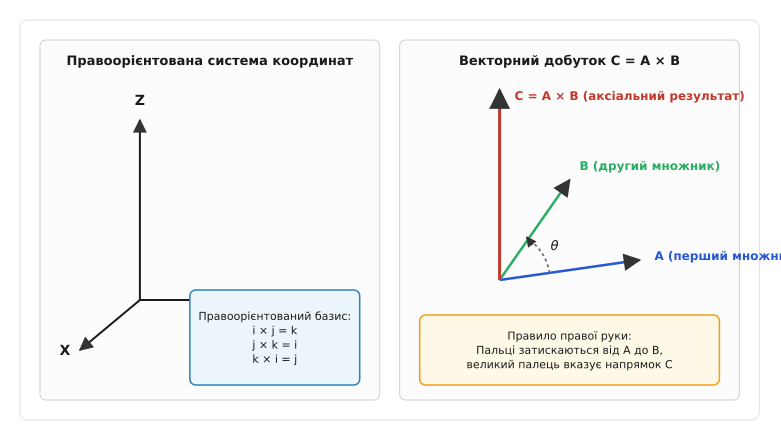
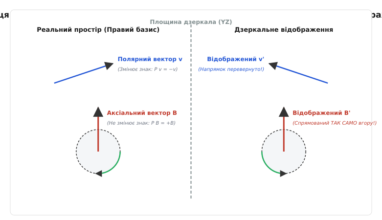
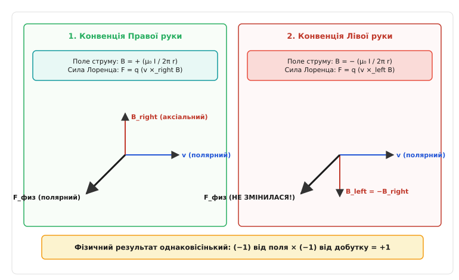
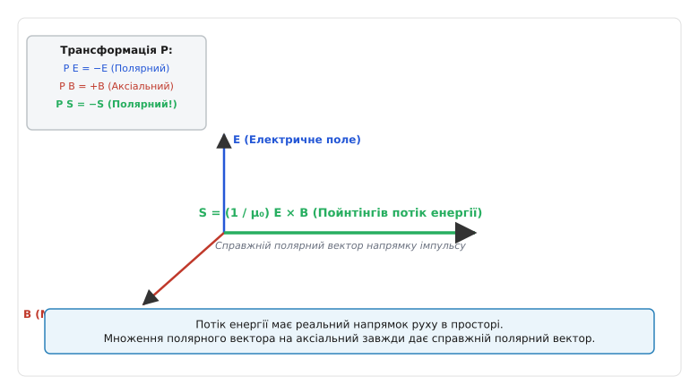

# Правило правої руки і псевдовектори

<preknowlist>
- [Векторний добуток](book:math/cross-product) — операція множення двох векторів у тривимірному просторі з результатом, перпендикулярним до обох множників.
- [Магнітне поле](book:physics/magnetic-field) — силовий стан простору, що виникає навколо рухомих електричних зарядів і діє на інші рухомі заряди.
- [Сила Лоренца](book:physics/lorentz-force) — сила, що діє на точковий електричний заряд у комбінованому електричному та магнітному полях.
</preknowlist>

Заряджена частинка масою `m` і позитивним зарядом `q` влітає зі швидкістю `v = 10⁶ м/с` у шар магнітного поля з індукцією `B = 0.5 Тл`, створеного прямолінійним провідником зі струмом `I = 100 А`. Напрямок сили Лоренца, що згинає траєкторію частинки в дугу радіуса `R = m v / (q B)`, фізичний експериментатор визначає за допомогою правила правої руки. Якщо подивитися на цю лабораторну установку крізь плоскопаралельне дзеркало, швидкість частинки та вигнута траєкторія відобразяться зі зміною напрямку відносно площини дзеркала, а сам вектор магнітної індукції `B`, обчислений за тим самим правилом правої руки у дзеркальному просторі, опиниться перед парадоксальною ситуацією: геометрична стрілка магнітного поля у дзеркалі спрямована не так, як звичайна стрілка швидкості. Це розходження виникає через фундаментальну різницю між двома класами векторних величин — полярними векторами та псевдовекторами (аксіальними векторами).

## Геометрія орієнтації: Правило правої руки як вибір базису

У тривимірному евклідовому просторі орієнтація осей координат не є абсолютним законом природи, а встановлюється за людською домовленістю. Декартова система координат складається з трьох взаємно перпендикулярних одиничних векторів (ортів) `i`, `j`, `k`. Існує два дзеркально нееквівалентні способи розташувати ці орти: правоорієнтований базис та лівоорієнтований базис. За загальноприйнятим у фізиці та математиці стандартом використовують правоорієнтовану систему координат, у якій векторний добуток першого та другого базисних ортомів дає третій орт:

```
i × j = k      [правоорієнтований базис]
j × k = i
k × i = j
```

Якщо повернути орт `i` до орта `j` на кут 90 градусів за найкоротшим шляхом, то орт `k` вказує напрямок, куди викручується гвинт із правою різьбою (або поступальний рух правого штопора). Правило правої руки (від англ. *right-hand rule*) слугує наочним мнемонічним інструментом для визначення напрямку результату векторного добутку двох векторів `C = A × B`.


*Підпис: Геометрія векторного добутку C = A × B. Напрямок результату визначається за годинниковим зсувом від першого вектора до другого, згідно з правилом правої руки.*

Існує дві еквівалентні геометричні формулювання цього правила:

1. **Пальцева мнемоніка (три пальці):** Вказівний палець правої руки спрямовується уздовж першого вектора `A`, середній палець згинається у напрямку другого вектора `B`. Відставлений під кутом 90 градусів великий палець показує напрямок вектора-результату `C`.
2. **Мнемоніка охоплення (кулак):** Пальці правої руки згинаються в кулак у напрямку обертання від вектора `A` до вектора `B` через найменший кут `θ`. Відстовбурчений великий палець вказує напрямок вектора `C`.

Модуль вектора `C` дорівнює площі паралелограма, побудованого на векторах `A` та `B`:

```
|C| = |A| · |B| · sin(θ)      [модуль векторного добутку]
```

Векторний добуток володіє властивістю антикомутативності: перестановка множників місцями змінює знак результату на протилежний:

```
B × A = -(A × B)      [антикомутативність]
```

Саме антикомутативність створює залежність напрямку вектора `C` від людського вибору руки. Якби людство історично домовилося затискати пальці лівої руки, напрямок вектора `C` змінився б на протилежний. Проте фізичний світ існує незалежно від нашого опису. Щоб зрозуміти, чому реальні фізичні явища не залежать від цієї домовленості, необхідно розділити вектори за їхніми трансформаційними властивостями при інверсії простору.

## Дзеркальне відображення: Полярні та аксіальні вектори

У класичній фізиці будь-яка геометрична векторна величина описується потрійним набором чисел у базі `(x, y, z)`. Проте під дією математичної операції просторової інверсії (дзеркального відображення відносно початку координат `P: r → -r`), вектори поводяться двома принципово різними способами.

**Полярні вектори** (або справжні вектори, від лат. *vector* — той, що несе) описують поступальне переміщення, напрямок сили або силові лінії електричного поля. При дзеркальній інверсії координат `(x, y, z) → (-x, -y, -z)` усі компоненти полярного вектора змінюють свій знак на протилежний:

```
P(r) = -r      [радіус-вектор]
P(v) = -v      [швидкість]
P(a) = -a      [прискорення]
P(F) = -F      [сила]
P(E) = -E      [напруженість електричного поля]
P(j) = -j      [густина струму]
```

Якщо полярний вектор відобразити у дзеркалі, його дзеркальна копія вказує у протилежний бік відносно дзеркальної площини. Це легко уявити: якщо автомобіль їде на північ зі швидкістю `v`, то його дзеркальне відображення у зсунутому дзеркалі також має швидкість, спрямовану у дзеркальний бік.

**Аксіальні вектори** (або псевдовектори, від грец. *pseudes* — несправжній і лат. *vector* — той, що несе) виникають під час опису обертальних явищ, вихорів або як результат векторного множення двох полярних векторів. До аксіальних векторів належать:

- Кутова швидкість `ω` та кутове прискорення `α`;
- Момент імпульсу `L = r × p`;
- Момент сили (крутний момент) `τ = r × F`;
- Магнітна індукція `B` та напруженість магнітного поля `H`;
- Ротор векторного поля `∇ × E`.


*Підпис: Поведінка полярного вектора швидкості v та аксіального вектора магнітної індукції B під час дзеркального відображення. Полярний вектор змінює напрямок на протилежний, тоді як аксіальний вектор зберігає свій напрямок уздовж осі.*

Під дією просторової інверсії `P` обидва полярні вектори-множники `r` та `p` змінюють свої знаки на мінус:

```
P(L) = P(r × p)
     = (-r) × (-p)
     = + (r × p)
     = +L      [аксіальний вектор зберігає знак]
```

Два мінуси при множенні дають плюс. Отже, при просторовій інверсії знаки компонент аксіального вектора **не змінюються**. 

Уявімо масивний диск, що обертається проти годинникової стрілки у горизонтальній площині. За правилом правої руки вектор кутової швидкості `ω` спрямований вертикально вгору. Якщо подивитися на цей диск у дзеркалі, розгалуження швидкості точок ободу диска перевертається (диск у дзеркалі обертається за годинниковою стрілкою). Якби ми застосували правило правої руки до дзеркального зображення диска, вектор `ω'` мав би вказувати вниз. Проте якщо ми застосуємо математичну матрицю інверсії безпосередньо до вектора `ω`, він залишиться спрямованим вгору.

Це означає, що аксіальний вектор `B` чи `ω` є не самостійною матеріальною стрілкою, а математичним скороченням для опису обертання або площини. За цією стрілкою ховається кососиметричний тензор второго рангу, детальний математичний апарат якого розкладено у вставці [Алгебра псевдовекторів та тензор Леві-Чивіти](book:physics/electromagnetism/right-hand-rule/math-pseudovector-algebra.md).

## Вихори, циркуляція та теорема Стокса

Зв'язок між правилом правої руки та аксіально-векторними величинами проявляється у векторному аналізі через диференціальні оператори. Ротор векторного поля `∇ × A` визначається як граничне відношення циркуляції поля по замкненому контуру `C` до площі `ΔS`, яку охоплює цей контур, коли площа прямує до нуля:

```
(∇ × A) · n = lim_(ΔS → 0) (1 / ΔS) · ∮_C A · dl      [визначення ротора]
```

У цій формулі контурний інтеграл `∮ A · dl` обчислює сумарне обертання поля вздовж замкненого шляху. Тут елемент довжини контуру `dl` та вектор поля `A` є полярними векторами. Результуюча циркуляція є скаляром для фіксованого контуру.

Проте коли ми переходимо від контурного інтеграла до векторного поля ротора `∇ × A` у точці, теорема Стокса вимагає пов'язати напрямок обходу контуру `dl` із напрямком вектора нормалі `n` до поверхні:

```
∮_C A · dl = ∬_S (∇ × A) · n dS      [теорема Стокса]
```

Орієнтація вектора нормалі `n` узгоджується з напрямком обходу контуру `C` саме за правилом правої руки: якщо пальці правої руки вказують напрямок обходу контуру `dl`, то відставлений великий палець вказує напрямок нормалі `n`. 

Саме тому ротор будь-якого полярного поля (наприклад, вихор швидкості рідини `ω = ∇ × v` або вихор електричного поля `∇ × E`) є **аксіальним вектором**. Вектор ротора не вказує напрямок поступального руху частинок; він вказує вісь, навколо якої відбувається обертання, а його довжина пропорційна кутовій швидкості цього обертання.

## Інтегрування закону Біо-Савара-Лапласа для кругового струму

Щоб детально простежити утворення аксіального поля `B` через векторні добутки полярних елементів, розглянемо круговий виток радіуса `R`, яким протікає струм `I`. Обчислимо магнітну індукцію `B` у точці `Z` на осі симетрії витка на висоті `z` від його центра.

Кожен елемент струму `dl` у циліндричних координатах створює у точці спостереження елементарне магнітне поле за законом Біо-Савара-Лапласа:

```
dB = (μ₀ · I / 4π) · (dl × r) / r³      [елементарне поле Біо-Савара]
```

Тут `r` — радіус-вектор, спрямований від елемента струму `dl` до точки спостереження на осі `Z`. Довжина відстані дорівнює `r = √(R² + z²)`.

Векторний добуток `dl × r` утворює елементарний вектор `dB`, перпендикулярний як до елемента струму `dl`, так і до вектору відстані `r`. Оскільки `dl` лежить у горизонтальній площині витка, а `r` напрямлений під кутом до осі `Z`, вектор `dB` утворює конус навколо осі `Z`.

Розкладемо вектор `dB` на дві компоненти: перпендикулярну до осі `dB_perp` та паралельну осі `dB_z`:

```
dB_z = |dB| · cos(θ) = |dB| · (R / r)
     = (μ₀ · I / 4π) · (dl / r²) · (R / r)
     = (μ₀ · I · R / 4π r³) dl      [осьова компонента поля]
```

При підсумовуванні (інтегруванні) за всім круговим контуром довжиною `2π R` горизонтальні компоненти `dB_perp` від діаметрально протилежних елементів струму точно взаємно знищуються за рахунок симетрії. Повністю виживає лише аксіальна компонента `B_z`:

```
B_z = ∫ dB_z
    = (μ₀ · I · R / 4π r³) ∫ dl
    = (μ₀ · I · R / 4π r³) · (2π R)
    = (μ₀ · I · R² / 2 r³)
    = (μ₀ · I · R²) / [2 · (R² + z³)^(3/2)]      [магнітна індукція на осі витка]
```

У центрі витка при `z = 0` ця формула дає класичне значення `B_0 = μ₀ I / 2 R`.

Цей розрахунок чітко показує: кожен елемент струму `dl` робить свій внесок через векторний добуток `dl × r`, а результуючий вектор `B` на осі є аксіальним вектором, напрямок якого строго збігається з правилом правої руки (якщо пальці затиснуті за напрямком струму `I`, то великий палець вказує напрямок осі `B_z`).

## Соленоїди, електромагніти та правий гвинт у техніці

Практичне застосування правила правої руки найбільш широко представлено в електротехніці при розрахунку соленоїдів, дроселів та електромагнітів. 

Соленоїд є циліндричною котушкою з багатьох витків провідника, намотаного зі щільністю `n = N / L` витків на одиницю довжини. Якщо соленоїдом протікає струм `I`, кожен виток випромінює свій елементарний аксіальний вектор магнітного поля `dB`. За принципом суперпозиції ці вектори додаються всередині соленоїда.

За застосуванням закону циркуляції Ампера по прямокутному контуру `C`, який проходить всередині соленоїда паралельно його осі й замикається далеко зовні:

```
∮_C B · dl = B_int · L = μ₀ · N · I      [закон циркуляції Ампера]
```

Звідси магнітна індукція всередині довгого соленоїда дорівнює:

```
B_int = μ₀ · n · I      [поле всередині соленоїда]
```

Напрямок вектора `B_int` визначається іншим варіантом правила правої руки для соленоїдів: якщо чотири пальці правої руки обхоплюють соленоїд у напрямку протікання струму `I` у витках намотки, то відставлений під кутом 90 градусов великий палець вказує напрямок внутрішнього магнітного поля `B` — тобто напрямок на північний полюс електромагніта.

Цей технічний прийом є базовим для конструювання реле, крокових двигунів, трансформаторів та силових індуктивностей.

## Квадрупольні та мультипольні розклади магнітного поля

Під час побудови сучасних прискорювачів частинок (таких як Великий адронний коллайдер LHC у ЦЕРН або синохротронні джерела випромінювання) використовують не лише дипольні магніти, а й квадрупольні та секступольні магнітні лінзи.

Магнітний дипольний момент `μ = I · S` є аксіальним вектором і перетворюється як `P(μ) = +μ`. Проте в мультипольному розкладі векторного потенціалу `A(r)` магнітне квадрупольне поле створюється чотирма полюсами із чергуванням полярності (N-S-N-S):

```
A_quad(r) = (μ₀ / 4π r³) · (r × Q · r)      [квадрупольний потенціал]
```

Тут `Q` — тензор магнітного квадрупольного моменту. Поле квадрупольного магніту на осі описується векторним полем `B_quad = (G · y, G · x, 0)`, де `G` — градієнт поля.

При просторовій інверсії `P: (x, y) → (-x, -y)` обидві координати змінюють знаки, тому компоненти квадрупольного магнітного поля трансформуються як `B_quad' = (G (-y), G (-x), 0) = -B_quad`. Квадрупольне магнітне поле фокусує пучок пучок позитивно заряджених частинок в одній площині (наприклад, у горизонтальній) та розфокусує в ортогональній (вертикальній) площині. Для забезпечення двоосьової фокусування у синхротронах застосовують дублети квадрупольних лінз із поворотними осіма, а правило правої руки розраховує точні сили Лоренца `F = q (v × B_quad)` для кожної траєкторії частинки у пучку.

## Оптична хіральність та ефект Фарадея

Псевдовекторна природа магнітного поля безпосередньо впливає на оптичні властивості речовини. Розрізняють два принципово різних типи обертання площини поляризації світла:

1. **Природна оптична активність (хіральність молекул):** Виникає у розчинах цукрів або амінокислот завдяки асиметрії молекулярної структури. Кут повороту поляризації `θ` описується псевдоскаляром. Якщо світло проходить крізь кювету із цукром, повертається на кут `+θ`, а потім віддзеркалюється назад плоскопаралельним дзеркалом і проходить крізь кювету у зворотному напрямку, кут повороту скасовується і стає рівним `0°`. Це нереципрокний процес відновлення початкового стану.
2. **Магнітооптичний ефект Фарадея:** Виникає під час проходження світла крізь оптичне середовище у зовнішньому поздовжньому магнітному полі `B`. Кут повороту площини поляризації дорівнює:

```
θ_Faraday = V · B · L      [ефект Фарадея]
```

Тут `V` — стала Верде, `B` — аксіальний вектор магнітного поля, `L` — довжина шляху. Оскільки магнітне поле `B` є аксіальним вектором, при зміні напрямку поширення світла на протилежний знак повороту **не змінюється**! 

Якщо світло віддзеркалюється назад і проходить крізь середовище повторно, кут повороту подвоюється: `θ_total = 2 · θ_Faraday`. На цьому ефекті базуються оптичні ізолятори (вентилі) у лазерній техніці, які пропускають лазерний промінь в один бік і повністю блокують шкідливе зворотне відображення у лазерний резонатор.

## Крутний момент на рамку зі струмом та електричні двигуни

Розглянемо прямокутну рамку зі струмом `I` зі сторонами `a` та `b`, розміщену в однорідному магнітному полі `B`. Радіус-вектор нормалі до площини рамки позначимо через `n`, а магнітний момент рамки як `μ = I · S · n`, де `S = a · b`.

На дві протилежні сторони рамки довжиною `a` діють сили Ампера `F₁` та `F₂`:

```
F₁ = I · (a × B)
F₂ = -I · (a × B) = -F₁      [пара сил Ампера]
```

Ці дві сили утворюють пару сил, яка не створює рівнодійного поступального зсуву рамки (`F_net = F₁ + F₂ = 0`), але створює крутний момент (момент сил) `τ`:

```
τ = r₁ × F₁ + r₂ × F₂ = μ × B      [крутний момент на рамку]
```

Тут магнітний момент `μ` — аксіальний вектор, магнітне поле `B` — аксіальний вектор. За таблицею парності векторний добуток двох аксіальних векторів `Аксіальний × Аксіальний` дає **аксіальний вектор** крутного моменту `τ`.

Модуль крутного моменту дорівнює `|τ| = μ · B · sin(θ)`, де `θ` — кут між магнітним моментом рамки `μ` та зовнішнім полем `B`. Цей момент прагне повернути рамку так, щоб її магнітний момент `μ` вишикувався паралельно зовнішньому полю `B` (стан мінімуму потенціальної енергії `U = -μ · B`).

Саме цей механізм лежить в основі роботи всіх електричних двигунів постійного та змінного струму (колекторних, безколекторних BLDC, синхронних та асинхронних). Колектор чи інвертор перемикає напрямок струму `I` у обмотках ротора через кожні півоборотів саме тоді, коли рамка досягає точки рівноваги, забезпечуючи безперервне обертання вала двигуна у розрахунковий бік.

## Електромагнітні хвилі та плоский вектор Пойнтінга

У вільному просторі рівняння Максвелла описують існування поперечних електромагнітних хвиль, що поширюються зі швидкістю світла `c = 1 / √(ε₀ μ₀)`.

Розглянемо плоску електромагнітну хвилю, що рухається вздовж осі `X`. Електричне поле `E` коливається уздовж осі `Y`, а магнітне поле `B` коливається уздовж осі `Z`:

```
E_y(x, t) = E₀ · cos(k x - ω t)      [полярне електричне поле]
B_z(x, t) = B₀ · cos(k x - ω t)      [аксіальне магнітне поле]
```

За правилом правої руки обчислимо векторний добуток `E × B`:

```
E × B = (0, E_y, 0) × (0, 0, B_z) = (E_y · B_z, 0, 0)      [полярний вектор Пойнтінга]
```

Вектор Пойнтінга `S = (1 / μ₀) (E × B)` спрямований точно уздовж позитивного напрямку осі `X`. Три вектори `(E, B, S)` утворюють у кожній точці простору правоорієнтовану трійку векторів. Полярне електричне поле `E` та аксіальне магнітне поле `B` коливаються у синфазних фазах, а результуючий полярний вектор потоку енергії `S` безупинно несе імпульс та енергію електромагнітного випромінювання вперед у просторі.

## Чому фізичний світ не залежить від вибору руки: Знак скасовується двічі

Виникає фундаментальне запитання: якщо напрямок псевдовектора магнітної індукції `B` визначається людською домовленістю про правило правої руки, чи означає це, що фізичні явища залежать від суб'єктивного вибору координат?

Відповідь — ні. Природа не знає про праворучні чи ліворучні координати. Усі вимірювані фізичні величини, які можна зафіксувати приладами — прискорення частинки, вигин траєкторії, сила тиску на датчик, потік енергії, потенціальна енергія — **завжди є полярними векторами або істинними скалярами**.

Розглянемо закон сили Лоренца, яка діє на електричний заряд `q`, що рухається зі швидкістю `v` у магнітному полі `B`:

```
F = q · (v × B)      [сила Лоренца]
```

Тут сила `F` — це полярний вектор (вона викликає реальне прискорення маси `m` за II законом Ньютона `F = m a`). Швидкість `v` — це полярний вектор. Магнітна індукція `B` — це аксіальний вектор, утворений струмами за законом Біо-Савара-Лапласа:

```
B = (μ₀ · I / 4π) ∫ (dl × r) / r³      [закон Біо-Савара-Лапласа]
```

У цій формулі `dl` (елемент довжини провідника зі струмом) та `r` (радіус-вектор) — обидва є полярними векторами.


*Підпис: Механізм компенсації конвенції правої й лівої руки в законі сил Лоренца. Зміна знака псевдовектора B нейтралізується зміною знака операції векторного добутку, залишаючи спостережувану силу F незмінною.*

Простежимо, що станеться, якщо вся фізична спільнота одномоментно вирішить перейти з правила правої руки на правило лівої руки (позначимо векторний добуток у лівій конвенції як `×_left`):

1. **Зміна знака магнітного поля:** Векторний добуток `dl ×_left r` у законі Біо-Савара змінить свій напрямок на протилежний. В результаті той самий фізичний струм `I` створюватиме вектор магнітного поля `B_left = -B_right`.
2. **Зміна знака векторного добутку у силі:** Формула для сили Лоренца у лівій конвенції вимагатиме застосування лівого векторного добутку: `F_left = q · (v ×_left B_left)`.

Підставимо `B_left` та визначення `×_left = -(×_right)` у вираз для сили:

```
F_left = q · (v ×_left B_left)
       = q · (-1) · (v ×_right (-B_right))
       = q · (-1) · (-1) · (v ×_right B_right)
       = q · (v ×_right B_right)
       = F_right      [абсолютний збіг фізичної сили]
```

Два мінуси нейтралізують один одного. Перший мінус виник при визначенні напрямку псевдовектора `B`, а другий мінус виник при повторному застосуванні векторного добутку для обчислення полярного вектора сили `F`.

Аналогічно розглянемо дрейфову швидкість частинки в скрещених електричному та магнітному полях (`E × B` дрейф). Коли на заряджену частинку діють одночасно електричне поле `E` та магнітне поле `B`, середня дрейфова швидкість її ведучого центра дорівнює:

```
v_drift = (E × B) / B²      [швидкість E × B дрейфу]
```

Тут електричне поле `E` — полярний вектор, магнітне поле `B` — аксіальний вектор. За таблицею парності `Полярний × Аксіальний = Полярний`. Дрейфова швидкість `v_drift` є **справжнім полярним вектором**. Що найцікавіше, напрямок `v_drift` **взагалі не залежить від знака заряду `q`**: позитивні іони та негативні електрони у плазмі дрейфують в один і той самий бік!

Аналогічно розглянемо потенціальну енергію `U` магнітного диполя з магнітним моментом `μ = I · S` у зовнішньому магнітному полі `B`:

```
U = -μ · B      [потенціальна енергія диполя]
```

Тут магнітний момент `μ` є аксіальним вектором (він визначається через вектор площі рамки зі струмом `S = r₁ × r₂`). Магнітне поле `B` також є аксіальним вектором. Скалярний добуток двох аксіальних векторів дає **істинний скаляр** (не змінює знак при інверсії `P(U) = - (+μ) · (+B) = U`). Якщо змінити конвенцію з правої руки на ліву, обидва вектори змінять знаки: `μ_left = -μ_right` та `B_left = -B_right`. Їхній скалярний добуток залишить енергію `U` повністю незмінною:

```
U_left = - (-μ_right) · (-B_right) = - μ_right · B_right = U_right
```

Це універсальне правило електродинаміки та механіки: **будь-яка реальна фізична величина утворюється парним числом застосувань аксіальних векторів або векторного добутку**.

Звідси випливає алгебраїчна таблиця комбінування типів векторів при векторному множенні:

```
Полярний × Полярний   = Аксіальний     [приклад: r × p = L, dl × r → B]
Полярний × Аксіальний = Полярний       [приклад: v × B → F, E × B → S]
Аксіальний × Аксіальний = Аксіальний   [приклад: ω × L → τ_prec]
```

Завдяки цьому фізичні рівняння зберігають однаковий вигляд у будь-якій системі координат. Правило правої руки є всього лише узгодженим способом розставляти знаки у проміжних розрахунках, щоб на фінальному кроці отримати об'єктивний полярний вектор сили або скаляр енергії без плутанини. 

Історично довго вважалося, що симетрія просторової парності є абсолютною для всіх взаємодій у природі. Проте у 1956 році експерименти з ядерного фізики виявили дивовижне виключення, яке описано у вставці [Експеримент Ву та відкриття порушення P-парності](book:physics/electromagnetism/right-hand-rule/hist-parity-violation.md).

## Рівняння Максвелла та парність електромагнітного поля

Класична електродинаміка Максвелла є фундаментально симетричною відносно просторової інверсії (`P`-інваріантною). Перевіримо це, проаналізувавши всі чотири рівняння Максвелла у диференціальній формі під дією оператора просторової інверсії `P: r → -r`.

Оператор просторового диференціювання (набла `∇ = ∂/∂r`) трансформується як полярний вектор: `P(∇) = -∇`.

### 1. Теорема Гаусса для електричного поля

```
∇ · E = ρ / ε₀      [закон Гаусса]
```

Заряд `ρ` — це скаляр (`P(ρ) = +ρ`). Набла `∇` та електричне поле `E` — полярні вектори (`P(∇) = -∇`, `P(E) = -E`). Скалярний добуток двох полярних векторів дає істинний скаляр:

```
P(∇ · E) = (-∇) · (-E) = +(∇ · E)      [парність збережена]
```

### 2. Теорема Гаусса для магнітного поля

```
∇ · B = 0      [відсутність магнітних зарядів]
```

Набла `∇` — полярний вектор (`-∇`), магнітна індукція `B` — аксіальний вектор (`+B`). Скалярний добуток полярного вектора на аксіальний дає псевдоскаляр `P(∇ · B) = (-∇) · (+B) = -(∇ · B)`. Оскільки права частина дорівнює нулю, то `-0 = 0`, і рівняння залишається інваріантним.

### 3. Закон електромагнітної індукції Фарадея та знак Ленца

```
∇ × E = -∂B / ∂t      [закон Фарадея]
```

Ліва частина є ротором полярного вектора: векторний добуток полярного оператора `∇` на полярне поле `E`. За таблицею парності `Полярний × Полярний = Аксіальний`:

```
P(∇ × E) = (-∇) × (-E) = +(∇ × E)      [ліва частина — аксіальний вектор]
```

Права частина містить похідну за часом від магнітного поля `-∂B / ∂t`. Оскільки час `t` є скаляром (`P(t) = +t`), а `B` — аксіальний вектор (`P(B) = +B`), то права частина також є аксіальним вектором:

```
P(-∂B / ∂t) = -∂(+B) / ∂t = -∂B / ∂t   [права частина — аксіальний вектор]
```

Обидві частини рівняння Фарадея є аксіальними векторами. Знак мінус у законі Фарадея виражає **закон Ленца**: індуковане електричне поле викликає струм, магнітне поле якого протидіє зміні первинного магнітного потоку. Якби знак у законі Фарадея був плюсом, індукований струм підсилював би первинну зміну потоку, створюючи самоприскорювальний лавиноподібний процес і порушуючи закон збереження енергії. Зв'язок знака Ленца з правилом правої руки суворо фіксує напрямок індукційного струму.

### 4. Закон Ампера-Максвелла

```
∇ × B = μ₀ j + μ₀ ε₀ ∂E / ∂t      [закон Ампера-Максвелла]
```

Ліва частина є ротором аксіального вектора: векторний добуток полярного оператора `∇` на аксіальний вектор `B`. За таблицею парності `Полярний × Аксіальний = Полярний`:

```
P(∇ × B) = (-∇) × (+B) = -(∇ × B)      [ліва частина — полярний вектор]
```

Права частина містить густину струму `j` (полярний вектор) та похідну від електричного поля `∂E / ∂t` (полярний вектор). Отже, обидві частини рівняння є полярними векторами і синхронно змінюють знак при інверсії:

```
-(∇ × B) = μ₀ (-j) + μ₀ ε₀ ∂(-E) / ∂t   [парність збережена]
```

### Пойнтінгів потік енергії

Важливим підтвердженням узгодженості теорії є вектор Пойнтінга `S`, який описує густину потоку електромагнітної енергії та напрямок її перенесення у просторі:

```
S = (1 / μ₀) · (E × B)      [вектор Пойнтінга]
```


*Підпис: Дзеркальна симетрія вектора Пойнтінга S = (1 / μ₀) (E × B). Результат множення полярного вектора E на аксіальний вектор B дає справжній полярний вектор, що вказує реальний напрямок перенесення енергії.*

Обчислимо просторову парність вектора Пойнтінга:

```
P(S) = (1 / μ₀) · P(E × B)
     = (1 / μ₀) · [(-E) × (+B)]
     = - (1 / μ₀) · (E × B)
     = -S      [вектор Пойнтінга — полярний вектор]
```

Вектор Пойнтінга `S` є **справжнім полярним вектором**. Енергія електромагнітної хвилі рухається у цілком конкретному напрямку простору, і цей напрямок змінюється на протилежний при дзеркальному відображенні, як і належить будь-якому фізичному потоку імпульсу чи маси.

## Релятивістське походження магнітного поля

Найглибше пояснення того, чому магнітне поле є псевдовектором і чому правило правої руки взагалі виникає у тривимірній фізиці, дає спеціальна теорія відносності (СТВ).

У 4-вимірному просторі-часі Мінковського `(c t, x, y, z)` не існує векторного добутку і не існує правила правої руки. Електромагнітне поле описується єдиним 4-мірним антисиметричним тензором другого рангу — тензором електромагнітного поля (тензором Фарадея) `F_μν`:

```
F_μν = ∂_μ A_ν - ∂_ν A_μ      [тензор Фарадея]
```

У матричному вигляді тензор `F_μν` об'єднує всі 6 компонент електричного та магнітного полів:

```
F_μν = ⎡   0      -E_x/c   -E_y/c   -E_z/c ⎤
       ⎢  E_x/c     0       B_z     -B_y   ⎥
       ⎢  E_y/c   -B_z       0       B_x   ⎥
       ⎣  E_z/c    B_y      -B_x      0    ⎦      [4-тензор поля]
```

Компоненти електричного поля `E_i` стоять у хроно-просторових блоках `F_0i` (вони є компонентами 4-вектора напрямку), тоді як компоненти магнітного поля `B_k` стоять суто у просторових блоках `F_ij` для `i, j ∈ {1, 2, 3}`.

У чотиривимірній релятивістській формалізації просторова інверсія задається 4-матрицею Лоренца `Λ^μ_ν = diag(1, -1, -1, -1)`. Перетворення тензора `F_μν` відбувається за загальним тензорним законом:

```
F'_μν = Λ^α_μ · Λ^β_ν · F_αβ      [трансформація 4-тензора]
```

Обчислимо перетворення для компонент електричного та магнітного полів:

1. **Для електричного поля (`F_0i`):** Один індекс є часовим (`Λ^0_0 = +1`), а другий — просторовим (`Λ^i_i = -1`). Результат: `F'_0i = (+1) · (-1) · F_0i = -F_0i`. Напруженість електричного поля `E` змінює знак — вона є полярним вектором!
2. **Для магнітного поля (`F_ij`):** Обидва індекси є просторовими (`Λ^i_i = -1`, `Λ^j_j = -1`). Результат: `F'_ij = (-1) · (-1) · F_ij = +F_ij`. Компоненти магнітного поля `B` зберігають знак — воно є аксіальним вектором!

Цей релятивістський вивід демонструє беззаперечну істину: **правило правої руки не є первинним законом природи**. Воно виникає виключно як артефакт проекції 4-вимірного антисиметричного тензора Фарадея `F_μν` на тривимірний просторовий базис людини.

> 🔧 **Навіщо це.**
> У тривимірній комп'ютерній графіці, фізичних рушіях (PhyX, Havok), робототехніці (ROS) та САПР суворо розрізняють полярні вектори й псевдовектори під час застосування матриць трансформації. Якщо тривимірну модель дзеркально відображають за допомогою матриці з від'ємним детермінантом `det(M) < 0` (наприклад, масштабування `Scale(-1, 1, 1)`):
> 
> 1. Полярні вектори (вершини, швидкості, сили) перетворюються звичайним множенням `V' = M · V`.
> 2. Аксіальні вектори (вектори нормалей поверхні, моменти інерції, кутові швидкості, магнітні поля) вимагають множення на детермінант `A' = det(M) · (M · A)`.
> 
> Якщо програміст застосує до нормалі поверхні чи магнітного поля звичайне множення на дзеркальну матрицю без урахування `det(M)`, нормаль повернеться всередину об'єкта, освітлення зламається, а розрахунок магнітних сил вкаже у протилежний бік. Детальну кодову реалізацію модуля перетворення векторів розглянуто у вставці [Реалізація та трансформація псевдовекторів у коді](book:physics/electromagnetism/right-hand-rule/proj-axial-transform.md).

Розрізнення полярних та аксіальних векторів розкриває глибинну геометрію електромагнетизму: правило правої руки є не довільним капризом творців класичної фізики, а струнким апаратом узгодження правоорієнтованого базису із псевдовекторними величинами, що забезпечує повну об'єктивність усіх фізичних законів.
