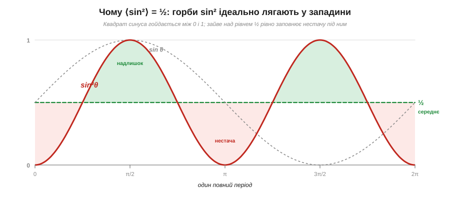
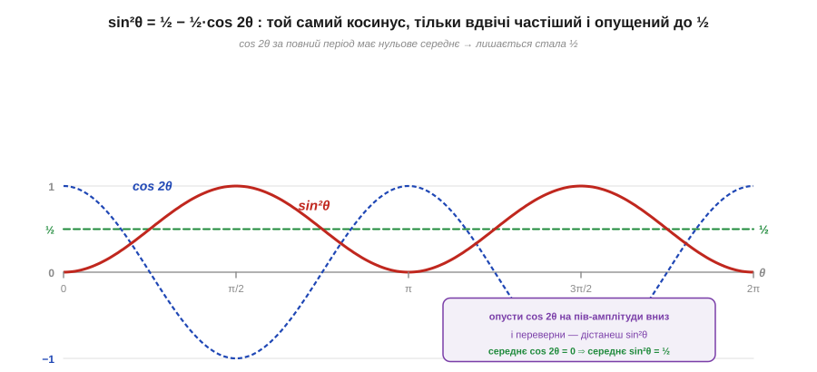

# 🧮 Звідки √2: середнє від sin² за період

> Це математична вставка до теми [«Середнє й діюче значення (RMS)»](book:physics/rms-value). Там користуються готовим числом: для синуса діюче значення в **√2 ≈ 1.414** раза менше за амплітуду (Vᵣₘₛ = Vₘ/√2 ≈ 0.707·Vₘ) — саме тому в розетці «230 В» при амплітуді близько 325 В. Звідки береться рівно √2, а не якесь інше число? Ця вставка виводить його з означення RMS за три кроки: квадрат → середнє → корінь. Жодної магії — лише геометрія синусоїди й одна тригонометрична тотожність.

### Означення: чому корінь із середнього квадрата

RMS (*root-mean-square*, «корінь із середнього квадрата») — це не довільна формула, а відповідь на цілком конкретне інженерне питання: **яка стала напруга гріла б резистор так само, як дана змінна?** Питання має сенс, бо проста середня змінної напруги тут не годиться: синус половину періоду додатний, половину — від'ємний, і його звичайне середнє за період дорівнює нулю. А лампа від такої напруги світить, праска гріється — нуль явно не описує її дію.

Розгадка в тому, що нагрів залежить не від самої напруги, а від її **квадрата**: [потужність на резисторі](book:physics/electric-power) P = V²/R, і знак напруги тут зникає — мінус у квадраті дає плюс. Тому правильна процедура читається прямо з назви, справа наліво: спершу **квадрат** (V²) — щоб дістати миттєву потужність, у якій знак не важить; потім **середнє** (mean) цього квадрата за період — бо нагрів визначає саме середня потужність; і нарешті **корінь** (root) — щоб повернутися від «квадрата напруги» назад до вольтів. Коротко:

```
Vᵣₘₛ = √( середнє від v(t)²  за період )
```

Це число й називають діючим значенням: стала напруга Vᵣₘₛ виділяє на тому самому резисторі рівно ту саму середню потужність, що й уся змінна хвиля.

### Інтуїція: квадрат синуса гойдається коло ½

Усе зводиться до одного: чому дорівнює **середнє від sin²** за період? Підставимо синус v(t) = Vₘ·sin(ωt). Тоді v² = Vₘ²·sin²(ωt), і стала Vₘ² виноситься за знак усереднення — лишається знайти лише ⟨sin²⟩, середнє квадрата чистого синуса.

Відповідь видно ще до будь-яких обчислень — просто з форми кривої sin². Синус коливається між −1 і +1; піднесений до квадрата, він уже не від'ємний і гойдається між 0 і 1, причому симетрично коло середини — рівня ½.


*Чому ⟨sin²⟩ = ½. Червона крива sin²θ не виходить за межі 0…1 і симетрична відносно рівня ½: зелений «надлишок» над половиною рівно дорівнює рожевій «нестачі» під нею. Тож якби горби зрізати й засипати ними западини, уся площа лягла б точно на рівень ½ — це й є середнє.*

Симетрія тут не випадкова. Підбіг кривої знизу до ½ дзеркально повторює її спуск зверху до ½: горб над половиною має рівно ту саму форму, що й западина під нею. Тому надлишок площі над рівнем ½ точно заповнює нестачу під ним, і чесне середнє опиняється посередині — на ½. Звідси відразу:

```
⟨sin²⟩ = ½   ⇒   ⟨v²⟩ = Vₘ²·½   ⇒   Vᵣₘₛ = √(Vₘ²/2) = Vₘ/√2 ≈ 0.707·Vₘ
```

Ось і весь √2: він — це √2 зі знаменника, що виліз з-під кореня, бо середнє квадрата синуса дорівнює рівно одній другій.

### Апарат: тотожність подвійного кута

Геометрія переконує, та строгий доказ дає тригонометрія — і він теж короткий. Скористаймося тотожністю **косинуса подвійного кута**, переписаною відносно sin²:

```
cos 2θ = 1 − 2·sin²θ      ⇒      sin²θ = ½ − ½·cos 2θ
```

Ця рівність каже дивовижну річ: квадрат синуса — це **той самий косинус**, лише вдвічі частіший, стиснений по висоті вдвічі й піднятий до рівня ½.


*sin²θ = ½ − ½·cos 2θ. Синій cos 2θ гойдається симетрично коло нуля, тож за повний період його середнє точно нульове. Опустіть його на ½ й переверніть — дістанете червону sin²θ. Усереднення вбиває косинусну частину, лишаючи саму сталу ½.*

Тепер усереднити sin² за період — легко, бо середнє розкладається на доданки. Перший доданок, ½, — стала, її середнє дорівнює їй самій. Другий, ½·cos 2θ, — це косинус, що за **повний** період має стільки ж додатних значень, скільки від'ємних; його середнє точно нуль (площа над віссю гаситься площею під нею). Залишається сама стала:

```
⟨sin²θ⟩ = ⟨½⟩ − ½·⟨cos 2θ⟩ = ½ − ½·0 = ½
```

Той самий результат, що й з картинки, але вже доведений. (Хто знайомий з інтегралами — це те саме, що (1/2π)·∫₀²π sin²θ dθ = ½: інтеграл від cos 2θ за повний період дорівнює нулю.) Підставивши ½ у формулу RMS, остаточно маємо для будь-якого синуса:

```
Vᵣₘₛ = Vₘ/√2 ≈ 0.707·Vₘ        Vₘ = √2·Vᵣₘₛ ≈ 1.414·Vᵣₘₛ
```

**Приклад (амплітуда мережі).** На розетці пишуть 230 В — це діюче (RMS) значення. Яка справжня амплітуда хвилі?

```
Vₘ = √2 · Vᵣₘₛ = 1.414 · 230 В ≈ 325 В
розмах (від піка до піка) = 2·Vₘ ≈ 650 В
```

Тобто напруга в розетці щомиті злітає до +325 В і падає до −325 В, хоча «коштує» вона як 230 В постійної напруги. Саме на 325 В (а не 230) мусить бути розрахована ізоляція й конденсатори на вході приладу — типова пастка початківця.

### Де це працює в курсі

Множник 0.707 (і обернений 1.414) — один із небагатьох, що варто пам'ятати напам'ять: він зв'язує те, що показує [осцилограф](book:electronics/oscilloscope) (амплітуду), з тим, що показує мультиметр (RMS) і що пишуть [на розетці](book:physics/ac-power-grid). Важливо, що **√2 — це закон лише для чистого синуса**: коефіцієнт між амплітудою й RMS залежить від форми, і для меандру чи трикутника він інший. Саме тому дешевий мультиметр, який таємно множить на 0.707, бреше на несинусоїдному сигналі, а чесний прилад [«true RMS»](book:physics/rms-value/proj-true-rms.md) рахує «квадрат → середнє → корінь» безпосередньо. Та сама трійця «квадрат → середнє → корінь» працює всюди, де важить енергія: так визначають діюче значення струму (для потужності I²·R), рівень шуму й потужність будь-якого складного сигналу.
