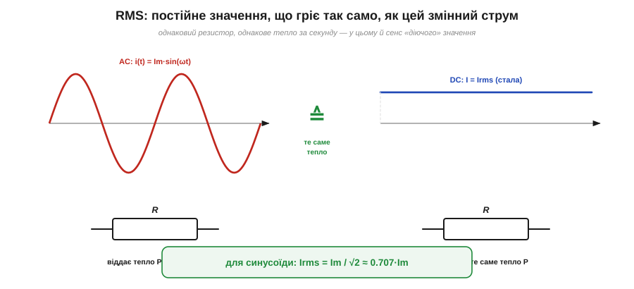

# Середнє й діюче значення (RMS)

Ось питання, що стоїть за кожною [розеткою змінного струму](book:physics/dc-vs-ac): коли на ній написано «230 вольтів», що це за число? Адже напруга там не стоїть на місці — вона коливається синусоїдою, щомиті інша: то нуль, то +325 В, то знову нуль, то −325 В. Жодне з цих миттєвих значень не дорівнює 230. То звідки взялися ці 230, і чому саме вони? За цим простим числом стоїть напрочуд глибока ідея про те, як **чесно порівняти** мінливий змінний струм зі спокійним постійним.

Спокуса перша й очевидна — узяти **середнє** значення хвилі. Та з нею нічого не вийде, і саме її провал виведе на правильну відповідь.

### Чому просте середнє нікуди не годиться

Спробуймо усереднити синусоїду напруги за один період — додати всі миттєві значення й поділити на тривалість. І одразу впираємося в халепу: синусоїда **симетрична** відносно осі. Скільки часу вона проводить угорі (додатна), стільки ж — унизу (від'ємна), і відхилення дзеркальні. Тож додатна половина рівно гасить від'ємну, а середнє за повний період виходить **рівно нуль**:


*Просте середнє синусоїди за період — нуль: площа над віссю (додатні півхвилі) точно дорівнює площі під нею (від'ємні), і вони гасяться. Тому «середня напруга» розетки — нуль, хоча розетка справно гріє чайник. Середнє очевидно не описує «силу» змінного струму.*

І це не дивно — це навіть правильно: середній **перенесений заряд** за період справді нуль (бо в [змінному струмі](book:physics/dc-vs-ac) електрони лише гойдаються туди-сюди). Та як опис «сили» сигналу нуль безглуздий: розетка з «нульовою середньою» напругою чудово кип'ятить воду й палить пальці. Отже, проста середня величина проґавлює саму суть: змінний струм робить роботу обома півхвилями, а не сумарним зсувом заряду.

Можна спробувати латку — усереднити не сам сигнал, а його **модуль** (узяти всі значення додатними, ніби «перегнути» від'ємні півхвилі вгору). Це **середньовипрямлене** значення (*rectified average*), і воно вже не нуль. Для синусоїди воно виходить ≈ 0.637·Vₘ. Латка робоча, і деякі дешеві прилади міряють саме її. Та вона теж не та відповідь, по якій тужимо: вона не каже, скільки **корисної роботи** дає сигнал. А саме робота — тепло, потужність — нас і цікавить. Тож зайдемо з боку роботи.

### Правильна ідея: однаковий нагрів

Поставмо питання інакше — так, як його колись поставили інженери. Замість «яке в нього середнє?» спитаймо: **який постійний струм виділяв би стільки ж тепла, скільки цей змінний?** Ось це число — еквівалент за нагрівом — і буде чесною мірою «сили». Воно так і зветься — **діюче**, або **середньоквадратичне**, значення (*RMS, root-mean-square*; іноді кажуть «ефективне», *effective*).


*Означення RMS через нагрів. Пропустіть змінний струм i(t) крізь резистор — він віддасть певне тепло за секунду. RMS-значення цього струму — це таке **постійне** I, яке у тому самому резисторі дало б **точнісінько стільки ж тепла**. Тому RMS — справедлива міра: вона прирівнює змінний струм до постійного за реальною роботою.*

Чому ключ саме нагрів? Бо тепло від струму **не залежить від напрямку**. [Потужність на резисторі](book:physics/electric-power) P = I²·R — зі **квадратом** струму. А квадрат завжди додатний: і додатний струм, і від'ємний гріють однаково (мінус у квадраті зникає). Тому резистору байдуже, що струм змінний і міняє знак, — він гріється обома півхвилями. Це робить нагрів ідеальним «суддею»: він чесно складає внесок кожної півхвилі, не даючи їм погаситися, як гасилося середнє.

### Рецепт RMS: квадрат → середнє → корінь

Назва **root-mean-square** не випадкова — це буквально рецепт, і читати його треба **справа наліво**, у три кроки. Беремо сигнал і: підносимо до **квадрата** (*square*), знаходимо **середнє** цього квадрата (*mean*), а тоді добуваємо **корінь** (*root*). Простежимо, чому саме так і що на кожному кроці відбувається.


*Три кроки RMS на прикладі синуса. (1) **Квадрат**: i² завжди ≥ 0 і коливається вдвічі частіше за i, біля свого середнього. (2) **Середнє**: у sin² середнє за період дорівнює рівно ½ (квадрат хвилі однаково часто буває вище й нижче половини). (3) **Корінь**: √(Iₘ²/2) = Iₘ/√2. Звідси й береться знаменитий множник √2.*

**Крок 1 — квадрат.** Підносимо миттєвий сигнал до квадрата. Цим ми, по-перше, прибираємо знак (усе стає додатним — як і нагрів), а по-друге, переходимо саме до тієї величини, що пропорційна потужності (бо P ∝ i²). Квадрат синуса, sin², — цікава крива: вона завжди невід'ємна, торкається нуля там, де синус проходив нуль, і коливається **вдвічі частіше** за вихідний синус, гойдаючись між 0 і Vₘ².

**Крок 2 — середнє.** Усереднюємо цей квадрат за період. Ось де ховається вся арифметика. Виявляється, середнє від sin² за період — рівно **½**. Інтуїтивно: квадрат синуса однаково часто буває вищим і нижчим за половину своєї висоти, тож «балансує» точно посередині. (Є й гарне формальне пояснення через тотожність sin²θ = (1 − cos2θ)/2: косинусний доданок за період усереднюється в нуль, лишається стале ½.) Отже, середнє від i² = Iₘ²·sin² дорівнює Iₘ²·½ = Iₘ²/2.

**Крок 3 — корінь.** Лишилося видобути корінь — щоб повернутися від «квадрата величини» назад до самої величини (тих самих вольтів чи амперів). Корінь із Iₘ²/2 і дає відповідь:

```
Mean (sin²)  = 1/2
Irms = √(Im²/2) = Im / √2 ≈ 0.707 · Im
```

Ось звідки той знаменитий множник: **для синусоїди RMS менший за амплітуду рівно в √2 разів** (√2 ≈ 1.414, а 1/√2 ≈ 0.707). Зверніть увагу — це справедливо **тільки для синуса**: інша форма хвилі (прямокутник, трикутник, пилка) дасть інший коефіцієнт, бо в неї інша «частка часу на висоті». Для чистого прямокутника, скажімо, RMS дорівнює самій амплітуді (він увесь час на повну), а для трикутника — Iₘ/√3.

### Числа розетки нарешті стають на місця

Тепер усе сходиться. «230 В» розетки — це **RMS-значення**: таке постійне, що грітиме навантаження так само, як ця синусоїда. А пік її помітно вищий — амплітуда більша за RMS у √2:

```
Vm = Vrms · √2 = 230 · 1.414 ≈ 325 В      ← справжній пік мережі
```

Звідси важливе практичне попередження: «230 вольтів» означають реальні **325 вольтів** у піку, і саме на них (з запасом) мусить бути розрахована ізоляція й деталі. Прилади ж — мультиметр у режимі AC, вольтметри на щитку — показують саме RMS, бо це число, по якому рахують потужність і яке відповідає «силі» струму.

**Приклад (повний набір чисел синусоїди).** Синусоїдальна напруга має амплітуду Vₘ = 10 В. Знайдемо її розмах, діюче й середньовипрямлене значення.

```
Vpp  = 2 · Vm            = 20 В          ← розмах від піка до піка
Vrms = Vm / √2 = 10/1.414 ≈ 7.07 В       ← діюче (по ньому рахують потужність)
Vavg = 0.637 · Vm         ≈ 6.37 В       ← середньовипрямлене (модуль, усереднений)
```

Три різні числа з однієї хвилі — і кожне відповідає на своє питання: Vₚₚ міряють оком на екрані, Vᵣₘₛ підставляють у P = V²/R, а середньовипрямлене дає простий випрямляч. Не сплутати їх — половина грамотності у змінному струмі.

### Коефіцієнти форми й піка — і чому дешевий прилад бреше

Два сталі відношення між цими числами мають назви, бо їх корисно тримати в голові. **Коефіцієнт форми** (*form factor*) — це RMS поділити на середньовипрямлене; для синуса 0.707/0.637 ≈ 1.11. **Коефіцієнт піка** (*crest factor*) — амплітуда поділити на RMS; для синуса √2 ≈ 1.41. Ці коефіцієнти **залежать від форми** хвилі, і саме тут чигає підступ.

Багато дешевих мультиметрів насправді **не вміють** рахувати RMS чесно (квадрат-середнє-корінь — недешева операція). Вони міряють легке середньовипрямлене значення, а тоді просто **множать його на 1.11** — той самий коефіцієнт форми синуса — і показують результат як «RMS». На чистій синусоїді мережі це працює бездоганно. Та подайте на такий прилад **несинусоїдальний** сигнал — спотворений струм, прямокутник, імпульси від регулятора потужності, — і прилад збреше: адже множник 1.11 справедливий лише для синуса, а в іншої форми коефіцієнт інший. Прилад, що чесно проганяє сигнал через усі три кроки незалежно від форми, маркують **True RMS** (істинне RMS) — і коштує він дорожче недарма.

> ⚙️ Як саме прилад (чи мікроконтролер) рахує True RMS на потоці відліків — квадрат кожного семпла, ковзне середнє, корінь — і **наскільки** бреше «середньовипрямлений × 1.11» на несинусоїді, докладно розбирає вставка [True RMS у приладі: квадрат → середнє → корінь](book:physics/rms-value/proj-true-rms.md).

> 🧮 А звідки строго береться те «середнє від sin² = ½» і множник √2 — з тотожності sin²θ = (1 − cos2θ)/2 — виводить математична вставка [Звідки √2: середнє від sin² за період](book:physics/rms-value/math-rms-derivation.md).

> 🔧 **Навіщо це.** RMS — це число, яким змінний струм увіходить у всі енергетичні розрахунки. Потужність на резисторі рахують саме через RMS: P = Vᵣₘₛ²/R = Iᵣₘₛ²·R — підставивши амплітуду замість RMS, помилитеся вдвічі. Запобіжник, переріз дроту, нагрів навантаження — усе визначає RMS-струм, а не піковий. Водночас **ізоляцію й пробивні напруги** рахують по **піку** (Vₘ = √2·Vᵣₘₛ), бо саме пік «продавлює» діелектрик. А вибираючи мультиметр, пам'ятайте про True RMS: якщо доведеться міряти щось хитріше за чисту синусоїду (струм через регулятор, імпульсний блок живлення), звичайний прилад покаже неправду. Коротко: **гріє і працює — RMS, пробиває ізоляцію — пік**.

---

Підсумок: щоб описати «силу» змінного струму одним числом, **просте середнє не годиться** — для синуса воно нуль (півхвилі гасяться). Правильна міра — **діюче, або середньоквадратичне, значення (RMS)**: таке постійне значення, що дає в резисторі **той самий нагрів**. Рахують його за рецептом *root-mean-square* (справа наліво): **квадрат** сигналу (прибирає знак, дає потужність) → його **середнє** (для sin² це ½) → **корінь**. Звідси для синуса Vᵣₘₛ = Vₘ/√2 ≈ 0.707·Vₘ; тому «230 В» розетки — це RMS, а пік ≈ 325 В. Множник √2 — лише для синуса; інша форма дає інший коефіцієнт, через що дешевий (не-True-RMS) прилад бреше на несинусоїді. Потужність і нагрів рахують по RMS, ізоляцію — по піку. Усі ці числа — амплітуду, період і RMS — наочно видно на екрані [осцилографа](book:electronics/oscilloscope).

---
