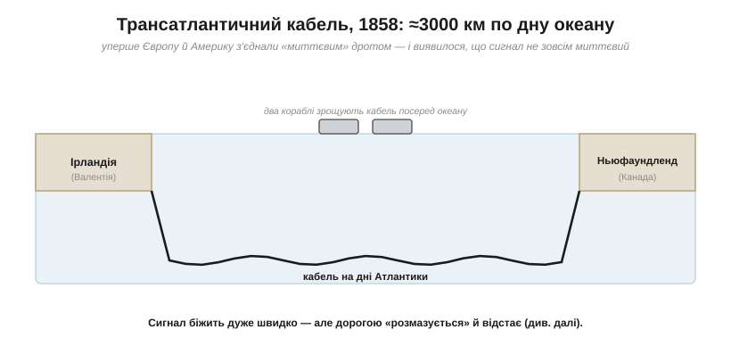
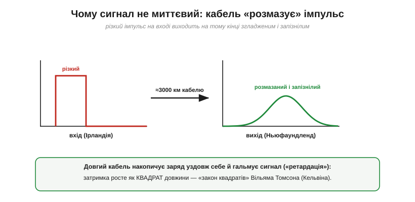
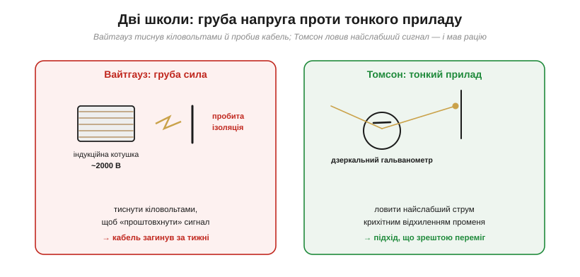

# 📜 Трансатлантичний кабель 1858 року: сигнал швидкий, але не миттєвий

> Лампа спалахує одразу, бо команда «руш!» — [електричне поле](topic:physics/signal-speed) — летить дротом майже зі швидкістю світла, хоч самі електрони повзуть. Та «майже миттєво» й «миттєво» — не одне й те саме, і на коротких дротах різниці не видно. А коли дріт став завдовжки **три тисячі кілометрів** і ліг на дно океану, ця різниця вилізла назовні й мало не поховала найзухваліший інженерний проєкт XIX століття.

## Зухвала мрія Сайруса Філда

На середину XIX століття телеграф уже обплів суходіл, але між Європою й Америкою лишався океан: лист ішов пароплавом днів десять. Американський підприємець **Сайрус Філд** (*Cyrus West Field*) — не вчений, а завзятий ділок — загорівся ідеєю прокласти телеграфний кабель **через увесь Атлантичний океан**. Більшість вважала це божевіллям: тисячі кілометрів дроту по дну, на кілометрову глибину, у непроглядній темряві. Філд заснував компанію, переконав інвесторів і навіть уряди — британський і американський дали військові кораблі. Перша спроба 1857 року скінчилася тим, що кабель урвався й зник у безодні. Та в серпні 1858-го, після кількох героїчних рейсів, кабель нарешті ліг: від **Валентії** в Ірландії до **Триніті-Бей** на Ньюфаундленді.

*Кабель 1858 року: ≈3000 км від Валентії (Ірландія) до Ньюфаундленду, по дну Атлантики. Два кораблі зрощували його посеред океану й розходились у різні боки. Уперше звістка між континентами могла йти хвилини, а не дні, — але, як виявилось, не миттєво.*

Інженерний бік очолював **Чарльз Брайт** (*Charles Tilston Bright*), якого за вдалу прокладку висвятили в лицарі просто на пристані. Два кораблі сходилися посеред океану, зрощували обидві половини кабелю й розходились у протилежні боки, розмотуючи його з велетенських котушок.

## Як кабель лягав: рейси крізь шторм і розриви

Дорога до того серпня була справжнім жахіттям. Перша спроба 1857 року скінчилася швидко: кабель, що його розмотували від берегів Ірландії, не витримав напруги гальмівної машини й **урвався** за кількасот кілометрів, навіки зникнувши на чотирикілометровій глибині. Наступного року змінили стратегію: тепер два кораблі — британський «Агамемнон» і американський «Ніагара» — сходилися **посеред океану**, зрощували кінці й пливли в протилежні боки, кожен до свого берега. Та й тут кабель рвався раз за разом — то біля самого зрощення, то за сотні кілометрів, і щоразу доводилося вертатися й починати заново.

А в червні 1858-го «Агамемнон», навантажений половиною кабелю, заскочив **лютий шторм**, що тривав днями: судно з велетенською вагою дроту в трюмах кидало так, що воно мало не перекинулося, а команда вже прощалася з життям. Корабель уцілів дивом. Лише з третьої спроби, на початку серпня, зрощення витримало, і обидва кінці нарешті досягли берегів. Те, що кабель узагалі ліг, було на межі неможливого — і вже самé це здавалося тріумфом.

## Тріумф, що тривав тижні

Коли по кабелю пройшли перші сигнали, обабіч океану вибухнуло свято. Королева Вікторія й президент Б'юкенен обмінялися вітальними телеграмами; у Нью-Йорку влаштували паради й салюти (одним з яких ледь не спалили ратушу). Уперше в історії звістка перетнула Атлантику не за тиждень, а за лічені години. Здавалося, світ стиснувся назавжди.

Та з самого початку щось було глибоко не так. Сигнали проходили **жахливо повільно** й розпливчасто. Вітальне повідомлення королеви — менше сотні слів — передавали **близько шістнадцяти годин**. Оператори ледь розбирали крапки й тире, що зливалися в кашу. А за три тижні, переславши 732 повідомлення, кабель **замовк назавжди**. Захват змінився гірким розчаруванням; дехто навіть запідозрив, що всю історію вигадали шахраї заради біржової гри.

## Чому сигнал «застрягав»

Розгадка — у фізиці. Довгий підводний кабель — це не просто дріт. Це провідна жила в ізоляції, а зовні — солона морська вода, теж провідник. Виходить довжелезний **накопичувач заряду** вздовж усієї лінії ([ємність](topic:electronics/capacitance)), та ще й із чималим опором самої жили. Коли в такий кабель «штовхають» різкий телеграфний імпульс, він **не вилітає** на тому кінці таким самим різким: лінія спершу мусить накопичити заряд уздовж себе, а опір гальмує цей процес — і імпульс **розпливається** в часі та **відстає**.

*Чому сигнал застрягав. Різкий телеграфний імпульс, посланий з одного кінця, виходив на іншому розмазаним і запізнілим: довгий кабель накопичує заряд і гальмує його («ретардація»). Томсон передбачив це «законом квадратів» — затримка росте як квадрат довжини.*

Це явище назвали **ретардацією** (*retardation*). Над 3000 км воно було таке сильне, що сусідні крапки й тире наповзали одне на одне, — тому й доводилося стукати ключем нестерпно повільно. І ось що тут головне: [сигнал](topic:physics/signal-speed) справді біжить **дуже швидко**, але не миттєво й не без спотворень. На короткому дроті в кімнаті цього не помітиш; на трансатлантичному — це питання життя чи смерті проєкту.

Найприкріше, що це **передбачали заздалегідь**. Шотландський фізик **Вільям Томсон** (*William Thomson*, згодом лорд Кельвін) ще 1855 року вивів свій **«закон квадратів»**: затримка в кабелі росте як **квадрат його довжини** — подвоїти довжину означає вчетверо збільшити загаювання. З цього прямо випливало, що трансатлантичний кабель буде драматично повільніший за короткий, і що гнати по ньому сигнал наскоком — марно.

## Дві школи: Вайтгауз проти Томсона

Тут і зіткнулися два світогляди. «Електриком» компанії був **Вайтгауз** (*Edward Orange Wildman Whitehouse*) — у минулому хірург, самоук, що вірив у **грубу силу**: якщо сигнал слабкий — натиснемо дужче. Він заперечував Томсонів закон квадратів і ганяв у кабель високу напругу — велетенськими індукційними котушками десь до 2000 вольтів (а імпульсами, кажуть, і значно більше). Саме ці кіловольтні удари й добивали й без того крихку ізоляцію кабелю.

*Дві школи. Вайтгауз «проштовхував» сигнал високою напругою (~2000 В) — і пробивав ізоляцію кабелю. Томсон натомість винайшов дзеркальний гальванометр, що ловив найслабший струм крихітним відхиленням світлового променя. Рацію мав Томсон.*

Томсон же розумів: не тиснути треба, а **краще слухати**. Він винайшов **дзеркальний гальванометр** — на котушці гальванометра кріпилося крихітне дзеркальце, що відкидало промінь світла на далеку шкалу; найслабший струм ледь повертав котушку — а світлова пляма помітно бігла шкалою. Низька напруга, чутливий приймач. Томсон і сам ходив у рейси з прокладки, особисто чергуючи біля свого приладу, — і не раз саме його чутливість витягувала зв'язок, коли сигнал ледь жеврів; згодом ці патенти принесли йому й неабиякі статки. Після того як кабель сконав, Вайтгауза звільнили (менш ніж за два тижні після прокладки), а слідча комісія 1861 року поклала на нього головну провину.

## Чи був Вайтгауз єдиним винним

Спокусливо зробити з цього просту казку: дурень-Вайтгауз усе зіпсував, геній-Томсон урятував. Частка правди тут є — високовольтні удари Вайтгауза справді шкодили, а Томсонова фізика справді була правильна. Та чесніша картина складніша, і новітні дослідники (зокрема Брюс Гант у книжці «Imperial Science», 2021) застерігають від єдиного цапа-відбувайла. Кабель 1858 року був **кепсько виготовлений**, погано зберігався (частину тримали на сонці, аж псувалася ізоляція) і зазнав ушкоджень ще під час прокладки. Дуже ймовірно, що він **усе одно б невдовзі помер** — навіть якби ним керував самий Томсон. Тож винних було багато, і чесний урок не «один телепень усе занапастив», а інший: складна задача потребує водночас **правильної фізики, доброго матеріалу й дбайливого поводження** — а кабелю 1858-го бракувало щонайменше двох останніх.

## Перемога фізики: кабель 1866 року

Філд не здався. Через Громадянську війну в США справа загальмувала, спроба 1865-го (уже з велетенським пароплавом «Грейт-Істерн») знову урвалася — але **1866 року** новий, кращий кабель ліг і **запрацював надійно**; ба більше, підняли з дна й добудували торішній. Цього разу все робили **за Томсоном**: якісніша жила, низька напруга, дзеркальний гальванометр на прийомі. Постійний телеграфний зв'язок між континентами нарешті став реальністю. Томсона за це (та інші заслуги) висвятили в лицарі, а згодом зробили лордом Кельвіном; Філда вшановували як героя.

## Що лишилося нам

Головний урок цієї історії простий: [сигнал](topic:physics/signal-speed) біжить **швидко, але не миттєво**, а в реальній довгій лінії він ще й **розмазується та відстає** — бо лінія накопичує заряд і має опір. Це «гальмування» нікуди не зникло: воно й досі — головний ворог швидких сигналів на довгих лініях. Та сама ретардація обмежує, як швидко можна «цокати» дані довгою доріжкою на платі, кабелем USB чи електронікою підводного оптоволокна. Кожен інженер швидкісних схем і нині воює з привидом 1858 року — лише в новому вбранні.

А ще лишилися інструменти й теорія: дзеркальний гальванометр Томсона започаткував цілу родину надчутливих приладів, а його математика кабелю виросла в теорію довгих ліній. І лишився людський урок — що великі справи стоять на трьох ногах одразу: упертості (Філд), правильної фізики (Томсон) і чесного визнання **всіх** причин невдачі, а не пошуку одного винного.
