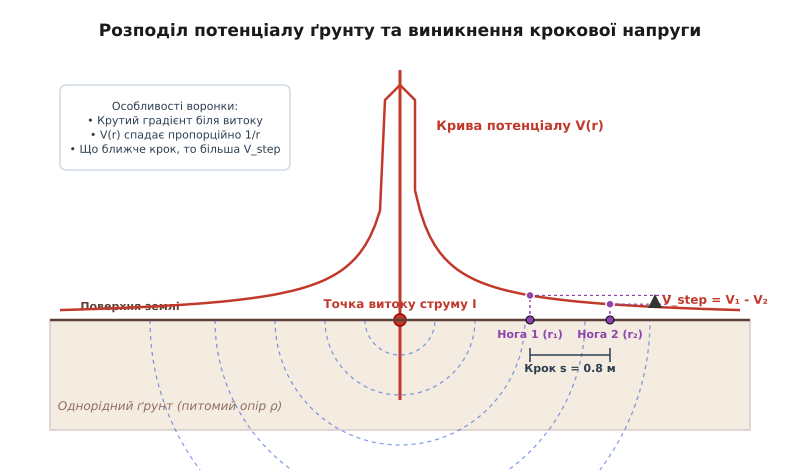
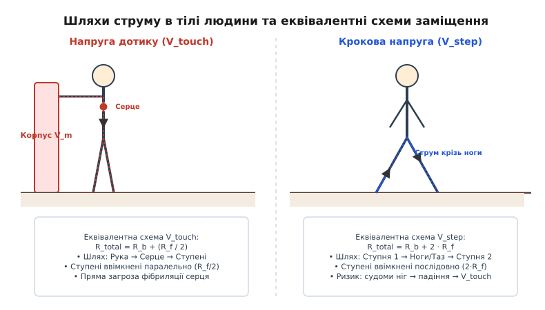
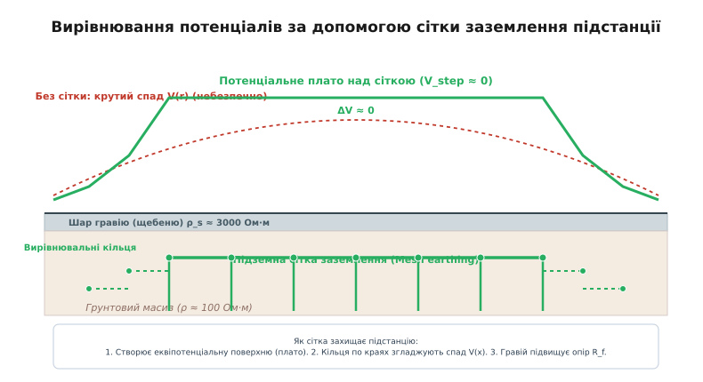
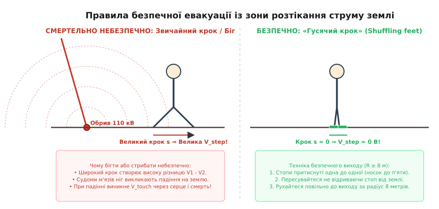

# Крокова й дотикова напруга

<preknowlist>
- [Електричний потенціал](book:physics/electric-potential) — потенціал точки поля, потенціальна енергія одиничного заряду та різниця потенціалів.
- [Струм і безпека](book:physics/current-safety) — дія струму на людське тіло, пороги фібриляції та опір шкіри й тканин.
- [Джоулеве тепло](book:physics/joule-heating) — виділення теплової енергії під час проходження струму крізь провідне середовище.
- [Закон Ома](book:electronics/ohms-law) — зв'язок між напругою, струмом та опором у провіднику.
- [Безперервність струму](book:physics/current-continuity) — збереження електричного заряду та закони розподілу струмів.
</preknowlist>

Під час сильньої штормової негоди в металеву опору високовольтної лінії електропередачі напругою 110 кіловольтів влучає розряд блискавки струмом 50 000 амперів, або внаслідок падіння дерева на вогкий ґрунт обривається та лягає фазний провідник. Величезний аварійний струм витікає в землю, розтікаючись в усі боки через масив ґрунту. Людина, яка перебуває за шість метрів від місця падіння і не торкається жодного провідника, робить звичайний крок — і зненацька отримує важкий удар струмом між ступнями. Її ноги зводить судомна біль, вона втрачає рівновагу, падає на вогку землю — і в момент торкання ґрунту долонями гине від фібриляції серця. Чому звичайна земля під ногами перетворюється на смертельну пастку, звідки береться різниця потенціалів на відстані одного кроку у 80 сантиметрів, і чому дотик до металевого паркану підстанції може вбити швидше, ніж ходіння по ґрунту?

---

### Фізика витікання струму в ґрунт та утворення потенціальної воронки

У повсякденній електротехніці земля сприймається як «ідеальний нульовий провідник» із нескінченною ємністю. Проте з точки зору фізики суцільних середовищ ґрунт — це неоднорідний провідник із скінченним питомим електричним опором `ρ`, який коливається від 10 Ом·м для вологої глини чи торфу до 3000 Ом·м для сухого гравію, піску чи граніту. 

Провідність ґрунту має не електронний (як у металах), а [іонний характер](book:physics/ionic-conduction): носіями заряду слугують іони солей та кислот, розчинені у підгрунтовій волозі. Коли електричний струм `I` стікає з заземлювального електрода чи обірваного високовольтного дроту у земляний масив, він починає розтікатися в усі боки через об'єм ґрунту.

Розглянемо базову теоретичну модель: заземлювальний електрод у формі напівсфери радіуса `r₀`, занурений у плоску поверхню землі врівень із ґрунтом.


*Розподіл потенціалу V(r) на поверхні землі навколо точки витоку струму. Формується потенціальна воронка: градієнт напруги найкрутіший поблизу електрода, а різниця потенціалів між точками на відстані кроку s задає крокову напругу V_step.*

Струм розтікається крізь концентричні півсферичні шари ґрунту. Площа поверхні півсфери радіуса `r` (де `r ≥ r₀`) становить `S(r) = 2·π·r²`. Згідно з [законом збереження заряду та безперервності струму](book:physics/current-continuity), повний струм через кожен півсферичний шар є однаковим. Звідси густина струму `j(r)` стрімко спадає з віддаленням від джерела:

```
j(r) = I / S(r)
= I / (2·π·r²)
```

За диференціальною формою [закону Ома](book:electronics/ohms-law) для суцільного провідного середовища `j = E / ρ`, локальна густина струму викликає в ґрунті електричне поле з напруженістю `E(r) = ρ·j(r)`:

```
E(r) = ρ·I / (2·π·r²)
```

Потенціал точки на поверхні землі `V(r)` обчислюється як інтеграл напруженості електричного поля від точки `r` до нескінченності (де потенціал глибинного масиву землі приймається за нуль, `V(∞) = 0`). Отримуємо фундаментальне рівняння розподілу потенціалу на поверхні ґрунту:

```
V(r) = ∫ [від r до ∞] E(r') dr'
= (ρ·I / (2·π)) · ∫ [від r до ∞] (1 / r'²) dr'
= ρ·I / (2·π·r)
```

Графік залежності `V(r)` у тривимірному просторі має вигляд лійки або поверненого конуса — у науковій та інженерній літературі цей розподіл називають **потенціальною воронкою** (або воронкою розтікання струму).

Потенціальна воронка розтікання має дві фундаментальні фізичні особливості:
1. **Максимум потенціалу в центрі витоку**: На самому заземлювальному електроді (`r = r₀`) потенціал сягає максимального значення `V₀ = ρ·I / (2·π·r₀)`. Під час коротких замикань на високовольтних підстанціях напругою 110–750 кВ аварійний потенціал `V₀` може сягати десятків тисяч вольтів відносно віддаленої землі.
2. **Крутий спад напруги біля джерела**: Оскільки напруженість електричного поля `E(r)` пропорційна `1/r²`, потенціал спадає найшвидше саме у перших 1–3 метрах від точки заземлення. На відстані 8–10 метрів крива `V(r)` виполажується, і потенціал наближається до нульового значення.

#### Тепловий ефект випаровування вологи в ґрунті
Під час протікання великих аварійних струмів (тисячі амперів) у місці заземлення виділяється величезна [джоулева теплота](book:physics/joule-heating) з питомою потужністю `p = ρ·j²`. У точці контакту дроту з землею температура ґрунту миттєво зростає понад 100 °C, що викликає бурхливе випаровування підгрунтової вологи. 

Сухий ґрунт втрачає іонну провідність, і його питомий опір `ρ` зростає у сотні разів. Це призводить до ще стрімкішого зростання потенціалу `V₀` та утворення електричної дуги на поверхні. При ударах блискавки в піщаний ґрунт висока температура каналу (понад 1500 °C) викликає сплавлення кварцевих піщинок у скляні порожнисті трубки — фульгурити.

> 📜 Детальніше про те, як спостереження за загибеллю коней біля трамваїв на початку XX століття привели до відкриття потенціальних воронок: [Історія дослідження крокової напруги та нормування безпеки заземлень](book:physics/step-voltage/hist-step-touch.md).

> 🔧 **Навіщо це.** Без розуміння фізики потенціальної воронки неможливо спроектувати безпечне заземлення. Звичайне закопування одиночного залізного стержня створює стрімку воронку з колосальними градієнтами напруги довкола. Для створення безпечних об'єктів інженери змушені штучно «розплющувати» цю воронку, перетворюючи її на пласке потенціальне плато.

---

### Крокова напруга: механізм, шлях струму та подвійна загроза

Якщо людина іде по поверхні землі у зоні розтікання струму, її ступні опиняються у точках із різними радіусами від центра витоку: одна нога у точці `r₁`, а друга — у точці `r₂ = r₁ + s`, де `s` — довжина кроку (за міжнародними та українськими нормами приймається `s = 0.8` м).

**Крокова напруга** (`V_step`) — це різниця потенціалів між двома точками поверхні землі на відстані кроку людини (`s = 0.8` м), яка виникає в зоні розтікання електричного струму в ґрунт.

Математично крокова напруга дорівнює різниці потенціалів потенціальної воронки у точках розташування ступень:

```
V_step = V(r₁) - V(r₁ + s)                       [означення крокової напруги як різниці потенціалів]
= (ρ·I / (2·π·r₁)) - (ρ·I / (2·π·(r₁ + s)))      [підстановка виразів потенціалу V(r)]
= (ρ·I / (2·π)) · (1/r₁ - 1/(r₁ + s))             [винесення спільного множника ρ·I/(2·π)]
= ρ·I·s / (2·π·r₁·(r₁ + s))                       [зведення до спільного знаменника]
```

> 🧮 Повний математичний вивід для сферичних, стержневих та сіткових заземлювачів: [Розрахунок потенціального поля напівсферичного заземлювача, крокової та дотикової напруг](book:physics/step-voltage/math-hemispherical-ground.md).

**Приклад (розподіл небезпеки за відстанню).** Нехай струм однофазного короткого замикання `I = 1000` А стікає в земляний масив із питомим опором `ρ = 100` Ом·м. Людина робить крок `s = 0.8` м:

```
На відстані r = 1.0 м від точки замикання:
V(1.0) = 100 · 1000 / (2 · 3.14159 · 1.0) ≈ 15915 В
V(1.8) = 100 · 1000 / (2 · 3.14159 · 1.8) ≈ 8842 В
V_step = 15915 - 8842 = 7073 В

На відстані r = 3.0 м від точки замикання:
V(3.0) = 100 · 1000 / (2 · 3.14159 · 3.0) ≈ 5305 В
V(3.8) = 100 · 1000 / (2 · 3.14159 · 3.8) ≈ 4188 В
V_step = 5305 - 4188 = 1117 В

На відстані r = 8.0 м від точки замикання:
V(8.0) = 100 · 1000 / (2 · 3.14159 · 8.0) ≈ 1989 В
V(8.8) = 100 · 1000 / (2 · 3.14159 · 8.8) ≈ 1808 В
V_step = 1989 - 1808 = 181 В
```

На відстані одного метра від дроту крок створює різницю потенціалів понад 7 кіловольтів, на відстані 3 метрів — більше 1.1 кіловольта, а на межі 8-метрової зони напруга спадає до безпечних величин.

#### Фізіологічний механізм ураження та подвійна загроза

Анатомічний шлях проходження струму при кроковій напрузі: **«ступня 1 → нога → таз → нога → ступня 2»**. 

На перший погляд здається, що такий шлях є менш небезпечним порівняно з дотиком рукою, оскільки струм протікає крізь нижню частину тулуба і в перші мілісекунди не перетинає безпосередньо грудну клітку та серце. Чому ж тоді крокова напруга щорічно стає причиною багатьох смертельних випадків?

Підступність крокової напруги полягає у **двоетапному біомеханічному механізмі ураження**:

1. **Етап 1: М'язові судоми ніг (поріг невідпускання)**. Коли струм крізь ноги перевищує 15–20 міліампер ([поріг судомного скорочення м'язів](book:physics/current-safety)), литкові м'язи та м'язи стегон мимовільно стискаються. Порушується нервова регуляція іонних каналів м'язових волокон, людина втрачає контроль над ногами і не може зробити наступний крок чи відступити назад.
2. **Етап 2: Падіння та зміна шляху струму через серце**. Втративши контроль над м'язами, людина неминуче падає на землю. При падінні відстань між точками контакту тіла із землею зростає з 0.8 м до 1.5–2.0 метрів (від стоп до долонь чи голови). Але найстрашніше — шлях струму миттєво змінюється з «нога — нога» на **«рука — груди — серце — ноги»**. Струм починає протікати безпосередньо через серцевий м'яз, що при струмах понад 100 мА викликає миттєву фібриляцію шлуночків серця та зупинку кровообігу.

Саме тому під час перебування в зоні розтікання струму найголовніше правило безпеки — **за будь-яку ціну втриматися на ногах і не торкнутися землі руками**.

#### Чому тварини гинуть від крокової напруги частіше за людей?
Велика рогата худоба (корові, коні, вівці) набагато чутливіша до крокової напруги, ніж людина. Це зумовлено трьома фізико-анатомічними факторами:
1. **Більша довжина кроку (`s = 1.4 – 1.8` м)**: Відстань між передніми та задніми копитами у 2 рази більша за крок людини, що призводить до пропорційно більшої крокової напруги `V_step`.
2. **Анатомічний шлях через серце**: Струм іде за шляхом «передні ноги → груди → серце → задні ноги», тобто з самого початку перетинає серцевий м'яз.
3. **Відсутність взуття**: Опір копыт у вологому ґрунті є мінімальним (`R_f → 0`), а опір тіла тварини `R_b ≈ 500` Ом є нижчим за опір людини.

---

### Дотикова напруга: чому торкатися металоконструкцій небезпечніше, ніж ходити

Розглянемо іншу аварійну ситуацію на високовольтній підстанції чи промисловому підприємстві. Унаслідок пошкодження ізоляції фазний провід пробив на металевий корпус трансформатора, очікувальний паркан чи опора ЛЕП. Металоконструкція з'єднана з заземлювачем і набуває потенціалу `V_m = V₀`.

Людина стоїть на землі на відстані `r` від заземлювача і торкається рукою корпуса обладнання.


*Порівняння шляхів струму та схем заміщення для напруги дотику (ліворуч) та крокової напруги (праворуч). При дотику ступні увімкнені паралельно (R_f/2), а струм іде безпосередньо крізь серце.*

**Дотикова напруга** (`V_touch`) — це різниця потенціалів між корпусом обладнання (чи металоконструкцією), що опинився під напругою короткого замикання, та точкою поверхні землі, на якій стоять ноги людини, яка торкається цього обладнання.

Математично дотикова напруга виражається формулою:

```
V_touch = V_m - V(r)                               [означення дотикової напруги]
= V₀ - V(r)                                        [потенціал корпуса дорівнює потенціалу електрода V₀]
= (ρ·I / (2·π·r₀)) - (ρ·I / (2·π·r))               [підстановка формули потенціалу V(r)]
= ρ·I·(r - r₀) / (2·π·r₀·r)                        [зведення до спільного знаменника]
```

#### Чому дотикова напруга набагато смертоносніша за крокову?

Порівняльний аналіз електричних кіл показує, що за одного й того ж значення напруги джерела дотикова напруга представляє набагато вищий рівень небезпеки з двох фундаментальних причин:

##### 1. Анатомічний шлях струму через серце
При дотику струм протікає за шляхом **«рука → легені → серце → тулуб → ноги → земля»**. Струм силою всього 50–100 мА, що проходить крізь серцевий м'яз протягом 0.1 секунди, зриває злагоджену роботу серця у фібриляцію. При кроковій напрузі струм іде лише через ноги, і для фібриляції потрібен у 5–10 разів більший струм (або падіння тіла).

##### 2. Менший загальний опір еквівалентного кола
Розглянемо еквівалентні схеми заміщення людського тіла за стандартом IEEE Std 80:
- Прийнятий опір тіла людини при напругах понад 100 В: `R_b = 1000` Ом (оскільки роговий шар шкіри електрично пробивається).
- Опір контакту однієї ступні з землею: `R_f = ρ / (4·a) ≈ 3.125·ρ` (де `a = 0.08` м — еквівалентний радіус ступні).

Обчислимо загальний опір кола для двох випадків:

- **Коло крокової напруги**: Ступні людини знаходяться у двох різних точках із потенціалами `V₁` та `V₂`. Вони увімкнені **послідовно**:

```
R_total_step = R_b + R_f1 + R_f2
= R_b + 2·R_f
```

- **Коло дотикової напруги**: Обидві ступні людини стоять на землі поруч (на однаковому потенціальному рівні `V(r)`), а струм з обох ніг стікає в землю одночасно. Ступні увімкнені **паралельно**:

```
R_total_touch = R_b + (R_f / 2)
```

Оскільки `R_total_touch < R_total_step`, за однієї й тієї ж напруги струм крізь тіло при дотику завжди буде **значно більшим**, ніж при кроці!

```
Приклад (ґрунт ρ = 100 Ом·м, R_f = 312.5 Ом, напруга V = 500 В):
R_total_step = 1000 + 2 · 312.5 = 1625 Ом
I_step = 500 / 1625 = 0.307 А (307 мА)

R_total_touch = 1000 + (312.5 / 2) = 1156 Ом
I_touch = 500 / 1156 = 0.432 А (432 мА)
```

Струм при дотику виявився на 40% більшим, і при цьому він увесь протікає безпосередньо крізь серцевий м'яз.

---

### Інженерний захист: вирівнювання потенціалів та заземлювальні сітки

Оскільки на відкритих розподільчих пристроях (ВРП) та підстанціях напругою 110–750 кВ аварійні струми замикання на землю сягають десятків кілоампер, одиночні заземлювачі не здатні забезпечити безпеку. Віддалення від обладнання не рятує, бо територія підстанції щільно заповнена металевими конструкціями.

Для вирішення цієї проблеми інженери застосовують два головні методи: **вирівнювання потенціалів** та **застосування високоомних поверхневих покриттів**.


*Принцип дії підземної заземлювальної сітки підстанції. Сітка створює пласке потенціальне плато над своєю поверхнею, знижуючи крокову напругу ΔV майже до нуля. Периметральні кільця згладжують спад потенціалу на виході.*

#### 1. Заземлювальні сітки (Mesh Earthing Grids)
Під усією територією підстанції на глибині 0.5–1.0 м закопують замкнену сітку із мідних або сталевих смуг з розміром осередків від 3х3 м до 10х10 м. 

Коли аварійний струм стікає в сітку, потенціал усіх провідників сітки та ґрунту між ними піднімається практично до одного й того самого значення `V₀`. На поверхні землі над сіткою утворюється **потенціальне плато**. Оскільки потенціали усіх точок всередині території підстанції однакові, різниця потенціалів між ступнями ніг `V_step = V₁ - V₂` прямує до нуля! Людина може безпечно пересуватися підстанцією під час короткого замикання.

#### 2. Вирівнювальні кільця по периметру
Найкритичнішою зоною сітки є її зовнішній край. За межами сітки потенціал ґрунту стрімко падає до нуля, утворюючи крутий схил воронки. Людина, яка виходить за межі підстанції, могла б потрапити під високу крокову напругу.

Щоб згладити цей перехід, навколо сітки укладають кілька додаткових підземних контурів (**вирівнювальні кільця**), які закопують на наростаючу глибину (наприклад: 1-ше кільце — на глибині 0.5 м, 2-ге — 0.8 м, 3-тє — 1.1 м, 4-те — 1.5 м). Це перетворює крутий обрив потенціалу на плавний пологий спуск.

#### 3. Шар гравію (щебеню) високого опору
Поверхню ґрунту на території підстанцій засипають шаром сухого чистого гравію завтовшки 10–15 см. 

Питомий опір вологого гравію `ρ_s ≈ 3000` Ом·м, що у 30–50 разів перевищує опір звичайного ґрунту (`ρ ≈ 100` Ом·м). Це штучно збільшує опір контакту ступні `R_f` з 300 Ом до 6000–7000 Ом! Згідно з [законом Ома](book:electronics/ohms-law), таке колосальне збільшення опору кола `R_total` зменшує струм крізь тіло людини у 5–7 разів, гарантовано утримуючи його нижче порогу фібриляції.

> 📋 Таблиці допустимих напруг за стандартами IEEE Std 80 / IEC 60479 та коефіцієнти гравійного шару: [Нормативні параметри заземлення, питомий опір ґрунтів та допустимі напруги](book:physics/step-voltage/api-grounding-standards.md).

> ⚙️ Чисельний розрахунок 2D-сітки потенціалів ґрунту мовами C++ та Python: [Моделювання потенціального поля ґрунту та обчислення крокової напруги](book:physics/step-voltage/proj-earth-potential-sim.md).

> 🔧 **Навіщо це.** Шар гравію на підстанціях — це не елемент благоустрою чи декору, а життєво необхідний електричний ізолятор для захисту персоналу від дотикових та крокових напруг під час аварійних замикань на землю.

---

### Правила евакуації та поведінки у зоні розтікання струму

Опинитися в зоні витікання струму на землю людина може не лише на виробництві, а й у повсякденному житті: під час обриву дротів ЛЕП через буревій, падіння автомобіля на опору електромережі або після удару блискавки у дерево чи землю поруч.


*Техніка евакуації із небезпечної зони розтікання струму. Порівняння смертельно небезпечного широкого кроку (ліворуч) та безпечного «гусячого кроку» із затиснутими стопами (праворуч).*

#### Ознаки небезпечної зони та її межі
Ознаками замикання високовольтного провідника на землю є:
- Обіраний дріт, що лежить на землі, траві чи конструкціях.
- Іскріння, електрична дуга, димлення чи випаровування вологи біля точки торкання дроту.
- Гудіння землі чи металоконструкцій.

**Радіус небезпечної зони** приймається рівним **не менше 8 метрів** на відкритій місцевості та **не менше 4 метрів** у закритих приміщеннях.

#### Техніка «гусячого кроку» (Shuffling Feet)

Якщо ви виявили, що опинилися всередині 8-метрової зони навколо обірваного дроту або місця замикання, **негайно припиніть рухатися звичайним кроком!**

Для безпечного виходу із зони розтікання струму застосовують спеціальну техніку пересування — **«похідку гусаком»** (або гусячий крок):

1. **Зімкніть ступні разом**: Притисніть носок однієї ступні до п'яти другої.
2. **Не відривайте стопи від землі**: Пересувайтеся повільно, зсуваючи ступні по поверхні ґрунту, не відриваючи їх ні на міліметр і не випереджаючи одну ногу відносно іншої більше ніж на довжину пальців.
3. **Зведіть відстань кроку до нуля (`s → 0`)**: Оскільки `V_step = ρ·I·s / (2·π·r·(r + s))`, при `s ≈ 0` різниця потенціалів між ступнями стає рівною нулю (`V_step ≈ 0 B`). Струм крізь ноги не потече!
4. **Не торкайтеся сторонніх предметів**: Під час руху категорично заборонено спиратися на дерева, металеві паркани, корпуси машин чи інших людей — це миттєво створить коло дотикової напруги `V_touch`.
5. **Рухайтеся до виходу за 8-метрову межу**: Продовжуйте рухатися «гусячим кроком», аж поки не відійдете від точки замикання на безпечну відстань понад 8 метрів.

#### Поведінка у разі падіння високовольтного дроту на автомобіль
Якщо високовольтний дріт впав на ваш автомобіль, ви перебуваєте у безпеці всередині кузова завдяки ефекту екранної [клітки Фарадея](book:physics/faraday-cage). Металевий корпус автомобіля знаходиться під єдиним високим потенціалом, і всередині салону різниця потенціалів дорівнює нулю.

- **Головне правило**: Залишайтеся всередині автомобіля та не виходьте з нього до прибуття аварійної бригади РЕМ.
- **Що робити при пожежі**: Якщо автомобіль загорівся від електричної дуги і вимушена евакуація є неминучою, категорично заборонено виходити звичайним способом (ступаючи однією ногою на підніжку чи землю, а іншою торкаючись кузова). Це створить смертельну дотикову напругу `V_touch = V_car - V_ground`!
- **Правильна техніка стрибка**: Відчиніть двері, встаньте на край порога, зімкніть обидві ноги разом і **вистрибніть з автомобіля одночасно двома ногами**, не торкаючись руками кузова. Після приземлення на дві зімкнуті ступні негайно починайте пересуватися «гусячим кроком» за межі 8-метрової зони.

#### Чому заборонено бігти, стрибати або пересуватися на одній нозі?

Іноді виникає хибне уявлення, що з зони розтікання струму можна вистрибнути на одній нозі або швидко вибігти. Фізика доводить смертельну небезпечність таких дій:

- **Чому не можна бігти**: При бігу довжина кроку `s` зростає до 1.2–1.5 метра. Це збільшує крокову напругу `V_step` у два-три рази порівняно зі звичайним кроком, що гарантовано викликає судоми ніг і падіння.
- **Чому не можна стрибати на одній нозі**: Теоретично, при стоянні на одній нозі `V_step = 0`. Але на практиці людина не здатна утримувати рівновагу і стрибати на одній нозі по нерівному ґрунту протягом 8 метрів. Втрата рівноваги призводить до падіння на витягнуті руки — а це означає миттєвий смертельний удар струмом через серце.

Дотримання самоволодіння, знання фізики розтікання струму та правильна техніка «гусячого кроку» є єдиним надійним способом зберегти життя у зонах високовольтних аварій.
