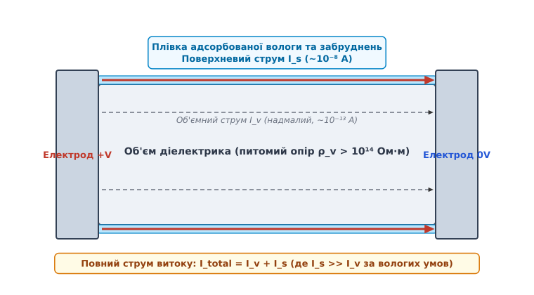
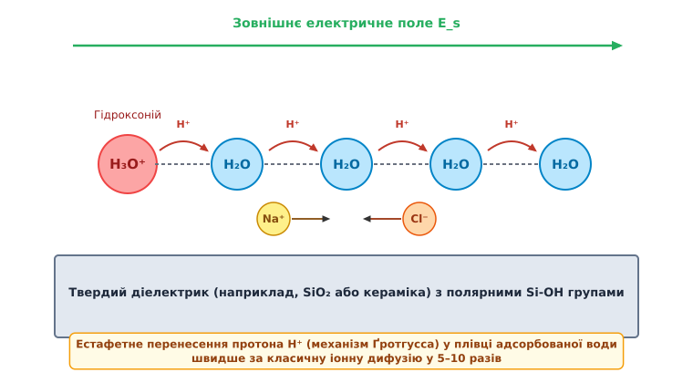
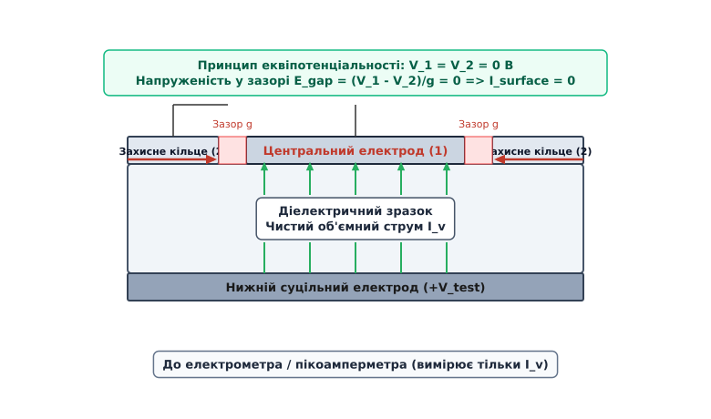
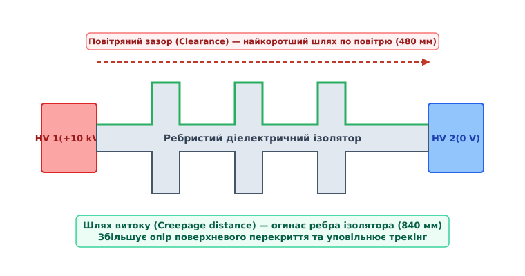

# Поверхнева провідність діелектриків: механізми, вимірювання та захист

<preknowlist>
- [Електричний струм](book:physics/electromagnetism/electric-current) — густина струму, закон Ома у диференціальній формі та носії заряду.
- [Електрична ізоляція](book:physics/electromagnetism/electric-insulation) — питомий об'ємний опір, поляризація та носії заряду у діелектриках.
- [Електричне поле](book:physics/electromagnetism/electric-field) — потенціал, напруженість електричного поля та вектор електричного зсуву.
</preknowlist>

Коли у прецизійному іонізаційному електрометрі або високовольтному ізоляторі підстанції напругою 110 кіловольт струм усередині об'єму фторопласту чи фарфору товщиною 10 сантиметрів обмежений невеликою величиною близько `10⁻¹³` ампера (завдяки об'ємному питому опору понад `10¹⁶` Ом·м), підключений прилад раптово реєструє витік струму у `10⁻⁸` ампера — на п'ять порядків більше розрахованого значення. Причиною цього колосального неспівпадіння є не дефект у товщі діелектрика, а мікроскопічний шар вологи, пилу та іонних домішок на його поверхні.

Це явище протікання електричного струму у вузькому приповерхневому шарі діелектрика під дією тангенціального електричного поля називається **поверхневою провідністю** (*surface conductivity*). На відміну від об'ємної провідності, яка визначається фундаментальною зонною структурою речовини, поверхнева провідність є результатом фізико-хімічної взаємодії поверхні твердого тіла з навколишнім середовищем. Будь-який діелектрик у реальних атмосферах перетворюється на двошарову систему: високоомну матрицю всередині та відносно низькоомну провідну плівку на межі розділу фаз.

## Фізико-хімічні джерела поверхневого витоку

Щоб зрозуміти, чому поверхня діелектрика проводить струм значно краще за його об'єм, необхідно розглянути мікроскопічну будову межі розділу «тверде тіло — газ». У глибині кристалічної ґратки або полімерної сітки кожен атом чи молекула оточені сусідніми частинками симетрично. Усі хімічні зв'язки є насиченими, а потенціальний рельєф ґратки має сувору періодичність.

На поверхні ця симетрія фундаментально порушується. Атоми поверхневого шару мають ненасичені (ненапрямлені) валентні зв'язки — так звані **поверхневі стани** (*dangling bonds*). Ці ненасичені зв'язки створюють локалізовані енергетичні рівні всередині забороненої зони діелектрика, знижують енергію активації виходу носіїв заряду та володіють колосальною хімічною активністю.

Еволюція уявлень про цей парадоксальний витік заряду розкрита у вставці 📜 [Історія досліджень поверхневого витоку: від перших електроскопів до стандартизації IEC 60093](book:physics/electromagnetism/surface-conductivity/hist-surface-leakage.md).

Головними чинниками формування провідного поверхневого шару є чотири послідовні фізико-хімічні процеси:

1. **Фізична та хімічна адсорбція вологи.** Молекули води, володіючи дипольним моментом `p = 6.17 · 10⁻³⁰` Кл·м, притягуються до полярних груп поверхні (наприклад, силанольних груп `Si-OH` на склі чи оксидах) за рахунок орієнтаційних сил та водневих зв'язків. Виникає мономолекулярний, а при підвищенні вологості — полімолекулярний шар адсорбованої води товщиною від 2 до 50 моношарів.
2. **Іонна дисоціація поверхневих солей.** Адсорбована вода володіє високою діелектричною проникністю (`ε_r ≈ 80`), що призводить до інтенсивної електролітичної дисоціації технологічних забруднень, залишків флюсу, солей та кислотних оксидів повітря. На поверхні утворюється мікроскопічний шар електроліту з високою концентрацією вільних іонів (`Na⁺`, `Cl⁻`, `H⁺`, `OH⁻`, `SO₄²⁻`).
3. **Екологічне та фотохімічне старіння.** Під дією ультрафіолетового випромінювання та озону молекулярні ланцюги полімерів розриваються з утворенням полярних карбонільних (`-C=O`) та гідроксильних (`-OH`) груп, які різко підвищують гідрофільність поверхні.
4. **Мікропористість та капілярна конденсація.** Поверхня жодного реального діелектрика не є ідеально гладкою. Наявність мікротріщин та пор радіусом `r < 100 нм` викликає капілярну конденсацію вологи при відносній вологості повітря, значно нижчій за 100% (відповідно до рівняння Кельвіна).


*Геометрія струмів витоку в діелектрику: об'ємний струм Iv протікає крізь товщу матеріалу, а поверхневий струм Is замикається вздовж тонкої поверхневої плівки адсорбату.*

Залежність поверхневої провідності від відносної вологості повітря (*RH*) описується теорією полімолекулярної адсорбції Брунауера–Еммета–Теллера (БЕТ). При низькій вологості (`RH < 30%`) адсорбується лише перший моношар води, молекули якого міцно прикуті водневими зв'язками до поверхні, тому рухливість носіїв залишається низькою. При підвищенні вологості до `RH = 70…90%` формується багатошарова рідка плівка, у якій верхні шари води за властивостями наближаються до об'ємної рідкої води, а опір падає експоненційно.

Якщо при `RH = 20%` поверхневий опір скла становить `10¹⁴` Ом, то при `RH = 80%` він падає до `10⁸` Ом — на шість порядків!

Температурна залежність поверхневої провідності підпорядковується закону Арреніуса:

```
σ_s(T) = σ_s0 · exp(-E_a / (k_B · T))
```

де `E_a` — енергія активації перенесення заряду (для іонної поверхневої провідності `E_a ≈ 0.3…0.8 еВ`), `k_B` — стала Больцмана, а `T` — абсолютна температура в Кельвінах. Збільшення температури при фіксованій кількості адсорбованої вологи прискорює дрейф іонів, але у відкритій атмосфері нагрівання одночасно викликає випаровування води, що створює складну складчасту залежність опору від температури.

## Мікроскопічні механізми перенесення заряду вздовж поверхні

Залежно від ступеня зволоження та стану поверхні, перенесення заряду вздовж діелектрика здійснюється трьома основними мікроскопічними механізмами.

### 1. Естафетний механізм Ґротгусса (Proton Hopping)

У полімолекулярній плівці адсорбованої води носіями струму є не лише важкі іони домішок, а й протони `H⁺`. Перенесення протонів відбувається за **естафетним механізмом Ґротгусса** (*Grotthuss mechanism*): протон не дифундує крізь рідину як цілісна частинка, а перескакує від одного іона гідроксонію `H₃O⁺` до сусідньої молекули води `H₂O` вздовж ланцюжка водневих зв'язків.

```
H₃O⁺ + H₂O ----> H₂O + H₃O⁺      [перескакування протона H⁺]
```

Цей процес супроводжується лише внутрішньомолекулярним перегрупуванням ковалентних та водневих зв'язків і координованим поворотом молекул води. Оскільки рухливість протона за механізмом Ґротгусса (`μ_H+ ≈ 3.6 · 10⁻⁷ м²/(В·с)`) у 5–10 разів перевищує рухливість звичайних іонів, естафетне перенесення забезпечує надзвичайно швидкий відгук поверхневого струму на зміну електричного поля.


*Мікроскопічний механічний поверхневого струму: перенесення протонів H3O+ за механізмом Ґротгусса у полімолекулярній плівці води та міграція іонів домішок Na+ і Cl- вздовж гідрофільної поверхні діелектрика.*

### 2. Іонна електроелектроміграція у рідкій мікроплівці

Коли товщина адсорбованого шару води перевищує 5–10 моношарів, у ньому формується об'ємна рідка фаза. Під дією тангенціального поля `E_s` іони домішок набувають дрейфової швидкості `v_d = μ_i · E_s`. Питома поверхнева провідність `σ_s` у цьому випадку описується закон Кольрауша про незалежну міграцію іонів:

```
σ_s = ∑ (q_i · n_s,i · μ_s,i)    [сумування за всіма типами іонів]
```

де `q_i` — заряд іона, `n_s,i` — поверхнева концентрація іонів (м⁻²), а `μ_s,i` — рухливість іонів у поверхневій плівці.

На межі розділу «діелектрик — плівка вологи» виникає **електричний подвійний шар (ПЕШ)** за моделлю Штерна–Ґраама. Поверхневий заряд твердого тіла фіксує шар протиіопів у внутрішній площині Гельмгольца, а зовні формується дифузний шар Ґуї–Чапмана товщиною порядку довжини Дебая `λ_D`:

```
λ_D = √((ε_0 · ε_r · k_B · T) / (2 · e² · I_ionic))
```

де `I_ionic` — іонна сила поверхневого розчину. Наявність ПЕШ створює тангенціальні електроосмотичні потоки рідини під дією поля, що додатково прискорює поверхневе перенесення заряду.

### 3. Плівочно-стрибкова провідність у високих полях

У абсолютно сухих умовах або на глибоко гідрофобних поверхнях (фторопласт-4, силікони) адсорбована вода відсутня. У цьому разі перенесення заряду здійснюється шляхом термічно активованих стрибків електронів або іонів між локалізованими поверхневими пастками. При зростанні напруженості тангенціального поля `E_s > 10⁶ В/м` виникає **ефект Пула–Френкеля на поверхні**, який знижує потенціальний бар'єр пасток й викликає стрімке нелінійне зростання струму:

```
σ_s(E) = σ_s0 · exp((e / (k_B · T)) · √((e · E_s) / (π · ε_0 · ε_r)))
```

Важливою особливістю поверхневої провідності є **гістерезис вологості**: при поступовому зволоженні сухість поверхні утримує опір високим до досягнення порогу капілярної конденсації, але при зворотному висушуванні утримання вологи у мікропорах зберігає високу провідність навіть при низькій вологості повітря.

## Кількісний опис та геометрія поверхневого струму

Для кількісного опису поверхневого витоку вводиться вектор **густини поверхневого струму** `j_s`, який вимірюється в амперах на метр (А/м). Він визначає струм, що протікає крізь одиницю довжини лінії, перпендикулярної напрямку вектору напруженості тангенціального електричного поля `E_s`:

```
j_s = σ_s · E_s                  [закон Ома для поверхні]
```

Скалярна величина `σ_s` називається **поверхневою провідністю** (*surface conductivity*) і має розмірність Ом⁻¹ або Сіменс (Сл).

Обернена величина називається **питомим поверхневим опором** (*surface resistivity*) `ρ_s`:

```
ρ_s = 1 / σ_s
```

### Одиниця вимірювання «Ом на квадрат» (Ом/□)

Розмірність питомого поверхневого опору `ρ_s` в системі SI збігається зі звичайним Омом (Ом). Щоб уникнути плутанини між повним опором резистора `R` та питомим опором поверхні `ρ_s`, в інженерній практиці використовують одиницю **Ом на квадрат** (позначається Ом/□ або `Ω/□`).

Фізичний зміст цієї одиниці пояснюється розрахунком опору прямокутної ділянки поверхні довжиною `L` та шириною `W`:

```
R_s = ρ_s · (L / W)
```

Якщо ділянка поверхні має форму квадрата (`L = W`), то незалежно від абсолютного розміру цього квадрата (чи це 1 мікрометр, чи 1 метр) співвідношення `L / W = 1`. Відповідно, опір будь-якого квадрата поверхні дорівнює самому питомому поверхневому опору: `R_square = ρ_s`.

Повний адмітанс `Y` діелектричного зразка на змінній частоті `ω` з урахуванням об'ємної та поверхневої компонент описується комплексною формулою:

```
Y = (G_v + G_s) + i · ω · (C_v + C_s)
```

де `G_s` — поверхнева активна провідність, а `C_s` — поверхнева ємність плівки. Поверхневі втрати характеризуються тангенсом кута діелектричних втрат `tan(δ_s) = G_s / (ω · C_s)`.

Повний постійний струм `I_total`, що протікає крізь діелектричний зразок між двома електродами, є сумою двох незалежних компонент:

```
I_total = I_v + I_s = U · (G_v + G_s)
```

де `I_v = U · G_v` — об'ємний струм, а `I_s = U · G_s` — поверхневий струм.

## Методологія вимірювання та захисне кільце (Guard Ring)

У лабораторній та промисловій практиці вимірювання питомого об'ємного опору `ρ_v` та питомого поверхневого опору `ρ_s` становить складну методологічну задачу. Якщо просто прикласти напругу до протилежних сторін діелектричної пластини, поверхневий струм `I_s`, огинаючи краї зразка, додається до об'ємного струму `I_v`. Оскільки у вологому середовищі `I_s` може перевищувати `I_v` у мільйони разів, пряме вимірювання дасть хибний об'ємний опір, занижений у мільйони разів.

### Триелектродна система із захисним кільцем

Для фундаментального відокремлення поверхневого струму від об'ємного застосовують **триелектродну вимірювальну комірку із захисним кільцем** (*Guard Ring System*), геометрична схема якої регламентована міжнародними стандартами IEC 60093 та ASTM D257.


*Конструкція триелектродного вузла із захисним кільцем: збереження однакового потенціалу між центральним електродом і кільцем обнуляє поверхневий струм у зазорі, спрямовуючи його в кола захисту.*

Комірка складається з трьох електродів:
1. **Центральний вимірювальний електрод (1)** діаметром `d₁`.
2. **Охоплювальне захисне кільце (2)** з внутрішнім діаметром `d₂` (зазор `g = (d₂ - d₁) / 2`).
3. **Нижній суцільний електрод (3)** діаметром `D > d₂`.

### Фізичний принцип еквіпотенціальності

Головний секрет роботи захисного кільця полягає у створенні **еквіпотенціального бар'єра**. При вимірюванні об'ємного опору нижній електрод підключають до джерела високої випробувальної напруги `U_test`. Центральний електрод підключають до входу електрометра (віртуальна земля, `U₁ = 0 В`), а захисне кільце з'єднують безпосередньо із заземленим корпусом (`U₂ = 0 В`).

Завдяки цьому різниця потенціалів у зазорі між центральним електродом та захисним кільцем дорівнює нулю:

```
ΔU_gap = U₁ - U₂ = 0.000 В
E_gap = ΔU_gap / g = 0 В/м
```

Оскільки напруженість поля у зазорі `E_gap = 0`, поверхневий струм у зазорі повністю пригнічується: `I_surface = σ_s · E_gap = 0 А`. Усі поверхневі струми витоку, що стікають з країв зразка, перехоплюються захисним кільцем і скидаються у землю, не потрапляючи у вимірювальний прилад. Через центральний електрод протікає **виключно чистий об'ємний струм** `I_v`.

Для вимірювання питомого поверхневого опору `ρ_s` напругу прикладають між центральним електродом і захисним кільцем, а нижній електрод підключають як захисний, перенаправляючи об'ємний струм в обхід вимірювача.

Детальний математичний розрахунок геометрії кільцевого зазору, логарифмічного коефіцієнта конверсії та чисельні приклади розділення струмів наведено у вставці 🧮 [Математика розділення об'ємного та поверхневого струмів у кільцевій геометрії](book:physics/electromagnetism/surface-conductivity/math-guard-ring.md).

Параметри випробувань, часовий регламент витримки зразків (Правило 1 хвилини) та нормативні класи матеріалів зведені у довіднику 📋 [Інтерфейс та порядок вимірювання за стандартом IEC 60093 / ASTM D257](book:physics/electromagnetism/surface-conductivity/api-surface-test.md).

## Поверхневий пробій, трекінг та інженерія високовольтної ізоляції

У високовольтній техніці поверхнева провідність є головним обмежувальним фактором надійності. Електрична міцність поверхні діелектрика у повітрі завжди значно нижча за об'ємну діелектричну міцність самого матеріалу та навіть нижча за електричну міцність чистого повітря.

Якщо об'ємний пробій якісного фарфору виникає при напруженості `E_bd ≈ 300 кВ/см`, а пробій повітряного проміжку — при `30 кВ/см`, то поверхневий пробій (перекриття по поверхні, *flashover*) вологого або забрудненого фарфорового ізолятора розгортається при напруженості всього `1…5 кВ/см`.

Фізичний механізм ініціювання поверхневого перекриття пов'язаний із наявністю **потрійної точки** (*triple junction*) — межі контакта «метал електрода — діелектрик — повітря». Через різницю діелектричних проникностей (`ε_r` діелектрика проти `ε_r = 1` повітря) на цій межі виникає локальне посилення електричного поля у 3–5 разів. Це викликає первинну автоелектронну емісію та формування лавини вторинних електронів (SEEA — *Secondary Electron Emission Avalanche*), яка стрімко поширюється вздовж поверхні.

### Механізм утворення провідних містків (Трекінг)

Найнебезпечнішим наслідком тривалого поверхневого витоку у полімерах є **трекінг** (*tracking*) — процес незворотного утворення струмопровідних вуглецевих каналів (треків) на поверхні ізолятора під дією електричного поля та забруднень.


*Геометрія високовольтної ізоляції: повітряний зазор (Clearance) є найкоротшим шляхом по повітрю, а шлях витоку (Creepage) іде вздовж огидної поверхні діелектрика з ребрами.*

Фізична послідовність розвитку трекінгу включає п'ять стадій:
1. **Протікання поверхневого струму витоку** крізь шар адсорбованого електроліту.
2. **Джоулів саморозігрів плівки**, який локально випаровує воду й створює вузькі «сухі зони» (*dry bands*).
3. **Концентрація напруженості поля** на сухій зоні, оскільки опір сухого ділянки значно вищий за опір вологої плівки.
4. **Виникнення мікродуг та мікророзрядів** крізь суху зону при досягненні критичного поля.
5. **Термічний піроліз полімеру** під дією високої температури дуги (`T > 1000 °C`) з виділенням вільного вуглецю (графітизація). Графітовий осад утворює провідний канал, який експоненційно розростається у вигляді дендрита до повного короткого замикання.

Стійкість матеріалів до трекінгу характеризується **порівняльним індексом трекінгу** (*CTI — Comparative Tracking Index*), який вимірюється напругою (у вольтах), при якій матеріал витримує 50 крапель 0.1% розчину хлориду амонію `NH₄Cl` без утворення провідного треку. Відповідно до стандарту IEC 60664-1, матеріали діляться на групи: Group I (`CTI ≥ 600 В`), Group II (`400 ≤ CTI < 600 В`), Group IIIa (`175 ≤ CTI < 400 В`) та Group IIIb (`100 ≤ CTI < 175 В`).

### Інженерні методи захисту ізоляції

Для запобігання поверхневому пробою у високовольтних конструкціях застосовують три основні геометро-матеріалознавчі прийоми:

- **Збільшення довжини шляху витоку (Creepage Distance):** На відміну від повітряного зазору (*Clearance*), який вимірюється по найкоротшій прямій лінії у повітрі, шлях витоку вимірюється вздовж огидної поверхні ізолятора. Норми IEC 60664 регламентують питому довжину шляху витоку від 16 до 31 мм на кіловольт робочої напруги залежно від ступеня забруднення атмосфери.
- **Використання ребер та «спідниць» (Sheds):** Створення розвиненого ребристого профілю ізолятора збільшує шлях витоку у 2–4 рази без збільшення загальних габаритів конструкції. Крім того, нижні поверхні ребер залишаються сухими під час дощу, розриваючи суцільну плівку електроліту.
- **Гідрофобізація та силіконові покриття:** Нанесення тонкошарових фторопластових або силіконових покриттів гарячого чи холодного затвердіння (RTV-силікони) створює високополярну поверхню з крайовим кутом змочування `θ > 100°`. Вода на такій поверхні збирається в окремі ізольовані краплі, унеможливлюючи протікання суцільного поверхневого струму. Крім того, RTV-силікони володіють ефектом самовідновлення гідрофобності: низькомолекулярні силоксани дифундують із товщі покриття на поверхню, обволікаючи шар осілого пилу.

## Захисні кільця у високоомній електроніці та друкованих платах (PCB)

У сучасних друкованих платах (PCB) витікання струму вздовж поверхні склотекстоліту FR-4 є головним ворогом прецизійних аналогових кіл. При відносній вологості 80% питомий поверхневий опір незахищеної поверхні FR-4 падає до `10⁹…10¹⁰ Ом/□`.

Для високоомного підсилювача з вхідним опором `10¹¹ Ом` витік струму із сусідньої доріжки живлення `+15 В` створює паразитний струм у кілька наноамперів, що повністю викривляє корисний сигнал пікоамперного діапазону.

### Технологія активного захисту (Driven Guarding)

Щоб усунути поверхневий витік на PCB, навколо вхідного високоомного провідника та контактного майданчика розводять замкнену доріжку — **захисне кільце** (*Guard Trace*). На цю доріжку подається потенціал із виходу операційного підсилювача (повторювача напруги), який із точністю до часток мілівольта копіює входний сигнал `V_in`.

Оскільки `V_guard = V_in`, поверхневий витік між захисною доріжкою та вхідним контактом припиняється. Усі паразитні струми витоку із зовнішніх ліній підхоплюються захисним провідником й скидаються у низькоомний вихід підсилювача.

Приклад апаратного розрахунку, схеми трасування плати та працювального коду компенсації струмів витоку наведено у вставці ⚙️ [Проектування високоомного підсилювача із захисним кільцем на друкованій платі](book:physics/electromagnetism/surface-conductivity/proj-guard-ring-pcb.md).

Базові технологічні правила проектування високоомних PCB:
1. **Видалення паяльної маски:** Паяльна маска над захисним кільцем та високоомною доріжкою повністю вилучається, оскільки полімер маски інтенсивніше адсорбує вологу, ніж очищений склотекстоліт.
2. **Двостороння симетрія:** Захисні кільця розводяться на верхньому та нижньому шарах плати симетрично та з'єднуються частими перехідними отворами (Vias).
3. **Ультразвукова відмивка:** Плати піддаються тристадійній відмивці від залишків іонних флюсів згідно зі стандартом IPC-J-STD-001.

> 🔧 **Навіщо це.**
> Розуміння та контроль поверхневої провідності є критичними у двох протилежних інженерних задачах: підтриманні цілісності високопотенційної ізоляції (силові трансформатори, підстанційне обладнання, кабельні муфти) та забезпеченні прецизійних вимірювань надмалих струмів у наноелектроніці й медичних датчиках. Без урахування поверхневого витоку неможливо спроектувати ані надійну плату для датчика іонізуючого випромінювання, ані ізолятор високовольтної лінії електропередачі.
