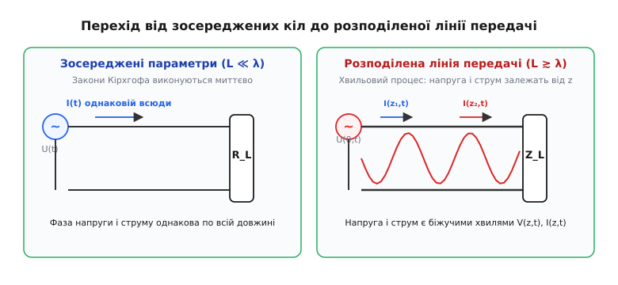
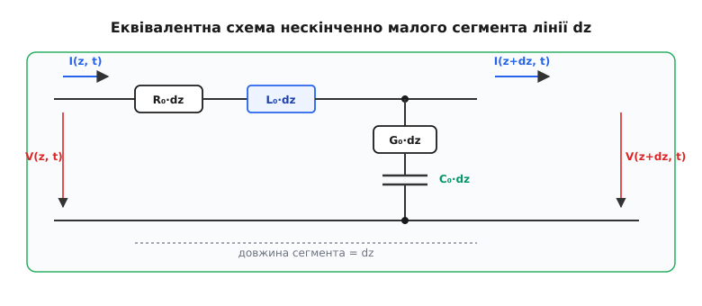
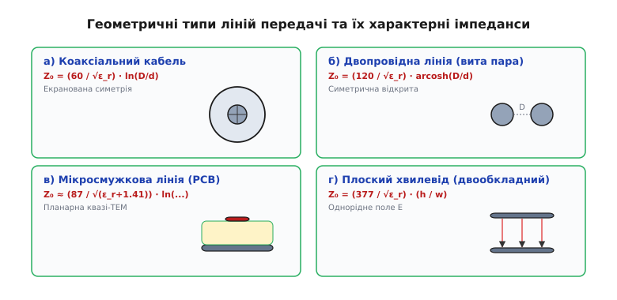
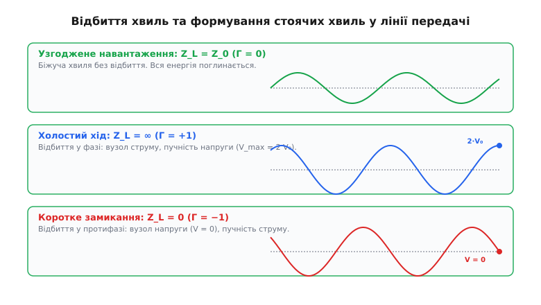

# Лінія передачі

<preknowlist>
- [Рівняння Максвелла](book:physics/electromagnetism/maxwell-equations) — фундаментальна система рівнянь для зв'язку електричних і магнітних полів.
- [Струм зсуву](book:physics/electromagnetism/displacement-current) — виникнення магнітного поля під дією змінного електричного поля у діелектрику.
- [Вектор Пойнтінга](book:physics/electromagnetism/poynting-vector) — вектор густини потоку електромагнітної енергії.
- [Характеристичний імпеданс](book:physics/electromagnetism/characteristic-impedance) — співвідношення між напругою та струмом біжучої електромагнітної хвилі.
- [Скін-ефект](book:physics/electromagnetism/skin-effect) — виштовхування високочастотного струму на поверхню провідника.
</preknowlist>

Коли у звичайному електричному колі вмикається вимикач, світло лампочки спалахує миттєво для нашого сприйняття. У класичній електротехніці вважається, що електричний струм починає протікати одночасно по всій довжині провідника, а потенціал у будь-якій точці ідеального дроту є однаковим. Проте коли час зміни напруги стає порівнянним із часом, за який світло долає відстань уздовж провідника, таке спрощене уявлення повністю ламається. Якщо по друкованій доріжці комп'ютерної плати довжиною 10 сантиметрів передається цифровий сигнал із частотою 3 Гігагерци, то за час одного коливання електромагнітна хвиля встигає пройти лише 5 сантиметрів. Це означає, що на початку доріжки напруга може досягати максимуму `+3.3 В`, у середині дорівнювати нулю, а на протилежному кінці бути від'ємною `-3.3 В`. Електричний дріт перестає бути простим з'єднувачем і перетворюється на лінійну хвилеводну систему — лінію передачі.

Назва конструкції походить від латинського слова *transmissio* (передавання, пересилання). У фізиці лінією передачі називають систему з двох або більше паралельних провідників, розділених діелектриком, яка спрямовує поширення електромагнітної хвилі вздовж свого поздовжнього напрямку. Головна відмінність лінії передачі від звичайного кола полягає у тому, що її просторові розміри `L` порівнянні з довжиною хвилі сигналу `λ` (`L ≳ 0.1 · λ`), внаслідок чого напруга й струм є функціями не лише часу `t`, а й просторової координати `z`.


*_Перехід від кола зі зосередженими параметрами (де закони Кірхгофа виконуються миттєво) до лінії передачі з розподіленими параметрами (де напруга й струм утворюють біжучі хвилі)._*

## Фізична природа ТЕМ-хвиль та розподілені параметри

У низькочастотній електротехніці провідники описуються зосередженими параметрами: загальним опором `R`, індуктивністю `L` та ємністю `C`. Для лінії передачі таке уявлення є непридатним, оскільки електричні й магнітні поля розподілені по всій її довжині.

Електромагнітна хвиля, що поширюється вздовж двох паралельних провідників, належить до типу поперечних електромагнітних хвиль (ТЕМ-хвиль, від англійського *Transverse Electromagnetic*). У ТЕМ-хвилі як вектор електричного поля `E`, так і вектор магнітного поля `H` лежать строго у поперечному перерізі лінії (перпендикулярно до осі поширення `z`), а поздовжні складові полів дорівнюють нулю: `E_z = 0` та `H_z = 0`.

Оскільки електричне поле у кожному поперечному перерізі є потенціальним, ми можемо однозначно визначити різницю потенціалів (напругу) `V(z,t)` між провідниками як лінійний інтеграл від електричного поля:

```
V(z, t) = - ∫[від 1 до 2] E · dl
```

Аналогічно, оскільки струм у провіднику створює колове магнітне поле, повний струм `I(z,t)` у перерізі `z` визначається циркуляцією вектора `H` за законом Ампера:

```
I(z, t) = ∮ H · dl
```

Оскільки електричні та магнітні поля існують у кожній точці простору довкола провідників, лінія передачі характеризується чотирма погонними (розподіленими) параметрами, розрахованими на один метр довжини:

1. **Погонна індуктивність `L_0`** (вимірюється в генрі на метр, Гн/м): описує здатність лінії запасати енергію магнітного поля `W_m = (1/2) · L_0 · I²` у просторі навколо провідників під час проходження струму.
2. **Погонна ємність `C_0`** (вимірюється в фарадах на метр, Ф/м): описує здатність лінії запасати енергію електричного поля `W_e = (1/2) · C_0 · V²` у діелектрику між провідниками під дією напруги.
3. **Погонний опір `R_0`** (вимірюється в омах на метр, Ом/м): описує омічні втрати потужності на джоулеве тепло у металі провідників. Через скін-ефект на високих частотах струм притискається до поверхні провідника, внаслідок чого `R_0` зростає пропорційно квадратному кореню з частоти `√ω`.
4. **Погонна провідність `G_0`** (вимірюється в сіменсах на метр, См/м): описує втрати струму витоку крізь діелектричну ізоляцію між провідниками внаслідок її скінченного опору та дипольної релаксації діелектрика на високих частотах.


*_Еквівалентна схема нескінченно малого відрізка лінії dz з погонним опором R₀, індуктивністю L₀, провідністю G₀ та ємністю C₀._*

Для аналізу хвильових процесів кабель розбивають на нескінченно малі сегменти довжиною `dz`. Закони Кірхгофа, застосовані до одного такого сегмента при прямуванні `dz → 0`, дають систему фундаментальних диференціальних рівнянь лінії передачі.

Строгий вивід телеграфних рівнянь безпосередньо з рівнянь Максвелла для ТЕМ-хвилі наведено у вставці [🧮 Вивід телеграфних рівнянь з рівнянь Максвелла](book:physics/electromagnetism/transmission-line/math-telegrapher-derivation.md).

## Телеграфні рівняння Хевісайда та хвильова швидкість

Застосування закону напруг Кірхгофа до верхнього провідника елементарного сегмента `dz` показує, що спад напруги на довжині `dz` спричинений омічним опором `R_0 · dz` та індуктивною проти-ЕРС `L_0 · dz · (∂I / ∂t)`:

```
V(z + dz, t) - V(z, t) = - R_0 · dz · I(z, t) - L_0 · dz · (∂I(z, t) / ∂t)
```

Поділивши обидві частини на `dz` та перейшовши до границі `dz → 0`, отримуємо перше телеграфне рівняння:

```
∂V / ∂z = - R_0 · I - L_0 · (∂I / ∂t)
```

Аналогічно, за законом струмів Кірхгофа, зміна струму вздовж лінії `dz` зумовлена витоком крізь провідність `G_0 · dz` та струмом заряджання ємності `C_0 · dz · (∂V / ∂t)`:

```
∂I / ∂z = - G_0 · V - C_0 · (∂V / ∂t)
```

Ця система з двох зв'язаних диференціальних рівнянь першого порядку описує взаємопов'язану зміну електричного та магнітного полів у лінії.

### Хвильове рівняння та швидкість поширення

Розглянемо ідеальну лінію передачі без втрат (`R_0 = 0`, `G_0 = 0`). У цьому випадку телеграфні рівняння спрощуються:

```
∂V / ∂z = - L_0 · (∂I / ∂t)
∂I / ∂z = - C_0 · (∂V / ∂t)
```

Продиференціюємо перше рівняння по `z`, а друге по `t` і підставимо вираз для мішаної похідної `∂²I / (∂z ∂t)`:

```
∂²V / ∂z²
= - L_0 · (∂²I / (∂z ∂t))                   [диференціювання першого рівняння по z]
= - L_0 · (- C_0 · (∂²V / ∂t²))             [підстановка ∂I/∂z з другого рівняння]
= L_0 · C_0 · (∂²V / ∂t²)                   [остаточне хвильове рівняння для V]
```

Отриманий вираз є класичним одновимірним хвильовим рівнянням. Воно доводить, що напруга у лінії передачі поширюється у вигляді хвилі зі швидкістю `v`:

```
v = 1 / √(L_0 · C_0)
```

Підставивши у цей вираз фундаментальні формули для погонної індуктивності `L_0` та ємності `C_0` через геометричні параметри та властивості середовища, виявляється дивовижне співвідношення: добуток погонних параметрів для будь-якої ТЕМ-лінії завжди дорівнює добутку абсолюдної магнітної та електричної проникностей ізолюючого діелектрика:

```
L_0 · C_0 = μ · ε = (μ_0 · μ_r) · (ε_0 · ε_r)
```

Звідси випливає фундаментальний фізичний висновок: швидкість поширення електромагнітної хвилі у лінії передачі визначається виключно властивостями діелектрика і не залежить від форми та розмірів провідників:

```
v = 1 / √(μ · ε) = c / √(μ_r · ε_r)
```

де `c ≈ 3 · 10⁸ м/с` — швидкість світла у вакуумі. У типових коаксіальних кабелях та платах із діелектриком з поліетилену чи склотекстоліту FR-4 (`ε_r ≈ 2.2 ... 4.4`) швидкість поширення сигналу становить від `0.5 · c` до `0.85 · c` (тобто від 150 000 до 255 000 кілометрів на секунду).

Драматичну історію відкриття телеграфних рівнянь Олівером Хевісайдом та його боротьбу проти хибної дифузійної теорії лорда Кельвіна описано у вставці [📜 Телеграфна криза XIX століття та відкриття Олівера Хевісайда](book:physics/electromagnetism/transmission-line/hist-heaviside-telephony.md).

## Вектор Пойнтінга: куди насправді тече енергія

У побутовій уявній моделі електрики вважається, що джерело живлення штовхає електроні всередині мідного дроту, і саме вони несуть енергію від джерела до навантаження. Проте ретельний аналіз електродинаміки лінії передачі розкриває зовсім іншу картину.

Середня дрейфова швидкість електронів у мідному провіднику при проходженні допустимого струму є надзвичайно малою — вона становить частки міліметра на секунду (`v_drift ≈ 10⁻⁴ м/с`). Водночас сигнал і енергія поширюються вздовж кабелю зі швидкістю понад 200 000 кілометрів на секунду.

Згідно з теорією Максвелла, носієм електромагнітної енергії є саме електромагнітне поле, а потік енергії у будь-якій точці простору задається вектором Пойнтінга `S`:

```
S = E × H
```

де `E` — вектор напруженості електричного поля, а `H` — вектор напруженості магнітного поля.


*_Розподіл полів і вектора Пойнтінга у коаксіальному кабелі: електричне поле E спрямоване радіально, магнітне H — колово, а вектор Пойнтінга S спрямований уздовж діелектрика від джерела до споживача._*

Розглянемо напрямок вектора Пойнтінга у коаксіальній лінії:
1. Електричне поле `E` створене зарядами на провідниках і спрямоване радіально від центральної жили до зовнішнього екрана.
2. Магнітне поле `H` створене струмом і утворює концентричні кола довкола центральної жили.
3. Векторний добуток `S = E × H` за правилом правої руки спрямований **строго поздовжньо уздовж лінії у просторі діелектрика** між провідниками.

Сумарна потужність `P`, яка передається через поперечний переріз лінії, дорівнює інтегралу від вектора Пойнтінга по площі діелектрика `A`:

```
P = ∬[по площі діелектрика] S · dA = V(z,t) · I(z,t)
```

Мідні провідники не несуть енергію всередині себе. Вони виконують роль «напрямних рейок» або граничних умов, які утримують і концентрують електромагнітне поле у навколишньому діелектрику. Електрони у металі лише коливаються на місці, створюючи поверхневі заряди та струми, необхідні для формування полів `E` та `H`. Якщо провідник має омічні втрати (`R_0 > 0`), вектор електричного поля заломлюється під невеликим кутом усередину металу, створюючи малу нормальну складову вектора Пойнтінга, спрямовану вглиб провідника. Ця частина енергії поглинається металом і перетворюється на джоулеве тепло.

## Відбиття хвиль, неузгодженість та стоячі хвилі

Загальний розв'язок хвильового рівняння для напруги та струму в лінії передачі уявимо у вигляді суми двох хвиль, що рухаються у протилежних напрямках:

```
V(z) = V⁺ · e^(-γ·z) + V⁻ · e^(+γ·z)
I(z) = (V⁺ / Z_0) · e^(-γ·z) - (V⁻ / Z_0) · e^(+γ·z)
```

де `V⁺` — амплітуда падаючої хвилі, `V⁻` — амплітуда відбитої хвилі, `γ = α + j·β` — комплексний коефіцієнт поширення, а `Z_0 = √(L_0 / C_0)` — характеристичний імпеданс лінії.

Коли падаюча хвиля доходить до кінця лінії `z = L`, де підключено навантаження з імпедансом `Z_L`, співвідношення між напругою та струмом на кінці має відповідати закону Ома для цього навантаження: `V(L) = I(L) · Z_L`.

Підставивши вирази для `V(L)` та `I(L)`, знайдемо коефіцієнт відбиття за напругою `Γ` (грецька літера *гамма*), який визначається як відношення амплітуди відбитої хвилі до падаючої:

```
Γ = V⁻ / V⁺ = (Z_L - Z_0) / (Z_L + Z_0)
```


*_Характер відбиття та профілі напруги при узгодженому навантаженні (Γ = 0), холостому ході (Γ = +1) та короткому замиканні (Γ = -1)._*

Фізичний аналіз трьох граничних випадків навантаження розкриває сутність хвильових явищ у лінії:

### 1. Узгоджене навантаження (`Z_L = Z_0`)
Коли імпеданс навантаження дорівнює характеристичному імпедансу лінії, коефіцієнт відбиття `Γ = (Z_0 - Z_0) / (Z_0 + Z_0) = 0`. Відбита хвиля відсутня (`V⁻ = 0`). Вся електромагнітна енергія біжучої хвилі повністю поглинається навантаженням без повернення назад у лінію. Це режим максимальної передачі потужності.

### 2. Холостий хід (розрив кола, `Z_L = ∞`)
Коли кінець лінії відкритий, струм на кінці не може протікати (`I(L) = 0`). Коефіцієнт відбиття `Γ = +1`. Падаюча хвиля відбивається повністю у фазі з падаючою. Напруга на відкритому кінці подвоюється: `V_total = V⁺ + V⁻ = 2 · V⁺`.

### 3. Коротке замикання (`Z_L = 0`)
Коли кінці провідників з'єднані між собою, напруга на кінці дорівнює нулю (`V(L) = 0`). Коефіцієнт відбиття `Γ = -1`. Падаюча хвиля відбивається в протифазі. Напруга в точці короткого замикання падає до нуля, а струм подвоюється: `I_total = 2 · I⁺`.

### Вхідний імпеданс лінії та трансформаційні властивості

Відбита хвиля, повертаючись до входу лінії, додається до падаючої хвилі і змінює співвідношення між напругою та струмом у кожній точці. Внаслідок цього вхідний імпеданс `Z_in(l)` відрізка лінії довжиною `l`, навантаженого на імпеданс `Z_L`, визначається формулою трансформації імпедансу:

```
Z_in(l) = Z_0 · ((Z_L + j · Z_0 · tan(β·l)) / (Z_0 + j · Z_L · tan(β·l)))
```

Ця формула описує фундаментальні трансформаційні властивості ліній передачі:

1. **Чвертьхвильовий трансформатор (`l = λ / 4`, `β·l = π / 2`)**:
   Для відрізка довжиною у чверть хвилі `tan(β·l) → ∞`, і формула спрощується до виразу інверсії опору:
   ```
   Z_in(λ/4) = Z_0² / Z_L
   ```
   Чвертьхвильовий відрізок перетворює коротке замикання (`Z_L = 0`) у холостий хід (`Z_in = ∞`), а високий опір — у низький. Це використовується для узгодження антен та створення високочастотних ізолюючих шлейфів.
2. **Півхвильовий повторювач (`l = λ / 2`, `β·l = π`)**:
   Для відрізка довжиною у півхвилі `tan(β·l) = 0`, тому `Z_in(λ/2) = Z_L`. Півхвильова лінія точно повторює опір навантаження на своєму вхідному кінці незалежно від власного імпедансу `Z_0`.

### Стоячі хвилі та коефіцієнт стоячої хвилі (КСХ)

При додаванні падаючої та відбитої хвиль однаковісінької частоти у лінії виникає інтерференційна картина — стояча хвиля. Вздовж лінії утворюються стаціонарні точки з мінімальною амплітудою напруги (вузли) та максимальною амплітудою (пучності), відстань між якими дорівнює половині довжини хвилі `λ / 2`.

Ступінь неузгодженості лінії оцінюється коефіцієнтом стоячої хвилі за напругою (КСХН, або англійською *VSWR — Voltage Standing Wave Ratio*):

```
VSWR = V_max / V_min = (1 + |Γ|) / (1 - |Γ|)
```

Для ідеально узгодженої лінії `|Γ| = 0` і `VSWR = 1.0`. При повному відбитті `|Γ| = 1` і `VSWR → ∞`. У високочастотній техніці неузгодженість призводить до того, що відбита потужність повертається до генератора, що може викликати його перегрів, деградацію підсилювачів та викривлення сигналу.

## Дисперсія, втрати та умова Хевісайда

У реальних лініях передачі з урахуванням омічних втрат у металі `R_0` та провідності діелектрика `G_0` комплексний коефіцієнт поширення дорівнює:

```
γ = α + j·β = √((R_0 + j·ω·L_0) · (G_0 + j·ω·C_0))
```

Якщо розкрити цей квадратний корінь, виявляється, що як коефіцієнт затухання `α`, так і фазова швидкість `v = ω / β` стають складними функціями частоти `ω`. Це спричиняє явище **дисперсії** (від латинського *dispersio* — розсіяння): різні частотні гармоніки прямокутного цифрового імпульсу рухаються з різною швидкістю та затухають з різною інтенсивністю. Внаслідок цього крутий цифровий імпульс під час руху довжиною кабелю розмивається, перекриваючись із сусідніми бітами (виникає міжсимвольна інтерференція, ISI).

Олівер Хевісайд довів, що дисперсію можна повністю усунути, якщо погонні параметри лінії задовольняють пропорцію:

```
R_0 / L_0 = G_0 / C_0
```

При виконанні цієї умови затухання стає незалежним від частоти `α = √(R_0 · G_0)`, а фазова швидкість `v = 1 / √(L_0 · C_0)` стає однаковою для всіх частот. Форма будь-якого складного сигналу зберігається ідеально.

У практичних кабелях активний опір міді `R_0` є відносно високим, а власна індуктивність `L_0` — занадто малою (`R_0 / L_0 >> G_0 / C_0`). Щоб наблизити лінію до умови Хевісайда, у телефонні кабелі через кожні 1–2 кілометри послідовно врізали індуктивні котушки Пупіна, які штучно збільшували `L_0`. Це дозволило здійснювати чіткий міжміський телефонний зв'язок на тисячі кілометрів ще до винаходу електронних підсилювачів.

## Геометричні різновиди та розрахунок ліній

Форма та розміри провідників задають конфігурацію полів і визначають величини погонних індуктивності `L_0` та ємності `C_0`, а отже й характеристичний імпеданс `Z_0`.


*_Основні геометричні формати ліній передачі: коаксіальний кабель, двопровідна симетрична лінія (вита пара), друкована мікросмужкова лінія та плоский двообкладний хвилевід._*

1. **Коаксіальний кабель** (англійська *coaxial cable*): складається з внутрішньої суцільної жили діаметром `d` та зовнішнього циліндричного екрана діаметром `D`. Електромагнітне поле повністю замкнене у діелектрику між жилою та екраном, забезпечуючи високу завадозахищеність.
   ```
   Z_0 = (60 / √ε_r) · ln(D / d)
   ```
2. **Двопровідна лінія / вита пара** (англійська *twisted pair*): складається з двох паралельних або скручених дротів діаметром `d` на відстані `D`. Симетрична конструкція зменшує випромінювання назовні.
   ```
   Z_0 = (120 / √ε_r) · arcosh(D / d)
   ```
3. **Мікросмужкова лінія** (англійська *microstrip*): планарна структура на друкованій платі (PCB), де сигнальна доріжка шириною `w` розміщена над суцільним шаром землі (Ground Plane) на відстані `h`. Хвиля є квазі-ТЕМ, оскільки частина поля проходить крізь діелектрик плати `ε_r`, а частина — крізь повітря над доріжкою.
4. **Смужкова лінія** (англійська *stripline*): сигнальна доріжка розміщена всередині діелектрика між двома суцільними земляними площинами. Забезпечує абсолютне екранування та чистий ТЕМ-режим поширення без розсіювання полів у повітря.

Детальний табличний довідник аналітичних формул, стандартних значень імпедансів (50 Ом, 75 Ом, 100 Ом) та параметрів популярних кабелів наведено у вставці [📋 Геометричні та електричні параметри ліній передачі](book:physics/electromagnetism/transmission-line/api-line-parameters.md).

## Вищі типи хвиль (TE та TM) і випромінювальні обмеження

Досі ми розглядали поширення чистої ТЕМ-хвилі, у якій поздовжні складові `E_z = 0` та `H_z = 0`. Цей режим є основним для двопровідних та коаксіальних ліній передачі. Проте при підвищенні частоти сигналу, коли довжина хвилі `λ` стає порівнянною з поперечними розмірами кабелю (`λ ≈ π · (D + d) / 2`), у лінії виникають вищі хвилеводні моди:

1. **Поперечно-електричні хвилі (ТE-моди)**: поздовжня складова електричного поля дорівнює нулю `E_z = 0`, але виникає поздовжня складова магнітного поля `H_z ≠ 0`.
2. **Поперечно-магнітні хвилі (ТM-моди)**: поздовжня складова магнітного поля дорівнює нулю `H_z = 0`, але виникає поздовжня складова електричного поля `E_z ≠ 0`.

Кожна вища мода володіє власною критичною частотою зрізу `f_cutoff`. На частотах понад `f_cutoff` вища мода починає вільно поширюватися вздовж лінії передачі разом із основною ТЕМ-хвилею. Оскільки фазові швидкості ТЕМ, TE та TM мод суттєво відрізняються, виникає сильна **модова дисперсія**, яка спотворює перенос даних і робить лінію непридатною для передачі цифрової інформації.

Для коаксіального кабелю критична частота виникнення найнижчої вищої моди `TE₁₁` визначається виразом:

```
f_cutoff(TE₁₁) ≈ (2 · c) / (π · (D + d) · √ε_r)
```

Саме через це обмеження для роботи на надвисоких частотах (наприклад, у діапазоні 18–50 Гігагерц) використовують коаксіальні кабелі надмалого діаметра (прецизійні роз'єми 3.5 мм, 2.92 мм, 1.85 мм), у яких розширено смугу одномодового ТЕМ-режиму.

## Методи термінації та цілісність сигналів на друкованих платах

У сучасній високошвидкісній цифровій техніці (Signal Integrity, SI) узгодження ліній передачі здійснюється за допомогою схем термінації, які поглинають енергію падаючої хвилі та запобігають відбиттям:

1. **Послідовна термінація (Series Termination)**: резистор `R_series = Z_0 - R_driver` встановлюється безпосередньо біля виходу передавача. Падаюча хвиля з амплітудою `V_dd / 2` поширюється лінією, відбивається від високого опору приймача з `Γ = +1`, подвоюється до `V_dd` і повертається до джерела, де повністю поглинається на резисторі.
2. **Паралельна термінація (Parallel Termination)**: резистор `R_term = Z_0` встановлюється паралельно входу приймача на землю або живлення. Хвиля поглинається на кінці лінії при першому проходженні, але коло постійно споживає статичний струм `I = V_dd / Z_0`.
3. **AC-термінація (AC Termination)**: послідовно з резистором `R_term = Z_0` підключається конденсатор малої ємності (10–100 пікофарад). Конденсатор блокує постійний струм, але забезпечує узгодження на високих частотах фронту імпульсу.

> 🔧 **Навіщо це.**
> Знання фізики ліній передачі є критично важливим у сучасній високовольтній енергетиці, радіотехніці, системному проектуванні друкованих плат (PCB Design) та конструюванні надшвидкісних цифрових шин пам'яті (DDR4/DDR5, PCIe Gen5/Gen6, USB4).
> Без урахування хвильового опору трасувальник PCB отримує сильні відбиття сигналів, дзвони на фронтах імпульсів (ringing) та сплески напруги, які руйнують логічні рівні. Проєктування трас зі строго контрольованим імпедансом (Controlled Impedance Traces) та їх правильною термінацією резисторами `R_term = Z_0` є єдиним способом забезпечити надійну роботу швидкісної електронної апаратури.

Практичну чисельну симуляцію часового відгуку лінії передачі методом 1D-FDTD для аналізу часової рефлектометрії (TDR) мовами C та C++ наведено у вставці [⚙️ Моделювання часового відгуку лінії передачі (TDR)](book:physics/electromagnetism/transmission-line/proj-line-transient-sim.md).
