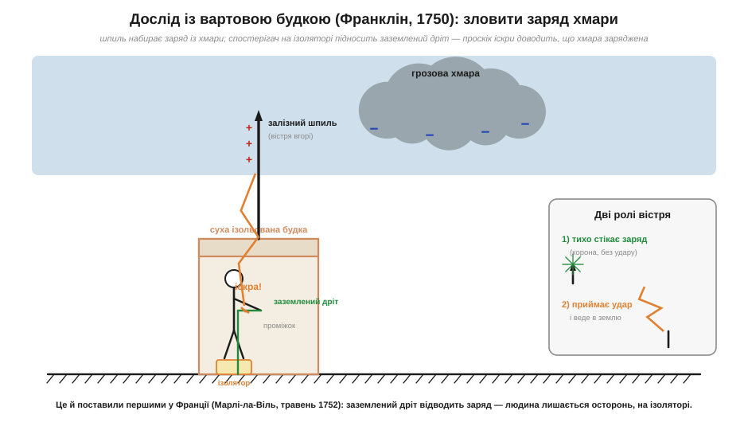
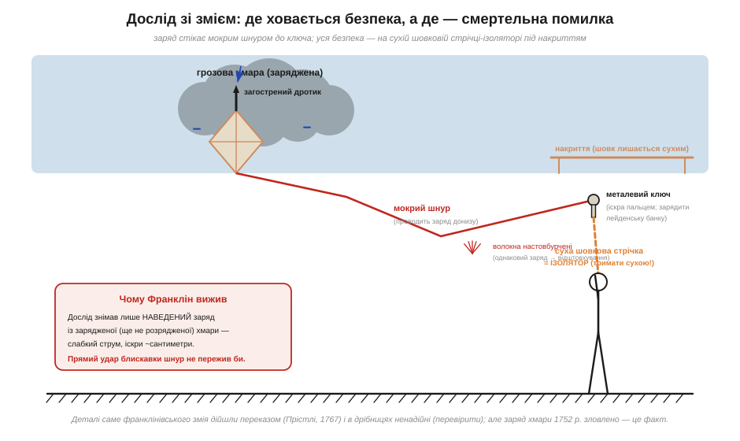
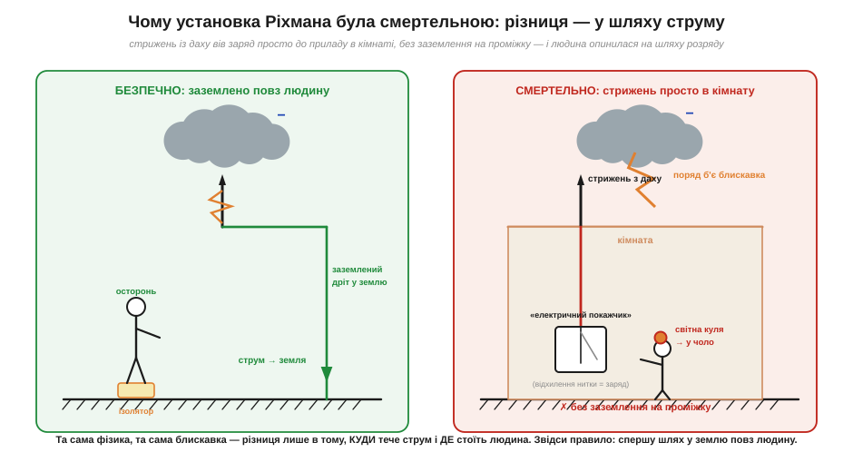

# 📜 Франклін, Ріхман і приборкання блискавки

> Ця історія — не про те, «хто винайшов громовідвід», а про **ланцюг питань**: чи блискавка — то взагалі електрика? як це довести, не загинувши? і чому той самий дослід одному приніс славу, а іншому — смерть. Це історія про найнебезпечніший експеримент XVIII століття і про те, як обережність та везіння вирішували, хто вернеться додому.

Ідеться про розряди: іскру з пальця, корону на вістрі, [пробій повітря](topic:physics/air-breakdown), [блискавку як найбільший електростатичний розряд](topic:physics/lightning). Усе це — те саме явище в різних масштабах. Але до середини XVIII століття **ніхто цього не знав**. Іскра з натертого бурштину й удар грому з неба здавалися речами з різних світів: одне — кімнатний курйоз, друге — гнів небес. Як узагалі могла зародитися думка, що це **одне й те саме**? І як її перевірити, коли «джерело» висить за кілометр угорі й б'є навмання?

---

## Іскра в кімнаті й удар з неба: звідки взялася зухвала здогадка

До 1740-х електрика була салонною розвагою. Натирали скляні кулі, заряджали **лейденську банку** (перший конденсатор — скляна посудина, обкладена фольгою зсередини й ззовні, що накопичувала заряд) і влаштовували вистави: іскри, потріскування, легкі удари по ланцюжку гостей, що побралися за руки. Це було видовищно, але здавалося дрібним явищем — нічим не пов'язаним із громовицею.

Та хто уважно дивився на ту іскру, помічав підозрілу схожість із блискавкою в мініатюрі. **Бенджамін Франклін** (*Benjamin Franklin*, 1706–1790) — друкар і політик із Філадельфії, який захопився електрикою вже зрілою людиною, — склав цю схожість у список. У його записах 1749 року є знаменитий перелік спільних рис: і іскра, і блискавка дають **світло** того самого кольору; рухаються **зиґзаґом**; **тріщать**; проходять **металами**; **запалюють** горюче; **плавлять** метал; **пахнуть сіркою**. І наприкінці чесна приписка про останній пункт — приблизно: «*електричну рідину притягують вістря. Чи не робить так і блискавка? Та оскільки вони збігаються в усьому, в чому ми можемо порівняти, то чи не схожі й тут? Хай зробить дослід.*»

> 🔧 **Навіщо це.** Це взірець інженерного мислення, яке працює й сьогодні: побачив **дві несхожі на вигляд речі з однаковим набором симптомів** — припусти, що за ними один механізм, і **придумай вирішальну перевірку**. Так само ми впізнаємо, що тріск у радіоефірі, [збій мікросхеми від дотику пальця](topic:electronics/esd-damage) і блискавка — родичі: усе це електростатичний розряд, лише різного масштабу.

Ключовим у списку було **вістря**. Франклін уже знав із дослідів у кімнаті: загострений металевий шпиль **стікає** заряд тихо й на відстані — там, де куля дала б іскру, вістря «висмоктує» заряд короною без удару (це [пробій повітря біля вістря](topic:physics/air-breakdown)). Звідси й народилася подвійна ідея: якщо хмара заряджена, то високий заземлений шпиль або **тихо зніме** з неї заряд, або **прийме** удар на себе й відведе в землю. Перше — наукова перевірка гіпотези; друге — **громовідвід**, практичний захист. Та спершу гіпотезу треба було довести.

---

## Вартова будка: як «зловити» небо, не лізучи в хмару

Франклін розумів: до хмари не дотягнешся. Тож 1750 року в листі до Лондонського королівського товариства він описав інше — як **спустити електрику з неба на землю**. Ідея, що згодом дістала назву **дослід із вартовою будкою** (*sentry-box experiment*): поставити на високому місці суху ізольовану будку, вивести з її даху вгору довгий **залізний шпиль**, а спостерігач усередині, **стоячи на ізоляторі**, піднесе до основи шпиля заземлений дріт — і якщо в грозу з проміжку проскочить іскра, то грозова хмара **таки заряджена**, як лейденська банка.

*Задум Франкліна (1750). Високий ізольований шпиль занурений у поле зарядженої хмари й сам набирає заряд. Спостерігач на ізолювальній підставці підносить заземлений дріт до основи шпиля — проскік іскри в проміжку доводить: хмара заряджена. Саме цей дослід першими поставили у Франції 1752 року. Зверніть увагу на дві ролі вістря: тихо стікати заряд (корона) — і приймати удар.*

Лист Франкліна надрукували, переклали французькою — і саме **у Франції** ідею вперше втілили в залізі. 10 травня 1752 року в містечку **Марлі-ла-Віль** під Парижем відставний драгун за вказівками натураліста **Тома-Франсуа Далібара** (*Thomas-François Dalibard*) підніс заземлений дріт до 12-метрового залізного шпиля під час грози — і **витяг іскри**. За кілька днів дослід повторив у Парижі **Делор** (*Delor*). Гіпотеза Франкліна підтвердилася — **електрика з хмари** була зловлена вперше, і зробили це французи за його кресленням.

> 🔧 **Навіщо це.** Тут видно, як працює наука як **спільна справа**, а не одиничний подвиг: американець поставив питання й описав метод, французи **першими його виконали**, і лише потім американець зробив свій варіант. Жоден із них не «винайшов усе сам» — і це нормальний хід відкриття. Атрибуція «Франклін довів, що блискавка — електрика» точна **тільки** якщо назвати поряд Далібара й Делора, які власне витягли першу іскру.

---

## Повітряний змій: славетний дослід, у деталях непевний

Сам Франклін про французький успіх ще не знав і влітку 1752 року, кажуть, поставив свій варіант — той, що увійшов у підручники. Замість будки зі шпилем — **повітряний змій** із загостреним дротиком угорі; мокрий шнур проводить заряд донизу, до шнура прив'язаний **металевий ключ**, а нижче — суха **шовкова стрічка**, за яку експериментатор тримає змія, **сам лишаючись під накриттям** (щоб шовк не змок і не став провідником). Коли гроза наближається, волокна намоклого шнура настовбурчуються — відштовхуються, бо однаково заряджені (точно як [наелектризовані тертям тіла](topic:physics/triboelectricity)), — а від ключа можна **витягти іскру пальцем** і **зарядити лейденську банку**. Заряд із неба — у руках на землі.

*Будова досліду зі змієм. Заряд стікає мокрим шнуром униз до ключа; настовбурчені волокна — ознака, що шнур заряджений. Уся «безпека» трималася на сухій шовковій стрічці-ізоляторі під накриттям. Якби в шнур ударила повноцінна блискавка, ця стрічка не врятувала б — досліду пощастило з тим, що він знімав лише **наведений заряд** із зарядженої хмари, а не прямий удар.*

Тут потрібна чесність про **статус** цієї історії *(перевірити)*. Власного докладного звіту Франкліна про дослід зі змієм **не збереглося**: коротка газетна замітка 1752 року дуже скупа, а класичний розгорнутий опис — з участю його сина **Вільяма** — з'явився аж **1767 року в «Історії електрики» Джозефа Прістлі** (*Joseph Priestley*), через п'ятнадцять років після подій і з чужих слів. Через це деталі **спірні**: історики сперечаються і про точну дату (метеоролог Ебботт Лоренс Ротч ще 1906 року доводив, що це радше пізніше літо чи рання осінь 1752-го, а не червень), і навіть — у різкішій версії (книжка Тома Такера, 2003) — чи відбувся дослід так, як його розповідають. Більшість дослідників (зокрема біограф Волтер Айзексон і археолог науки Майкл Браян Шиффер) **відкидають** версію про містифікацію: Франклін надто дорожив репутацією в ученому товаристві, щоб ризикнути вигадкою. Тож зважений висновок такий: **електрику з неба 1752 року таки зловили — це факт** (підтверджений у Марлі незалежно від змія), але **барвисті подробиці саме франклінівського змія дійшли до нас переказом і в дрібницях ненадійні**.

> 🔧 **Навіщо це.** Корисний урок і для інженера, і для читача даташитів: **відокремлюй сам факт від його ефектного переказу**. Те, що блискавка — електричний розряд, доведено надійно й багатьма руками. А «Франклін під дощем тримає змія, з ключа б'є іскра» — гарна, але джерельно слабша картинка. Так само в техніці: явище може бути реальним, а конкретна «героїчна» історія його відкриття — прикрашеною.

Важливо й те, **чому Франклін вижив**. Його дослід знімав зі шнура лише **наведений заряд** із зарядженої, але ще не розрядженої хмари — слабкий струм, що давав іскри сантиметрового масштабу. Прямого удару повноцінної блискавки тонка волога нитка просто не пережила б, і жодна шовкова стрічка не врятувала б людину. Франклінові **пощастило**, що гроза не вдарила в змія напряму. Наступний герой цієї історії виявив межу цього везіння на собі.

---

## Ріхман у Петербурзі: коли дослід убиває

Звістка про досліди з атмосферною електрикою рознеслася Європою, і їх кинулися повторювати скрізь. У столиці Російської імперії, **Петербурзі**, цим захопився фізик **Ґеорґ Вільгельм Ріхман** (*Georg Wilhelm Richmann*, 1711–1753).

Тут варто бути точним щодо того, **хто він був** — бо його часто недбало називають просто «російським ученим», і це стирає його справжнє походження. Ріхман народився 1711 року в місті **Пернау у шведській Лівонії** (*Pernau, Swedish Livonia*; нині **Пярну**, Естонія), у **балтійсько-німецькій** родині. Освіту здобував у німецькомовному середовищі, а наукову кар'єру зробив у **Петербурзькій імператорській академії наук**, куди його обрали 1741 року. Тобто за походженням і культурою він **балтійський німець**, підданий спершу шведської, потім російської корони, який працював у російській академії, — а не «російський учений» у етнічному сенсі. Ця відмінність не дрібниця: вона зберігає правду про людину, яку імперський переказ охоче приписав би «своїм».

Ріхман був насамперед **вимірювальником**: він займався калориметрією (кількістю теплоти) і хотів не просто бачити іскри, а **виміряти** електрику числом. Для цього він спорудив прилад, який називав **«електричним покажчиком»** (різновид електрометра): від металевого стрижня на даху будинку дріт ішов униз, у кімнату, до приладу зі сталевою лінійкою й підвішеною лляною ниткою — за **відхиленням нитки** від лінійки можна було оцінювати величину заряду, наведеного грозовою хмарою. Принципово це той самий шпиль із вартової будки, **заведений просто в житло** — і **без заземлення на проміжку**: ось ця деталь і стала фатальною.

*Чому установка Ріхмана була смертельною. Стрижень із даху вів заряд просто до приладу в кімнаті, без іскрового проміжку на землю біля входу (як у вартовій будці). Коли поряд ударила блискавка, весь потенціал лінії опинився на приладі — і на тому, хто стояв за крок від нього. У вартовій будці, навпаки, заземлений дріт відводив заряд, а людина лишалася на ізоляторі осторонь.*

26 липня (за старим стилем; 6 серпня за новим) **1753 року** під час засідання академії почалася гроза. Ріхман поспішив додому — спостерігати свій прилад — і взяв із собою гравера **Соколова**, щоб той замалював явище для нащадків. Коли Ріхман нахилився до приладу, оцінюючи відхилення нитки, від стрижня **відірвалася світна куля** (за свідченням очевидця) і вдарила його в чоло. Пролунав звук, «**мов із невеликої гармати**», гравера збило з ніг і приголомшило, а Ріхман загинув **миттєво**. На лобі лишилася червона пляма, на черевику — пропалений отвір. Він став **першою людиною в історії, що загинула, ставлячи електричний дослід**.

Про природу того, що його вбило, теж треба сказати чесно, із позначкою *(перевірити)*. У переказах це класичний приклад **кульової блискавки** (*ball lightning*) — і часто його так і подають як «перший задокументований випадок». Але це **інтерпретація за свідченням** гравера й за наступними описами, а не строго доведений механізм: що саме то була за світна куля, надійно встановити вже неможливо. Тож коректне формулювання таке: Ріхмана вбив **атмосферний електричний розряд**, який сучасники й пізніші автори описали як кульову блискавку, — **сам цей опис достовірний як свідчення, але фізичний статус явища лишається непевним**.

> 🔧 **Навіщо це.** Різниця між установками Франкліна й Ріхмана — це готовий урок з **техніки безпеки в роботі з високим потенціалом** (а ширше — і з ESD, і з мережею). Франклін стояв **осторонь**, на ізоляторі, і знімав лише наведений заряд; Ріхман **заземлив стрижень просто на себе** через прилад і опинився на шляху повного розряду. Та сама фізика, та сама блискавка — різниця лише в тому, **куди тече струм і де стоїть людина**. Звідси правило, актуальне й нині: спершу — надійний шлях струму в землю **повз** людину, аж потім — спостереження.

---

## Громовідвід: коли гіпотеза стала захистом на дахах

Поки Європу приголомшила загибель Ріхмана, практичний бік ідеї вже працював. Щойно довівши, що хмара заряджена, Франклін зробив очевидний для нього висновок: якщо вістря **тихо стікає** заряд, а заземлений шпиль **приймає й відводить** удар, то високий загострений заземлений шпиль на даху **захистить** будівлю — або не дасть удару статися (повільно знявши заряд), або проведе блискавку в землю повз стіни. Так народився **громовідвід** (*lightning rod*).

Тут знов варто стерегтися одноосібного міфу. Думка про захисні шпилі **витала** й до Франкліна (загострені металеві елементи на високих спорудах подекуди ставили й раніше, не розуміючи механізму), а одночасні досліди у Франції показують, що **час ідеї настав** і її підхопило багато рук. Заслуга Франкліна не в тому, що він «єдиний здогадався», а в тому, що він **звів фізику докупи**: пояснив, *чому* вістря працює, пов'язав це з природою блискавки й дав **просту, відтворювану** конструкцію, яку міг поставити будь-хто. Саме тому громовідводи швидко вкрили дахи Америки та Європи й щороку рятували незліченні будівлі.

Цікаво, що довкола громовідводу спалахнула й **технічна суперечка**, яка пережила століття: якими мають бути вістря — **гострими** (як стояв Франклін, бо вони краще стікають заряд) чи **тупими** (куля на кінці)? Сперечалися не лише фізики, а й політики: у передреволюційній напрузі гострі «франклінівські» вістря в Британії дехто оголошував мало не бунтівними, протиставляючи їм «вірнопідданські» тупі. Сьогодні зрозуміло, що для **прийому прямого удару** форма кінчика майже не важлива — головне надійний товстий провідник і добре заземлення; а **тихе стікання** короною (той самий [пробій повітря біля вістря](topic:physics/air-breakdown)) гострі вістря справді дають краще, хоч повністю «роззброїти» грозову хмару одним шпилем і не вийде.

---

## Чим це відгукнулося

Зведімо цей ланцюг у кілька висновків:

- **Блискавка — це електростатичний розряд**, той самий, що іскра з пальця, лише в колосальному масштабі. Це доведено надійно (Марлі, 1752, руками Далібара й Делора за ідеєю Франкліна) — саме так [блискавка](topic:physics/lightning) постає як найбільший електростатичний розряд.
- **Вістря стікає заряд короною**, а тупа поверхня — ні; це франклінівське спостереження має кількісне пояснення через [пробій повітря](topic:physics/air-breakdown) (корона й поле біля вістря — у згущеному [електричному полі](topic:physics/electric-field) гострого кінчика).
- **Безпека — це питання шляху струму.** Франклін вижив, бо стояв осторонь і знімав лише наведений заряд; Ріхман загинув, бо повний розряд пішов крізь нього. Цей самий принцип — «дай струму безпечний шлях повз людину» — лежить в основі заземлення [антистатичного робочого місця](topic:electronics/antistatic-workplace) і браслета через резистор 1 МОм.
- **Атрибуція — справа колективна.** Не «Франклін сам приборкав блискавку», а ланцюг: Франклін (гіпотеза й метод) → Далібар і Делор (перша іскра в Марлі) → Ріхман (трагічна ціна необережності) → громовідвід як спільне надбання доби.

А головний урок — про **ціну досліду й чесність переказу**. Той самий експеримент одному приніс безсмертну славу, іншому — смерть; різниця була у везінні й у дрібниці заземлення. І той самий експеримент дійшов до нас двома способами: як **твердо доведений факт** (хмара заряджена) і як **барвиста легенда** (Франклін зі змієм), у деталях ненадійна. Уміти бачити цю різницю — і в історії науки, і в технічному описі — не менш важливо, ніж знати саму фізику розряду.
