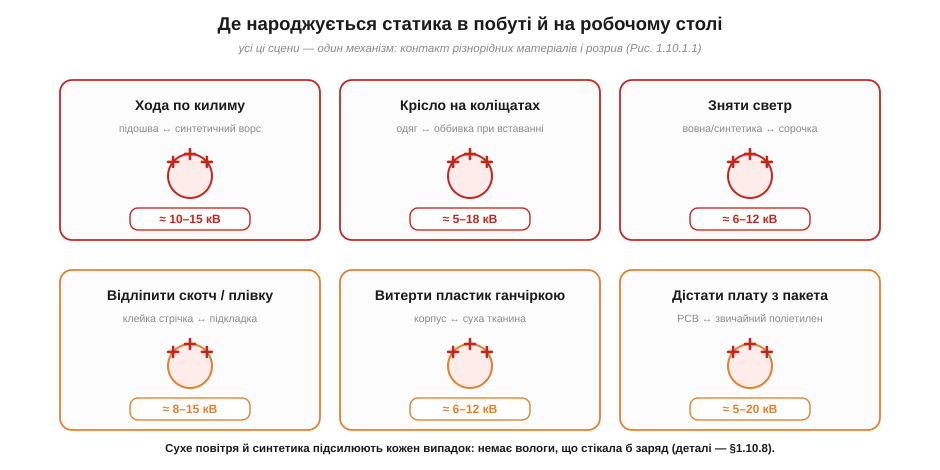

# Кіловольти з нічого: трибоелектрика в побуті й на робочому столі

Почнімо з відчуття, знайомого кожному: пройшовся кімнатою, торкнувся дверної ручки — і **клац**, укол струмом. Здається, ніби заряд узявся з повітря. Але [заряд нізвідки не береться й нікуди не зникає](book:physics/electric-charge) — він лише **перерозподіляється**. То звідки ж тоді кіловольти? Відповідь у тому, що звичайнісінькі побутові дії — хода, вставання з крісла, знімання светра — це насправді мільйони мікроскопічних актів **контакту й розриву** двох різних поверхонь. І кожен такий акт переганяє жменьку електронів з одного матеріалу на інший. Зрозуміти цей механізм — означає навчитися передбачати, де саме на робочому столі чатує небезпека для електроніки.

### Контактна електризація: справа не в терті, а в контакті й розриві

Звичне слово «наелектризувати тертям» трохи збиває з пантелику. Тертя тут не головне — воно лише **збільшує площу** дотику й кількість циклів контакт↔розрив. Сам же заряд народжується в простішому акті: дві різні поверхні **торкнулись** і **роз'єдналися**.


*Рис. Поки два матеріали порізно — обидва нейтральні. При контакті частина електронів переходить на той матеріал, що «жадібніший» до них (має нижчий енергетичний рівень для електрона). Поки поверхні разом, це нічого не означає. Але якщо їх **розірвати** — кожна забирає свій новий баланс: одна лишається з нестачею електронів (стає **+**), друга — з надлишком (стає **−**).*

Чому розрив такий важливий? Бо поки поверхні торкаються, електрони можуть вільно ходити туди-назад, і жодного стійкого заряду немає. Розрив — це мить, коли шлях для електронів раптом обривається. Якщо обидва матеріали — **провідники**, заряд встигне стекти назад через останню точку контакту, і нічого не лишиться. А от якщо хоча б один із них **ізолятор** (а більшість побутових поверхонь — пластик, гума, синтетика — саме ізолятори), електронам ніяк повернутись: вони застрягають там, куди їх занесло. Саме тому статика — це переважно явище **діелектриків**: метал розрядиться сам, пластик — ні.

Тут варто на мить зупинитись і спитати глибше: а **чому** взагалі при дотику електрони з одного матеріалу переходять на інший? Адже обидва тіла були нейтральні й нікуди не поспішали. Причина — у тому, що в різних речовинах електронам «живеться» по-різному. У кожному матеріалі є власний рівень, до якого електронові вигідно опуститись, — щось на кшталт «глибини ями», у якій він сидить (фізики звуть це **роботою виходу**, *work function*). Коли дві поверхні стикаються впритул, на межі їхні електронні хмари перекриваються, і електрони, як вода між сполученими посудинами різного рівня, перетікають туди, де «глибше» — у матеріал із сильнішим притяганням. Тому перехід **спрямований**: не туди-сюди порівну, а переважно в один бік. Скільки саме перетече — залежить від того, наскільки різні ці «глибини» у двох матеріалів; звідси й увесь трибоелектричний ряд, до якого ми зараз дійдемо.

Кожен окремий контакт переносить мізерну порцію заряду. Але уявімо ходу: підошва тисячу разів торкається й відривається від ворсу килима, і щоразу — новий мікроскопічний перенос. Заряди **додаються** (закон збереження дозволяє лише перерозподіл, але накопичення дисбалансу — будь ласка), і за хвилину на тілі вже нанокулони надлишкового заряду. На [крихітній ємності тіла](book:physics/body-charge) це дає тисячі вольтів.

Тут же ховається відповідь на старе питання, чому статика так залежить від **площі й шорсткості**. Дві ідеально гладенькі пластини торкаються лише в кількох точках — справжня площа контакту мізерна. Тертя ж притискає поверхні, зминає мікронерівності й проганяє їх одна по одній, тимчасово створюючи **тисячі нових точок контакту**, кожна зі своїм циклом дотик-розрив. Тому потерті матеріали електризуються набагато сильніше за просто притиснуті: тертя — це не окремий магічний механізм, а спосіб **багаторазово помножити** ту саму контактну електризацію. Це й пояснює, чому енергійне протирання пластику сухою ганчіркою «заряджає» його куди дужче, ніж легкий дотик.

> 🔧 **Навіщо це.** Розуміння «контакт + розрив + ізолятор» одразу підказує, де на столі небезпека. Дістаєш плату зі звичайного поліетиленового пакета — це розрив двох діелектриків, плата заряджається. Відліплюєш захисну плівку — те саме. Совгаєш компонент по пінопласту — теж. Усе, що **відривається** від пластику, треба подумки позначати як «зараз тут народилися кіловольти».

### Хто стає плюсом, а хто мінусом: трибоелектричний ряд

Чи можна сказати наперед, який із двох матеріалів віддасть електрони, а який забере? Здебільшого так. Матеріали шикуються в **трибоелектричний ряд** (*triboelectric series*) — список, упорядкований за «жадібністю» до електронів.


*Рис. Той, що **вище** в ряду, віддає електрони й заряджається **+**; нижній забирає їх і стає **−**. Чим далі матеріали один від одного в списку, тим сильніша електризація: волосся об тефлон (далека пара) б'ється потужно, бавовна об папір (сусіди) — ледь-ледь.*

Ряд пояснює не лише знак, а й **силу** ефекту. Шкіра, скло й вовна стоять угорі — вони охоче віддають електрони. Тефлон, ПВХ і поліетилен — унизу, вони електрони жадібно забирають. Потерти волосся об надувну кульку (вовна/шкіра вгорі, гума внизу) — далека пара, сильний заряд. А два схожі матеріали майже не електризуються. Це прямий практичний інструмент: добираючи одяг, килимок чи пакет для роботи з електронікою, ми хочемо матеріали **близько до середини** ряду й близько один до одного — щоб нічому було сильно заряджатись.

Чесно скажемо й про **межі** цього інструмента, бо інакше ним легко зловживати. Трибоелектричний ряд — не закон із точними числами, а радше якісне впорядкування, і в різних таблицях сусідні позиції часом міняються місцями. Причина в тому, що реальний заряд залежить не лише від самих матеріалів, а й від вологи на поверхні, забруднень, температури, навіть від того, наскільки чисто й сильно терли. Тому ряд надійно передбачає **загальну тенденцію** (хто радше стане плюсом, а хто мінусом, і чи буде заряд великим) — але не дає гарантованого числа вольтів. Для практики цього цілком досить: нам і треба знати, яких пар матеріалів уникати, а не рахувати заряд до відсотка.

### Заряд від тертя — це не «наведений» заряд

Щоб не плутати поняття, відокремимо контактну електризацію від іншого способу «наелектризувати» тіло — **електростатичної індукції**. Це різні речі, і їх корисно тримати нарізно. При **контактній електризації** (те, про що весь цей розділ) заряд **фізично переходить** з тіла на тіло: на одному його стало менше, на іншому більше, і сумарний заряд кожного тіла **змінився**. При **індукції** ж заряд нікуди не переходить — піднесене заряджене тіло лише **зсуває** наявні заряди всередині сусіда (ближчі притягуються, дальні відштовхуються, як у [поляризації](book:physics/electric-charge) соломинки), але повний заряд тіла лишається **нульовим**, поки немає дотику чи заземлення.

Чому це важливо на практиці? Бо заряджений пластиковий предмет на столі діє на чутливу плату поряд **обома** способами одразу. По-перше, він наводить (індукує) на ній зсув зарядів — і якщо в цю мить плату заземлити чи торкнутись її виводу, зсунутий заряд стече, і плата лишиться реально зарядженою (це зветься заряджанням через індукцію). По-друге, якщо предмет торкнеться плати — піде вже прямий контактний перенос. Тому небезпечним є не лише дотик зарядженого тіла, а й просто його **присутність поряд** із чутливою електронікою: поле наводить заряди, і досить одного невдалого заземлення, щоб вони «застигли» на платі. Саме тому з робочого місця прибирають усі сторонні наелектризовані діелектрики — навіть ті, до яких ніхто не збирається торкатись.

### Чому в побуті статики так багато

Тепер прикладемо механізм до реальних сцен. Виявляється, дім і робочий стіл — це фабрика статики, і майже завжди винні ті самі дві умови: **синтетика** (матеріали з країв трибоелектричного ряду) і **[сухе повітря](book:physics/humidity-static-control)** (нема вологи, що стікала б заряд).


*Рис. Усі ці сцени — один і той самий механізм: контакт різнорідних поверхонь і розрив. Типові напруги — одиниці й десятки кіловольтів. Синтетика й сухе повітря підсилюють кожен випадок.*

Найпотужніший побутовий генератор — **крісло на коліщатах**. Коли встаєш, одяг відривається від оббивки на великій площі за одну мить — ідеальні умови для контактної електризації, та ще й часто далека трибоелектрична пара (синтетична тканина одягу об синтетику оббивки). Звідси — типові 5–18 кВ на тілі лише від вставання. **Хода по килиму** працює дрібнішими порціями, але їх багато. **Знімання светра** супроводжується видимими (в темряві) іскорками — це теж розриви діелектриків. А на робочому столі найковарніше — **діставання плати зі звичайного пакета** й **відліплювання плівок чи скотчу**: тут заряд народжується просто в руках, поряд із чутливими виводами.

Чому одні дії заряджають дужче за інші, видно, якщо звернути увагу на три множники: **площу** контакту, **кількість циклів** і **трибоелектричну відстань** пари. Вставання з крісла перемагає за площею (увесь одяг відразу) і відстанню пари (синтетика об синтетику) — звідси й найвищі напруги. Хода виграє кількістю циклів, але кожен дрібний. Відліплювання скотчу — це майже ідеальний «чистий розрив» двох діелектриків на всю ширину стрічки за частку секунди, тому стрічка так охоче іскрить у темряві й так надійно притягує пил. Тримаючи ці три множники в голові, можна на око оцінити небезпечність будь-якої нової дії — навіть тієї, якої немає на рисунку.

Окремо підкреслимо неочевидне: заряджається не лише людина, а й **сам предмет**. Коли ти витираєш пластиковий корпус сухою ганчіркою, заряд набирає і ганчірка, і корпус — обоє, з протилежними знаками ([закон збереження заряду](book:physics/electric-charge)). Корпус — діелектрик, тож заряд лишається на ньому плямами там, де терли. Якщо потім покласти на цей заряджений корпус плату, поле наведе на ній заряди (та сама індукція) — і ось плата вже в небезпеці, хоча ти ніби «нічого з нею не робив». Тому в роботі небезпечні не лише руки, а й будь-яка наелектризована поверхня поряд.

**Приклад (скільки електронів переганяє вставання з крісла).** Припустимо, після вставання тіло має заряд Q ≈ 0.5 мкКл (це відповідає кільком кіловольтам на [ємності тіла](book:physics/body-charge)). Скільки електронів перейшло?

```
Q = 0.5 мкКл = 0.5 × 10⁻⁶ Кл
N = |Q| / e
N = (0.5 × 10⁻⁶ Кл) / (1.602 × 10⁻¹⁹ Кл)
N ≈ 3.1 × 10¹² електронів
```

Три трильйони електронів — і водночас це **мізерна** частка від усіх електронів тіла (порівняй із [масштабом кулона](book:physics/electric-charge)). Заряду «багато» в штуках і «дуже мало» в кулонах — обидва відчуття правильні. Саме ця мала кількість кулонів і робить статику такою непомітною на дотик, але смертельною для мікросхем.

> 🔧 **Навіщо це.** Звідси випливає перша заповідь робочого місця: **усе, що рухається й треться, має бути з правильних матеріалів**. Не синтетичний килим, а антистатична підлога; не звичайний поліетилен, а спеціальний пакет; не флісовий светр, а бавовняний халат. Це не забобон — це інженерне читання трибоелектричного ряду. Що саме обрати для підлоги, одягу й інструменту, визначає [клімат і матеріали робочого місця](book:physics/humidity-static-control).

### Чому це не зникає само

Лишилось пояснити, чому заряд просто не «розсіюється». На провіднику він би стік за наносекунди. Але на ізоляторі заряд застрягає **точково**: де народився, там і сидить, бо вільних носіїв для його розтікання немає. Тому пластиковий корпус може лишатися зарядженим **годинами**. Єдиний природний рятівник — волога: за нормальної вологості на поверхнях осідає тонка плівка води з розчиненими іонами, яка робить навіть ізолятор трошки провідним, і заряд повільно стікає (це [механізм вологості](book:physics/humidity-static-control)). А коли повітря сухе (опалення взимку, кондиціонер влітку), цього рятівника немає — і статика накопичується безперешкодно. Ось чому майстерню з електронікою завжди розглядають разом із її **кліматом**, а не лише зі столом і приладами.

Корисно бачити це як **рівновагу двох потоків**: один потік заряду весь час **надходить** (рух, тертя, контакти-розриви), а другий весь час **стікає** (через провідність матеріалів, вологу плівку, повітря). Підсумкова напруга на тілі чи предметі — це там, де ці два потоки врівноважились. На сухому ізоляторі стік майже нульовий, тож рівновага встановлюється дуже високо — кіловольти. Зробити стік швидшим (зволожити повітря, замінити ізолятор на розсіювальний матеріал, з'єднати з землею) — і та сама рівновага опуститься до безпечних значень навіть за того самого надходження. Уся ESD-дисципліна, по суті, — це керування саме **потоком стоку**: ми майже не можемо заборонити людині рухатись і тертись, зате можемо дати накопиченому заряду легкий і безпечний шлях зникати швидше, ніж він встигає нашкодити. Саме на цьому стоять і [антистатичний браслет](book:electronics/antistatic-workplace), і [вибір матеріалів та вологості](book:physics/humidity-static-control).

Отже, статика народжується при **контакті й розриві** різних поверхонь, переважно діелектриків; глибша причина — різна «жадібність» матеріалів до електронів, а тертя лише множить точки контакту; знак і силу передбачає (якісно) **трибоелектричний ряд**; побут повний таких джерел, а сухе повітря й синтетика їх підсилюють, бо різко зменшують стік. Контактну електризацію треба відрізняти від індукції, але небезпечні обидві. А скільки саме **вольтів** дають ці нанокулони надлишку — і чому людина цього майже не відчуває — визначає [крихітна електрична ємність тіла](book:physics/body-charge).

---
