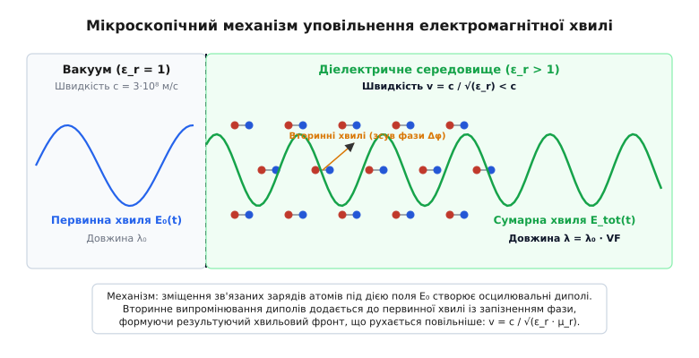
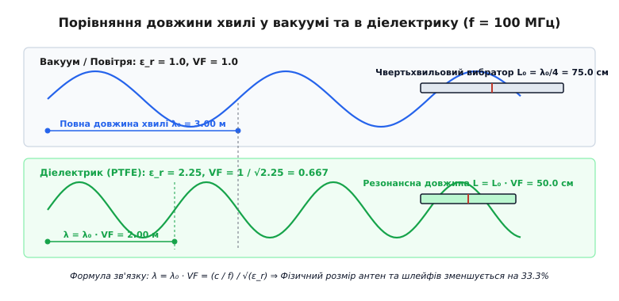
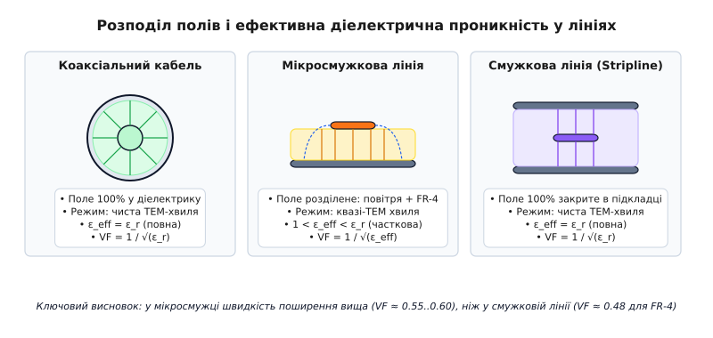
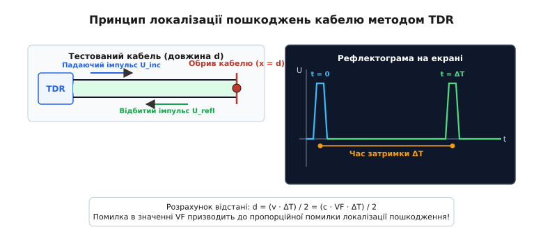

# Коефіцієнт укорочення: хвиля в діелектрику

<preknowlist>
- [Електромагнітна хвиля](book:physics/electromagnetism/em-wave) — взаємне відновлення електричного й магнітного полів у просторі.
- [Швидкість сигналу](book:physics/electromagnetism/signal-speed) — різниця між швидкістю дрейфу носіїв і швидкістю хвильового фронту.
- [Закон заломлення світла](book:physics/optics/refraction-law) — зв'язок швидкості поширення хвилі з показником заломлення середовища.
</preknowlist>

Коаксіальний кабель RG-58 довжиною 10 метрів, під'єднаний до високочастотного генератора з частотою 100 МГц, затримує імпульс на 50.5 наносекунд — на 17.1 наносекунди довше, ніж вимагала б дистанція у вакуумі. Якщо зрізати чвертьхвильовий узгоджувальний шлейф за розрахунком для вакууму (75.0 сантиметрів), резонансна частота системи зміщується з 100 МГц до 66.0 МГц, повністю руйнуючи узгодження антени з передавачем і відбиваючи більшу частину потужності назад у каскад підсилювача.

Цей ефект викликаний тим, що електромагнітна хвиля поширюється у діелектричній ізоляції кабелю суттєво повільніше, ніж у порожньому просторі. Явище уповільнення хвилі та відповідного зменшення її просторового періоду описується безрозмірною величиною — **коефіцієнтом укорочення** (або коефіцієнтом швидкості, Velocity Factor).

## 1. Фізичний механізм взаємодії хвилі з речовиною

У порожньому просторі (вакуумі) електромагнітна хвиля поширюється з граничною швидкістю `c ≈ 2.9979 · 10⁸ м/с`. Ця швидкість є фундаментальною фізичною константою і визначається електричною `ε₀` та магнітною `μ₀` сталими порожнього простору:

```
c = 1 / √(ε₀ · μ₀)
```

Коли електромагнітна хвиля потрапляє в діелектричне середовище, вона перестає бути ізольованим утвороми і починає активно взаємодіяти зі зв'язаними електричними зарядами, з яких складається речовина. Під дією високочастотного електричного поля хвилі `E` позитивно заряджені атомні ядра зміщуються за напрямком вектора поля, а негативно заряджені електронні хмари — у протилежному напрямку. Відбувається **поляризація діелектрика**: в кожному мікроскопічному об'ємі речовини виникає вектор поляризованості `P`, який характеризує дипольний момент одиниці об'єму.

У фізиці діелектриків виділяють три основні мікроскопічні механізми поляризації, які формують відгук середовища на електромагнітне збурення:

1. **Електронна поляризація:** пружне зміщення електронних оболонок атомів відносно їхніх ядер. Це найшвидший вид поляризації, який виникає за час порядку `10⁻¹⁵ секунди` і зберігає активність аж до оптичного та ультрафіолетового діапазонів частот.
2. **Іонна поляризація:** зміщення різнойменно заряджених іонів у кристалічній ґратці або молекулярній матриці. Інерційність іонних мас обмежує цей процес частотами субміліметрового й інфрачервоного діапазонів (`10⁻¹² секунди`).
3. **Орієнтаційна (дипольна) поляризація:** поворот і вирівнювання постійних дипольних моментів полярних молекул (наприклад, молекул води або епоксидної смоли) вздовж зовнішнього поля. Через значний об'єм і масу молекул орієнтаційна поляризація є відносно повільною (`10⁻⁹...10⁻¹⁰ секунди`) і згасає на частотах понад 1 ГГц.

Оскільки первинне електричне поле хвилі осцилює з частотою `f`, наведені атомарні та молекулярні диполі також здійснюють вимушені гармонічні коливання. Згідно з класичною електродинамікою, кожен осцилювальний диполь стає джерелом вторинних сферичних електромагнітних хвиль, які випромінюються в усіх напрямках.

Зсув фази між первинною хвилею та вторинним випромінюванням диполів відіграє вирішальну роль. Через інерцію електронних оболонок і в'язке гальмування поляризаційний відгук середовища відстає за фазою від збуджувального поля. За принципом суперпозиції підсумкове електромагнітне поле у речовині є результатом додавання первинної хвилі та мільйонів запізнілих вторинних хвиль. Сума цих хвиль формує результуючий хвильовий фронт, який переміщується крізь діелектрик із меншою фазовою швидкістю `v < c`.


*Мікроскопічний механізм поляризації атомарних диполів діелектрика та запізнення фази вторинного випромінювання.*

Цей фундаментальний результат строго описується **теоремою згасання Евальда-Озеєна** (Ewald-Oseen extinction theorem): первинна хвиля, що входить у середовище зі швидкістю `c`, повністю гаситься інтерференцією з вторинними хвилями атомів першого моношару, а всередині діелектрика виникає нова автономна макроскопічна хвиля, яка поширюється зі швидкістю `v = c / n`.

З векторних рівнянь Максвелла випливає, що фазова швидкість електромагнітної хвилі в середовищі з відносною діелектричною проникністю `ε[r]` та відносною магнітною проникністю `μ[r]` обчислюється за формулою:

```
v = 1 / √(ε₀·ε[r] · μ₀·μ[r])
  = (1 / √(ε₀·μ₀)) · (1 / √(ε[r]·μ[r]))
  = c / √(ε[r]·μ[r])
```

Для переважної більшості немагнітних діелектриків (поліетилен, фторопласт, скло, повітря, поліметилметакрилат), у яких `μ[r] = 1.0`, швидкість хвилі спрощується до виразу:

```
v = c / √(ε[r])
```

Відношення фазової швидкості поширення хвилі в середовищі `v` до швидкості світла у вакуумі `c` називається **коефіцієнтом укорочення** (Velocity Factor, `VF`):

```
VF = v / c = 1 / √(ε[r] · μ[r]) ≈ 1 / √(ε[r])
```

У деяких інженерних школах вживають обернену величину — **коефіцієнт уповільнення** (або показник заломлення середовища `n = 1 / VF = √ε[r]`). Величина `VF` є безрозмірним коефіцієнтом, який для реальних речовин лежить у діапазоні від `0.1` до `1.0`. Наприклад, для суцільного поліетилену з `ε[r] = 2.25` коефіцієнт укорочення становить `VF = 1 / √2.25 = 1 / 1.5 = 0.667`. Це означає, що хвиля рухається в поліетилені зі швидкістю 66.7% від швидкості світла у вакуумі (`200 000 км/с`).

Детальний процес історичного відкриття законів поширення хвилі у діелектриках від експериментів Іпполіта Фізо та теорем Максвелла до телеграфних рівнянь Олівера Гевісайда й досліджень Пауля Друде описано в [історії вимірювання швидкості хвилі в діелектриках](book:physics/electromagnetism/velocity-factor/hist-dielectric-speed.md).

## 2. Скорочення довжини хвилі та геометричні параметри антенних систем

Уповільнення фазової швидкості безпосередньо впливає на просторовий період електромагнітного збурення — довжину хвилі `λ`. Оскільки частота коливань джерела `f` визначається генератором і залишається незмінною при переході хвилі з одного середовища в інше, довжина хвилі у діелектрику обчислюється за співвідношенням:

```
λ = v / f = (c · VF) / f = λ₀ · VF
```

де `λ₀ = c / f` — довжина хвилі тієї самої частоти у порожньому вакуумі.

Оскільки коефіцієнт укорочення завжди менший за одиницю (`VF < 1`), довжина хвилі у діелектрику виявляється коротшою за довжину хвилі у вакуумі в `1 / VF` разів. Саме ця пропорційна усадка просторового періоду хвилі описується терміном «коефіцієнт укорочення».


*Скорочення довжини хвилі та геометричних розмірів резонансного чвертьхвильового вибратора у діелектричному середовищі.*

Це скорочення має вирішальне значення під час розрахунку антен, хвилеводних резонаторів, фідерів та узгоджувальних шлейфів. Умови стоячої хвилі у чвертьхвильовому вибраторі або шлейфі виконуються тоді, коли фізична довжина провідника `L` точно дорівнює чверті довжини хвилі у тому конкретному середовищі, де зосереджено електромагнітне поле:

```
L[физ] = λ / 4 = (λ₀ · VF) / 4 = (c · VF) / (4 · f)
```

Якщо інженер розраховує друковану патч-антену для бездротового модуля Wi-Fi на частоту 2.45 ГГц і виготовляє її на платі зі склотекстоліту FR-4 без урахування діелектрика, антена виявиться фізично завеликою. Її фактичний резонанс зміститься вбік нижчих частот (близько 1.4 ГГц), і на робочій частоті 2.45 ГГц антена випромінюватиме менше 5% підведеної потужності.

Зменшення фізичних розмірів антени при її зануренні в діелектрик підпорядковується фундаментальним граничним співвідношенням Чу-Гаррінгтона (Chu-Harrington limit). Зменшення геометричного розміру випромінювача `k·a < 1` неминуче супроводжується зростанням добротності антени `Q` та відповідним звуженням її робочої смуги частот:

```
Q[min] ≈ 1 / (k·a)³
```

Тому застосування діелектриків із високою діелектричною проникністю дозволяє створювати надкомпактні антени (наприклад, керамічні GPS-патчі), проте вимагає ретельного контролю допусків ширини смуги пропускання.

### 2.1. Фазовані антенні решітки та керовані фазообертачі

У фазованих антенних решітках (ФАР), які використовуються у радіолокації та базових станціях зв'язку 5G / 6G MIMO, керування напрямком променя випромінювання здійснюється шляхом завдання точного часового зсуву сигналів між окремими випромінювальними елементами.

Напрямок головного пелюстка діаграми спрямованості `θ` прямо залежить від кутового фазового зсуву `Δφ` між сусідніми елементами решітки з кроком `d`:

```
Δφ = k · d · sin(θ) = (2·π / λ₀) · d · sin(θ)
```

Для створення цього фазового зсуву використовують відрізки ліній передачі з регульованим коефіцієнтом укорочення або лінії затримки керованої довжини. Застосування сегнетоелектричних діелектриків (наприклад, титанату барію-стронцію BST), діелектрична проникність яких змінюється під дією керуючої постійної напруги `ε[r](V)`, дозволяє плавним чином змінювати коефіцієнт укорочення ліній затримки та здійснювати швидке електронне сканування променем антени без жодних механічних рухомих частин.

> 🔧 **Навіщо це у розробці.**
> Розуміння коефіцієнта укорочення дозволяє створювати компактні НВЧ-антени та мікросмужкові фільтри. Застосування субстратів із високою діелектричною проникністю (наприклад, кераміки з `ε[r] ≈ 10`) дозволяє зменшити фізичні габарити антен для смартфонів та супутникових навігаторів GPS/ГЛОНАСС у 3–3.2 рази порівняно з їхніми повітряними аналогами.

> **Приклад розрахунку 1: Проектування мікросмужкової антени.**
> 
> **Умова:** Необхідно розрахувати геометричну довжину `L` чвертьхвильового друкованого випромінювача для передавача діапазону 433.92 МГц, який розміщується на підкладці з фторопласту PTFE (`ε[r] = 2.1`).
> 
> **Обчислення:**
> ```
> 1. Довжина хвилі у вакуумі:
>    λ₀ = c / f = 2.9979·10⁸ / 433.92·10⁶ = 0.6909 м = 69.09 см
> 
> 2. Коефіцієнт укорочення діелектрика:
>    VF = 1 / √ε[r] = 1 / √2.1 = 1 / 1.4491 = 0.6901
> 
> 3. Довжина хвилі в діелектрику:
>    λ = λ₀ · VF = 69.09 см · 0.6901 = 47.68 см
> 
> 4. Резонансна фізична довжина чвертьхвильового провідника:
>    L = λ / 4 = 47.68 см / 4 = 11.92 см    [замість 17.27 см у вакуумі]
> ```
> **Висновок:** Використання фторопластової підкладки дозволяє скоротити фізичну довжину антени з 17.27 см до 11.92 см (на 31%).

## 3. Геометрія ліній передачі та ефективна діелектрична проникність

У реальних радіоелектронних пристроях електромагнітна хвиля поширюється уздовж ліній передачі (коаксіальних кабелів, мікросмужкових ліній, смужкових ліній чи двопровідних фідерних кабелів). Розподіл полів між різними діелектриками суттєво змінює підсумкову швидкість поширення сигналу.

За структурою розподілу діелектрика лінії передачі поділяють на два класи:

1. **Лінії із повністю закритим діелектриком (чистий TEM-режим):**
   До цього класу належать коаксіальні кабелі та внутрішні смужкові лінії (Stripline). Усе електромагнітне поле між провідниками концентрується всередині одного однорідного ізолятора `ε[r]`. У таких лініях поле не виходить назовні, тому коефіцієнт укорочення залежить виключно від матеріалу заповнювача і не залежить від геометричних розмірів жил:

```
ε[eff] = ε[r]
VF = 1 / √(ε[r])
```

2. **Лінії із частковим або відкритим діелектриком (квазі-TEM режим):**
   До цього класу належать мікросмужкові лінії на поверхні друкованих плат (Microstrip) та відкриті двопровідні лінії (Twin-lead). У мікросмужці силові лінії електричного поля розбиваються на дві частини: основна частина поля проходит через діелектричну підкладку плати `ε[r]`, а крайові поля поширюються через повітря `ε[air] = 1.0` над платою.


*Розподіл електричного поля в коаксіальній, мікросмужковій та смужковій лініях передачі та походження ефективної проникності.*

Оскільки хвиля одночасно захоплює два середовища з різними швидкостями, виникає складний квазі-поперечний режим. Швидкість такої хвилі визначається **ефективною діелектричною проникністю** `ε[eff]`, значення якої лежить строго між проникністю повітря та проникністю підкладки: `1.0 < ε[eff] < ε[r]`.

Для мікросмужкової лінії шириною `w` на підкладці товщиною `h` ефективна діелектрична проникність обчислюється за апроксимаційною формулою Гарольда Вілера та Еванса Шнайдера (при `w / h ≥ 1`):

```
ε[eff] = ((ε[r] + 1) / 2) + ((ε[r] − 1) / 2) · (1 / √(1 + 12·(h / w)))
```

Звідси підсумковий коефіцієнт укорочення для мікросмужкової траси дорівнює:

```
VF[microstrip] = 1 / √(ε[eff])
```

Оскільки частина поля поширюється у швидшому повітряному середовищі, `ε[eff]` завжди менша за проникність самого діелектрика `ε[r]`. В результаті імпульс на зовнішньому шарі плати рухається швидше (`VF ≈ 0.55...0.60` для FR-4), ніж у внутрішній смужковій лінії, зануреній у товщу текстоліту (`VF ≈ 0.48`).

Крім мікросмужкових ліній, у сучасних НВЧ-пристроях широко використовуються **копланарні хвилеводи (Coplanar Waveguide, CPW)** та копланарні лінії з заземленим нижнім екраном (GCPW). У копланарному хвилеводі центральний провідник і дві заземлені площини розміщені на одному й тому самому верхньому шарі плати. Оскільки силові лінії електричного поля замикаються горизонтально через щілини між провідниками, приблизно половина потік поля проходить через діелектричний субстрат, а половина — через повітря над платою. Ефективна діелектрична проникність CPW обчислюється за допомогою еліптичних інтегралів і приблизно дорівнює `ε[eff] ≈ (ε[r] + 1) / 2`, що дає стабільний коефіцієнт укорочення `VF ≈ √(2 / (ε[r] + 1))`.

У закритих металевих хвилеводах прямокутного або круглого перерізу, заповнених діелектриком, поширюються хвилі модин TE та TM. Швидкість хвилі у таких хвилеводах підпорядковується критичній частоті зрізу `f[c]`. Фазова швидкість хвилі у заповненому хвилеводі перевищує швидкість у вільному діелектрику через геометрію кутового відбиття від стінок:

```
v[p] = (c / √(ε[r])) / √(1 − (f[c] / f)²)
```

але групова швидкість передачі енергії `v[g] = (c / √ε[r]) · √(1 − (f[c]/f)²) < c` залишається строго меншою за швидкість у вакуумі.

### 3.1. Парні лінії та зв'язані провідники: непарна й парна моди поширення

У щільних багатопровідних шинах та диференційних парах друкованих плат паралельні провідники знаходяться в зоні електромагнітного зв'язку один із одним. Поширення сигналів у такій системі розкладається на дві фундаментальні моди:

1. **Непарна мода (Odd Mode):** провідники збуджуються у протифазі (`+U` та `−U`). Силові лінії електричного поля сильно концентруються у зазорі між трасами через діелектрик підкладки та повітря.
2. **Парна мода (Even Mode):** провідники збуджуються у фазі (`+U` та `+U`). Силові лінії замикаються на нижню заземлену площину, охоплюючи ширшу зону повітряного середовища над платою.

Через відмінність просторового розподілу поля для непарної та парної мод ефективні діелектричні проникності виявляються різними: `ε[eff, odd] < ε[eff, even]`. В результаті непарна мода поширюється з вищим коефіцієнтом укорочення (`VF[odd] > VF[even]`), що утворює явище перехресних наводок (Crosstalk) та часового розщеплення імпульсів при неідеальному узгодженні ліній.

### 3.2. Скін-ефект та вплив шорсткості фольги на швидкість поширення

На низьких частотах струм рівномірно заповнює переріз провідника. Проте зі зростанням частоти понад 100 МГц вихрові струми всередині металу витісняють електричний струм до поверхні провідника.

Витіснення струму до поверхні провідника збільшує внутрішню погонну індуктивність провідника `L[int]'`. Згідно з телеграфними рівняннями, додаткова індуктивність `L[int]' = R' / ω` вносить свій внесок у підсумкову погонну індуктивність лінії `L' = L[ext]' + L[int]'`. Це створює додаткове сповільнення фазової швидкості на частотах нижче 1 ГГц:

```
v = 1 / √((L[ext]' + L[int]') · C')
```

Явище витіснення змінного струму до поверхневого шару провідника називається **скін-ефектом**. Характерна товщина цього поверхневого шару (товщина скін-шару), у якому концентрується основна частина струму, описується формулою `δ = √(2 / (ω·μ·σ))`.

Крім того, на високих частотах (понад 10 ГГц) товщина скін-шару `δ` стає порівнянною з мікроскопічною шорсткістю поверхні мідної фольги друкованої плати. Струм змушений огинати мікроскопічні піки та западини міді (за моделлю Хаммерстада-Йенсена та модель Хеннола), що збільшує фактичний шлях струму. Це штучно підвищує погонну індуктивність лінії і зменшує реальний коефіцієнт укорочення на 2–4% порівняно з ідеально гладкою фольгою.

Строгий математичний вивід хвильового рівняння з рівнянь Максвелла, розрахунок погонних параметрів `L'` і `C'` для коаксіалу та детальний аналіз формули Шнайдера наведено у [математичному виводі фазової швидкості та ефективної проникності](book:physics/electromagnetism/velocity-factor/math-effective-permittivity.md).

## 4. Дисперсія фазової швидкості, комплексна проникність і втрати

У реальних речовинах діелектрична проникність не є строгою константою — вона залежить від частоти електромагнітного поля `ε[r](ω)`. Це явище називається **діелектричною дисперсією**.

Причиною дисперсії є фізична інерційність різних видів поляризації. На низьких частотах усі три механізми (електронна, іонна та орієнтаційна поляризації) встигають повністю відслідковувати зміни електричного поля. Проте зі зростанням частоти понад 1 ГГц важкі полярні диполі молекул не встигають розвертатися за швидкозмінним вектором `E`. Орієнтаційна поляризація вимикається, і діелектрична проникність речовини падає за моделлю Дебая.

Через згасання орієнтаційної поляризації частина енергії електромагнітної хвилі неповоротно перетворюється на тепло. Для одночасного опису фазової швидкості та дисипації енергії уводять **комплексну діелектричну проникність**:

```
ε* = ε' − i·ε''
```

де дійсна частина `ε'` розраховує накопичення електричної енергії та визначає фазову швидкість хвилі, а уявна частина `ε''` описує діелектричні втрати. Відношення уявної частини до дійсної називається тангенсом кута втрат (`tan δ = ε'' / ε'`).

Фундаментальні **співвідношення Крамерса-Кроніґа** доводять, що дійсна `ε'(ω)` та уявна `ε''(ω)` частини комплексної проникності прямо пов'язані через інтегральне перетворення Гільберта. Це означає, що середовище не може мати діелектричних втрат без наявності дисперсії фазової швидкості.

Залежність проникності від частоти призводить до того, що різні спектральні компоненти широкого цифрового імпульсу поширюються з різною фазовою швидкістю `v[p] = ω / k`. У результаті виникає відмінність між фазовою швидкістю монохроматичної несучої та **груповою швидкістю** `v[g] = dω / dk`, яка описує переміщення обвідної імпульсу (енергії та інформації):

```
v[g] = v[p] / [ 1 + (ω / (2 · ε[r])) · (dε[r] / dω) ]
```

При нормальній дисперсії (`dε[r]/dω > 0`) групова швидкість менша за фазову (`v[g] < v[p]`). Під час поширення прямокутного цифрового імпульсу зі швидкістю передачі понад 10 Гбіт/с через діелектрик із дисперсією різні частотні гармоніки фронту рухаються з різними коефіцієнтами укорочення. Це призводить до розмивання крутих фронтів сигналів, виникнення міжсимвольної інтерференції (ISI) та закриття «очної діаграми» на вході приймача.

Поняття коефіцієнта укорочення поширюється також на **волоконно-оптичні лінії зв'язку (ВОЛЗ)**. В одномодовому кварцовому волокні серцевина діаметром 9 мкм виготовляється з легованого диоксиду кремнію з показником заломлення `n[core] ≈ 1.468`. Оскільки коефіцієнт укорочення світловодної хвилі дорівнює `VF = 1 / n[eff] ≈ 0.681`, оптичний імпульс рухається у склі зі швидкістю `204 000 км/с` із погонною затримкою близько `4.9 наносекунд на метр`. Розробка пустотілих фотонно-кристалічних волокон (Hollow-Core Photonic Crystal Fiber), де світло поширюється у повітряній серцевині (`n ≈ 1.0003`), дозволила підняти `VF` оптичного волокна до `0.997`, що є критичним для біржових торговельних мереж із наднизькими затримками (Low-Latency Trading).

Повний перелік параметрів `ε[r]`, `VF`, `tan δ` та температурних коефіцієнтів для десятків промислових матеріалів, коаксіальних кабелів і ламінатів наведено у [довіднику діелектричних матеріалів та ліній передачі](book:physics/electromagnetism/velocity-factor/api-dielectric-materials.md).

## 5. Практичні застосування — TDR, вирівнювання затримок та НВЧ-пристрої

Точне знання коефіцієнта укорочення є критично важливим для трьох основних галузей сучасної радіоелектроніки та зв'язку.

### 5.1. Імпульсна рефлектометрія (TDR, Time-Domain Reflectometry)
Приладовий метод TDR використовується для бездеструктивного пошуку місць обривів, коротких замикань та пошкоджень ізоляції в підземних і підводних кабелях. Прилад надсилає у кабель зондувальний імпульс із тривалістю фронту в кілька пікосекунд і вимірює час `ΔT` до реєстрації відбитого сигналу.


*Принцип імпульсної рефлектометрії для локалізації пошкоджень кабелю за часом двостороннього пробігу відбитого фронту.*

Коефіцієнт відбиття за напругою `Γ = (Z[L] − Z₀) / (Z[L] + Z₀)` визначає амплітуду й полярність повернутого імпульсу. Повний обрив кабелю (`Z[L] → ∞`) дає позитивний відбитий пік (`Γ = +1`), а коротке замикання (`Z[L] = 0`) — негативний інвертований пік (`Γ = −1`).

Відстань від джерела сигналу до точної локації пошкодження `d` обчислюється за формулою:

```
d = (v · ΔT) / 2 = (c · VF · ΔT) / 2
```

> **Приклад розрахунку 2: Локалізація обриву кабелю рефлектометром.**
> 
> **Умова:** Рефлектометр TDR підключено до коаксіального кабелю магістралі зв'язку з діелектриком зі спіненого поліетилену (`VF = 0.82`). Часовий інтервал між зондувальним імпульсом та відбитим позитивним піком дорівнює `ΔT = 1.25 мкс` (1250 нс). Знайти відстань до місця обриву `d`.
> 
> **Обчислення:**
> ```
> 1. Швидкість поширення хвилі в кабелі:
>    v = c · VF = 2.9979·10⁸ м/с · 0.82 = 2.4583·10⁸ м/с = 245.83 м/мкс
> 
> 2. Відстань до пошкодження:
>    d = (v · ΔT) / 2 = (245.83 м/мкс · 1.25 мкс) / 2 = 307.28 м / 2 = 153.64 м
> ```
> **Висновок:** Обрив кабелю розташований на відстані 153.64 метра від точки вимірювання.

### 5.2. Вирівнювання затримок трас (Length Matching / Skew Compensation)
У високошвидкісних цифрових платах (DDR4/DDR5, PCIe, HDMI) паралельні лінії даних або провідники диференційних пар повинні доставляти фронти сигналів до приймача з розсинхронізмом не більше 5–10 пікосекунд.

Оскільки погонна затримка сигналів на платі становить `t[pd] = 1 / (c · VF) ≈ 6.0...7.0 пс/мм`, різниця довжин трас всього в 2 мм створює часовий зсув (skew) близько 13 пікосекунд. Для компенсації розсинхронізму short-трасу штучно подовжують за допомогою вирівнювальних вигинів (меандрів).

### 5.3. НВЧ-шлейфи та лінії затримки
Коаксіальні кабелі та мікросмужкові лінії заданої електричної довжини застосовуються як чвертьхвильові інвертори імпедансу (`Z[in] = Z₀² / Z[L]`), напівхвильові повторювачі або лінії затримки сигналів у фазованих антенних решітках.

Готові інженерні алгоритми TDR-розрахунку, модулі вирівнювання трас та приклади коду мовами C, C++ та Python наведено у [практичному алгоритмі TDR-рефлектометрії та вирівнювання затримок трас](book:physics/electromagnetism/velocity-factor/proj-tdr-calculator.md).

## 6. Інженерні пастки, температурні ефекти та правила вимірювання

Під час практичного використання коефіцієнта укорочення інженерам слід враховувати чотири фундаментальні фактори, які часто стають джерелом системних помилок:

1. **Температурна залежність проникності (TCε):**
   Полімерні діелектрики змінюють густину при зміні температури. Для суцільного поліетилену температурний коефіцієнт становить `TCε ≈ −300 ppm/°C`. Зміна температури кабелю від −20 °C до +60 °C змінює `ε[r]` на 2.4%, викликаючи плаваючий зсув часу затримки на 1.2%. У прецизійних фазових системах застосовують термостибілізовані кабелі з діелектриком із мікропористого фторопласту.

2. **Вплив покриття паяльною маскою (Solder Mask Effect):**
   Нанесення захисної паяльної маски товщиною 25 мкм із `ε[r] ≈ 3.6` поверх зовнішніх мікросмужкових трас витісняє повітря у зоні максимального поля. Це збільшує `ε[eff]` на 3–5% і зменшує реальний `VF` відносно теоретичного розрахунку без маски.

3. **Структура плетіння склотканини (Fiber Weave Effect):**
   Композит FR-4 складається з ниток скловолокна (`ε[r] ≈ 6.0`) та епоксидної смоли (`ε[r] ≈ 3.0`). Якщо одна траса диференційної пари проходить над скляною ниткою, а друга — над кишенею зі смолою, їхні коефіцієнти укорочення відрізнятимуться (`VF₁ ≈ 0.52`, `VF₂ ≈ 0.58`), що зруйнує диференційний сигнал. Для ліквідації ефекту трасування виконують під кутом 10°–15° до осей плати.

4. **Методологія прямого калібрування:**
   Для визначення точного `VF` невідомого кабелю виконують вимірювання за еталонним зразком точно виміряної довжини `L[ref]`:

```
VF[exact] = (2 · L[ref]) / (c · ΔT[ref])
```

Калібрувальне значення вводять у пам'ять приладу перед проведенням відповідальних робочих вимірювань.

5. **Метод двох резонансних частот для усунення крайових ємностей:**
   При визначенні `VF` за резонансними частотами шлейфу крайова ємність відкритого кінця провідника штучно подовжує лінію на еквівалентну довжину `ΔL`. Щоб виключити цю системну помилку, вимірюють дві послідовні гармоніки резонансу `f₁` та `f₂`. Різниця частот `Δf = f₂ − f₁` повністю виключає крайову ємність, даючи точний коефіцієнт укорочення:

```
VF = (2 · L · Δf) / c
```

## 7. Чисельне моделювання полів (FEM / FDTD) та штучні метаматеріали

При проектуванні складних надвисокочастотних мікросмужкових структур, перехідних отворів (Via) та роз'ємів аналітичні формули Шнайдера дають помилку обчислення `ε[eff]` до 5–8% через нелінійний розподіл тривимірних крайових полів.

У сучасній електродинаміці для точного визначення ефективного коефіцієнта укорочення застосовують чисельне рішення рівнянь Максвелла за допомогою двох основних методів:
- **Метод скінченних елементів (FEM, Finite Element Method):** розбиває тривимірну геометрію діелектрика на мільйони тетраедральних осередків та вирішує варіаційну задачу для векторного потенціалу в частотній області.
- **Метод скінченних різниць у часовій області (FDTD, Finite-Difference Time-Domain):** моделює поширення реального електромагнітного імпульсу у часовому просторі за прямокутною сіткою Джи-Йо (Yee grid), дозволяючи безпосередньо спостерігати уповільнення хвильового фронту в діелектрику.

Чисельний аналіз дозволяє точно спроектувати високочастотні пристрої з урахуванням тривимірної геометрії підкладки та провідників. Комп'ютерні САПР формують тривимірну сітку електромагнітного поля, автоматично обчислюючи розподіл затримок у всіх внутрішніх шарах друкованої плати.

Окремим перспективним напрямом сучасної фізики є **метаматеріали з від'ємним показником заломлення** (ліві середовища Веселаго), у яких одночасно від'ємні діелектрична та магнітна проникності (`ε[r] < 0`, `μ[r] < 0`). У таких штучних середовищах фазова швидкість спрямована назустріч потоку енергії (вектору Пойнтінга), виникає зворотна хвиля, а коефіцієнт укорочення формально приймає від'ємне значення `VF < 0`. Це дозволяє створювати суперлінзи з роздільною здатністю, вищою за дифракційну межу, та пристрої надширокосмугового фазового вирівнювання.
