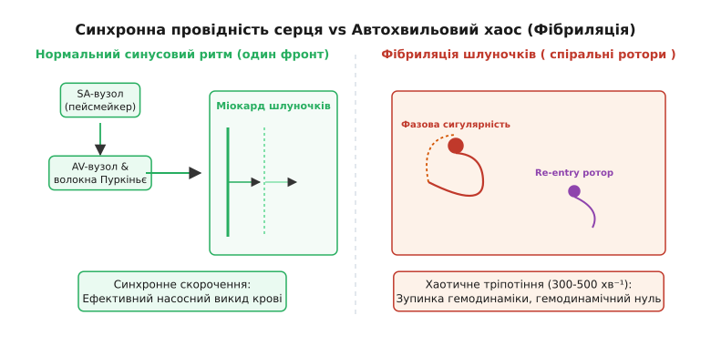
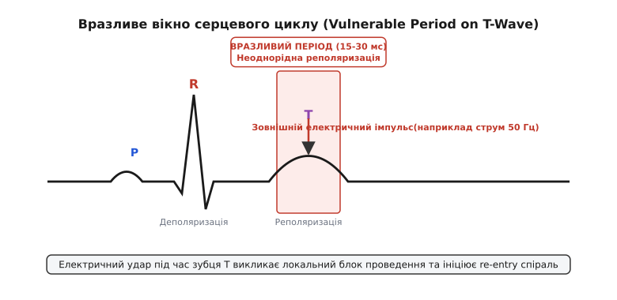
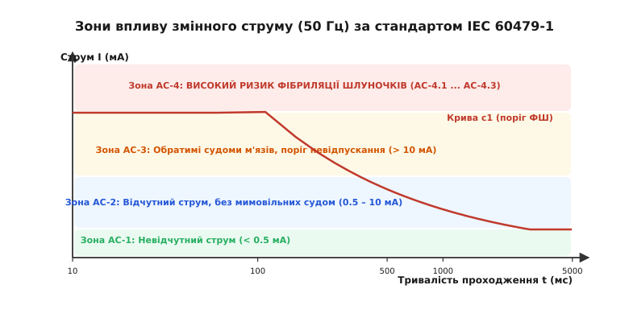
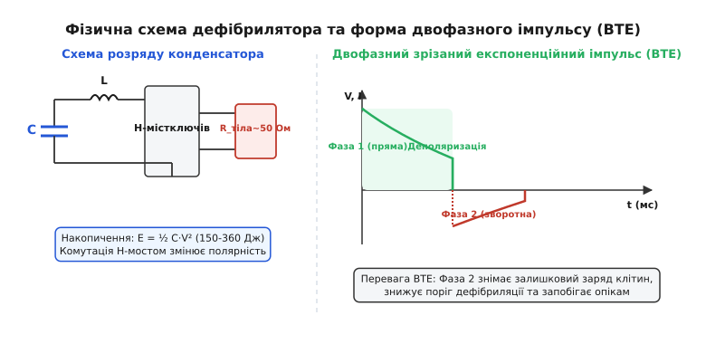

# Фібриляція шлуночків

<preknowlist>
- [Рівняння Максвелла та квазістаціонарне електричне поле в біофізиці](book:physics/electromagnetism/quasistationary-biofield)
- [Трансмембранний потенціал та струми іонних каналів](book:physics/electromagnetism/ion-channels)
- [Анатомія та фізиологія провідної системи серця](book:biology/cardiovascular/cardiac-conduction)
</preknowlist>

Коли електричний струм промислової частоти 50 Гц величиною 100 мА проходить через грудну клітку людини впродовж всього 100 мілісекунд, гемодинамічний тиск у аорті стрибкоподібно падає від нормальних 120/80 мм рт. ст. до нульового значення за 3 секунди. Координоване скорочення двох мільярдів кардіоміоцитів лівого та правого шлуночків, яке у нормі забезпечує хвилинний об'єм кровообігу у 5 літрів на хвилину, миттєво розпадається на хаотичні високочастотні мікроскопічні посмикування окремих м'язових пучків. Серце перетворюється на безформний мішок, що безперервно тріпоче з частотою від 300 до 600 коливань на хвилину, не виконуючи жодної механої роботи з перекачування крові. Через 8–10 секунд відсутності мозкового кровотоку людина втрачає свідомість, через 40 секунд зникають рефлекси та зупиняється дихання, а після 4–5 хвилин глибокої ішемії головного мозку настає незворотна біологічна смерть кори. Фібриляція шлуночків є головною біофізичною причиною раптової електричної смерті при техногенних ураженнях струмом, гострому інфаркті міокарда та утопленні.

### Біоелектричні основи серцевого збудження та іонні струми

У нормі серцевий м'яз функціонує як електричний та механічний синцитій. Автоматичні імпульси деполяризації утворюються у синусно-передсердному вузлі, проходять через передсердя, затримуються в атріовентрикулярному вузлі та по високовольтних пучках Гіса і волокнах Пуркіньє одночасно збуджують усю внутрішню поверхню (ендокард) обох шлуночків.

Мембрана спокійного кардіоміоцита володіє трансмембранним потенціалом спокою близько `-85` мВ, який описується рівнянням Ґольдмана-Ходжкіна-Катца для відносних провідностей іонів натрію, калію та хлору. Рівноважний потенціал Нернста для іонів калію становить `E_K ≈ -94` мВ, для натрію `E_Na ≈ +65` мВ, а для кальцію `E_Ca ≈ +120` мВ. Потенціал спокою тримається поблизу `E_K` завдяки постійному виходу іонів калію через канали аномального внутрішнього розпрямлення IK1 та активній роботі натрій-калієвої АТФази (перенос трьох іонів Na+ назовні на кожні два іони K+ всередину).

Потенціал дії робочого кардіоміоцита шлуночка триває близько 300 мс і складається з п'яти послідовних фаз:

1. **Фаза 0 (Швидка деполяризація):** При досягненні порогового потенціалу близько `-65` мВ миттєво відкриваються потенціалзалежні натрієві канали INa (активаційні ворота `m`). Вхідний натрієвий струм досягає амплітуди понад 100 мкА/см², а швидкість наростання потенціалу `dV/dt` перевищує 200 В/с. Мембранний потенціал перезаряджається до позитивного значення `+30` мВ (овершут). Через 1-2 мс інактиваційні ворота `h` закриваються, припиняючи струм натрію.
2. **Фаза 1 (Початкова швидка реполяризація):** Інактивація натрієвих каналів та короткочасне відкриття вихідних калієвих каналів Ito знижують потенціал до `+10` мВ.
3. **Фаза 2 (Плато):** Тривале плато тривалістю 150–200 мс забезпечується динамічною рівновагою між повільним вхідним кальцієвим струмом через канали L-типу ICa,L (активаційні ворота `d`, інактиваційні `f`) та вихідними калієвими струмами IKr і IKs. Вхід кальцію через ICa,L викликає масивний кальцій-індукований вихід Ca2+ з саркоплазматичного ретикулуму через ріанодинові рецептори (RyR2), що запускає скорочення актин-міозинових фібрил.
4. **Фаза 3 (Швидка кінцева реполяризація):** Інактивація Ca2+-каналів та зростання вихідних калієвих струмів IKr і IKs повертають потенціал мембрани до початкового значення `-85` мВ.
5. **Фаза 4 (Потенціал спокою):** Відновлення вихідної іонної асиметрії мембрани.


*Порівняння поширення прямолінійного фронту хвилі у нормі (ліворуч) та автохвильового хаосу з фазовими сингулярностями при фібриляції (праворуч).*

Міжклітинне електричне з'єднання кардіоміоцитів забезпечується високопровідними канальними комплексами — **нексусами (щелинними контактами, gap junctions)**, побудованими із білка коннексину-43 (Cx43). Опір міжклітинного контакту становить всього `R_g ≈ 1 ... 2 кОм·см`. Завдяки цьому електричний струм локального диполя витоку з деполяризованої клітини вільно протікає у сусідні спокійні клітини, створюючи неперервну хвилю деполяризації, яка поширюється уздовж м'язових волокон зі швидкістю `c_parallel ≈ 0.8` м/с та у поперечному напрямку зі швидкістю `c_perp ≈ 0.25` м/с (триразова електрична анізотропія).

При гострій ішемії міокарда у тканинній рідині накопичується позабуферний калій (`[K+]_out` зростає від нормальних 4.5 мМ до 10–12 мМ). Згідно з рівнянням Нернста потенціал спокою деполяризується до `-65` мВ. Це викликає часткову інактивацію швидких натрієвих каналів INa і скорочує швидкість проведення хвилі `c` більше ніж удвічі, створюючи біофізичні умови для виникнення аритмій.

### Гемодинамічний та метаболічний колапс під час фібриляції

Зникнення координованого систолічного скорочення шлуночків при фібриляції миттєво обнуляє **коронарний перфузійний тиск (Coronary Perfusion Pressure, CPP)**. 

У нормі кровопостачання міокарда лівого шлуночка відбувається переважно у фазу діастоли, коли коронарний тиск становить близько 80 мм рт. ст. При фібриляції шлуночків тиск у коронарних артеріях падає нижче критичного порогу перфузії `CPP < 15` мм рт. ст. Серцевий м'яз повністю позбавляється припливу кисню та глюкози, опиняючись у стані тотальної гострої ішемії.

За відсутності кисню у кардіоміоцитах розвивається швидкий метаболічний колапс:
1. **Вичерпання запасу АТФ:** Протягом перших 30–60 секунд фібриляції внутрішньоклітинний запас АТФ та креатинфосфату виснажується на 80%. 
2. **Перехід на анаеробний гліколіз:** Запускається анаеробний розпад глікогену з накопиченням молочної кислоти. Внутрішньоклітинний pH падає нижче 6.8 (лактатацидоз), що пригнічує чутливість міофібрил до іонів кальцію.
3. **Активація АТФ-чутливих калієвих каналів (K_ATP):** Падіння концентрації АТФ примушує масово відкриватися калієві канали IK,ATP. Потужний вихід калію назовні різко скорочує тривалість потенціалу дії (`APD` падає від 300 мс до 60 мс).

Скорочення `APD` додатково зменшує довжину хвилі `λ = c · APD`, що прискорює ротацію спіральних хвиль та переводить дрібнохвильову фібриляцію у незворотну фазу електричної асистолії, при якій запаси енергії клітин вичерпані повністю і подача дефібриляційного імпульсу вже не здатна відновити роботу іонних насосів.

### Рефрактерність та феномен повторного входу хвилі (Re-entry)

Головним біофізичним запобіжником, який у нормі не дозволяє серцевій хвилі описувати повторні кола і викликати хаотичні аритмії, є **рефрактерний період**:

- **Абсолютний рефрактерний період (АРП):** Триває від фази 0 до середини фази 3 (потенціал вище `-50` мВ). У цей час потенціалзалежні натрієві канали перебувають у глибокому інактивованому стані. Жоден електричний стимул, незалежно від його амплітуди, не здатний викликати повторний потенціал дії.
- **Відносний рефрактерний період (ВРП):** Триває під час кінцевої частини фази 3 (потенціал від `-50` мВ до `-75` мВ), коли частина Na+-каналів уже повернулася у закритий стан, але здатна до активації. Стимул надпорогової амплітуди може викликати новий потенціал дії, проте його амплітуда буде зрізаною, а швидкість поширення `c` — уповільненою у кілька разів.

У 1914 році Джордж Майнс (*George Mines*) та Вольферман Ґаррі (*Walter Garrey*) сформулювали фізичні умови виникнення самопідтримуваної циркуляції хвилі збудження — **феномену повторного входу (Re-entry)**.

Для того щоб хвиля деполяризації утворила стійке замкнене кільце збудження навколо анатомічного чи функціонального перешкодного осередку периметром `L`, повинна виконуватися фундаментальна нерівність:

```
L > λ
```

де `λ` — довжина автохвилі у збудливому середовищі, яка дорівнює добутку фазової швидкості `c` на тривалість потенціалу дії (APD):

```
λ = c · APD
```

Якщо довжина периметра кільця `L` є меншою за довжину хвилі `λ`, то верхівка хвилі набігає на власний рефрактерний хвіст і миттєво загасає. Проте якщо під дією ішемії, гіпоксії або зовнішнього струму швидкість поширення `c` падає у 2–3 рази, а тривалість реполяризації APD скорочується, довжина хвилі `λ` падає від нормальних 20 см до 2–3 см. У цьому випадку навіть на невеликій ділянці міокарда утворюється замкнений автохвильовий ротор.

Докладний математичний вивід варіацій швидкості хвилі від кривизну фронту та розв'язок нелінійних рівнянь реакції-дифузії подано у вставці [математичну модель автохвильових спіралей та рівняння Фіцг'ю-Нагумо](book:physics/electromagnetism/ventricular-fibrillation/math-fitzhugh-nagumo.md).

### Анатомічна анізотропія та топологічні особливості роторів

Структура серцевої стінки не є однорідною. М'язові волокна у товщі шлуночка плавно змінюють свою орієнтацію: від `+60°` на субепікардіальному шарі через `0°` у серединному шарі до `-60°` на субендокардіальному шарі. 

Тензор електропровідності тканинного синцитію `σ` описується матричним виразом:

```
σ = σ_t · I + (σ_l - σ_t) · (a_f ⊗ a_f)
```

де:
- `σ_l` — поздовжня провідність уздовж волокон (`σ_l ≈ 0.2` См/м);
- `σ_t` — поперечна провідність між волокнами (`σ_t ≈ 0.03` См/м);
- `a_f` — одиничний вектор орієнтації м'язового волокна;
- `I` — одинична тензорна матриця.

Наявність тривимірної обертальної анізотропії спричиняє **тривимірний дрейф автохвильових роторів**. Вільний край спіральної хвилі під дією градієнта кута волокон згинається і створює нелінійну траєкторію дрейфу фазової сингулярності.

Наявність постішамічних рубців (колагенової фіброзної тканини) створює анатомічні перешкоди з нульовим дифузійним струмом на межі (`∂V/∂n = 0`). Якщо ядро спірального ротора натрапляє на такий рубець, воно фіксується (запирається) на його периметрі, перетворюючись із короткоживучого спірального ротора на стійку мономорфну шлуночкову тахікардію.

### Вразливий період серцевого циклу (Vulnerable Period)

Ініціація фібриляції шлуночків зовнішим електричним струмом або передчасним екстрасистолічним імпульсом можлива лише у вузькому часовому інтервалі серцевого циклу, який називають **вразливим періодом (Vulnerable Period, VP)**.

Вразливий період збігається з висхідним коліном та верхівкою зубця T на поверхневій електрокардіограмі і триває всього `20 ... 40` мілісекунд.


*Схема ЕКГ із позначенням вразливого вікна на зубці T та механізм утворення розриву хвилі при подачі імпульсу S2.*

Фізична причина існування вразливого періоду полягає у **дисперсії реполяризації**. Процес відновлення потенціалу спокою у тривимірному міокарді відбувається непросторово однорідно:
- Епікардіальні клітини мають коротку тривалість APD і реполяризуються першими;
- Ендокардіальні клітини реполяризуються пізніше;
- Серединні м'язові клітини (M-клітини) володіють найдовшим періодом рефрактерності.

Під час зубця T у шлуночках одночасно співіснують два типи ділянок: повністю відновлені збудливі зони та ще рефрактерні зони. 

Якщо у цей момент через міокард проходить зовнішній електричний імпульс S2:
1. У повністю відновлених зонах імпульс S2 викликає новий фронт деполяризації, який вільно поширюється в усі боки.
2. У рефрактерних зонах той самий імпульс S2 зустрічає абсолютну непровідність і миттєво блокується.
3. На межі розподілу цих зон утворюється **розрив хвильового фронту (вільний край хвилі)**.

Згідно з законами автохвильової фізики вільний край хвилі не може просто зупинитися у просторі. Через різницю швидкостей та дифузійний відтік струму вільний кінець фронту починає закручуватися у спіральний рукав навколо точкової особливості — **фазової сингулярності (Phase Singularity)**. Утворюється автохвильовий ротор, який генерує високочастотні імпульси з періодом `T_rot ≈ 100 ... 150` мс, що в 5 разів перевищує частоту синусового ритму.

Чисельне моделювання процесу формування ротора за допомогою протоколу S1-S2 та алгоритми виявлення фазових сингулярностей реалізовано у вставці [чисельне моделювання автохвильового хаосу та розпаду спіральних хвиль](book:physics/electromagnetism/ventricular-fibrillation/proj-spiral-wave-sim.md).

### Перехід від мономорфного ротора до автохвильового хаосу

Одиночний спіральний ротор, що стабільно обертається у шлуночку, викликає **мономорфне тріпотіння шлуночків**. При цьому на ЕКГ спостерігається строга високочастотна синусоїдальна крива з постійною амплітудою.

Проте тріпотіння є динамічно нестійким станом і протягом кількох секунд переходить у повну фібриляцію через три фундаментальні біофізичні механізми:

#### 1. Мобільний меандр та злам ядра ротора

Ядро спіральної хвилі не є нерухомим. Під дією відновлення іонних каналів фазова сингулярність здійснює складні колові, епіциклоїдні або гіпоциклоїдні рухи — **меандр ядра**. Якщо радіус меандру перевищує допустимі межі, ядро ротора натрапляє на діелектричні анатомічні межі (клапанні кільця, верхівку серця або зону ішемічного некрозу) і розпадається на два нові ротори протилежної топологічної орієнтації.

#### 2. Динамічна нестійкість тривалості APD (Альтернація)

При високій частоті стимуляції іонні канали вилучення кальцію з цитоплазми не встигають повернутися до стану спокою. Виникає ефект **альтернації тривалості потенціалу дії**: тривалість коротких і довгих імпульсів починає періодично чергуватися (`APD_short → APD_long → APD_short`). У просторі це генерує хвильово-рефрактерні блокування, розриваючи первинну спіральну хвилю на десятки дрібних автономних вторинних спіралей.

#### 3. Розпад тривимірних свиткуватих хвиль (Scroll Waves)

У товстій стінці лівого шлуночка (товщиною до 15 мм) двовимірна спіральна хвиля стає тривимірною **свиткуватою хвилею (scroll wave)**, а точкова сингулярність перетворюється на неперервну **нитку сингулярності (Filament)**. 

Різна орієнтація м'язових волокон на епікарді та ендокарді (кутова вращальна анізотропія на `120°` через товщу стінки) примушує нитку сингулярності скручуватися у спіраль, розтягуватися під дією натягу та розпадатися на замкнені солітонні кільця (O-rings). В результаті виникає **тривимірний автохвильовий хаос** — повна просторова та часова декогерентність електричного поля серця.

### Фізичні пороги струмового ураження та криві Далзіла

Параметри електричного струму, які викликають фібриляцію шлуночків при техногенному контакті з струмопровідними частинами під напругою, жорстко нормуються міжнародним стандартом **IEC 60479-1**.


*Діаграма зон ураження електричним струмом частотою 50 Гц за стандартом IEC 60479-1 у залежності від сили струму та тривалості впливу.*

Фізичний поріг виникнення фібриляції залежить від сили струму `I` та тривалості його проходження `t`. Законом Далзіла встановлено, що критична електрична енергія, яка передається тканинам міокарда у вразливий період, є постійною величиною. Поріг фібриляції описується формулою:

```
I_VF = k / √t
```

де `k = 116` мА·с^0.5 для людини масою 50 кг при ймовірності виникнення фібриляції 5%.

З діаграми стандарта IEC 60479-1 видно чотири ключові зони:
- **Зона AC-1 (`I ≤ 0.5` мА):** Струм не відчувається біорецепторами.
- **Зона AC-2 (`0.5 < I ≤ 10` мА):** Поріг відчуття та мимовільні судоми, при яких людина ще здатна самостійно розтиснути руку (**поріг відпускання**).
- **Зона AC-3 (`10 мА < I ≤ I_c1`):** Сильні судоми, спазм дихальної мускулатури, при якому людина не здатна відпустити провідник, але ризик фібриляції є нижчим за 0.1%.
- **Зона AC-4 (Понад криву `c1`):** Пряма загроза виникнення фібриляції шлуночків (понад 50% імовірності у зоні AC-4.3 при струмах `I > 500` мА).

Детальний аналіз електричного опору тіла людини `Z_body`, впливу частоти, характеристик постійного струму та докладна класифікація зон подані у вставці [електричні пороги ураження серця та стандарт IEC 60479-1](book:physics/electromagnetism/ventricular-fibrillation/api-iec60479-limits.md).

### Біофізична теорія дефібриляції

Єдиним ефективним методом припинення фібриляції шлуночків є **електрична дефібриляція** — подача короткого високовольтного імпульсу струму через грудну клітку або безпосередньо на міокард.

#### 1. Гіпотеза критичної маси Зіпеса (Critical Mass Hypothesis)

У 1975 році Дуглас Зіпес (*Douglas Zipes*) довів, що для повного пригнічення хаотичних роторів немає потреби деполяризувати 100% кардіоміоцитів. Достатньо охопити одночасним електричним разрядом **понад 80–90% об'єму міокарда шлуночків**. 

Решта 10% тканини, що не отримала достатньої густини струму, не здатна підтримувати циркуляцію спіральних хвиль через недостатній просторовий розмір осередку (`L < λ`), і автохвильовий хаос повністю загасає.

#### 2. Концепція поляризації віртуальних електродів (Virtual Electrode Polarization, VEP)

При проходженні зовнішнього дефібриляційного струму через неоднорідну тканину серця на межах між кардіоміоцитами та сполучнотканинними прошарками виникають мікроскопічні **віртуальні електроди**:
- На боці клітини, зверненому до анода, виникає **віртуальна гіперполяризація** (потенціал стає більш від'ємним, ніж `-85` мВ), що знімає інактивацію з натрієвих каналів.
- На боці клітини, зверненому до катода, виникає **віртуальна деполяризація**, яка примусово відкриває кальцієві та натрієві канали, переводячи клітину у стан абсолютного рефрактерного періоду.

Зовнішній високовольтний розряд миттєво переводить 90% кардіоміоцитів у стан суцільної рефрактерності. Всі фазові сингулярності та нитки роторів одночасно анігілюють. Після закінчення імпульсу дефібрилятора (через 5–10 мс) увесь міокард одночасно перебуває у рефрактерності, і протягом 1–2 секунд у серці панує повна електрична тиша, після чого синусовий вузол відновлює свій природний водій ритму.

Порогова напруженість електричного поля, необхідна для впевненої дефібриляції міокарда, становить:

```
E_defib ≈ 5 ... 6 В/см
```

Якщо напруженість поля у деякій ділянці є меншою за `3 В/см`, розряд не здатний припинити ротор. Якщо ж напруженість поля перевищує `60 В/см` (безпосередньо під електродами), виникає електродифузійний пробій сарколеми — **електропорація кардіоміоцитів**, що спричиняє некроз м'яза та післяшокову асистолію.

#### 3. Перевага двофазного зрізаного експоненційного імпульсу (BTE)

Історичні дефібрилятори використовували однофазний імпульс (MTE) з енергією розряду до 360 Дж. Сучасні прилади застосовують двофазний імпульс BTE (*Biphasic Truncated Exponential*).


*Форма двофазного імпульсу BTE з першою деполяризуючою фазою t1 та другою реполяризуючою фазою t2.*

Біофізична перевага двофазного імпульсу полягає у наступному:
1. **Перша позитивна фаза (`t_1 ≈ 4 ... 6` мс):** Подає високу напругу (`V_1 ≈ 1500 ... 2000` В) і здійснює масову деполяризацію кардіоміоцитів.
2. **Друга зворотна фаза (`t_2 ≈ 2 ... 4` мс):** Подає напругу протилежної полярності (`V_2 ≈ 400 ... 600` В), яка швидко видаляє залишковий електричний заряд з зовнішніх поверхонь мембран, запобігаючи повторній ініціації аритмії.

Завдяки двофазній формі необхідна дефібрилююча енергія знижується з `360 Дж` до `150 ... 200 Дж`, що у 2 рази зменшує піковий струм через серце, усуває міокардіальне пошкодження та підвищує відсоток успішного відновлення синусового ритму з першої спроби до 95%.

Історію створення перших дефібриляторів, внесок Прево, Бателлі, Гурвича, Золла та Лоуна висвітлено у вставці [історію відкриття електричної дефібриляції](book:physics/electromagnetism/ventricular-fibrillation/hist-defibrillation.md).

### Катетерна електроанатомічна картинг-абляція джерел роторів

У сучасній інтервенційній електрофізіології для лікування рецидивуючих шлуночкових аритмій застосовують метод **тривимірного електроанатомічного картирування та радіочастотної абляції**.

У порожнину шлуночка через стегнову артерію або вену вводиться багатоелектродний катетер-кошик (64–256 вимірювальних електродів). Система реєструє локальні электрограми ендокарда та будує тривимірну фазову карту серця:

```
ϕ(t) = arctan2(w(t), V(t))
```

Локалізація точок фазових сингулярностей `(x_0, y_0, z_0)`, де ізофазові лінії перетинаються в одній точці, дозволяє точно встановити розташування стаціонарного джерела (ротора), яке живить фібриляцію.

Після детекції ядра ротора через абляційний катетер подається радіочастотний струм частотою 500 кГц та потужністю `30 ... 50` Вт. Нагрів тканини до температури `50 ... 55°C` викликає локальний термічний коагуляційний некроз об'ємом у кілька кубічних міліметрів. На місці ядра утворюється незбудливий діелектричний рубець (`∂V/∂n = 0`), який надійно ізолює джерело ротора і назавжди блокує можливість виникнення фібриляції.

### Біофізика фармакологічного впливу на хвильові ротори

Фармакологічна терапія фібриляції шлуночків спирається на зміну фундаментальних параметрів автохвильового середовища: швидкості проведення `c` та тривалості потенціалу дії `APD`.

Згідно з класифікацією Вогана-Вільямса антиаритмічні препарати діляться на чотири основні класи:

1. **Препарати I класу (Блокатори Na+-каналів — лідокаїн, аміодарон, флекаїнід):** Зменшують максимальну провідність натрієвих каналів `g_Na`. Це знижує швидкість наростання потенціалу `dV/dt` у фазі 0 та зменшує фазову швидкість хвилі `c`. Застосування блокаторів Na+-каналів скорочує амплітуду струму витоку і унеможливлює проведення хвилі через ішемізовані ділянки.
2. **Препарати III класу (Блокатори K+-каналів — соталол, аміодарон, дронедарон):** Пригнічують вихідні калієві струми реполяризації IKr та IKs. Це подовжує фазу 3 та збільшує тривалість потенціалу дії `APD`. В результаті довжина хвилі `λ = c · APD` зростає і перевищує периметр анатомічних шляхів (`λ > L`). Набігаючи на власну рефрактерну смугу, спіральний ротор самовільно анігілює.
3. **Препарати IV класу (Блокатори Ca2+-каналів — верапаміл, дільтіазем):** Зменшують повільний вхідний кальцієвий струм ICa,L, скорочуючи висоту плато фази 2 та пригнічуючи виникнення тригерних післядеполяризацій.

Головним біофізичним ризиком застосування препаратів III класу є збільшення просторової дисперсії реполяризації: при надмірному подовженні `APD` у суперепікардіальних шарах розширюється вразливе вікно зубця T, що може спровокувати особливу форму поліморфної фібриляції шлуночків — **піруетну тахікардію (Torsades de Pointes)**.

### Низькоенергетична антифібриляційна кардіостимуляція (LEAP)

Традиційна дефібриляція високою напругою (150–200 Дж) викликає у свідомого пацієнта виражений больовий шок і призводить до локального термічного та електричного пошкодження клітин міокарда.

Новітнім напрямом обчислювальної біофізики є **низькоенергетична антифібриляційна стимуляція (Low-Energy Anti-fibrillatory Pacing, LEAP)**.

Замість одного високопотужного імпульсу прилад подає пачку з 5–10 послідовних низькоамплітудних імпульсів з напруженістю поля `E ≈ 1 ... 2` В/см. Частота імпульсів обирається трохи вищою за частоту обертання основного ротора.

Фізичний механізм LEAP спирається на резонансний дрейф фазових сингулярностей:
- Кожен малий імпульс генерує нові віртуальні електроди на внутрішніх анатомічних неоднорідностях міокарда (судинах, сполучній тканині).
- Ці віртуальні джерела перехоплюють фронти роторів і зсувають їхні ядра у напрямку до зовніших меж серця.
- За 5–6 циклів стимуляції всі спіральні ротори виштовхуються за межі міокарда і анігілюють на Нейманівських межах тканини.

Застосування LEAP дозволяє зменшити необхідну дефібрилюючу енергію на **80–90%** (до 15–20 Дж), що робить процедуру повністю безболісною та безпечною для тканин серця.

### Клінічні інженерні технології та часове вікно порятунку

При виникненні фібриляції шлуночків ймовірність виживання пацієнта вимірюється хвилинами і визначається формулою часового вікна:

```
Survival_rate(t) = Survival_0 · e^(-k_time · t)
```

Кожна хвилина затримки подачі дефібриляційного розряду знижує ймовірність виживання пацієнта на **7–10%**. Якщо дефібриляція виконується у першу хвилину, виживаність перевищує 90%; через 10 хвилин без проведення серцево-легеневої реанімації ймовірність врятувати життя наближається до нуля.

Для розв'язання цієї проблеми розроблено два класи інженерних медичних систем:

1. **Автоматичні зовнішні дефібрилятори (АЗД, AED):** Розміщуються у людних громадських місцях (аеропортах, вокзалах, стадіонах). Прилад оснащений інтелектуальним процесором, який через одноразові наліпні електроди самостійно знімає ЕКГ, виконує спектральний аналіз методом Швидкого Перетворення Фур'є (FFT) та автоматично класифікує ритм. Розряд подається лише при виявленні дефібрилябельних ритмів (фібриляції або безпульсової шлуночкової тахікардії), що виключає можливість помилкового удару струмом.
2. **Імплантовані кардіовертери-дефібрилятори (ІКД, ICD):** Мініатюрні титанові прилади масою близько 70 грамів, які імплантуються під шкіру пацієнтам з високим ризиком раптової смерті. Електрод через підключичну вену проводиться безпосередньо у правий шлуночок. Прилад постійно моніторить інтервали R-R та при виявленні швидкої тахікардії спочатку виконує антитахікардитичну стимуляцію (ATP — пачку з 8 імпульсів із частотою 108% від ритму тахікардії), яка купірує 80% роторів без високовольтного розряду. Лише у разі неефективності ATP або при наявності швидкої фібриляції прилад генерує внутрішній двофазний розряд енергією 35–40 Дж протягом 5–8 секунд, повертаючи людину до життя до втрати свідомості.

Фібриляція шлуночків є яскравим прикладом того, як фундаментальні закони електродинаміки суцільних середовищ, теорія автохвильового хаосу та іонна біофізика мембран безпосередньо поєднуються для створення технологій, що щодня рятують людські життя.
